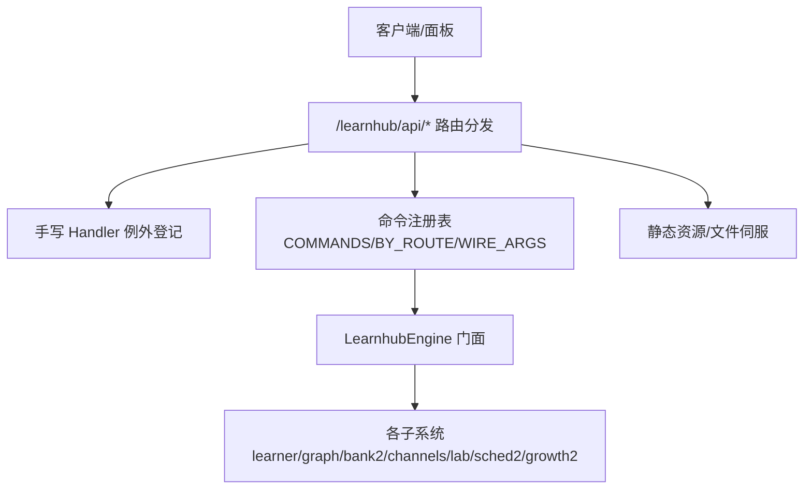
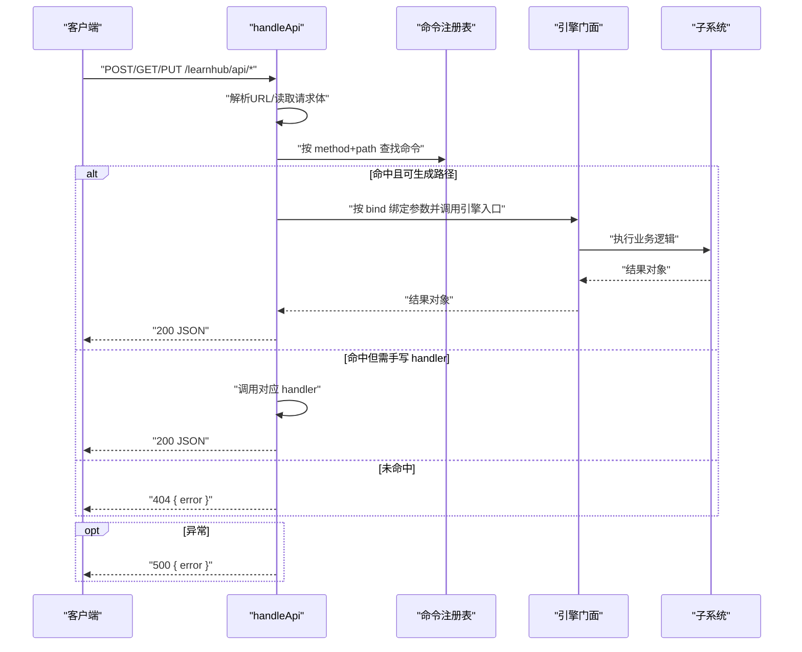
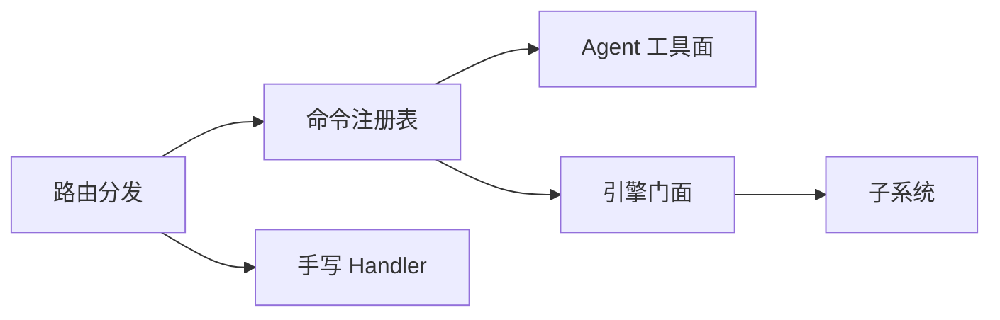

# API参考

<cite>
**本文引用的文件**
- [src/host/api.ts](file://src/host/api.ts)
- [src/host/handlers.ts](file://src/host/handlers.ts)
- [src/host/route-table.ts](file://src/host/route-table.ts)
- [src/host/http.ts](file://src/host/http.ts)
- [src/host/tools.ts](file://src/host/tools.ts)
- [src/commands/index.ts](file://src/commands/index.ts)
- [src/commands/types.ts](file://src/commands/types.ts)
- [src/tool-contracts.ts](file://src/tool-contracts.ts)
- [src/engine/index.ts](file://src/engine/index.ts)
- [src/engine/types.ts](file://src/engine/types.ts)
</cite>

## 目录
1. [简介](#简介)
2. [项目结构](#项目结构)
3. [核心组件](#核心组件)
4. [架构总览](#架构总览)
5. [详细组件分析](#详细组件分析)
6. [依赖关系分析](#依赖关系分析)
7. [性能与限流](#性能与限流)
8. [认证与安全](#认证与安全)
9. [故障排查](#故障排查)
10. [结论](#结论)
11. [附录：API 端点清单与数据模型](#附录api-端点清单与数据模型)

## 简介
本参考文档面向调用方，系统化说明本插件暴露的 Agent 工具函数、HTTP 面板端点以及共享数据模型。内容覆盖参数与返回格式、错误码约定、请求响应示例、版本兼容与迁移要点、SDK 集成方式、安全与限流策略，以及最佳实践建议。

## 项目结构
- 路由分发层：基于注册表的声明式路由（命令表）+ 手写 handler 例外登记，统一入口为 /learnhub/api/*。
- 引擎门面：LearnhubEngine 聚合各子系统（学习、图谱、题库、项目、通道、实验室等），所有写操作必须经门面。
- 工具面：Agent 工具通过 COMMAND_LIST 装配，schema 由 args 派生，execute 走生成路径或例外 handler。
- HTTP 基础能力：JSON 读写、静态资源伺服、MIME 白名单、KaTeX 注入等。

**图示来源**
- [src/host/api.ts:1-84](file://src/host/api.ts#L1-L84)
- [src/host/handlers.ts:101-742](file://src/host/handlers.ts#L101-L742)
- [src/commands/index.ts:25-71](file://src/commands/index.ts#L25-L71)
- [src/engine/index.ts:149-398](file://src/engine/index.ts#L149-L398)

**章节来源**
- [src/host/api.ts:1-84](file://src/host/api.ts#L1-L84)
- [src/commands/index.ts:25-71](file://src/commands/index.ts#L25-L71)
- [src/engine/index.ts:149-398](file://src/engine/index.ts#L149-L398)

## 核心组件
- 路由分发器 handleApi：解析 URL、读取 POST/PUT 体、按 method+path 查表命中命令；命中则按 bind 取参直调引擎或进入手写 handler；未命中返回 404；异常统一 500 并带可读消息。
- 命令注册表 COMMANDS：以 id 为键的对象，导出遍历列表、BY_ROUTE/WIRE_ARGS 索引，供 agent 工具与 panel 路由装配。
- 工具面 registerTools：将命令的 agent 通道装配为 defineTool，description=summary，parameters=sdkParameters(args)，execute 走生成路径或 tool-handlers。
- HTTP 基础：sendJson/readJson、FILE_MIME/ASSET_MIME、injectKatexIfMathed。

**章节来源**
- [src/host/api.ts:25-84](file://src/host/api.ts#L25-L84)
- [src/commands/index.ts:25-71](file://src/commands/index.ts#L25-L71)
- [src/host/tools.ts:72-126](file://src/host/tools.ts#L72-L126)
- [src/host/http.ts:12-55](file://src/host/http.ts#L12-L55)

## 架构总览

**图示来源**
- [src/host/api.ts:48-84](file://src/host/api.ts#L48-L84)
- [src/commands/index.ts:58-71](file://src/commands/index.ts#L58-L71)
- [src/host/handlers.ts:101-742](file://src/host/handlers.ts#L101-L742)

## 详细组件分析

### 路由分发与错误处理
- 精确匹配优先，其次前缀匹配（当前唯一前缀 GET /vendor/）。
- POST/PUT 先读体再查表，非法 JSON 未知路由仍 500 而非 404。
- 404 文案包含原始方法与剥前缀后的路由。
- 错误出口唯一：{ error: string } + 500；引擎业务错误原样透传。

**章节来源**
- [src/host/api.ts:25-84](file://src/host/api.ts#L25-L84)
- [src/host/route-table.ts:16-75](file://src/host/route-table.ts#L16-L75)

### 命令注册表与参数绑定
- 命令表以 id 为键，导出 COMMAND_LIST、BY_ROUTE、WIRE_ARGS。
- ChannelSpec 描述通道模式（agent/panel）、执行模型（sync/queued）、工具名、路由、bind、phase、required、log、prefix。
- sdkParameters 将 args 投影为 SDK parameters，剥离投递层扩展键 read。
- boundArgs 按 bind 顺序取同名键，null 表示传 undefined。

**章节来源**
- [src/commands/types.ts:54-129](file://src/commands/types.ts#L54-L129)
- [src/host/tools.ts:72-126](file://src/host/tools.ts#L72-L126)
- [src/commands/index.ts:25-71](file://src/commands/index.ts#L25-L71)

### 引擎门面与子系统
- LearnhubEngine 聚合 learner/graph/bank2/channels/lab/sched2/growth2 等子系统，所有写操作必须经门面。
- 构造时完成各子系统装配与端口注入（clock/rng/fs）。
- 提供 statusJson/recommend/doctor/rebuild 等 hub 方法，以及 loadView/locateNode 等通用能力。

**章节来源**
- [src/engine/index.ts:149-398](file://src/engine/index.ts#L149-L398)
- [src/engine/index.ts:410-463](file://src/engine/index.ts#L410-L463)
- [src/engine/index.ts:534-569](file://src/engine/index.ts#L534-L569)

### Agent 工具面
- 工具名称/描述/schema 来自命令注册表；execute 走生成路径或例外 handler。
- AGENT_GUIDE 提供工具使用提示与页面锚点。

**章节来源**
- [src/host/tools.ts:25-69](file://src/host/tools.ts#L25-L69)
- [src/host/tools.ts:101-126](file://src/host/tools.ts#L101-L126)

### HTTP 基础能力
- sendJson 统一响应序列化与缓存控制。
- readJson 读取并解析请求体。
- FILE_MIME/ASSET_MIME 限定可伺服的媒体类型。
- injectKatexIfMathed 在交互件 HTML 中按需注入 KaTeX。

**章节来源**
- [src/host/http.ts:12-55](file://src/host/http.ts#L12-L55)

## 依赖关系分析
- 路由分发依赖命令注册表与手写 handler 集合。
- 命令注册表依赖各域定义文件（学习/图谱/题库/项目/学习者产出/实验室/通道/维护）。
- 工具面依赖命令注册表与 runtime 执行封装。
- 引擎门面依赖各子系统与存储/时钟/随机源端口。

**图示来源**
- [src/host/api.ts:48-84](file://src/host/api.ts#L48-L84)
- [src/commands/index.ts:25-71](file://src/commands/index.ts#L25-L71)
- [src/host/tools.ts:101-126](file://src/host/tools.ts#L101-L126)
- [src/engine/index.ts:149-398](file://src/engine/index.ts#L149-L398)

**章节来源**
- [src/host/api.ts:48-84](file://src/host/api.ts#L48-L84)
- [src/commands/index.ts:25-71](file://src/commands/index.ts#L25-L71)
- [src/host/tools.ts:101-126](file://src/host/tools.ts#L101-L126)
- [src/engine/index.ts:149-398](file://src/engine/index.ts#L149-L398)

## 性能与限流
- 队列型任务：入队即返回，后台串行执行（如生成、出题、计划草案、里程碑、反编译、罗盘等）。
- 长耗时接口：冒烟测试、spike、质量评审等为同步阻塞到终态，需配合脚本长超时调用。
- 日志包装：apiRun 对多数面板路由进行运行日志包装，便于追踪耗时与失败原因。
- 并发限制：全局串行队列避免竞争；删除课程会清理相关任务记录。

**章节来源**
- [src/host/handlers.ts:181-249](file://src/host/handlers.ts#L181-L249)
- [src/host/handlers.ts:388-412](file://src/host/handlers.ts#L388-L412)
- [src/host/handlers.ts:607-615](file://src/host/handlers.ts#L607-L615)
- [src/host/handlers.ts:616-634](file://src/host/handlers.ts#L616-L634)

## 认证与安全
- 当前实现未内置鉴权中间件；调用方应在宿主侧部署网关/鉴权层（如 JWT/OAuth2）后再转发至 /learnhub/api。
- 静态资源访问受白名单限制（FILE_MIME/ASSET_MIME），交互件仅允许同源 vendor 库加载。
- 敏感操作（如生成、应用提案、删除课程）应结合宿主权限控制与审计日志。

**章节来源**
- [src/host/http.ts:12-24](file://src/host/http.ts#L12-L24)
- [src/host/handlers.ts:118-125](file://src/host/handlers.ts#L118-L125)

## 故障排查
- 404：未知路由，响应体含原始方法与路由信息。
- 500：参数校验失败或引擎异常，响应体为 { error: string }；参数错误会附加路由信息以便定位。
- 常见参数错误：
  - 题目数量必须为正整数。
  - apply/reject 的提案 id 必须为正整数。
  - 跳过方向 skipped 必须显式布尔。
  - 难度带偏好 band 仅接受 easy/standard/hard。
- 调试建议：
  - 检查请求体 JSON 合法性与字段类型。
  - 查看 apiRun 日志定位具体引擎调用。
  - 对长耗时任务关注队列状态与恢复入口。

**章节来源**
- [src/host/api.ts:53-84](file://src/host/api.ts#L53-L84)
- [src/tool-contracts.ts:11-55](file://src/tool-contracts.ts#L11-L55)
- [src/host/handlers.ts:181-249](file://src/host/handlers.ts#L181-L249)

## 结论
本插件通过“命令注册表 + 路由分发 + 引擎门面”的三层架构，实现了 Agent 工具与面板 HTTP 端点的统一装配与强约束。调用方应严格遵循参数契约、利用队列接口降低阻塞、结合宿主鉴权与审计保障安全，并在长耗时场景中采用异步轮询或脚本化调用。

## 附录：API 端点清单与数据模型

### HTTP 端点总览（/learnhub/api/*）
- 查询类
  - GET /status：系统状态与 LLM 配置视图
  - GET /courses：启用课程列表
  - GET /recommend：推荐事件
  - GET /file：Vault 内媒体文件
  - GET /vendor/*：vendored 库
  - GET /interactive：交互件
  - GET /note：笔记解析
  - GET /graph：图分析
  - GET /review-queue：复习队列
  - GET /probation：插入实验面
  - GET /experiments：实验模板/清单/报告
  - GET /generate/status：生成任务状态
  - GET /explain-pack：讲解上下文包
  - GET /anki/status：Anki 通道状态
  - GET /agent-guide：Agent 工具指南
  - GET /bank-cleanup：题库清理预览
- 写入/触发类
  - PUT /jol：JOL 抽查配置
  - PUT /calibration/hints：过信轻提示开关
  - PUT /sleep：睡眠建议开关
  - PUT /question-update：题目补丁
  - POST /habits/create/repeat/archive：习惯管理
  - POST /skills/archive/maintenance：技能归档与维护节拍
  - POST /rebuild：重建就绪清单
  - POST /node/skip/pin/complete：节点调度动作
  - POST /feedback：反馈提交
  - POST /proposals/apply/reject：提案统一应用/拒绝
  - POST /experiments/apply/stop：实验启停
  - POST /sandbox/run：沙盘推演
  - POST /generate/resume/section/course/reset：生成管线控制
  - POST /interactive/settle：交互件成绩结算
  - POST /tutor/explain-back/explain-feedback/explain-archive：对话与存档
  - POST /note-source/generate：笔记源出题
  - POST /anki/export/import：Anki 导入导出
  - POST /learner-rate/error-answer/error-generate/error-archive：学习与错题卡
  - POST /learner-add/learner-archive：学习者产出
  - POST /question-generate/review/question-answer/rate/forget/dispute/*：题库与判卷
  - POST /band-session：难度带会话日志
  - POST /question-add/archive/difficulty-advice-dismiss：题库管理
  - POST /course/delete：删除课程
  - POST /coach/growth/compass：教练回合与罗盘
  - POST /seed/propose：种子起草
  - POST /endpoint/add/remove：终点管理
  - POST /project/create/plan/generate/milestone/generate/decompile/exec：项目管理
  - POST /kata/save/convert/intention：周复盘

- 典型请求/响应示例（节选）
  - GET /status
    - 响应：包含 llm 配置与课程会话状态
  - POST /generate
    - 请求体：{ course, node, style? }
    - 响应：入队结果
  - POST /proposals/apply
    - 请求体：{ kind, id, ... }
    - 响应：应用结果（可能触发后续生长批）
  - POST /quality-review
    - 请求体：{ corpusDir?, stations?, badQuota?, okQuota?, repeats?, outDir?, systemic? }
    - 响应：评审报告

- 错误码
  - 404：未知路由，响应体 { error: "unknown route: METHOD PATH" }
  - 500：参数错误或引擎异常，响应体 { error: "..." }

**章节来源**
- [src/host/handlers.ts:101-742](file://src/host/handlers.ts#L101-L742)
- [src/host/api.ts:48-84](file://src/host/api.ts#L48-L84)

### Agent 工具函数
- 工具名称与描述来自命令注册表（例如 learnhub_pin_today、learnhub_graph_node、learnhub_question_audit 等）
- 参数 schema 由 args 派生，execute 走生成路径或例外 handler
- 工具指南 AGENT_GUIDE 提供页面锚点与提示语

**章节来源**
- [src/host/tools.ts:25-69](file://src/host/tools.ts#L25-L69)
- [src/host/tools.ts:72-126](file://src/host/tools.ts#L72-L126)

### 数据模型（部分）
- 阶段与内容状态：Stage、ContentStatus
- 笔记 frontmatter：Fm（含 fsrs、content、practice）
- 图节点：GNode（enc、bloom、difficulty、teaches/assumes/misconceptions）
- 课程注册表条目：CourseEntry
- 提案与状态：ProposalRec、PROPOSAL_KINDS、PROPOSAL_STATUSES
- 练习/复习流水：PracticeRec、ReviewRec
- 勘误冲正：ErratumRec
- N-of-1 实验：ExperimentDef、NOF1_VARIABLE_WHITELIST
- Vault 先验检索审计：VaultPriorAudit

**章节来源**
- [src/engine/types.ts:8-130](file://src/engine/types.ts#L8-L130)
- [src/engine/types.ts:132-200](file://src/engine/types.ts#L132-L200)
- [src/engine/types.ts:202-339](file://src/engine/types.ts#L202-L339)
- [src/engine/types.ts:340-369](file://src/engine/types.ts#L340-L369)

### 版本兼容与迁移指南
- 路由分发保持 v2 兼容：POST/PUT 先读体再查表、404 文案、错误出口唯一不变。
- 命令注册表驱动：新增/修改命令只需更新注册表，无需改动分发逻辑。
- 参数契约：tool-contracts 中的默认值与校验规则保持不变，调用方不得静默改写非法输入。
- 引擎门面：所有写操作必须经 LearnhubEngine，禁止绕过门面直写数据文件。

**章节来源**
- [src/host/api.ts:1-12](file://src/host/api.ts#L1-L12)
- [src/tool-contracts.ts:1-55](file://src/tool-contracts.ts#L1-L55)
- [src/engine/index.ts:1-10](file://src/engine/index.ts#L1-L10)

### SDK 使用与客户端集成
- Agent 工具：通过 defineTool 注册，参数 schema 由 args 派生，execute 自动序列化结果。
- 面板端点：遵循 WIRE_ARGS 的键名映射（camelCase→snake_case），按 CommandOutput 推导响应类型。
- 集成建议：
  - 使用宿主提供的 sendJson/readJson 规范请求/响应。
  - 对长耗时接口采用队列 + 轮询（/generate/status）。
  - 结合宿主鉴权与审计，确保敏感操作安全。

**章节来源**
- [src/commands/index.ts:54-71](file://src/commands/index.ts#L54-L71)
- [src/host/tools.ts:72-126](file://src/host/tools.ts#L72-L126)
- [src/host/http.ts:26-40](file://src/host/http.ts#L26-L40)

### 最佳实践
- 参数校验：严格遵循 tool-contracts 与 args 声明，缺失必填参数直接报错。
- 错误处理：捕获 404/500，解析 { error } 并展示给用户；对 500 记录路由与方法以便定位。
- 队列优先：能入队的操作一律入队，避免阻塞请求。
- 幂等性：对重复提交做去重（如交互件结算同日一次）。
- 安全：在宿主层实施鉴权与审计，限制敏感端点访问。

[无特定文件引用]