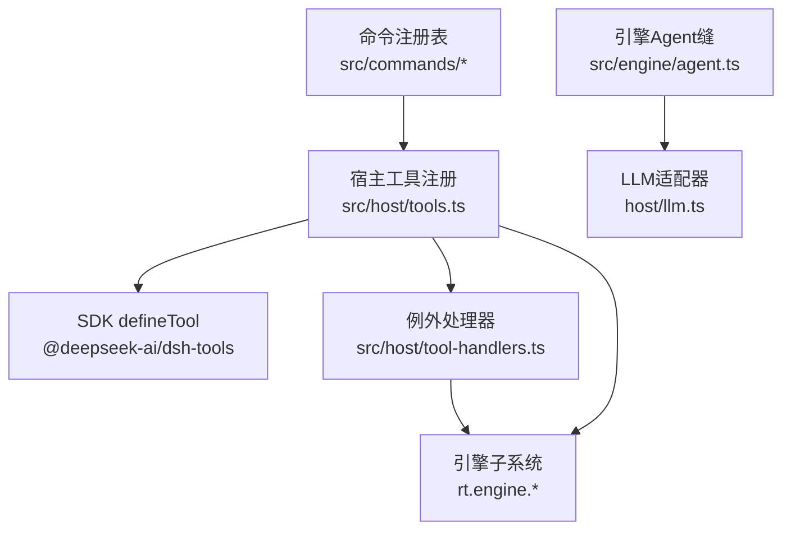
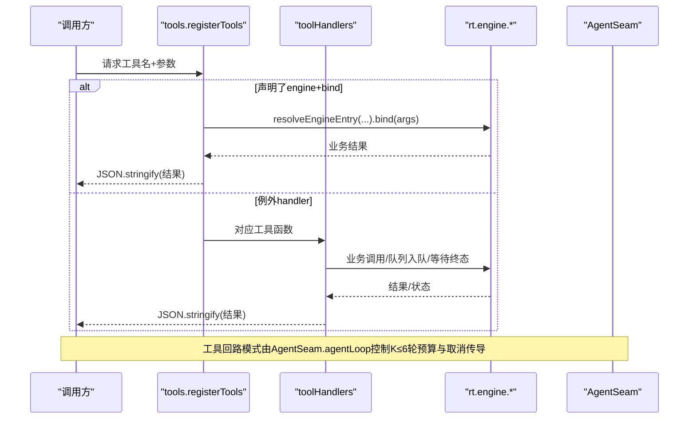
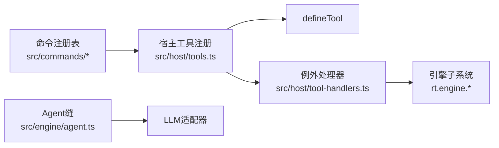

# Agent工具API

<cite>
**本文引用的文件**
- [src/host/tools.ts](file://src/host/tools.ts)
- [src/host/tool-handlers.ts](file://src/host/tool-handlers.ts)
- [src/engine/agent.ts](file://src/engine/agent.ts)
- [src/tool-contracts.ts](file://src/tool-contracts.ts)
- [src/commands/index.ts](file://src/commands/index.ts)
- [src/commands/types.ts](file://src/commands/types.ts)
- [src/commands/学习.ts](file://src/commands/学习.ts)
- [src/commands/图谱.ts](file://src/commands/图谱.ts)
- [src/commands/题库.ts](file://src/commands/题库.ts)
- [src/commands/项目.ts](file://src/commands/项目.ts)
- [src/engine/coach-tools.ts](file://src/engine/coach-tools.ts)
- [docs/adr/0082-retirement-boundary-beyond-reachability-gate.md](file://docs/adr/0082-retirement-boundary-beyond-reachability-gate.md)
</cite>

## 更新摘要
**变更内容**
- 移除了 `learnhub_project_decompile_apply` 工具（种子链退役的一部分）
- 更新了项目反编译功能说明，现在仅支持计划模式（plan-only），不再包含种子生成
- 调整了工具总数从112个到111个的统计信息
- 更新了相关的项目管理工具描述，强调计划修订驱动的教练补支流程

## 目录
1. [简介](#简介)
2. [项目结构](#项目结构)
3. [核心组件](#核心组件)
4. [架构总览](#架构总览)
5. [详细组件分析](#详细组件分析)
6. [依赖关系分析](#依赖关系分析)
7. [性能与约束](#性能与约束)
8. [故障排查指南](#故障排查指南)
9. [结论](#结论)
10. [附录：工具清单与调用示例](#附录工具清单与调用示例)

## 简介
本文件为 Agent 工具 API 的权威文档，覆盖全部可调用工具的接口规范、参数校验规则、返回值格式与错误处理机制。系统通过"命令注册表 + 双通道（agent/panel）"统一装配，Agent 侧以工具面暴露能力；其中 **111 个工具**由声明驱动或例外 handler 实现，参数校验集中在显式解析器中，确保强契约与可观测性。

**重要更新**：随着种子链退役（#256），`learnhub_project_decompile_apply` 联合工具已移除，项目反编译功能现在仅支持计划模式（plan-only），新知识需要通过计划修订驱动的教练补支流程产生。

## 项目结构
- 命令注册表集中定义所有端点（含 agent 工具），按域拆分文件并装配到单一入口。
- 宿主层负责将声明映射为 SDK defineTool 的工具实例，并为无法走生成路径的工具提供例外 handler。
- 引擎层提供 AgentSeam 统一 LLM 交互缝，包含单发补全、门错修复轮与有界工具回路。
- 参数校验器集中管理必填、枚举、范围等规则，避免静默改写非法输入。

**图表来源**
- [src/commands/index.ts:25-72](file://src/commands/index.ts#L25-L72)
- [src/host/tools.ts:101-126](file://src/host/tools.ts#L101-L126)
- [src/host/tool-handlers.ts:23-287](file://src/host/tool-handlers.ts#L23-L287)
- [src/engine/agent.ts:85-221](file://src/engine/agent.ts#L85-L221)

**章节来源**
- [src/commands/index.ts:1-72](file://src/commands/index.ts#L1-L72)
- [src/host/tools.ts:1-126](file://src/host/tools.ts#L1-L126)
- [src/host/tool-handlers.ts:1-288](file://src/host/tool-handlers.ts#L1-L288)
- [src/engine/agent.ts:1-227](file://src/engine/agent.ts#L1-L227)

## 核心组件
- 命令注册表：集中声明所有命令（id、summary、args、engine、channels 等），并按域拆分。
- 宿主工具注册：遍历 COMMAND_LIST，为每个 agent 通道注册 defineTool；若未声明 engine/bind，则走例外 handler。
- 例外处理器：对需要形状加工或实参换算的工具提供具体执行逻辑，统一通过 run(rt, tool, ...) 包装。
- Agent 缝：封装 complete/repair/agentLoop，提供工具预算上限、取消传导、轨迹记录与围栏剥离。
- 参数校验器：requireSkipDirection、questionCount、applyId、rejectId、graphKind、bandPref 等集中校验。

**章节来源**
- [src/commands/types.ts:50-129](file://src/commands/types.ts#L50-L129)
- [src/host/tools.ts:72-126](file://src/host/tools.ts#L72-L126)
- [src/host/tool-handlers.ts:23-287](file://src/host/tool-handlers.ts#L23-L287)
- [src/engine/agent.ts:28-221](file://src/engine/agent.ts#L28-L221)
- [src/tool-contracts.ts:9-55](file://src/tool-contracts.ts#L9-L55)

## 架构总览
Agent 工具调用流程分为两条路径：
- 生成路径：命令声明了 engine 与 bind，宿主在注册时直接绑定引擎入口，execute 内通过 run 包装并 JSON.stringify 返回。
- 例外路径：未声明 engine/bind 的命令进入 toolHandlers，内部进行参数转换、业务编排与结果序列化。

**图表来源**
- [src/host/tools.ts:101-126](file://src/host/tools.ts#L101-L126)
- [src/host/tool-handlers.ts:23-287](file://src/host/tool-handlers.ts#L23-L287)
- [src/engine/agent.ts:122-186](file://src/engine/agent.ts#L122-L186)

## 详细组件分析

### 工具注册机制与扩展方式
- 注册入口：registerTools(ctx, rt) 遍历 COMMAND_LIST，查找 channel='agent' 且存在 tool 的命令。
- 生成路径：若命令声明了 engine 与 bind，则 execute 使用 boundArgs 按顺序取同名键，调用引擎入口并 JSON.stringify。
- 例外路径：否则从 toolHandlers 取对应函数执行。
- 参数投影：sdkParameters 将 CommandSpec.args 转换为 SDK 的 ParameterSchemaSpec，剥除投递层扩展键（如 read）。
- 扩展方式：新增工具只需在对应域的 commands/*.ts 中添加 command(...) 声明；如需特殊处理，则在 tool-handlers.ts 添加 handler。

**章节来源**
- [src/host/tools.ts:72-126](file://src/host/tools.ts#L72-L126)
- [src/commands/types.ts:50-129](file://src/commands/types.ts#L50-L129)

### 参数校验器实现细节
- requireSkipDirection：必须显式布尔值，省略即报错。
- questionCount：缺省使用默认值；给出时必须为正整数。
- applyId：缺省表示最新 pending；给出时必须为正整数。
- rejectId：拒绝操作必须显式正整数。
- graphKind：仅允许 edit/seed/enrich，其余值当场拒绝。
- bandPref：仅 easy/standard/hard，非法或缺省视为 undefined。

**章节来源**
- [src/tool-contracts.ts:9-55](file://src/tool-contracts.ts#L9-L55)

### Agent 回路与预算控制
- 单发模式：complete 直接返回文本（自动剥离代码围栏）。
- 门错修复轮：gateRepairRound 保证最多一次修复尝试，失败抛死因。
- 工具回路：agentLoop 限制 K≤6 轮工具调用，每轮前检查取消旗标，轨迹逐轮记录，最终返回文本与轨迹摘要。

**章节来源**
- [src/engine/agent.ts:28-221](file://src/engine/agent.ts#L28-L221)

### 教练工具白名单与只读约束
- 白名单：graph_view、node_card、concept_registry、behavior_digest、bank_overview、compass_read、endpoint_anchor。
- 执行器：coachToolExecutor 仅分发只读视图，白名单外调用 fail loud，并以 isError 回灌模型可见拒收原因。
- 用途：用于教练裁决前的数据核实，不写盘、不入队。

**章节来源**
- [src/engine/coach-tools.ts:30-35](file://src/engine/coach-tools.ts#L30-35)
- [src/engine/coach-tools.ts:248-297](file://src/engine/coach-tools.ts#L248-297)

### 项目反编译功能更新（种子链退役）
**重要变更**：随着 #256 种子链退役，项目反编译功能已从双产物模式（计划 + 种子）简化为纯计划模式。

- **移除的工具**：`learnhub_project_decompile_apply` 联合工具已完全移除
- **新的工作流程**：
  - 反编译仅产出里程碑计划草案（project_plan 提案）
  - 课程必须预先注册（不再自动创建课程）
  - 新知识通过计划修订驱动的教练补支流程产生
  - 应用时使用 `learnhub_project_apply` 而非联合入口
- **验证规则**：计划中的节点引用必须解析到目标课程的既有图节点名

**章节来源**
- [docs/adr/0082-retirement-boundary-beyond-reachability-gate.md:1-35](file://docs/adr/0082-retirement-boundary-beyond-reachability-gate.md#L1-L35)
- [src/commands/项目.ts:73-97](file://src/commands/项目.ts#L73-L97)

## 依赖关系分析
- 命令注册表 → 宿主工具注册 → SDK defineTool
- 宿主工具注册 → 引擎子系统（rt.engine.*）
- 例外处理器 → 引擎子系统 + 队列任务（jobs）
- Agent 缝 → LLM 适配器（stream/complete/onCall）

**图表来源**
- [src/commands/index.ts:25-72](file://src/commands/index.ts#L25-L72)
- [src/host/tools.ts:101-126](file://src/host/tools.ts#L101-L126)
- [src/host/tool-handlers.ts:23-287](file://src/host/tool-handlers.ts#L23-L287)
- [src/engine/agent.ts:85-221](file://src/engine/agent.ts#L85-L221)

**章节来源**
- [src/commands/index.ts:1-72](file://src/commands/index.ts#L1-L72)
- [src/host/tools.ts:1-126](file://src/host/tools.ts#L1-L126)
- [src/host/tool-handlers.ts:1-288](file://src/host/tool-handlers.ts#L1-L288)
- [src/engine/agent.ts:1-227](file://src/engine/agent.ts#L1-L227)

## 性能与约束
- 工具回路预算：K≤6 轮，防止自激循环；超出预算立即中止。
- 取消传导：每轮底层调用前与每次工具执行后检查 isCancelled，true 则抛错中止并丢弃已产结果。
- 输出形态：所有工具统一 JSON.stringify 字符串输出，便于上层消费与日志追踪。
- 列表视图上限：教练工具中的图名预览与列表渲染设置上限，防膨胀。

**章节来源**
- [src/engine/agent.ts:36-38](file://src/engine/agent.ts#L36-L38)
- [src/engine/agent.ts:122-186](file://src/engine/agent.ts#L122-L186)
- [src/engine/coach-tools.ts:37-44](file://src/engine/coach-tools.ts#L37-L44)

## 故障排查指南
- 参数错误：常见于 requireSkipDirection/questionCount/applyId/rejectId/graphKind/bandPref 校验失败，抛出明确错误信息。
- 白名单外工具：教练工具白名单外调用会被拒绝，错误信息会原样回灌给模型。
- 队列任务终态：出题/罗盘等队列型工具需等待终态，cancelled/非 done 状态需按消息处理。
- 门禁错误：部分流程使用 gate 错误码（如 GATE_FAILED），调用方可据此定位问题。
- **反编译相关错误**：如果尝试使用已退役的 `learnhub_project_decompile_apply` 工具，将收到工具不存在错误；项目反编译现在仅支持 plan-only 模式。

**章节来源**
- [src/tool-contracts.ts:9-55](file://src/tool-contracts.ts#L9-L55)
- [src/host/tool-handlers.ts:82-99](file://src/host/tool-handlers.ts#L82-L99)
- [src/engine/coach-tools.ts:248-297](file://src/engine/coach-tools.ts#L248-297)

## 结论
本系统通过"声明驱动 + 例外处理器"的双轨制，既保证了工具契约的一致性与类型安全，又保留了复杂场景的灵活性。Agent 缝提供了统一的 LLM 交互模型与严格的预算控制，参数校验器确保输入合法性。整体架构清晰、可扩展性强，适合大规模工具生态演进。

**重要更新**：随着种子链退役，项目管理工作流已简化为计划驱动模式，消除了复杂的种子生成逻辑，使系统更加专注于核心的学习计划制定和执行跟踪功能。

## 附录：工具清单与调用示例
说明：以下列出所有 agent 通道的工具名、用途、关键参数与典型调用示例（JSON 形式）。实际签名与返回结构以命令声明与引擎入口为准。

### 学习与复习工具
- learnhub_status
  - 用途：查看系统状态与 LLM 视图
  - 参数：无
  - 示例：{}
  - 返回：状态 JSON

- learnhub_skip
  - 用途：跳过/取消跳过节点
  - 参数：course, node, skipped(boolean)
  - 示例：{"course":"数学","node":"函数","skipped":true}
  - 返回：调度结果 JSON

- learnhub_complete
  - 用途：确认节点本轮学会
  - 参数：course, node, force?
  - 示例：{"course":"数学","node":"函数","force":false}
  - 返回：完成结果 JSON

- learnhub_recommend
  - 用途：获取推荐列表
  - 参数：limit?
  - 示例：{"limit":5}
  - 返回：推荐列表 JSON

- learnhub_pin_today / learnhub_unpin / learnhub_goal_intention
  - 用途：今日置顶/取消/挂执行意图
  - 参数：course, node, cue?, action?
  - 示例：{"course":"数学","node":"函数","cue":"晚饭后","action":"学完它"}
  - 返回：操作结果 JSON

### 笔记与知识管理工具
- learnhub_note_source_exclude / learnhub_note_source_unexclude
  - 用途：笔记源排除/恢复
  - 参数：path
  - 示例：{"path":"./notes/a.md"}
  - 返回：操作结果 JSON

- learnhub_note_resolve
  - 用途：笔记路径解析到课程/节点
  - 参数：path
  - 示例：{"path":"./notes/a.md"}
  - 返回：归属信息 JSON

### 图谱浏览工具
- learnhub_graph_node / learnhub_graph_browse / learnhub_graph_path
  - 用途：节点深查/浏览/先修链查询
  - 参数：course, node/region/block/from/to
  - 示例：{"course":"数学","node":"函数"}
  - 返回：图信息 JSON

### 题库管理工具
- learnhub_question_audit / learnhub_question_get / learnhub_bank_cleanup
  - 用途：题库体检/读题/清理归档
  - 参数：course?, node?, qid?, apply?
  - 示例：{"course":"数学","apply":false}
  - 返回：审计/清理结果 JSON

- learnhub_question_generate / learnhub_question_update
  - 用途：出题/更新题目
  - 参数：course, node, count?, qid, patch
  - 示例：{"course":"数学","node":"函数","count":6}
  - 返回：任务结果/更新结果 JSON

### 数据检查与重建工具
- learnhub_content_check / learnhub_data_check / learnhub_rebuild
  - 用途：正文质检/数据体检/重建就绪清单
  - 参数：course?
  - 示例：{}
  - 返回：结果 JSON

### 技能与执行日志工具
- learnhub_skill_create / learnhub_execution_log / learnhub_receipt_submit / learnhub_receipt_list / learnhub_receipt_review_mode
  - 用途：技能条目/执行事件/回执提交与评审
  - 参数：skill/source/rating/evidence/note/kind/material/mode
  - 示例：{"skill":"钢琴","source":"练习","minutes":40,"rating":3}
  - 返回：操作结果 JSON

### 项目管理工具（已更新）
- learnhub_project_milestone_pass / learnhub_project_milestone_recall / learnhub_project_enc_candidates
  - 用途：里程碑结算/回溯/成分边候选推断
  - 参数：id, milestone, nodes?, limit?, window_days?, min_co?
  - 示例：{"id":"p1","milestone":"m1"}
  - 返回：结果 JSON

- learnhub_project_decompile
  - 用途：目标反编译（**计划模式**）- 仅生成里程碑计划草案
  - 参数：id, goal?, course, notes?
  - 示例：{"id":"p1","goal":"掌握吉他弹唱","course":"吉他"}
  - 返回：计划提案 JSON
  - **注意**：不再包含种子生成，仅产出计划草案

- learnhub_project_*（create/list/plan/generate/apply/exec_log）
  - 用途：项目管理全流程（**已移除 decompile_apply**）
  - 参数：id/name/goal/tier/nodes/limit 等
  - 示例：{"name":"练琴计划","goal":"掌握和弦"}
  - 返回：项目状态/结果 JSON

### 解释与反馈工具
- learnhub_explain_back_pack / learnhub_explain_feedback
  - 用途：解释包/反馈
  - 参数：course, node, transcript
  - 示例：{"course":"数学","node":"函数","transcript":"..."}
  - 返回：结果 JSON

### 学习者卡片工具
- learnhub_learner_card_add / learnhub_learner_card_archive / learnhub_understanding_add
  - 用途：学习者卡片/理解笔记增删归档
  - 参数：course, node, content, kind?, prompt?, section?
  - 示例：{"course":"数学","node":"函数","content":"我的理解..."}
  - 返回：结果 JSON

### 错题卡工具
- learnhub_error_card_generate / learnhub_error_card_archive
  - 用途：错题卡生成/归档
  - 参数：course, node?, max?, card, archived?
  - 示例：{"course":"数学","max":10}
  - 返回：结果 JSON

### 习惯工具
- learnhub_habit_*（create/list/repeat/archive）
  - 用途：习惯创建/重复/归档
  - 参数：habit/cue/action/auto_rating/note
  - 示例：{"name":"晨读","cue":"起床","action":"读10分钟"}
  - 返回：结果 JSON

###  kata 工具
- learnhub_kata_save / learnhub_kata_convert_intention
  - 用途：kata 保存/意图转换
  - 参数：week_start, answers/course/node/cue/action
  - 示例：{"week_start":"2026-09-14","answers":{"a":"b"}}
  - 返回：结果 JSON

### 实验工具
- learnhub_experiment_templates / learnhub_experiment_apply
  - 用途：实验模板/应用
  - 参数：id?
  - 示例：{}
  - 返回：结果 JSON

### 恒温器与沙箱工具
- learnhub_thermostat / learnhub_sandbox
  - 用途：恒温器/沙箱推演
  - 参数：minutes_per_day, weeks?, course?, nodes?
  - 示例：{"minutes_per_day":30,"weeks":2}
  - 返回：结果 JSON

### 笔记源工具
- learnhub_note_source_list / learnhub_note_source_generate
  - 用途：笔记源列表/生成题目
  - 参数：id, count?
  - 示例：{"id":"ns1","count":6}
  - 返回：结果 JSON

### Anki 工具
- learnhub_anki_export / learnhub_anki_import / learnhub_anki_status
  - 用途：Anki 导出/导入/状态
  - 参数：endpoint?
  - 示例：{}
  - 返回：结果 JSON

### 课程管理工具
- learnhub_probation / learnhub_course_reset / learnhub_course_delete
  - 用途：观察期/重置课程/删除课程
  - 参数：action/course
  - 示例：{"action":"status"}
  - 返回：结果 JSON

### 优化工具
- learnhub_optimize_params
  - 用途：优化 FSRS 参数
  - 参数：无
  - 示例：{}
  - 返回：结果 JSON

### 罗盘工具
- learnhub_compass_paint
  - 用途：绘制/重绘罗盘路线（队列任务）
  - 参数：course?
  - 示例：{"course":"数学"}
  - 返回：任务状态 JSON

**重要提示**：
- 所有工具均通过 JSON 字符串返回结果，便于上层解析。
- 参数校验失败会抛出明确错误，调用方应捕获并提示用户修正。
- 队列型工具（如出题、罗盘）需关注任务终态与取消信号。
- **项目反编译工具现已改为计划模式**，不再包含种子生成功能。

**章节来源**
- [src/host/tool-handlers.ts:23-287](file://src/host/tool-handlers.ts#L23-L287)
- [src/host/tools.ts:25-69](file://src/host/tools.ts#L25-L69)
- [src/commands/学习.ts:1-200](file://src/commands/学习.ts#L1-L200)
- [src/commands/图谱.ts:1-200](file://src/commands/图谱.ts#L1-L200)
- [src/commands/题库.ts:1-200](file://src/commands/题库.ts#L1-L200)
- [src/commands/项目.ts:1-400](file://src/commands/项目.ts#L1-L400)