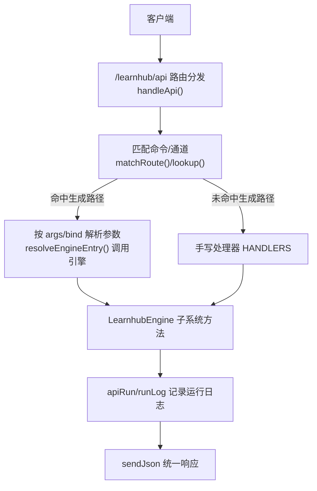
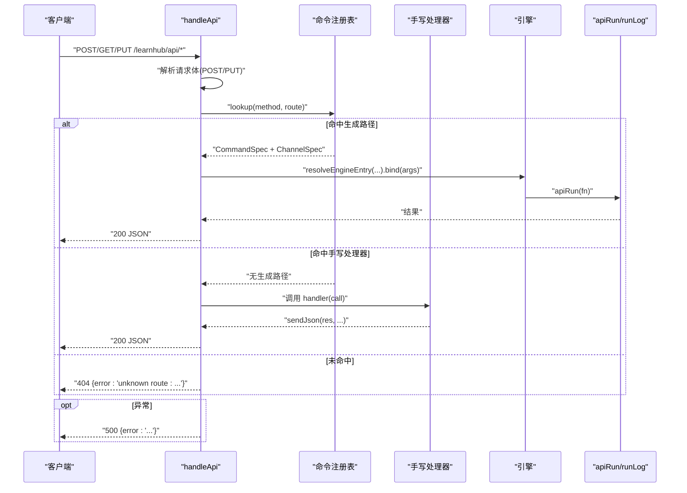
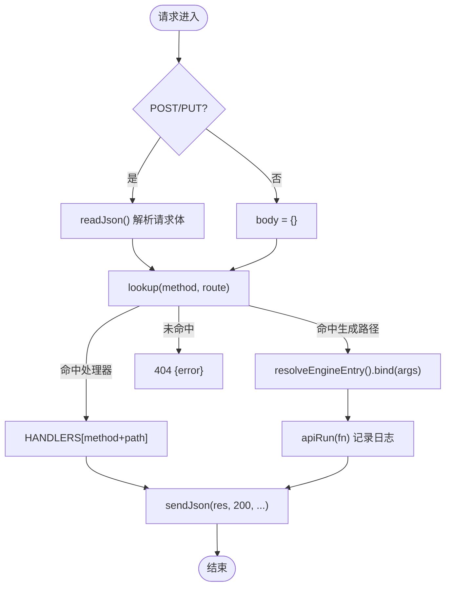
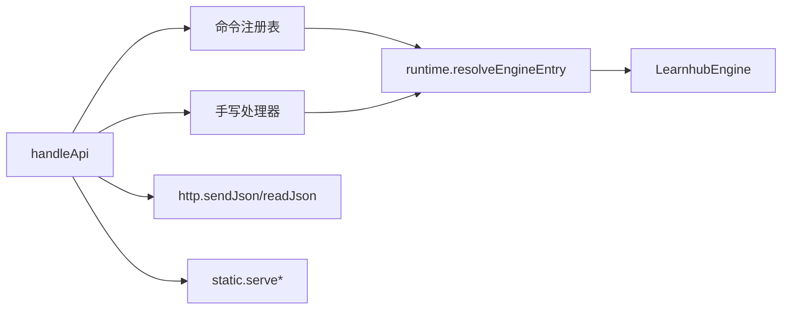

# HTTP端点API

<cite>
**本文引用的文件**
- [src/host/api.ts](file://src/host/api.ts)
- [src/host/handlers.ts](file://src/host/handlers.ts)
- [src/host/http.ts](file://src/host/http.ts)
- [src/host/route-table.ts](file://src/host/route-table.ts)
- [src/host/runtime.ts](file://src/host/runtime.ts)
- [src/commands/index.ts](file://src/commands/index.ts)
- [src/commands/types.ts](file://src/commands/types.ts)
- [tests/fixtures/host-routes-baseline.json](file://tests/fixtures/host-routes-baseline.json)
</cite>

## 目录
1. [简介](#简介)
2. [项目结构](#项目结构)
3. [核心组件](#核心组件)
4. [架构总览](#架构总览)
5. [详细组件分析](#详细组件分析)
6. [依赖分析](#依赖分析)
7. [性能与限流](#性能与限流)
8. [故障排查指南](#故障排查指南)
9. [结论](#结论)
10. [附录：路由表与请求响应示例](#附录路由表与请求响应示例)

## 简介
本文件为学习平台插件的 HTTP 端点 API 完整文档。内容覆盖所有 RESTful 接口的 URL、HTTP 方法、请求参数、响应格式与状态码；说明认证授权与安全考虑；提供请求/响应示例（成功与失败）；描述路由表组织与中间件处理流程；给出客户端集成指南与 SDK 使用建议；记录版本管理与向后兼容策略；并总结限流策略与性能限制。

## 项目结构
- 路由前缀：所有面板 API 统一以 /learnhub/api 开头。
- 分发机制：采用“注册表驱动 + 手写处理器例外”的双通道模式。命令注册表声明每个端点的参数 schema、引擎入口与路由映射；未命中生成路径的请求由 handlers.ts 中的手写处理器承接。
- 技术层：http.ts 提供 JSON 读写与静态资源 MIME 类型；runtime.ts 提供运行时上下文、运行日志与引擎调用封装；route-table.ts 定义路由项结构与构造器。



图表来源
- [src/host/api.ts:48-83](file://src/host/api.ts#L48-L83)
- [src/commands/index.ts:58-71](file://src/commands/index.ts#L58-L71)
- [src/host/runtime.ts:198-253](file://src/host/runtime.ts#L198-L253)
- [src/host/http.ts:26-40](file://src/host/http.ts#L26-L40)

章节来源
- [src/host/api.ts:25-83](file://src/host/api.ts#L25-L83)
- [src/host/http.ts:1-55](file://src/host/http.ts#L1-L55)
- [src/host/route-table.ts:1-75](file://src/host/route-table.ts#L1-L75)
- [src/host/runtime.ts:1-255](file://src/host/runtime.ts#L1-L255)
- [src/commands/index.ts:1-72](file://src/commands/index.ts#L1-L72)

## 核心组件
- 路由分发 handleApi：负责读取 POST/PUT 请求体、查找命令与通道、执行生成路径或派发至手写处理器，统一错误出口。
- 命令注册表 COMMANDS/WIRE_ARGS/BY_ROUTE：集中声明所有端点的参数 schema、引擎入口、路由与方法，支撑 UI 类型派生与测试对账。
- 手写处理器 handlers：承载无法走生成路径的复杂逻辑（队列、多分支、领域负载等）。
- 运行时 runtime：封装引擎调用、运行日志、任务注册表与标志位，保证可测性与可观测性。
- HTTP 工具 http：JSON 序列化/反序列化、MIME 白名单、KaTeX 注入等。

章节来源
- [src/host/api.ts:48-83](file://src/host/api.ts#L48-L83)
- [src/commands/index.ts:25-71](file://src/commands/index.ts#L25-L71)
- [src/host/handlers.ts:101-741](file://src/host/handlers.ts#L101-L741)
- [src/host/runtime.ts:115-253](file://src/host/runtime.ts#L115-L253)
- [src/host/http.ts:12-55](file://src/host/http.ts#L12-L55)

## 架构总览
- 请求进入 /learnhub/api/* 后，先剥离前缀得到 route。
- 若为 POST/PUT，先解析请求体（即使路由未命中也会读体），再查表。
- 精确匹配优先，其次前缀匹配（如 /vendor/）。
- 命中生成路径：按命令 args 与通道 bind 解析参数，调用 resolveEngineEntry 绑定并执行引擎方法，返回结果。
- 未命中生成路径：查找对应的手写处理器键（method + path），执行后返回。
- 未命中任何路由：返回 404，错误体包含原始方法与路由。
- 异常统一捕获：参数守卫错误附加路由信息，业务错误原样透传，统一以 500 + { error } 返回。



图表来源
- [src/host/api.ts:48-83](file://src/host/api.ts#L48-L83)
- [src/host/runtime.ts:240-253](file://src/host/runtime.ts#L240-L253)

## 详细组件分析

### 路由表与命令注册
- 路由表项 RouteSpec：包含 method、route、handler、可选 prefix，以及预留的命令注册字段位（id/summary/args/engine/output/channels）。
- 命令 CommandSpec：集中声明 id、summary、args、engine、output、domain、channels；channels 指定 agent/panel 通道、同步/队列模式、路由、阶段、bind、必填清单、是否记日志等。
- 装配索引：BY_ROUTE 将 “METHOD PATH” 映射到命令，WIRE_ARGS 维护面板通道的参数键名权威表，用于前端 camelCase→snake_case 转换。

```mermaid
classDiagram
class RouteSpec {
+string method
+string route
+boolean prefix
+function handler
}
class CommandSpec {
+string id
+string summary
+ParameterSchemaSpec args
+string engine
+any output
+string domain
+ChannelSpec[] channels
}
class ChannelSpec {
+string channel
+string mode
+string tool
+{method,path} route
+GenJobPhase phase
+string[] bind
+string[] required
+boolean prefix
+boolean log
}
RouteSpec <.. CommandSpec : "预留字段位"
```

图表来源
- [src/host/route-table.ts:16-75](file://src/host/route-table.ts#L16-L75)
- [src/commands/types.ts:54-129](file://src/commands/types.ts#L54-L129)
- [src/commands/index.ts:58-71](file://src/commands/index.ts#L58-L71)

章节来源
- [src/host/route-table.ts:1-75](file://src/host/route-table.ts#L1-L75)
- [src/commands/types.ts:1-129](file://src/commands/types.ts#L1-L129)
- [src/commands/index.ts:1-72](file://src/commands/index.ts#L1-L72)

### 请求/响应与状态码约定
- 成功：200 + JSON 响应体（引擎对象原样透传，由 sendJson 统一序列化一次）。
- 未找到路由：404 + { error: "unknown route: METHOD PATH" }。
- 参数校验失败：500 + { error: "中文消息（路由 METHOD PATH）" }。
- 其他异常：500 + { error: "引擎错误或业务错误" }。

章节来源
- [src/host/api.ts:48-83](file://src/host/api.ts#L48-L83)
- [src/host/http.ts:26-40](file://src/host/http.ts#L26-L40)

### 认证与授权
- 当前实现中未发现统一的鉴权中间件或令牌校验逻辑。
- 安全建议：
  - 在宿主入口处增加鉴权中间件（如基于会话/令牌的身份校验）。
  - 对写操作（POST/PUT）进行权限控制（角色/课程级访问控制）。
  - 对敏感接口（如 Anki 导入导出、批量评审）增加二次确认或审计日志。
  - 限制跨域与 CSP（静态资源已做同源限制，交互件沙箱有额外约束）。

章节来源
- [src/host/static.ts:1-200](file://src/host/static.ts#L1-L200)
- [src/host/http.ts:17-24](file://src/host/http.ts#L17-L24)

### 中间件与处理流程
- 请求体解析：POST/PUT 一律先读体，再查表，确保未知路由也返回 500（而非静默 404）。
- 路由匹配：精确匹配优先，其次前缀匹配（/vendor/）。
- 生成路径：按 args/bind 解析参数，调用引擎方法，通过 apiRun 记录运行日志。
- 手写处理器：复杂逻辑（队列、多分支、领域负载）在此实现。
- 错误出口：统一 catch，ParamError 附加路由信息，其他错误原样透传。



图表来源
- [src/host/api.ts:48-83](file://src/host/api.ts#L48-L83)
- [src/host/http.ts:34-40](file://src/host/http.ts#L34-L40)
- [src/host/runtime.ts:240-253](file://src/host/runtime.ts#L240-L253)

章节来源
- [src/host/api.ts:48-83](file://src/host/api.ts#L48-L83)
- [src/host/handlers.ts:101-741](file://src/host/handlers.ts#L101-L741)

### 关键端点分类与说明
以下为常用端点类别与职责概览（具体参数以命令注册表与处理器为准）：
- 状态与查询类 GET：/status、/courses、/recommend、/graph、/review-queue、/probation、/experiments、/generate/status、/explain-pack、/anki/status、/agent-guide、/bank-cleanup 等。
- 文件与静态资源：/file（vault 媒体）、/vendor/（vendored 库）、/interactive（交互件 HTML）。
- 笔记与内容：/note（解析笔记）、/feedback（提交反馈）。
- 学习与复习：/tutor、/explain-back、/explain-feedback、/explain-archive、/learner-rate、/question-answer、/question-rate、/question-forget、/band-session、/learner-add、/learner-archive。
- 题库管理：/question-generate、/question-add、/question-archive、/error-answer、/error-generate、/error-archive、/difficulty-advice-dismiss。
- 提案与图谱：/proposals/apply、/proposals/reject、/endpoint/add、/endpoint/remove。
- 生成与队列：/generate、/generate/resume、/generate/section、/course/reset、/generate/cancel。
- 教练与生长：/coach/growth、/coach/compass。
- 项目：/project/create、/project/plan/generate、/project/milestone/generate、/project/decompile、/project/exec。
- 实验与沙盘：/sandbox/run、/experiments/apply、/experiments/stop。
- Anki 互通：/anki/export、/anki/import。
- 习惯与技能：/habits/create、/habits/repeat、/habits/archive、/skills/archive、/skills/maintenance。
- 周复盘：/kata/save、/kata/convert/intention。
- 配置开关：/jol、/calibration/hints、/sleep、/rebuild。

章节来源
- [src/host/handlers.ts:101-741](file://src/host/handlers.ts#L101-L741)
- [tests/fixtures/host-routes-baseline.json:1-800](file://tests/fixtures/host-routes-baseline.json#L1-L800)

### 请求/响应示例（成功与失败）
- 成功示例（GET /status）
  - 请求：GET /learnhub/api/status
  - 响应：200 + JSON（包含引擎状态与 LLM 配置摘要）
- 成功示例（POST /generate）
  - 请求：POST /learnhub/api/generate，body 含 course、node、可选 style
  - 响应：200 + JSON（入队结果）
- 失败示例（未知路由）
  - 请求：POST /learnhub/api/unknown
  - 响应：404 + { error: "unknown route: POST /unknown" }
- 失败示例（参数校验失败）
  - 请求：POST /learnhub/api/question-generate，缺少必填字段
  - 响应：500 + { error: "缺少必填参数：<key>（路由 POST /question-generate）" }

章节来源
- [src/host/api.ts:48-83](file://src/host/api.ts#L48-L83)
- [src/host/handlers.ts:388-403](file://src/host/handlers.ts#L388-L403)

## 依赖分析
- 路由分发依赖命令注册表（COMMANDS、BY_ROUTE、WIRE_ARGS）与手写处理器（HANDLERS）。
- 生成路径依赖 runtime.resolveEngineEntry 与 apiRun，确保引擎方法正确绑定与运行日志记录。
- 静态资源与文件服务依赖 http.ts 的 MIME 白名单与 static.ts 的路径限制。
- 队列与任务依赖 jobs.ts（生成任务注册表、恢复、取消、重拉批等）。



图表来源
- [src/host/api.ts:48-83](file://src/host/api.ts#L48-L83)
- [src/host/runtime.ts:198-253](file://src/host/runtime.ts#L198-L253)
- [src/host/http.ts:26-40](file://src/host/http.ts#L26-L40)

章节来源
- [src/host/api.ts:48-83](file://src/host/api.ts#L48-L83)
- [src/host/runtime.ts:198-253](file://src/host/runtime.ts#L198-L253)

## 性能与限流
- 队列化任务：生成、出题、计划/里程碑草案、反编译等通过队列后台串行执行，HTTP 立即返回，避免阻塞请求。
- 节流与会话触点：/status 内触发 sessionStartCheckpoint，面板打开/轮询共用入口，具备 30 分钟节流语义。
- 并发与泵：HostFlags.pumping 控制生成泵单并发闸；队列空闲时自动触发教练回合就绪检查与复诊结算。
- 日志与可观测性：apiRun 记录每次引擎调用的输出摘要；AgentSeam 记录 LLM 调用详情（站点、模式、耗时、字符数、token 用量）。
- 限流策略：当前未见全局速率限制中间件；建议在宿主入口或网关层增加基于 IP/用户/接口的限流策略，并对长耗时接口设置超时保护。

章节来源
- [src/host/handlers.ts:101-107](file://src/host/handlers.ts#L101-L107)
- [src/host/runtime.ts:105-113](file://src/host/runtime.ts#L105-L113)
- [src/host/runtime.ts:170-182](file://src/host/runtime.ts#L170-L182)
- [src/host/jobs.ts:713-735](file://src/host/jobs.ts#L713-L735)

## 故障排查指南
- 404 未知路由：检查请求路径与方法是否与命令注册表一致；注意 POST/PUT 会先读体再查表，非法 JSON 的未知路由返回 500 而非 404。
- 500 参数错误：查看 ParamError 消息与附加的“路由 METHOD PATH”，定位缺失或非法字段。
- 引擎调用失败：查阅运行日志（state/运行日志.md），apiRun 会记录失败原因与输出摘要。
- 队列问题：检查 HostFlags.queuePaused/pumping 与任务注册表；队列空闲时会自动触发教练回合与复诊结算。
- 静态资源 404：确认路径在白名单扩展名内，且位于 vault 相对路径或 vendor 目录。

章节来源
- [src/host/api.ts:48-83](file://src/host/api.ts#L48-L83)
- [src/host/runtime.ts:217-253](file://src/host/runtime.ts#L217-L253)
- [src/host/http.ts:12-24](file://src/host/http.ts#L12-L24)

## 结论
本 API 体系通过“注册表驱动 + 手写处理器例外”的方式，实现了高内聚、低耦合的路由分发与引擎调用。统一的状态码与错误出口、完善的运行日志与队列机制，为稳定性与可观测性提供了保障。建议在宿主入口补充鉴权与限流中间件，并在网关层实施更严格的速率控制与超时保护。

## 附录：路由表与请求响应示例
- 路由表权威来源：tests/fixtures/host-routes-baseline.json 记录了各端点的 method、route 与 keys（参数键集合），可作为客户端集成的参考基线。
- 参数键名权威：src/commands/index.ts 的 WIRE_ARGS 提供面板通道的参数键名映射，前端需据此进行 camelCase→snake_case 转换。
- 请求示例（节选）：
  - GET /learnhub/api/review-queue?course=xxx&node=yyy&band=standard
  - POST /learnhub/api/question-generate，body 含 course、node、可选 section/instruction/count
  - PUT /learnhub/api/jol，body 含 enabled、rate
- 响应示例（节选）：
  - 200 + JSON（引擎返回对象，如推荐列表、队列条目、生成入队结果等）
  - 404 + { error: "unknown route: ..." }
  - 500 + { error: "中文参数错误消息（路由 ...）" }

章节来源
- [tests/fixtures/host-routes-baseline.json:1-800](file://tests/fixtures/host-routes-baseline.json#L1-L800)
- [src/commands/index.ts:58-71](file://src/commands/index.ts#L58-L71)
- [src/host/handlers.ts:114-146](file://src/host/handlers.ts#L114-L146)
- [src/host/handlers.ts:504-529](file://src/host/handlers.ts#L504-L529)
- [src/host/handlers.ts:259-265](file://src/host/handlers.ts#L259-L265)