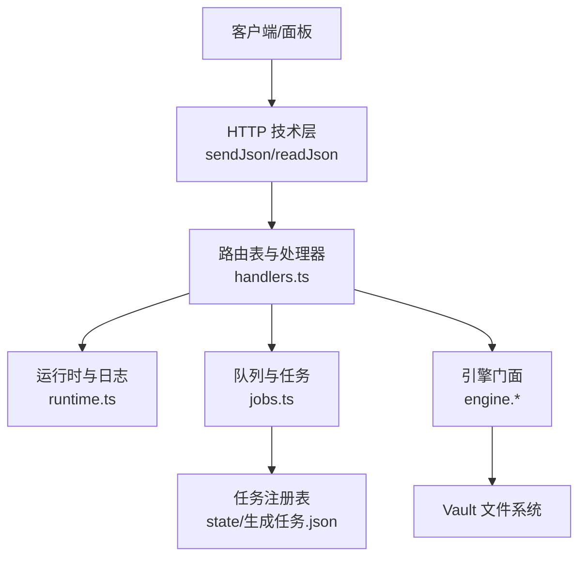
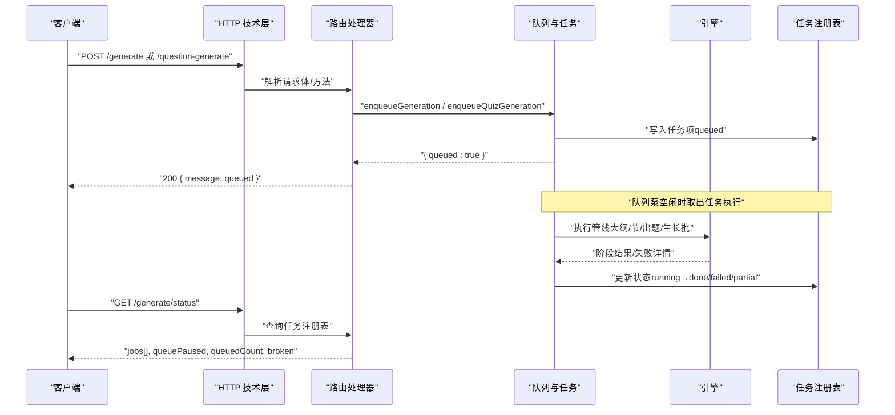
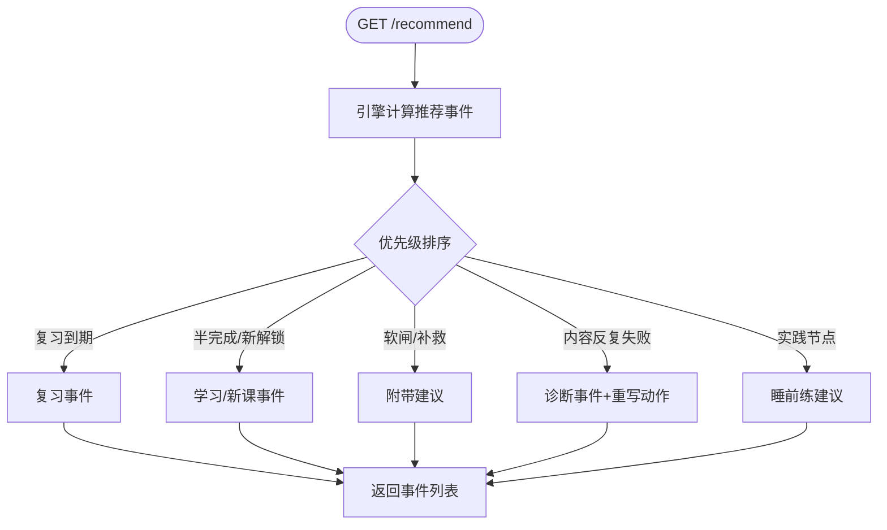
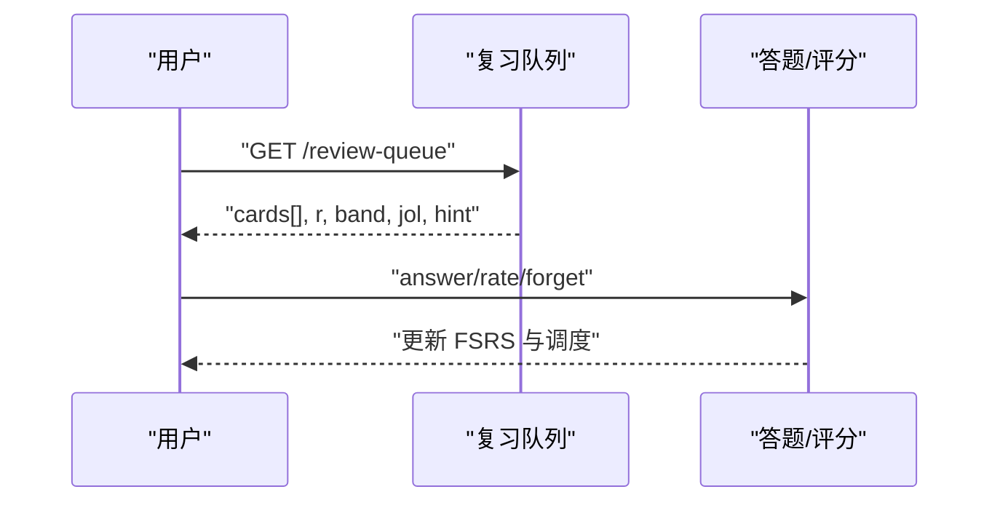
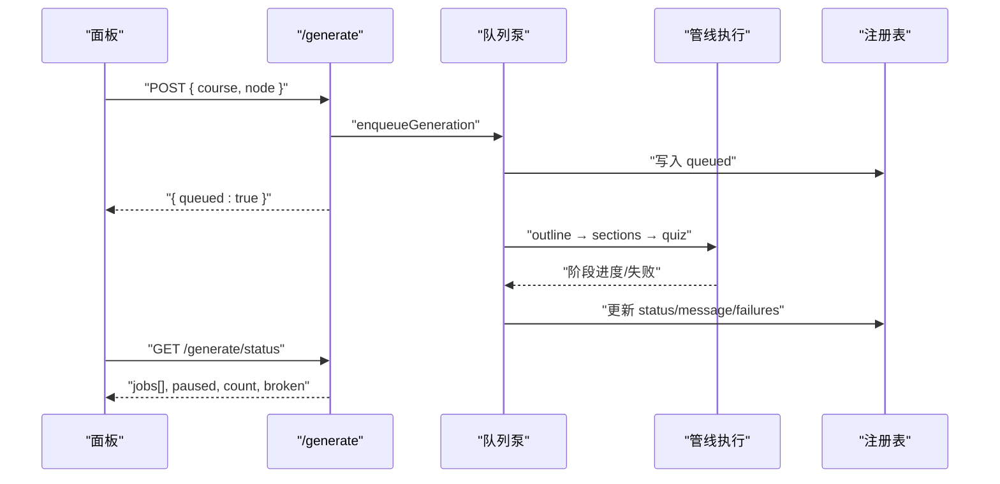
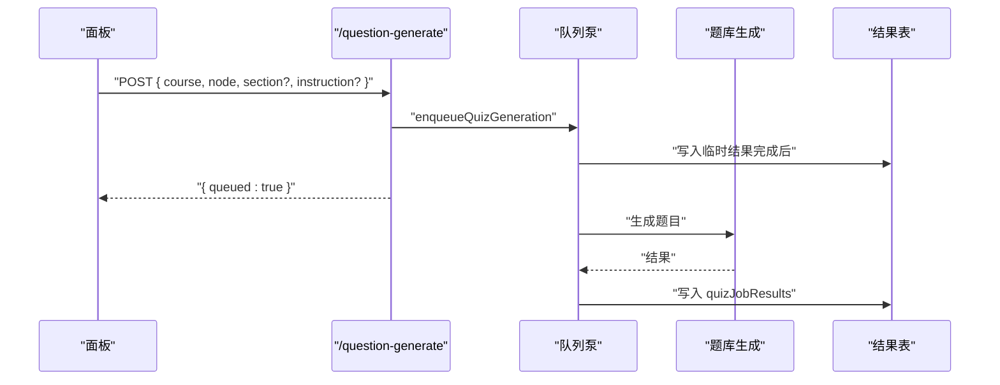
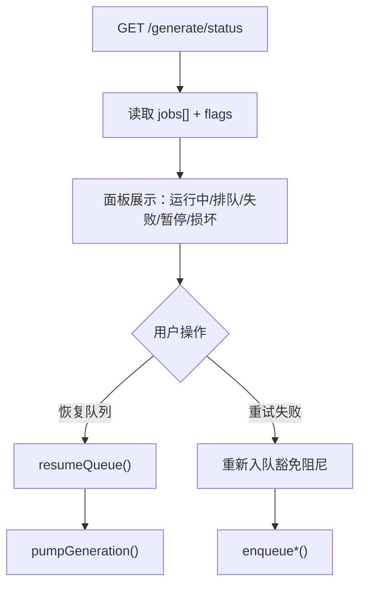
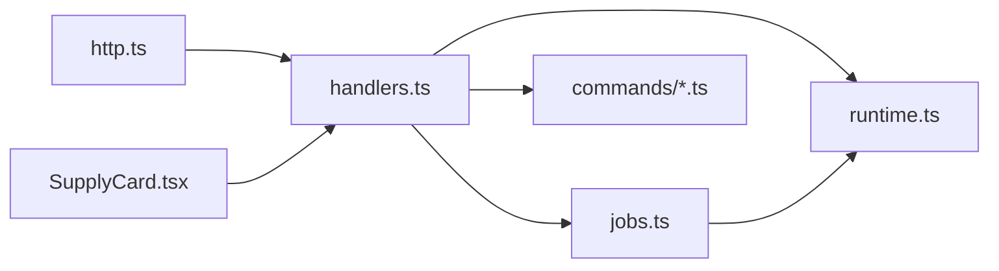

# Webhook事件

<cite>
**本文引用的文件**
- [src/host/http.ts](file://src/host/http.ts)
- [src/host/route-table.ts](file://src/host/route-table.ts)
- [src/host/handlers.ts](file://src/host/handlers.ts)
- [src/host/runtime.ts](file://src/host/runtime.ts)
- [src/host/jobs.ts](file://src/host/jobs.ts)
- [src/commands/学习.ts](file://src/commands/学习.ts)
- [ui/src/pages/TodayPage/SupplyCard.tsx](file://ui/src/pages/TodayPage/SupplyCard.tsx)
- [tests/ui-pages-dom.test.ts](file://tests/ui-pages-dom.test.ts)
</cite>

## 目录
1. [简介](#简介)
2. [项目结构](#项目结构)
3. [核心组件](#核心组件)
4. [架构总览](#架构总览)
5. [详细组件分析](#详细组件分析)
6. [依赖关系分析](#依赖关系分析)
7. [性能考量](#性能考量)
8. [故障排查指南](#故障排查指南)
9. [结论](#结论)
10. [附录](#附录)

## 简介
本文件面向“Webhook 事件”的完整说明，覆盖可订阅的事件类型、事件载荷与触发条件；说明学习事件、内容变更事件、系统状态事件的格式规范；给出事件订阅机制与消息队列集成方式；提供事件处理示例与错误恢复策略；解释事件去重与顺序保证；并包含监控调试工具使用指南以及事件持久化与生命周期管理。

本仓库未实现传统意义上的“HTTP Webhook 推送”，而是通过宿主 HTTP API 暴露查询型端点（如推荐事件、复习队列、生成任务状态等），由前端轮询或调用获取事件数据；同时通过全局队列执行长任务（生成、出题、生长批等），并以注册表持久化任务状态。因此，本项目的“事件”主要体现为：
- 查询型事件：通过 GET 接口返回当前状态或下一批事件（例如 /recommend、/review-queue）。
- 任务型事件：通过 POST 入队长任务（例如 /generate、/question-generate、/coach/growth），由队列泵驱动执行，并通过 /generate/status 暴露进度与终态。

## 项目结构
围绕事件与队列的关键路径如下：
- HTTP 技术层：统一 JSON 响应、请求体解析、静态资源服务。
- 路由表与处理器：声明式路由分发，将面板命令映射到引擎入口或宿主函数。
- 运行时与日志：构造运行时对象、注入 agent 缝、记录运行日志。
- 队列与任务：全局串行队列、任务注册表、恢复与保留期清理。
- 命令定义：对外暴露的工具/路由契约，包括推荐事件、复习队列、生成任务等。
- 前端展示：今日页供给卡、生成队列状态读取与交互。

图表来源
- [src/host/http.ts:26-55](file://src/host/http.ts#L26-L55)
- [src/host/route-table.ts:16-75](file://src/host/route-table.ts#L16-L75)
- [src/host/handlers.ts:1-144](file://src/host/handlers.ts#L1-L144)
- [src/host/runtime.ts:118-255](file://src/host/runtime.ts#L118-L255)
- [src/host/jobs.ts:322-1219](file://src/host/jobs.ts#L322-L1219)

章节来源
- [src/host/http.ts:26-55](file://src/host/http.ts#L26-L55)
- [src/host/route-table.ts:16-75](file://src/host/route-table.ts#L16-L75)
- [src/host/handlers.ts:1-144](file://src/host/handlers.ts#L1-L144)
- [src/host/runtime.ts:118-255](file://src/host/runtime.ts#L118-L255)
- [src/host/jobs.ts:322-1219](file://src/host/jobs.ts#L322-L1219)

## 核心组件
- HTTP 技术层：提供 sendJson、readJson、MIME 白名单与 KaTeX 注入等能力，确保所有 API 响应一致且安全。
- 路由表与处理器：以数据表形式声明路由与方法，集中分发到引擎或宿主函数；部分例外手写 handler。
- 运行时：承载 engine、agent、vault、jobs、flags 等可变态；提供 apiRun 统一封装引擎调用与运行日志。
- 队列与任务：全局串行队列，支持生成正文、出题、生长批、图域任务；任务注册表持久化，支持恢复、暂停、保留期清理。
- 命令定义：明确每个工具的输入输出、通道模式（同步/排队）、路由绑定与参数约束。
- 前端组件：今日页供给卡读取 /generate/status，展示运行中、排队数、失败重试与恢复队列。

章节来源
- [src/host/http.ts:26-55](file://src/host/http.ts#L26-L55)
- [src/host/route-table.ts:16-75](file://src/host/route-table.ts#L16-L75)
- [src/host/handlers.ts:1-144](file://src/host/handlers.ts#L1-L144)
- [src/host/runtime.ts:118-255](file://src/host/runtime.ts#L118-L255)
- [src/host/jobs.ts:322-1219](file://src/host/jobs.ts#L322-L1219)
- [ui/src/pages/TodayPage/SupplyCard.tsx:1-71](file://ui/src/pages/TodayPage/SupplyCard.tsx#L1-L71)

## 架构总览
事件在系统中的流转分为两类：
- 查询型事件：客户端通过 GET 接口拉取事件（如推荐事件、复习队列），服务端从引擎视图计算后返回。
- 任务型事件：客户端通过 POST 入队任务，服务端立即返回入队结果；队列泵按序执行，更新任务注册表，前端轮询 /generate/status 获取进度。

图表来源
- [src/host/handlers.ts:504-510](file://src/host/handlers.ts#L504-L510)
- [src/host/jobs.ts:322-789](file://src/host/jobs.ts#L322-L789)
- [src/host/runtime.ts:243-253](file://src/host/runtime.ts#L243-L253)

## 详细组件分析

### 推荐事件（学习事件）
- 事件来源：learnhub_recommend 命令，返回跨课程推荐事件队列。
- 事件类型：review（复习）、learning（学习）、new（新课）、struggle（困难）、diagnostic（诊断）、pin（今天学它）、sleep（睡前练建议）等。
- 事件字段：type、course、node、score、why、pinned、advice[]、diagnostics[]、sleep{ text, rehearsal }。
- 触发条件：根据复习到期、遗忘衰减、解锁计数、区域轮换、软闸建议、内容诊断等规则动态排序。
- 消费方式：客户端拉取一批事件，完成后继续拉取下一批；advice 可通过复习队列与答题接口执行；diagnostics 可触发单节重写。

图表来源
- [src/commands/学习.ts:468-470](file://src/commands/学习.ts#L468-L470)

章节来源
- [src/commands/学习.ts:468-470](file://src/commands/学习.ts#L468-L470)

### 复习队列事件（学习事件）
- 事件来源：learnhub_review_queue 命令，暴露跨课程到期题扁平队列。
- 事件字段：卡片集合、预测风险 r、band、jol、calibration_hint、note_drifted、note_suspended。
- 触发条件：FSRS 到期、自适应难度带、JOL 抽查命中、校准提示。
- 消费方式：按 r 升序呈现；单节点会话自适应排序；可定向到 course/node；回答/自评/遗忘通过 question_answer/question_rate/question_forget。

图表来源
- [src/host/handlers.ts:138-144](file://src/host/handlers.ts#L138-L144)
- [src/commands/学习.ts:503-522](file://src/commands/学习.ts#L503-L522)

章节来源
- [src/host/handlers.ts:138-144](file://src/host/handlers.ts#L138-L144)
- [src/commands/学习.ts:503-522](file://src/commands/学习.ts#L503-L522)

### 内容变更事件（生成任务）
- 事件来源：/generate 入队内容生成任务（大纲→逐节正文→综合出题）。
- 任务字段：course、node、phase、progress、message、failures、style、tier、model 等。
- 触发条件：笔记存在但无内容、断点续跑、风格选择、质量门禁。
- 顺序保证：同节点互斥（已有 queued/running/cancelling 拒绝重复入队），全局串行队列。
- 持久化：任务注册表全量落盘 state/生成任务.json；重启恢复残留 running 标失败，queued 暂停待手动恢复。

图表来源
- [src/host/jobs.ts:322-789](file://src/host/jobs.ts#L322-L789)
- [src/host/jobs.ts:1077-1124](file://src/host/jobs.ts#L1077-L1124)
- [src/host/jobs.ts:1127-1219](file://src/host/jobs.ts#L1127-L1219)

章节来源
- [src/host/jobs.ts:322-789](file://src/host/jobs.ts#L322-L789)
- [src/host/jobs.ts:1077-1124](file://src/host/jobs.ts#L1077-L1124)
- [src/host/jobs.ts:1127-1219](file://src/host/jobs.ts#L1127-L1219)

### 出题事件（内容变更事件）
- 事件来源：/question-generate 入队纯出题任务（phase=quiz）。
- 任务字段：count、section、instruction、model。
- 触发条件：定向补节、学习者指令、题库写互斥（与节点管线互斥）。
- 顺序保证：同节点互斥；全局串行队列。
- 结果读取：quizJobResults 临时表供 agent 工具等待完成后读取。

图表来源
- [src/host/handlers.ts:504-510](file://src/host/handlers.ts#L504-L510)
- [src/host/jobs.ts:322-347](file://src/host/jobs.ts#L322-L347)
- [src/host/runtime.ts:99-103](file://src/host/runtime.ts#L99-L103)

章节来源
- [src/host/handlers.ts:504-510](file://src/host/handlers.ts#L504-L510)
- [src/host/jobs.ts:322-347](file://src/host/jobs.ts#L322-L347)
- [src/host/runtime.ts:99-103](file://src/host/runtime.ts#L99-L103)

### 系统状态事件（队列健康与恢复）
- 事件来源：/generate/status 暴露任务注册表视图与队列状态。
- 字段：jobs[]、queuePaused、queuedCount、broken。
- 触发条件：任务入队/执行/失败/取消/恢复；重启后 queued 暂停、broken 硬停。
- 前端交互：今日页供给卡显示运行中、排队数、失败重试与恢复队列。

图表来源
- [src/host/jobs.ts:1077-1124](file://src/host/jobs.ts#L1077-L1124)
- [ui/src/pages/TodayPage/SupplyCard.tsx:1-71](file://ui/src/pages/TodayPage/SupplyCard.tsx#L1-L71)

章节来源
- [src/host/jobs.ts:1077-1124](file://src/host/jobs.ts#L1077-L1124)
- [ui/src/pages/TodayPage/SupplyCard.tsx:1-71](file://ui/src/pages/TodayPage/SupplyCard.tsx#L1-L71)

### 事件订阅机制与消息队列集成
- 订阅机制：无推送式 Webhook；采用“查询型事件 + 轮询”模式。客户端定期调用 /recommend、/review-queue、/generate/status 获取最新事件。
- 消息队列：全局串行队列（jobs.ts）负责长任务执行；任务注册表作为事实源，前端据此刷新 UI。
- 通道模式：命令定义支持 sync 与 queued 两种模式；生成类任务默认 queued，立即返回入队结果。

章节来源
- [src/commands/学习.ts:468-470](file://src/commands/学习.ts#L468-L470)
- [src/host/route-table.ts:34-54](file://src/host/route-table.ts#L34-L54)
- [src/host/jobs.ts:690-789](file://src/host/jobs.ts#L690-L789)

### 事件处理代码示例（路径引用）
- 入队内容生成：参考 [src/host/handlers.ts:504-510](file://src/host/handlers.ts#L504-L510) 与 [src/host/jobs.ts:322-347](file://src/host/jobs.ts#L322-L347)。
- 入队出题：参考 [src/host/handlers.ts:504-510](file://src/host/handlers.ts#L504-L510) 与 [src/host/jobs.ts:322-347](file://src/host/jobs.ts#L322-L347)。
- 查询推荐事件：参考 [src/commands/学习.ts:468-470](file://src/commands/学习.ts#L468-L470)。
- 查询复习队列：参考 [src/commands/学习.ts:503-522](file://src/commands/学习.ts#L503-L522)。
- 查询生成状态：参考 [src/host/jobs.ts:1077-1124](file://src/host/jobs.ts#L1077-L1124)。

### 错误恢复策略
- 任务失败：phase 终态标记为 failed/partial，failures 携带结构化失败信息；面板可定点重试或续跑。
- 队列暂停：重启后 queued 任务暂停，需手动恢复；broken 态拒绝写回，防止坏档覆盖。
- 恢复流程：启动时扫描注册表，running/cancelling 标失败，queued 置暂停并补挂保留期定时器；清扫悬空记录。
- 日志追踪：apiRun 与 runLog 记录调用与失败原因，便于定位问题。

章节来源
- [src/host/jobs.ts:679-688](file://src/host/jobs.ts#L679-L688)
- [src/host/jobs.ts:1127-1219](file://src/host/jobs.ts#L1127-L1219)
- [src/host/runtime.ts:217-253](file://src/host/runtime.ts#L217-L253)

### 事件去重与顺序保证
- 去重：同节点已有 queued/running/cancelling 的任务拒绝重复入队；已 cancelled 或 failed（非 force）不自动重试。
- 顺序：全局串行队列，按入队顺序依次执行；单节点管线内阶段有序（outline→sections→quiz）。
- 互斥：出题任务与节点管线互斥，避免题库写冲突。

章节来源
- [src/host/jobs.ts:322-347](file://src/host/jobs.ts#L322-L347)
- [src/host/jobs.ts:457-476](file://src/host/jobs.ts#L457-L476)
- [src/host/jobs.ts:690-789](file://src/host/jobs.ts#L690-L789)

### 事件监控与调试工具
- 运行日志：每次引擎调用与失败均写入运行日志，便于审计与回溯。
- 任务注册表：state/生成任务.json 为事实源，面板据此展示状态；重启恢复与保留期清理基于此档。
- 面板探针：测试用例验证路由与行为快照，确保 200/404/500 分布稳定。

章节来源
- [src/host/runtime.ts:217-253](file://src/host/runtime.ts#L217-L253)
- [tests/host-routes.test.ts:162-180](file://tests/host-routes.test.ts#L162-L180)

### 事件持久化策略与生命周期管理
- 持久化：任务注册表全量落盘；quizJobResults 临时表随进程结束清理。
- 生命周期：任务终态带 finishedAt 起算保留期；超期或悬空记录被清扫；重启后补挂剩余保留期。
- 保护态：broken 期间写回闸拒绝落盘，防止坏档覆盖；需修复后再恢复。

章节来源
- [src/host/runtime.ts:46-113](file://src/host/runtime.ts#L46-L113)
- [src/host/jobs.ts:1127-1219](file://src/host/jobs.ts#L1127-L1219)

## 依赖关系分析
- HTTP 技术层依赖 MIME 白名单与静态资源路径，提供统一响应与请求解析。
- 路由处理器依赖运行时与队列，调用引擎或宿主函数。
- 队列依赖任务注册表与引擎，执行管线并更新状态。
- 前端依赖 /generate/status 与 /recommend、/review-queue 等接口展示事件与状态。

图表来源
- [src/host/http.ts:26-55](file://src/host/http.ts#L26-L55)
- [src/host/handlers.ts:1-144](file://src/host/handlers.ts#L1-L144)
- [src/host/runtime.ts:118-255](file://src/host/runtime.ts#L118-L255)
- [src/host/jobs.ts:322-1219](file://src/host/jobs.ts#L322-L1219)
- [ui/src/pages/TodayPage/SupplyCard.tsx:1-71](file://ui/src/pages/TodayPage/SupplyCard.tsx#L1-L71)

章节来源
- [src/host/http.ts:26-55](file://src/host/http.ts#L26-L55)
- [src/host/handlers.ts:1-144](file://src/host/handlers.ts#L1-L144)
- [src/host/runtime.ts:118-255](file://src/host/runtime.ts#L118-L255)
- [src/host/jobs.ts:322-1219](file://src/host/jobs.ts#L322-L1219)
- [ui/src/pages/TodayPage/SupplyCard.tsx:1-71](file://ui/src/pages/TodayPage/SupplyCard.tsx#L1-L71)

## 性能考量
- 队列串行：避免并发写冲突，保证一致性；适合短任务与可控长任务。
- 断点续跑：ready 节跳过，减少重复工作；失败节可定点重写。
- 保留期清理：终态任务按保留期清理，避免注册表膨胀。
- 日志截断：运行日志限制长度，降低 I/O 压力。

[本节为通用指导，无需特定文件来源]

## 故障排查指南
- 队列暂停：检查 /generate/status 的 queuePaused 与 queuedCount；必要时调用恢复队列。
- 任务损坏：broken 非空表示任务档损坏；需修复后再恢复队列。
- 失败重试：失败任务可就地重试；生长批显式重新裁决豁免失败阻尼。
- 日志定位：查看运行日志中的调用失败与异常堆栈。

章节来源
- [tests/ui-pages-dom.test.ts:110-117](file://tests/ui-pages-dom.test.ts#L110-L117)
- [tests/ui-pages-dom.test.ts:119-153](file://tests/ui-pages-dom.test.ts#L119-L153)
- [src/host/runtime.ts:217-253](file://src/host/runtime.ts#L217-L253)

## 结论
本项目的事件体系以“查询型事件 + 队列任务”为核心：通过标准 HTTP API 暴露事件与状态，借助全局队列与注册表实现可靠的任务执行与持久化。推荐事件与复习队列提供学习侧的动态反馈；生成与出题任务保障内容生产的一致性与可恢复性。结合运行日志与面板监控，可实现端到端的可观测与排障。

[本节为总结，无需特定文件来源]

## 附录
- 关键端点参考：
  - GET /recommend：推荐事件
  - GET /review-queue：复习队列
  - POST /generate：内容生成入队
  - POST /question-generate：出题入队
  - GET /generate/status：生成任务状态
- 相关实现路径：
  - [src/host/handlers.ts:138-144](file://src/host/handlers.ts#L138-L144)
  - [src/host/handlers.ts:504-510](file://src/host/handlers.ts#L504-L510)
  - [src/host/jobs.ts:1077-1124](file://src/host/jobs.ts#L1077-L1124)
  - [src/commands/学习.ts:468-470](file://src/commands/学习.ts#L468-L470)
  - [src/commands/学习.ts:503-522](file://src/commands/学习.ts#L503-L522)

[本节为附录，无需特定文件来源]