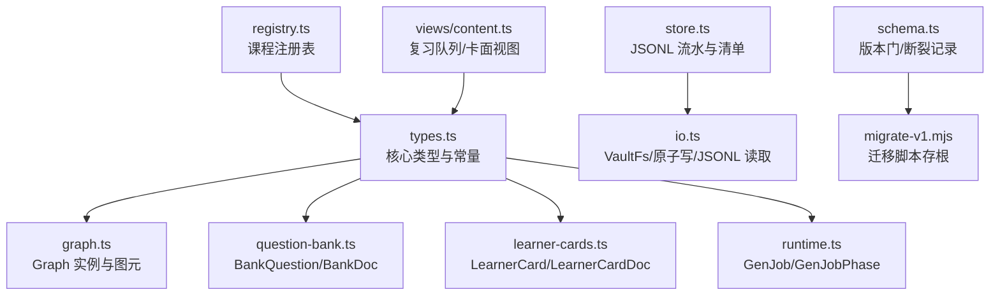
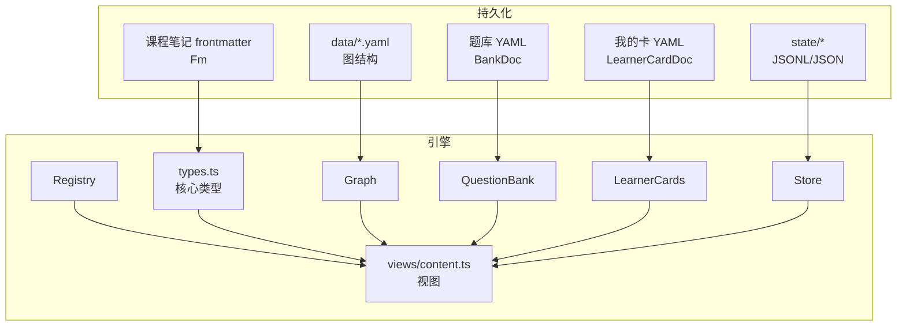
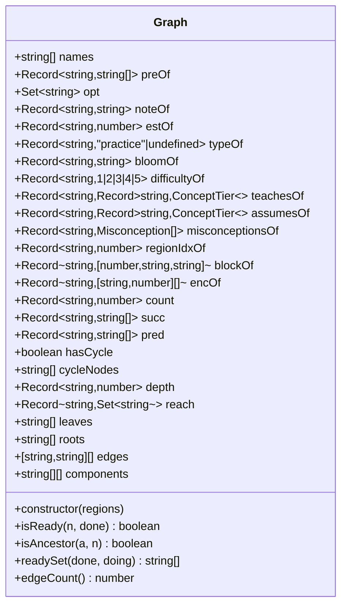
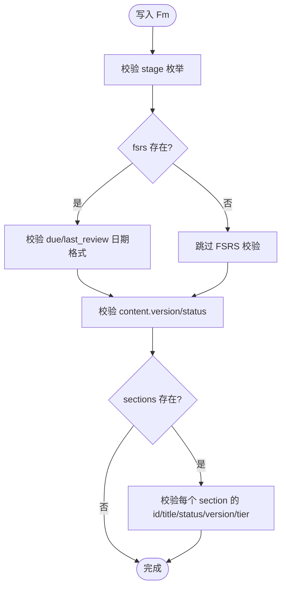
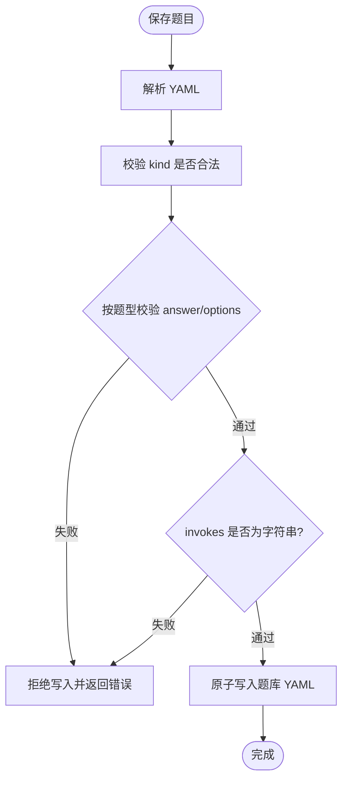
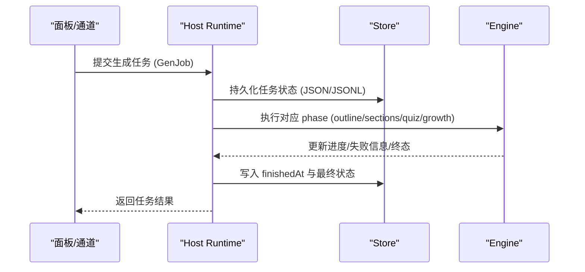
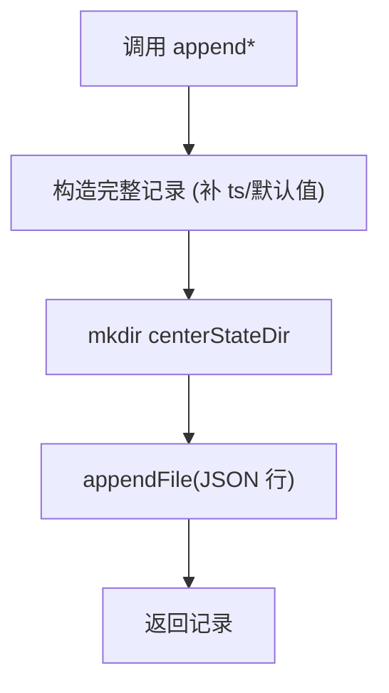
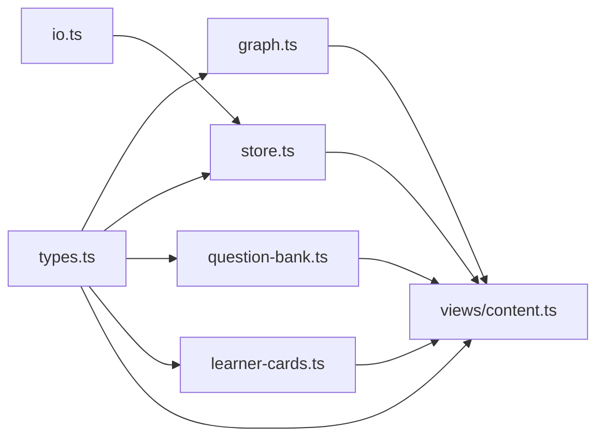

# 数据模型

<cite>
**本文引用的文件**
- [src/engine/types.ts](file://src/engine/types.ts)
- [src/engine/schema.ts](file://src/engine/schema.ts)
- [src/engine/graph.ts](file://src/engine/graph.ts)
- [src/engine/question-bank.ts](file://src/engine/question-bank.ts)
- [src/engine/learner-cards.ts](file://src/engine/learner-cards.ts)
- [src/host/runtime.ts](file://src/host/runtime.ts)
- [src/engine/store.ts](file://src/engine/store.ts)
- [src/engine/io.ts](file://src/engine/io.ts)
- [src/engine/registry.ts](file://src/engine/registry.ts)
- [src/engine/views/content.ts](file://src/engine/views/content.ts)
- [scripts/migrate-v1.mjs](file://scripts/migrate-v1.mjs)
</cite>

## 目录
1. [引言](#引言)
2. [项目结构](#项目结构)
3. [核心组件](#核心组件)
4. [架构总览](#架构总览)
5. [详细组件分析](#详细组件分析)
6. [依赖关系分析](#依赖关系分析)
7. [性能考量](#性能考量)
8. [故障排查指南](#故障排查指南)
9. [结论](#结论)
10. [附录](#附录)

## 引言
本参考文档聚焦于学习平台插件的数据模型，覆盖核心实体（Graph、Fm、Question、LearnerCard、GenJob 等）的字段说明、约束规则与关系映射；提供 TypeScript 类型定义要点与 JSON Schema 规范建议；阐述数据验证规则、业务约束、迁移方案与版本兼容性；并给出序列化/反序列化最佳实践以及持久化格式与存储策略。

## 项目结构
数据模型主要分布在引擎层与宿主运行层：
- 中立类型与常量：types.ts
- 图结构与图实例：graph.ts
- 题库与题目模型：question-bank.ts
- 学习者产出卡：learner-cards.ts
- 生成任务：host/runtime.ts
- 运行态存储与流水：store.ts、io.ts
- 课程注册表：registry.ts
- 视图聚合（复习队列/我的卡/错误对比卡）：views/content.ts
- 版本门与断裂迁移：schema.ts、scripts/migrate-v1.mjs



图表来源
- [src/engine/types.ts:1-369](file://src/engine/types.ts#L1-L369)
- [src/engine/graph.ts:279-443](file://src/engine/graph.ts#L279-L443)
- [src/engine/question-bank.ts:82-111](file://src/engine/question-bank.ts#L82-L111)
- [src/engine/learner-cards.ts:82-97](file://src/engine/learner-cards.ts#L82-L97)
- [src/host/runtime.ts:49-97](file://src/host/runtime.ts#L49-L97)
- [src/engine/store.ts:1-479](file://src/engine/store.ts#L1-L479)
- [src/engine/io.ts:1-103](file://src/engine/io.ts#L1-L103)
- [src/engine/registry.ts:1-154](file://src/engine/registry.ts#L1-L154)
- [src/engine/views/content.ts:93-156](file://src/engine/views/content.ts#L93-L156)
- [src/engine/schema.ts:1-80](file://src/engine/schema.ts#L1-L80)
- [scripts/migrate-v1.mjs:1-26](file://scripts/migrate-v1.mjs#L1-L26)

章节来源
- [src/engine/types.ts:1-369](file://src/engine/types.ts#L1-L369)
- [src/engine/graph.ts:279-443](file://src/engine/graph.ts#L279-L443)
- [src/engine/question-bank.ts:82-111](file://src/engine/question-bank.ts#L82-L111)
- [src/engine/learner-cards.ts:82-97](file://src/engine/learner-cards.ts#L82-L97)
- [src/host/runtime.ts:49-97](file://src/host/runtime.ts#L49-L97)
- [src/engine/store.ts:1-479](file://src/engine/store.ts#L1-L479)
- [src/engine/io.ts:1-103](file://src/engine/io.ts#L1-L103)
- [src/engine/registry.ts:1-154](file://src/engine/registry.ts#L1-L154)
- [src/engine/views/content.ts:93-156](file://src/engine/views/content.ts#L93-L156)
- [src/engine/schema.ts:1-80](file://src/engine/schema.ts#L1-L80)
- [scripts/migrate-v1.mjs:1-26](file://scripts/migrate-v1.mjs#L1-L26)

## 核心组件
- Graph：课程概念图的运行时实例，封装节点、边、拓扑序、可达性、连通分量与就绪判定。
- Fm：课程笔记 frontmatter，承载阶段、FSRS 状态、内容版本与练习统计。
- Question（BankQuestion）：题库条目，含题型、题干、答案、选项、解析、难度、调度与统计。
- LearnerCard：学习者产出卡，独立卡组与调度，支持三种卡面。
- GenJob：生成任务，承载组合管线阶段、进度、失败信息、参数与负载。
- Store：明文运行态存储，管理 journal/practice/review-log/proposals/snapshots/pins/experiments/receipts/habit-repeats/erratum 等。
- Registry：课程注册表，维护启用课程与笔记源身份。
- Views：复习队列与卡面视图（题卡、我的卡、错误对比卡）。

章节来源
- [src/engine/graph.ts:279-443](file://src/engine/graph.ts#L279-L443)
- [src/engine/types.ts:41-61](file://src/engine/types.ts#L41-L61)
- [src/engine/question-bank.ts:82-111](file://src/engine/question-bank.ts#L82-L111)
- [src/engine/learner-cards.ts:82-97](file://src/engine/learner-cards.ts#L82-L97)
- [src/host/runtime.ts:49-97](file://src/host/runtime.ts#L49-L97)
- [src/engine/store.ts:1-479](file://src/engine/store.ts#L1-L479)
- [src/engine/registry.ts:1-154](file://src/engine/registry.ts#L1-L154)
- [src/engine/views/content.ts:93-156](file://src/engine/views/content.ts#L93-L156)

## 架构总览
下图展示数据模型在系统中的交互：Graph 由 data/*.yaml 构建；Fm 来自课程笔记 frontmatter；Question 来自题库 YAML；LearnerCard 来自我的卡 YAML；Store 以 JSONL 追加方式持久化行为流水；Registry 提供课程清单；Views 将多源数据聚合为复习队列与卡面。



图表来源
- [src/engine/graph.ts:279-443](file://src/engine/graph.ts#L279-L443)
- [src/engine/types.ts:1-369](file://src/engine/types.ts#L1-L369)
- [src/engine/question-bank.ts:82-111](file://src/engine/question-bank.ts#L82-L111)
- [src/engine/learner-cards.ts:82-97](file://src/engine/learner-cards.ts#L82-L97)
- [src/engine/store.ts:1-479](file://src/engine/store.ts#L1-L479)
- [src/engine/registry.ts:1-154](file://src/engine/registry.ts#L1-L154)
- [src/engine/views/content.ts:93-156](file://src/engine/views/content.ts#L93-L156)

## 详细组件分析

### Graph（课程概念图）
- 职责：从 GRegion/GBlock/GNode 构建运行时图，计算拓扑序、环检测、深度、可达集、传递约简边、连通分量、就绪判定。
- 关键属性：names、preOf/opt/noteOf/estOf/typeOf/bloomOf/difficultyOf/teachesOf/assumesOf/misconceptionsOf/regionIdxOf/blockOf/encOf/count/succ/pred/order/hasCycle/cycleNodes/depth/reach/leaves/roots/edges/components。
- 复杂度：构造时 O(N+E) 进行邻接表构建与拓扑排序；可达集计算 O(N·E) 最坏；就绪判定 O(k) 其中 k 为前置数。
- 约束：节点名唯一；可选前置；enc 权重边；Bloom 层级与难度为可选；概念字段组可缺席。



图表来源
- [src/engine/graph.ts:279-443](file://src/engine/graph.ts#L279-L443)
- [src/engine/types.ts:63-107](file://src/engine/types.ts#L63-L107)

章节来源
- [src/engine/graph.ts:279-443](file://src/engine/graph.ts#L279-L443)
- [src/engine/types.ts:63-107](file://src/engine/types.ts#L63-L107)

### Fm（课程笔记 frontmatter）
- 字段：node、stage、fsrs（FSRS 状态块）、mastery（退役兼容）、practice_ema（练习证据 EMA）、content.version/status/sections/tier、practice.attempts/correct。
- 约束：stage 为枚举；fsrs 日期为本地日 YYYY-MM-DD；content.status 为草稿/已审/标记；sections 可选；tier 可选。
- 业务含义：frontmatter 是调度状态唯一事实源；掌握度派生不落盘；EMA 用于掌握度计算但不直接落盘。



图表来源
- [src/engine/types.ts:30-61](file://src/engine/types.ts#L30-L61)

章节来源
- [src/engine/types.ts:30-61](file://src/engine/types.ts#L30-L61)

### Question（题库条目 BankQuestion）
- 字段：id、kind、q、answer、options、explanation、difficulty、uses、tags、tol、section、invokes、archived、archived_reason、fsrs、stats。
- 题型与答案约束：单选/多选/判断/填空/数值/排序/匹配/反思/开放问答，每种题型对 answer/options 有严格形态校验。
- 业务约束：invokes 必须为登记表在册名字字符串（缺席合法）；归档原因记录；FSRS/stats 由作答侧整体替换。



图表来源
- [src/engine/question-bank.ts:139-262](file://src/engine/question-bank.ts#L139-L262)
- [src/engine/question-bank.ts:82-111](file://src/engine/question-bank.ts#L82-L111)

章节来源
- [src/engine/question-bank.ts:82-111](file://src/engine/question-bank.ts#L82-L111)
- [src/engine/question-bank.ts:139-262](file://src/engine/question-bank.ts#L139-L262)

### LearnerCard（学习者产出卡）
- 字段：id、kind（recall_cue/cloze_rewrite/self_explain）、prompt、content、source_node、source_section、archived、fsrs、stats。
- 约束：prompt 非空且长度上限；content 非空且长度上限；挖空重述必须包含 {{…}}；禁止控制字符；source_node 非空。
- 业务语义：独立卡组与调度，不入题库九题型；一卡一天一次推进；自评走复习自评语义。

```mermaid
classDiagram
class LearnerCard {
+string id
+LearnerCardKind kind
+string prompt
+string content
+string source_node
+string source_section
+boolean archived
+FsrsBlock fsrs
+{ attempts : number; correct : number; last : string } stats
}
class LearnerCardDoc {
+string node
+LearnerCard[] cards
}
```

图表来源
- [src/engine/learner-cards.ts:82-97](file://src/engine/learner-cards.ts#L82-L97)
- [src/engine/types.ts:325-329](file://src/engine/types.ts#L325-L329)

章节来源
- [src/engine/learner-cards.ts:82-97](file://src/engine/learner-cards.ts#L82-L97)
- [src/engine/types.ts:325-329](file://src/engine/types.ts#L325-L329)

### GenJob（生成任务）
- 字段：course、node、startedAt、finishedAt、status、phase、progress、message、failures、style、tier、count、quizCount、section、instruction、model、growthOutcome、growthInject、growthForce、seedPayload/decompilePayload/planPayload/milestonePayload。
- 业务语义：组合管线阶段（大纲→逐节正文→自动出题）；纯出题任务参数；生长批裁决结果；里程碑计划修订注入；显式重新裁决豁免；图域任务负载。



图表来源
- [src/host/runtime.ts:49-97](file://src/host/runtime.ts#L49-L97)
- [src/engine/store.ts:168-206](file://src/engine/store.ts#L168-L206)

章节来源
- [src/host/runtime.ts:49-97](file://src/host/runtime.ts#L49-L97)
- [src/engine/store.ts:168-206](file://src/engine/store.ts#L168-L206)

### Store（运行态存储）
- 职责：journal/practice/review-log 追加型 JSONL；proposals/snapshots/pins/experiments/receipts/habit-repeats/erratum 全量或追加读写；统一 readJsonlLines 读契约。
- 约束：缺失 = Missing 合法空态；中段损坏 = Broken 抛错；撕裂尾行豁免；原子写保障一致性。
- 典型方法：appendJournal/appendPractice/appendReview/loadProposals/saveProposals/createProposal/updateProposal/takePending/loadExperiments/saveExperiments/appendErratum 等。



图表来源
- [src/engine/store.ts:49-143](file://src/engine/store.ts#L49-L143)
- [src/engine/io.ts:65-101](file://src/engine/io.ts#L65-L101)

章节来源
- [src/engine/store.ts:49-143](file://src/engine/store.ts#L49-L143)
- [src/engine/io.ts:65-101](file://src/engine/io.ts#L65-L101)

### Registry（课程注册表）
- 职责：加载/保存课程与笔记源注册；严格契约校验；缺省为空但存在即 fail loud。
- 约束：name/root 必填且唯一；id 可选且唯一；enabled/tags 类型校验；note_sources 独立校验。

章节来源
- [src/engine/registry.ts:18-75](file://src/engine/registry.ts#L18-L75)
- [src/engine/registry.ts:77-154](file://src/engine/registry.ts#L77-L154)

### Views（复习队列与卡面）
- 复习队列：题卡（QuestionItem）+ 结算骨架卡（LearnerCard/ErrorCardFace），统一 QueueCard。
- 错误对比卡：三选一，自动判分，不污染节点 canonical。
- 字段：course/node/id/due/r/difficulty/attempts/source/learner/error 等。

章节来源
- [src/engine/views/content.ts:93-156](file://src/engine/views/content.ts#L93-L156)

## 依赖关系分析
- types.ts 作为中立词汇层被 graph、store、question-bank、learner-cards、views 等引用，避免循环依赖。
- store.ts 仅依赖 io.ts 原语与 types.ts 类型，保持低耦合。
- question-bank.ts 依赖 grading、notes、srs、xp、prompts 等子系统，形成题库域聚合。
- learner-cards.ts 依赖 srs、advance、xp、receipts、habits、skills 等，形成学习者输出域聚合。
- views/content.ts 聚合多种卡面视图，消费 types 与子系统接口。



图表来源
- [src/engine/types.ts:1-369](file://src/engine/types.ts#L1-L369)
- [src/engine/store.ts:1-479](file://src/engine/store.ts#L1-L479)
- [src/engine/io.ts:1-103](file://src/engine/io.ts#L1-L103)
- [src/engine/question-bank.ts:1-800](file://src/engine/question-bank.ts#L1-L800)
- [src/engine/learner-cards.ts:1-800](file://src/engine/learner-cards.ts#L1-L800)
- [src/engine/views/content.ts:93-156](file://src/engine/views/content.ts#L93-L156)

章节来源
- [src/engine/types.ts:1-369](file://src/engine/types.ts#L1-L369)
- [src/engine/store.ts:1-479](file://src/engine/store.ts#L1-L479)
- [src/engine/io.ts:1-103](file://src/engine/io.ts#L1-L103)
- [src/engine/question-bank.ts:1-800](file://src/engine/question-bank.ts#L1-L800)
- [src/engine/learner-cards.ts:1-800](file://src/engine/learner-cards.ts#L1-L800)
- [src/engine/views/content.ts:93-156](file://src/engine/views/content.ts#L93-L156)

## 性能考量
- Graph 构造使用 Kahn 拓扑排序与并查集连通分量，时间复杂度 O(N+E)，适合中等规模课程图。
- Store 的 JSONL 追加写入为 O(1) 单行，批量读取采用流式解析，撕裂尾行豁免提升鲁棒性。
- 题库与我的卡校验在写入前集中进行，避免多次重写；原子写减少竞争条件。
- 视图聚合按需过滤与排序，避免全量渲染开销。

## 故障排查指南
- schema 版本硬门：启动时检查 learnhub.json 的 schema.version，非当前版本抛出错误并指引迁移脚本。
- 注册表 Broken：YAML 无法解析或契约校验失败会抛错，需修复后重试。
- 题库 Broken：YAML 解析失败或题目形态校验失败会抛错，提示具体位置与原因。
- 我的卡 Broken：卡片形态校验失败（如挖空标记缺失、控制字符）会抛错。
- JSONL 读取：中段损坏抛 Broken；末行撕裂豁免；缺失返回空数组。

章节来源
- [src/engine/schema.ts:59-79](file://src/engine/schema.ts#L59-L79)
- [src/engine/registry.ts:80-102](file://src/engine/registry.ts#L80-L102)
- [src/engine/question-bank.ts:275-318](file://src/engine/question-bank.ts#L275-L318)
- [src/engine/learner-cards.ts:196-239](file://src/engine/learner-cards.ts#L196-L239)
- [src/engine/io.ts:65-101](file://src/engine/io.ts#L65-L101)

## 结论
本数据模型以 types.ts 为中心，围绕 Graph/Fm/Question/LearnerCard/GenJob 等核心实体构建了清晰的分层与边界：图结构、笔记 frontmatter、题库与我的卡各自独立持久化；Store 以 JSONL 承载行为流水；Views 聚合多源数据供前端消费；schema 版本门确保断裂式升级的可控迁移。遵循严格的校验与原子写策略，系统具备高一致性与可观测性。

## 附录

### TypeScript 类型定义要点
- 阶段与内容状态：Stage、ContentStatus、STAGES。
- FSRS 状态块：FsrsBlock（stability/difficulty/due/last_review/reps/lapses）。
- 图元：GNode/GBlock/GRegion，含 Bloom 层级、难度、概念字段组与误解先验。
- 流水记录：JournalRec、PracticeRec、ReviewRec、EArchiveRec、ErratumRec。
- 提案与实验：ProposalRec、ExperimentDef、Nof1Variable。
- 卡面与渐退档：LearnerCardKind、FadingTier。
- 审计：VaultPriorAudit。

章节来源
- [src/engine/types.ts:8-11](file://src/engine/types.ts#L8-L11)
- [src/engine/types.ts:30-61](file://src/engine/types.ts#L30-L61)
- [src/engine/types.ts:63-107](file://src/engine/types.ts#L63-L107)
- [src/engine/types.ts:132-200](file://src/engine/types.ts#L132-L200)
- [src/engine/types.ts:243-323](file://src/engine/types.ts#L243-L323)
- [src/engine/types.ts:325-369](file://src/engine/types.ts#L325-L369)

### JSON Schema 规范建议
- 题库 YAML（BankDoc）：
  - 顶层对象：node（字符串，非空）、questions（数组，至少一项）。
  - 题目对象：id（字符串）、kind（枚举）、q（字符串，非空）、answer（按题型约束）、options（数组，题型相关）、explanation（可选字符串）、difficulty（整数 1-3）、uses/tags（字符串数组）、tol（正数，numeric 题型）、section（字符串）、invokes（字符串，可选）、archived/archived_reason（布尔/字符串）、fsrs/stats（对象，可选）。
- 我的卡 YAML（LearnerCardDoc）：
  - 顶层对象：node（字符串，非空）、cards（数组，至少一项）。
  - 卡片对象：id（字符串）、kind（枚举）、prompt（字符串，非空且长度上限）、content（字符串，非空且长度上限）、source_node（字符串，非空）、source_section（可选字符串）、archived（布尔）、fsrs/stats（对象，可选）。
- 课程注册表：
  - courses 数组项：name/root（字符串，非空且唯一）、id（可选字符串，唯一）、enabled（布尔）、tags（字符串数组）。
  - note_sources（可选）：id/path（字符串，非空且唯一）、enabled（布尔）、created（字符串，非空）。
- 生成任务（GenJob）：
  - course/node/startedAt/status（必填）；phase/progress/message/failures/style/tier/count/quizCount/section/instruction/model/growthOutcome/growthInject/growthForce（可选）；payload 字段按 phase 形状约束。

### 数据验证规则与业务约束
- 阶段机：Stage 枚举限制；内容状态 ContentStatus 枚举限制。
- FSRS：日期格式 YYYY-MM-DD；评分来源 rating_source 与事件种类 event_kind/exec_source 的约束。
- 题库：题型与答案形态强约束；invokes 必须为登记表在册名字字符串；归档原因记录。
- 我的卡：长度上限、控制字符禁止、挖空标记要求、一卡一天一次推进。
- 注册表：唯一性约束、类型约束、缺失为空但存在即 fail loud。
- 存储：Missing/Broken 纪律，JSONL 中段损坏抛错，撕裂尾行豁免。

章节来源
- [src/engine/types.ts:8-11](file://src/engine/types.ts#L8-L11)
- [src/engine/types.ts:168-200](file://src/engine/types.ts#L168-L200)
- [src/engine/question-bank.ts:139-262](file://src/engine/question-bank.ts#L139-L262)
- [src/engine/learner-cards.ts:113-182](file://src/engine/learner-cards.ts#L113-L182)
- [src/engine/registry.ts:18-75](file://src/engine/registry.ts#L18-L75)
- [src/engine/io.ts:65-101](file://src/engine/io.ts#L65-L101)

### 数据迁移方案与版本兼容性
- 版本门：CURRENT_SCHEMA_VERSION 为当前主版本；learnhub.json 中 schema.version 非当前版本即拒载。
- 断裂记录：SchemaBreak 记录 from/date/archived/note；breaks 为纯档案，引擎零消费。
- 迁移脚本：migrate-v1.mjs 为退役存根，历史实现与端到端测试见 git 历史；手工迁移步骤包括存档区搬移、概念登记表豁免、注册表重写与版本戳。

章节来源
- [src/engine/schema.ts:16-35](file://src/engine/schema.ts#L16-L35)
- [src/engine/schema.ts:59-79](file://src/engine/schema.ts#L59-L79)
- [scripts/migrate-v1.mjs:1-26](file://scripts/migrate-v1.mjs#L1-L26)

### 数据序列化与反序列化最佳实践
- 使用 YAML 解析/序列化题库与我的卡，保持人类可读与机器可审。
- 使用 JSON 序列化配置与清单（如 proposals/snapshots），配合原子写保障一致性。
- JSONL 追加写入行为流水，读取时采用 readJsonlLines 统一处理缺失/损坏/撕裂尾行。
- 保持键顺序稳定（如 frontmatter 渲染），便于 diff 与审计。

章节来源
- [src/engine/question-bank.ts:275-318](file://src/engine/question-bank.ts#L275-L318)
- [src/engine/learner-cards.ts:196-239](file://src/engine/learner-cards.ts#L196-L239)
- [src/engine/store.ts:49-143](file://src/engine/store.ts#L49-L143)
- [src/engine/io.ts:30-54](file://src/engine/io.ts#L30-L54)
- [src/engine/io.ts:65-101](file://src/engine/io.ts#L65-L101)

### 数据持久化格式与存储策略
- 图结构：data/*.yaml（GRegion/GBlock/GNode），人可读、git 可审。
- 笔记 frontmatter：课程笔记 frontmatter（Fm），调度状态唯一事实源。
- 题库：课程根/题库/<节点>.yaml（BankDoc）。
- 我的卡：课程根/我的卡/<节点>.yaml（LearnerCardDoc）。
- 运行态：state/* 下的 JSONL/JSON（journal/practice/review-log/proposals/snapshots/pins/experiments/receipts/habit-repeats/erratum）。
- 原子写：临时文件 + rename 保证一致性；JSONL 追加行。

章节来源
- [src/engine/graph.ts:1-24](file://src/engine/graph.ts#L1-L24)
- [src/engine/question-bank.ts:1-22](file://src/engine/question-bank.ts#L1-L22)
- [src/engine/learner-cards.ts:1-15](file://src/engine/learner-cards.ts#L1-L15)
- [src/engine/store.ts:1-10](file://src/engine/store.ts#L1-L10)
- [src/engine/io.ts:30-54](file://src/engine/io.ts#L30-L54)