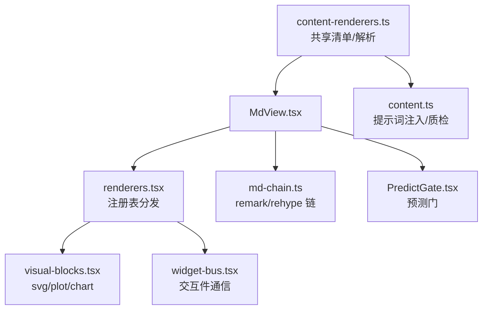
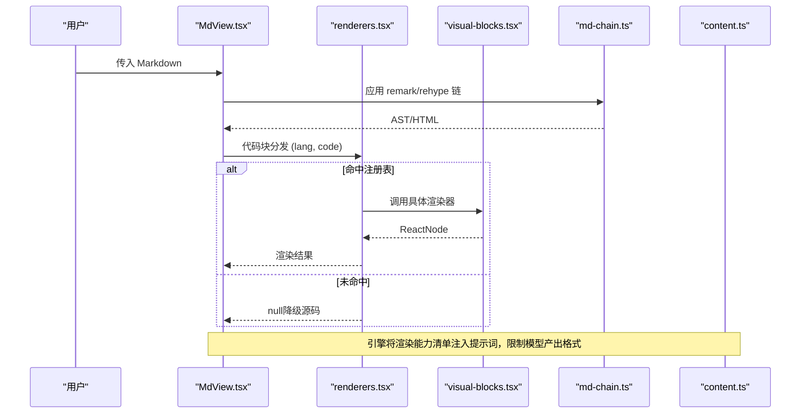
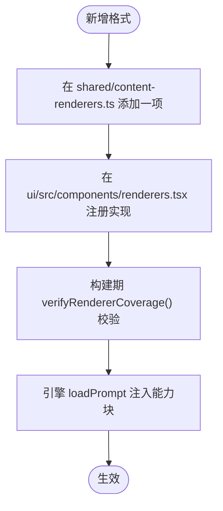
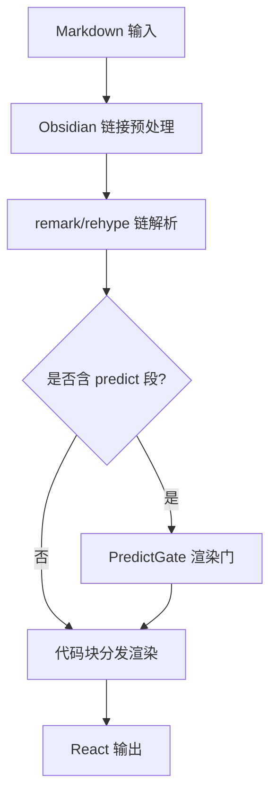
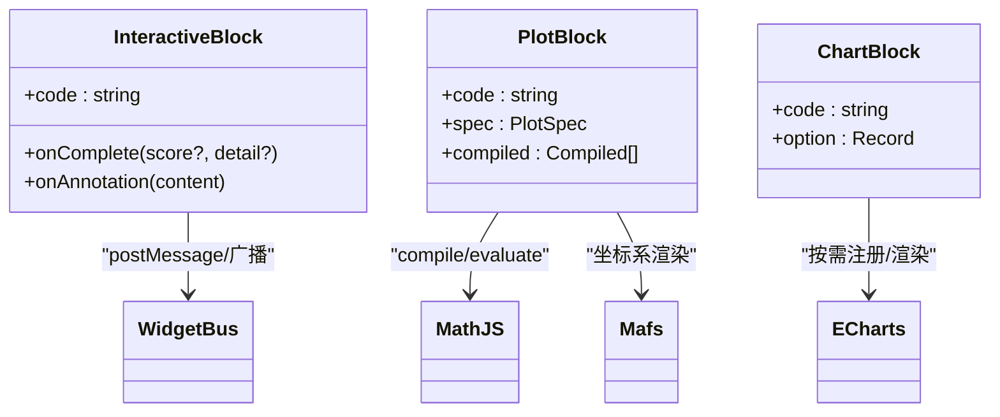
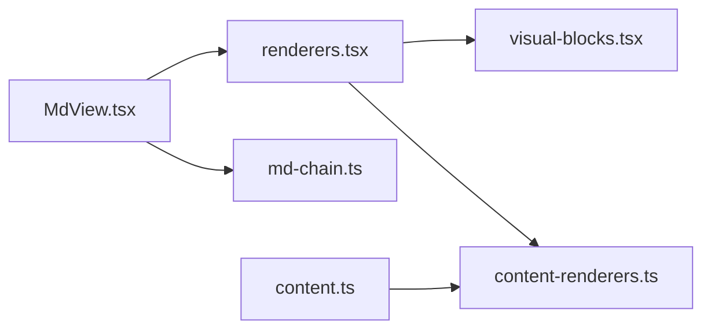

# 内容渲染系统

<cite>
**本文引用的文件**
- [shared/content-renderers.ts](file://shared/content-renderers.ts)
- [ui/src/components/renderers.tsx](file://ui/src/components/renderers.tsx)
- [ui/src/components/visual-blocks.tsx](file://ui/src/components/visual-blocks.tsx)
- [ui/src/components/MdView.tsx](file://ui/src/components/MdView.tsx)
- [ui/src/lib/md-chain.ts](file://ui/src/lib/md-chain.ts)
- [ui/src/components/PredictGate.tsx](file://ui/src/components/PredictGate.tsx)
- [ui/src/components/widget-bus.tsx](file://ui/src/components/widget-bus.tsx)
- [src/engine/content.ts](file://src/engine/content.ts)
</cite>

## 目录
1. [简介](#简介)
2. [项目结构](#项目结构)
3. [核心组件](#核心组件)
4. [架构总览](#架构总览)
5. [详细组件分析](#详细组件分析)
6. [依赖关系分析](#依赖关系分析)
7. [性能与缓存](#性能与缓存)
8. [故障排查指南](#故障排查指南)
9. [结论](#结论)
10. [附录：扩展与配置](#附录扩展与配置)

## 简介
本系统提供一套可扩展的内容渲染能力，将 Markdown 正文中的“代码块”按语言标记分发到对应渲染器，支持流程图、数学公式、音视频、交互模拟、SVG、函数图像与数据图表等。其设计要点包括：
- 单一事实源：共享清单定义支持的渲染格式与节类型，引擎提示词与 UI 注册表均消费同一份清单，保证两端一致。
- 注册分发机制：UI 层通过注册表按 ```lang 查找并调用具体渲染器；未命中则降级为源码显示。
- 管道化解析：Markdown 经 remark/rehype 链处理（GFM、数学公式），再在代码块节点处分发给渲染器。
- 安全与健壮性：对 SVG/ECharts/plot 等输入进行严格校验与白名单过滤；失败时回退源码展示。
- 可观测与可演进：构建期校验渲染器覆盖度；新增格式只需在共享清单与 UI 注册表各加一项。

## 项目结构
- 共享事实源
  - shared/content-renderers.ts：定义渲染器规格、节类型、预测门解析与能力块生成。
- UI 渲染层
  - ui/src/components/MdView.tsx：Markdown 渲染入口，预处理 Obsidian 链接、切分预测门段、代码块分发。
  - ui/src/components/renderers.tsx：代码块渲染器注册表与分发函数，实现 mermaid/media/interactive/svg/plot/chart。
  - ui/src/components/visual-blocks.tsx：可视化块的具体实现（svg/plot/chart）。
  - ui/src/lib/md-chain.ts：remark/rehype 插件链配置（GFM、数学公式、KaTeX）。
  - ui/src/components/PredictGate.tsx：预测门交互组件。
  - ui/src/components/widget-bus.tsx：交互件消息总线，用于 AI 老师广播与交互件通信。
- 引擎侧
  - src/engine/content.ts：内容管线，注入渲染能力清单到提示词，统计可视化块数量，校验未注册语言。



**图示来源**
- [ui/src/components/MdView.tsx:1-103](file://ui/src/components/MdView.tsx#L1-L103)
- [ui/src/components/renderers.tsx:1-166](file://ui/src/components/renderers.tsx#L1-L166)
- [ui/src/components/visual-blocks.tsx:1-296](file://ui/src/components/visual-blocks.tsx#L1-L296)
- [ui/src/lib/md-chain.ts:1-17](file://ui/src/lib/md-chain.ts#L1-L17)
- [ui/src/components/PredictGate.tsx:1-69](file://ui/src/components/PredictGate.tsx#L1-L69)
- [ui/src/components/widget-bus.tsx:1-50](file://ui/src/components/widget-bus.tsx#L1-L50)
- [shared/content-renderers.ts:1-197](file://shared/content-renderers.ts#L1-L197)
- [src/engine/content.ts:1-200](file://src/engine/content.ts#L1-L200)

**章节来源**
- [ui/src/components/MdView.tsx:1-103](file://ui/src/components/MdView.tsx#L1-L103)
- [ui/src/components/renderers.tsx:1-166](file://ui/src/components/renderers.tsx#L1-L166)
- [ui/src/components/visual-blocks.tsx:1-296](file://ui/src/components/visual-blocks.tsx#L1-L296)
- [ui/src/lib/md-chain.ts:1-17](file://ui/src/lib/md-chain.ts#L1-L17)
- [shared/content-renderers.ts:1-197](file://shared/content-renderers.ts#L1-L197)
- [src/engine/content.ts:1-200](file://src/engine/content.ts#L1-L200)

## 核心组件
- 共享清单与能力声明
  - 渲染器规格：lang、label、hint、example。
  - 节类型菜单：概念/例题/演示/小结/练习/交互/思维轨迹，带创作规则。
  - 预测门：learnhub-predict 围栏块的结构化解析与分割。
  - 能力块生成：将清单转为提示词片段，约束模型仅使用已注册格式。
- UI 渲染注册表
  - renderBlock(lang, code)：按 lang 查找并调用对应渲染器；未命中返回 null 以降级源码。
  - verifyRendererCoverage()：构建期断言共享清单中每个非 math 的 lang 都有 UI 实现。
- 可视化块实现
  - svg：DOMPurify 清洗后内联渲染。
  - plot：JSON spec → mathjs 求值 → Mafs 坐标系绘制。
  - chart：ECharts option 校验（系列白名单、禁外部 URL）→ 按需动态加载 echarts 渲染。
- Markdown 渲染链
  - remark-gfm + remark-math + rehype-katex；skipHtml 丢弃裸 HTML。
  - MdView 预处理 Obsidian 图片嵌入语法为面板文件路由 URL。
- 预测门
  - splitPredictSegments(md)：将正文切分为 md/predict 段序列；predict 段携带解析结果与“块后全部内容”。
  - PredictGate 组件：先预测再揭晓，揭晓后递归渲染 after 内容。
- 交互件通信
  - widget-bus：Provider 提供 register/broadcast；InteractiveBlock 注册发送器，接收 iframe postMessage 完成上报与标注。

**章节来源**
- [shared/content-renderers.ts:10-108](file://shared/content-renderers.ts#L10-L108)
- [shared/content-renderers.ts:117-197](file://shared/content-renderers.ts#L117-L197)
- [ui/src/components/renderers.tsx:135-166](file://ui/src/components/renderers.tsx#L135-L166)
- [ui/src/components/visual-blocks.tsx:20-296](file://ui/src/components/visual-blocks.tsx#L20-L296)
- [ui/src/lib/md-chain.ts:1-17](file://ui/src/lib/md-chain.ts#L1-L17)
- [ui/src/components/MdView.tsx:28-85](file://ui/src/components/MdView.tsx#L28-L85)
- [ui/src/components/PredictGate.tsx:1-69](file://ui/src/components/PredictGate.tsx#L1-L69)
- [ui/src/components/widget-bus.tsx:1-50](file://ui/src/components/widget-bus.tsx#L1-L50)

## 架构总览
渲染管道从 MdView 开始，经过 remark/rehype 链解析 Markdown，遇到代码块节点时交由 renderers.tsx 的注册表分发；若命中则渲染，否则降级源码。可视化块在 visual-blocks.tsx 中实现，按需动态导入第三方库以避免首屏体积膨胀。引擎侧 content.ts 将渲染能力清单注入提示词，并在质检阶段限制可视化块数量与语言白名单。



**图示来源**
- [ui/src/components/MdView.tsx:28-85](file://ui/src/components/MdView.tsx#L28-L85)
- [ui/src/components/renderers.tsx:140-155](file://ui/src/components/renderers.tsx#L140-L155)
- [ui/src/components/visual-blocks.tsx:143-296](file://ui/src/components/visual-blocks.tsx#L143-L296)
- [ui/src/lib/md-chain.ts:9-17](file://ui/src/lib/md-chain.ts#L9-L17)
- [src/engine/content.ts:22-34](file://src/engine/content.ts#L22-L34)

## 详细组件分析

### 渲染器注册机制与能力声明
- 共享清单 RENDERERS 是 UI 与引擎的共同事实源，包含每种格式的 lang、label、hint、example。
- 引擎通过 rendererCapabilityBlock() 生成提示词片段，强制模型仅使用已注册格式。
- UI 构建期调用 verifyRendererCoverage() 检查清单与实现的覆盖一致性。



**图示来源**
- [shared/content-renderers.ts:24-67](file://shared/content-renderers.ts#L24-L67)
- [shared/content-renderers.ts:97-108](file://shared/content-renderers.ts#L97-L108)
- [ui/src/components/renderers.tsx:157-166](file://ui/src/components/renderers.tsx#L157-L166)
- [src/engine/content.ts:22-23](file://src/engine/content.ts#L22-L23)

**章节来源**
- [shared/content-renderers.ts:24-108](file://shared/content-renderers.ts#L24-L108)
- [ui/src/components/renderers.tsx:157-166](file://ui/src/components/renderers.tsx#L157-L166)
- [src/engine/content.ts:22-34](file://src/engine/content.ts#L22-L34)

### 支持的渲染格式
- Mermaid 图：流程图/时序图/状态图等矢量示意图，失败降级源码。
- 数学公式：行内 $...$ 与独立 $$...$$，由 remark-math/rehype-katex 处理。
- 音视频：每行一个 vault 相对路径，按扩展名选择 video/audio 播放器。
- 交互模拟：sandbox iframe 加载自包含 HTML，postMessage 上报完成与成绩。
- SVG 示意图：DOMPurify 清洗后内联渲染，禁用脚本与外部引用。
- 函数图像/坐标几何：JSON spec 描述数学对象，mathjs 求值，Mafs 坐标系绘制。
- 数据图表：标准 ECharts option，系列白名单（line/bar/pie/scatter），禁外部 URL。

**章节来源**
- [shared/content-renderers.ts:24-67](file://shared/content-renderers.ts#L24-L67)
- [ui/src/components/renderers.tsx:17-149](file://ui/src/components/renderers.tsx#L17-L149)
- [ui/src/components/visual-blocks.tsx:20-296](file://ui/src/components/visual-blocks.tsx#L20-L296)

### 渲染管道工作流程
- 预处理：MdView 将 Obsidian 嵌入语法转换为面板文件路由 URL。
- 解析：应用 remark-gfm、remark-math、rehype-katex 插件链，跳过裸 HTML。
- 分块：splitPredictSegments 将正文切分为 md/predict 段；predict 段携带解析结果与 after 内容。
- 分发：代码块节点进入 renderBlock，按 lang 查表渲染；未命中降级源码。
- 输出：可视化块按需动态加载依赖（mermaid、mafs、echarts），渲染失败回退源码。



**图示来源**
- [ui/src/components/MdView.tsx:37-85](file://ui/src/components/MdView.tsx#L37-L85)
- [ui/src/lib/md-chain.ts:9-17](file://ui/src/lib/md-chain.ts#L9-L17)
- [shared/content-renderers.ts:179-197](file://shared/content-renderers.ts#L179-L197)
- [ui/src/components/renderers.tsx:151-155](file://ui/src/components/renderers.tsx#L151-L155)

**章节来源**
- [ui/src/components/MdView.tsx:28-85](file://ui/src/components/MdView.tsx#L28-L85)
- [ui/src/lib/md-chain.ts:1-17](file://ui/src/lib/md-chain.ts#L1-L17)
- [shared/content-renderers.ts:179-197](file://shared/content-renderers.ts#L179-L197)
- [ui/src/components/renderers.tsx:151-155](file://ui/src/components/renderers.tsx#L151-L155)

### 自定义渲染器的开发与集成步骤
- 在 shared/content-renderers.ts 的 RENDERERS 中添加一项，指定 lang、label、hint、example。
- 在 ui/src/components/renderers.tsx 的 BLOCK_RENDERERS 数组中注册实现，返回 ReactNode。
- 如需复杂可视化，可在 ui/src/components/visual-blocks.tsx 中新增模块并复用统一降级策略。
- 构建时会执行 verifyRendererCoverage()，确保清单与实现一致。
- 引擎侧无需改动；提示词自动包含新格式的能力说明。

**章节来源**
- [shared/content-renderers.ts:24-67](file://shared/content-renderers.ts#L24-L67)
- [ui/src/components/renderers.tsx:140-166](file://ui/src/components/renderers.tsx#L140-L166)
- [ui/src/components/visual-blocks.tsx:1-7](file://ui/src/components/visual-blocks.tsx#L1-L7)

### 交互式内容与可视化图表
- 交互模拟：iframe 沙箱加载自包含 HTML；通过 postMessage 协议上报完成与成绩；支持 AI 老师广播注解。
- 函数图像/坐标几何：JSON spec 描述元素（函数、参数曲线、点、向量、线段、圆、多边形、标签），mathjs 编译表达式，Mafs 渲染坐标系。
- 数据图表：ECharts option 校验（系列白名单、禁止外部 URL），按需动态加载 echarts/core/charts/components/renderer。



**图示来源**
- [ui/src/components/renderers.tsx:66-133](file://ui/src/components/renderers.tsx#L66-L133)
- [ui/src/components/visual-blocks.tsx:48-232](file://ui/src/components/visual-blocks.tsx#L48-L232)
- [ui/src/components/visual-blocks.tsx:236-296](file://ui/src/components/visual-blocks.tsx#L236-L296)
- [ui/src/components/widget-bus.tsx:1-50](file://ui/src/components/widget-bus.tsx#L1-L50)

**章节来源**
- [ui/src/components/renderers.tsx:66-133](file://ui/src/components/renderers.tsx#L66-L133)
- [ui/src/components/visual-blocks.tsx:48-296](file://ui/src/components/visual-blocks.tsx#L48-L296)
- [ui/src/components/widget-bus.tsx:1-50](file://ui/src/components/widget-bus.tsx#L1-L50)

### 代码块处理与安全策略
- Mermaid：动态 import，主题跟随，失败降级源码。
- Media：按扩展名选择 video/audio，路径经 /learnhub/api/file 路由访问。
- Interactive：sandbox=allow-scripts，仅允许脚本；完成上报防重复计分。
- SVG：DOMPurify 白名单清洗，禁用 script/事件处理器。
- Plot：表达式编译求值，非法元素跳过并告警。
- Chart：系列白名单，禁止外部 URL，ResizeObserver 自适应尺寸。

**章节来源**
- [ui/src/components/renderers.tsx:17-64](file://ui/src/components/renderers.tsx#L17-L64)
- [ui/src/components/visual-blocks.tsx:20-37](file://ui/src/components/visual-blocks.tsx#L20-L37)
- [ui/src/components/visual-blocks.tsx:76-141](file://ui/src/components/visual-blocks.tsx#L76-L141)
- [ui/src/components/visual-blocks.tsx:236-296](file://ui/src/components/visual-blocks.tsx#L236-L296)

## 依赖关系分析
- MdView 依赖 md-chain 的插件链配置与 renderers 的分发函数。
- renderers 依赖 shared 清单与 visual-blocks 的可视化实现。
- visual-blocks 依赖 DOMPurify、mathjs、Mafs、ECharts，均为按需动态导入。
- 引擎 content.ts 消费 shared 清单，注入提示词并统计可视化块数量。



**图示来源**
- [ui/src/components/MdView.tsx:10-21](file://ui/src/components/MdView.tsx#L10-L21)
- [ui/src/components/renderers.tsx:8-15](file://ui/src/components/renderers.tsx#L8-L15)
- [ui/src/components/visual-blocks.tsx:8-13](file://ui/src/components/visual-blocks.tsx#L8-L13)
- [src/engine/content.ts:22-34](file://src/engine/content.ts#L22-L34)

**章节来源**
- [ui/src/components/MdView.tsx:10-21](file://ui/src/components/MdView.tsx#L10-L21)
- [ui/src/components/renderers.tsx:8-15](file://ui/src/components/renderers.tsx#L8-L15)
- [ui/src/components/visual-blocks.tsx:8-13](file://ui/src/components/visual-blocks.tsx#L8-L13)
- [src/engine/content.ts:22-34](file://src/engine/content.ts#L22-L34)

## 性能与缓存
- 首屏优化：所有重型依赖（mermaid、mafs、echarts）采用动态 import，仅在需要时加载，避免首屏包体过大。
- 渲染降级：任何解析/渲染失败都会回退到源码显示，保证页面可用性与可诊断性。
- 资源复用：Mafs/ECharts 实例在组件卸载时正确 dispose，ResizeObserver 监听窗口变化触发 resize。
- 主题适配：根据 arco-theme 属性切换 dark/light 主题，减少额外样式开销。
- 服务端静态资源：面板页与媒体文件通过宿主静态路由伺服，响应字节与缓存头保持不变。

[本节为通用性能讨论，不直接分析具体文件]

## 故障排查指南
- 未注册语言：renderBlock 返回 null，降级源码显示；构建期 verifyRendererCoverage() 会抛出错误提示缺失实现。
- 预测门无效：parsePredictBlock 返回 error 对象，MdView 降级源码显示；检查 q/options/answer 字段与 options 数组格式。
- 可视化块异常：
  - SVG：DOMPurify 清洗失败或无 <svg> 标签，降级源码。
  - Plot：JSON 解析或表达式求值失败，跳过该元素并告警。
  - Chart：series 类型不在白名单或包含外部 URL，拒绝渲染。
- 交互件未完成：iframe 未 postMessage LEARNHUB_COMPLETE，徽标保持灰色；检查交互件逻辑与 postMessage 协议。

**章节来源**
- [ui/src/components/renderers.tsx:151-166](file://ui/src/components/renderers.tsx#L151-L166)
- [shared/content-renderers.ts:149-172](file://shared/content-renderers.ts#L149-L172)
- [ui/src/components/MdView.tsx:73-82](file://ui/src/components/MdView.tsx#L73-L82)
- [ui/src/components/visual-blocks.tsx:24-37](file://ui/src/components/visual-blocks.tsx#L24-L37)
- [ui/src/components/visual-blocks.tsx:76-141](file://ui/src/components/visual-blocks.tsx#L76-L141)
- [ui/src/components/visual-blocks.tsx:236-254](file://ui/src/components/visual-blocks.tsx#L236-L254)

## 结论
本渲染系统通过共享清单与注册分发机制，实现了高内聚、低耦合的可扩展渲染能力。Markdown 管道清晰稳定，可视化块具备严格的安全校验与降级策略，交互件通信协议完善。新增格式只需在共享清单与 UI 注册表两处修改，即可自动同步至提示词与构建期校验，极大降低了维护成本。

[本节为总结性内容，不直接分析具体文件]

## 附录：扩展与配置
- 新增渲染格式
  - 在 shared/content-renderers.ts 的 RENDERERS 中添加一项。
  - 在 ui/src/components/renderers.tsx 的 BLOCK_RENDERERS 中注册实现。
  - 如需复杂可视化，参考 visual-blocks.tsx 的实现模式。
- 配置 Markdown 链
  - 在 ui/src/lib/md-chain.ts 中调整 remark/rehype 插件与 skipHtml 策略。
- 引擎提示词注入
  - 引擎通过 rendererCapabilityBlock() 将能力清单注入提示词，无需手动维护。
- 可视化块计数与限制
  - 引擎统计 mermaid/svg/plot/chart/interactive 的数量，受 SECTION_VISUAL_CAP 约束。

**章节来源**
- [shared/content-renderers.ts:24-67](file://shared/content-renderers.ts#L24-L67)
- [ui/src/components/renderers.tsx:140-166](file://ui/src/components/renderers.tsx#L140-L166)
- [ui/src/lib/md-chain.ts:9-17](file://ui/src/lib/md-chain.ts#L9-L17)
- [src/engine/content.ts:32-34](file://src/engine/content.ts#L32-L34)