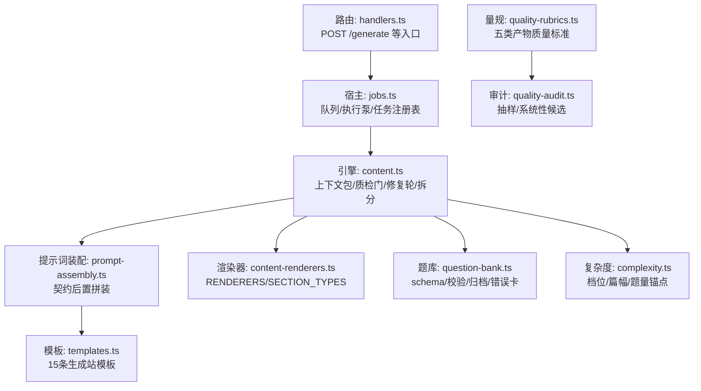
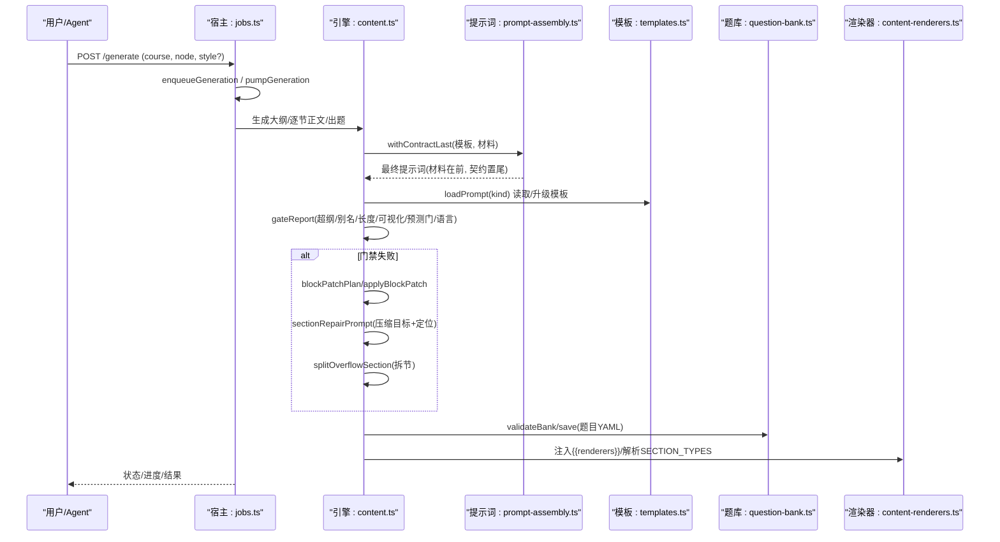
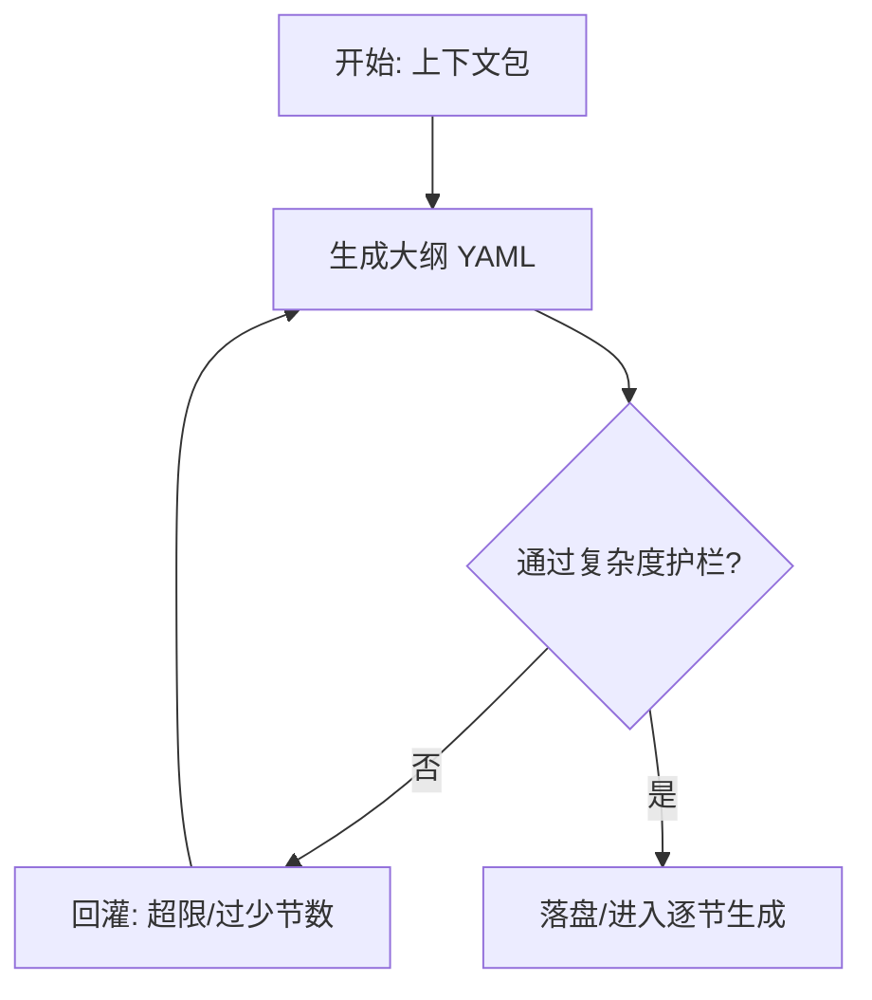
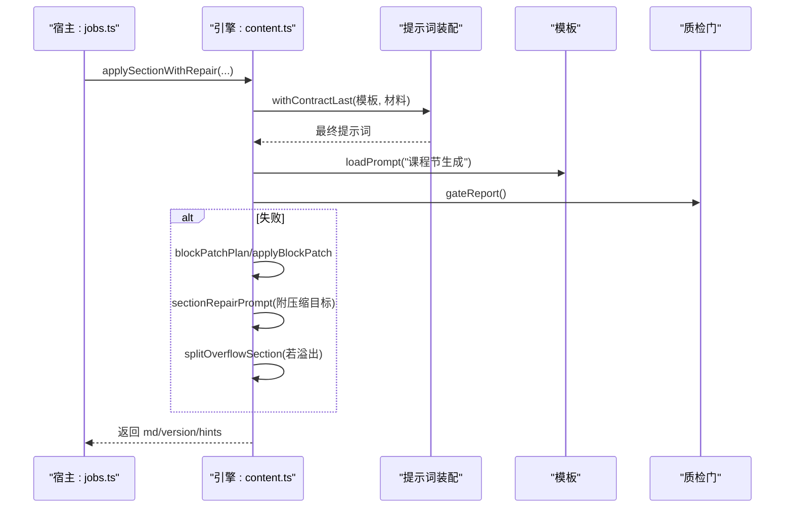
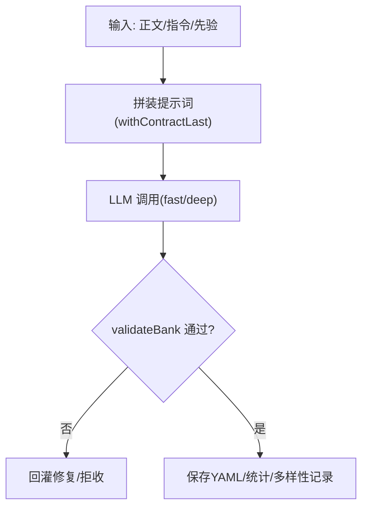
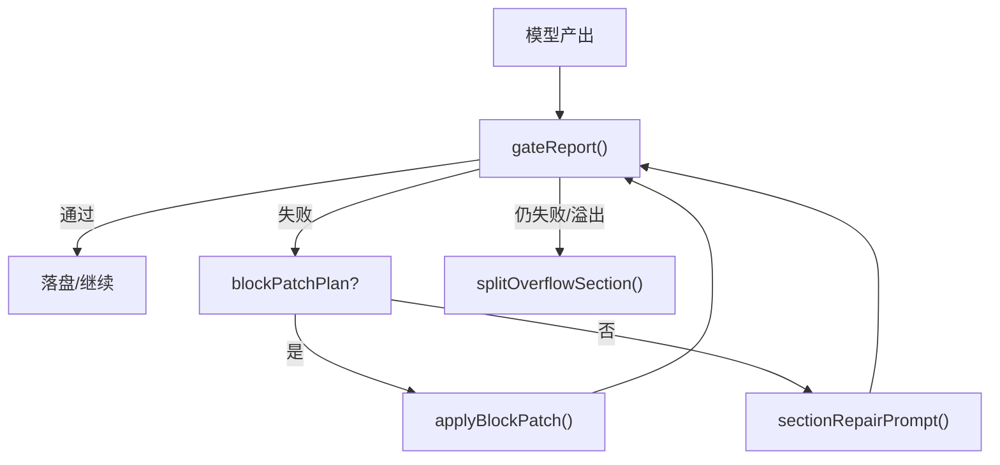
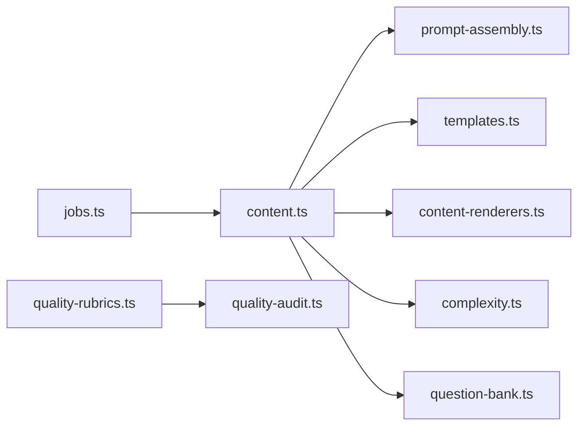

# 内容生成流水线

<cite>
**本文引用的文件**
- [content.ts](file://src/engine/content.ts)
- [prompt-assembly.ts](file://src/engine/prompt-assembly.ts)
- [templates.ts](file://src/engine/prompts/templates.ts)
- [quality-rubrics.ts](file://src/engine/quality-rubrics.ts)
- [quality-audit.ts](file://src/engine/quality-audit.ts)
- [question-bank.ts](file://src/engine/question-bank.ts)
- [jobs.ts](file://src/host/jobs.ts)
- [complexity.ts](file://src/engine/complexity.ts)
- [content-renderers.ts](file://shared/content-renderers.ts)
- [handlers.ts](file://src/host/handlers.ts)
</cite>

## 目录
1. [简介](#简介)
2. [项目结构](#项目结构)
3. [核心组件](#核心组件)
4. [架构总览](#架构总览)
5. [详细组件分析](#详细组件分析)
6. [依赖关系分析](#依赖关系分析)
7. [性能考虑](#性能考虑)
8. [故障排除指南](#故障排除指南)
9. [结论](#结论)
10. [附录](#附录)

## 简介
本文件系统化说明 AI 驱动的内容生成流水线，覆盖大纲生成、正文创作、题目生成的完整管道；解释提示词工程与模板系统、质量审核机制（自动评分与人工审核）、版本控制与变更管理、渲染器与多格式输出、配置与扩展方法，以及性能优化策略（批量处理、缓存、并发控制）；并提供使用示例与故障排除指引。

## 项目结构
内容生成流水线由“宿主任务调度层 + 引擎处理层 + 模板与量规 + 题库与渲染”构成：
- 宿主层负责入队、执行泵、队列持久化、失败恢复与日志记录。
- 引擎层负责上下文包组装、提示词拼装、质检门、修复轮、节拆分、交互件提取、题库写入等。
- 模板与量规提供可编辑的提示词模板与统一的质量标准。
- 题库模块承载题目 schema、校验、归档与错误对比卡。
- 渲染器定义 UI 与引擎共享的多格式能力清单。



图表来源
- [jobs.ts:1-120](file://src/host/jobs.ts#L1-L120)
- [content.ts:140-277](file://src/engine/content.ts#L140-L277)
- [prompt-assembly.ts:11-29](file://src/engine/prompt-assembly.ts#L11-L29)
- [templates.ts:17-602](file://src/engine/prompts/templates.ts#L17-L602)
- [content-renderers.ts:24-87](file://shared/content-renderers.ts#L24-L87)
- [question-bank.ts:139-262](file://src/engine/question-bank.ts#L139-L262)
- [complexity.ts:234-251](file://src/engine/complexity.ts#L234-L251)
- [quality-rubrics.ts:60-440](file://src/engine/quality-rubrics.ts#L60-L440)
- [handlers.ts:388-403](file://src/host/handlers.ts#L388-L403)

章节来源
- [jobs.ts:1-120](file://src/host/jobs.ts#L1-L120)
- [handlers.ts:388-403](file://src/host/handlers.ts#L388-L403)

## 核心组件
- 内容管线（Content）：上下文包组装、提示词加载与升级、质检门、块级局部修补、整节修复、节拆分、交互件提取与落盘。
- 提示词装配（withContractLast）：将“材料在前、输出契约段置尾”，避免模型丢失契约。
- 模板系统（TEMPLATES）：课程大纲、课程节生成（含苏格拉底/费曼变体）、节拆分、题目生成、笔记出题、教练回合、种子提案、罗盘初画、回执评审、错误对比卡等。
- 质量量规（QUALITY_RUBRICS）：大纲/节正文/题目/教练回合/种子·终点五类标准，带判据、证据要求与出处锚点。
- 质量审计（quality-audit）：抽样审计、系统性发现候选、报告声明行。
- 题库（QuestionBank/BankSubsystem）：YAML schema 校验、增删改查、归档、错误对比卡生成与作答结算。
- 复杂度（complexity）：节点档位折叠、节段难度档、篇幅/可视化预算、题量锚点。
- 渲染器（content-renderers）：RENDERERS/SECTION_TYPES/INTERACTIVE_TYPES，UI 与引擎共享事实源。

章节来源
- [content.ts:279-378](file://src/engine/content.ts#L279-L378)
- [prompt-assembly.ts:11-29](file://src/engine/prompt-assembly.ts#L11-L29)
- [templates.ts:17-602](file://src/engine/prompts/templates.ts#L17-L602)
- [quality-rubrics.ts:60-440](file://src/engine/quality-rubrics.ts#L60-L440)
- [quality-audit.ts:50-124](file://src/engine/quality-audit.ts#L50-L124)
- [question-bank.ts:139-262](file://src/engine/question-bank.ts#L139-L262)
- [complexity.ts:234-251](file://src/engine/complexity.ts#L234-L251)
- [content-renderers.ts:24-87](file://shared/content-renderers.ts#L24-L87)

## 架构总览
端到端流程：用户或 Agent 触发 → 宿主入队 → 执行泵串行执行 → 引擎按阶段产出 → 质检门拦截与修复 → 落盘并更新视图 → 队列空闲时触发教练回合/复诊结算。



图表来源
- [jobs.ts:292-322](file://src/host/jobs.ts#L292-L322)
- [jobs.ts:180-267](file://src/host/jobs.ts#L180-L267)
- [content.ts:334-378](file://src/engine/content.ts#L334-L378)
- [content.ts:757-788](file://src/engine/content.ts#L757-L788)
- [prompt-assembly.ts:11-29](file://src/engine/prompt-assembly.ts#L11-L29)
- [templates.ts:17-602](file://src/engine/prompts/templates.ts#L17-L602)
- [question-bank.ts:309-318](file://src/engine/question-bank.ts#L309-L318)
- [content-renderers.ts:97-108](file://shared/content-renderers.ts#L97-L108)

## 详细组件分析

### 大纲生成（课程大纲站）
- 输入：上下文包（目标节点、前置摘要、后继预告、领域边界、禁止概念、enc 边、复杂度档案）。
- 输出：YAML 节清单（id/title/type/points/tier/visual），受复杂度护栏约束（节数区间、单节字数/可视化上限）。
- 关键规则：不套固定栏目；相邻节递进；高难节点可能触发“先做后教”和“思维轨迹”；尊重 Vault 先验。



图表来源
- [content.ts:141-277](file://src/engine/content.ts#L141-L277)
- [complexity.ts:184-269](file://src/engine/complexity.ts#L184-L269)
- [templates.ts:20-71](file://src/engine/prompts/templates.ts#L20-L71)

章节来源
- [content.ts:141-277](file://src/engine/content.ts#L141-L277)
- [complexity.ts:184-269](file://src/engine/complexity.ts#L184-L269)
- [templates.ts:20-71](file://src/engine/prompts/templates.ts#L20-L71)

### 正文创作（课程节生成站）
- 输入：本节任务（id/title/type/tierLabel）、节间连贯注入（完整节清单 + 前节尾部窗口）、上下文包。
- 输出：单节 Markdown（类型前缀 + 标题 + 正文），严格遵循可视化为主、文字为辅、检索点密度、误解坑位预埋、先做后教/专家思维轨迹等。
- 修复阶梯：块级局部修补 → 整节压缩修复（deep 档）→ 溢出则拆节（大纲拆节站）。



图表来源
- [jobs.ts:180-267](file://src/host/jobs.ts#L180-L267)
- [content.ts:642-736](file://src/engine/content.ts#L642-L736)
- [prompt-assembly.ts:11-29](file://src/engine/prompt-assembly.ts#L11-L29)
- [templates.ts:72-151](file://src/engine/prompts/templates.ts#L72-L151)

章节来源
- [jobs.ts:180-267](file://src/host/jobs.ts#L180-L267)
- [content.ts:642-736](file://src/engine/content.ts#L642-L736)
- [templates.ts:72-151](file://src/engine/prompts/templates.ts#L72-L151)

### 题目生成（题目生成站/笔记出题站）
- 输入：节点正文/笔记正文、难度锚定、已有题库去重、误解先验、易混对、Vault 先验。
- 输出：YAML 题组（九种题型多样组合），每题含题干/答案/解析/difficulty/section/invokes/uses 等。
- 校验：validateBank 强校验；第二意见门抽样；多样性指标记录。



图表来源
- [question-bank.ts:139-262](file://src/engine/question-bank.ts#L139-L262)
- [jobs.ts:62-81](file://src/host/jobs.ts#L62-L81)
- [templates.ts:175-257](file://src/engine/prompts/templates.ts#L175-L257)

章节来源
- [question-bank.ts:139-262](file://src/engine/question-bank.ts#L139-L262)
- [jobs.ts:62-81](file://src/host/jobs.ts#L62-L81)
- [templates.ts:175-257](file://src/engine/prompts/templates.ts#L175-L257)

### 提示词工程与模板系统
- 模板位置：内置于 templates.ts，首行 vN 版本标记；vault 中同名 .md 存在且版本更低时自动升级并备份旧版。
- 契约后置：withContractLast 将“输出契约段”置于末尾，确保模型最后读到“只输出 X”。
- 渲染能力注入：{{renderers}} 替换为 RENDERERS 清单，保证 AI 仅使用面板支持格式。
- 风格变体：课程节生成-苏格拉底/费曼，通过不同模板实现教学风格切换。

```mermaid
classDiagram
class Content {
+loadPrompt(kind) string
+withContractLast(tpl, materials) string
+promptKinds() string[]
}
class PromptAssembly {
+splitContractSection(tpl) {head, contract}
+withContractLast(tpl, materials) string
}
class Templates {
<<常量>>
TEMPLATES : Record<string,string>
}
Content --> PromptAssembly : "调用"
Content --> Templates : "读取内置模板"
```

图表来源
- [content.ts:334-378](file://src/engine/content.ts#L334-L378)
- [prompt-assembly.ts:11-29](file://src/engine/prompt-assembly.ts#L11-L29)
- [templates.ts:17-602](file://src/engine/prompts/templates.ts#L17-L602)

章节来源
- [content.ts:334-378](file://src/engine/content.ts#L334-L378)
- [prompt-assembly.ts:11-29](file://src/engine/prompt-assembly.ts#L11-L29)
- [templates.ts:17-602](file://src/engine/prompts/templates.ts#L17-L602)

### 质量审核机制（自动评分与人工审核）
- 自动质检门：超纲引用检测、别名一致性、节形状（字数/可视化块）、Mermaid 引号、未注册代码块语言、预测门结构、富内容块语法、interactive 引用存在性。
- 修复策略：块级局部修补（plot/chart/svg/learnhub-predict 第 N 块）→ 整节压缩修复（附压缩目标与计数口径）→ 溢出时拆节。
- 质量量规：五类产物（大纲/节正文/题目/教练回合/种子·终点）维度与判据，AI 评分为提议，人审终审。
- 审计：抽样审计、系统性低分率候选、报告声明行。



图表来源
- [content.ts:412-587](file://src/engine/content.ts#L412-L587)
- [content.ts:642-736](file://src/engine/content.ts#L642-L736)
- [quality-rubrics.ts:60-440](file://src/engine/quality-rubrics.ts#L60-L440)
- [quality-audit.ts:50-124](file://src/engine/quality-audit.ts#L50-L124)

章节来源
- [content.ts:412-587](file://src/engine/content.ts#L412-L587)
- [content.ts:642-736](file://src/engine/content.ts#L642-L736)
- [quality-rubrics.ts:60-440](file://src/engine/quality-rubrics.ts#L60-L440)
- [quality-audit.ts:50-124](file://src/engine/quality-audit.ts#L50-L124)

### 内容版本控制与变更管理
- 模板版本：模板首行 `<!-- learnhub:prompt/vN -->` 标记版本；vault 中旧模板低于内置版本时自动升级并备份 .bak。
- 提示词登记：模板键集与 OUTPUT_CONTRACTS、PROMPT_CHANGELOG 三面对账，提交级登记门受控。
- 作业流：所有生成站最终提示词经 withContractLast 拼装，契约段置尾，避免漂移。

章节来源
- [content.ts:334-358](file://src/engine/content.ts#L334-L358)
- [templates.ts:1-14](file://src/engine/prompts/templates.ts#L1-L14)
- [prompt-assembly.ts:11-29](file://src/engine/prompt-assembly.ts#L11-L29)

### 内容渲染器系统与多格式输出
- 渲染器清单：RENDERERS 定义支持的代码块语言（mermaid/math/media/interactive/svg/plot/chart），并附带示例与提示。
- 节类型菜单：SECTION_TYPES 提供概念/例题/演示/小结/练习/交互/思维等类型及创作要求。
- 交互件规范：learnhub-interactive 标记块内联 HTML，系统落盘为独立文件并替换为 ```interactive 引用块；面板沙箱渲染，公式自动注入 KaTeX。
- 白名单检查：checkRendererLangs 拒绝未注册语言，防止降级为源码显示。

章节来源
- [content-renderers.ts:24-108](file://shared/content-renderers.ts#L24-L108)
- [content-renderers.ts:117-197](file://shared/content-renderers.ts#L117-L197)
- [content.ts:490-501](file://src/engine/content.ts#L490-L501)
- [content.ts:790-800](file://src/engine/content.ts#L790-L800)

### 配置选项与自定义扩展
- 风格选择：enqueueGeneration 支持 style 参数，用于替换节生成模板（默认/苏格拉底/费曼）。
- 自定义提示词：在 state/提示词/ 下自建 .md 同名文件，loadPrompt 会优先读取 vault 中的用户模板。
- 扩展渲染器：在 RENDERERS 增加一项并在 UI 注册表实现对应渲染器，两侧自动同步。
- 复杂度锚点：TIER_ANCHORS 调整节段数/篇幅/题量；SECTION_VISUAL_CAP 限制可视化块数量。

章节来源
- [jobs.ts:292-322](file://src/host/jobs.ts#L292-L322)
- [content.ts:367-378](file://src/engine/content.ts#L367-L378)
- [content-renderers.ts:24-87](file://shared/content-renderers.ts#L24-L87)
- [complexity.ts:234-251](file://src/engine/complexity.ts#L234-L251)

### 使用示例
- 生成整课内容：POST /learnhub/api/generate，传入 course、node、可选 style。
- 单节重写：POST /learnhub/api/generate/section，指定 course/node/section。
- 纯出题：POST /learnhub/api/question-generate，指定 course/node/count/instruction。
- 恢复队列：POST /learnhub/api/generate/resume。

章节来源
- [handlers.ts:388-403](file://src/host/handlers.ts#L388-L403)

## 依赖关系分析
- 宿主 jobs.ts 依赖 engine 暴露的 content/bank/growth 等方法，并通过 HostRuntime 读写任务注册表。
- 引擎 content.ts 依赖 prompt-assembly、templates、complexity、content-renderers、notes/io/yaml 等。
- 题库 question-bank.ts 依赖 grading、sessions、error-cards、bank-advice 等，并与存储/注册表交互。
- 质量量规与审计解耦：量规定义标准，审计基于量规进行抽样与系统性发现。



图表来源
- [jobs.ts:1-120](file://src/host/jobs.ts#L1-L120)
- [content.ts:1-30](file://src/engine/content.ts#L1-L30)
- [question-bank.ts:23-68](file://src/engine/question-bank.ts#L23-L68)
- [quality-rubrics.ts:60-440](file://src/engine/quality-rubrics.ts#L60-L440)
- [quality-audit.ts:1-22](file://src/engine/quality-audit.ts#L1-L22)

章节来源
- [jobs.ts:1-120](file://src/host/jobs.ts#L1-L120)
- [content.ts:1-30](file://src/engine/content.ts#L1-L30)
- [question-bank.ts:23-68](file://src/engine/question-bank.ts#L23-L68)
- [quality-rubrics.ts:60-440](file://src/engine/quality-rubrics.ts#L60-L440)
- [quality-audit.ts:1-22](file://src/engine/quality-audit.ts#L1-L22)

## 性能考虑
- 并发控制：全局单并发 FIFO 队列，同一节点 running/cancelling 时拒绝重复入队；pumpGeneration 串行执行。
- 批量处理：错误对比卡生成采用批上限（ERROR_CARD_BATCH_MAX），减少模型调用次数。
- 缓存机制：pre 闭包规模计算使用 WeakMap 缓存；复杂度档位与节段难度档推导为纯函数，便于复用。
- 重试与修复：块级局部修补降低大段重写成本；整节压缩修复一次 deep 档尝试；溢出才拆节。
- 资源保护：broken 态写回闸拒绝全量落盘，避免坏档覆盖；终态保留期清扫悬空任务。

章节来源
- [jobs.ts:269-322](file://src/host/jobs.ts#L269-L322)
- [jobs.ts:690-740](file://src/host/jobs.ts#L690-L740)
- [question-bank.ts:572-684](file://src/engine/question-bank.ts#L572-L684)
- [complexity.ts:95-113](file://src/engine/complexity.ts#L95-L113)
- [content.ts:670-736](file://src/engine/content.ts#L670-L736)

## 故障排除指南
- 生成被拒绝（终点）：终点节点不被学习调度，生成门恒拒；需修改图结构或绕过终点。
- 队列损坏（broken）：写回闸拒绝一切会改动注册表的交互路径；需修复任务档后重启。
- 模板缺失或版本过低：loadPrompt 会报错未知类型或自动升级；检查 state/提示词/ 是否存在同名 .md。
- 门禁失败：查看 gateReport 返回的 findings/warns；优先走块级修补，再整节压缩修复，必要时拆节。
- 题目入库失败：validateBank 报错会列出具体字段问题；根据错误修正 YAML 后重试。
- 交互件缺失：gateReport 会报 interactive 引用文件不存在；确认相对路径与落盘位置一致。

章节来源
- [jobs.ts:292-322](file://src/host/jobs.ts#L292-L322)
- [jobs.ts:270-286](file://src/host/jobs.ts#L270-L286)
- [content.ts:334-358](file://src/engine/content.ts#L334-L358)
- [content.ts:757-788](file://src/engine/content.ts#L757-L788)
- [question-bank.ts:309-318](file://src/engine/question-bank.ts#L309-L318)

## 结论
本流水线以“模板 + 契约后置 + 强质检门 + 修复阶梯”为核心，结合复杂度锚点与量规体系，实现了从大纲到正文再到题目的稳定生成与质量控制。宿主层的串行队列与恢复机制保障了可靠性，渲染器与题库提供了丰富的表达与评估能力。通过配置与扩展点，可在不侵入核心逻辑的前提下定制风格、模板与输出格式。

## 附录
- 关键入口：/learnhub/api/generate、/generate/section、/question-generate、/generate/resume。
- 关键常量：MAX_SECTIONS=8，SECTION_VISUAL_CAP=2，TIER_ANCHORS 各档篇幅/题量锚点。
- 关键模板键：课程大纲、课程节生成、课程节生成-苏格拉底、课程节生成-费曼、课程节拆分、题目生成、笔记出题、教练回合、种子提案、罗盘初画、回执评审、错误对比卡。