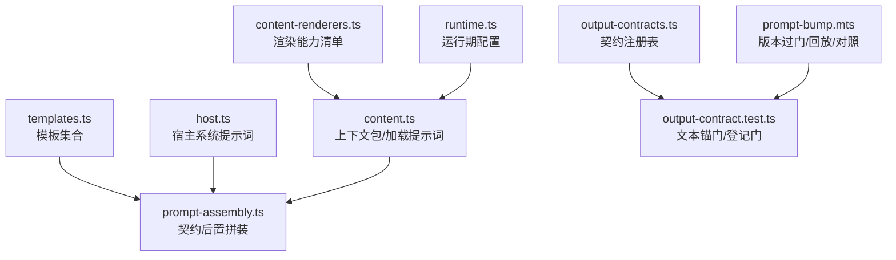
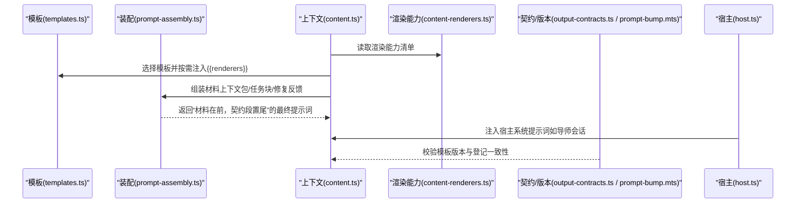
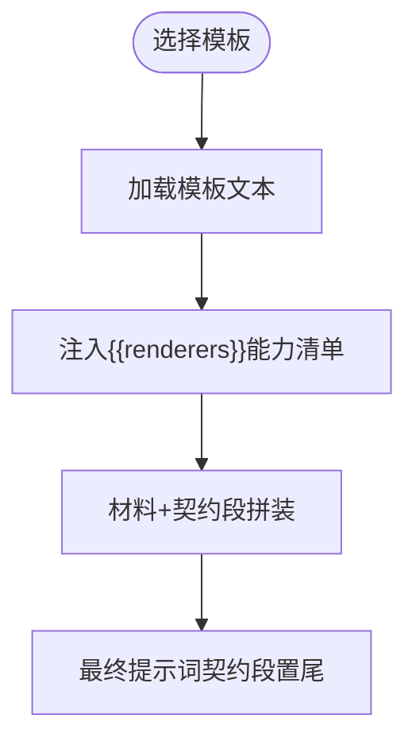
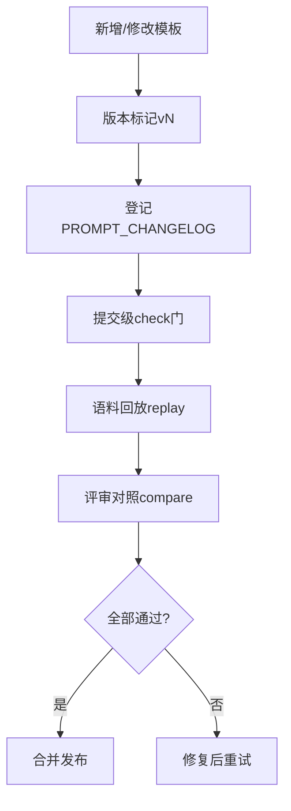
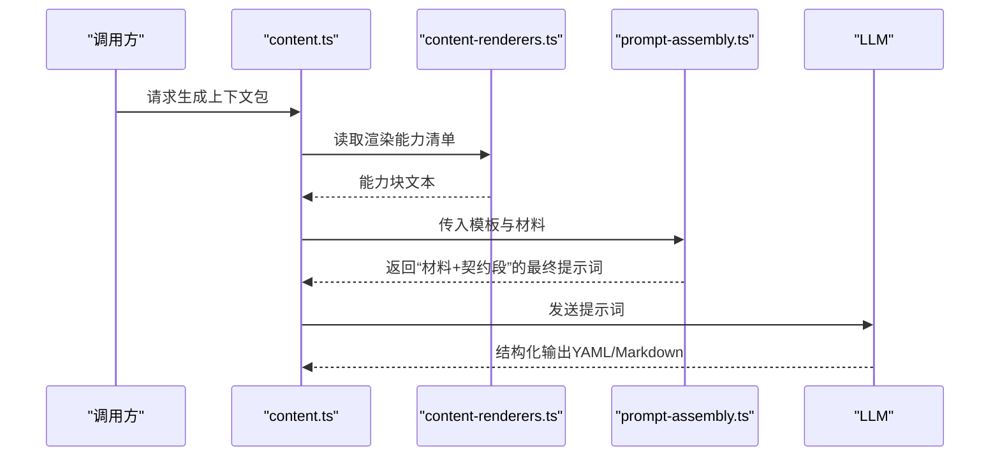
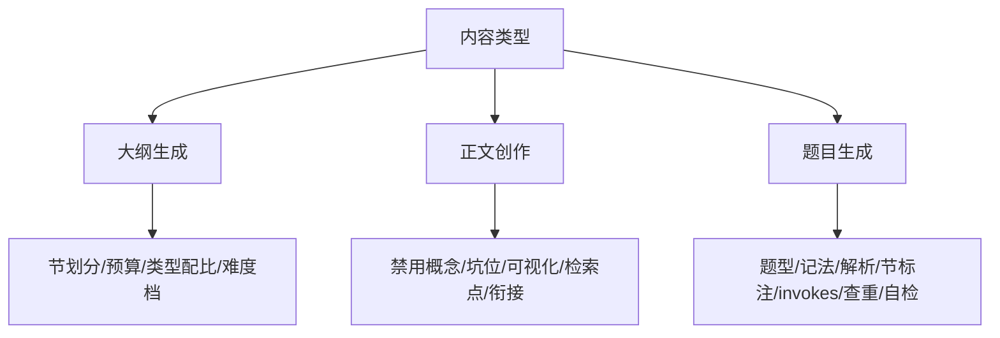
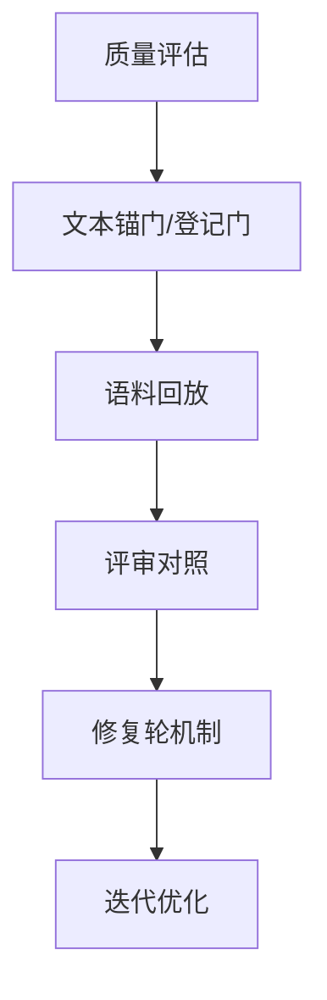
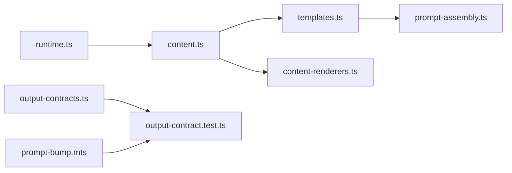

# 提示词工程

<cite>
**本文引用的文件**
- [src/engine/prompts/templates.ts](file://src/engine/prompts/templates.ts)
- [src/engine/prompts/host.ts](file://src/engine/prompts/host.ts)
- [src/engine/prompt-assembly.ts](file://src/engine/prompt-assembly.ts)
- [src/engine/content.ts](file://src/engine/content.ts)
- [shared/content-renderers.ts](file://shared/content-renderers.ts)
- [scripts/prompt-bump.mts](file://scripts/prompt-bump.mts)
- [tests/output-contract.test.ts](file://tests/output-contract.test.ts)
- [src/engine/output-contracts.ts](file://src/engine/output-contracts.ts)
- [src/host/runtime.ts](file://src/host/runtime.ts)
</cite>

## 目录
1. [简介](#简介)
2. [项目结构](#项目结构)
3. [核心组件](#核心组件)
4. [架构总览](#架构总览)
5. [详细组件分析](#详细组件分析)
6. [依赖关系分析](#依赖关系分析)
7. [性能考量](#性能考量)
8. [故障排查指南](#故障排查指南)
9. [结论](#结论)
10. [附录](#附录)

## 简介
本文件系统化梳理“提示词工程”的设计与实现，覆盖模板系统、上下文注入、变量替换、动态内容生成、不同内容类型的策略（大纲/正文/题目）、质量评估与优化方法、版本控制机制、最佳实践与调试技巧。目标是让读者在不深入代码的前提下理解并安全地扩展提示词体系。

## 项目结构
提示词工程围绕“模板 + 装配 + 渲染能力 + 契约与版本门”的闭环组织：
- 模板集中定义于 templates.ts，按“生成站名”键管理；宿主侧系统提示词集中在 host.ts。
- 提示词装配统一通过 prompt-assembly.ts 完成，确保“输出契约段”始终置于最终提示词末尾，避免“丢失在中间”的问题。
- 渲染能力清单 shared/content-renderers.ts 作为 UI 与引擎共享事实源，运行时注入到模板占位符中。
- 版本与变更受控由 scripts/prompt-bump.mts 与 tests/output-contract.test.ts 共同保障，结合 output-contracts.ts 的契约注册表形成可审计、可回放的治理体系。
- 运行时配置（如 effort、模型、抽样率等）由 host/runtime.ts 提供，影响提示词调用策略与成本。

**图表来源**
- [src/engine/prompts/templates.ts:1-602](file://src/engine/prompts/templates.ts#L1-L602)
- [src/engine/prompts/host.ts:1-48](file://src/engine/prompts/host.ts#L1-L48)
- [src/engine/prompt-assembly.ts:1-43](file://src/engine/prompt-assembly.ts#L1-L43)
- [src/engine/content.ts:1-200](file://src/engine/content.ts#L1-L200)
- [shared/content-renderers.ts:1-197](file://shared/content-renderers.ts#L1-L197)
- [scripts/prompt-bump.mts:1-527](file://scripts/prompt-bump.mts#L1-L527)
- [tests/output-contract.test.ts:377-500](file://tests/output-contract.test.ts#L377-L500)
- [src/engine/output-contracts.ts:1-200](file://src/engine/output-contracts.ts#L1-L200)
- [src/host/runtime.ts:1-41](file://src/host/runtime.ts#L1-L41)

**章节来源**
- [src/engine/prompts/templates.ts:1-602](file://src/engine/prompts/templates.ts#L1-L602)
- [src/engine/prompts/host.ts:1-48](file://src/engine/prompts/host.ts#L1-L48)
- [src/engine/prompt-assembly.ts:1-43](file://src/engine/prompt-assembly.ts#L1-L43)
- [src/engine/content.ts:1-200](file://src/engine/content.ts#L1-L200)
- [shared/content-renderers.ts:1-197](file://shared/content-renderers.ts#L1-L197)
- [scripts/prompt-bump.mts:1-527](file://scripts/prompt-bump.mts#L1-L527)
- [tests/output-contract.test.ts:377-500](file://tests/output-contract.test.ts#L377-L500)
- [src/engine/output-contracts.ts:1-200](file://src/engine/output-contracts.ts#L1-L200)
- [src/host/runtime.ts:1-41](file://src/host/runtime.ts#L1-L41)

## 核心组件
- 模板系统：以“生成站名”为键的模板字典，包含课程大纲、课程节生成（含风格变体）、题目生成、笔记出题、项目里程碑计划/产物、目标反编译、回执评审、错误对比卡、罗盘初画、教练回合、种子提案等。每条模板首行带有版本标记，用于版本追踪与变更审计。
- 宿主系统提示词：导师会话、回路历史记录骨架、节生成材料块标题等，专供宿主侧使用，不混入模板主流程。
- 提示词装配器：负责将“材料（上下文包/任务块/修复反馈）”与“输出契约段”拼接，保证契约段位于最终提示词末尾，提升模型遵循度。
- 渲染能力注入：将 UI 与引擎共享的渲染格式清单注入模板占位符，使模型仅使用面板支持的可视化能力。
- 版本与契约治理：通过脚本与测试门强制“模板版本 bump 必须伴随登记条目”，并提供语料回放与评审对照工具，确保变更可追溯、可回归验证。

**章节来源**
- [src/engine/prompts/templates.ts:1-602](file://src/engine/prompts/templates.ts#L1-L602)
- [src/engine/prompts/host.ts:1-48](file://src/engine/prompts/host.ts#L1-L48)
- [src/engine/prompt-assembly.ts:1-43](file://src/engine/prompt-assembly.ts#L1-L43)
- [shared/content-renderers.ts:1-197](file://shared/content-renderers.ts#L1-L197)
- [scripts/prompt-bump.mts:1-527](file://scripts/prompt-bump.mts#L1-L527)
- [tests/output-contract.test.ts:377-500](file://tests/output-contract.test.ts#L377-L500)
- [src/engine/output-contracts.ts:1-200](file://src/engine/output-contracts.ts#L1-L200)

## 架构总览
提示词工程采用“模板单源 + 装配统一 + 契约后置 + 能力注入 + 版本门禁”的分层架构：
- 模板层：集中定义各站的指令与约束，支持风格变体与领域特定要求。
- 装配层：统一处理“材料 + 契约段”的顺序与分隔，避免契约被淹没。
- 能力层：渲染能力清单作为单一事实源，驱动模板中的可视化表达边界。
- 治理层：版本标记、变更登记表、回放与对照构成“提交级—运行级—评测级”三层门禁。

**图表来源**
- [src/engine/prompts/templates.ts:1-602](file://src/engine/prompts/templates.ts#L1-L602)
- [src/engine/prompt-assembly.ts:1-43](file://src/engine/prompt-assembly.ts#L1-L43)
- [src/engine/content.ts:1-200](file://src/engine/content.ts#L1-L200)
- [shared/content-renderers.ts:1-197](file://shared/content-renderers.ts#L1-L197)
- [src/engine/output-contracts.ts:1-200](file://src/engine/output-contracts.ts#L1-L200)
- [scripts/prompt-bump.mts:1-527](file://scripts/prompt-bump.mts#L1-L527)
- [src/engine/prompts/host.ts:1-48](file://src/engine/prompts/host.ts#L1-L48)

## 详细组件分析

### 模板系统与内置模板管理
- 模板键集与“生成站名”一一对应，便于注册表、登记表与测试对账。
- 模板文本为惰性字符串，不含插值；变量面仅两类：首行版本标记与行内占位符（如 {{renderers}}）。
- 模板不得整体送入通用渲染器，以避免误判缺失变量；具体替换由 Content.loadPrompt 与装配流程完成。
- 版本标记与变更登记表同源，修改模板即改生产行为，需走“登记 + 过门”流程。

**图表来源**
- [src/engine/prompts/templates.ts:1-602](file://src/engine/prompts/templates.ts#L1-L602)
- [src/engine/content.ts:1-200](file://src/engine/content.ts#L1-L200)
- [src/engine/prompt-assembly.ts:1-43](file://src/engine/prompt-assembly.ts#L1-L43)

**章节来源**
- [src/engine/prompts/templates.ts:1-602](file://src/engine/prompts/templates.ts#L1-L602)
- [src/engine/content.ts:1-200](file://src/engine/content.ts#L1-L200)
- [src/engine/prompt-assembly.ts:1-43](file://src/engine/prompt-assembly.ts#L1-L43)

### 自定义模板支持与版本控制机制
- 新增模板需在模板字典中添加键值，并在变更登记表登记版本、日期、变更类型与预期输出增量。
- 提交级门禁扫描模板面（包括历史路径），检测新出现的版本号是否在同提交登记。
- 语料回放：对已有站点产出进行解析回归，基线通过而回放失败视为回归。
- 评审对照：基于同源样本的两份报告，逐（站×维度）均值不降判定。

**图表来源**
- [scripts/prompt-bump.mts:1-527](file://scripts/prompt-bump.mts#L1-L527)
- [tests/output-contract.test.ts:377-500](file://tests/output-contract.test.ts#L377-L500)
- [src/engine/output-contracts.ts:1-200](file://src/engine/output-contracts.ts#L1-L200)

**章节来源**
- [scripts/prompt-bump.mts:1-527](file://scripts/prompt-bump.mts#L1-L527)
- [tests/output-contract.test.ts:377-500](file://tests/output-contract.test.ts#L377-L500)
- [src/engine/output-contracts.ts:1-200](file://src/engine/output-contracts.ts#L1-L200)

### 提示词组装过程：上下文注入、变量替换与动态内容生成
- 上下文包：由 content.ts 组装，包含目标节点、前置摘要、后继预告、领域边界、禁止概念、复杂度预算、学习者先验等，按号引用（§1–§13）以便模板稳定锚定。
- 变量替换：模板中的 {{renderers}} 由渲染能力清单替换；其他占位符由调用方在材料注入阶段处理，避免误报缺失变量。
- 动态内容：根据节点难度、复杂度档案、节类型菜单与可视化预算，动态决定大纲/节正文/题目的结构与约束。

**图表来源**
- [src/engine/content.ts:1-200](file://src/engine/content.ts#L1-L200)
- [shared/content-renderers.ts:1-197](file://shared/content-renderers.ts#L1-L197)
- [src/engine/prompt-assembly.ts:1-43](file://src/engine/prompt-assembly.ts#L1-L43)

**章节来源**
- [src/engine/content.ts:1-200](file://src/engine/content.ts#L1-L200)
- [shared/content-renderers.ts:1-197](file://shared/content-renderers.ts#L1-L197)
- [src/engine/prompt-assembly.ts:1-43](file://src/engine/prompt-assembly.ts#L1-L43)

### 不同内容类型的提示词策略
- 大纲生成：强调节划分原则、数量与顺序、类型配比、复杂度预算、可视化上限、难度档锚定、先做后教与专家思维轨迹的硬性要求。
- 正文创作（课程节生成）：严格约束只输出一节、禁用概念、前置档位、误解坑位、可视化为主、检索点设计、与前节结尾衔接、排版约定、别名与图片规范。
- 题目生成：题型多样、数学记法契约、解析三段式、节标注与 invokes 精确照抄、查重、自检、易混对与干扰项优先来自先验、开放题限制等。

**图表来源**
- [src/engine/prompts/templates.ts:1-602](file://src/engine/prompts/templates.ts#L1-L602)

**章节来源**
- [src/engine/prompts/templates.ts:1-602](file://src/engine/prompts/templates.ts#L1-L602)

### 质量评估与优化方法
- 文本锚门：检查契约句族漂移、机器块禁令、覆盖完备性、站名对账、结构化资格不变式。
- 变更登记门：确保模板版本与登记一致，防止“改了模板未登记”。
- 语料回放：对历史产出进行解析回归，基线通过而回放失败视为回归。
- 评审对照：同源样本两份报告，逐（站×维度）均值不降。
- 修复轮机制：针对各站定义修复策略（如 outlineRepairFeedback、sectionRepairLadder 等），在受理侧或装配侧自动触发。

**图表来源**
- [tests/output-contract.test.ts:377-500](file://tests/output-contract.test.ts#L377-L500)
- [scripts/prompt-bump.mts:1-527](file://scripts/prompt-bump.mts#L1-L527)
- [src/engine/output-contracts.ts:1-200](file://src/engine/output-contracts.ts#L1-L200)

**章节来源**
- [tests/output-contract.test.ts:377-500](file://tests/output-contract.test.ts#L377-L500)
- [scripts/prompt-bump.mts:1-527](file://scripts/prompt-bump.mts#L1-L527)
- [src/engine/output-contracts.ts:1-200](file://src/engine/output-contracts.ts#L1-L200)

### 最佳实践与调试技巧
- 模板编写：
  - 保持模板为惰性字符串，避免插值；变量替换交由装配流程。
  - 明确“输出契约段”位置，确保“只输出 X”指令靠近生成点。
  - 使用渲染能力清单限定可视化表达，避免面板无法渲染的格式。
- 上下文注入：
  - 利用上下文包的固定段落编号（§1–§13）稳定锚定模板。
  - 尊重“学习者已有理解（Vault 先验）”，复用其术语与记法。
- 调试技巧：
  - 使用 prompt-bump.mts 的 replay 命令回放历史产出，定位解析回归。
  - 使用 compare 命令对比前后两份评审报告，识别质量下降。
  - 借助文本锚门快速发现契约句漂移与机器块违规。

**章节来源**
- [src/engine/prompts/templates.ts:1-602](file://src/engine/prompts/templates.ts#L1-L602)
- [src/engine/prompt-assembly.ts:1-43](file://src/engine/prompt-assembly.ts#L1-L43)
- [shared/content-renderers.ts:1-197](file://shared/content-renderers.ts#L1-L197)
- [scripts/prompt-bump.mts:1-527](file://scripts/prompt-bump.mts#L1-L527)
- [tests/output-contract.test.ts:377-500](file://tests/output-contract.test.ts#L377-L500)

### 模板示例与使用模式
- 课程大纲：输入上下文包，输出 YAML 节清单；强调节划分原则、预算与类型配比。
- 课程节生成（含苏格拉底/费曼风格）：只写指定一节，遵循禁用概念、坑位、可视化、检索点、衔接等硬约束。
- 题目生成：输出 YAML 题组，严格题型、记法、解析、节标注、invokes、查重与自检。
- 项目里程碑计划/产物：面向真实项目的可交付检查点与任务卡，强调渐退三档与验收清单。
- 目标反编译/种子提案：从目标描述反推里程碑计划或起草起点与终点，强调承诺句与可兑现性。
- 回执评审/错误对比卡/罗盘初画/教练回合：分别对应外部练习评审、错误模式辨别、路线草图与滚动裁决。

**章节来源**
- [src/engine/prompts/templates.ts:1-602](file://src/engine/prompts/templates.ts#L1-L602)

## 依赖关系分析
- 模板与装配：templates.ts 提供模板，prompt-assembly.ts 统一处理契约段后置，避免契约丢失。
- 内容与渲染：content.ts 组装上下文包并加载模板，content-renderers.ts 提供渲染能力清单，两侧共享单一事实源。
- 版本与契约：output-contracts.ts 定义契约与修复策略，prompt-bump.mts 与 output-contract.test.ts 执行登记门、回放与对照。
- 运行时配置：runtime.ts 提供 provider/model/effort/抽样率等，影响提示词调用策略与成本。

**图表来源**
- [src/engine/prompts/templates.ts:1-602](file://src/engine/prompts/templates.ts#L1-L602)
- [src/engine/prompt-assembly.ts:1-43](file://src/engine/prompt-assembly.ts#L1-L43)
- [src/engine/content.ts:1-200](file://src/engine/content.ts#L1-L200)
- [shared/content-renderers.ts:1-197](file://shared/content-renderers.ts#L1-L197)
- [src/engine/output-contracts.ts:1-200](file://src/engine/output-contracts.ts#L1-L200)
- [scripts/prompt-bump.mts:1-527](file://scripts/prompt-bump.mts#L1-L527)
- [tests/output-contract.test.ts:377-500](file://tests/output-contract.test.ts#L377-L500)
- [src/host/runtime.ts:1-41](file://src/host/runtime.ts#L1-L41)

**章节来源**
- [src/engine/prompts/templates.ts:1-602](file://src/engine/prompts/templates.ts#L1-L602)
- [src/engine/prompt-assembly.ts:1-43](file://src/engine/prompt-assembly.ts#L1-L43)
- [src/engine/content.ts:1-200](file://src/engine/content.ts#L1-L200)
- [shared/content-renderers.ts:1-197](file://shared/content-renderers.ts#L1-L197)
- [src/engine/output-contracts.ts:1-200](file://src/engine/output-contracts.ts#L1-L200)
- [scripts/prompt-bump.mts:1-527](file://scripts/prompt-bump.mts#L1-L527)
- [tests/output-contract.test.ts:377-500](file://tests/output-contract.test.ts#L377-L500)
- [src/host/runtime.ts:1-41](file://src/host/runtime.ts#L1-L41)

## 性能考量
- 思考档策略：fastEffort/deepEffort 控制机械调用与高复杂度节点的思考深度，平衡质量与成本。
- 抽样率：quizAuditRate 控制出题第二意见门的抽样比例，默认低采样起步，高难度题恒入样。
- 可视化预算：单节可视化块上限与文字篇幅阈值，避免超预算导致拒收返工。
- 上下文包截断：禁止概念列表按深度降序截断至 200 条，兼顾语义与排版预算。

**章节来源**
- [src/host/runtime.ts:1-41](file://src/host/runtime.ts#L1-L41)
- [src/engine/content.ts:1-200](file://src/engine/content.ts#L1-L200)

## 故障排查指南
- 模板漂移：使用文本锚门检查契约句族漂移与机器块禁令，快速定位问题。
- 版本不一致：若模板版本 bump 未登记，登记门将报错；需补充 PROMPT_CHANGELOG 条目。
- 解析回归：使用 replay 命令回放历史产出，基线通过而回放失败即为回归，需修复模板或装配逻辑。
- 质量下降：使用 compare 命令对比前后报告，若某（站×维度）均值下降，需调整模板或上下文注入。
- 运行时配置：检查 provider/model/effort/抽样率等配置是否正确，避免调用异常或成本飙升。

**章节来源**
- [tests/output-contract.test.ts:377-500](file://tests/output-contract.test.ts#L377-L500)
- [scripts/prompt-bump.mts:1-527](file://scripts/prompt-bump.mts#L1-L527)
- [src/host/runtime.ts:1-41](file://src/host/runtime.ts#L1-L41)

## 结论
提示词工程通过“模板单源、装配统一、能力注入、契约后置、版本门禁”构建了可审计、可回放、可对照的高质量生成体系。不同内容类型（大纲/正文/题目）各有明确策略与约束，配合质量评估与优化方法，确保生产行为的稳定性与可演进性。建议在新增模板时严格遵循版本登记与过门流程，并利用回放与对照工具持续验证变更效果。

## 附录
- 关键常量与接口：
  - 模板键集：TEMPLATES（templates.ts）
  - 渲染能力清单：RENDERERS（content-renderers.ts）
  - 契约注册表：OUTPUT_CONTRACTS（output-contracts.ts）
  - 版本标记正则：MARKER_RE（prompt-bump.mts）
- 常用命令：
  - check：登记门（提交级）
  - replay：语料回放（解析回归）
  - compare：评审对照（均值不降）

**章节来源**
- [src/engine/prompts/templates.ts:1-602](file://src/engine/prompts/templates.ts#L1-L602)
- [shared/content-renderers.ts:1-197](file://shared/content-renderers.ts#L1-L197)
- [src/engine/output-contracts.ts:1-200](file://src/engine/output-contracts.ts#L1-L200)
- [scripts/prompt-bump.mts:1-527](file://scripts/prompt-bump.mts#L1-L527)