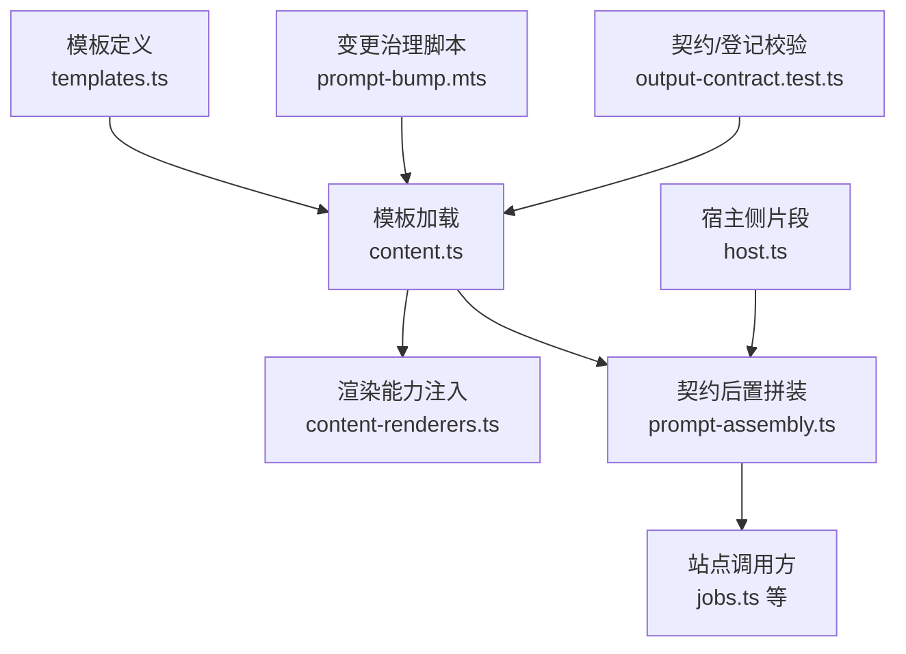
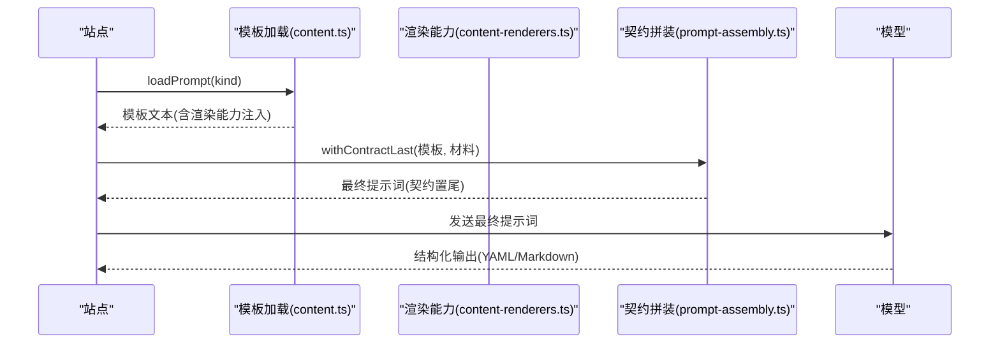
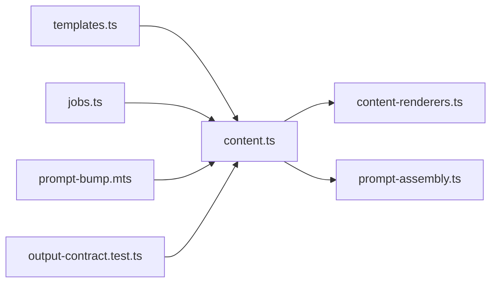

# 模板系统

<cite>
**本文引用的文件**
- [templates.ts](file://src/engine/prompts/templates.ts)
- [host.ts](file://src/engine/prompts/host.ts)
- [content.ts](file://src/engine/content.ts)
- [prompt-assembly.ts](file://src/engine/prompt-assembly.ts)
- [content-renderers.ts](file://shared/content-renderers.ts)
- [jobs.ts](file://src/host/jobs.ts)
- [prompt-bump.mts](file://scripts/prompt-bump.mts)
- [output-contract.test.ts](file://tests/output-contract.test.ts)
</cite>

## 目录
1. [简介](#简介)
2. [项目结构](#项目结构)
3. [核心组件](#核心组件)
4. [架构总览](#架构总览)
5. [详细组件分析](#详细组件分析)
6. [依赖关系分析](#依赖关系分析)
7. [性能与缓存策略](#性能与缓存策略)
8. [故障排查指南](#故障排查指南)
9. [结论](#结论)
10. [附录：模板语法与最佳实践](#附录模板语法与最佳实践)

## 简介
本仓库的提示词模板系统用于为多个“生成站”（如课程大纲、课程节生成、题目生成、教练回合等）提供统一、可版本化、可审计的提示词来源。模板以单源集中管理，运行时按站点加载并注入渲染能力清单；通过“契约后置拼装”确保输出契约始终位于最终提示词的末尾，从而提升模型遵循度。变更流程包含登记门、语料回放与评审对照三道过门，保障模板改动可控、可回归、可评估。

## 项目结构
- 模板定义：集中在 `src/engine/prompts/templates.ts`，每个键对应一个生成站的模板文本。
- 宿主侧提示词片段：集中在 `src/engine/prompts/host.ts`，供宿主侧组装上下文包使用。
- 模板加载与版本控制：由 `src/engine/content.ts` 实现，负责内置模板覆盖升级、用户自定义模板发现、渲染能力注入。
- 提示词拼装：`src/engine/prompt-assembly.ts` 提供“契约后置拼装”与修复轮提示词构造。
- 渲染能力清单：`shared/content-renderers.ts` 是 UI 与引擎共享的渲染器注册表，同时被注入到模板中。
- 调用方：`src/host/jobs.ts` 等站点在需要时按 kind 加载模板并拼装材料。
- 变更治理：`scripts/prompt-bump.mts` 提供登记门、语料回放、评审对照工具；测试用例 `tests/output-contract.test.ts` 对契约段位置、登记表一致性进行断言。

图表来源
- [templates.ts:1-602](file://src/engine/prompts/templates.ts#L1-L602)
- [content.ts:330-378](file://src/engine/content.ts#L330-L378)
- [prompt-assembly.ts:1-43](file://src/engine/prompt-assembly.ts#L1-L43)
- [content-renderers.ts:97-108](file://shared/content-renderers.ts#L97-L108)
- [jobs.ts:794-834](file://src/host/jobs.ts#L794-L834)
- [prompt-bump.mts:1-63](file://scripts/prompt-bump.mts#L1-L63)
- [output-contract.test.ts:356-378](file://tests/output-contract.test.ts#L356-L378)

章节来源
- [templates.ts:1-602](file://src/engine/prompts/templates.ts#L1-L602)
- [content.ts:330-378](file://src/engine/content.ts#L330-L378)
- [prompt-assembly.ts:1-43](file://src/engine/prompt-assembly.ts#L1-L43)
- [content-renderers.ts:97-108](file://shared/content-renderers.ts#L97-L108)
- [jobs.ts:794-834](file://src/host/jobs.ts#L794-L834)
- [prompt-bump.mts:1-63](file://scripts/prompt-bump.mts#L1-L63)
- [output-contract.test.ts:356-378](file://tests/output-contract.test.ts#L356-L378)

## 核心组件
- 模板集合 TEMPLATES：以“生成站名”为键的字符串常量集，每条模板首行带有版本标记（例如 v11），用于版本管理与登记对齐。
- 模板加载器 Content.loadPrompt：读取内置或用户自定义模板，自动将渲染能力清单注入到模板中（支持占位符替换或尾部追加）。
- 契约后置拼装 withContractLast：将模板末段的“输出契约”切出并置于最终提示词末尾，保证“只输出 X”的指令离生成点最近。
- 宿主侧提示词片段：如导师会话指令、回路历史骨架、前节结尾标题等，作为上下文材料拼接进最终提示词。
- 变更治理 prompt-bump：登记门检查新版本是否登记、语料回放验证解析稳定性、评审对照比较质量均值不降。

章节来源
- [templates.ts:1-602](file://src/engine/prompts/templates.ts#L1-L602)
- [content.ts:330-378](file://src/engine/content.ts#L330-L378)
- [prompt-assembly.ts:1-43](file://src/engine/prompt-assembly.ts#L1-L43)
- [host.ts:18-35](file://src/engine/prompts/host.ts#L18-L35)
- [prompt-bump.mts:1-63](file://scripts/prompt-bump.mts#L1-L63)

## 架构总览
模板系统的运行路径如下：
- 站点调用 loadPrompt(kind) 获取模板文本。
- 若存在内置模板且本地版本更低，则覆盖升级（备份旧版 .bak）。
- 将渲染能力清单注入模板（优先替换 {{renderers}}，否则尾部追加）。
- 站点将上下文材料传入 withContractLast，把“输出契约”置尾，形成最终提示词。
- 变更治理脚本在提交级与发布前对模板改动进行三重把关。

图表来源
- [content.ts:330-378](file://src/engine/content.ts#L330-L378)
- [content-renderers.ts:97-108](file://shared/content-renderers.ts#L97-L108)
- [prompt-assembly.ts:11-29](file://src/engine/prompt-assembly.ts#L11-L29)

## 详细组件分析

### 模板组织与管理机制
- 单源集中：所有模板集中于 templates.ts，键即生成站名，便于检索与审计。
- 版本标记：每条模板首行带 `<!-- learnhub:prompt/vN -->`，用于版本对比与登记对齐。
- 用户覆盖：运行时若 vault 下存在同名 .md，且版本低于内置，则自动覆盖升级并备份旧版。
- 自定义扩展：非内置类型需在 state/提示词/ 下自建同名 .md，loadPrompt 会将其加入可用列表。

章节来源
- [templates.ts:1-602](file://src/engine/prompts/templates.ts#L1-L602)
- [content.ts:330-378](file://src/engine/content.ts#L330-L378)

### 内置模板分类与命名规范
- 课程域：课程大纲、课程节生成（含苏格拉底/费曼风格变体）、课程节拆分。
- 题库域：题目生成、笔记出题、错误对比卡。
- 项目域：项目里程碑计划、项目里程碑产物、项目目标反编译。
- 成长与评审：罗盘初画、教练回合、回执评审、种子提案。
- 命名规范：键名为中文站点名；风格变体采用“主名称-风格”形式（如“课程节生成-苏格拉底”）。

章节来源
- [templates.ts:18-602](file://src/engine/prompts/templates.ts#L18-L602)

### 模板语法规范
- 变量占位符：模板内仅允许两类变量——首行版本标记与行内 `{{renderers}}` 占位符；其他插值不在模板层处理，避免误判缺失变量。
- 条件与循环：模板本身不包含条件语句或循环结构；逻辑由站点侧的材料拼装与后续解析完成。
- 输出契约：模板末段以 `## 输出…` 标识的契约段会被切出并置尾，确保“只输出 X”的指令最后呈现。

章节来源
- [templates.ts:1-14](file://src/engine/prompts/templates.ts#L1-L14)
- [prompt-assembly.ts:11-29](file://src/engine/prompt-assembly.ts#L11-L29)

### 模板继承与复用机制
- 无显式继承：模板之间不直接继承；通过“风格变体”（如苏格拉底/费曼）复用基础约束与结构。
- 片段复用：宿主侧片段（如导师指令、回路历史骨架、前节结尾标题）在 host.ts 中集中管理，按需拼接到上下文材料。
- 渲染能力复用：渲染器清单在 content-renderers.ts 中维护，统一注入到模板，避免重复描述。

章节来源
- [templates.ts:98-151](file://src/engine/prompts/templates.ts#L98-L151)
- [host.ts:18-35](file://src/engine/prompts/host.ts#L18-L35)
- [content-renderers.ts:97-108](file://shared/content-renderers.ts#L97-L108)

### 模板加载与缓存策略
- 加载流程：loadPrompt 先判断内置模板是否存在，再读取 vault 下的用户模板；若内置版本更高则覆盖升级。
- 渲染能力注入：若模板包含 `{{renderers}}` 则替换；否则在模板末尾追加渲染能力段落。
- 缓存策略：当前实现每次调用均读取文件系统；未引入内存缓存。可通过上层调用方（如站点侧）对结果做短期缓存以提升性能。

章节来源
- [content.ts:330-378](file://src/engine/content.ts#L330-L378)

### 变更控制与版本管理
- 版本标记：模板头版本与 PROMPT_CHANGELOG 登记版本同源，提交级登记门强制要求新版本必须登记预期增量。
- 登记门：扫描 git 历史中的模板面变更，检测新增版本号是否在同提交登记。
- 语料回放：对已存语料重新走解析面，基线通过而回放失败视为回归。
- 评审对照：同源样本上逐维度均值不得下降，作为质量门槛。

章节来源
- [prompt-bump.mts:1-63](file://scripts/prompt-bump.mts#L1-L63)
- [prompt-bump.mts:167-185](file://scripts/prompt-bump.mts#L167-L185)
- [prompt-bump.mts:291-341](file://scripts/prompt-bump.mts#L291-L341)
- [prompt-bump.mts:381-409](file://scripts/prompt-bump.mts#L381-L409)
- [output-contract.test.ts:450-500](file://tests/output-contract.test.ts#L450-L500)

## 依赖关系分析
- 模板定义依赖：无外部依赖，纯字符串常量。
- 模板加载依赖：文件系统接口、渲染能力清单、契约拼装函数。
- 站点调用依赖：按 kind 加载模板并拼装材料，常见于 jobs.ts。
- 变更治理依赖：git 命令、YAML 解析、各站点的解析/校验函数。

图表来源
- [templates.ts:1-602](file://src/engine/prompts/templates.ts#L1-L602)
- [content.ts:330-378](file://src/engine/content.ts#L330-L378)
- [content-renderers.ts:97-108](file://shared/content-renderers.ts#L97-L108)
- [prompt-assembly.ts:11-29](file://src/engine/prompt-assembly.ts#L11-L29)
- [jobs.ts:794-834](file://src/host/jobs.ts#L794-L834)
- [prompt-bump.mts:1-63](file://scripts/prompt-bump.mts#L1-L63)
- [output-contract.test.ts:356-378](file://tests/output-contract.test.ts#L356-L378)

章节来源
- [content.ts:330-378](file://src/engine/content.ts#L330-L378)
- [jobs.ts:794-834](file://src/host/jobs.ts#L794-L834)
- [prompt-bump.mts:1-63](file://scripts/prompt-bump.mts#L1-L63)

## 性能与缓存策略
- 文件 I/O：每次 loadPrompt 都会读取模板文件；在高并发场景建议在上层增加短期缓存（如进程内 Map 缓存模板文本与注入后的结果）。
- 渲染能力注入：替换 `{{renderers}}` 比尾部追加更高效；建议在模板中显式保留该占位符。
- 契约后置拼装：splitContractSection 与 withContractLast 为轻量字符串操作，开销可忽略。
- 批量生成：站点侧可对同一模板多次调用进行去重与缓存，减少重复 I/O。

[本节为通用性能建议，不直接分析具体文件]

## 故障排查指南
- 未知提示词类型：当 kind 既非内置又未在 vault 下创建同名 .md 时，loadPrompt 会抛出错误，列出内置类型以便补建。
- 契约段位置错误：测试门会检查模板末段是否为契约段；若在契约段之后新增一级节或移动契约段，将触发告警。
- 模板版本未登记：提交级登记门会检测新增版本号是否在同提交登记 PROMPT_CHANGELOG 条目。
- 语料回放失败：基线通过但回放失败的样本需定位解析变化，必要时回滚或调整模板。
- 渲染能力未命中：若正文出现未注册的代码块语言，质检门会发出警告，需扩展渲染器或修正模板约束。

章节来源
- [content.ts:330-378](file://src/engine/content.ts#L330-L378)
- [output-contract.test.ts:356-378](file://tests/output-contract.test.ts#L356-L378)
- [prompt-bump.mts:431-449](file://scripts/prompt-bump.mts#L431-L449)
- [prompt-bump.mts:451-483](file://scripts/prompt-bump.mts#L451-L483)

## 结论
模板系统通过单源集中、版本标记、契约后置拼装与三重变更治理，实现了高可控、可回归、可评估的提示词管理。站点按需加载模板并注入渲染能力，确保输出契约始终位于最终提示词末尾，提升模型遵循度。建议在高频调用场景增加上层缓存，进一步优化性能。

[本节为总结性内容，不直接分析具体文件]

## 附录：模板语法与最佳实践
- 变量占位符：仅使用版本标记与 `{{renderers}}`；不要引入其他插值，避免运行时缺失变量错误。
- 条件与循环：模板中不写条件或循环；如需分支逻辑，通过站点侧材料拼装实现。
- 输出契约：保持 `## 输出…` 为模板末段；不要在契约段后新增一级节。
- 风格变体：复用基础约束，通过“主名称-风格”命名区分变体。
- 片段复用：将宿主侧片段集中到 host.ts，按需拼接到上下文材料。
- 变更流程：修改模板必须同步登记 PROMPT_CHANGELOG；跑登记门、语料回放与评审对照后再合并。
- 调试方法：使用语料回放定位解析回归；使用契约门检查契约段位置；使用质检门检查渲染能力与正文形状。

章节来源
- [templates.ts:1-14](file://src/engine/prompts/templates.ts#L1-L14)
- [prompt-assembly.ts:11-29](file://src/engine/prompt-assembly.ts#L11-L29)
- [host.ts:18-35](file://src/engine/prompts/host.ts#L18-L35)
- [prompt-bump.mts:431-483](file://scripts/prompt-bump.mts#L431-L483)
- [output-contract.test.ts:356-378](file://tests/output-contract.test.ts#L356-L378)