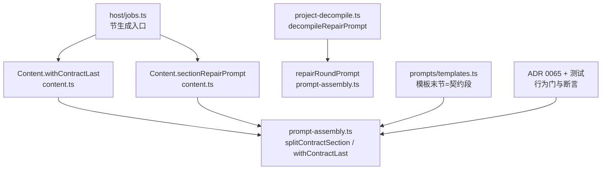
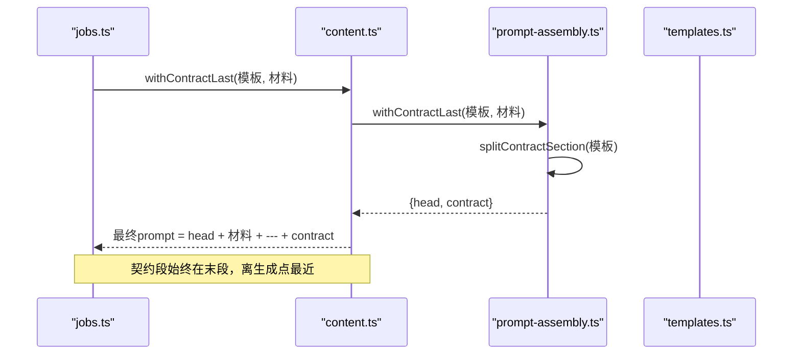
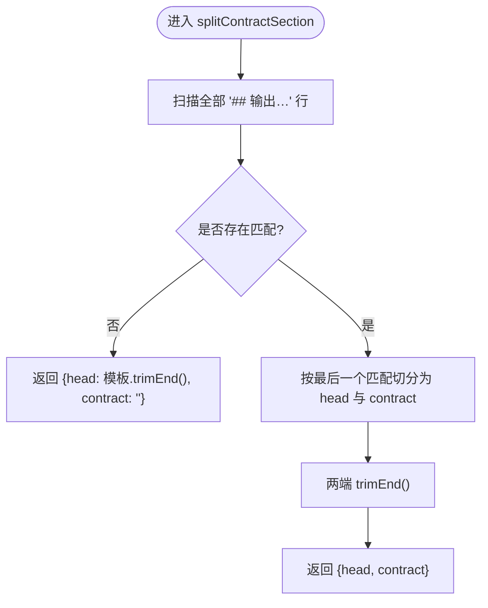
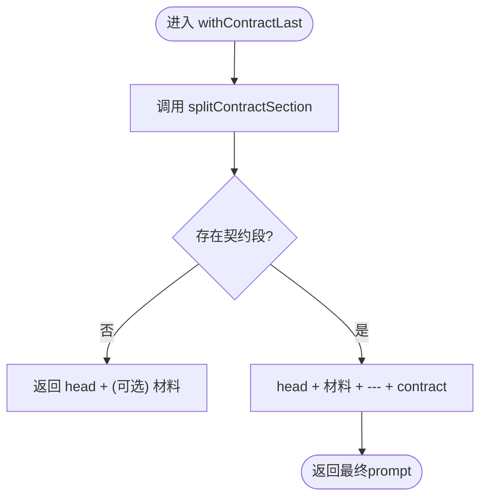
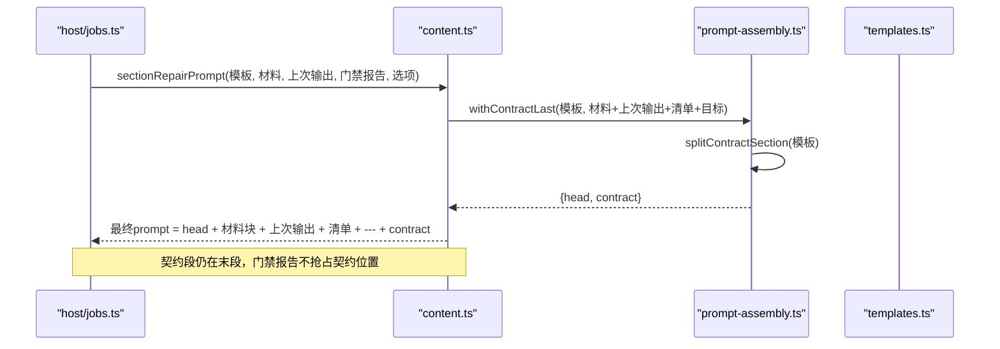
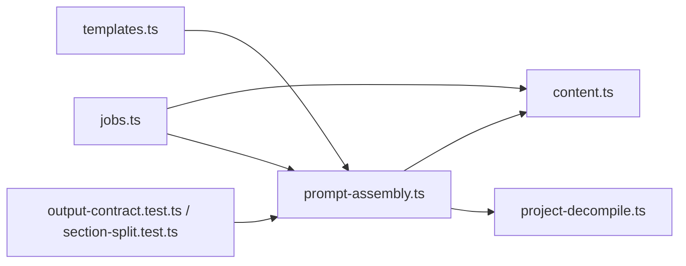

# 组装引擎

<cite>
**本文引用的文件**
- [prompt-assembly.ts](file://src/engine/prompt-assembly.ts)
- [content.ts](file://src/engine/content.ts)
- [jobs.ts](file://src/host/jobs.ts)
- [project-decompile.ts](file://src/engine/project-decompile.ts)
- [templates.ts](file://src/engine/prompts/templates.ts)
- [0065-prompt-contract-last-assembly.md](file://docs/adr/0065-prompt-contract-last-assembly.md)
- [output-contract.test.ts](file://tests/output-contract.test.ts)
- [section-split.test.ts](file://tests/section-split.test.ts)
</cite>

## 目录
1. [简介](#简介)
2. [项目结构](#项目结构)
3. [核心组件](#核心组件)
4. [架构总览](#架构总览)
5. [详细组件分析](#详细组件分析)
6. [依赖关系分析](#依赖关系分析)
7. [性能考量](#性能考量)
8. [故障排查指南](#故障排查指南)
9. [结论](#结论)
10. [附录](#附录)

## 简介
本文件聚焦“提示词组装引擎”，围绕契约后置拼装的核心算法，系统说明：
- 契约段切分：如何识别模板末段的输出契约段并安全剥离。
- 材料注入与最终提示词生成：材料在前、契约段置尾的固定段序。
- 修复轮机制：错误回灌与重试策略，包括长度溢出与块级违规的不同处理。
- 调试技巧与性能优化建议。
- 具体组装示例与边界情况处理。

该引擎的目标是确保所有生成站的最终 prompt 都以“只输出 X”的契约句作为最后一段，避免“中间丢失（lost-in-middle）”问题，同时让质检清单、压缩目标等回灌信息不抢占契约位置。

## 项目结构
与组装引擎直接相关的代码集中在 engine 层与 host 调用点：
- 叶子函数位于 prompt-assembly.ts，提供 splitContractSection、withContractLast、repairRoundPrompt。
- 业务侧通过 Content.withContractLast 或 Content.sectionRepairPrompt 统一走装配流程。
- 节生成入口在 host/jobs.ts，负责构造材料块并调用 withContractLast。
- 反编译修复入口在 project-decompile.ts，复用 repairRoundPrompt。
- 模板定义在 prompts/templates.ts，要求末节为“## 输出…”以配合切分。
- ADR 文档与测试用例对行为进行约束与回归验证。

图表来源
- [jobs.ts:158-167](file://src/host/jobs.ts#L158-L167)
- [content.ts:360-365](file://src/engine/content.ts#L360-L365)
- [prompt-assembly.ts:14-42](file://src/engine/prompt-assembly.ts#L14-L42)
- [project-decompile.ts:110-121](file://src/engine/project-decompile.ts#L110-L121)
- [templates.ts:20-97](file://src/engine/prompts/templates.ts#L20-L97)
- [0065-prompt-contract-last-assembly.md:1-20](file://docs/adr/0065-prompt-contract-last-assembly.md#L1-L20)

章节来源
- [jobs.ts:158-167](file://src/host/jobs.ts#L158-L167)
- [content.ts:360-365](file://src/engine/content.ts#L360-L365)
- [prompt-assembly.ts:14-42](file://src/engine/prompt-assembly.ts#L14-L42)
- [project-decompile.ts:110-121](file://src/engine/project-decompile.ts#L110-L121)
- [templates.ts:20-97](file://src/engine/prompts/templates.ts#L20-L97)
- [0065-prompt-contract-last-assembly.md:1-20](file://docs/adr/0065-prompt-contract-last-assembly.md#L1-L20)

## 核心组件
- 契约段切分 splitContractSection
  - 作用：定位模板中最后一个“## 输出…”一级标题到末尾的片段作为契约段；其余部分作为前段 head。
  - 无匹配时返回空契约段，保证健壮性。
- 契约后置拼装 withContractLast
  - 作用：将材料插入 head 与 contract 之间；若无契约段则仅拼接 head 与材料。
  - 固定段序：材料在前，契约段在后，确保“只输出 X”离生成点最近。
- 修复轮提示词 repairRoundPrompt
  - 作用：将“上次输出 + 校验清单”作为材料追加到模板材料之后，仍保持契约段在最后。
  - 用于种子起草、目标反编译等场景的统一修复轮。

章节来源
- [prompt-assembly.ts:14-42](file://src/engine/prompt-assembly.ts#L14-L42)

## 架构总览
从调用方到最终 prompt 的完整路径如下：
- 节生成：host/jobs.ts 构建材料块 → Content.withContractLast → 切分模板 → 产出最终 prompt。
- 整节修复：Content.sectionRepairPrompt 内部再次使用 withContractLast，把“上次输出 + 门禁报告 + 压缩目标”作为材料注入，契约段仍在末位。
- 反编译修复：project-decompile.ts 调用 repairRoundPrompt，复用同一修复轮机械。

图表来源
- [jobs.ts:158-167](file://src/host/jobs.ts#L158-L167)
- [content.ts:360-365](file://src/engine/content.ts#L360-L365)
- [prompt-assembly.ts:24-29](file://src/engine/prompt-assembly.ts#L24-L29)
- [templates.ts:20-97](file://src/engine/prompts/templates.ts#L20-L97)

## 详细组件分析

### 契约段切分 splitContractSection
- 工作原理
  - 正则扫描模板中所有“## 输出…”行，取最后一个匹配作为契约段起点。
  - 若不存在匹配，则整个模板视为 head，contract 为空串。
  - 返回 head 与 contract 两部分，供后续拼装使用。
- 设计要点
  - 零依赖叶子：不引入任何外部模块，避免循环依赖。
  - 模板约定：模板必须以“## 输出…”结尾，否则无法后置契约段。
- 复杂度
  - 时间 O(n)，n 为模板行数；空间 O(1) 额外空间（除结果外）。

图表来源
- [prompt-assembly.ts:14-19](file://src/engine/prompt-assembly.ts#L14-L19)

章节来源
- [prompt-assembly.ts:14-19](file://src/engine/prompt-assembly.ts#L14-L19)

### 契约后置拼装 withContractLast
- 实现逻辑
  - 先切分模板得到 head 与 contract。
  - 若存在 contract：最终 prompt = head + “\n\n” + 材料 + “\n\n---\n\n” + contract。
  - 若无 contract：最终 prompt = head + “\n\n” + 材料（或仅 head）。
- 材料优先级
  - 材料始终在契约段之前，确保模型最后读到的是“只输出 X”。
  - 材料内部顺序由调用方决定（如 jobs.ts 的材料块组合）。
- 边界情况
  - 材料为空：仅保留 head 与可选的契约段。
  - 模板无契约段：退化为 head 与材料的简单拼接。

图表来源
- [prompt-assembly.ts:24-29](file://src/engine/prompt-assembly.ts#L24-L29)

章节来源
- [prompt-assembly.ts:24-29](file://src/engine/prompt-assembly.ts#L24-L29)

### 修复轮机制 repairRoundPrompt
- 功能概述
  - 将“上一次输出 + 校验清单”作为材料追加到模板材料之后，仍通过 withContractLast 保证契约段在末位。
  - 用于种子起草与目标反编译等场景的统一修复轮。
- 错误回灌与重试逻辑
  - 首次失败后，将门禁报告（含定位信息）注入材料，要求模型局部重写或整体重出。
  - 对于长度溢出：附显式压缩目标与计数口径，不再劝模型在节内拆节（拆节归管线处理）。
  - 对于非长度违规：保持局部重写纪律，仅针对定位到的违规块进行替换。
- 与 Content.sectionRepairPrompt 的关系
  - content.ts 暴露 sectionRepairPrompt，内部再次调用 withContractLast，把“上次输出 + gateReport + wordBudget”作为材料注入。
  - 测试覆盖：修复轮里契约段仍是最终 prompt 的末段，且包含压缩目标与计数口径。

图表来源
- [content.ts:360-365](file://src/engine/content.ts#L360-L365)
- [prompt-assembly.ts:35-42](file://src/engine/prompt-assembly.ts#L35-L42)
- [jobs.ts:227-229](file://src/host/jobs.ts#L227-L229)

章节来源
- [prompt-assembly.ts:35-42](file://src/engine/prompt-assembly.ts#L35-L42)
- [content.ts:360-365](file://src/engine/content.ts#L360-L365)
- [jobs.ts:227-229](file://src/host/jobs.ts#L227-L229)
- [section-split.test.ts:107-127](file://tests/section-split.test.ts#L107-L127)

### 节生成入口与材料组装
- 材料块构造
  - jobs.ts 中的 sectionMaterials 负责组装节任务、上下文包、连贯信息等材料块。
  - 通过 Content.withContractLast 将材料注入模板，契约段置尾。
- 修复阶梯
  - 初跑档随节点难度选择 fast/deep。
  - 门禁失败先尝试块级局部修补；若正文过长则整节压缩修复一轮。
  - 压缩仍溢出且允许拆节时抛出溢出错误，交由调用方执行大纲拆节阶梯。

章节来源
- [jobs.ts:158-167](file://src/host/jobs.ts#L158-L167)
- [jobs.ts:169-175](file://src/host/jobs.ts#L169-L175)

### 反编译修复入口
- decompileRepairPrompt
  - 复用 repairRoundPrompt，传入模板、材料、死因标题、上次输出与错误列表。
  - 契约段仍在最终 prompt 末位，保证一致性。

章节来源
- [project-decompile.ts:110-121](file://src/engine/project-decompile.ts#L110-L121)

### 模板约定与契约段
- 模板必须满足“末节即契约段”的形状约束，即最后一个一级标题为“## 输出…”。
- 模板文本不含运行时插值变量，变量替换由加载器处理；生成站的材料注入走 withContractLast，不做字符串替换。
- ADR 0065 明确变更：所有生成站的最终 prompt 都由“材料 + 输出契约段”构成，契约段置尾。

章节来源
- [templates.ts:1-14](file://src/engine/prompts/templates.ts#L1-L14)
- [templates.ts:20-97](file://src/engine/prompts/templates.ts#L20-L97)
- [0065-prompt-contract-last-assembly.md:1-20](file://docs/adr/0065-prompt-contract-last-assembly.md#L1-L20)

## 依赖关系分析
- 耦合与内聚
  - prompt-assembly.ts 为叶子模块，零依赖，被 content.ts、project-decompile.ts 等多处引用，内聚性强。
  - content.ts 封装门面方法，屏蔽内部细节，便于宿主调用。
  - jobs.ts 作为调用方，负责材料组装与修复阶梯调度。
- 外部依赖
  - 模板来自 templates.ts，需遵循契约段形状约束。
  - 测试与 ADR 提供行为门与变更记录，保障契约后置不变量。

图表来源
- [prompt-assembly.ts:14-42](file://src/engine/prompt-assembly.ts#L14-L42)
- [content.ts:360-365](file://src/engine/content.ts#L360-L365)
- [project-decompile.ts:110-121](file://src/engine/project-decompile.ts#L110-L121)
- [jobs.ts:158-167](file://src/host/jobs.ts#L158-L167)
- [templates.ts:20-97](file://src/engine/prompts/templates.ts#L20-L97)
- [output-contract.test.ts:1-200](file://tests/output-contract.test.ts#L1-L200)
- [section-split.test.ts:100-142](file://tests/section-split.test.ts#L100-L142)

章节来源
- [prompt-assembly.ts:14-42](file://src/engine/prompt-assembly.ts#L14-L42)
- [content.ts:360-365](file://src/engine/content.ts#L360-L365)
- [project-decompile.ts:110-121](file://src/engine/project-decompile.ts#L110-L121)
- [jobs.ts:158-167](file://src/host/jobs.ts#L158-L167)
- [templates.ts:20-97](file://src/engine/prompts/templates.ts#L20-L97)
- [output-contract.test.ts:1-200](file://tests/output-contract.test.ts#L1-L200)
- [section-split.test.ts:100-142](file://tests/section-split.test.ts#L100-L142)

## 性能考量
- 切分与拼装
  - splitContractSection 使用正则扫描，线性时间复杂度，开销极低。
  - withContractLast 仅做字符串拼接，常数级额外内存。
- 材料大小
  - 材料可能包含大量上下文（如课程大纲、题库、可视化块），应控制材料体积，避免超出模型上下文限制。
  - 对于超长正文，优先采用压缩修复与拆节策略，而非盲目增大上下文。
- 模板设计
  - 模板应保持简洁，契约段置于末节，减少模型注意力分散。
  - 避免在模板中嵌入过多指令，将规则下沉到材料与门禁报告中。

[本节为通用指导，无需特定文件来源]

## 故障排查指南
- 常见症状
  - 模型未按契约输出：检查模板是否以“## 输出…”结尾，确认 withContractLast 已正确调用。
  - 修复轮无效：确认门禁报告包含定位信息，且修复轮材料未抢占契约位置。
  - 长度溢出反复失败：检查压缩目标与计数口径是否正确注入，必要时启用拆节。
- 调试技巧
  - 打印最终 prompt 的尾部，确认契约段确实在末位。
  - 对比修复前后材料块，确保“上次输出 + 清单 + 目标”顺序正确。
  - 使用测试用例断言：output-contract.test.ts 与 section-split.test.ts 提供契约形状与修复轮行为的回归门。
- 边界情况
  - 模板无契约段：退化为 head + 材料，需补充契约段以满足规范。
  - 材料为空：仅保留 head 与契约段，确保最小可用 prompt。
  - 修复轮多次失败：评估是否需调整材料粒度（块级 vs 整节）或升级难度档。

章节来源
- [output-contract.test.ts:1-200](file://tests/output-contract.test.ts#L1-L200)
- [section-split.test.ts:100-142](file://tests/section-split.test.ts#L100-L142)
- [prompt-assembly.ts:14-42](file://src/engine/prompt-assembly.ts#L14-L42)

## 结论
提示词组装引擎通过“契约段切分 + 材料注入 + 修复轮回灌”的三段式机制，确保所有生成站的最终 prompt 都以“只输出 X”的契约句收尾，有效缓解“中间丢失”问题。splitContractSection 与 withContractLast 提供稳定、可复用的装配原语；repairRoundPrompt 统一了修复轮行为，支持长度溢出与块级违规的不同处理策略。结合 ADR 与测试门，系统在工程层面保证了契约后置的不变量与可维护性。

[本节为总结性内容，无需特定文件来源]

## 附录
- 关键函数路径
  - 契约段切分：[splitContractSection:14-19](file://src/engine/prompt-assembly.ts#L14-L19)
  - 契约后置拼装：[withContractLast:24-29](file://src/engine/prompt-assembly.ts#L24-L29)
  - 修复轮提示词：[repairRoundPrompt:35-42](file://src/engine/prompt-assembly.ts#L35-L42)
  - 节生成入口：[sectionPrompt:158-167](file://src/host/jobs.ts#L158-L167)
  - 整节修复入口：[Content.sectionRepairPrompt:360-365](file://src/engine/content.ts#L360-L365)
  - 反编译修复入口：[decompileRepairPrompt:110-121](file://src/engine/project-decompile.ts#L110-L121)
- 相关文档与测试
  - ADR 0065：[契约后置拼装:1-20](file://docs/adr/0065-prompt-contract-last-assembly.md#L1-L20)
  - 契约门测试：[output-contract.test.ts:1-200](file://tests/output-contract.test.ts#L1-L200)
  - 修复轮测试：[section-split.test.ts:100-142](file://tests/section-split.test.ts#L100-L142)

[本节为索引性内容，无需特定文件来源]