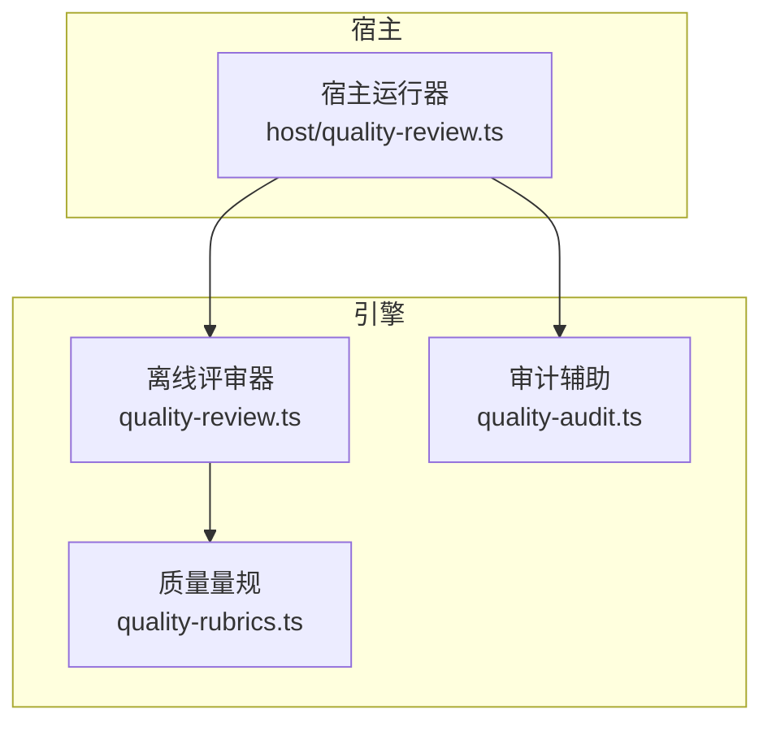
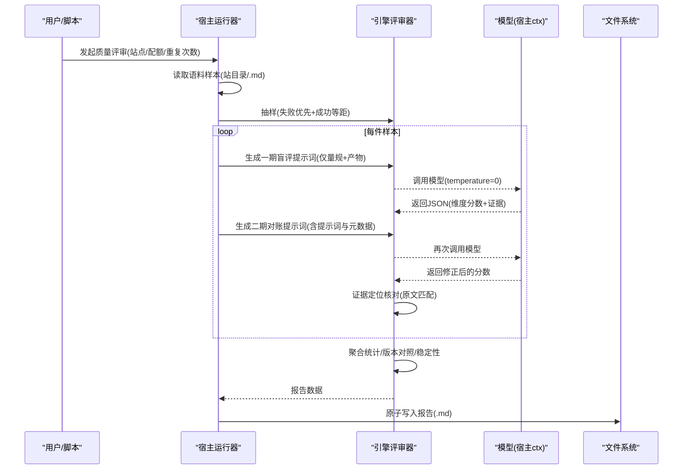
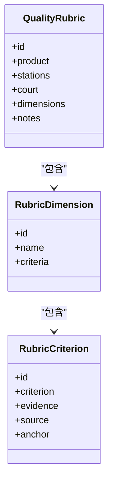
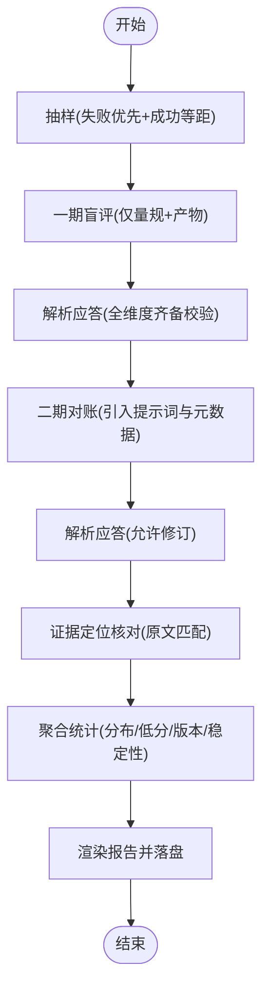
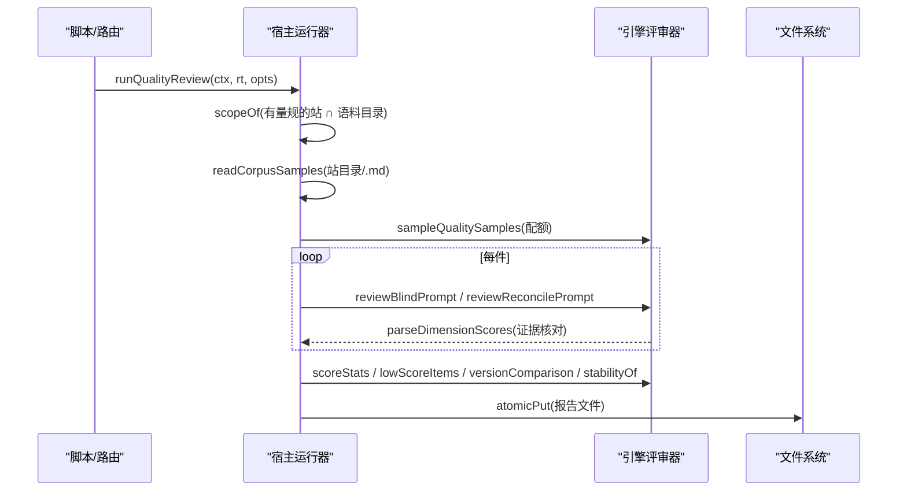
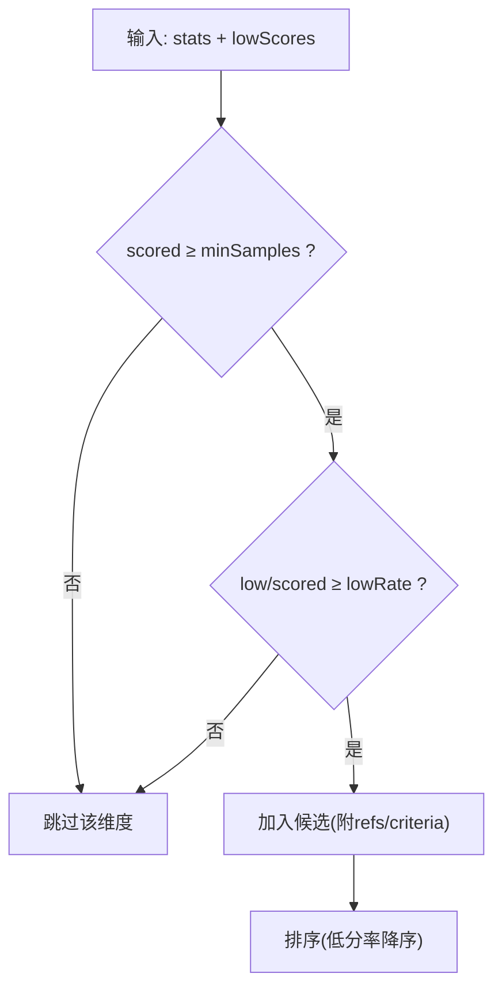
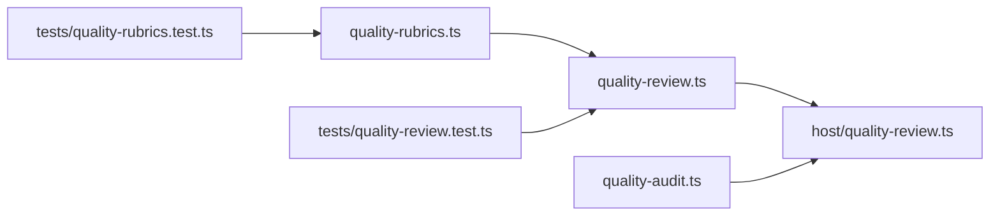

# 质量优化

<cite>
**本文引用的文件**
- [src/engine/quality-rubrics.ts](file://src/engine/quality-rubrics.ts)
- [src/engine/quality-review.ts](file://src/engine/quality-review.ts)
- [src/host/quality-review.ts](file://src/host/quality-review.ts)
- [src/engine/quality-audit.ts](file://src/engine/quality-audit.ts)
- [docs/adr/0062-quality-rubric-registry.md](file://docs/adr/0062-quality-rubric-registry.md)
- [tests/quality-review.test.ts](file://tests/quality-review.test.ts)
- [tests/quality-rubrics.test.ts](file://tests/quality-rubrics.test.ts)
- [docs/research/2026-09-quality-review-224.json](file://docs/research/2026-09-quality-review-224.json)
</cite>

## 目录
1. [引言](#引言)
2. [项目结构](#项目结构)
3. [核心组件](#核心组件)
4. [架构总览](#架构总览)
5. [详细组件分析](#详细组件分析)
6. [依赖关系分析](#依赖关系分析)
7. [性能与稳定性考量](#性能与稳定性考量)
8. [故障诊断指南](#故障诊断指南)
9. [结论](#结论)
10. [附录：评估示例与优化案例](#附录：评估示例与优化案例)

## 引言
本文件面向“提示词质量优化”的目标，系统化阐述质量评估标准、度量指标、审核流程、规则定义与执行、迭代优化（含 A/B 测试思路）以及问题诊断方法。内容基于仓库中已实现的质量量规注册表、离线批量评审器、宿主适配运行器与审计机制，确保读者既能理解整体设计，也能落地到具体模块与数据流。

## 项目结构
围绕质量优化的关键代码集中在引擎与宿主两层：
- 引擎层：定义质量量规、评审提示词与解析、抽样策略、聚合统计、版本对照与稳定性读数等纯函数能力。
- 宿主层：负责读取语料、调用模型、生成报告并落盘；同时接入图质量面审计的候选发现。

**图表来源**
- [src/engine/quality-rubrics.ts:1-60](file://src/engine/quality-rubrics.ts#L1-L60)
- [src/engine/quality-review.ts:1-50](file://src/engine/quality-review.ts#L1-L50)
- [src/host/quality-review.ts:1-50](file://src/host/quality-review.ts#L1-L50)
- [src/engine/quality-audit.ts:1-30](file://src/engine/quality-audit.ts#L1-L30)

**章节来源**
- [src/engine/quality-rubrics.ts:1-60](file://src/engine/quality-rubrics.ts#L1-L60)
- [src/engine/quality-review.ts:1-50](file://src/engine/quality-review.ts#L1-L50)
- [src/host/quality-review.ts:1-50](file://src/host/quality-review.ts#L1-L50)
- [src/engine/quality-audit.ts:1-30](file://src/engine/quality-audit.ts#L1-L30)

## 核心组件
- 质量量规注册表：以五类产物为维度定义判据、证据要求与出处锚点，禁止总分维度，强调分层法庭（AI 提议、人审终审、结果法院各守其域）。
- 离线批量评审器：从生成语料抽样，两段式防锚定评审（盲评→对账），逐维度评分与证据定位核对，输出可追溯的报告与统计。
- 宿主运行器：读语料、调模型、写报告；固定温度保证可比性；将评审本身纳入语料捕获。
- 审计辅助：按站×维度计算低分率，产出系统性问题候选，供人审裁决。

**章节来源**
- [src/engine/quality-rubrics.ts:16-57](file://src/engine/quality-rubrics.ts#L16-L57)
- [src/engine/quality-review.ts:1-28](file://src/engine/quality-review.ts#L1-L28)
- [src/host/quality-review.ts:1-19](file://src/host/quality-review.ts#L1-L19)
- [src/engine/quality-audit.ts:1-17](file://src/engine/quality-audit.ts#L1-L17)

## 架构总览
质量评审流水线由“抽样→两段式评审→解析与证据核对→聚合→报告落盘”构成，并在必要时触发图质量面审计。

**图表来源**
- [src/host/quality-review.ts:126-241](file://src/host/quality-review.ts#L126-L241)
- [src/engine/quality-review.ts:179-261](file://src/engine/quality-review.ts#L179-L261)
- [src/engine/quality-review.ts:300-362](file://src/engine/quality-review.ts#L300-L362)

## 详细组件分析

### 质量量规注册表（标准与度量）
- 五类产物：大纲、节正文、题目、教练回合、种子·终点。每份量规包含多个维度，每个维度下有多条判据。
- 每条判据三要素：判定标准、证据要求、出处（模板/ADR/词条/引擎文件），支持锚点对齐，防止漂移。
- 无总分维度：维度正交，不合成跨维度的总分；AI 评分为提议，人审为终审，学习者结果法院独立。

**图表来源**
- [src/engine/quality-rubrics.ts:27-57](file://src/engine/quality-rubrics.ts#L27-L57)

**章节来源**
- [src/engine/quality-rubrics.ts:16-57](file://src/engine/quality-rubrics.ts#L16-L57)
- [docs/adr/0062-quality-rubric-registry.md:1-37](file://docs/adr/0062-quality-rubric-registry.md#L1-L37)

### 离线批量评审器（评估流程与指标）
- 抽样策略：失败/容忍件优先（bad 桶定额），成功件等距补足（ok 桶），按站独立采样，稳定排序。
- 两段式防锚定评审：
  - 一期盲评：只给量规与产物原文，不给生成提示词与元数据，避免锚定。
  - 二期对账：给出成提示词与元数据，允许修正一期判读，记录是否修订及契约解释。
- 证据定位核对：引文必须能在产物原文中找到（空白不敏感，长引文前缀兜底），未定位项显式记录。
- 指标与统计：
  - 维度分布：1–4 档计数、不可判数、低分件数、无证据数、未定位数。
  - 低分件清单：带 ref、证据、模板版本、是否修订。
  - 版本对照：按（站 × 模板版本）聚合低分率，同维度比较。
  - 稳定性读数：同件多轮一致率与平均档差。

**图表来源**
- [src/engine/quality-review.ts:120-160](file://src/engine/quality-review.ts#L120-L160)
- [src/engine/quality-review.ts:179-261](file://src/engine/quality-review.ts#L179-L261)
- [src/engine/quality-review.ts:300-362](file://src/engine/quality-review.ts#L300-L362)
- [src/engine/quality-review.ts:412-593](file://src/engine/quality-review.ts#L412-L593)

**章节来源**
- [src/engine/quality-review.ts:120-160](file://src/engine/quality-review.ts#L120-L160)
- [src/engine/quality-review.ts:179-261](file://src/engine/quality-review.ts#L179-L261)
- [src/engine/quality-review.ts:300-362](file://src/engine/quality-review.ts#L300-L362)
- [src/engine/quality-review.ts:412-593](file://src/engine/quality-review.ts#L412-L593)

### 宿主运行器（自动检测与人工审核协作）
- 固定温度：temperature=0，保证跨轮次可比性；差异来自内容而非随机性。
- 评审即语料：评审调用本身进入语料捕获，便于后续评估评审器的稳定性与漂移。
- 报告落盘：单文件原子写，不进 canonical；报告路径包含时间戳与站点范围。
- 系统候选：当覆盖审计面站时，计算系统性候选（低分率阈值与最小样本量），作为人审裁决的提议。

**图表来源**
- [src/host/quality-review.ts:113-241](file://src/host/quality-review.ts#L113-L241)

**章节来源**
- [src/host/quality-review.ts:113-241](file://src/host/quality-review.ts#L113-L241)

### 审计辅助（系统性问题发现）
- 审计面声明：明确本轮审了什么、没审什么，避免误读“跑过一轮=全面覆盖”。
- 系统性候选：按（站 × 维度）计算低分率，超过阈值且满足最小样本量即入候选；候选是提议，需人审裁决。
- 候选渲染：附带低分件引用与判据出处，便于贴票与回溯。

**图表来源**
- [src/engine/quality-audit.ts:76-120](file://src/engine/quality-audit.ts#L76-L120)

**章节来源**
- [src/engine/quality-audit.ts:76-120](file://src/engine/quality-audit.ts#L76-L120)

## 依赖关系分析
- 量规驱动评审：评审器不定义判据，全部消费 quality-rubrics.ts 的量规表，改判据即改评审口径。
- 宿主与引擎解耦：宿主负责 I/O 与模型调用，引擎保持纯函数与零副作用。
- 测试保障：单元测试覆盖抽样、提示词构造、解析、证据核对、聚合、版本对照与稳定性；量规锚门测试确保出处与锚点真实存在。

**图表来源**
- [src/engine/quality-review.ts:1-28](file://src/engine/quality-review.ts#L1-L28)
- [src/host/quality-review.ts:1-50](file://src/host/quality-review.ts#L1-L50)
- [tests/quality-review.test.ts:1-46](file://tests/quality-review.test.ts#L1-L46)
- [tests/quality-rubrics.test.ts:1-16](file://tests/quality-rubrics.test.ts#L1-L16)

**章节来源**
- [src/engine/quality-review.ts:1-28](file://src/engine/quality-review.ts#L1-L28)
- [src/host/quality-review.ts:1-50](file://src/host/quality-review.ts#L1-L50)
- [tests/quality-review.test.ts:1-46](file://tests/quality-review.test.ts#L1-L46)
- [tests/quality-rubrics.test.ts:1-16](file://tests/quality-rubrics.test.ts#L1-L16)

## 性能与稳定性考量
- 温度固定：temperature=0，确保跨轮次可比性；残余波动反映模型/供应商漂移。
- 确定性抽样：等距无随机数，同输入同抽样，便于回放与对比。
- 成本追踪：记录 calls、inputTokens、outputTokens、durationMs，便于评估成本与效率。
- 稳定性读数：同件多轮一致率与平均档差，识别评审器自身稳定性问题。

**章节来源**
- [src/engine/quality-review.ts:41-47](file://src/engine/quality-review.ts#L41-L47)
- [src/engine/quality-review.ts:120-160](file://src/engine/quality-review.ts#L120-L160)
- [src/host/quality-review.ts:126-241](file://src/host/quality-review.ts#L126-L241)
- [src/engine/quality-review.ts:547-593](file://src/engine/quality-review.ts#L547-L593)

## 故障诊断指南
- 评审失败 vs 产物差：评审失败（应答不可解析/维度缺失）不计入低分与分布，单独列示；空输出且无工具调用载荷视为不可评分。
- 证据未定位：若引文在产物原文找不到，计入 unlocated 并显式列出，避免静默通过。
- 模板版本漂移：通过 templateVersionOf 提取版本标记，版本对照视图按（站 × 版本）聚合低分率，便于定位回归。
- 锚门失效：量规锚门测试会因伪造锚点、出处缺失或添加总分维度而失败，确保量规与文档一致性。

**章节来源**
- [src/engine/quality-review.ts:113-118](file://src/engine/quality-review.ts#L113-L118)
- [src/engine/quality-review.ts:300-362](file://src/engine/quality-review.ts#L300-L362)
- [tests/quality-rubrics.test.ts:79-109](file://tests/quality-rubrics.test.ts#L79-L109)

## 结论
本体系以“判定标准先于判定器”为核心，通过量规注册表、两段式防锚定评审、证据定位核对与多维度统计，形成闭环的质量评估与优化流程。宿主侧固定温度与语料捕获保障了可复算与可观测性；审计辅助提供系统性问题候选，推动持续改进。建议在日常迭代中结合版本对照与稳定性读数进行 A/B 式对比，逐步收敛高质量提示词。

## 附录：评估示例与优化案例

### 质量评估示例（基于真实评审数据）
- 样本来源：质量评审报告 JSON（教练生长站，模板 v5，repeats=2）。
- 关键读数：
  - 维度分布与低分件：如“生长纪律”维度出现低分，证据指向终点前置不完整与边级自查缺失。
  - 版本对照：v5 的低分率在各维度可量化，便于对比不同模板版本的改进效果。
  - 稳定性：部分维度两轮不一致，显示模型侧漂移或提示词歧义，需要进一步收敛。

**章节来源**
- [docs/research/2026-09-quality-review-224.json:1-360](file://docs/research/2026-09-quality-review-224.json#L1-L360)

### 优化案例（基于量规与评审反馈）
- 起点资格优化：将复合泛称的起点改为单一行为单元，符合“宁简勿繁”原则，提升起点可起步性。
- 终点资格优化：终点名改为承诺句，避免台阶句；目标面向分解后显式合成，禁止静默丢弃或窄化限定词。
- 节间衔接修复：在节开头避免复述前节结论，注入“前节结尾窗口”，减少流程性缺陷导致的低分。
- 题目多样性提升：题型混搭、难度递进与不趋同检查，降低趋同风险；干扰项基于误解先验改编，提高区分度。

**章节来源**
- [src/engine/quality-rubrics.ts:370-439](file://src/engine/quality-rubrics.ts#L370-L439)
- [src/engine/quality-rubrics.ts:225-291](file://src/engine/quality-rubrics.ts#L225-L291)
- [src/engine/quality-rubrics.ts:129-224](file://src/engine/quality-rubrics.ts#L129-L224)

### A/B 测试与效果评估（方法论）
- 实验设计：同一站点下，使用不同模板版本（如 v5 vs v6）分别抽样相同配额，固定 temperature=0，重复评审两次。
- 评估指标：
  - 维度低分率：按（站 × 版本 × 维度）比较，避免跨维度合成。
  - 稳定性读数：观察一致率与平均档差，识别模型漂移或提示词歧义。
  - 成本与耗时：calls、tokens、durationMs，评估性价比。
- 决策依据：若新版本在某维度显著降低低分率且稳定性提升，则采纳；否则回滚或继续迭代。

**章节来源**
- [src/engine/quality-review.ts:41-47](file://src/engine/quality-review.ts#L41-L47)
- [src/engine/quality-review.ts:516-545](file://src/engine/quality-review.ts#L516-L545)
- [src/host/quality-review.ts:126-241](file://src/host/quality-review.ts#L126-L241)