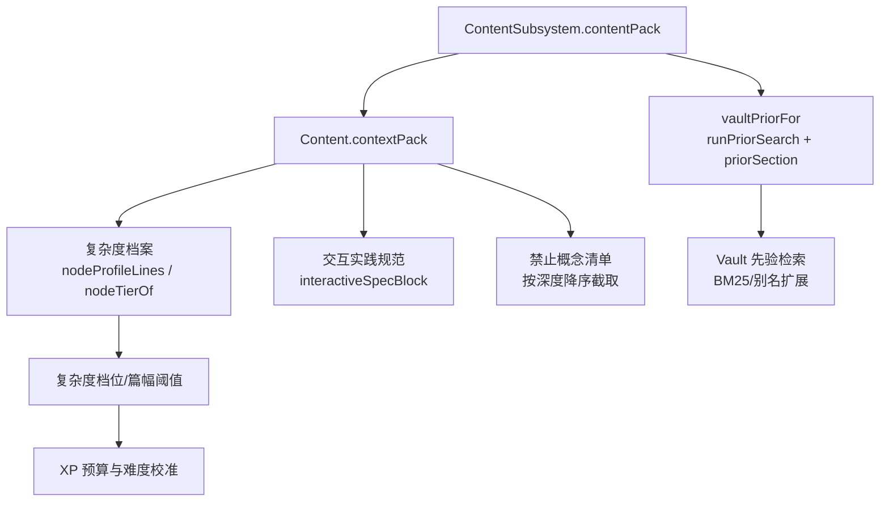
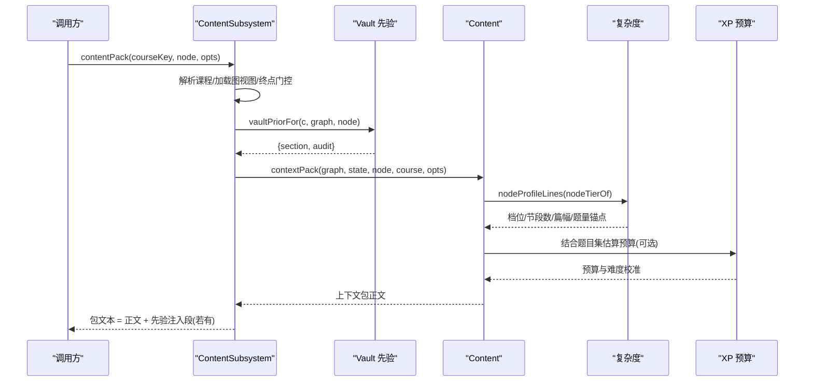
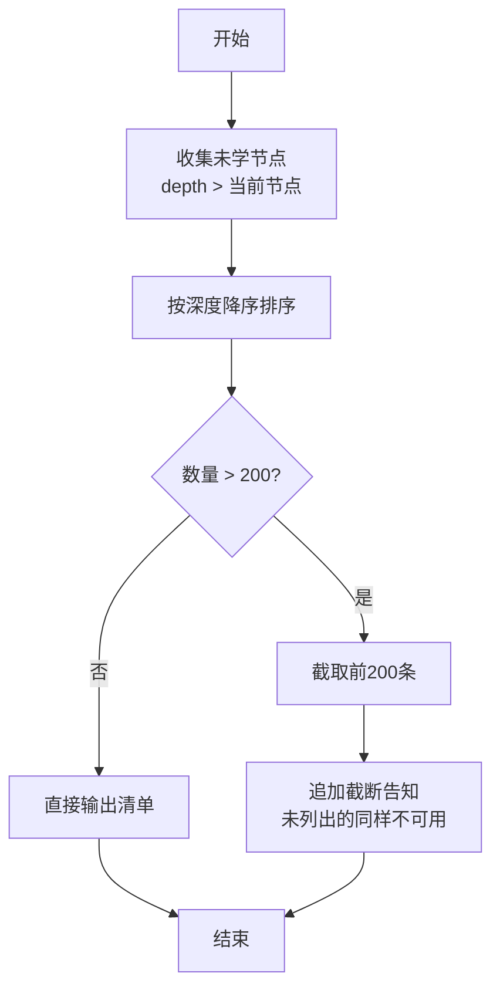
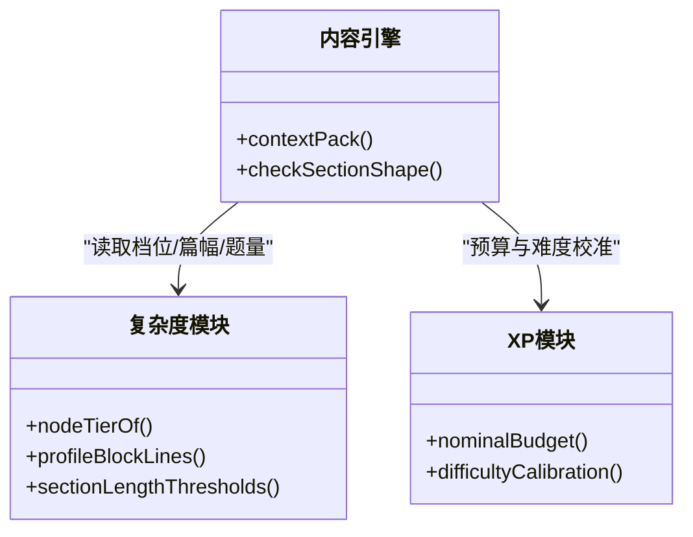
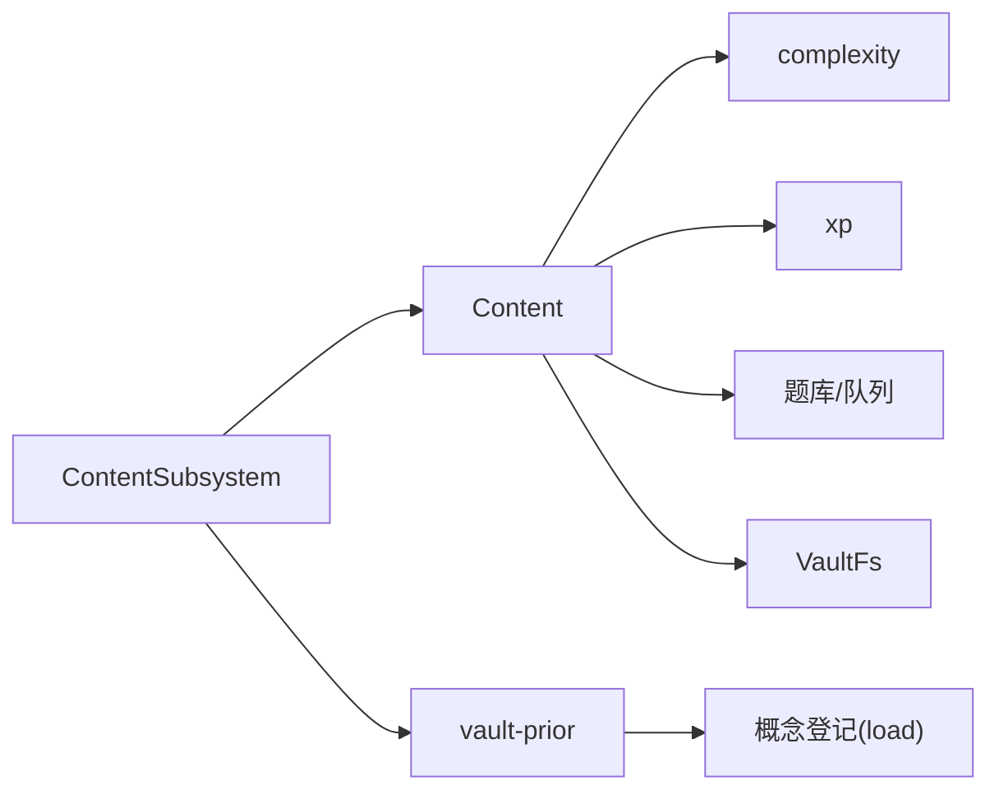

# 上下文包组装

<cite>
**本文引用的文件**
- [content-subsystem.ts](file://src/engine/content-subsystem.ts)
- [content.ts](file://src/engine/content.ts)
- [vault-prior.ts](file://src/engine/vault-prior.ts)
- [complexity.ts](file://src/engine/complexity.ts)
- [xp.ts](file://src/engine/xp.ts)
- [output-contract.test.ts](file://tests/output-contract.test.ts)
- [runtime.ts](file://src/host/runtime.ts)
- [llm.ts](file://src/engine/llm.ts)
</cite>

## 目录
1. [简介](#简介)
2. [项目结构](#项目结构)
3. [核心组件](#核心组件)
4. [架构总览](#架构总览)
5. [详细组件分析](#详细组件分析)
6. [依赖关系分析](#依赖关系分析)
7. [性能考量](#性能考量)
8. [故障排查指南](#故障排查指南)
9. [结论](#结论)
10. [附录：配置与自定义](#附录：配置与自定义)

## 简介
本文件聚焦“上下文包”的构建过程，覆盖目标节点信息提取、前置知识摘要生成、后继预告处理、领域边界定义；并深入说明禁止概念列表的生成逻辑（深度排序、截断策略与稀释治理）、复杂度档案集成（节点复杂度评估、篇幅预算计算、质量阈值设定）；同时描述交互实践的特殊处理（交互件规范注入与练习生成控制），以及上下文包的配置选项与自定义方法，并提供使用示例与最佳实践。

## 项目结构
上下文包由内容子系统统一对外暴露，内部由内容引擎负责拼装，先验检索提供个性化注入段，复杂度模块提供规模与篇幅约束，XP 模块提供学习时长预算校准。

图表来源
- [content-subsystem.ts:125-146](file://src/engine/content-subsystem.ts#L125-L146)
- [content.ts:141-277](file://src/engine/content.ts#L141-L277)
- [vault-prior.ts:82-103](file://src/engine/vault-prior.ts#L82-L103)
- [complexity.ts:200-251](file://src/engine/complexity.ts#L200-L251)
- [xp.ts:44-70](file://src/engine/xp.ts#L44-L70)

章节来源
- [content-subsystem.ts:125-146](file://src/engine/content-subsystem.ts#L125-L146)
- [content.ts:141-277](file://src/engine/content.ts#L141-L277)
- [vault-prior.ts:82-103](file://src/engine/vault-prior.ts#L82-L103)
- [complexity.ts:200-251](file://src/engine/complexity.ts#L200-L251)
- [xp.ts:44-70](file://src/engine/xp.ts#L44-L70)

## 核心组件
- 内容子系统 ContentSubsystem：上下文包对外入口，负责课程解析、图视图加载、终点门控、先验注入段拼接。
- 内容引擎 Content：上下文包本体拼装，包含目标节点、前置摘要、后继预告、领域边界、禁止概念、enc 边、交付要求、复杂度档案、误解坑位、前置档位等。
- Vault 先验 vault-prior：基于 BM25 与登记表扩展词的个人笔记检索，输出注入段与审计。
- 复杂度 complexity：节点复杂度档位、节段数区间、篇幅预算、可视化上限、PS-I 路由等。
- XP xp：标称预算 N₀ 与难度校准因子 k，用于学习时长预算与质量阈值联动。

章节来源
- [content-subsystem.ts:125-146](file://src/engine/content-subsystem.ts#L125-L146)
- [content.ts:141-277](file://src/engine/content.ts#L141-L277)
- [vault-prior.ts:82-103](file://src/engine/vault-prior.ts#L82-L103)
- [complexity.ts:200-251](file://src/engine/complexity.ts#L200-L251)
- [xp.ts:44-70](file://src/engine/xp.ts#L44-L70)

## 架构总览
上下文包组装的关键调用序列如下：

图表来源
- [content-subsystem.ts:125-146](file://src/engine/content-subsystem.ts#L125-L146)
- [content.ts:141-277](file://src/engine/content.ts#L141-L277)
- [vault-prior.ts:82-103](file://src/engine/vault-prior.ts#L82-L103)
- [complexity.ts:200-251](file://src/engine/complexity.ts#L200-L251)
- [xp.ts:44-70](file://src/engine/xp.ts#L44-L70)

## 详细组件分析

### 目标节点信息提取与前置/后继/边界
- 目标节点：名称、区/块、深度、是否 practice、note 备注。
- 前置摘要：遍历 pre，若已生成则列出实际教过的节标题与要点；未生成则标注 note。
- 后继预告：列出 succs；若为锚定终点则给出专属措辞。
- 领域边界：限定在本节点范围，不提前展开后继。

章节来源
- [content.ts:148-186](file://src/engine/content.ts#L148-L186)

### 禁止概念列表：深度排序、截断与稀释治理
- 集合来源：除当前节点外的所有图内节点，且深度大于当前节点。
- 排序策略：按深度降序（最深=最不该提前教）。
- 截断策略：固定上限 200 条；超过时追加“截断告知”，明确未列出的同样不可用，避免模型误读为穷举。
- 稀释治理：保留 §5 位置（模板编号稳定），通过显式截断告知降低“稀释”带来的误导风险。

图表来源
- [content.ts:187-205](file://src/engine/content.ts#L187-L205)

章节来源
- [content.ts:187-205](file://src/engine/content.ts#L187-L205)
- [output-contract.test.ts:253-272](file://tests/output-contract.test.ts#L253-L272)

### 复杂度档案集成：评估、预算与阈值
- 节点复杂度评估：依据 difficulty/bloom/est/pre 闭包规模折叠为低/中/高三档。
- 节段数区间与题量锚点：按档位给出目标节段数、每节题量、综合题数。
- 篇幅预算与质量阈值：单节辅助文字预算随档位变化；超 1.3 倍警告、超 2 倍拒收；可视化块上限为 2。
- 与 XP 预算联动：N₀ 优先取 est，否则按题目权重×难度求和再校准 k，影响整体学习时长预算。

图表来源
- [complexity.ts:200-251](file://src/engine/complexity.ts#L200-L251)
- [content.ts:232-243](file://src/engine/content.ts#L232-L243)
- [xp.ts:44-70](file://src/engine/xp.ts#L44-L70)

章节来源
- [complexity.ts:200-251](file://src/engine/complexity.ts#L200-L251)
- [content.ts:232-243](file://src/engine/content.ts#L232-L243)
- [xp.ts:44-70](file://src/engine/xp.ts#L44-L70)

### 交互实践的特殊处理：交互件规范注入与练习生成控制
- 交互实践节点：在 §8 注入“交互模拟创作规范”，强调 widget-config、完成上报、AI 老师接口、自包含、状态机、动画、移动端友好、实时数据等契约。
- 练习生成控制：交互实践不出练习题，末尾机器块为 enc_candidates 空列表；普通节点以题组 YAML 写入题库，并在末尾携带 enc_candidates。
- 质检门：交互件引用文件必须存在；富内容块（plot/chart/svg）需合法；预测门 learnhub-predict 需字段齐全。

章节来源
- [content.ts:220-230](file://src/engine/content.ts#L220-L230)
- [content.ts:281-325](file://src/engine/content.ts#L281-L325)
- [content.ts:757-788](file://src/engine/content.ts#L757-L788)

### 先验注入段：检索与审计
- 检索词：节点名 + 直接前置名，经概念登记表扩展（别名/易混概念低权重并入）。
- 检索实现：BM25 参数、标题加权、窗口倍数、分词规则。
- 注入段：命中后生成“先验注入段”，零命中则无该段；审计通过回调 onPrior 带出（零命中/截断/命中清单）。

章节来源
- [content-subsystem.ts:109-122](file://src/engine/content-subsystem.ts#L109-L122)
- [vault-prior.ts:82-103](file://src/engine/vault-prior.ts#L82-L103)

### 终点门控与后继预告
- 终点判定：从锚文件中读取终点名集合；若目标为终点，拒绝生成上下文（终点为零正文零题库方向标记）。
- 后继预告：若非终点且无后继，提示“无后继”；若为锚定终点，给出专属措辞。

章节来源
- [content-subsystem.ts:133-145](file://src/engine/content-subsystem.ts#L133-L145)
- [content.ts:180-186](file://src/engine/content.ts#L180-L186)

## 依赖关系分析
- 内容子系统依赖：注册表、图视图、VaultFs、概念登记、题库、会话、学习者卡片、FSRS、时钟等。
- 内容引擎依赖：复杂度、提示词模板、渲染器能力、种子锚点、笔记读写、队列管理。
- Vault 先验依赖：概念登记 load、BM25 参数、文件系统。
- 复杂度依赖：bloom 级别、pre 闭包规模、p75 阈值。
- XP 依赖：题目权重、FSRS 难度、默认常量。

图表来源
- [content-subsystem.ts:18-36](file://src/engine/content-subsystem.ts#L18-L36)
- [content.ts:10-28](file://src/engine/content.ts#L10-L28)
- [vault-prior.ts:155-181](file://src/engine/vault-prior.ts#L155-L181)
- [complexity.ts:1-31](file://src/engine/complexity.ts#L1-L31)
- [xp.ts:44-70](file://src/engine/xp.ts#L44-L70)

章节来源
- [content-subsystem.ts:18-36](file://src/engine/content-subsystem.ts#L18-L36)
- [content.ts:10-28](file://src/engine/content.ts#L10-L28)
- [vault-prior.ts:155-181](file://src/engine/vault-prior.ts#L155-L181)
- [complexity.ts:1-31](file://src/engine/complexity.ts#L1-L31)
- [xp.ts:44-70](file://src/engine/xp.ts#L44-L70)

## 性能考量
- 先验检索窗口：maxFiles × MTIME_WINDOW_FACTOR 控制收集面，确保 mtime 优先在可控范围内成立，避免 vault 规模导致算力失控。
- 禁止概念截断：固定上限 200 条，避免过长清单造成提示词膨胀与模型误读。
- 节长度门禁：按预算派生 warn/block 阈值，减少超长节导致的渲染与理解成本。
- 可视化块上限：单节合计不超过 2 个，防止页面臃肿。
- XP 预算：N₀ 与 k 的动态校准，避免过短或过长学习时长对质量的影响。

章节来源
- [vault-prior.ts:82-103](file://src/engine/vault-prior.ts#L82-L103)
- [content.ts:200-205](file://src/engine/content.ts#L200-L205)
- [complexity.ts:247-251](file://src/engine/complexity.ts#L247-L251)
- [xp.ts:44-70](file://src/engine/xp.ts#L44-L70)

## 故障排查指南
- 终点误入：若报“是课程终点——不被学习调度”，检查锚文件是否将该节点声明为终点。
- 禁止概念缺失：若 §5 为空或异常，确认图内是否存在更深节点；若被截断，查看截断告知是否出现。
- 交互件失败：若质检报“interactive 引用文件不存在”，确认 extractInteractive 落盘路径与引用一致。
- 富内容块非法：plot/chart/svg 不合法会被拒收，按定位修复 JSON/SVG 格式。
- 节过长：按预算阈值压缩或拆节；必要时调整复杂度档位或节点 est。

章节来源
- [content-subsystem.ts:133-139](file://src/engine/content-subsystem.ts#L133-L139)
- [content.ts:187-205](file://src/engine/content.ts#L187-L205)
- [content.ts:757-788](file://src/engine/content.ts#L757-L788)
- [complexity.ts:247-251](file://src/engine/complexity.ts#L247-L251)

## 结论
上下文包以“内容引擎为主、先验检索为辅、复杂度与 XP 协同”的方式，将目标节点、前后继、领域边界、禁止概念、复杂度档案与交互规范有机整合，形成面向生成的稳定输入。通过显式截断告知与严格的质量阈值，保证提示词的可控性与可维护性。

## 附录：配置与自定义
- 上下文包选项
  - omitDeliverables：大纲消费时剥离 §8 交付要求与 enc_candidates，避免与大纲模板冲突。
  - onPrior：接收先验检索审计（零命中/截断/命中清单），用于观测与记录。
- 先验检索参数
  - BM25_K1/BM25_B/TITLE_FIELD_BOOST：调节检索敏感度与标题权重。
  - ALIAS_TERM_WEIGHT/CONFUSABLE_TERM_WEIGHT：登记表扩展词权重。
  - MTIME_WINDOW_FACTOR：收集窗口倍数，控制 mtime 优先范围。
- 复杂度与篇幅
  - 档位锚点 TIER_ANCHORS：节段数区间、单节字数预算、题量目标。
  - SECTION_VISUAL_CAP：单节可视化块上限。
  - sectionLengthThresholds：warn/block 阈值派生。
- XP 预算
  - nominalBudget：N₀ 取值策略（est → 题目权重×难度 → 默认常量）。
  - difficultyCalibration：k 校准范围 [0.5, 3]，由认真作答证据驱动。
- 宿主运行时配置（LearnhubConfig）
  - provider/model/fastEffort/deepEffort/quizAuditRate/corpusDir 等，影响生成质量与语料采集。
- 使用示例
  - 生成上下文包（大纲站）：传入 courseKey/node，设置 omitDeliverables=true。
  - 生成上下文包（正文站）：正常调用，附加 onPrior 审计回调。
  - 交互实践：确保 widget-config 完整、LEARNHUB_COMPLETE 上报、AI 老师消息处理。
- 最佳实践
  - 合理设置节点 difficulty/bloom/est，使复杂度档位贴合内容规模。
  - 保持 enc 边真实可靠，避免“宁缺毋滥”。
  - 利用先验注入段提升个性化，但关注审计结果，避免静默缺席。
  - 严格控制可视化块与正文字数，遵循“一节一屏”原则。

章节来源
- [content-subsystem.ts:125-146](file://src/engine/content-subsystem.ts#L125-L146)
- [vault-prior.ts:82-103](file://src/engine/vault-prior.ts#L82-L103)
- [complexity.ts:200-251](file://src/engine/complexity.ts#L200-L251)
- [xp.ts:44-70](file://src/engine/xp.ts#L44-L70)
- [runtime.ts:23-41](file://src/host/runtime.ts#L23-L41)
- [llm.ts:26-56](file://src/engine/llm.ts#L26-L56)
- [output-contract.test.ts:228-241](file://tests/output-contract.test.ts#L228-L241)