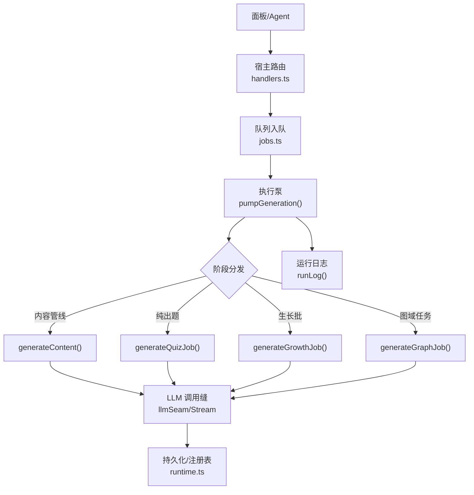
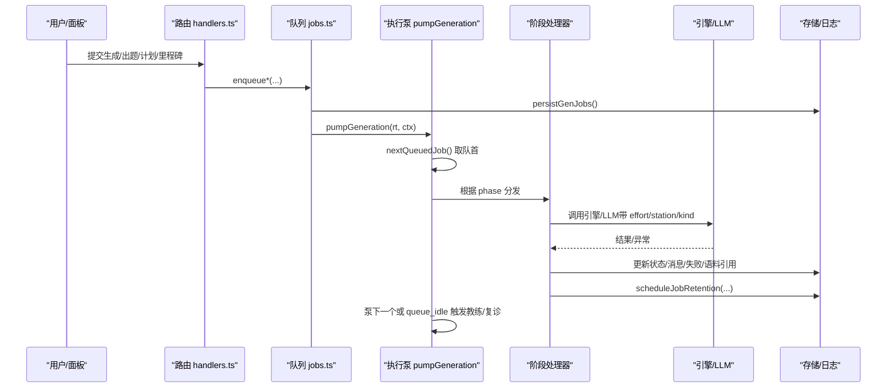
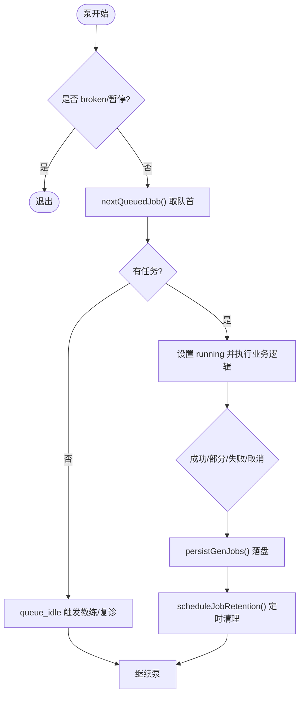
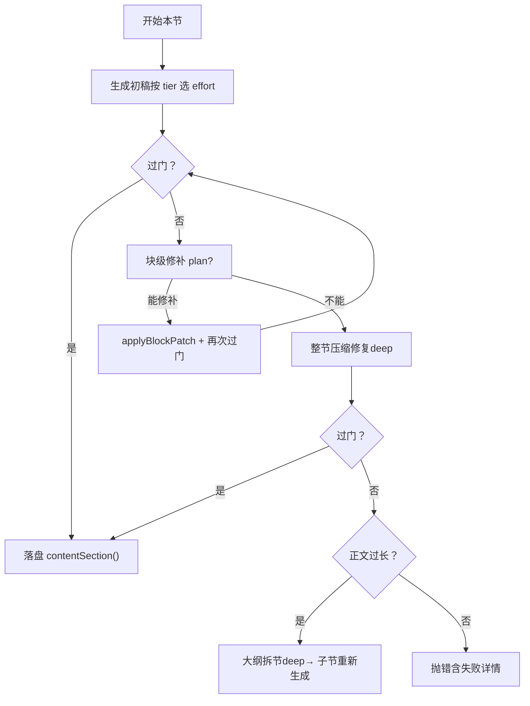
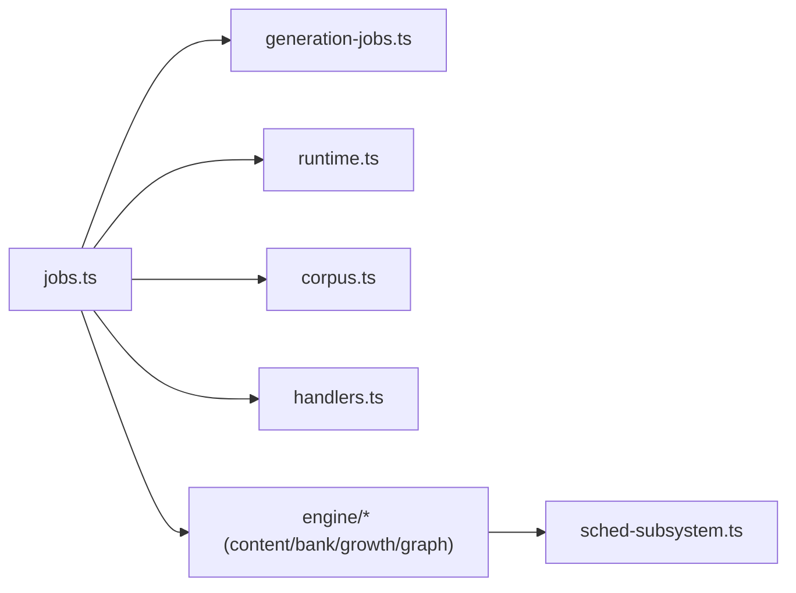

# 任务调度管理

<cite>
**本文引用的文件**
- [jobs.ts](file://src/host/jobs.ts)
- [generation-jobs.ts](file://src/generation-jobs.ts)
- [runtime.ts](file://src/host/runtime.ts)
- [sched-subsystem.ts](file://src/engine/sched-subsystem.ts)
- [sched.ts](file://src/engine/views/sched.ts)
- [handlers.ts](file://src/host/handlers.ts)
- [templates.ts](file://src/engine/prompts/templates.ts)
- [项目.ts](file://src/commands/项目.ts)
- [学习者产出.ts](file://src/commands/学习者产出.ts)
- [corpus.ts](file://src/host/corpus.ts)
</cite>

## 目录
1. [简介](#简介)
2. [项目结构](#项目结构)
3. [核心组件](#核心组件)
4. [架构总览](#架构总览)
5. [详细组件分析](#详细组件分析)
6. [依赖关系分析](#依赖关系分析)
7. [性能考量](#性能考量)
8. [故障排查指南](#故障排查指南)
9. [结论](#结论)
10. [附录：配置与扩展点](#附录：配置与扩展点)

## 简介
本文件面向“生成任务”的调度与管理，覆盖以下方面：
- 调度策略：FIFO 排队、全局单并发、按阶段推进（大纲→正文→出题）、资源档位（fast/deep）与节点复杂度联动。
- 生命周期：入队、执行、状态机（queued/running/cancelling/done/partial/failed/cancelled）、终态保留期与清扫。
- 错误处理与重试：门禁失败回灌修复、溢出拆节、取消优先、失败码与语料补标、可重试路径。
- 监控与日志：运行日志、队列泵事件、LLM 调用日志、语料捕获与引用、进度消息。
- 配置与扩展：队列开关、模型/档位、第二意见抽样率、站名映射、面板/agent 接入点。
- 使用示例与优化建议：面板下发、命令触发、性能调优与稳定性建议。

## 项目结构
围绕任务调度，关键代码分布在宿主技术层与引擎子系统：
- 宿主技术层（host）
  - jobs.ts：生成队列注册表、入队 API、执行泵、阶段处理器、清理与恢复。
  - runtime.ts：运行时对象、任务记录结构、运行日志工具、装配入口。
  - handlers.ts：面板路由，将 UI 操作转为入队请求。
  - corpus.ts：语料捕获与站点映射，用于失败定位与审计。
- 引擎子系统（engine）
  - sched-subsystem.ts：学习调度域（FSRS、XP、记忆健康等），与生成队列解耦但通过触发点协作。
  - views/sched.ts：调度域视图类型（记忆健康、ETA 等）。
  - prompts/templates.ts：提示词模板（计划/里程碑产物等），驱动图域任务的产出。
- 通用契约
  - generation-jobs.ts：任务状态、阶段、保留期、清扫裁决、失败结构化等统一契约。

图表来源
- [jobs.ts:696-740](file://src/host/jobs.ts#L696-L740)
- [runtime.ts:217-231](file://src/host/runtime.ts#L217-L231)

章节来源
- [jobs.ts:1-120](file://src/host/jobs.ts#L1-L120)
- [runtime.ts:1-134](file://src/host/runtime.ts#L1-L134)
- [handlers.ts:682-701](file://src/host/handlers.ts#L682-L701)

## 核心组件
- 生成队列与任务注册表
  - FIFO 选取最早入队的 queued 任务；全局单并发泵；支持取消旗标；终态保留期后清扫。
- 阶段处理器
  - 内容管线（outline→sections→quiz）、纯出题（phase=quiz）、生长批（coach growth）、图域任务（seed/compass/decompile/plan/milestone）。
- 状态机与保留期
  - 状态：queued/running/cancelling/done/partial/failed/cancelled；终态保留期 done=30min，其他=24h；finishedAt 作为起算点。
- 错误与修复
  - 门禁失败回灌块级修补或整节压缩修复；溢出时尝试大纲拆节；取消优先于失败；失败码稳定提取并补标语料。
- 监控与日志
  - 运行日志写入中心状态目录；LLM 调用日志带站点/档位/耗时；语料捕获提供失败样本引用；任务消息随阶段更新。

章节来源
- [generation-jobs.ts:6-15](file://src/generation-jobs.ts#L6-L15)
- [generation-jobs.ts:31-55](file://src/generation-jobs.ts#L31-L55)
- [jobs.ts:288-350](file://src/host/jobs.ts#L288-L350)
- [jobs.ts:696-740](file://src/host/jobs.ts#L696-L740)

## 架构总览
任务从面板/命令进入，经宿主路由入队，由执行泵串行消费。每个任务携带 phase 与负载，按阶段分派到对应处理器。处理器内调用引擎能力（内容/题库/教练回合/图域），并通过 Agent 缝访问 LLM。所有写操作落盘，状态变更频繁持久化；失败时记录语料引用以便回溯。队列空闲时触发教练检查点与复诊结算，形成闭环。

图表来源
- [jobs.ts:696-740](file://src/host/jobs.ts#L696-L740)
- [jobs.ts:288-350](file://src/host/jobs.ts#L288-L350)
- [runtime.ts:217-231](file://src/host/runtime.ts#L217-L231)

## 详细组件分析

### 队列与执行泵（FIFO + 单并发）
- 入队幂等与互斥
  - 同一 course/node 在 running/cancelling 拒绝重复入队；已 queued 则返回排队信息。
  - 终点节点禁止生成（ENDPOINT_GENERATION_FORBIDDEN）。
- 执行泵
  - 全局 pumping 标志保证单并发；broken 态拒绝启动；每完成一个任务释放泵槽并继续取下一个。
  - 队列空闲时触发 coach checkpoint 与 recheck 结算。
- 保留期与清扫
  - 终态记录带 finishedAt；按 status 决定保留时长；悬空（课程/节点缺失）直接清除。

图表来源
- [jobs.ts:696-740](file://src/host/jobs.ts#L696-L740)
- [generation-jobs.ts:31-55](file://src/generation-jobs.ts#L31-L55)
- [generation-jobs.ts:94-121](file://src/generation-jobs.ts#L94-L121)

章节来源
- [jobs.ts:288-350](file://src/host/jobs.ts#L288-L350)
- [jobs.ts:696-740](file://src/host/jobs.ts#L696-L740)
- [generation-jobs.ts:31-55](file://src/generation-jobs.ts#L31-L55)

### 内容管线（大纲→正文→出题）
- 大纲
  - 若解析/形状/预算失败，回灌修复一轮；失败码标准化，附带人话前缀。
- 逐节正文
  - 初跑档按节点复杂度选择 effort（高复杂度 deep，否则 fast）。
  - 门禁失败先尝试块级局部修补；若全部定位到违规块且合并成功则再校验；否则整节压缩修复一轮（deep）。
  - 仍失败且为“正文过长”时，尝试大纲拆节（deep），交由上层继续。
- 自动出题
  - 仅对就绪节进行；题型多样性与先验检索审计注记会附加到任务消息。

图表来源
- [jobs.ts:169-248](file://src/host/jobs.ts#L169-L248)
- [jobs.ts:250-267](file://src/host/jobs.ts#L250-L267)
- [generation-jobs.ts:123-184](file://src/generation-jobs.ts#L123-L184)

章节来源
- [jobs.ts:169-248](file://src/host/jobs.ts#L169-L248)
- [jobs.ts:250-267](file://src/host/jobs.ts#L250-L267)
- [generation-jobs.ts:123-184](file://src/generation-jobs.ts#L123-L184)

### 纯出题任务（phase=quiz）
- 复用全局队列与 GenJob 记录；同节点互斥（与正文生成互斥）。
- 档位声明：按节点复杂度选择 effort（高复杂 deep，否则 fast）。
- 结果暂存：quizJobResults 供 agent 等待完成后读取；随终态保留期清理。

章节来源
- [jobs.ts:324-350](file://src/host/jobs.ts#L324-L350)
- [jobs.ts:742-789](file://src/host/jobs.ts#L742-L789)
- [generation-jobs.ts:186-213](file://src/generation-jobs.ts#L186-L213)

### 生长批（教练回合）
- 阻尼防循环：同课已有生长批在途不重入；上一批失败/取消不自动重试；idle/no_structure 不重拉（除非 inject/force）。
- force 豁免：面板“生长一步”或失败重试显式传入 force，即使就绪深度满足也执行一轮裁决。
- 结果：applied/no_structure/idle；轨迹与裁决段信息写入任务消息。

章节来源
- [jobs.ts:439-479](file://src/host/jobs.ts#L439-L479)
- [jobs.ts:640-688](file://src/host/jobs.ts#L640-L688)

### 图域任务（seed/compass/decompile/plan/milestone）
- 负载键校验：phase 所需 payload 缺失会在恢复侧明确标记失败可重试。
- 执行：各 phase 调用引擎对应方法，产物走提案人审通道（种子/反编译/计划/里程碑）。
- 失败：按 phase 映射到站点，补标语料引用。

章节来源
- [generation-jobs.ts:64-84](file://src/generation-jobs.ts#L64-L84)
- [jobs.ts:546-638](file://src/host/jobs.ts#L546-L638)

### 状态机与保留期
- 状态定义与终态判定：queued/running/cancelling/done/partial/failed/cancelled。
- 保留期：done=30 分钟，其余=24 小时；finishedAt 作为起算点；旧档无戳回退 startedAt。
- 清扫：课程/节点缺失视为悬空直接删除；终态超保留期删除。

章节来源
- [generation-jobs.ts:6-15](file://src/generation-jobs.ts#L6-L15)
- [generation-jobs.ts:42-55](file://src/generation-jobs.ts#L42-L55)
- [generation-jobs.ts:94-121](file://src/generation-jobs.ts#L94-L121)

### 错误处理与重试机制
- 失败码与语料补标：errorCodeOf 提取稳定码；failCorpus 标注最近一条捕获，失败详情附语料引用。
- 内容管线修复阶梯：块级修补→整节压缩→大纲拆节；取消优先于失败。
- 可重试路径：partial/failed 保留 24 小时，面板/agent 可重试；quiz 失败保留 partial 并给出重试指引。

章节来源
- [jobs.ts:34-44](file://src/host/jobs.ts#L34-L44)
- [jobs.ts:169-248](file://src/host/jobs.ts#L169-L248)
- [jobs.ts:742-789](file://src/host/jobs.ts#L742-L789)
- [generation-jobs.ts:123-184](file://src/generation-jobs.ts#L123-L184)

### 监控与日志
- 运行日志：runLog 写入中心状态目录，截断上限；API 调用失败也留痕。
- LLM 调用日志：站点、模式、档位、耗时、字符数、token 用量。
- 语料捕获：失败/容忍补标，失败详情附相对路径引用。
- 任务消息：阶段推进、失败原因、多样性/先验审计注记。

章节来源
- [runtime.ts:217-231](file://src/host/runtime.ts#L217-L231)
- [runtime.ts:170-182](file://src/host/runtime.ts#L170-L182)
- [jobs.ts:83-117](file://src/host/jobs.ts#L83-L117)
- [corpus.ts:91-117](file://src/host/corpus.ts#L91-L117)

## 依赖关系分析
- 耦合与内聚
  - jobs.ts 集中队列与执行器，内聚度高；通过 runtime 注入 engine/agent/corpus，降低模块耦合。
  - generation-jobs.ts 提供纯函数契约（状态、保留期、清扫裁决），被 host 与测试共用，增强一致性。
- 外部依赖
  - LLM 通过 Agent 缝注入，便于替换与观测。
  - FSRS/复习调度在 sched-subsystem.ts，与生成队列通过触发点协作（如 node_complete 后入队 T1/T2）。
- 潜在循环
  - 队列空闲触发教练检查点与复诊结算，避免直接回调入队造成死循环（通过阻尼与检查点时序控制）。

图表来源
- [jobs.ts:1-33](file://src/host/jobs.ts#L1-L33)
- [jobs.ts:696-740](file://src/host/jobs.ts#L696-L740)
- [sched-subsystem.ts:265-270](file://src/engine/sched-subsystem.ts#L265-L270)

章节来源
- [jobs.ts:1-33](file://src/host/jobs.ts#L1-L33)
- [sched-subsystem.ts:265-270](file://src/engine/sched-subsystem.ts#L265-L270)

## 性能考量
- 并发与吞吐
  - 全局单并发保证队列有序与资源可控；适合长耗时 LLM 调用场景。
  - 批量/并行不在队列层实现，建议在业务层拆分任务粒度（按节/题）。
- 资源档位
  - 高复杂度节点使用 deep 档，提升质量但增加成本；可通过配置调整 fast/deep 策略。
- 保留期与清扫
  - 合理设置保留期，避免注册表膨胀；清扫在 apply 出口与空闲时触发。
- 日志与语料
  - 运行日志与语料捕获可能带来 IO 开销；生产环境注意磁盘容量与异步写入。

[本节为通用指导，无需特定文件来源]

## 故障排查指南
- 队列无法启动
  - 检查 genQueueBroken 标志；broken 期间写回闸拒绝，需修复任务档后重启。
- 任务卡住
  - 查看任务 message 与 failures；确认是否 running/cancelling；必要时取消并重试。
- 正文过长
  - 触发大纲拆节；若仍失败，检查门禁清单 finding，必要时人工重写该节。
- 出题失败
  - 查看 quiz 失败 outcome；保留 partial 并提供重试入口；检查先验检索与多样性指标。
- 教练回合停摆
  - 检查就绪深度与阻尼；使用 force 显式重新裁决；查看轨迹与裁决段。

章节来源
- [jobs.ts:271-286](file://src/host/jobs.ts#L271-L286)
- [jobs.ts:696-740](file://src/host/jobs.ts#L696-L740)
- [jobs.ts:169-248](file://src/host/jobs.ts#L169-L248)
- [jobs.ts:742-789](file://src/host/jobs.ts#L742-L789)
- [jobs.ts:439-479](file://src/host/jobs.ts#L439-L479)

## 结论
本系统的任务调度以“队列+阶段处理器”为核心，采用 FIFO 与全局单并发保障一致性与可观测性。通过严格的状态机、保留期与清扫机制，结合门禁修复阶梯与语料补标，实现了健壮的错误处理与可重试路径。与学习调度（FSRS/XP）解耦但紧密协作，形成从内容生成到复习调度的完整闭环。生产部署中应关注资源档位、日志与语料容量，以及队列中断后的恢复流程。

[本节为总结，无需特定文件来源]

## 附录：配置与扩展点
- 队列与运行
  - 队列暂停/恢复：通过 flags.queuePaused 控制泵启动。
  - 任务档损坏：flags.genQueueBroken 阻止写回，需修复后重启。
- 模型与档位
  - provider/model：LearnhubConfig 指定；任务记录 model 字段可审计每次生成所用模型。
  - fastEffort/deepEffort：影响大纲/节正文的思考档位；高复杂度节点默认 deep。
- 出题质量
  - quizAuditRate：第二意见门抽样率（0–1），缺省 0.25；0 关闭。
- 站点与语料
  - STATIONS 映射：quiz/section/split/seed/growth/compass/decompile/plan/milestone。
  - corpusDir：语料落盘目录覆盖，便于离线评审。
- 面板/命令接入
  - 面板路由：/project/plan/generate、/project/milestone/generate 等，均入队图域任务。
  - 命令：项目里程碑生成、计划草案生成、执行日志等，均通过 channel 入队或同步调用。

章节来源
- [runtime.ts:23-44](file://src/host/runtime.ts#L23-L44)
- [runtime.ts:138-193](file://src/host/runtime.ts#L138-L193)
- [corpus.ts:91-117](file://src/host/corpus.ts#L91-L117)
- [handlers.ts:682-701](file://src/host/handlers.ts#L682-L701)
- [项目.ts:258-339](file://src/commands/项目.ts#L258-L339)
- [学习者产出.ts:120-128](file://src/commands/学习者产出.ts#L120-L128)
- [templates.ts:311-399](file://src/engine/prompts/templates.ts#L311-L399)