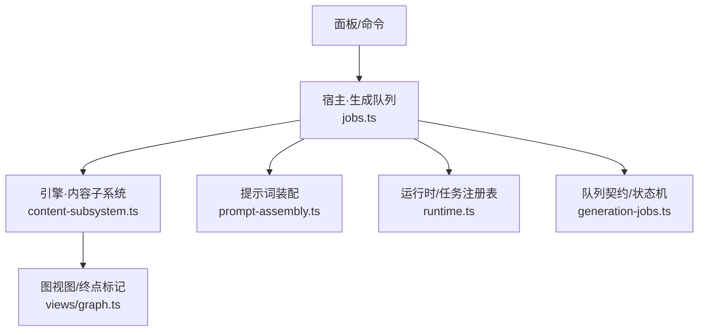
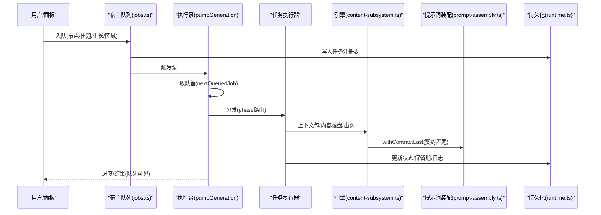
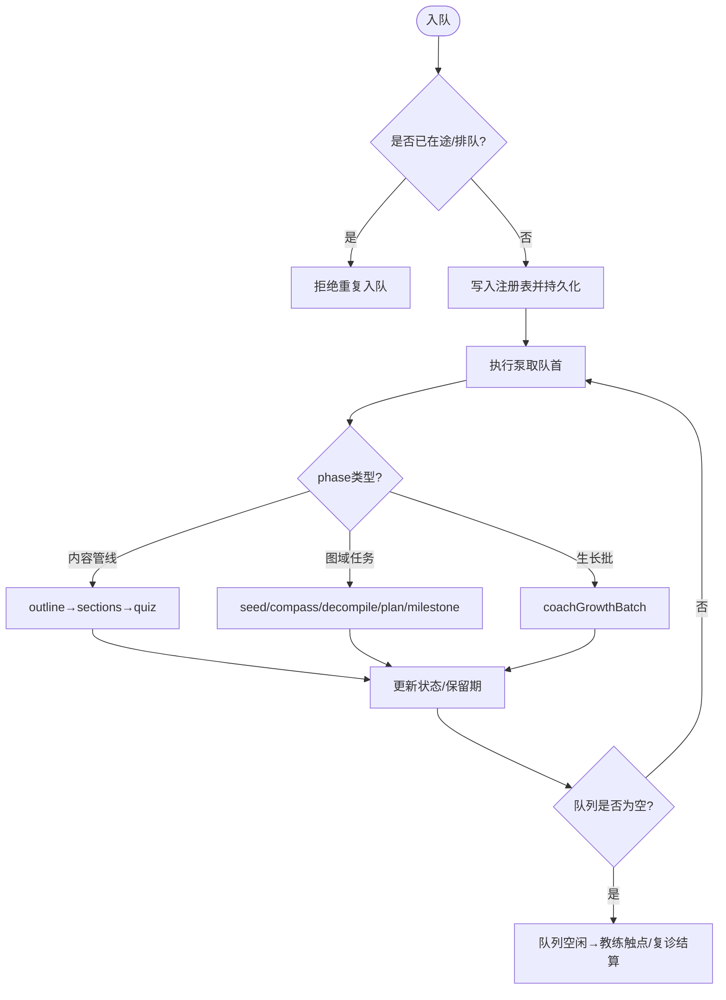
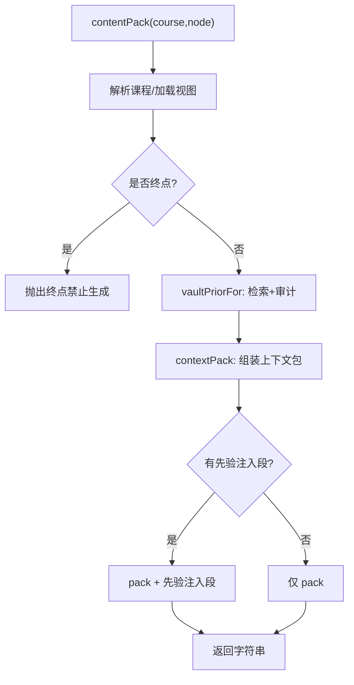
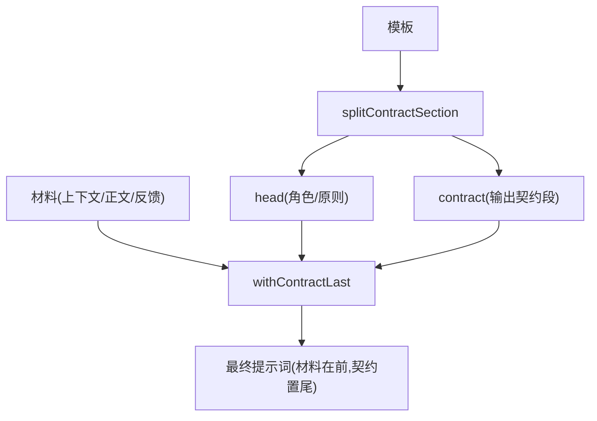
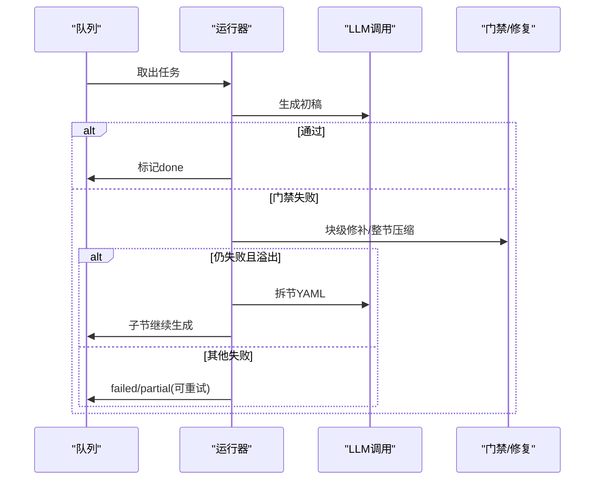
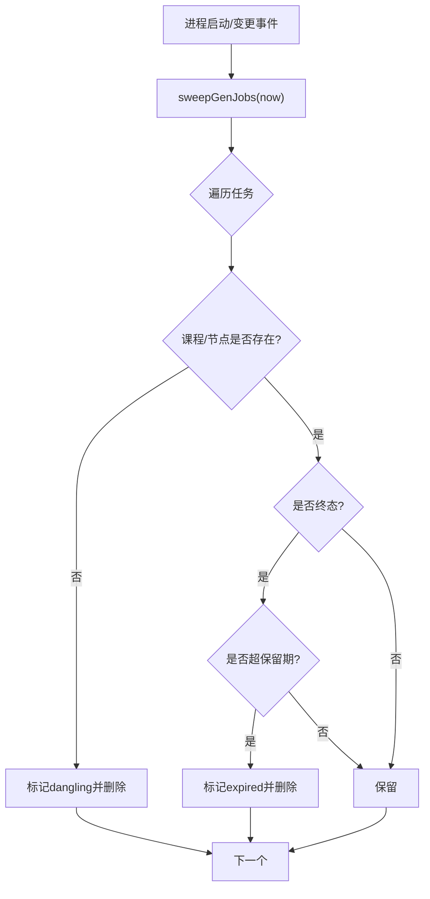
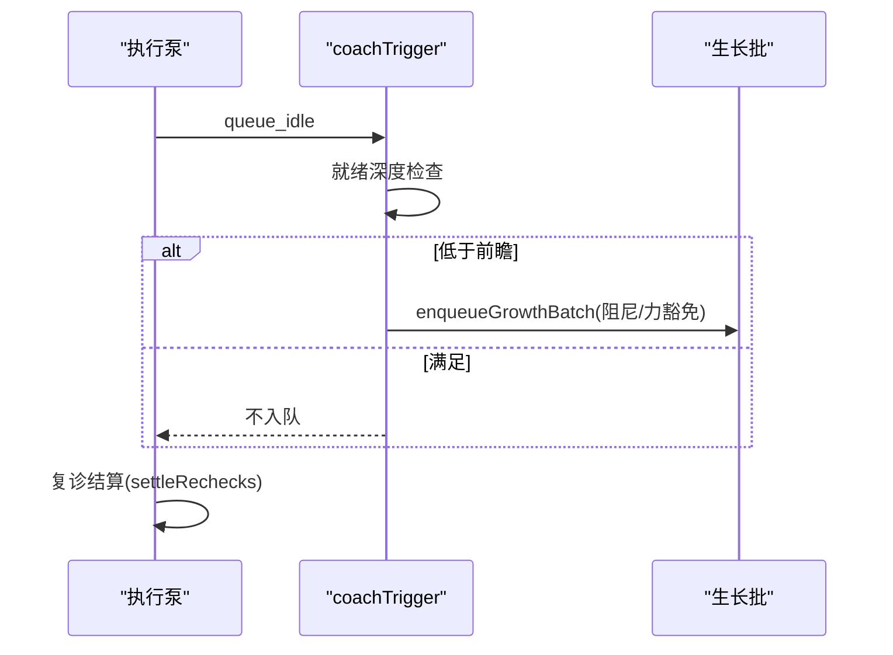
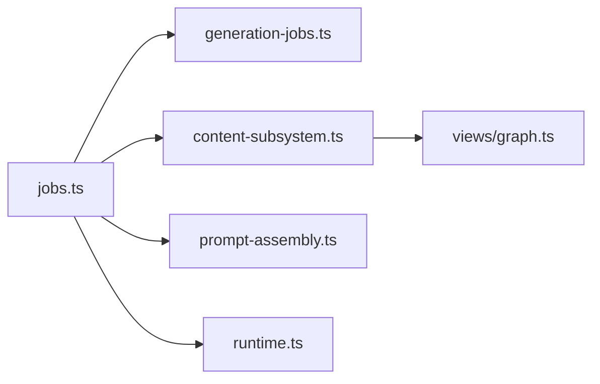

# 生成流程管理

<cite>
**本文引用的文件**
- [jobs.ts](file://src/host/jobs.ts)
- [generation-jobs.ts](file://src/generation-jobs.ts)
- [content-subsystem.ts](file://src/engine/content-subsystem.ts)
- [prompt-assembly.ts](file://src/engine/prompt-assembly.ts)
- [runtime.ts](file://src/host/runtime.ts)
- [graph.ts](file://src/engine/views/graph.ts)
- [项目.ts](file://src/commands/项目.ts)
- [generation-jobs.test.ts](file://tests/generation-jobs.test.ts)
</cite>

## 目录
1. [简介](#简介)
2. [项目结构](#项目结构)
3. [核心组件](#核心组件)
4. [架构总览](#架构总览)
5. [详细组件分析](#详细组件分析)
6. [依赖关系分析](#依赖关系分析)
7. [性能与并发控制](#性能与并发控制)
8. [故障排除指南](#故障排除指南)
9. [结论](#结论)
10. [附录：配置与监控](#附录：配置与监控)

## 简介
本文件面向“内容生成流程管理”，系统性说明生成队列系统、任务优先级与状态跟踪、上下文包组装（节点信息提取、前置知识摘要、后继预告、领域边界定义）、调度策略（并发控制、资源分配、错误重试）、状态持久化与恢复、以及配置与监控方法。文档同时给出使用示例与故障排除指引，帮助读者从入门到深入掌握该子系统。

## 项目结构
生成流程由宿主层（host）的队列执行器与引擎层（engine）的内容管线共同构成：
- 宿主层负责入队、执行泵、任务注册表、清理与恢复、教练触点触发等。
- 引擎层负责上下文包组装、提示词拼装、内容落盘门、大纲/正文/出题流水线。

**图表来源**
- [jobs.ts:1-800](file://src/host/jobs.ts#L1-L800)
- [content-subsystem.ts:100-162](file://src/engine/content-subsystem.ts#L100-L162)
- [prompt-assembly.ts:1-43](file://src/engine/prompt-assembly.ts#L1-L43)
- [runtime.ts:82-104](file://src/host/runtime.ts#L82-L104)
- [graph.ts:72-199](file://src/engine/views/graph.ts#L72-L199)
- [generation-jobs.ts:1-213](file://src/generation-jobs.ts#L1-L213)

**章节来源**
- [jobs.ts:1-800](file://src/host/jobs.ts#L1-L800)
- [generation-jobs.ts:1-213](file://src/generation-jobs.ts#L1-L213)

## 核心组件
- 生成队列与执行泵：全局单并发 FIFO 队列，统一承载内容生成、纯出题、生长批、图域任务（种子/罗盘/反编译/计划/里程碑）。
- 任务注册表与状态机：记录任务键、阶段、状态、保留期；支持取消、清扫与恢复。
- 上下文包组装：节点信息、先验检索注入段、后继预告（终点锚）、领域边界（课程/区块/节点）。
- 提示词装配：将“材料”与“输出契约段”拼接，确保契约在最终 prompt 末尾生效。
- 教练触点与自动拉批：就绪深度检查、阻尼与显式 force 豁免，队列空闲时触发。
- 持久化与恢复：任务档写回闸、终态保留期、清扫裁决、重启后补挂定时器。

**章节来源**
- [jobs.ts:269-740](file://src/host/jobs.ts#L269-L740)
- [generation-jobs.ts:1-213](file://src/generation-jobs.ts#L1-L213)
- [content-subsystem.ts:109-146](file://src/engine/content-subsystem.ts#L109-L146)
- [prompt-assembly.ts:1-43](file://src/engine/prompt-assembly.ts#L1-L43)
- [runtime.ts:82-104](file://src/host/runtime.ts#L82-L104)

## 架构总览
生成流程的关键交互如下：

**图表来源**
- [jobs.ts:690-740](file://src/host/jobs.ts#L690-L740)
- [content-subsystem.ts:125-146](file://src/engine/content-subsystem.ts#L125-L146)
- [prompt-assembly.ts:21-29](file://src/engine/prompt-assembly.ts#L21-L29)
- [runtime.ts:99-104](file://src/host/runtime.ts#L99-L104)

## 详细组件分析

### 生成队列与任务状态机
- 队列语义：FIFO，按 startedAt 最早者优先；同一时刻只执行一个任务。
- 阶段 phase：outline → sections → quiz（节点内容管线），seed/growth/compass/decompile/plan/milestone（图域任务）。
- 状态 status：queued/running/cancelling/done/partial/failed/cancelled；终态保留期不同（成功短留，失败/部分长留）。
- 清扫裁决：课程删除或节点删改导致悬空；终态超保留期过期；活动记录不受保留期约束。

**图表来源**
- [jobs.ts:288-322](file://src/host/jobs.ts#L288-L322)
- [jobs.ts:690-740](file://src/host/jobs.ts#L690-L740)
- [generation-jobs.ts:31-62](file://src/generation-jobs.ts#L31-L62)
- [generation-jobs.ts:94-121](file://src/generation-jobs.ts#L94-L121)

**章节来源**
- [jobs.ts:269-740](file://src/host/jobs.ts#L269-L740)
- [generation-jobs.ts:1-213](file://src/generation-jobs.ts#L1-L213)
- [generation-jobs.test.ts:23-172](file://tests/generation-jobs.test.ts#L23-L172)

### 上下文包组装（节点信息、先验注入、后继预告、领域边界）
- 节点信息：解析课程注册表与图视图，校验节点存在性与笔记健康。
- 先验注入：基于节点名与直接前置名，经概念登记表扩词，扫描个人笔记，返回注入段与审计（零命中/截断/命中清单）。
- 后继预告：读取课程锚点中的终点集合，用于“后继预告”措辞，避免误标普通叶子为终点。
- 领域边界：以课程根、区块、节点为作用域，确保生成门对终点恒拒。

**图表来源**
- [content-subsystem.ts:109-146](file://src/engine/content-subsystem.ts#L109-L146)
- [graph.ts:72-199](file://src/engine/views/graph.ts#L72-L199)

**章节来源**
- [content-subsystem.ts:109-146](file://src/engine/content-subsystem.ts#L109-L146)
- [graph.ts:72-199](file://src/engine/views/graph.ts#L72-L199)

### 提示词装配与契约后置
- 契约切分：模板中最后一个“## 输出…”至末尾为契约段；前段为角色/原则/约束。
- 契约后置：将“材料”置于前，“契约段”置于最后，确保模型最后读到“只输出 X”。
- 修复轮提示词：材料+上一次输出+校验清单，保持契约位置不变。

**图表来源**
- [prompt-assembly.ts:11-43](file://src/engine/prompt-assembly.ts#L11-L43)

**章节来源**
- [prompt-assembly.ts:1-43](file://src/engine/prompt-assembly.ts#L1-L43)

### 生成任务的调度策略（并发、资源、重试）
- 并发控制：全局单并发执行泵；broken 态/暂停/泵锁保护；同键防重入。
- 资源分配：LLM effort 档位随节点复杂度（高复杂 deep，否则 fast）；出题站显式声明 effort。
- 错误重试：块级局部修补→整节压缩修复一轮→溢出则拆节；大纲护栏/形状/解析失败可回灌一次；失败带语料引用便于定位。
- 取消与超时：每步检查取消旗标；agent 工具等待超时保护。

**图表来源**
- [jobs.ts:169-267](file://src/host/jobs.ts#L169-L267)
- [jobs.ts:742-789](file://src/host/jobs.ts#L742-L789)
- [generation-jobs.ts:123-184](file://src/generation-jobs.ts#L123-L184)

**章节来源**
- [jobs.ts:169-267](file://src/host/jobs.ts#L169-L267)
- [jobs.ts:742-789](file://src/host/jobs.ts#L742-L789)
- [generation-jobs.ts:123-184](file://src/generation-jobs.ts#L123-L184)

### 生成状态的持久化与恢复
- 写回闸：任务档 broken 期间拒绝一切会全量落盘的写操作，避免覆盖现场。
- 保留期：done 保留 30 分钟；partial/failed/cancelled 保留 24 小时；活动记录不清理。
- 清扫：课程删除/节点删改→dangling；终态超保留期→expired；活动记录 keep。
- 恢复：重启后根据 finishedAt/startedAt 计算剩余保留期，补挂定时器；payload 缺失的任务明确失败可重试。

**图表来源**
- [jobs.ts:378-437](file://src/host/jobs.ts#L378-L437)
- [generation-jobs.ts:94-121](file://src/generation-jobs.ts#L94-L121)

**章节来源**
- [jobs.ts:270-437](file://src/host/jobs.ts#L270-L437)
- [generation-jobs.ts:94-121](file://src/generation-jobs.ts#L94-L121)

### 教练触点与自动拉批（T1/T2 触发机制）
- 就绪深度检查：低于前瞻的课程入队生长批；自动触点走阻尼，显式触点（force/inject）豁免停摆与暂不产结构。
- 队列空闲触发：生成泵排空后触发 coach checkpoint，随后可能入队生长批；失败只留运行日志。
- 复诊结算：队列空闲时自动结算到期插入边（零人审：proven/自动剪除），必要时清扫悬空任务。

**图表来源**
- [jobs.ts:505-544](file://src/host/jobs.ts#L505-L544)
- [jobs.ts:690-740](file://src/host/jobs.ts#L690-L740)

**章节来源**
- [jobs.ts:505-544](file://src/host/jobs.ts#L505-L544)
- [jobs.ts:690-740](file://src/host/jobs.ts#L690-L740)

### 使用示例
- 入队节点生成：调用 enqueueGeneration(course, node, style?)，返回 queued 标志与消息；可在生成队列查看进度。
- 定向补题：enqueueQuizGeneration(course, node, {count?, section?, instruction?})，复用全局队列，互斥于节点正文生成。
- 生长批：enqueueGrowthBatch(course, why, inject?, {force?})，支持计划修订注入与显式 force 豁免。
- 等待完成：waitForGenJob(key, timeoutMs)，同步语义等待任务终态。

参考路径
- [jobs.ts:288-350](file://src/host/jobs.ts#L288-L350)
- [jobs.ts:454-479](file://src/host/jobs.ts#L454-L479)
- [jobs.ts:353-376](file://src/host/jobs.ts#L353-L376)

**章节来源**
- [jobs.ts:288-376](file://src/host/jobs.ts#L288-L376)
- [jobs.ts:454-479](file://src/host/jobs.ts#L454-L479)

## 依赖关系分析
- 宿主 jobs.ts 依赖 engine 内容子系统、提示词装配、运行时任务注册表、队列契约。
- 内容子系统依赖图视图（终点标记）、注册表、存储、题库、学习会话等窄面能力。
- 队列契约集中定义 phase/status/保留期/清扫裁决，供宿主与测试共用，避免散落字面量。

**图表来源**
- [jobs.ts:1-800](file://src/host/jobs.ts#L1-L800)
- [generation-jobs.ts:1-213](file://src/generation-jobs.ts#L1-L213)
- [content-subsystem.ts:100-162](file://src/engine/content-subsystem.ts#L100-L162)
- [prompt-assembly.ts:1-43](file://src/engine/prompt-assembly.ts#L1-L43)
- [runtime.ts:82-104](file://src/host/runtime.ts#L82-L104)
- [graph.ts:72-199](file://src/engine/views/graph.ts#L72-L199)

**章节来源**
- [jobs.ts:1-800](file://src/host/jobs.ts#L1-L800)
- [generation-jobs.ts:1-213](file://src/generation-jobs.ts#L1-L213)

## 性能与并发控制
- 单并发执行泵：避免并发竞争，保证注册表一致性；泵锁防止重入。
- FIFO 优先级：按 startedAt 排序，公平调度。
- 资源档位：内容生成按节点复杂度选择 effort；出题显式声明 effort，避免默认漂移。
- 失败快速降级：块级修补→整节压缩→拆节，减少无效重试。
- 保留期优化：成功短留、失败长留，兼顾排查与内存占用。

[本节提供通用指导，无需特定文件分析]

## 故障排除指南
常见问题与处理建议：
- 任务档损坏（genQueueBroken）：所有写回被拒绝；需修复任务档后重启，队列功能恢复。
- 终点节点入队被拒：终点是方向标记，不被学习调度；请确认目标非终点。
- 重复入队：同节点已有 running/cancelling/queued 任务；等待完成或取消后再试。
- 生成失败：查看失败详情与语料引用；若为 GATE_FAILED，可尝试“定点重写这一节”或转 AI 修复。
- 自动出题失败：进入练习页单独重试；失败保留 partial 状态与重试指引。
- 队列空闲无动作：检查教练触点节流（session_start 30 分钟）与阻尼；必要时使用“生长一步”显式 force。

参考路径
- [jobs.ts:270-322](file://src/host/jobs.ts#L270-L322)
- [jobs.ts:690-740](file://src/host/jobs.ts#L690-L740)
- [generation-jobs.ts:123-184](file://src/generation-jobs.ts#L123-L184)

**章节来源**
- [jobs.ts:270-322](file://src/host/jobs.ts#L270-L322)
- [jobs.ts:690-740](file://src/host/jobs.ts#L690-L740)
- [generation-jobs.ts:123-184](file://src/generation-jobs.ts#L123-L184)

## 结论
本系统通过“宿主队列 + 引擎内容管线”的清晰分层，实现了稳定可靠的生成流程管理。其关键优势包括：
- 统一的队列与状态机，支持多类任务与生命周期管理。
- 上下文包与提示词装配保障生成质量与可控性。
- 健壮的错误修复阶梯与语料溯源，提升可观测性与可维护性。
- 完善的持久化与恢复机制，确保中断后可恢复。
- 教练触点与自动拉批，形成闭环的学习内容演进。

[本节总结性内容，无需特定文件分析]

## 附录：配置与监控
- 配置要点
  - 任务档损坏开关：genQueueBroken（写回闸）
  - 队列暂停：queuePaused（泵停止）
  - 出题审计率：quizAuditRate（第二意见抽样）
  - 教练触点节流：SESSION_START_THROTTLE_MS（30 分钟）
  - 保留期：done=30 分钟；partial/failed/cancelled=24 小时
- 监控方法
  - 生成队列页面：查看任务 key、phase、status、message、finishedAt
  - 运行日志：coach_checkpoint、quiz_job、graph_job、coach_growth 等
  - 语料区：失败站点标注（quiz/section/split/growth 等）及最近捕获
  - 面板通知：生长批裁决结果、自动出题结果、失败重试入口

参考路径
- [jobs.ts:270-322](file://src/host/jobs.ts#L270-L322)
- [jobs.ts:690-740](file://src/host/jobs.ts#L690-L740)
- [runtime.ts:82-104](file://src/host/runtime.ts#L82-L104)

**章节来源**
- [jobs.ts:270-322](file://src/host/jobs.ts#L270-L322)
- [jobs.ts:690-740](file://src/host/jobs.ts#L690-L740)
- [runtime.ts:82-104](file://src/host/runtime.ts#L82-L104)