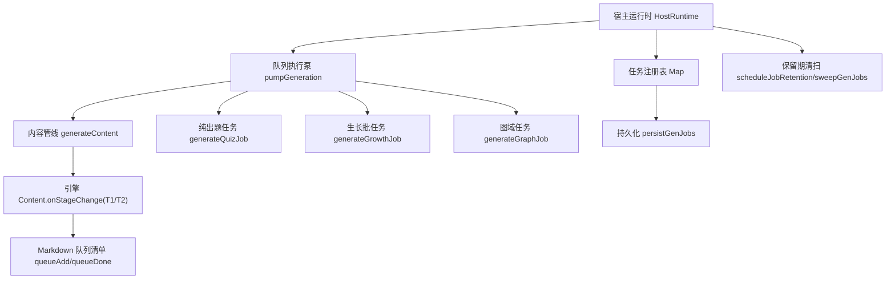
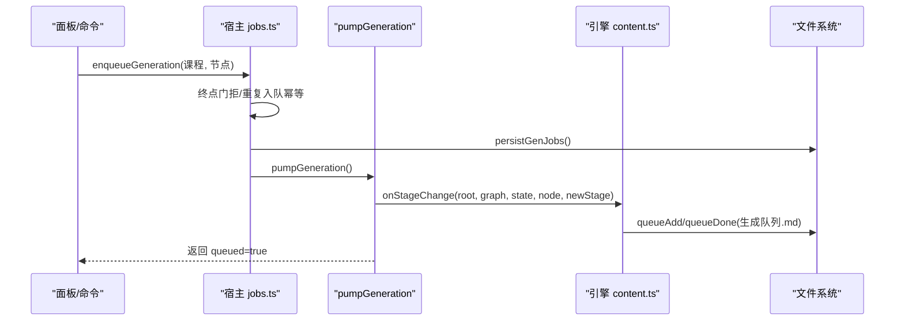
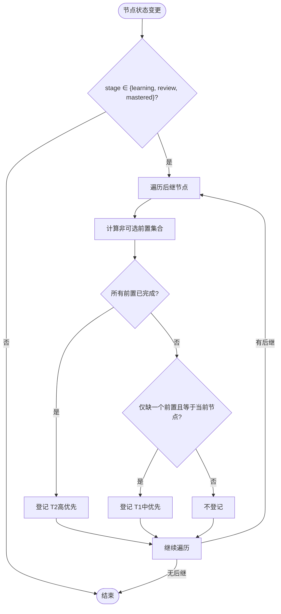
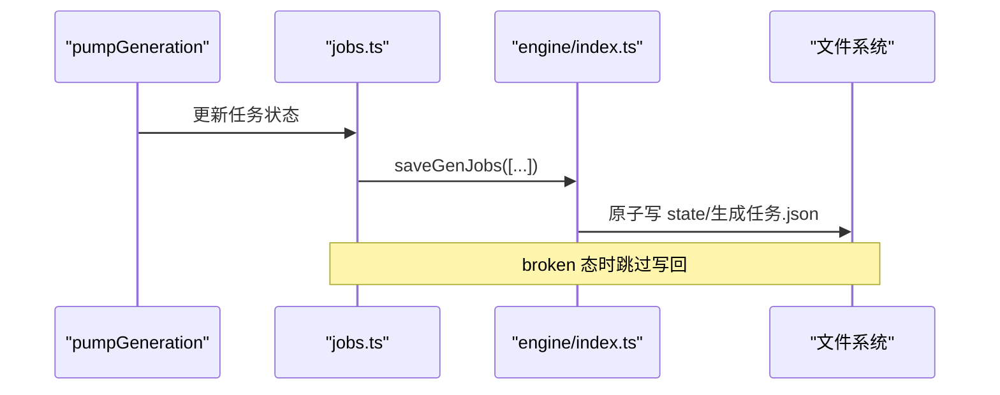
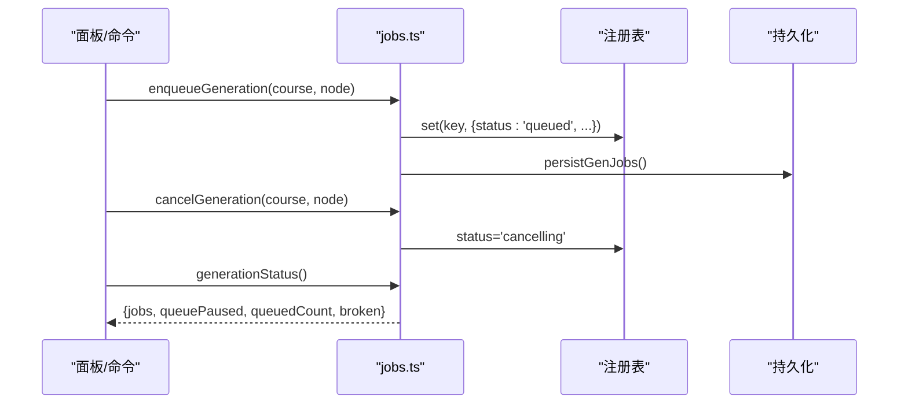
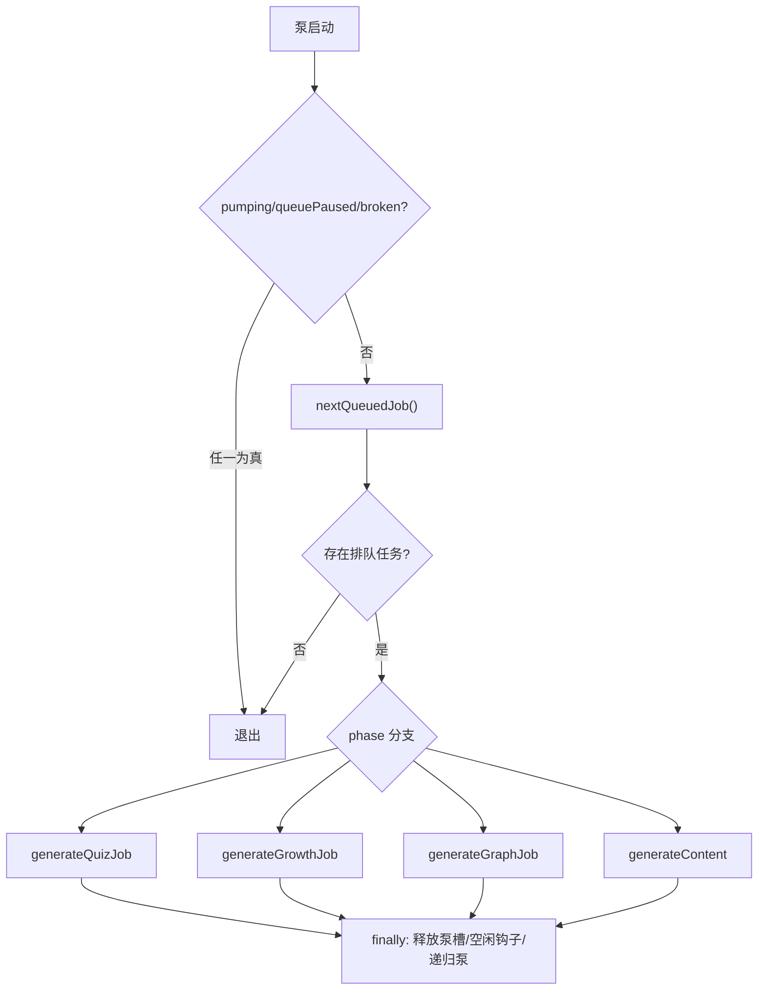
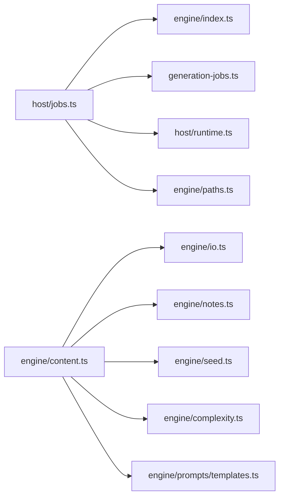

# 生成队列系统

<cite>
**本文引用的文件**
- [src/host/jobs.ts](file://src/host/jobs.ts)
- [src/engine/content.ts](file://src/engine/content.ts)
- [src/engine/paths.ts](file://src/engine/paths.ts)
- [src/generation-jobs.ts](file://src/generation-jobs.ts)
- [src/host/runtime.ts](file://src/host/runtime.ts)
- [tests/host-runtime.test.ts](file://tests/host-runtime.test.ts)
- [tests/endpoint-invariants.test.ts](file://tests/endpoint-invariants.test.ts)
- [CONTEXT.md](file://CONTEXT.md)
</cite>

## 目录
1. [简介](#简介)
2. [项目结构](#项目结构)
3. [核心组件](#核心组件)
4. [架构总览](#架构总览)
5. [详细组件分析](#详细组件分析)
6. [依赖关系分析](#依赖关系分析)
7. [性能考量](#性能考量)
8. [故障排除指南](#故障排除指南)
9. [结论](#结论)
10. [附录：使用示例与监控管理](#附录使用示例与监控管理)

## 简介
本文件系统性说明“生成队列系统”的设计与实现，覆盖以下关键主题：
- T1/T2 触发机制：节点状态变化监听、前置依赖检查、自动入队逻辑。
- 队列数据结构：任务格式定义、优先级与去重机制。
- 持久化存储：Markdown 队列清单读写、原子写入与并发安全。
- 队列操作接口：入队、查询、完成标记等核心方法。
- 监控与管理：队列泵、暂停/恢复、保留期清扫、面板与工具使用。
- 使用示例与故障排除：常见错误定位与修复建议。

## 项目结构
生成队列由宿主层（host）与引擎层（engine）共同实现：
- 宿主层负责全局队列执行泵、任务注册表、落盘与清理、教练触点与图域任务执行。
- 引擎层负责课程级 Markdown 队列清单的读写、T1/T2 触发、上下文包与质检门。
- 路径与类型契约在 engine/paths.ts 与 generation-jobs.ts 中统一。



**图表来源**
- [src/host/jobs.ts:690-740](file://src/host/jobs.ts#L690-L740)
- [src/engine/content.ts:114-137](file://src/engine/content.ts#L114-L137)
- [src/generation-jobs.ts:31-40](file://src/generation-jobs.ts#L31-L40)

**章节来源**
- [src/host/jobs.ts:1-120](file://src/host/jobs.ts#L1-L120)
- [src/engine/content.ts:1-140](file://src/engine/content.ts#L1-L140)
- [src/engine/paths.ts:150-170](file://src/engine/paths.ts#L150-L170)
- [src/generation-jobs.ts:1-60](file://src/generation-jobs.ts#L1-L60)

## 核心组件
- 队列执行泵：全局单并发 FIFO 调度器，按 startedAt 取队首任务执行，跑完继续泵下一个；支持暂停、broken 态保护。
- 任务注册表：内存 Map + 持久化 JSON，承载所有生成任务的状态、阶段、进度与消息。
- 持久化策略：注册表全量落盘（fire-and-forget），Markdown 队列清单使用原子写；终态记录带 finishedAt 用于保留期清扫。
- T1/T2 触发：节点进入学习/复习/掌握时，扫描后继节点，依据前置依赖是否满足决定登记为 T1 或 T2。
- 出站钩子：队列空闲后触发教练回合检查与复诊结算，必要时拉取生长批。

**章节来源**
- [src/host/jobs.ts:269-322](file://src/host/jobs.ts#L269-L322)
- [src/host/jobs.ts:690-740](file://src/host/jobs.ts#L690-L740)
- [src/engine/content.ts:64-112](file://src/engine/content.ts#L64-L112)
- [src/engine/content.ts:114-137](file://src/engine/content.ts#L114-L137)
- [src/generation-jobs.ts:31-55](file://src/generation-jobs.ts#L31-L55)

## 架构总览
生成队列以“宿主泵 + 引擎触发”的双层架构组织：
- 宿主泵负责串行执行、状态机推进、落盘与清理。
- 引擎触发负责根据学习状态变更自动登记待生成条目到 Markdown 队列清单。
- 面板与命令通过宿主 API 入队，Agent 工具可等待任务终态并消费结果。



**图表来源**
- [src/host/jobs.ts:292-322](file://src/host/jobs.ts#L292-L322)
- [src/host/jobs.ts:690-740](file://src/host/jobs.ts#L690-L740)
- [src/engine/content.ts:114-137](file://src/engine/content.ts#L114-L137)
- [src/engine/content.ts:76-112](file://src/engine/content.ts#L76-L112)

## 详细组件分析

### T1/T2 触发机制
- 触发条件：当某节点 stage 变更为 learning/review/mastered 时，引擎扫描其后继节点。
- 前置依赖检查：对每个后继，计算其非可选前置集合，并与当前已完成的节点集比对。
- 登记规则：
  - 若所有前置已完成 → 登记为 T2（高优先）。
  - 若仅差一个前置且正是本次变更节点 → 登记为 T1（中优先）。
- 终点过滤：锚定的终点不参与 T1/T2 登记，避免方向标记被误入生成队列。



**图表来源**
- [src/engine/content.ts:114-137](file://src/engine/content.ts#L114-L137)

**章节来源**
- [src/engine/content.ts:114-137](file://src/engine/content.ts#L114-L137)
- [tests/endpoint-invariants.test.ts:460-483](file://tests/endpoint-invariants.test.ts#L460-L483)

### 队列数据结构与任务格式
- 任务键：course/node（内容管线）或 course/标签（图域任务如“生长批”）。
- 状态机：queued → running → (done/partial/failed/cancelled)。
- 阶段 phase：outline → sections → quiz（内容管线）；seed/growth/compass/decompile/plan/milestone（图域任务）。
- 优先级：Markdown 队列清单中的 priority 字段（高/中/低）用于人读排序；FIFO 由 host 注册表的 startedAt 决定执行顺序。
- 去重：
  - 同一节点同 kind 未完成条目不重复登记（Markdown 队列清单）。
  - 宿主注册表拒绝重复入队（running/cancelling 直接拒绝；queued 幂等返回排队位置）。

```mermaid
classDiagram
class GenJob {
+string course
+string node
+string startedAt
+string? finishedAt
+GenJobStatus status
+GenJobPhase? phase
+{done : number; total : number; current? : string}? progress
+string? message
+GenJobFailure[]? failures
+string? style
+'低'|'中'|'高'? tier
+number? count
+number? quizCount
+{id : string; title : string}? section
+string? instruction
+string? model
+'idle'|'no_structure'|'applied'? growthOutcome
+string? growthInject
+boolean? growthForce
+SeedDraftRequest? seedPayload
+object? decompilePayload
+object? planPayload
+object? milestonePayload
}
class QueueItem {
+string kind
+string node
+string reason
+string priority
}
GenJob <.. QueueItem : "宿主注册表 vs 引擎Markdown清单"
```

**图表来源**
- [src/host/runtime.ts:46-97](file://src/host/runtime.ts#L46-L97)
- [src/engine/content.ts:76-96](file://src/engine/content.ts#L76-L96)
- [src/generation-jobs.ts:6-15](file://src/generation-jobs.ts#L6-L15)

**章节来源**
- [src/host/runtime.ts:46-97](file://src/host/runtime.ts#L46-L97)
- [src/generation-jobs.ts:6-15](file://src/generation-jobs.ts#L6-L15)
- [src/engine/content.ts:76-96](file://src/engine/content.ts#L76-L96)

### 持久化存储方案
- 任务注册表：内存 Map 每次变更调用 engine.saveGenJobs 全量落盘（fire-and-forget），broken 态跳过写回。
- Markdown 队列清单：atomicWrite 原子写，保证并发安全；提供 queueInit/queueAdd/queueItems/queueDone。
- 保留期：终态记录带 finishedAt，按 done=30 分钟、其他终态=24 小时保留；sweep 清理悬空与过期记录。



**图表来源**
- [src/host/jobs.ts:280-286](file://src/host/jobs.ts#L280-L286)
- [src/engine/content.ts:70-85](file://src/engine/content.ts#L70-L85)
- [src/generation-jobs.ts:42-55](file://src/generation-jobs.ts#L42-L55)

**章节来源**
- [src/host/jobs.ts:280-286](file://src/host/jobs.ts#L280-L286)
- [src/engine/content.ts:70-112](file://src/engine/content.ts#L70-L112)
- [src/generation-jobs.ts:42-55](file://src/generation-jobs.ts#L42-L55)

### 队列操作接口
- 入队：enqueueGeneration（内容管线）、enqueueQuizGeneration（纯出题）、enqueueGrowthBatch（生长批）、enqueueGraphJob（图域任务）。
- 查询：generationStatus 返回任务列表、队列暂停标志、排队数量与 broken 原因。
- 完成标记：任务执行器设置终态并 scheduleJobRetention；queueDone 勾掉 Markdown 清单条目。
- 取消：cancelGeneration 置 cancelling 旗标，runner 下个检查点中止。



**图表来源**
- [src/host/jobs.ts:292-350](file://src/host/jobs.ts#L292-L350)
- [src/host/jobs.ts:1077-1105](file://src/host/jobs.ts#L1077-L1105)
- [src/host/jobs.ts:1103-1105](file://src/host/jobs.ts#L1103-L1105)

**章节来源**
- [src/host/jobs.ts:292-350](file://src/host/jobs.ts#L292-L350)
- [src/host/jobs.ts:1077-1105](file://src/host/jobs.ts#L1077-L1105)
- [src/engine/content.ts:98-112](file://src/engine/content.ts#L98-L112)

### 队列泵与执行流程
- 泵入口：pumpGeneration 在 pumping=false、queuePaused=false、genQueueBroken=null 时取 nextQueuedJob 执行。
- 执行分支：phase=quiz 走 generateQuizJob；phase=growth 走 generateGrowthJob；图域 phase 走 generateGraphJob；其余走 generateContent。
- 空闲钩子：队列为空时触发 coachTrigger('queue_idle') 与 settleRechecks，必要时拉生长批。



**图表来源**
- [src/host/jobs.ts:690-740](file://src/host/jobs.ts#L690-L740)
- [src/generation-jobs.ts:31-40](file://src/generation-jobs.ts#L31-L40)

**章节来源**
- [src/host/jobs.ts:690-740](file://src/host/jobs.ts#L690-L740)
- [src/generation-jobs.ts:31-40](file://src/generation-jobs.ts#L31-L40)

## 依赖关系分析
- 宿主 jobs.ts 依赖：
  - engine/index.ts 的门面能力（content2、bank2、growth2、graph 等）。
  - generation-jobs.ts 的类型与工具函数（状态机、保留期、溢出判定）。
  - runtime.ts 的 HostRuntime/HostJobs/HostFlags 与运行日志。
  - paths.ts 的课程根与队列清单路径。
- 引擎 content.ts 依赖：
  - io.ts 的 atomicWrite。
  - notes.ts 的笔记读写。
  - seed.ts 的终点锚读取。
  - complexity.ts 的复杂度档案与预算。
  - prompts/templates.ts 的提示词模板。



**图表来源**
- [src/host/jobs.ts:1-33](file://src/host/jobs.ts#L1-L33)
- [src/engine/content.ts:1-28](file://src/engine/content.ts#L1-L28)

**章节来源**
- [src/host/jobs.ts:1-33](file://src/host/jobs.ts#L1-L33)
- [src/engine/content.ts:1-28](file://src/engine/content.ts#L1-L28)

## 性能考量
- 单并发泵：全局 pumping 标志确保同一时刻只执行一个任务，避免资源竞争与输出交错。
- FIFO 选择：按 startedAt 最早者先跑，保证公平性与可预期性。
- 原子写：Markdown 队列清单使用 atomicWrite，避免并发写导致的数据损坏。
- 保留期清扫：终态记录按保留期自动出册，降低注册表膨胀。
- 失败快速失败：broken 态拒绝写回，防止坏档被覆盖。

[本节为通用指导，无需具体文件引用]

## 故障排除指南
- 终点恒拒：对锚定的终点进行生成会抛出明确错误码，整课重生成链据此跳过终点。
- 重复入队：running/cancelling 拒绝；queued 幂等返回排队位置。
- 队列暂停：queuePaused=true 时泵不开跑，需 resume 清除旗标。
- 任务档损坏：genQueueBroken 非空时写回闸拒绝，需在生成队列页修复后重启。
- 超时等待：waitForGenJob 默认 15 分钟超时，可在生成队列查看结果。

**章节来源**
- [src/host/jobs.ts:292-322](file://src/host/jobs.ts#L292-L322)
- [src/host/jobs.ts:355-376](file://src/host/jobs.ts#L355-L376)
- [tests/host-runtime.test.ts:186-213](file://tests/host-runtime.test.ts#L186-L213)
- [tests/endpoint-invariants.test.ts:430-458](file://tests/endpoint-invariants.test.ts#L430-L458)

## 结论
生成队列系统通过“宿主泵 + 引擎触发”的清晰分层，实现了可靠的串行执行、可观测的任务注册表、安全的 Markdown 清单持久化以及灵活的 T1/T2 自动入队。结合保留期清扫与 broken 态保护，系统在稳定性与可维护性上具备良好保障。面板与 Agent 工具提供了完整的监控与管理入口，便于用户与自动化流程协同工作。

[本节为总结，无需具体文件引用]

## 附录：使用示例与监控管理
- 入队正文：调用 enqueueGeneration 将节点加入队列，立即返回 queued=true；在生成队列页面查看进度。
- 入队出题：调用 enqueueQuizGeneration 为节点定向补题或按指令重出新题，互斥于正文管线。
- 查询状态：调用 generationStatus 获取任务列表、队列暂停标志、排队数量与 broken 原因。
- 完成标记：内容落盘后调用 queueDone 勾掉 Markdown 清单条目；终态记录带 finishedAt 用于保留期。
- 监控工具：
  - 生成队列页面：查看任务状态、失败横幅、定点重写失败节、续跑入口。
  - 运行日志：state/运行日志.md 记录各工具调用摘要。
  - 生成语料：state/生成语料/<站>/ 存档原始模型调用与输出，便于回溯失败样本。

**章节来源**
- [src/host/jobs.ts:292-350](file://src/host/jobs.ts#L292-L350)
- [src/host/jobs.ts:1077-1105](file://src/host/jobs.ts#L1077-L1105)
- [src/engine/content.ts:76-112](file://src/engine/content.ts#L76-L112)
- [CONTEXT.md:199-209](file://CONTEXT.md#L199-L209)