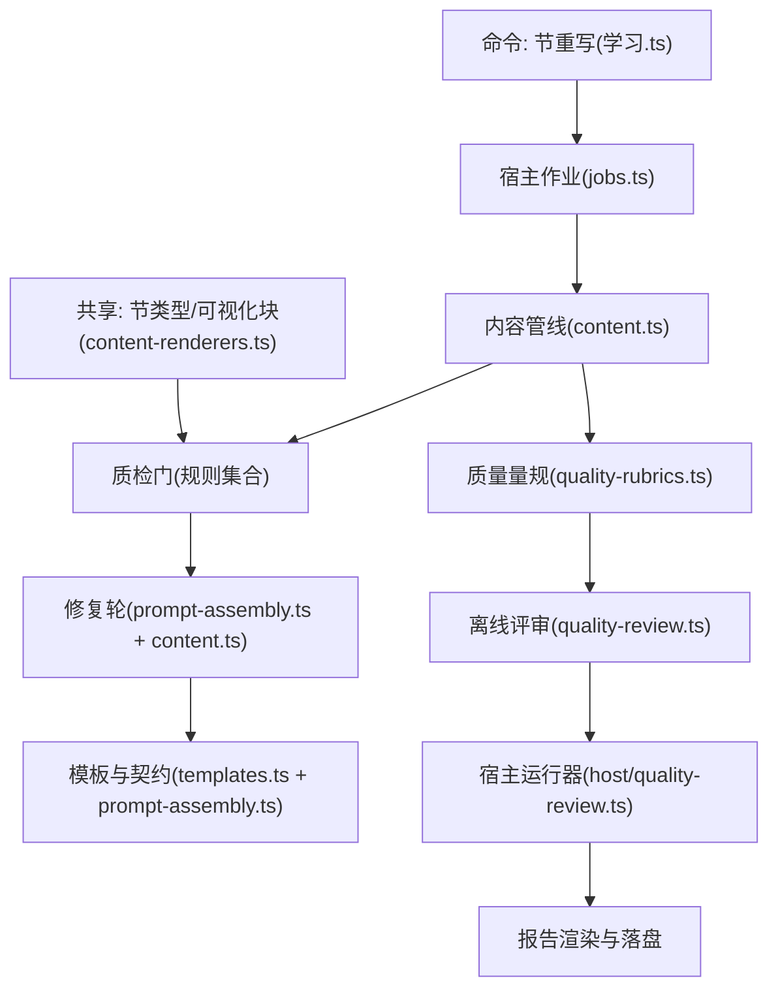
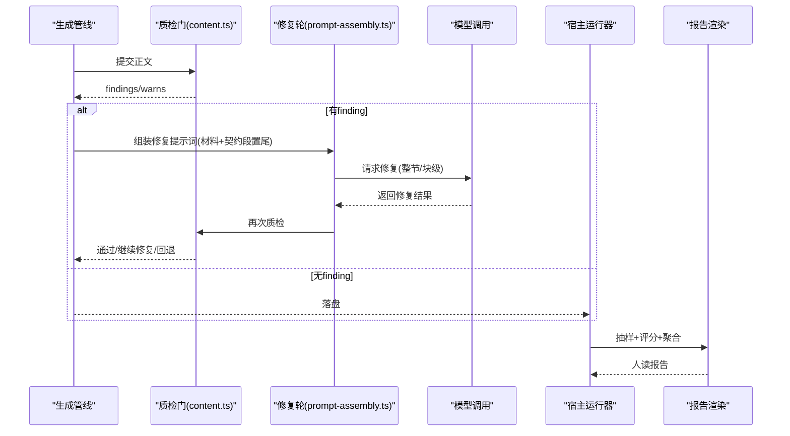
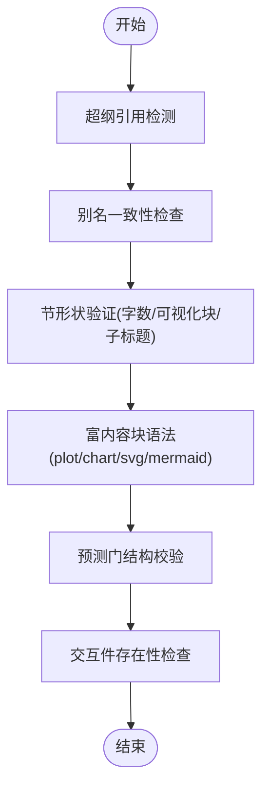
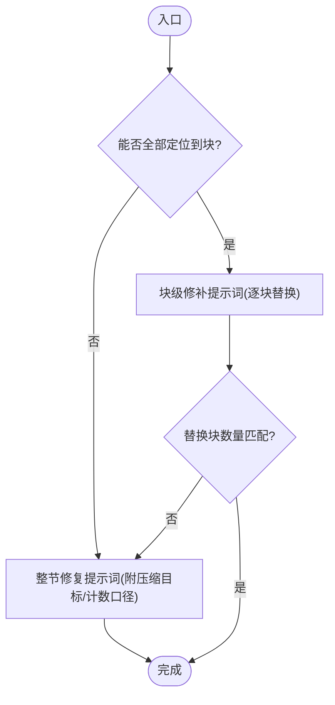
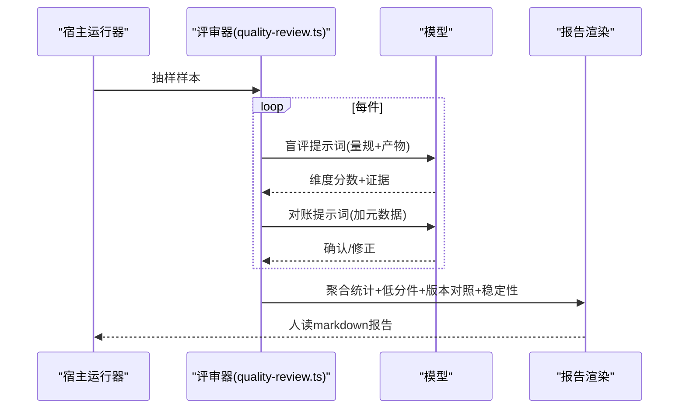
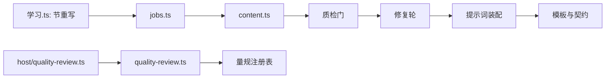

# 质检门系统

<cite>
**本文引用的文件**
- [content.ts](file://src/engine/content.ts)
- [quality-rubrics.ts](file://src/engine/quality-rubrics.ts)
- [quality-review.ts](file://src/engine/quality-review.ts)
- [quality-audit.ts](file://src/engine/quality-audit.ts)
- [prompt-assembly.ts](file://src/engine/prompt-assembly.ts)
- [templates.ts](file://src/engine/prompts/templates.ts)
- [quality-review.ts（宿主）](file://src/host/quality-review.ts)
- [handlers.ts（质量评审路由）](file://src/host/handlers.ts)
- [corpus.ts（语料解析）](file://src/host/corpus.ts)
- [index.ts（引擎门面）](file://src/engine/index.ts)
- [学习.ts（命令：节重写）](file://src/commands/学习.ts)
- [jobs.ts（节修复轮）](file://src/host/jobs.ts)
- [content-renderers.ts（节类型与可视化块语言）](file://shared/content-renderers.ts)
</cite>

## 目录
1. [简介](#简介)
2. [项目结构](#项目结构)
3. [核心组件](#核心组件)
4. [架构总览](#架构总览)
5. [详细组件分析](#详细组件分析)
6. [依赖关系分析](#依赖关系分析)
7. [性能考量](#性能考量)
8. [故障排查指南](#故障排查指南)
9. [结论](#结论)
10. [附录：使用示例与调试技巧](#附录使用示例与调试技巧)

## 简介
本系统为“质检门”提供从生成到落盘的全链路质量保障：在内容生成后，通过一系列可自动化的规则门（超纲引用、别名一致性、节形状、富内容块语法等）进行校验；对失败项采用“整节修复—块级局部修补—智能回退”的修复轮机制；配合提示词模板的版本化与动态能力注入，确保模型输出稳定可控；同时提供离线批量质量评审与报告，支持问题定位、严重程度分类与修复建议。

## 项目结构
质检门相关代码主要分布在引擎层（规则与评审）、宿主层（运行器与路由）、提示词与契约拼装、以及共享的节类型与渲染能力定义。



图表来源
- [content.ts:412-788](file://src/engine/content.ts#L412-L788)
- [prompt-assembly.ts:11-43](file://src/engine/prompt-assembly.ts#L11-L43)
- [templates.ts:17-602](file://src/engine/prompts/templates.ts#L17-L602)
- [quality-rubrics.ts:17-457](file://src/engine/quality-rubrics.ts#L17-L457)
- [quality-review.ts:1-593](file://src/engine/quality-review.ts#L1-L593)
- [quality-review.ts（宿主）:126-241](file://src/host/quality-review.ts#L126-L241)
- [学习.ts:526-544](file://src/commands/学习.ts#L526-L544)
- [jobs.ts:175-197](file://src/host/jobs.ts#L175-L197)
- [content-renderers.ts:66-85](file://shared/content-renderers.ts#L66-L85)

章节来源
- [content.ts:412-788](file://src/engine/content.ts#L412-L788)
- [prompt-assembly.ts:11-43](file://src/engine/prompt-assembly.ts#L11-L43)
- [templates.ts:17-602](file://src/engine/prompts/templates.ts#L17-L602)
- [quality-rubrics.ts:17-457](file://src/engine/quality-rubrics.ts#L17-L457)
- [quality-review.ts:1-593](file://src/engine/quality-review.ts#L1-L593)
- [quality-review.ts（宿主）:126-241](file://src/host/quality-review.ts#L126-L241)
- [学习.ts:526-544](file://src/commands/学习.ts#L526-L544)
- [jobs.ts:175-197](file://src/host/jobs.ts#L175-L197)
- [content-renderers.ts:66-85](file://shared/content-renderers.ts#L66-L85)

## 核心组件
- 质检门规则集：超纲引用检测、别名一致性检查、节形状验证、富内容块语法检查、交互件存在性检查、预测门结构校验等。
- 修复轮机制：整节修复（带压缩目标与计数口径）、块级局部修补（仅替换违规块）、智能回退（无法局部修补时退回整节）。
- 提示词模板管理：内置模板版本控制、用户自定义覆盖、动态能力注入（{{renderers}}），契约后置拼装保证“只输出 X”指令位于最终提示词末尾。
- 质量评审与报告：离线抽样、两段式防锚定评分、证据定位核对、低分件清单、模板版本对照、稳定性读数、系统性发现候选。
- 配置与扩展：量规注册表驱动评审维度；节类型与可视化块语言由共享模块统一维护；修复策略登记与行为锁约束调用次数。

章节来源
- [content.ts:412-788](file://src/engine/content.ts#L412-L788)
- [prompt-assembly.ts:11-43](file://src/engine/prompt-assembly.ts#L11-L43)
- [templates.ts:17-602](file://src/engine/prompts/templates.ts#L17-L602)
- [quality-rubrics.ts:17-457](file://src/engine/quality-rubrics.ts#L17-L457)
- [quality-review.ts:1-593](file://src/engine/quality-review.ts#L1-L593)
- [content-renderers.ts:66-85](file://shared/content-renderers.ts#L66-L85)

## 架构总览
质检门贯穿“生成→质检→修复→落盘→评审”的闭环。内容生成后进入质检门，若失败则触发修复轮；修复成功则落盘，否则回退或升级处理。离线评审基于生成语料抽样，按量规逐维度评分并产出人读报告。



图表来源
- [content.ts:636-788](file://src/engine/content.ts#L636-L788)
- [prompt-assembly.ts:21-43](file://src/engine/prompt-assembly.ts#L21-L43)
- [quality-review.ts:126-241](file://src/host/quality-review.ts#L126-L241)
- [quality-review.ts:180-261](file://src/engine/quality-review.ts#L180-L261)

## 详细组件分析

### 质检规则实现
- 超纲引用检测：扫描图内未学且深度大于当前节点的概念，命中即警告。
- 别名一致性：读取课程理念与规范中的别名表，出现不采用名即记录。
- 节形状验证：统计每节正文字数（剥离公式/代码/可视化块），超过预算×2拒收、×1.3警告；可视化块合计超限直接拒收；禁止 ### 子标题（破坏原子性）。
- 富内容块语法检查：plot/chart 必须为合法 JSON 对象（容忍尾随逗号/行注释），svg 必须以 <svg 开头；mermaid 节点文本含特殊字符需整体双引号包裹。
- 交互件存在性：interactive 引用文件不存在时报 finding。
- 预测门结构校验：learnhub-predict 块字段齐全、options 互异、answer ∈ options。



图表来源
- [content.ts:412-543](file://src/engine/content.ts#L412-L543)
- [content.ts:503-519](file://src/engine/content.ts#L503-L519)
- [content.ts:521-587](file://src/engine/content.ts#L521-L587)
- [content.ts:757-788](file://src/engine/content.ts#L757-L788)
- [content-renderers.ts:66-85](file://shared/content-renderers.ts#L66-L85)

章节来源
- [content.ts:412-788](file://src/engine/content.ts#L412-L788)
- [content-renderers.ts:66-85](file://shared/content-renderers.ts#L66-L85)

### 修复轮机制
- 整节修复：当 findings 包含“正文过长”时，修复提示词附带显式压缩目标与纯文字数口径；其他情况要求仅重写违规局部，其余原样保留。
- 块级局部修补：仅当所有 findings 都能定位到具体违规块（plot/chart/svg/learnhub-predict 第 N 块）时，生成“逐块替换”的提示词；应用修补时按原文精确匹配替换。
- 智能回退：若存在非块级 finding 或替换块数量不匹配，放弃局部修补，退回整节修复。



图表来源
- [content.ts:636-736](file://src/engine/content.ts#L636-L736)
- [prompt-assembly.ts:31-43](file://src/engine/prompt-assembly.ts#L31-L43)

章节来源
- [content.ts:636-736](file://src/engine/content.ts#L636-L736)
- [prompt-assembly.ts:31-43](file://src/engine/prompt-assembly.ts#L31-L43)

### 提示词模板管理系统
- 内置模板版本控制：模板首行携带版本标记（如 v11），加载时若 vault 中旧模板版本低于内置版本，自动备份并覆盖升级。
- 用户自定义模板：vault 快照下同名 .md 优先；未知类型需用户自建。
- 动态能力注入：模板中的 {{renderers}} 占位符在运行时替换为渲染能力清单；缺失占位符时在末尾追加注入段。
- 契约后置拼装：所有最终提示词经 withContractLast 将“输出契约段”置于末尾，避免“中间丢失”问题；修复轮也遵循同一模式。

```mermaid
classDiagram
class Content {
+loadPrompt(kind) string
+withContractLast(tpl, materials) string
+promptVersionOf(text) number
}
class PromptAssembly {
+splitContractSection(tpl) {head, contract}
+withContractLast(tpl, materials) string
+repairRoundPrompt(tpl, materials, headline, previous, errors) string
}
class Templates {
+TEMPLATES Record<string,string>
}
Content --> PromptAssembly : "使用"
Content --> Templates : "读取内置模板"
```

图表来源
- [content.ts:327-378](file://src/engine/content.ts#L327-L378)
- [prompt-assembly.ts:11-43](file://src/engine/prompt-assembly.ts#L11-L43)
- [templates.ts:17-602](file://src/engine/prompts/templates.ts#L17-L602)

章节来源
- [content.ts:327-378](file://src/engine/content.ts#L327-L378)
- [prompt-assembly.ts:11-43](file://src/engine/prompt-assembly.ts#L11-L43)
- [templates.ts:17-602](file://src/engine/prompts/templates.ts#L17-L602)

### 质量报告生成与分析
- 抽样策略：失败/容忍件定额优先，成功件等距补充；确定性无随机数。
- 两段式防锚定评分：一期盲评（仅量规+产物原文），二期对账（加入生成提示词与元数据），允许修正并记录 revised。
- 证据定位核对：评审员引用的原文必须在产物中可定位，找不到记 unlocated 并在报告显式列出。
- 聚合读数：逐站×维度分布、低分件清单、模板版本对照视图、重复评审稳定性读数。
- 系统性发现候选：某站某维度低分率越过预注册线（≥2 件已判档且 ≥50%）即入候选，带低分件引用与判据出处供人审。



图表来源
- [quality-review.ts:126-241](file://src/host/quality-review.ts#L126-L241)
- [quality-review.ts:180-261](file://src/engine/quality-review.ts#L180-L261)
- [quality-review.ts:412-593](file://src/engine/quality-review.ts#L412-L593)
- [quality-audit.ts:80-124](file://src/engine/quality-audit.ts#L80-L124)

章节来源
- [quality-review.ts:1-593](file://src/engine/quality-review.ts#L1-L593)
- [quality-audit.ts:1-124](file://src/engine/quality-audit.ts#L1-L124)
- [quality-review.ts（宿主）:126-241](file://src/host/quality-review.ts#L126-L241)

### 质检配置与自定义规则
- 量规注册表：五类产物（大纲/节正文/题目/教练回合/种子·终点）的量规集中定义，评审器消费该表生成提示词与人审对表。
- 节类型与可视化块：共享模块定义节类型菜单与可视化块语言集合，作为质检门阈值与计数依据。
- 修复策略登记：通过注册表声明各站的修复轮机制与调用次数，行为锁约束实际调用数，防止漂移。

章节来源
- [quality-rubrics.ts:17-457](file://src/engine/quality-rubrics.ts#L17-L457)
- [content-renderers.ts:66-85](file://shared/content-renderers.ts#L66-L85)
- [index.ts:102-127](file://src/engine/index.ts#L102-L127)

## 依赖关系分析
- 内容管线依赖质检门规则与修复轮；修复轮依赖提示词装配；提示词装配依赖模板与契约后置逻辑。
- 质量评审依赖量规注册表与提示词模板版本；宿主运行器负责语料读取与报告落盘。
- 命令“节重写”通过宿主作业触发内容管线的单节重写流程。



图表来源
- [content.ts:412-788](file://src/engine/content.ts#L412-L788)
- [prompt-assembly.ts:11-43](file://src/engine/prompt-assembly.ts#L11-L43)
- [templates.ts:17-602](file://src/engine/prompts/templates.ts#L17-L602)
- [quality-review.ts:1-593](file://src/engine/quality-review.ts#L1-L593)
- [quality-review.ts（宿主）:126-241](file://src/host/quality-review.ts#L126-L241)
- [学习.ts:526-544](file://src/commands/学习.ts#L526-L544)
- [jobs.ts:175-197](file://src/host/jobs.ts#L175-L197)

章节来源
- [content.ts:412-788](file://src/engine/content.ts#L412-L788)
- [prompt-assembly.ts:11-43](file://src/engine/prompt-assembly.ts#L11-L43)
- [templates.ts:17-602](file://src/engine/prompts/templates.ts#L17-L602)
- [quality-review.ts:1-593](file://src/engine/quality-review.ts#L1-L593)
- [quality-review.ts（宿主）:126-241](file://src/host/quality-review.ts#L126-L241)
- [学习.ts:526-544](file://src/commands/学习.ts#L526-L544)
- [jobs.ts:175-197](file://src/host/jobs.ts#L175-L197)

## 性能考量
- 质检门计算为轻量正则与字符串处理，开销极低；富内容块解析仅在必要时执行。
- 修复轮调用次数受修复策略登记与行为锁约束，避免无限循环。
- 离线评审温度固定为 0，保证可复算；重复评审用于稳定性观测而非提升效率。
- 语料捕获环形封顶（ok 25/bad 200），控制磁盘占用。

[本节为通用指导，无需特定文件来源]

## 故障排查指南
- 富内容块降级：plot/chart 非合法 JSON 或 svg 不以 <svg 开头会导致面板降级为源码显示；使用 fixRichBlocks 尝试自动清洗，仍失败则回灌模型定向修复。
- mermaid 渲染降级：节点文本含 | 等特殊字符未整体双引号包裹会降级；系统自动补引号，若仍异常需人工修正。
- 交互件缺失：interactive 引用文件不存在会报 finding；需检查路径与落盘逻辑。
- 预测门非法：字段不全或 answer 不在 options 中会被拒收；按定位信息修正块内容。
- 别名不一致：出现不采用名将被替换；若误报，检查课程理念与规范 §8 别名表。

章节来源
- [content.ts:521-587](file://src/engine/content.ts#L521-L587)
- [content.ts:757-788](file://src/engine/content.ts#L757-L788)

## 结论
质检门系统通过严格的规则门、灵活的修复轮、稳定的提示词管理与可复算的质量评审，构建了内容生成的质量闭环。其设计强调“判定标准先于判定器”、“人读报告先行”与“分层法庭”，确保 AI 评分仅为提议，人审为终审，学习者结果法院各司其职。未来可通过扩展量规与细化修复策略进一步提升质量与效率。

[本节为总结，无需特定文件来源]

## 附录：使用示例与调试技巧
- 单节重写：通过命令“section-rewrite”指定课程、节点与节 id，走与面板相同的 gated pipeline，一次失败触发一轮修复。
- 质量评审：调用 POST /learnhub/api/quality-review，设置 badQuota/okQuota/repeats/stations/systemic 等参数，获取人读报告。
- 调试技巧：
  - 查看语料文件：state/生成语料/<站>/<文件名>，frontmatter 含 outcome/code/truncated 等元数据。
  - 检查模板版本：模板首行 <!-- learnhub:prompt/vN -->，加载时自动升级旧版本。
  - 定位富内容块错误：使用 visualBlockExcerpt 与 locateFinding 获取违规块首行摘录与定位信息。
  - 观察修复轮行为：blockPatchPlan 与 applyBlockPatch 决定是否局部修补及替换是否成功。

章节来源
- [学习.ts:526-544](file://src/commands/学习.ts#L526-L544)
- [handlers.ts（质量评审路由）:220-235](file://src/host/handlers.ts#L220-L235)
- [corpus.ts（语料解析）:104-117](file://src/host/corpus.ts#L104-L117)
- [content.ts:615-634](file://src/engine/content.ts#L615-L634)
- [content.ts:670-736](file://src/engine/content.ts#L670-L736)