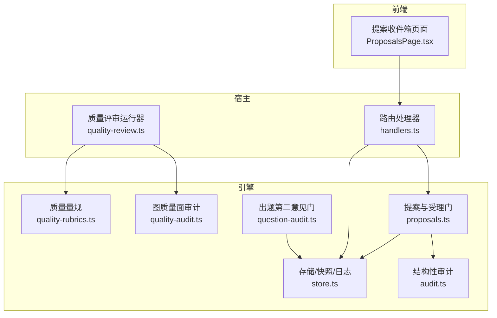
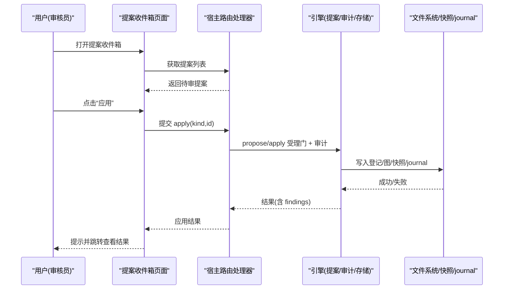
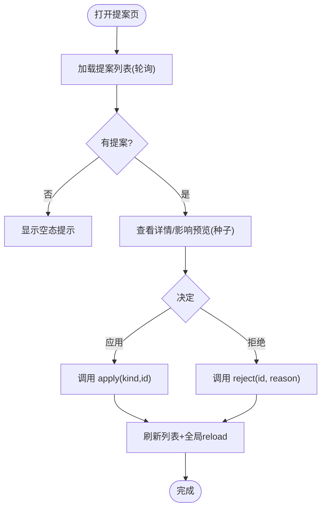
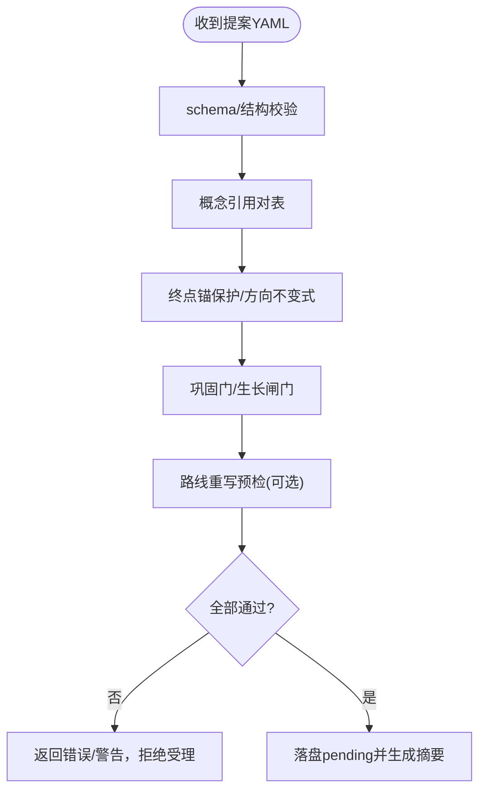
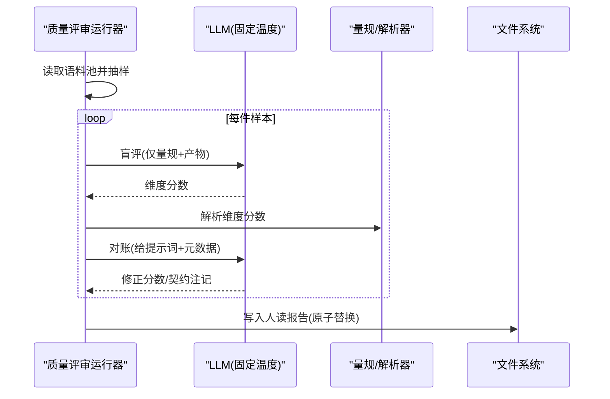
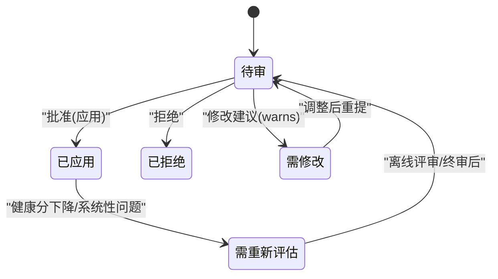
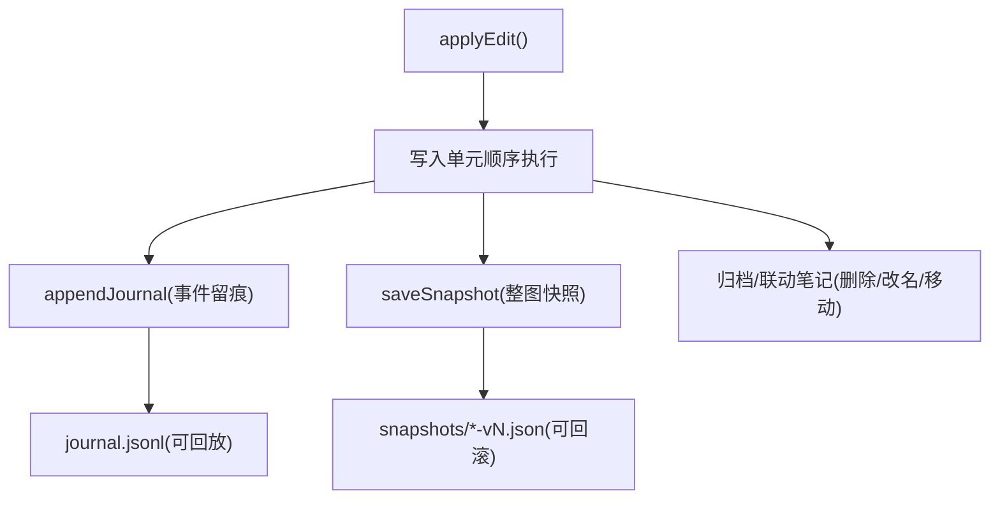
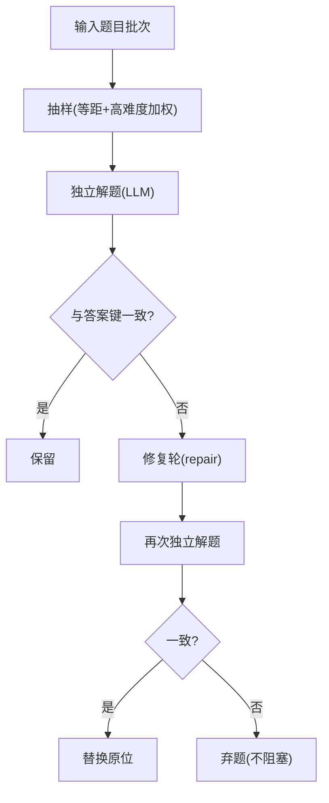
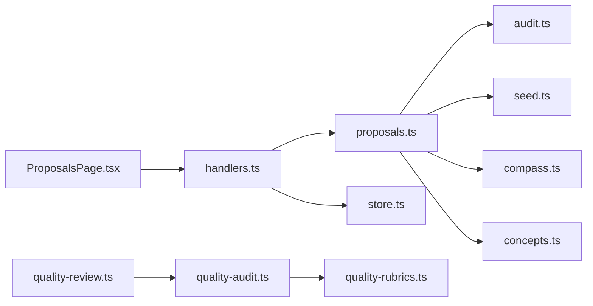

# 人工审核流程

<cite>
**本文引用的文件**
- [proposals.ts](file://src/engine/proposals.ts)
- [quality-audit.ts](file://src/engine/quality-audit.ts)
- [question-audit.ts](file://src/engine/question-audit.ts)
- [audit.ts](file://src/engine/audit.ts)
- [store.ts](file://src/engine/store.ts)
- [quality-review.ts](file://src/host/quality-review.ts)
- [ProposalsPage.tsx](file://ui/src/pages/ProposalsPage.tsx)
- [0003-anchor-review-instead-of-per-batch-human-review.md](file://docs/adr/0003-anchor-review-instead-of-per-batch-human-review.md)
- [handlers.ts](file://src/host/handlers.ts)
- [quality-rubrics.ts](file://src/engine/quality-rubrics.ts)
</cite>

## 目录
1. [简介](#简介)
2. [项目结构](#项目结构)
3. [核心组件](#核心组件)
4. [架构总览](#架构总览)
5. [详细组件分析](#详细组件分析)
6. [依赖关系分析](#依赖关系分析)
7. [性能与可观测性](#性能与可观测性)
8. [故障排查指南](#故障排查指南)
9. [结论](#结论)
10. [附录](#附录)

## 简介
本文件面向“人工审核”这一关键工作流，系统性说明审核界面的设计与交互、提案展示与证据查看、决策支持工具、审核决策类型与含义、版本控制集成（变更追踪、回滚支持、审计日志），以及最佳实践、团队协作与质量评估指标。该流程围绕“提案—受理门—人审—应用/拒绝—审计留痕”的闭环展开，确保内容变更安全可控、可回溯、可度量。

## 项目结构
审核相关能力横跨引擎层（受理门、审计、存储）、宿主层（离线评审运行器、路由处理）与前端（提案收件箱页面）。整体组织如下：
- 引擎层
  - 提案生命周期与受理门：proposals.ts
  - 图质量面审计：quality-audit.ts
  - 出题第二意见门：question-audit.ts
  - 结构性审计：audit.ts
  - 存储与快照：store.ts
  - 质量量规：quality-rubrics.ts
- 宿主层
  - 离线批量评审运行器：quality-review.ts
  - 路由处理器（含质量评审接口）：handlers.ts
- 前端
  - 提案收件箱与人审界面：ProposalsPage.tsx

**图表来源**
- [ProposalsPage.tsx:1-202](file://ui/src/pages/ProposalsPage.tsx#L1-L202)
- [quality-review.ts:124-241](file://src/host/quality-review.ts#L124-L241)
- [handlers.ts:218-235](file://src/host/handlers.ts#L218-L235)
- [proposals.ts:1-800](file://src/engine/proposals.ts#L1-L800)
- [quality-audit.ts:1-124](file://src/engine/quality-audit.ts#L1-L124)
- [question-audit.ts:1-280](file://src/engine/question-audit.ts#L1-L280)
- [audit.ts:1-324](file://src/engine/audit.ts#L1-L324)
- [store.ts:1-479](file://src/engine/store.ts#L1-L479)
- [quality-rubrics.ts:18-456](file://src/engine/quality-rubrics.ts#L18-L456)

**章节来源**
- [ProposalsPage.tsx:1-202](file://ui/src/pages/ProposalsPage.tsx#L1-L202)
- [quality-review.ts:124-241](file://src/host/quality-review.ts#L124-L241)
- [handlers.ts:218-235](file://src/host/handlers.ts#L218-L235)
- [proposals.ts:1-800](file://src/engine/proposals.ts#L1-L800)
- [quality-audit.ts:1-124](file://src/engine/quality-audit.ts#L1-L124)
- [question-audit.ts:1-280](file://src/engine/question-audit.ts#L1-L280)
- [audit.ts:1-324](file://src/engine/audit.ts#L1-L324)
- [store.ts:1-479](file://src/engine/store.ts#L1-L479)
- [quality-rubrics.ts:18-456](file://src/engine/quality-rubrics.ts#L18-L456)

## 核心组件
- 提案与受理门：负责编辑/种子/富化等提案的 schema 校验、概念引用对表、终点锚保护、巩固门、生长闸门、路线重写预检，最终落盘 pending 并生成摘要供人审。
- 图质量面审计：定义两类审计轴（教练回合裁决质量、种子·终点资格），产出系统性发现候选与报告声明行，辅助人审聚焦系统性问题。
- 出题第二意见门：在生成时抽样独立解题并对账答案键，不一致则触发修复轮或弃题，避免错误题目进入学习者。
- 结构性审计：扫描图结构、课程文件与 frontmatter、enc 边一致性、健康分基线等，输出 ERROR/WARN/INFO 并写报告。
- 存储与快照：提案清单、journal 日志、practice/review-log、快照序列，提供原子写入与幂等重建能力。
- 质量评审运行器：从语料站抽样，按量规两段式评分，输出人读报告；温度固定以保证稳定性。
- 质量量规：定义维度、判据、证据要求与出处，作为 AI 评分与人审对表的共识标准。

**章节来源**
- [proposals.ts:1-800](file://src/engine/proposals.ts#L1-L800)
- [quality-audit.ts:1-124](file://src/engine/quality-audit.ts#L1-L124)
- [question-audit.ts:1-280](file://src/engine/question-audit.ts#L1-L280)
- [audit.ts:1-324](file://src/engine/audit.ts#L1-L324)
- [store.ts:1-479](file://src/engine/store.ts#L1-L479)
- [quality-review.ts:124-241](file://src/host/quality-review.ts#L124-L241)
- [quality-rubrics.ts:18-456](file://src/engine/quality-rubrics.ts#L18-L456)

## 架构总览
审核流程的关键路径包括：
- 前端展示待审提案，支持刷新、查看影响预览、应用/拒绝操作。
- 后端受理门执行多重校验与审计，必要时阻断写入。
- 应用阶段通过写入单元顺序落盘（登记表→图区→锚维护→笔记联动→罗盘重写→边实验账本→快照→journal），失败不续跑、不回滚。
- 离线质量评审独立于生产管线，抽样、评分、报告落盘，用于持续改进。

**图表来源**
- [ProposalsPage.tsx:99-162](file://ui/src/pages/ProposalsPage.tsx#L99-L162)
- [handlers.ts:218-235](file://src/host/handlers.ts#L218-L235)
- [proposals.ts:686-800](file://src/engine/proposals.ts#L686-L800)
- [store.ts:213-293](file://src/engine/store.ts#L213-L293)

**章节来源**
- [ProposalsPage.tsx:99-162](file://ui/src/pages/ProposalsPage.tsx#L99-L162)
- [handlers.ts:218-235](file://src/host/handlers.ts#L218-L235)
- [proposals.ts:686-800](file://src/engine/proposals.ts#L686-L800)
- [store.ts:213-293](file://src/engine/store.ts#L213-L293)

## 详细组件分析

### 审核界面与交互流程（提案收件箱）
- 列表常驻新鲜：8 秒轮询 + 手动刷新，确保起草完成后及时出现。
- 提案类型标签：种子/编辑/富化/项目计划/里程碑/实验等，便于快速识别。
- 影响预览：种子提案应用前可预览新建节点、覆盖风险、罗盘脚手架行为，知情确认后再应用。
- 操作闭环：应用成功后全局刷新，并按类型分流到对应视图（图/题库/项目/洞察）。
- 拒绝留痕：拒绝同样记录状态与原因，保证可追溯。

**图表来源**
- [ProposalsPage.tsx:71-162](file://ui/src/pages/ProposalsPage.tsx#L71-L162)

**章节来源**
- [ProposalsPage.tsx:1-202](file://ui/src/pages/ProposalsPage.tsx#L1-L202)

### 提案受理门与决策支持
- Schema 与结构检查：严格校验字段、枚举、必填项，未知键拒收。
- 概念引用对表：teaches/assumes/误解必须命中登记表或铸名块，撞名拒收。
- 终点锚保护：禁止直改锚定终点；主线批含新节点时必须声明朝向并接线覆盖。
- 巩固门：operator=巩固 的 add_node 只引已教概念。
- 生长闸门：插入/旁支调速，三率超限或复诊通过率触底时拒绝受理。
- 路线重写预检：锚在终点上、非空/限长等规则，失败不落盘。
- 决策支持：受理门返回 warns（如窄节点提示），applyFindings 汇总健康分提示，辅助审核员判断。

**图表来源**
- [proposals.ts:126-341](file://src/engine/proposals.ts#L126-L341)
- [proposals.ts:559-613](file://src/engine/proposals.ts#L559-L613)
- [proposals.ts:615-680](file://src/engine/proposals.ts#L615-L680)
- [proposals.ts:392-402](file://src/engine/proposals.ts#L392-L402)

**章节来源**
- [proposals.ts:126-341](file://src/engine/proposals.ts#L126-L341)
- [proposals.ts:559-613](file://src/engine/proposals.ts#L559-L613)
- [proposals.ts:615-680](file://src/engine/proposals.ts#L615-L680)
- [proposals.ts:392-402](file://src/engine/proposals.ts#L392-L402)

### 证据查看与质量评审
- 离线批量评审：从语料站抽样，按量规两段式评分（盲评→对账），温度固定保证稳定性。
- 报告可读：每维分数附证据引用，低分件清单带语料文件锚与原文定位；未定位显式列出。
- 审计面声明：报告开头声明本轮审了什么、没审什么，防“跑过一轮”被误读为全面覆盖。
- 系统性候选：逐站×维度计算低分率，越线即入候选，供人审蒸馏为新票或改量规。

**图表来源**
- [quality-review.ts:124-241](file://src/host/quality-review.ts#L124-L241)
- [quality-audit.ts:80-94](file://src/engine/quality-audit.ts#L80-L94)
- [quality-audit.ts:100-120](file://src/engine/quality-audit.ts#L100-L120)

**章节来源**
- [quality-review.ts:124-241](file://src/host/quality-review.ts#L124-L241)
- [quality-audit.ts:80-94](file://src/engine/quality-audit.ts#L80-L94)
- [quality-audit.ts:100-120](file://src/engine/quality-audit.ts#L100-L120)

### 审核决策类型与含义
- 批准（应用）：通过受理门与审计后，将变更应用到图与笔记，写入 journal 与快照。
- 拒绝：明确拒绝并留痕，保持原图稳定；可重提。
- 修改建议：受理门返回 warns（如窄节点、健康分偏低），审核员据此要求调整。
- 重新评估：当系统检测到系统性低分或健康分下降时，触发离线评审或全图终审。

**图表来源**
- [proposals.ts:392-402](file://src/engine/proposals.ts#L392-L402)
- [quality-audit.ts:100-120](file://src/engine/quality-audit.ts#L100-L120)
- [quality-review.ts:212-241](file://src/host/quality-review.ts#L212-L241)

**章节来源**
- [proposals.ts:392-402](file://src/engine/proposals.ts#L392-L402)
- [quality-audit.ts:100-120](file://src/engine/quality-audit.ts#L100-L120)
- [quality-review.ts:212-241](file://src/host/quality-review.ts#L212-L241)

### 版本控制集成机制（变更追踪、回滚支持、审计日志）
- 变更追踪：journal.jsonl 记录每次 graph_edit 等事件，附带 session（提案 id）、时间戳、详情。
- 快照支持：state/snapshots/<课程>-v<N>.json 保存整图文档序列，支持回滚到历史版本。
- 原子写入：所有关键写操作采用临时文件 + rename 原子替换，避免半写状态。
- 归档与清理：删除节点联动正文归档（del-<pid>- 前缀），保持可追溯。
- 审计日志：结构性审计输出报告至 state/reportPath，ERROR 阻断、WARN 需裁决。

**图表来源**
- [proposals.ts:764-800](file://src/engine/proposals.ts#L764-L800)
- [store.ts:51-64](file://src/engine/store.ts#L51-L64)
- [store.ts:280-293](file://src/engine/store.ts#L280-L293)
- [audit.ts:286-314](file://src/engine/audit.ts#L286-L314)

**章节来源**
- [proposals.ts:764-800](file://src/engine/proposals.ts#L764-L800)
- [store.ts:51-64](file://src/engine/store.ts#L51-L64)
- [store.ts:280-293](file://src/engine/store.ts#L280-L293)
- [audit.ts:286-314](file://src/engine/audit.ts#L286-L314)

### 出题第二意见门（证据与对账）
- 抽样策略：等距抽样，高难度档恒入样，成本可控。
- 独立解题：只看题面与选项，零答案键；解析应答并与答案键确定性比较。
- 修复轮：不一致则触发 repair 形态，修复后再审计；仍不一致弃题，不阻塞整批。
- 报告面：统计 eligible/sampled/inconsistent/repaired/discarded/unresolved/solverCalls，透明可见。

**图表来源**
- [question-audit.ts:95-108](file://src/engine/question-audit.ts#L95-L108)
- [question-audit.ts:168-279](file://src/engine/question-audit.ts#L168-L279)

**章节来源**
- [question-audit.ts:95-108](file://src/engine/question-audit.ts#L95-L108)
- [question-audit.ts:168-279](file://src/engine/question-audit.ts#L168-L279)

### 最佳实践与团队协作指南
- 分层法庭：AI 评分为提议，人审为终审；结果法院（复诊、申诉、勘误）各守其领域，不与评分混同。
- 门红先裁决：任何判据修订必须登记并自检，禁止静默放宽。
- 证据优先：每条分数必须附证据引用与定位，无法定位显式记录。
- 最小改动：优先小步推进，配合生长闸门与健康分基线提示，降低风险。
- 协作规范：使用统一量规与术语；提案摘要清晰表达意图与理由；拒绝/修改建议需写明依据。

**章节来源**
- [quality-rubrics.ts:18-25](file://src/engine/quality-rubrics.ts#L18-L25)
- [quality-review.ts:12-18](file://src/host/quality-review.ts#L12-L18)
- [0003-anchor-review-instead-of-per-batch-human-review.md:1-6](file://docs/adr/0003-anchor-review-instead-of-per-batch-human-review.md#L1-L6)

### 审核质量评估指标与反馈收集
- 质量评审报告指标：采样配额、重复次数、模板版本对照、稳定性读数、成本（调用次数/Token）。
- 图质量面审计指标：审计面声明、低分率阈值、系统性候选数量与引用。
- 结构性审计指标：ERROR/WARN/INFO 计数、健康分基线、连通分量/深度异常等。
- 反馈收集：reject 原因、accept 后的效果观察（健康分变化、学习行为）、离线评审漂移信号（温度固定下的波动）。

**章节来源**
- [quality-review.ts:212-241](file://src/host/quality-review.ts#L212-L241)
- [quality-audit.ts:80-120](file://src/engine/quality-audit.ts#L80-L120)
- [audit.ts:266-314](file://src/engine/audit.ts#L266-L314)

## 依赖关系分析
- 前端依赖宿主路由与 API，宿主路由调用引擎模块。
- 引擎模块之间职责清晰：proposals 依赖 audit、seed、compass、concepts；quality-review 依赖 quality-audit、quality-rubrics；store 提供持久化。
- 外部依赖：LLM 仅在宿主上下文可用；文件系统通过 VaultFs 抽象。

**图表来源**
- [ProposalsPage.tsx:1-202](file://ui/src/pages/ProposalsPage.tsx#L1-L202)
- [handlers.ts:218-235](file://src/host/handlers.ts#L218-L235)
- [proposals.ts:1-800](file://src/engine/proposals.ts#L1-L800)
- [quality-review.ts:124-241](file://src/host/quality-review.ts#L124-L241)
- [quality-audit.ts:1-124](file://src/engine/quality-audit.ts#L1-L124)
- [quality-rubrics.ts:18-456](file://src/engine/quality-rubrics.ts#L18-L456)

**章节来源**
- [ProposalsPage.tsx:1-202](file://ui/src/pages/ProposalsPage.tsx#L1-L202)
- [handlers.ts:218-235](file://src/host/handlers.ts#L218-L235)
- [proposals.ts:1-800](file://src/engine/proposals.ts#L1-L800)
- [quality-review.ts:124-241](file://src/host/quality-review.ts#L124-L241)
- [quality-audit.ts:1-124](file://src/engine/quality-audit.ts#L1-L124)
- [quality-rubrics.ts:18-456](file://src/engine/quality-rubrics.ts#L18-L456)

## 性能与可观测性
- 性能特征：
  - 受理门与 apply 走内存模拟与写入单元，失败不续跑，避免部分生效。
  - 离线评审同步阻塞，适合定时任务；温度固定提升稳定性。
  - 出题第二意见门抽样降低成本，修复轮仅对不一致题。
- 可观测性：
  - journal 记录每次变更，支持回放与审计。
  - 快照序列支持回滚与对比。
  - 质量评审报告包含成本与稳定性读数，便于监控模型漂移。

[本节为通用指导，无需特定文件来源]

## 故障排查指南
- 受理门报错：检查 schema、概念引用、终点锚保护、巩固门、生长闸门、路线重写预检的错误信息。
- 应用失败：确认审计是否存在 ERROR；查看健康分基线与 warnings；必要时拒绝并重提。
- 离线评审失败：检查语料目录是否包含有量规的站；确认 llm 上下文可用；查看 unscoreable 与 failure 字段。
- 快照与日志：核对 journal 条目与快照版本；确认原子写入成功；检查归档区是否有 del-<pid> 文件。

**章节来源**
- [proposals.ts:559-613](file://src/engine/proposals.ts#L559-L613)
- [proposals.ts:686-733](file://src/engine/proposals.ts#L686-L733)
- [quality-review.ts:131-148](file://src/host/quality-review.ts#L131-L148)
- [store.ts:172-206](file://src/engine/store.ts#L172-L206)

## 结论
本审核流程以“提案—受理门—人审—应用/拒绝—审计留痕”为核心，结合离线质量评审与结构性审计，形成安全、可回溯、可度量的内容治理体系。通过严格的门控、清晰的证据链与版本控制集成，既保障质量又提升效率。建议团队遵循量规与术语、重视证据引用、小步快跑并结合健康分基线提示，持续提升审核质量与协作效率。

[本节为总结，无需特定文件来源]

## 附录
- 术语说明：
  - 量规：判定标准集合，含维度、判据、证据要求与出处。
  - 审计面：本轮抽样覆盖的站点与维度声明，防误读。
  - 系统性候选：低分率越线的站×维度组合，需人审裁决。
- 参考 ADR：批次提案自动 apply，人审锚点收敛至骨架与交付两锚，机械门禁接管批质量。

**章节来源**
- [quality-rubrics.ts:18-25](file://src/engine/quality-rubrics.ts#L18-L25)
- [quality-audit.ts:80-94](file://src/engine/quality-audit.ts#L80-L94)
- [0003-anchor-review-instead-of-per-batch-human-review.md:1-6](file://docs/adr/0003-anchor-review-instead-of-per-batch-human-review.md#L1-L6)