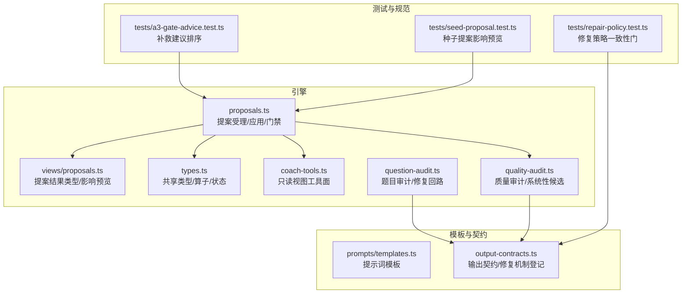
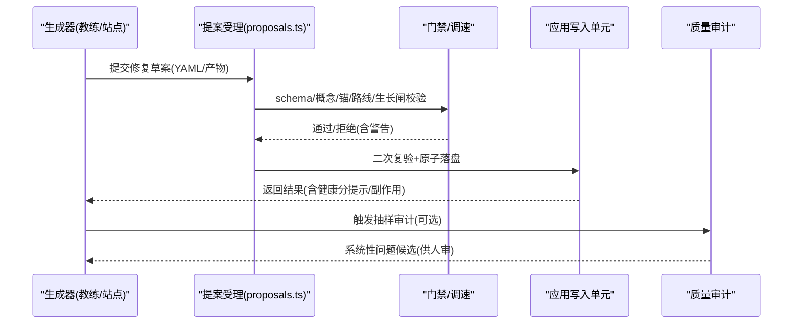
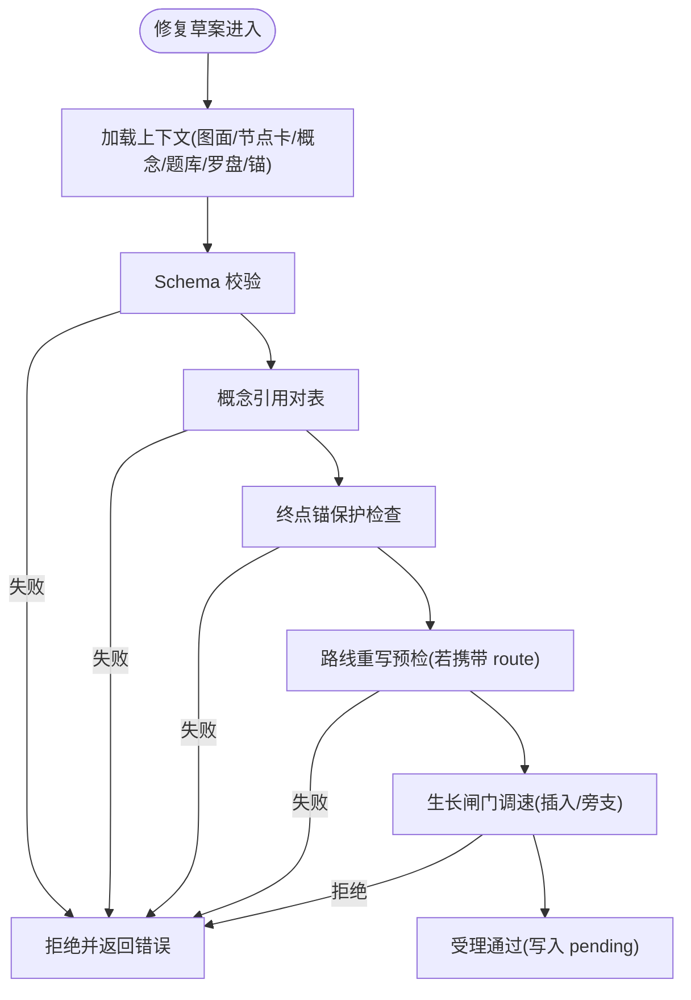
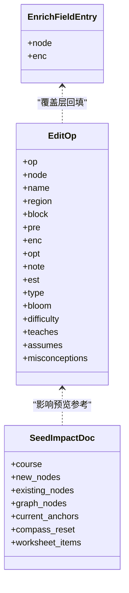
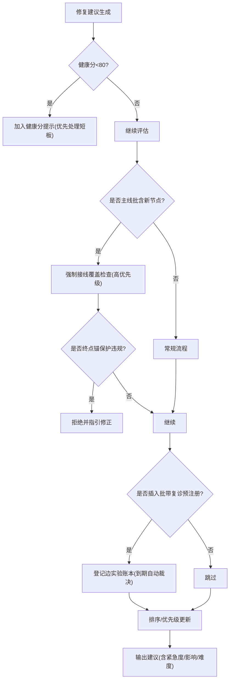
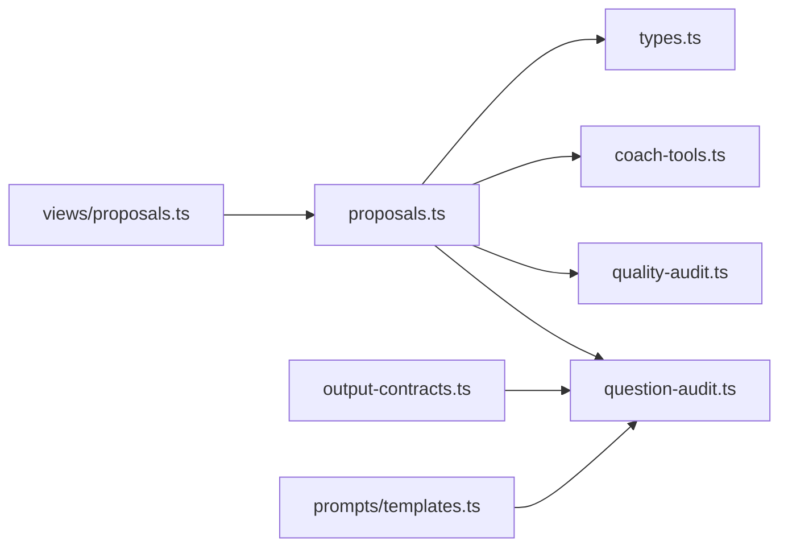

# 修复建议生成

<cite>
**本文引用的文件**
- [src/engine/proposals.ts](file://src/engine/proposals.ts)
- [src/engine/views/proposals.ts](file://src/engine/views/proposals.ts)
- [src/engine/types.ts](file://src/engine/types.ts)
- [src/engine/coach-tools.ts](file://src/engine/coach-tools.ts)
- [src/engine/quality-audit.ts](file://src/engine/quality-audit.ts)
- [src/engine/question-audit.ts](file://src/engine/question-audit.ts)
- [src/engine/prompts/templates.ts](file://src/engine/prompts/templates.ts)
- [src/engine/output-contracts.ts](file://src/engine/output-contracts.ts)
- [tests/repair-policy.test.ts](file://tests/repair-policy.test.ts)
- [tests/a3-gate-advice.test.ts](file://tests/a3-gate-advice.test.ts)
- [tests/seed-proposal.test.ts](file://tests/seed-proposal.test.ts)
- [docs/adr/0054-section-overflow-repair-ladder.md](file://docs/adr/0054-section-overflow-repair-ladder.md)
- [docs/adr/0065-prompt-contract-last-assembly.md](file://docs/adr/0065-prompt-contract-last-assembly.md)
</cite>

## 目录
1. [引言](#引言)
2. [项目结构](#项目结构)
3. [核心组件](#核心组件)
4. [架构总览](#架构总览)
5. [详细组件分析](#详细组件分析)
6. [依赖关系分析](#依赖关系分析)
7. [性能与可扩展性](#性能与可扩展性)
8. [故障排查指南](#故障排查指南)
9. [结论](#结论)
10. [附录：模板与扩展方法](#附录模板与扩展方法)

## 引言
本文件系统性阐述“修复建议生成”的机制与实现，覆盖上下文感知修复、最佳实践推荐、智能修复策略、提案结构化表示（变更类型、影响分析、风险评估）、排序与优先级机制（紧急程度、影响范围、实现难度）、模板库与自定义规则扩展、以及验证与效果预测。文档以代码级事实为依据，配合图示说明数据流与控制流，帮助读者从高层到细节全面理解系统如何自动生成并治理修复建议。

## 项目结构
围绕修复建议生成的关键模块分布在引擎层与视图层：
- 提案生命周期与门禁：编辑/种子/富化三类提案的受理、校验、应用与审计闭环
- 教练工具面：为修复决策提供只读视图证据（图面、节点卡、概念登记、题库概况、罗盘、终点锚）
- 质量审计：对修复轮行为进行抽样审计与系统性问题候选发现
- 题目审计与修复：针对题目的独立修复回路（如第二意见解题、转义损坏修复等）
- 提示词与输出契约：修复模板与机器可判契约，确保修复产物稳定可解析

图表来源
- [src/engine/proposals.ts:556-908](file://src/engine/proposals.ts#L556-L908)
- [src/engine/views/proposals.ts:7-58](file://src/engine/views/proposals.ts#L7-L58)
- [src/engine/types.ts:237-241](file://src/engine/types.ts#L237-L241)
- [src/engine/coach-tools.ts:30-35](file://src/engine/coach-tools.ts#L30-L35)
- [src/engine/quality-audit.ts:50-74](file://src/engine/quality-audit.ts#L50-L74)
- [src/engine/question-audit.ts:16-42](file://src/engine/question-audit.ts#L16-L42)
- [tests/repair-policy.test.ts:1-21](file://tests/repair-policy.test.ts#L1-L21)
- [tests/a3-gate-advice.test.ts:69-92](file://tests/a3-gate-advice.test.ts#L69-L92)
- [tests/seed-proposal.test.ts:574-640](file://tests/seed-proposal.test.ts#L574-L640)

章节来源
- [src/engine/proposals.ts:556-908](file://src/engine/proposals.ts#L556-L908)
- [src/engine/views/proposals.ts:7-58](file://src/engine/views/proposals.ts#L7-L58)
- [src/engine/types.ts:237-241](file://src/engine/types.ts#L237-L241)
- [src/engine/coach-tools.ts:30-35](file://src/engine/coach-tools.ts#L30-L35)
- [src/engine/quality-audit.ts:50-74](file://src/engine/quality-audit.ts#L50-L74)
- [src/engine/question-audit.ts:16-42](file://src/engine/question-audit.ts#L16-L42)
- [tests/repair-policy.test.ts:1-21](file://tests/repair-policy.test.ts#L1-L21)
- [tests/a3-gate-advice.test.ts:69-92](file://tests/a3-gate-advice.test.ts#L69-L92)
- [tests/seed-proposal.test.ts:574-640](file://tests/seed-proposal.test.ts#L574-L640)

## 核心组件
- 提案通道与门禁：edit/seed/enrich 三类提案在受理阶段执行 schema 校验、概念引用对表、终点锚保护、路线重写预检、生长闸门调速；应用阶段二次复验并通过写入单元原子落盘，记录 journal 与快照。
- 影响预览：仅种子提案支持影响预览，展示新建节点、现有节点重名冲突、当前锚集合、罗盘是否初建、全保留范围等，辅助确认。
- 教练工具面：为修复决策提供只读视图（图面、节点卡、概念登记、题库概况、罗盘、终点锚），避免盲盒上下文，提升修复准确性。
- 质量审计：对修复轮行为抽样审计，按站与维度统计低分率，产出系统性问题候选，供人审蒸馏新票或改量规。
- 题目审计与修复：针对客观题型的独立解题对账与修复回路，包含转义损坏修复、记法契约检测等。

章节来源
- [src/engine/proposals.ts:556-908](file://src/engine/proposals.ts#L556-L908)
- [src/engine/views/proposals.ts:7-58](file://src/engine/views/proposals.ts#L7-L58)
- [src/engine/coach-tools.ts:30-35](file://src/engine/coach-tools.ts#L30-L35)
- [src/engine/quality-audit.ts:50-74](file://src/engine/quality-audit.ts#L50-L74)
- [src/engine/question-audit.ts:16-42](file://src/engine/question-audit.ts#L16-L42)

## 架构总览
修复建议生成遵循“生成→受理→应用→审计”的闭环：
- 生成：基于上下文（图面、节点卡、概念登记、题库概况、罗盘、终点锚）由教练/站点生成修复草案（YAML 提案或题目修复产物）。
- 受理：schema 校验、概念引用对表、终点锚保护、路线重写预检、生长闸门调速（插入积极性控制）。
- 应用：二次复验后通过写入单元原子落盘（铸名→图区→锚维护→笔记联动→罗盘批内重写→边实验账本→快照→journal→applied）。
- 审计：对修复轮行为抽样审计，识别系统性问题候选，驱动量规/提示词迭代。

图表来源
- [src/engine/proposals.ts:556-908](file://src/engine/proposals.ts#L556-L908)
- [src/engine/quality-audit.ts:50-74](file://src/engine/quality-audit.ts#L50-L74)

章节来源
- [src/engine/proposals.ts:556-908](file://src/engine/proposals.ts#L556-L908)
- [src/engine/quality-audit.ts:50-74](file://src/engine/quality-audit.ts#L50-L74)

## 详细组件分析

### 上下文感知修复与智能修复策略
- 上下文证据：通过教练工具面读取图面、节点卡、概念登记、题库概况、罗盘、终点锚，确保修复决策基于现势事实源，避免盲盒上下文导致的误判。
- 智能策略：
  - 主线批必须接线：前进/换向批含新节点时必须声明 target_endpoints 并完成 set_pre 接线覆盖检查，防止方向漂移。
  - 终点锚保护：禁止 del/rename 锚定的终点节点，禁以终点为 pre，保障学习方向不变式。
  - 巩固门：operator=巩固 的 add_node 只引已教概念，做综合收束。
  - 插入调速：通过生长闸门限制插入积极性，结合复诊预注册与边实验账本自动裁决。
  - 路线重写：仅在生长批携带 route 字段时重写“剩余路线”，且需通过路线门。

图表来源
- [src/engine/proposals.ts:556-680](file://src/engine/proposals.ts#L556-L680)
- [src/engine/coach-tools.ts:60-94](file://src/engine/coach-tools.ts#L60-L94)

章节来源
- [src/engine/proposals.ts:556-680](file://src/engine/proposals.ts#L556-L680)
- [src/engine/coach-tools.ts:60-94](file://src/engine/coach-tools.ts#L60-L94)

### 修复提案的结构化表示
- 变更类型：EditOp 支持 add_node/del_node/set_pre/set_enc/rename/move/set_note；EnrichProposal 支持覆盖层字段回填（首期 enc）。
- 影响分析：
  - 种子提案影响预览：new_nodes/existing_nodes/graph_nodes/current_anchors/compass_reset/worksheet_items。
  - applyFindings：健康分基线提示（非种子图且健康分<80 时提示短板定位）。
- 风险评估：
  - 终点锚保护、主线批接线覆盖、巩固门、路线门、生长闸门共同构成风险护栏。
  - 边实验账本登记：插入批登记复诊到期结算，零人审裁决。

图表来源
- [src/engine/proposals.ts:42-63](file://src/engine/proposals.ts#L42-L63)
- [src/engine/proposals.ts:406-483](file://src/engine/proposals.ts#L406-L483)
- [src/engine/views/proposals.ts:40-58](file://src/engine/views/proposals.ts#L40-L58)

章节来源
- [src/engine/proposals.ts:42-63](file://src/engine/proposals.ts#L42-L63)
- [src/engine/proposals.ts:406-483](file://src/engine/proposals.ts#L406-L483)
- [src/engine/views/proposals.ts:40-58](file://src/engine/views/proposals.ts#L40-L58)

### 修复建议的排序与优先级机制
- 紧急程度：
  - 健康分提示：applyFindings 在非种子图且健康分<80 时提示继续生长前参考 health/suggestions 定位短板。
  - 终点锚保护与主线批接线：违反即拒收，体现高优先级安全约束。
- 影响范围：
  - 主线批接线覆盖检查：对每个声明终点的 set_pre 覆盖批内新前沿，确保方向收敛。
  - 边实验账本：插入批登记复诊，到期自动裁决，影响后续插入积极性。
- 实现难度评估：
  - 复杂度档案（difficulty × bloom × 前置规模）接管生成预算，est 降级为容量上界，指导修复强度与 effort。
  - 节溢出修复阶梯：长度 finding 修复一轮仍超拒收线时自动拆节，深度限制为 1，避免无限递归。

图表来源
- [src/engine/proposals.ts:392-402](file://src/engine/proposals.ts#L392-L402)
- [src/engine/proposals.ts:615-680](file://src/engine/proposals.ts#L615-L680)
- [src/engine/proposals.ts:832-848](file://src/engine/proposals.ts#L832-L848)
- [docs/adr/0054-section-overflow-repair-ladder.md:7-13](file://docs/adr/0054-section-overflow-repair-ladder.md#L7-L13)

章节来源
- [src/engine/proposals.ts:392-402](file://src/engine/proposals.ts#L392-L402)
- [src/engine/proposals.ts:615-680](file://src/engine/proposals.ts#L615-L680)
- [src/engine/proposals.ts:832-848](file://src/engine/proposals.ts#L832-L848)
- [docs/adr/0054-section-overflow-repair-ladder.md:7-13](file://docs/adr/0054-section-overflow-repair-ladder.md#L7-L13)

### 修复模板库与自定义规则扩展
- 提示词模板：模板位于 prompts/templates.ts，最终组装在提示词末段成为机器可判形态，确保修复产物稳定可解析。
- 输出契约：REPAIR_MECHANISMS 登记修复机制的实现文件与见证串，保证修复回路与实现一致，避免幽灵机制。
- 自定义规则：
  - 通过 coach-tools.ts 的只读视图白名单扩展上下文证据面。
  - 通过 quality-audit.ts 的系统性候选发现，驱动量规/提示词迭代。
  - 通过 proposals.ts 的 EditOp/EnrichProposal 扩展变更类型与覆盖层回填。

章节来源
- [docs/adr/0065-prompt-contract-last-assembly.md:59-66](file://docs/adr/0065-prompt-contract-last-assembly.md#L59-L66)
- [src/engine/output-contracts.ts](file://src/engine/output-contracts.ts)
- [src/engine/coach-tools.ts:30-35](file://src/engine/coach-tools.ts#L30-L35)
- [src/engine/quality-audit.ts:50-74](file://src/engine/quality-audit.ts#L50-L74)
- [src/engine/proposals.ts:42-63](file://src/engine/proposals.ts#L42-L63)

### 修复建议的验证机制与效果预测模型
- 验证机制：
  - schema 校验：EditProposal/SeedProposal/EnrichProposal 严格形态约束。
  - 概念引用对表：teaches/assumes/误解必须精确命中登记表在册名字或提案铸名块。
  - 终点锚保护：禁止直改锚定终点，禁以终点为 pre。
  - 路线重写预检：锚在终点上，路线非空/无标题/限长。
  - 生长闸门：插入积极性调速，复诊通过率触底时插入批闸停。
- 效果预测：
  - 先验喂料分流：≥0.7 候选对在给定图结构上的回应情况，未回应项作为 warns 提示。
  - 健康分基线：applyFindings 在非种子图且健康分<80 时提示短板定位。
  - 边实验账本：插入批登记复诊，到期自动裁决（proven/剪除），零人审结算。

章节来源
- [src/engine/proposals.ts:556-680](file://src/engine/proposals.ts#L556-L680)
- [src/engine/proposals.ts:912-967](file://src/engine/proposals.ts#L912-L967)
- [src/engine/proposals.ts:392-402](file://src/engine/proposals.ts#L392-L402)
- [src/engine/proposals.ts:832-848](file://src/engine/proposals.ts#L832-L848)

## 依赖关系分析
- 模块耦合：
  - proposals.ts 依赖 types.ts（共享类型/算子/状态）、coach-tools.ts（只读视图）、quality-audit.ts（审计）、question-audit.ts（题目修复）。
  - views/proposals.ts 提供提案结果类型与影响预览接口。
  - output-contracts.ts 与 prompts/templates.ts 约束修复模板与契约。
- 外部依赖：
  - VaultFs/Store/GraphStore 用于文件系统与存储访问。
  - LLM 工具调用通过 coachToolSpecs/executor 注入只读视图。

图表来源
- [src/engine/proposals.ts:556-908](file://src/engine/proposals.ts#L556-L908)
- [src/engine/views/proposals.ts:7-58](file://src/engine/views/proposals.ts#L7-L58)
- [src/engine/types.ts:237-241](file://src/engine/types.ts#L237-L241)
- [src/engine/coach-tools.ts:30-35](file://src/engine/coach-tools.ts#L30-L35)
- [src/engine/quality-audit.ts:50-74](file://src/engine/quality-audit.ts#L50-L74)
- [src/engine/question-audit.ts:16-42](file://src/engine/question-audit.ts#L16-L42)

章节来源
- [src/engine/proposals.ts:556-908](file://src/engine/proposals.ts#L556-L908)
- [src/engine/views/proposals.ts:7-58](file://src/engine/views/proposals.ts#L7-L58)
- [src/engine/types.ts:237-241](file://src/engine/types.ts#L237-L241)
- [src/engine/coach-tools.ts:30-35](file://src/engine/coach-tools.ts#L30-L35)
- [src/engine/quality-audit.ts:50-74](file://src/engine/quality-audit.ts#L50-L74)
- [src/engine/question-audit.ts:16-42](file://src/engine/question-audit.ts#L16-L42)

## 性能与可扩展性
- 性能特性：
  - 写入单元原子操作：失败上抛中止，不回滚不续跑，失败不写 journal，保证一致性。
  - 视图裁剪：graph_view/node_card/bank_overview 等视图设置上限（GRAPH_NAMES_CAP/LIST_CAP），防膨胀。
  - 健康分提示：非种子图且健康分<80 时提示，避免过度优化。
- 可扩展性：
  - 教练工具面白名单：新增只读视图扩展上下文证据面。
  - 修复机制登记：REPAIR_MECHANISMS 登记实现文件与见证串，确保修复回路与实现一致。
  - 质量审计：系统性候选发现驱动量规/提示词迭代，形成持续改进闭环。

章节来源
- [src/engine/proposals.ts:764-886](file://src/engine/proposals.ts#L764-L886)
- [src/engine/coach-tools.ts:37-44](file://src/engine/coach-tools.ts#L37-L44)
- [src/engine/quality-audit.ts:76-120](file://src/engine/quality-audit.ts#L76-L120)

## 故障排查指南
- 常见错误：
  - schema 校验失败：检查 EditProposal/SeedProposal/EnrichProposal 形态约束。
  - 概念引用对表失败：确保 teaches/assumes/误解精确命中登记表在册名字或提案铸名块。
  - 终点锚保护违规：禁止 del/rename 锚定终点，禁以终点为 pre。
  - 路线重写预检失败：确保锚在终点上，路线非空/无标题/限长。
  - 生长闸门拒绝：插入积极性调速，复诊通过率触底时插入批闸停。
- 调试建议：
  - 使用 coach-tools.ts 的只读视图工具面获取现势证据。
  - 查看 applyFindings 的健康分提示，定位短板。
  - 检查边实验账本登记与复诊裁决结果。

章节来源
- [src/engine/proposals.ts:556-680](file://src/engine/proposals.ts#L556-L680)
- [src/engine/proposals.ts:392-402](file://src/engine/proposals.ts#L392-L402)
- [src/engine/proposals.ts:832-848](file://src/engine/proposals.ts#L832-L848)

## 结论
修复建议生成系统通过严格的提案通道与门禁、上下文感知的修复策略、结构化的提案表示、优先级排序机制、模板与契约约束、以及验证与效果预测，实现了自动化、可审计、可演进的修复建议生成与应用。系统强调“门不靠续段”、“失败不写 journal”、“零静默丢弃”的工程纪律，确保修复过程透明、可控、可追溯。

## 附录：模板与扩展方法
- 提示词模板：位于 prompts/templates.ts，最终组装在提示词末段成为机器可判形态。
- 输出契约：REPAIR_MECHANISMS 登记修复机制的实现文件与见证串，确保修复回路与实现一致。
- 自定义规则：
  - 通过 coach-tools.ts 的只读视图白名单扩展上下文证据面。
  - 通过 quality-audit.ts 的系统性候选发现，驱动量规/提示词迭代。
  - 通过 proposals.ts 的 EditOp/EnrichProposal 扩展变更类型与覆盖层回填。

章节来源
- [docs/adr/0065-prompt-contract-last-assembly.md:59-66](file://docs/adr/0065-prompt-contract-last-assembly.md#L59-L66)
- [src/engine/output-contracts.ts](file://src/engine/output-contracts.ts)
- [src/engine/coach-tools.ts:30-35](file://src/engine/coach-tools.ts#L30-L35)
- [src/engine/quality-audit.ts:50-74](file://src/engine/quality-audit.ts#L50-L74)
- [src/engine/proposals.ts:42-63](file://src/engine/proposals.ts#L42-L63)