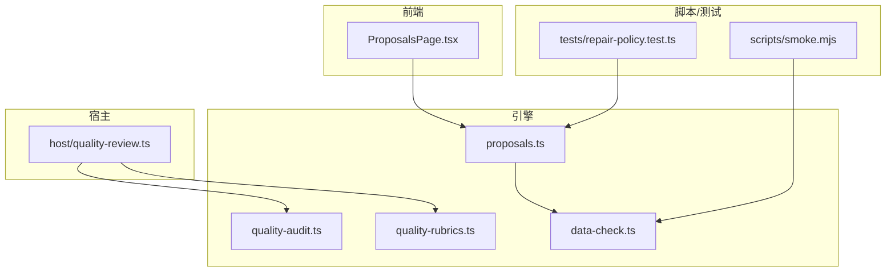
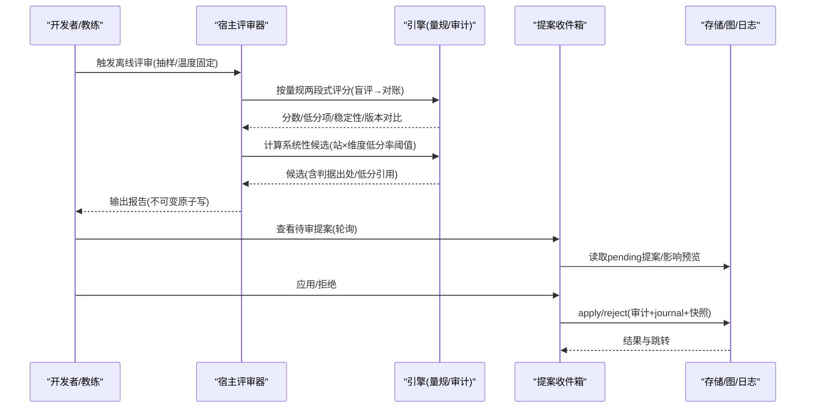
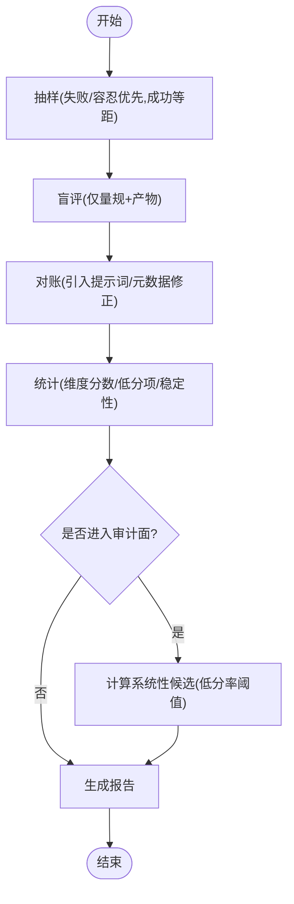
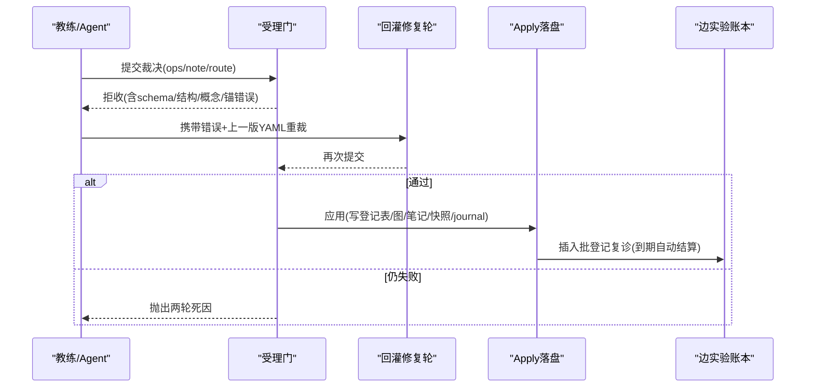
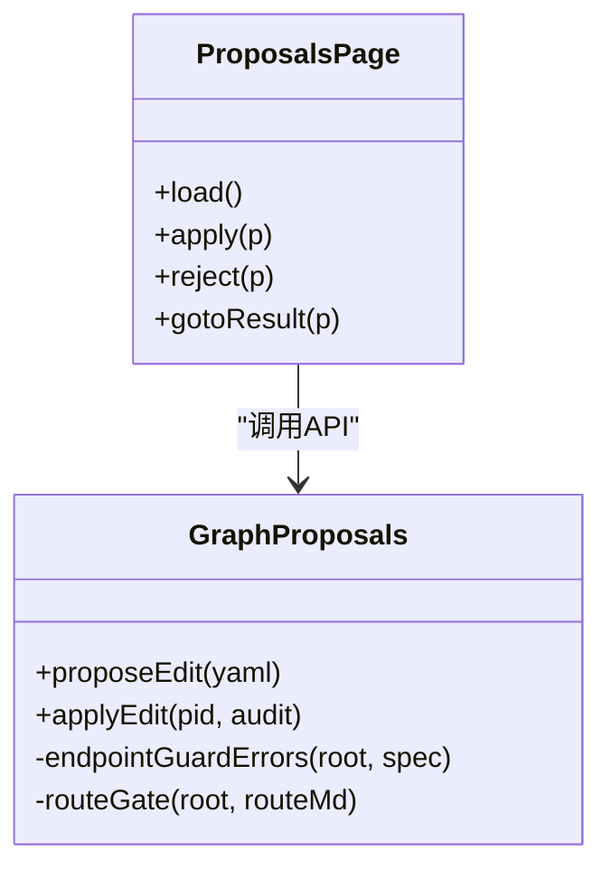
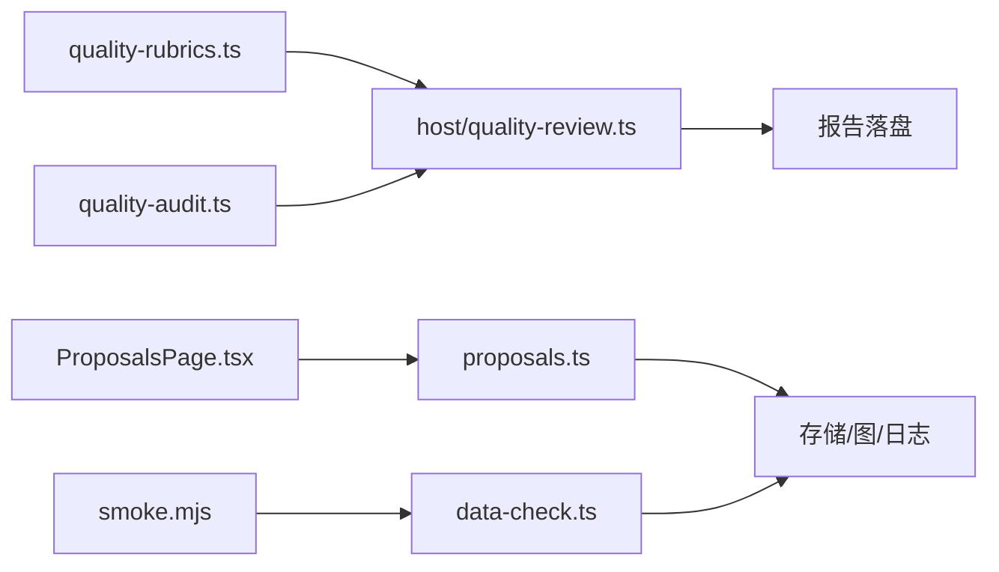

# 修复流程

<cite>
**本文引用的文件**
- [src/engine/quality-audit.ts](file://src/engine/quality-audit.ts)
- [src/engine/quality-rubrics.ts](file://src/engine/quality-rubrics.ts)
- [src/host/quality-review.ts](file://src/host/quality-review.ts)
- [src/engine/proposals.ts](file://src/engine/proposals.ts)
- [ui/src/pages/ProposalsPage.tsx](file://ui/src/pages/ProposalsPage.tsx)
- [src/engine/data-check.ts](file://src/engine/data-check.ts)
- [scripts/smoke.mjs](file://scripts/smoke.mjs)
- [tests/repair-policy.test.ts](file://tests/repair-policy.test.ts)
- [CONTEXT.md](file://CONTEXT.md)
- [docs/adr/0003-anchor-review-instead-of-per-batch-human-review.md](file://docs/adr/0003-anchor-review-instead-of-per-batch-human-review.md)
- [docs/adr/0062-quality-rubric-registry.md](file://docs/adr/0062-quality-rubric-registry.md)
</cite>

## 目录
1. [简介](#简介)
2. [项目结构](#项目结构)
3. [核心组件](#核心组件)
4. [架构总览](#架构总览)
5. [详细组件分析](#详细组件分析)
6. [依赖关系分析](#依赖关系分析)
7. [性能考量](#性能考量)
8. [故障排查指南](#故障排查指南)
9. [结论](#结论)
10. [附录](#附录)

## 简介
本文件系统化说明“修复流程”：从质量问题的自动识别与分类，到修复建议生成、人工审核、提案管理与验证回滚，以及常见质量问题的快速修复工具与自动化脚本。该流程以“量规先行、评审提议、人审终审、提案门禁、可审计落盘”为核心原则，确保修复既高效又可控。

## 项目结构
围绕修复流程的关键代码分布在引擎层（质量评估、提案管理）、宿主层（离线评审运行器）、前端（提案收件箱界面）和脚本/测试（冒烟、类型门、修复策略一致性）。

图表来源
- [src/engine/quality-audit.ts:1-124](file://src/engine/quality-audit.ts#L1-L124)
- [src/engine/quality-rubrics.ts:1-457](file://src/engine/quality-rubrics.ts#L1-L457)
- [src/host/quality-review.ts:1-256](file://src/host/quality-review.ts#L1-L256)
- [src/engine/proposals.ts:1-800](file://src/engine/proposals.ts#L1-L800)
- [ui/src/pages/ProposalsPage.tsx:1-202](file://ui/src/pages/ProposalsPage.tsx#L1-L202)
- [src/engine/data-check.ts:1-800](file://src/engine/data-check.ts#L1-L800)
- [scripts/smoke.mjs:1-65](file://scripts/smoke.mjs#L1-L65)
- [tests/repair-policy.test.ts:1-100](file://tests/repair-policy.test.ts#L1-L100)

章节来源
- [src/engine/quality-audit.ts:1-124](file://src/engine/quality-audit.ts#L1-L124)
- [src/host/quality-review.ts:1-256](file://src/host/quality-review.ts#L1-L256)
- [src/engine/proposals.ts:1-800](file://src/engine/proposals.ts#L1-L800)
- [ui/src/pages/ProposalsPage.tsx:1-202](file://ui/src/pages/ProposalsPage.tsx#L1-L202)
- [src/engine/data-check.ts:1-800](file://src/engine/data-check.ts#L1-L800)
- [scripts/smoke.mjs:1-65](file://scripts/smoke.mjs#L1-L65)
- [tests/repair-policy.test.ts:1-100](file://tests/repair-policy.test.ts#L1-L100)

## 核心组件
- 质量量规注册表：定义五类产物（大纲/节正文/题目/教练回合/种子·终点）的维度与判据，作为评审与审计的统一依据。
- 离线批量评审器（宿主适配）：从语料抽样、两段式评分（盲评→对账）、聚合统计、报告落盘，并计算系统性候选。
- 图质量面审计：在“教练回合/种子·终点”两轴上扫描低分率，产出“系统性发现候选”，供人审蒸馏为票或改量规/提示词。
- 提案生命周期：edit/seed/enrich/project_plan/milestone 等提案经 schema 校验、结构检查、概念对表、终点锚保护、巩固门、生长闸门后进入 pending；人审通过后 apply 落盘并写 journal + 快照。
- 数据体检（只读）：全库注册源存在性/指纹盘点、图/笔记/题库/概念登记/终点锚/提案/流水等健康度汇总，不写入 vault。
- 前端提案收件箱：轮询展示待审提案，支持影响预览、应用/拒绝留痕、结果跳转。
- 冒烟/类型门/修复策略一致性：保障读路径可用、类型错误受控、修复轮数与实现一致。

章节来源
- [src/engine/quality-rubrics.ts:1-457](file://src/engine/quality-rubrics.ts#L1-L457)
- [src/host/quality-review.ts:1-256](file://src/host/quality-review.ts#L1-L256)
- [src/engine/quality-audit.ts:1-124](file://src/engine/quality-audit.ts#L1-L124)
- [src/engine/proposals.ts:1-800](file://src/engine/proposals.ts#L1-L800)
- [src/engine/data-check.ts:1-800](file://src/engine/data-check.ts#L1-L800)
- [ui/src/pages/ProposalsPage.tsx:1-202](file://ui/src/pages/ProposalsPage.tsx#L1-L202)
- [scripts/smoke.mjs:1-65](file://scripts/smoke.mjs#L1-L65)
- [tests/repair-policy.test.ts:1-100](file://tests/repair-policy.test.ts#L1-L100)

## 架构总览
修复流程由“检测—评估—建议—审核—落地—验证”闭环构成：

图表来源
- [src/host/quality-review.ts:126-241](file://src/host/quality-review.ts#L126-L241)
- [src/engine/quality-audit.ts:96-120](file://src/engine/quality-audit.ts#L96-L120)
- [src/engine/proposals.ts:556-605](file://src/engine/proposals.ts#L556-L605)
- [ui/src/pages/ProposalsPage.tsx:71-162](file://ui/src/pages/ProposalsPage.tsx#L71-L162)

## 详细组件分析

### 质量问题自动识别与分类机制
- 量规驱动：所有判定基于注册表中的维度与判据，AI 评分仅作为“提议”，证据必须引原文定位。
- 两段式评审：先盲评（只看产物），再对账（结合提示词与元数据修正），保证稳定与可解释。
- 系统性候选：按“站×维度”统计低分率，超过预注册线即入候选（如≥2件已判档且低分率≥50%），带低分件引用与判据出处，供人审决定是否开新票/改量规/改提示词。

图表来源
- [src/host/quality-review.ts:126-241](file://src/host/quality-review.ts#L126-L241)
- [src/engine/quality-audit.ts:96-120](file://src/engine/quality-audit.ts#L96-L120)
- [src/engine/quality-rubrics.ts:17-57](file://src/engine/quality-rubrics.ts#L17-L57)

章节来源
- [src/host/quality-review.ts:1-256](file://src/host/quality-review.ts#L1-L256)
- [src/engine/quality-audit.ts:1-124](file://src/engine/quality-audit.ts#L1-L124)
- [src/engine/quality-rubrics.ts:1-457](file://src/engine/quality-rubrics.ts#L1-L457)
- [docs/adr/0062-quality-rubric-registry.md:28-37](file://docs/adr/0062-quality-rubric-registry.md#L28-L37)

### 修复建议生成算法（上下文感知与最佳实践）
- 受理门与回灌重裁：当教练裁决被受理门拒收时，系统会回灌“上一版裁决+门错误”给模型进行一轮修复（deep effort），若仍失败则携带两轮死因抛出，避免静默覆盖。
- 批内重写与路线门：罗盘批内重写需通过路线门（锚在终点、非空/限长），防止坏路线落盘。
- 概念对表与终结点保护：apply 前复验概念引用与终点锚保护，确保方向不变式不被破坏。
- 边实验账本与复诊：插入批预注册复诊 metric 与学习日窗口，到期自动结算（证明/剪除），零人审。

图表来源
- [src/engine/proposals.ts:556-605](file://src/engine/proposals.ts#L556-L605)
- [src/engine/proposals.ts:686-862](file://src/engine/proposals.ts#L686-L862)
- [src/engine/growth-subsystem.ts:722-742](file://src/engine/growth-subsystem.ts#L722-L742)

章节来源
- [src/engine/proposals.ts:1-800](file://src/engine/proposals.ts#L1-L800)
- [src/engine/growth-subsystem.ts:722-742](file://src/engine/growth-subsystem.ts#L722-L742)

### 人工审核流程设计（界面、决策支持、版本控制集成）
- 提案收件箱：列表常驻新鲜（8s 轮询），显示状态（待审/已应用/已拒绝），支持一键应用/拒绝留痕。
- 影响预览：种子提案应用前展示新建节点、保留锚、冲突警告、罗盘脚手架情况，知情确认。
- 结果分流：应用成功后根据提案类型跳转到图页/题库/项目页/洞察页，便于即时验证。
- 版本控制集成：apply 走 runWriteUnit 步骤化落盘（铸名→图区→锚维护→笔记→路线→账本→快照→journal），失败中止不回滚，重放由 simulateOps 门拦截。

图表来源
- [ui/src/pages/ProposalsPage.tsx:71-162](file://ui/src/pages/ProposalsPage.tsx#L71-L162)
- [src/engine/proposals.ts:556-605](file://src/engine/proposals.ts#L556-L605)
- [src/engine/proposals.ts:686-862](file://src/engine/proposals.ts#L686-L862)

章节来源
- [ui/src/pages/ProposalsPage.tsx:1-202](file://ui/src/pages/ProposalsPage.tsx#L1-L202)
- [src/engine/proposals.ts:1-800](file://src/engine/proposals.ts#L1-L800)
- [docs/adr/0003-anchor-review-instead-of-per-batch-human-review.md:1-6](file://docs/adr/0003-anchor-review-instead-of-per-batch-human-review.md#L1-L6)

### 修复提案管理机制（状态跟踪与审批流程）
- 提案种类：seed/edit/enrich/project_plan/project_milestone/experiment 等，统一进入 pending 队列。
- 状态机：pending → applied 或 rejected，均留痕；apply 前多重门禁（schema/结构/概念对表/终点锚/巩固门/生长闸/路线门）。
- 审计门禁：apply 前需审计 ok 且 warns 处理；健康分低于基线给出提示。
- 快照与日志：每次 apply 生成快照与 journal 记录，支持回溯与重放拦截。

章节来源
- [src/engine/proposals.ts:1-800](file://src/engine/proposals.ts#L1-L800)
- [ui/src/pages/ProposalsPage.tsx:1-202](file://ui/src/pages/ProposalsPage.tsx#L1-L202)

### 修复效果验证与回滚策略
- 数据体检：只读盘点各区域（注册表/图/笔记/题库/概念登记/终点锚/提案/流水），区分 Missing/Broken/Archived/Hint，不写入 vault。
- 冒烟测试：真实 vault 数据过读路径，验证关键接口可用。
- 类型门：按文件统计 tsc 错误，基线棘轮精确匹配，防恒过。
- 修复策略一致性：注册表声明的修复轮数与实现机制对账，行为侧锁调用次数，确保“0 轮=无整批修复轮”。

章节来源
- [src/engine/data-check.ts:1-800](file://src/engine/data-check.ts#L1-L800)
- [scripts/smoke.mjs:1-65](file://scripts/smoke.mjs#L1-L65)
- [tests/repair-policy.test.ts:1-100](file://tests/repair-policy.test.ts#L1-L100)
- [CONTEXT.md:467-469](file://CONTEXT.md#L467-L469)

## 依赖关系分析
- 量规注册表被评审器与审计共同消费，保证判定标准一致。
- 宿主评审器依赖引擎纯函数（评分/统计/候选计算）与 LLM 端口（真 provider 仅在宿主）。
- 提案模块依赖图、概念登记、锚、笔记、写入单元、存储与日志。
- 前端通过 API 与后端交互，展示提案并触发应用/拒绝。
- 数据体检与各子系统解耦，只读访问，提供全局健康视图。

图表来源
- [src/engine/quality-rubrics.ts:1-457](file://src/engine/quality-rubrics.ts#L1-L457)
- [src/host/quality-review.ts:1-256](file://src/host/quality-review.ts#L1-L256)
- [src/engine/quality-audit.ts:1-124](file://src/engine/quality-audit.ts#L1-L124)
- [src/engine/proposals.ts:1-800](file://src/engine/proposals.ts#L1-L800)
- [ui/src/pages/ProposalsPage.tsx:1-202](file://ui/src/pages/ProposalsPage.tsx#L1-L202)
- [src/engine/data-check.ts:1-800](file://src/engine/data-check.ts#L1-L800)
- [scripts/smoke.mjs:1-65](file://scripts/smoke.mjs#L1-L65)

## 性能考量
- 评审温度固定，保证跨版本/供应商可比性；重复评审用于观测稳定性。
- 批量评审阻塞分钟级，适合离线任务；报告原子写避免半新半旧。
- 提案 apply 走写入单元步骤化，失败中止不回滚，减少中间态风险。
- 数据体检与冒烟测试均为只读，不影响生产负载。

[本节为通用指导，无需特定文件来源]

## 故障排查指南
- 评审失败：记录 failure 字段，不视为产物差；检查模板版本与合同注记。
- 提案拒收：查看 schema/结构/概念对表/终点锚/巩固门/生长闸/路线门错误行，修正后重提。
- 数据损坏：依据 data-check 的 area/reason/location/detail 定位；Missing 合法、Broken 需修复。
- 类型错误：使用类型门测量，对照基线文件，逐文件修复。
- 修复轮异常：核对修复策略单源与实现一致性，确保 rounds 与 mechanism 对应。

章节来源
- [src/host/quality-review.ts:177-209](file://src/host/quality-review.ts#L177-L209)
- [src/engine/proposals.ts:556-605](file://src/engine/proposals.ts#L556-L605)
- [src/engine/data-check.ts:88-131](file://src/engine/data-check.ts#L88-L131)
- [tests/repair-policy.test.ts:1-100](file://tests/repair-policy.test.ts#L1-L100)

## 结论
本修复流程以量规为基准、评审为提议、人审为终审、提案为门禁、落盘可审计为核心，形成从问题识别到修复落地的完整闭环。通过系统性候选、回灌修复、边实验账本与数据体检，既提升效率又保障安全。前端收件箱与冒烟/类型门/策略一致性测试进一步降低误用风险，确保修复可验证、可回滚、可追溯。

[本节为总结，无需特定文件来源]

## 附录
- 快速修复工具与自动化脚本
  - 冒烟测试：scripts/smoke.mjs 验证读路径可用性。
  - 类型门：scripts/scan-types.mjs 按文件统计错误，配合基线棘轮。
  - 数据体检：engine/data-check.ts 全库只读盘点，辅助定位 Broken/Missing。
  - 修复策略一致性：tests/repair-policy.test.ts 校验注册表与实现一致。

章节来源
- [scripts/smoke.mjs:1-65](file://scripts/smoke.mjs#L1-L65)
- [src/engine/data-check.ts:1-800](file://src/engine/data-check.ts#L1-L800)
- [tests/repair-policy.test.ts:1-100](file://tests/repair-policy.test.ts#L1-L100)