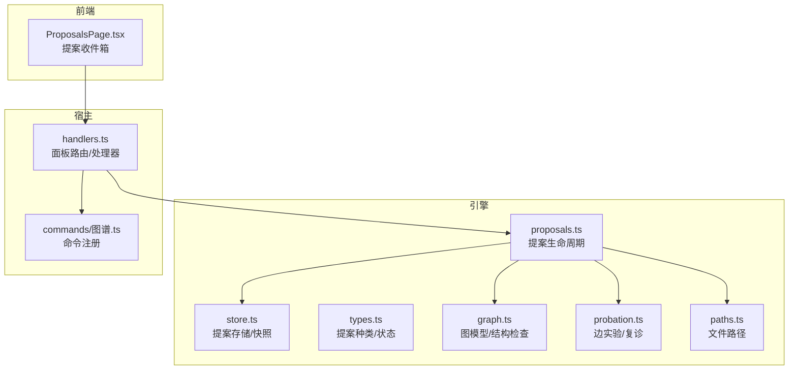
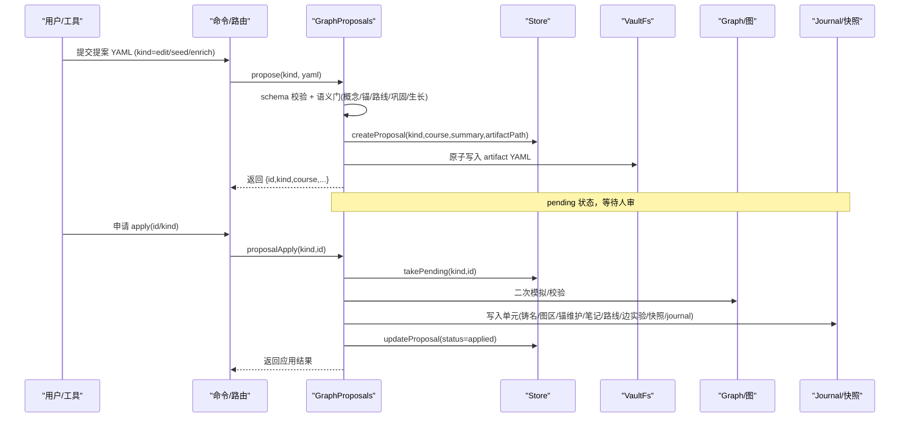
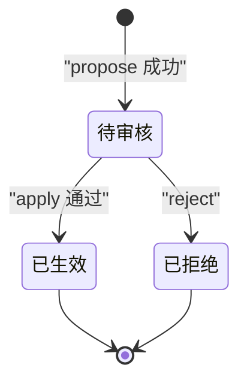
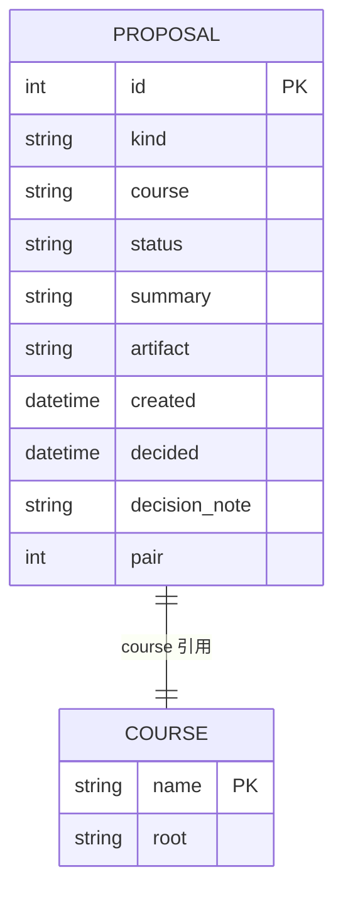
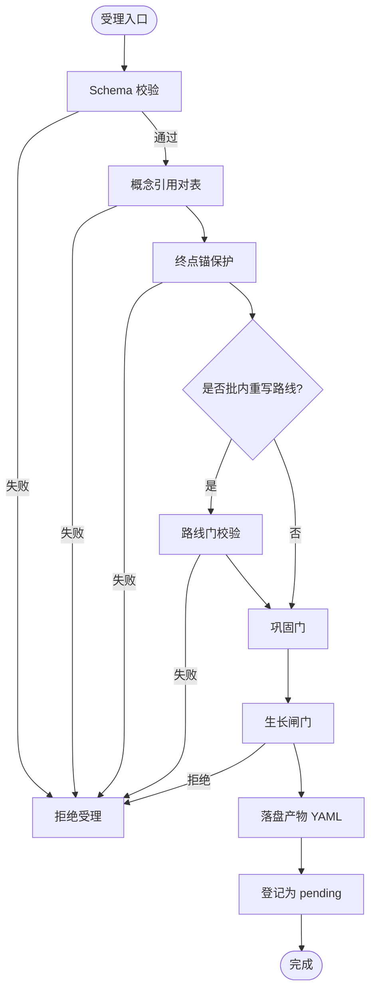
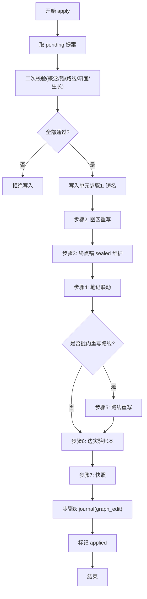
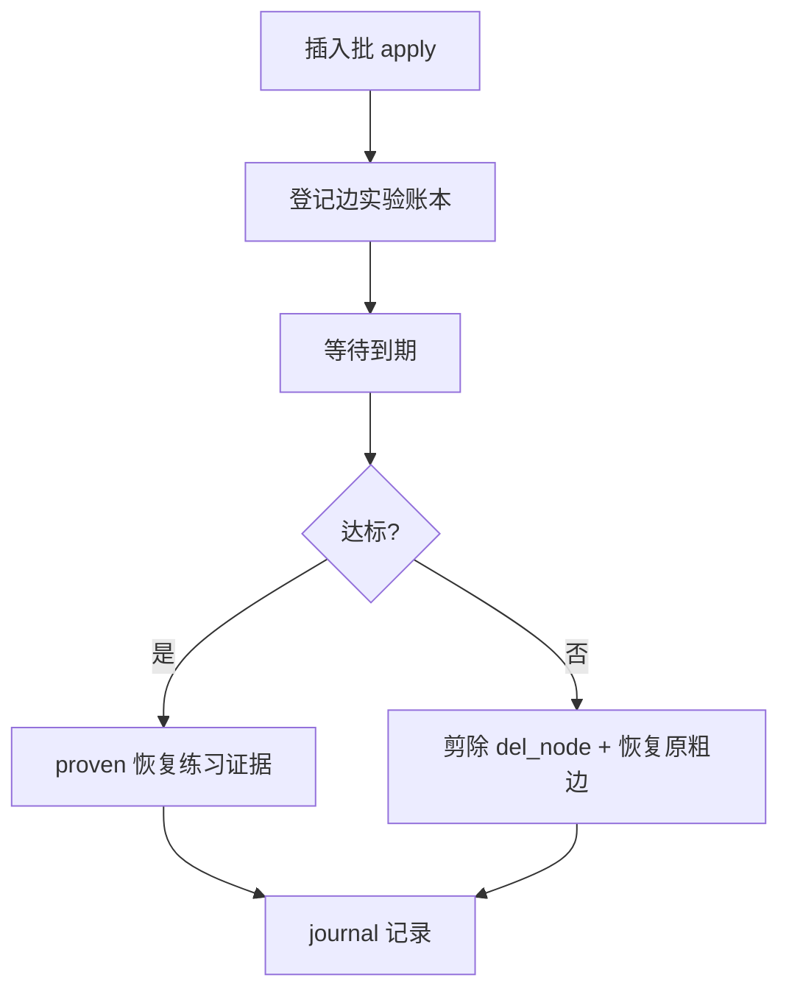
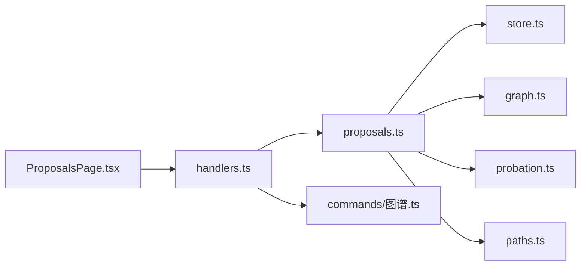

# 提案管理

<cite>
**本文引用的文件**
- [src/engine/proposals.ts](file://src/engine/proposals.ts)
- [src/engine/store.ts](file://src/engine/store.ts)
- [src/engine/types.ts](file://src/engine/types.ts)
- [src/engine/views/proposals.ts](file://src/engine/views/proposals.ts)
- [src/engine/paths.ts](file://src/engine/paths.ts)
- [src/host/handlers.ts](file://src/host/handlers.ts)
- [src/commands/图谱.ts](file://src/commands/图谱.ts)
- [src/engine/graph.ts](file://src/engine/graph.ts)
- [src/engine/probation.ts](file://src/engine/probation.ts)
- [ui/src/pages/ProposalsPage.tsx](file://ui/src/pages/ProposalsPage.tsx)
</cite>

## 目录
1. [简介](#简介)
2. [项目结构](#项目结构)
3. [核心组件](#核心组件)
4. [架构总览](#架构总览)
5. [详细组件分析](#详细组件分析)
6. [依赖关系分析](#依赖关系分析)
7. [性能考量](#性能考量)
8. [故障排查指南](#故障排查指南)
9. [结论](#结论)
10. [附录：API 与客户端集成](#附录api-与客户端集成)

## 简介
本文件系统化说明“提案管理”的完整生命周期与实现细节，覆盖以下方面：
- 提案的生命周期：创建、状态转换（pending/applied/rejected）、审批流程（受理门、apply 门禁、审计与健康分提示）、归档机制（拒绝留痕、快照与 journal）。
- 数据结构与存储：提案记录、产物 YAML、图正典、概念登记表、终点锚、边实验账本、覆盖层 JSONL、快照等。
- 查询与过滤：按状态与 kind 筛选、影响预览、批量操作与导出（通过面板 API）。
- API 接口与前端集成：面板路由、命令绑定、UI 轮询与交互。
- 备份恢复与迁移策略：基于原子写与快照的持久化方案，以及损坏数据的健壮处理。

## 项目结构
围绕提案管理的代码主要分布在引擎域、宿主门面与 UI 三处：
- 引擎域：提案校验、受理、应用、拒绝、清单、路径与类型定义、存储抽象、图模型与边界保护、复诊与边实验账本。
- 宿主门面：面板路由与处理器，将 HTTP 请求映射到引擎方法。
- UI：提案收件箱页面，轮询获取并执行应用/拒绝等操作。

**图表来源**
- [src/engine/proposals.ts:495-605](file://src/engine/proposals.ts#L495-L605)
- [src/engine/store.ts:166-255](file://src/engine/store.ts#L166-L255)
- [src/engine/types.ts:206-211](file://src/engine/types.ts#L206-L211)
- [src/engine/graph.ts:1-24](file://src/engine/graph.ts#L1-L24)
- [src/engine/probation.ts:1-18](file://src/engine/probation.ts#L1-L18)
- [src/engine/paths.ts:123-142](file://src/engine/paths.ts#L123-L142)
- [src/host/handlers.ts:101-151](file://src/host/handlers.ts#L101-L151)
- [src/commands/图谱.ts:212-298](file://src/commands/图谱.ts#L212-L298)
- [ui/src/pages/ProposalsPage.tsx:71-92](file://ui/src/pages/ProposalsPage.tsx#L71-L92)

**章节来源**
- [src/engine/proposals.ts:495-605](file://src/engine/proposals.ts#L495-L605)
- [src/engine/store.ts:166-255](file://src/engine/store.ts#L166-L255)
- [src/engine/types.ts:206-211](file://src/engine/types.ts#L206-L211)
- [src/engine/paths.ts:123-142](file://src/engine/paths.ts#L123-L142)
- [src/host/handlers.ts:101-151](file://src/host/handlers.ts#L101-L151)
- [src/commands/图谱.ts:212-298](file://src/commands/图谱.ts#L212-L298)
- [ui/src/pages/ProposalsPage.tsx:71-92](file://ui/src/pages/ProposalsPage.tsx#L71-L92)

## 核心组件
- GraphProposals：提案生命周期核心类，负责 edit/seed/enrich 三类提案的受理、应用、拒绝、清单与影响预览；串联概念引用对表、终点锚保护、巩固门、路线门、生长闸门、写入单元与快照。
- Store：明文运行态存储，维护 proposals.json 单文件清单、快照序列、journal/practice/review-log 等 JSONL 追加流水；提供 create/update/takePending/list/snapshot 等能力。
- types：集中声明提案种类（edit/seed/enrich/project_plan/project_milestone/experiment）与状态（pending/applied/rejected），以及生长算子、Bloom 层级等共享词汇。
- paths：统一提案产物、覆盖层、边实验账本、终点锚、罗盘等文件路径。
- handlers：面板路由处理器，暴露 /proposals、/proposals/apply、/proposals/impact、/proposals/reject 等接口。
- 图谱命令：将面板路由与引擎方法绑定，形成可被工具面或面板调用的命令。

**章节来源**
- [src/engine/proposals.ts:495-605](file://src/engine/proposals.ts#L495-L605)
- [src/engine/store.ts:166-255](file://src/engine/store.ts#L166-L255)
- [src/engine/types.ts:206-211](file://src/engine/types.ts#L206-L211)
- [src/engine/paths.ts:123-142](file://src/engine/paths.ts#L123-L142)
- [src/host/handlers.ts:101-151](file://src/host/handlers.ts#L101-L151)
- [src/commands/图谱.ts:212-298](file://src/commands/图谱.ts#L212-L298)

## 架构总览
提案从“草案 YAML”进入系统，经过 schema 校验、语义门（概念引用、终点锚、路线、巩固、生长闸门），落盘为 pending 提案；人审后 apply 触发二次校验与写入单元，最终生效并生成快照与 journal；拒绝同样留痕。

**图表来源**
- [src/engine/proposals.ts:556-605](file://src/engine/proposals.ts#L556-L605)
- [src/engine/proposals.ts:686-760](file://src/engine/proposals.ts#L686-L760)
- [src/engine/store.ts:225-255](file://src/engine/store.ts#L225-L255)
- [src/engine/paths.ts:123-142](file://src/engine/paths.ts#L123-L142)

**章节来源**
- [src/engine/proposals.ts:556-605](file://src/engine/proposals.ts#L556-L605)
- [src/engine/proposals.ts:686-760](file://src/engine/proposals.ts#L686-L760)
- [src/engine/store.ts:225-255](file://src/engine/store.ts#L225-L255)

## 详细组件分析

### 提案生命周期与状态机
- 种类与状态
  - 种类：edit、seed、enrich、project_plan、project_milestone、experiment。
  - 状态：pending → applied | rejected（全留痕）。
- 关键阶段
  - 受理（propose）：schema 校验 + 语义门（概念引用对表、终点锚保护、路线门、巩固门、生长闸门）→ 产物 YAML 落盘 → 登记为 pending。
  - 应用（apply）：取 pending → 二次校验 → 写入单元（顺序严格：铸名 → 图区重写 → 终点锚 sealed 维护 → 笔记联动 → 路线批内重写 → 边实验账本 → 快照 → journal(graph_edit) → 标记 applied）。
  - 拒绝（reject）：更新状态为 rejected，并保留 decision_note；同源双提案联动拒收。
  - 影响预览（impact）：仅 seed 携带，用于知情确认。

**图表来源**
- [src/engine/types.ts:206-211](file://src/engine/types.ts#L206-L211)
- [src/engine/proposals.ts:1574-1589](file://src/engine/proposals.ts#L1574-L1589)
- [src/engine/proposals.ts:686-760](file://src/engine/proposals.ts#L686-L760)

**章节来源**
- [src/engine/types.ts:206-211](file://src/engine/types.ts#L206-L211)
- [src/engine/proposals.ts:1574-1589](file://src/engine/proposals.ts#L1574-L1589)
- [src/engine/proposals.ts:686-760](file://src/engine/proposals.ts#L686-L760)

### 数据结构与存储方案
- 提案记录（store.proposals.json）
  - 字段：id、kind、course、status、summary、artifact、created、decided、decision_note、pair（同源双提案联动）。
  - 契约：id 正整数、status 三值、artifact 非空、pair 存在性校验。
- 提案产物（state/proposals/<pid>-<kind>-<course>.yaml）
  - 受理即落盘，apply 回读；拒绝也保留 artifact。
- 图正典（data/*.yaml）
  - 唯一事实源；变更经 apply 写入单元落盘。
- 概念登记表（课程根下）
  - 随 apply 幂等写入；悬空引用违约。
- 终点锚（课程根/state/终点锚.json）
  - 方向锚集合；apply 时进行 sealed 维护。
- 边实验账本（课程根/state/边实验.jsonl）
  - 插入边的复诊状态追加流水；到期自动裁决（达标 proven 或剪除）。
- 覆盖层（课程根/state/覆盖层.jsonl）
  - enrich 通道只补写 enc 等字段；读侧永远读正典。
- 快照（state/snapshots/<课程>-v<N>.json）
  - apply 时保存整图文档，便于回溯。

**图表来源**
- [src/engine/store.ts:28-44](file://src/engine/store.ts#L28-L44)
- [src/engine/store.ts:166-200](file://src/engine/store.ts#L166-L200)
- [src/engine/paths.ts:123-142](file://src/engine/paths.ts#L123-L142)
- [src/engine/types.ts:243-259](file://src/engine/types.ts#L243-L259)

**章节来源**
- [src/engine/store.ts:28-44](file://src/engine/store.ts#L28-L44)
- [src/engine/store.ts:166-200](file://src/engine/store.ts#L166-L200)
- [src/engine/paths.ts:123-142](file://src/engine/paths.ts#L123-L142)
- [src/engine/types.ts:243-259](file://src/engine/types.ts#L243-L259)

### 受理门与语义约束
- schema 校验：严格限定键集与取值范围（如 bloom/difficulty/est/type/enc 等）。
- 概念引用对表：teaches/assumes/misconceptions 必须命中登记表在册名或本次铸名；撞名拒收。
- 终点锚保护：禁止 del/rename 锚定终点；add_node 不得以终点为 pre；主线批含新节点时必须声明 target_endpoints 并完成接线覆盖。
- 路线门：仅生长批可批内重写“剩余路线”，且需满足锚在终点、正文非空/无标题/限长等规则。
- 巩固门：operator=巩固 的 add_node 仅允许引用已教概念。
- 生长闸门：受理与 apply 双门调用（由门面注入），依据三率（插入率/剪枝率/复诊通过率）与复诊通过率触底进行调速。

**图表来源**
- [src/engine/proposals.ts:125-341](file://src/engine/proposals.ts#L125-L341)
- [src/engine/proposals.ts:556-605](file://src/engine/proposals.ts#L556-L605)
- [src/engine/proposals.ts:607-680](file://src/engine/proposals.ts#L607-L680)

**章节来源**
- [src/engine/proposals.ts:125-341](file://src/engine/proposals.ts#L125-L341)
- [src/engine/proposals.ts:556-605](file://src/engine/proposals.ts#L556-L605)
- [src/engine/proposals.ts:607-680](file://src/engine/proposals.ts#L607-L680)

### Apply 写入单元与归档
- 写入单元顺序（失败上抛中止，不回滚不续跑）：
  1) 铸名落概念登记表（幂等）
  2) 图区重写（data/*.yaml）
  3) 终点锚 sealed 维护（逐终点独立）
  4) 笔记联动（缺骨架则补）
  5) 罗盘批内重写（若 route 在场）
  6) 边实验账本（插入边登记）
  7) 快照（整图文档）
  8) journal(graph_edit)
  9) 标记 applied
- 健康分提示：applyFindings 汇总审计 warns 与健康分基线提示（种子阶段豁免）。
- 拒绝归档：rejected 同样保留 artifact 与 decision_note，支持同源双提案联动拒收。

**图表来源**
- [src/engine/proposals.ts:686-760](file://src/engine/proposals.ts#L686-L760)
- [src/engine/proposals.ts:392-402](file://src/engine/proposals.ts#L392-L402)
- [src/engine/proposals.ts:1574-1589](file://src/engine/proposals.ts#L1574-L1589)

**章节来源**
- [src/engine/proposals.ts:686-760](file://src/engine/proposals.ts#L686-L760)
- [src/engine/proposals.ts:392-402](file://src/engine/proposals.ts#L392-L402)
- [src/engine/proposals.ts:1574-1589](file://src/engine/proposals.ts#L1574-L1589)

### 边实验与复诊（插入边）
- 插入边生命周期：insert 批（operator=插入）+ recheck 预注册（metric 恰一枚，days 默认 10 学习日 clamp [5,20]）→ apply 登记进边实验账本 → 到期自动裁决（达标 proven，不达标剪除 del_node 并恢复原粗边）→ 零人审结算。
- 账本只增：条目包含 node/pre/proposal/due/outcome/decided_at 等；recheck_outcome 与 graph_repair 沉淀至正典日志。

**图表来源**
- [src/engine/probation.ts:1-18](file://src/engine/probation.ts#L1-L18)
- [src/engine/probation.ts:109-137](file://src/engine/probation.ts#L109-L137)

**章节来源**
- [src/engine/probation.ts:1-18](file://src/engine/probation.ts#L1-L18)
- [src/engine/probation.ts:109-137](file://src/engine/probation.ts#L109-L137)

### 查询、过滤与导出
- 列表查询：支持按 status 与 kind 过滤，limit 控制条数。
- 影响预览：仅 seed 携带，展示新建节点、重名冲突、当前图规模、现锚集合、罗盘重置标志与工作表项数。
- 批量操作：通过面板路由 /proposals/apply、/proposals/reject 进行批量应用/拒绝（结合前端多选）。
- 导出：可通过面板 GET /proposals 拉取清单，供外部消费或导出。

**章节来源**
- [src/engine/proposals.ts:1591-1601](file://src/engine/proposals.ts#L1591-L1601)
- [src/commands/图谱.ts:212-298](file://src/commands/图谱.ts#L212-L298)
- [src/host/handlers.ts:101-151](file://src/host/handlers.ts#L101-L151)

## 依赖关系分析
- GraphProposals 依赖：
  - Store：提案清单与快照读写。
  - Paths：产物、账本、锚、罗盘等路径。
  - Graph/GraphStore：图加载、结构检查、区域文件写入。
  - Concepts：概念登记表加载/合并/冲突检测。
  - Probation：插入边复诊逻辑。
  - Clock：时间戳与学习日。
  - VaultFs：文件系统抽象。
- 宿主门面依赖：
  - handlers 将路由映射到 engine 方法（graph.graphPropose、graph.proposalApply、proposals.proposalImpact、graph.graphReject 等）。
- 前端依赖：
  - ProposalsPage 轮询 GET /proposals，执行 apply/reject 动作。

**图表来源**
- [ui/src/pages/ProposalsPage.tsx:71-92](file://ui/src/pages/ProposalsPage.tsx#L71-L92)
- [src/host/handlers.ts:101-151](file://src/host/handlers.ts#L101-L151)
- [src/engine/proposals.ts:495-605](file://src/engine/proposals.ts#L495-L605)
- [src/engine/store.ts:166-255](file://src/engine/store.ts#L166-L255)
- [src/engine/graph.ts:1-24](file://src/engine/graph.ts#L1-L24)
- [src/engine/probation.ts:1-18](file://src/engine/probation.ts#L1-L18)
- [src/engine/paths.ts:123-142](file://src/engine/paths.ts#L123-L142)
- [src/commands/图谱.ts:212-298](file://src/commands/图谱.ts#L212-L298)

**章节来源**
- [ui/src/pages/ProposalsPage.tsx:71-92](file://ui/src/pages/ProposalsPage.tsx#L71-L92)
- [src/host/handlers.ts:101-151](file://src/host/handlers.ts#L101-L151)
- [src/engine/proposals.ts:495-605](file://src/engine/proposals.ts#L495-L605)
- [src/engine/store.ts:166-255](file://src/engine/store.ts#L166-L255)
- [src/engine/graph.ts:1-24](file://src/engine/graph.ts#L1-L24)
- [src/engine/probation.ts:1-18](file://src/engine/probation.ts#L1-L18)
- [src/engine/paths.ts:123-142](file://src/engine/paths.ts#L123-L142)
- [src/commands/图谱.ts:212-298](file://src/commands/图谱.ts#L212-L298)

## 性能考量
- 受理阶段内存图模拟：在内存中构建 Graph 并模拟 ops，避免频繁 IO；仅在 apply 阶段进行真实写入。
- 原子写与追加：proposal 产物使用 atomicWrite；journal/practice/review-log 采用 JSONL 追加，减少锁竞争。
- 快照粒度：按课程版本化保存整图，便于快速回溯与审计。
- 过滤与分页：list 支持 limit，降低大数据量下的传输与渲染压力。
- 边实验账本只增：避免重复计算与写放大。

[本节为通用指导，无需特定文件来源]

## 故障排查指南
- 提案清单损坏
  - 现象：loadProposals 抛出 Broken（非法 JSON、非数组、逐条形状违约、pair 悬空）。
  - 处理：修复或删除对应条目后重试；缺失文件视为合法空态。
- 未知 kind 提案
  - 现象：apply 报非法 kind；reject 仍可留痕。
  - 处理：清理遗留记录或升级引擎兼容。
- 概念引用对表失败
  - 现象：teaches/assumes/misconceptions 未命中登记表在册名或铸名。
  - 处理：修正概念名或先完成铸名。
- 终点锚保护失败
  - 现象：del/rename 锚点、以终点为 pre、主线批未声明朝向或未接线。
  - 处理：遵循锚保护不变式，补充 set_pre 接线或调整批意图。
- 路线门失败
  - 现象：非生长批携带 route、锚不在终点、正文为空/过长。
  - 处理：仅生长批可重写路线，并确保正文合规。
- 生长闸门拒绝
  - 现象：三率超限或复诊通过率触底导致插入/旁支受限。
  - 处理：等待指标恢复或调整批策略。
- 应用失败
  - 现象：二次校验不过（图漂移、锚变化、巩固门/路线门/生长门失败）。
  - 处理：根据错误信息修正后重新提交流程。

**章节来源**
- [src/engine/store.ts:166-200](file://src/engine/store.ts#L166-L200)
- [tests/safe-proposal-decisions.test.ts:84-93](file://tests/safe-proposal-decisions.test.ts#L84-L93)
- [src/engine/proposals.ts:556-605](file://src/engine/proposals.ts#L556-L605)
- [src/engine/proposals.ts:607-680](file://src/engine/proposals.ts#L607-L680)
- [src/engine/proposals.ts:686-760](file://src/engine/proposals.ts#L686-L760)

## 结论
提案管理系统以“强校验、全留痕、可追溯”为核心原则，通过严格的受理门与 apply 门禁保障图正典与业务规则的一致性；借助写入单元确保多文件一致性；配合边实验与复诊机制实现数据驱动的动态演进；面板 API 与前端轮询提供高效的人审闭环。整体设计兼顾安全性、可审计性与可扩展性。

[本节为总结性内容，无需特定文件来源]

## 附录：API 与客户端集成

### 面板 API 概览
- GET /proposals
  - 作用：列出提案，支持 status/kind 过滤。
  - 绑定：命令 graph.graphProposals。
- POST /proposals/apply
  - 作用：应用指定 kind 的最新 pending 提案或指定 id。
  - 绑定：命令 graph.proposalApply。
- POST /proposals/impact
  - 作用：预览 seed 提案的影响（新增节点、重名冲突、图规模、现锚、罗盘重置、工作表项数）。
  - 绑定：命令 proposals.proposalImpact。
- POST /proposals/reject
  - 作用：拒绝指定提案，支持备注；同源双提案联动拒收。
  - 绑定：命令 graph.graphReject。

**章节来源**
- [src/commands/图谱.ts:212-298](file://src/commands/图谱.ts#L212-L298)
- [src/host/handlers.ts:101-151](file://src/host/handlers.ts#L101-L151)

### 前端集成要点
- 轮询：ProposalsPage 每 8 秒轮询 GET /proposals，切片模式下按课程过滤。
- 操作：应用/拒绝后派发全局刷新事件，确保其他视图同步。
- 导航：根据 kind/course 决定跳转目标（项目页或工作台图页）。

**章节来源**
- [ui/src/pages/ProposalsPage.tsx:71-92](file://ui/src/pages/ProposalsPage.tsx#L71-L92)

### 数据模型参考
- ProposalRec：id、kind、course、status、summary、artifact、created、decided、decision_note、pair。
- GraphEditProposalResult / GraphSeedProposalResult / GraphEnrichProposalResult：受理结果视图类型。
- SeedImpactDoc：seed 影响预览文档。

**章节来源**
- [src/engine/types.ts:243-259](file://src/engine/types.ts#L243-L259)
- [src/engine/views/proposals.ts:7-58](file://src/engine/views/proposals.ts#L7-L58)