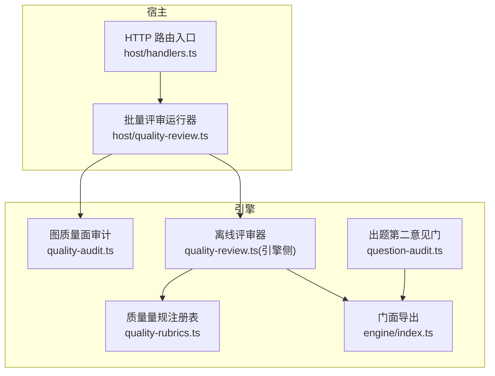
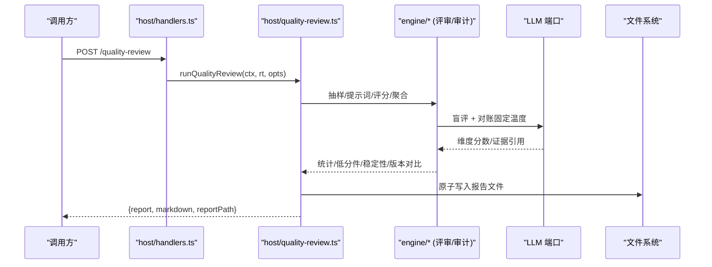
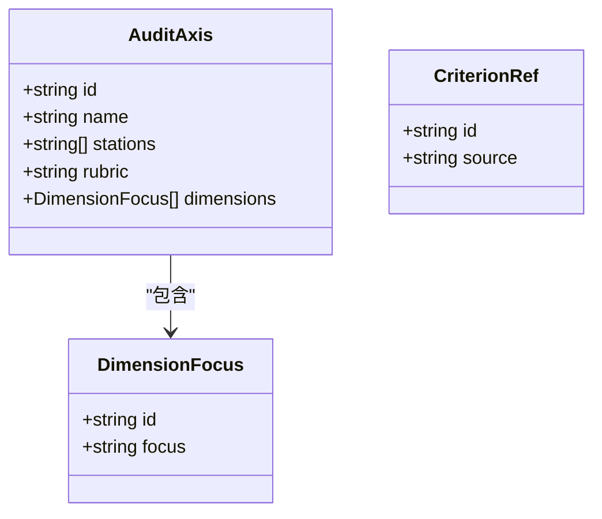
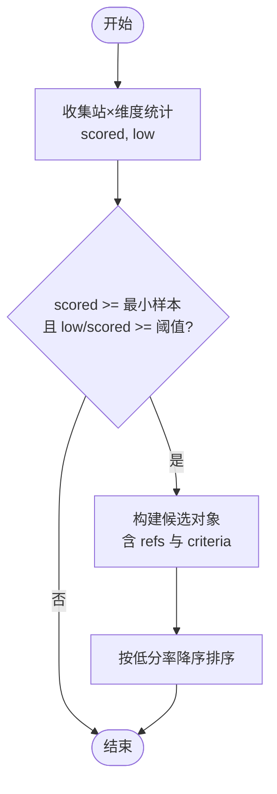
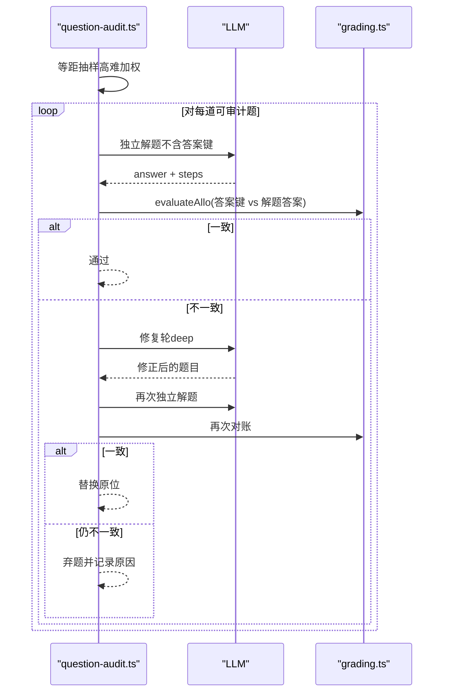
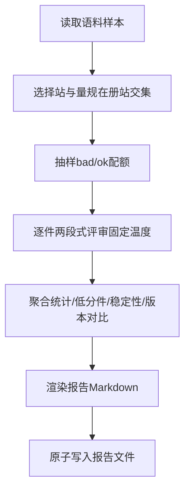
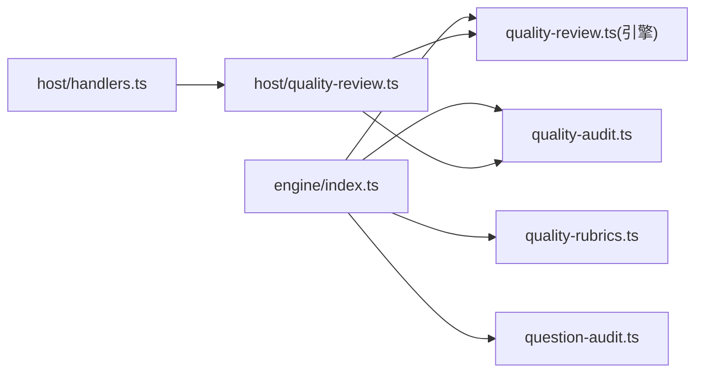

# 问题识别与分类

<cite>
**本文引用的文件**
- [quality-audit.ts](file://src/engine/quality-audit.ts)
- [quality-rubrics.ts](file://src/engine/quality-rubrics.ts)
- [question-audit.ts](file://src/engine/question-audit.ts)
- [quality-review.ts](file://src/host/quality-review.ts)
- [index.ts](file://src/engine/index.ts)
- [handlers.ts](file://src/host/handlers.ts)
- [vault-audit.md](file://docs/research/vault-audit.md)
- [triage-labels.md](file://docs/agents/triage-labels.md)
</cite>

## 目录
1. [引言](#引言)
2. [项目结构](#项目结构)
3. [核心组件](#核心组件)
4. [架构总览](#架构总览)
5. [详细组件分析](#详细组件分析)
6. [依赖关系分析](#依赖关系分析)
7. [性能考量](#性能考量)
8. [故障排查指南](#故障排查指南)
9. [结论](#结论)
10. [附录](#附录)

## 引言
本文件系统化阐述“问题识别与分类”的机制与实践，覆盖以下目标：
- 质量问题的自动检测机制：错误模式匹配、低分率计算、系统性问题识别。
- 审计面定义与配置：教练回合裁决质量、种子/终点资格的评估标准。
- 问题分类体系：维度划分、判据引用、影响范围分析。
- 严重性分级与优先级排序规则。
- 常见质量问题模式的识别规则与自动化检测脚本使用示例。

## 项目结构
围绕问题识别与分类的关键代码分布在引擎与宿主两层：
- 引擎层（纯函数、零副作用）：质量量规注册表、离线评审器、图质量面审计、出题第二意见门。
- 宿主层（适配 I/O、LLM、报告落盘）：批量评审运行器、HTTP 路由入口、语料读取与报告原子写。

图表来源
- [quality-audit.ts:50-74](file://src/engine/quality-audit.ts#L50-L74)
- [quality-rubrics.ts:60-440](file://src/engine/quality-rubrics.ts#L60-L440)
- [quality-review.ts:124-241](file://src/host/quality-review.ts#L124-L241)
- [question-audit.ts:166-279](file://src/engine/question-audit.ts#L166-L279)
- [index.ts:104-127](file://src/engine/index.ts#L104-L127)
- [handlers.ts:220-235](file://src/host/handlers.ts#L220-L235)

章节来源
- [quality-audit.ts:1-124](file://src/engine/quality-audit.ts#L1-L124)
- [quality-rubrics.ts:1-457](file://src/engine/quality-rubrics.ts#L1-L457)
- [question-audit.ts:1-280](file://src/engine/question-audit.ts#L1-L280)
- [quality-review.ts:1-256](file://src/host/quality-review.ts#L1-L256)
- [index.ts:1-200](file://src/engine/index.ts#L1-L200)
- [handlers.ts:220-235](file://src/host/handlers.ts#L220-L235)

## 核心组件
- 质量量规注册表：定义五类产物（大纲/节正文/题目/教练回合/种子·终点）的维度与判据，明确分层法庭（AI 提议、人审终审、结果法院）。
- 离线批量评审器：从生成语料抽样，逐件两段式评审（盲评→对账），聚合统计、稳定性读数、模板版本对照、低分件清单。
- 图质量面审计：声明两类审计轴（教练回合裁决质量、种子·终点资格），按站×维度计算低分率，产出系统性发现候选（需人审裁决）。
- 出题第二意见门：对客观题进行独立解题与答案键确定性对账；不一致则触发修复轮，仍失败弃题。

章节来源
- [quality-rubrics.ts:17-57](file://src/engine/quality-rubrics.ts#L17-L57)
- [quality-review.ts:124-241](file://src/host/quality-review.ts#L124-L241)
- [quality-audit.ts:50-120](file://src/engine/quality-audit.ts#L50-L120)
- [question-audit.ts:166-279](file://src/engine/question-audit.ts#L166-L279)

## 架构总览
下图展示从 HTTP 请求到报告落盘的完整流程，以及引擎内各模块的协作关系。

图表来源
- [handlers.ts:220-235](file://src/host/handlers.ts#L220-L235)
- [quality-review.ts:124-241](file://src/host/quality-review.ts#L124-L241)

## 详细组件分析

### 质量量规与审计面
- 审计面（AUDIT_AXES）定义两类审计：
  - 教练回合裁决质量：关注生长纪律、算子语义、裁决与路线。
  - 种子·终点资格：关注起点资格、终点资格、骨架与路由。
- 每个审计轴包含：id、name、stations、rubric、dimensions（含 focus 看点）。
- 审计面声明行用于报告开头，明确本轮审了什么、没审什么，避免误读为全面覆盖。

图表来源
- [quality-audit.ts:38-74](file://src/engine/quality-audit.ts#L38-L74)

章节来源
- [quality-audit.ts:38-94](file://src/engine/quality-audit.ts#L38-L94)
- [quality-rubrics.ts:293-439](file://src/engine/quality-rubrics.ts#L293-L439)

### 低分率计算与系统性问题识别
- 低分率 = 某站×维度的低分件数 / 已判档件数。
- 预注册线：至少 2 件已判档且低分率 ≥ 50% 才入候选。
- 系统性候选输出包含：station、dimension、scored、low、lowRate、refs（低分件引用）、criteria（判据出处）。
- 候选是“提议”，需人审蒸馏成票或改量规/提示词，引擎不直接下结论。

图表来源
- [quality-audit.ts:76-120](file://src/engine/quality-audit.ts#L76-L120)

章节来源
- [quality-audit.ts:76-120](file://src/engine/quality-audit.ts#L76-L120)

### 出题第二意见门（错误模式匹配与自动修复）
- 抽样策略：等距抽样，默认 25%，高难度（difficulty=3）恒入样。
- 可审计题型：单选、多选、判断、填空、数值、排序、配对；开放/反思题排除。
- 对账比较器：evaluateAllo（判卷同款），支持字母归一、NFKC 归一、容差、排序配对逐位。
- 不一致处置：触发修复轮（deep 档），修复后再审计；仍不一致弃题并记录原因。
- 保守放行：解析失败或不可判视为 unresolved，不等同于键错。

图表来源
- [question-audit.ts:95-108](file://src/engine/question-audit.ts#L95-L108)
- [question-audit.ts:166-279](file://src/engine/question-audit.ts#L166-L279)

章节来源
- [question-audit.ts:1-280](file://src/engine/question-audit.ts#L1-L280)

### 离线批量评审器（报告与度量）
- 抽样池：从生成语料目录读取 .md 文件，解析 frontmatter 与 prompt/output。
- 两段式评审：盲评（仅量规+产物原文）→ 对账（引入生成提示词与元数据）。
- 聚合统计：维度分数分布、低分件清单、模板版本对照、稳定性读数（重复评审）。
- 报告落盘：原子写单文件，路径包含时间戳与站点集合。

图表来源
- [quality-review.ts:78-122](file://src/host/quality-review.ts#L78-L122)
- [quality-review.ts:124-241](file://src/host/quality-review.ts#L124-L241)

章节来源
- [quality-review.ts:78-256](file://src/host/quality-review.ts#L78-L256)

### 常见问题模式与识别规则
- 认知跨步/空降节点：|Δdifficulty|≥2 或 depth 跨度≥3；region 前 1/4 外无 pre 的节点视为空降。
- est 可信度失真：实证显示 est 集中在窄区间，难以区分复杂度，应结合 difficulty 与深度信号。
- 格式级门禁失败：如 plot JSON 非法、出现 ### 子标题等，导致任务阻塞，需要程序化容错与局部修复。

章节来源
- [quality.ts:12-60](file://src/engine/quality.ts#L12-L60)
- [vault-audit.md:11-22](file://docs/research/vault-audit.md#L11-L22)
- [vault-audit.md:35-46](file://docs/research/vault-audit.md#L35-L46)

## 依赖关系分析
- 门面集中导出：engine/index.ts 统一暴露质量量规、评审器、审计、第二意见门等能力，约束宿主与 UI 的导入边界。
- 宿主适配：host/quality-review.ts 负责 I/O、LLM 调用、报告落盘；host/handlers.ts 提供 HTTP 入口并对参数做严格校验。
- 测试与验收：tests/* 覆盖审计面一致性、候选阈值、报告形态等关键断言。

图表来源
- [index.ts:104-127](file://src/engine/index.ts#L104-L127)
- [handlers.ts:220-235](file://src/host/handlers.ts#L220-L235)
- [quality-review.ts:124-241](file://src/host/quality-review.ts#L124-L241)

章节来源
- [index.ts:104-127](file://src/engine/index.ts#L104-L127)
- [handlers.ts:220-235](file://src/host/handlers.ts#L220-L235)

## 性能考量
- 评审温度固定：确保跨版本/跨轮次差异来自内容而非模型随机性；稳定性读数需至少两次评审。
- 抽样成本可控：第二意见门采用等距抽样与高难加权，降低 LLM 调用成本同时聚焦高风险题。
- 报告原子写：避免并发写入导致的半新半旧报告，提升可读性与可靠性。

[本节为通用指导，无需特定文件来源]

## 故障排查指南
- 参数校验失败：repeats 必须 ≥1；badQuota/okQuota 为非负整数；stations 非空字符串数组。
- 无可用样本：当语料目录中没有“有量规的站”样本时，会抛出错误，需先运行生成或指定站点。
- 评审失败处理：评审失败（应答不可解析/维度缺失）不计为低分，单独列示于报告。
- 第二意见门异常：solver 输出不可解析或比较器不可用视为 unresolved，保守放行，不阻断整批。

章节来源
- [handlers.ts:220-235](file://src/host/handlers.ts#L220-L235)
- [quality-review.ts:145-148](file://src/host/quality-review.ts#L145-L148)
- [quality-review.ts:197-200](file://src/host/quality-review.ts#L197-L200)
- [question-audit.ts:147-162](file://src/engine/question-audit.ts#L147-L162)

## 结论
本系统以“判定标准先于判定器”为原则，通过质量量规注册表、离线批量评审、图质量面审计与出题第二意见门，形成闭环的问题识别与分类体系：
- 自动检测：基于错误模式匹配（如独立解题对账）、低分率计算与结构性检测（跨步/空降）。
- 系统性识别：按站×维度统计低分率，越预注册线即产出候选，供人审决策。
- 分类与溯源：维度划分清晰，判据引用可追溯至模板/ADR/词条，便于定位与改进。
- 严重性与优先级：低分率高且样本充足者优先处理；高难度题在第二意见门中恒入样，优先保障。

[本节为总结性内容，无需特定文件来源]

## 附录

### 问题严重性分级与优先级规则
- 严重性分级建议：
  - 高：低分率 ≥ 50% 且样本 ≥ 2（进入系统性候选）；或涉及安全/正确性（如答案键不一致）。
  - 中：低分率在 30%-50% 之间，或影响下游可用性（如衔接断裂、风格变体未兑现）。
  - 低：格式/排版问题，可通过工具快速修复。
- 优先级排序规则：
  - 先处理系统性候选（高严重性）。
  - 其次处理高难度题的第二意见门不一致（影响学习者体验）。
  - 最后处理格式与风格问题。

[本节为通用指导，无需特定文件来源]

### 自动化检测脚本使用示例
- 启动离线评审：
  - 通过 HTTP 接口 POST /quality-review，传入 corpusDir、stations、badQuota、okQuota、repeats、systemic 等参数。
  - 示例：设置 repeats=2 以观测稳定性；systemic.minSamples=2、systemic.lowRate=0.5 使用预注册线。
- 运行第二意见门：
  - 在题目生成管线中启用 question-audit，默认抽样率 0.25，高难度恒入样；可配置 rate 关闭或调整。
- 查看报告：
  - 报告落盘至 state/质量评审/<ts>-<站>.md，包含维度分数分布、低分件清单、版本对照、稳定性读数与系统性候选。

章节来源
- [handlers.ts:220-235](file://src/host/handlers.ts#L220-L235)
- [quality-review.ts:124-241](file://src/host/quality-review.ts#L124-L241)
- [question-audit.ts:29-31](file://src/engine/question-audit.ts#L29-L31)

### 问题分类体系与影响范围分析
- 维度划分：
  - 大纲：结构划分、教学法兑现、下游可用性。
  - 节正文：教学法兑现、风格变体、衔接与边界、结构排版。
  - 题目：答案键正确性、多样性、覆盖与立场。
  - 教练回合：生长纪律、算子语义、裁决与路线。
  - 种子·终点：起点资格、终点资格、骨架与路由。
- 判据引用：每条判据包含 criterion、evidence、source、anchor，确保可追溯与可核对。
- 影响范围分析：
  - 系统性候选带出 refs（低分件引用）与 criteria（判据出处），便于定位到具体提示词/量规条目。
  - 稳定性读数指示该维度判读是否稳定，不稳定维度优先人审校准。

章节来源
- [quality-rubrics.ts:60-440](file://src/engine/quality-rubrics.ts#L60-L440)
- [quality-audit.ts:96-120](file://src/engine/quality-audit.ts#L96-L120)

### 标签与工单流转
- 待分类：维护者评估后决定下一步。
- 待补充信息：等待上报者补充材料。
- 可交给Agent：规格完备，可由 Agent 处理。
- 需人工处理：需要人工实现或裁决。
- 不予修复：明确不行动项。

章节来源
- [triage-labels.md:1-14](file://docs/agents/triage-labels.md#L1-L14)