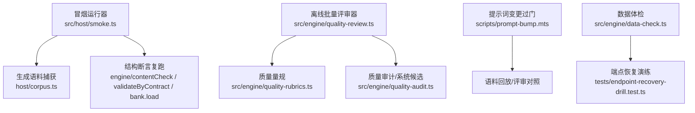
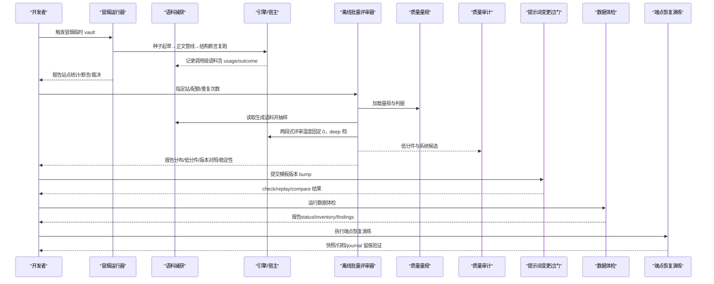
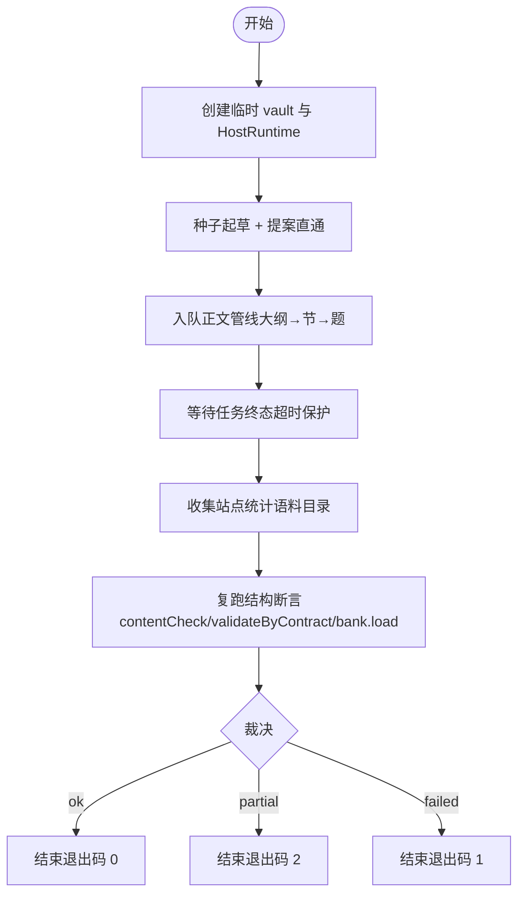
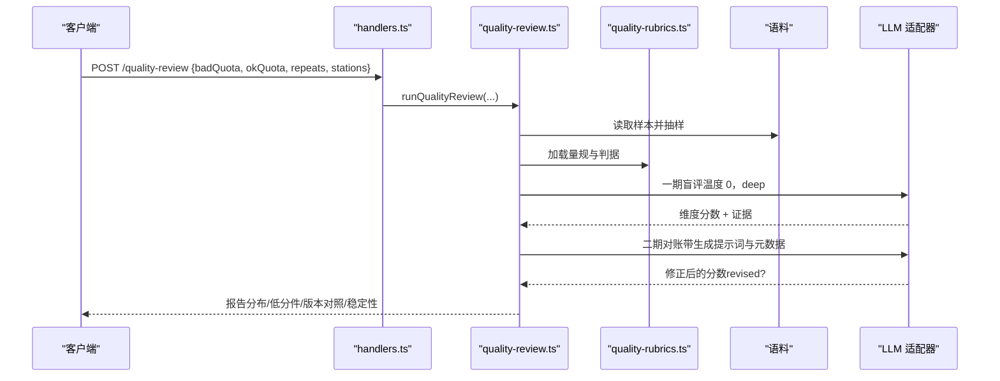
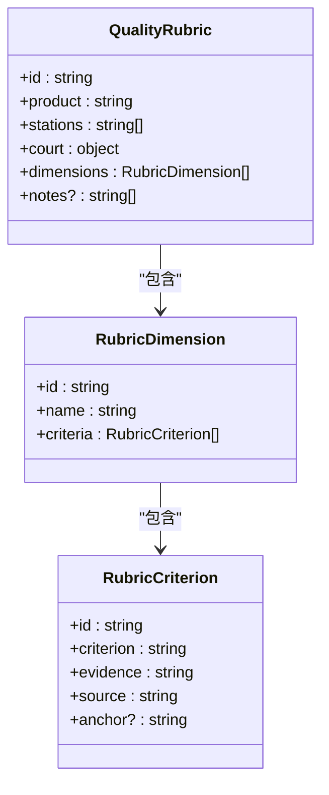
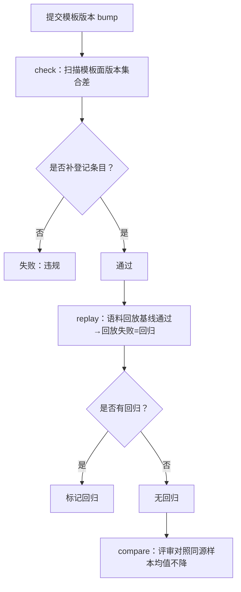
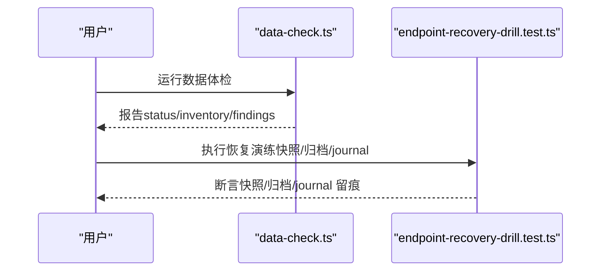
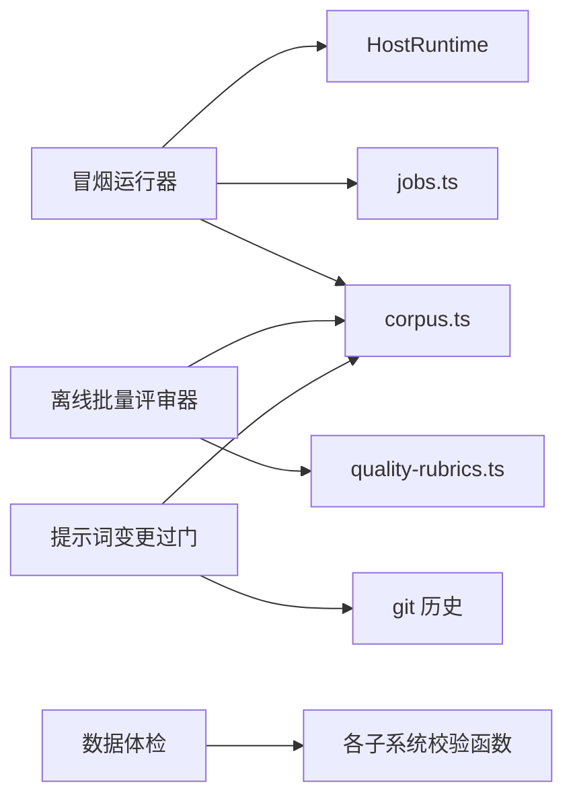

# 验证与回滚

<cite>
**本文引用的文件**
- [src/host/smoke.ts](file://src/host/smoke.ts)
- [src/engine/quality-review.ts](file://src/engine/quality-review.ts)
- [src/engine/quality-rubrics.ts](file://src/engine/quality-rubrics.ts)
- [src/engine/quality-audit.ts](file://src/engine/quality-audit.ts)
- [src/host/handlers.ts](file://src/host/handlers.ts)
- [scripts/prompt-bump.mts](file://scripts/prompt-bump.mts)
- [tests/README.md](file://tests/README.md)
- [src/engine/data-check.ts](file://src/engine/data-check.ts)
- [tests/endpoint-recovery-drill.test.ts](file://tests/endpoint-recovery-drill.test.ts)
- [package.json](file://package.json)
</cite>

## 目录
1. [简介](#简介)
2. [项目结构](#项目结构)
3. [核心组件](#核心组件)
4. [架构总览](#架构总览)
5. [详细组件分析](#详细组件分析)
6. [依赖关系分析](#依赖关系分析)
7. [性能考量](#性能考量)
8. [故障排查指南](#故障排查指南)
9. [结论](#结论)
10. [附录](#附录)

## 简介
本文件围绕“验证与回滚”主题，系统化说明该仓库的修复效果验证机制、质量检查与性能监控，以及回滚策略（版本快照、依赖分析与安全回滚路径）、验证规则配置与管理、自动化与手动回滚步骤，以及验证失败的处理流程与故障恢复程序。内容基于仓库中的冒烟运行器、离线批量评审器、质量量规与审计、提示词变更过门装置、数据体检与端点恢复演练等实现进行归纳。

## 项目结构
与验证和回滚直接相关的代码主要分布在以下位置：
- 生成冒烟运行器：在宿主侧以临时 vault 跑通全管线并产出结构断言报告，用于捕捉模型升级或供应商切换导致的格式漂移。
- 离线批量评审器：从生成语料抽样，按质量量规逐维度评分，输出人读报告与稳定性读数。
- 质量量规与审计：定义五份量规与法庭元数据，提供系统性候选蒸馏能力。
- 提示词变更过门装置：提交级登记门、语料回放与评审对照，确保模板版本变更可追踪且可回放。
- 数据体检：只读盘点学习者数据，覆盖注册表、图、笔记、题库、笔记源、我的卡、错误卡、概念登记表、终点锚、存档区、边实验账本、提案、生成任务、证据流等。
- 端点恢复演练：通过快照与归档、日志留痕验证处置生效与可回溯性。

图表来源
- [src/host/smoke.ts:1-120](file://src/host/smoke.ts#L1-L120)
- [src/engine/quality-review.ts:1-120](file://src/engine/quality-review.ts#L1-L120)
- [src/engine/quality-rubrics.ts:18-71](file://src/engine/quality-rubrics.ts#L18-L71)
- [src/engine/quality-audit.ts:14-38](file://src/engine/quality-audit.ts#L14-L38)
- [scripts/prompt-bump.mts:154-170](file://scripts/prompt-bump.mts#L154-L170)
- [src/engine/data-check.ts:1-131](file://src/engine/data-check.ts#L1-L131)
- [tests/endpoint-recovery-drill.test.ts:177-191](file://tests/endpoint-recovery-drill.test.ts#L177-L191)

章节来源
- [src/host/smoke.ts:1-120](file://src/host/smoke.ts#L1-L120)
- [src/engine/quality-review.ts:1-120](file://src/engine/quality-review.ts#L1-L120)
- [src/engine/quality-rubrics.ts:18-71](file://src/engine/quality-rubrics.ts#L18-L71)
- [src/engine/quality-audit.ts:14-38](file://src/engine/quality-audit.ts#L14-L38)
- [scripts/prompt-bump.mts:154-170](file://scripts/prompt-bump.mts#L154-L170)
- [src/engine/data-check.ts:1-131](file://src/engine/data-check.ts#L1-L131)
- [tests/endpoint-recovery-drill.test.ts:177-191](file://tests/endpoint-recovery-drill.test.ts#L177-L191)

## 核心组件
- 生成冒烟运行器：在临时 vault 中执行种子起草→正文管线→结构断言复跑，汇总站点成功率、失败码分布、token 用量与产物断言，给出 ok/partial/failed 裁决。
- 离线批量评审器：确定性抽样（失败/容忍优先 + 成功件等距），两段式防锚定评审（盲评+对账），逐维度评分与证据定位核对，聚合分布、低分件清单、模板版本对照与稳定性读数。
- 质量量规与审计：五份量规（大纲/节正文/题目/教练回合/种子·终点）与法庭元数据；审计面将低分件与判据出处蒸馏为系统性候选。
- 提示词变更过门装置：提交级登记门（bump 必须补登记条目）、语料回放（基线通过→回放失败即回归）、评审对照（同源样本上均值不降）。
- 数据体检：只读盘点各区域状态（Missing/Broken/Archived/Hint），覆盖笔记源指纹、提案/任务注册表、证据流完整性等。
- 端点恢复演练：通过快照 v1/v2、正文归档与 journal 留痕验证处置生效与可回溯性。

章节来源
- [src/host/smoke.ts:32-112](file://src/host/smoke.ts#L32-L112)
- [src/engine/quality-review.ts:41-66](file://src/engine/quality-review.ts#L41-L66)
- [src/engine/quality-rubrics.ts:18-71](file://src/engine/quality-rubrics.ts#L18-L71)
- [src/engine/quality-audit.ts:23-38](file://src/engine/quality-audit.ts#L23-L38)
- [scripts/prompt-bump.mts:154-170](file://scripts/prompt-bump.mts#L154-L170)
- [src/engine/data-check.ts:33-131](file://src/engine/data-check.ts#L33-L131)
- [tests/endpoint-recovery-drill.test.ts:177-191](file://tests/endpoint-recovery-drill.test.ts#L177-L191)

## 架构总览
验证与回滚的整体流程由“冒烟运行器”与“离线批量评审器”构成双轨保障：前者在真实宿主环境中快速验证管线连通性与结构契约，后者在离线语料上按量规进行稳定、可复算的质量评估；提示词变更过门装置保证模板版本变更的可追溯与可回放；数据体检与端点恢复演练提供运行时健康与处置可回溯性。

图表来源
- [src/host/smoke.ts:262-387](file://src/host/smoke.ts#L262-L387)
- [src/engine/quality-review.ts:120-160](file://src/engine/quality-review.ts#L120-L160)
- [src/engine/quality-rubrics.ts:18-71](file://src/engine/quality-rubrics.ts#L18-L71)
- [src/engine/quality-audit.ts:23-38](file://src/engine/quality-audit.ts#L23-L38)
- [scripts/prompt-bump.mts:154-170](file://scripts/prompt-bump.mts#L154-L170)
- [src/engine/data-check.ts:33-131](file://src/engine/data-check.ts#L33-L131)
- [tests/endpoint-recovery-drill.test.ts:177-191](file://tests/endpoint-recovery-drill.test.ts#L177-L191)

## 详细组件分析

### 冒烟运行器（生成冒烟）
- 目标：在临时 vault 中跑通全管线，产出结构断言报告，专门捕捉模型升级/换供应商导致的格式漂移。
- 关键行为：
  - 创建临时 vault，装配宿主 runtime，设置最小成本参数（题量封顶、第二意见门默认关）。
  - 种子起草→提案直通→正文管线（大纲→逐节→出题），等待任务终态。
  - 收集站点统计（成功率、失败码分布、usage token 求和）。
  - 复跑既有结构门（contentCheck、validateByContract、bank.load 读回）。
  - 裁决三态：ok/partial/failed，驱动脚本据此决定退出码。
- 隔离纪律：全部写入临时目录，结束后删除；真实 vault 零接触。

图表来源
- [src/host/smoke.ts:262-387](file://src/host/smoke.ts#L262-L387)

章节来源
- [src/host/smoke.ts:1-120](file://src/host/smoke.ts#L1-L120)
- [src/host/smoke.ts:262-387](file://src/host/smoke.ts#L262-L387)

### 离线批量评审器（质量评审）
- 目标：从生成语料抽样，按质量量规逐维度评分，输出人读报告与稳定性读数。
- 关键行为：
  - 确定性抽样：失败/容忍命中优先定额，成功件等距补足。
  - 两段式防锚定：一期盲评（不给生成提示词与元数据），二期对账（给生成提示词与元数据，允许修正并标注 revised）。
  - 证据定位核对：引文去空白后必须在产物原文中找到（≥12 字前缀兜底），找不到记 unlocated。
  - 聚合读数：逐（站×维度）分布、低分件清单、模板版本对照视图、重复评审稳定性（一致率与平均档差）。
  - 温度固定 0、effort 恒 deep，保证可比性与可复算。
- 入口：POST /learnhub/api/quality-review（命令无引擎型白名单）。

图表来源
- [src/host/handlers.ts:218-235](file://src/host/handlers.ts#L218-L235)
- [src/engine/quality-review.ts:120-160](file://src/engine/quality-review.ts#L120-L160)
- [src/engine/quality-rubrics.ts:18-71](file://src/engine/quality-rubrics.ts#L18-L71)

章节来源
- [src/host/handlers.ts:218-235](file://src/host/handlers.ts#L218-L235)
- [src/engine/quality-review.ts:41-66](file://src/engine/quality-review.ts#L41-L66)
- [src/engine/quality-review.ts:120-160](file://src/engine/quality-review.ts#L120-L160)
- [src/engine/quality-review.ts:227-261](file://src/engine/quality-review.ts#L227-L261)
- [src/engine/quality-review.ts:300-362](file://src/engine/quality-review.ts#L300-L362)
- [src/engine/quality-review.ts:412-463](file://src/engine/quality-review.ts#L412-L463)
- [src/engine/quality-review.ts:465-501](file://src/engine/quality-review.ts#L465-L501)
- [src/engine/quality-review.ts:516-545](file://src/engine/quality-review.ts#L516-L545)
- [src/engine/quality-review.ts:547-593](file://src/engine/quality-review.ts#L547-L593)

### 质量量规与审计
- 量规：五份量规（大纲/节正文/题目/教练回合/种子·终点），每条判据包含判定标准、证据要求与出处；法庭元数据声明 AI 评分=提议、人审=终审、结果法院各守领域。
- 审计：提供站×维度的判据引用映射，支持系统性候选蒸馏（低分率越预注册线的候选，带低分件引用与判据出处）。

图表来源
- [src/engine/quality-rubrics.ts:18-71](file://src/engine/quality-rubrics.ts#L18-L71)

章节来源
- [src/engine/quality-rubrics.ts:18-71](file://src/engine/quality-rubrics.ts#L18-L71)
- [src/engine/quality-audit.ts:23-38](file://src/engine/quality-audit.ts#L23-L38)

### 提示词变更过门装置（版本快照与依赖分析）
- 提交级登记门：模板版本 bump 的提交必须同提交补 PROMPT_CHANGELOG 条目；动态发现纪律起点，两段式扫描（git log -p → git show 取版本集合差）。
- 语料回放：站→离线解析面注册表回放，仅当“基线通过→回放失败”计为回归；零样本按失败处理。
- 评审对照：两份 quality-review 报告在同源样本上逐（站×维度）均值不降，否则拒绝比对。

图表来源
- [scripts/prompt-bump.mts:154-170](file://scripts/prompt-bump.mts#L154-L170)
- [scripts/prompt-bump.mts:439-467](file://scripts/prompt-bump.mts#L439-L467)

章节来源
- [scripts/prompt-bump.mts:154-170](file://scripts/prompt-bump.mts#L154-L170)
- [scripts/prompt-bump.mts:439-467](file://scripts/prompt-bump.mts#L439-L467)

### 数据体检与端点恢复演练（回滚路径与故障恢复）
- 数据体检：只读盘点各区域状态（Missing/Broken/Archived/Hint），覆盖注册表、图、笔记、题库、笔记源、我的卡、错误卡、概念登记表、终点锚、存档区、边实验账本、提案、生成任务、证据流等；不修复、不清理、不写入 Vault。
- 端点恢复演练：通过快照 v1/v2、正文归档与 journal 留痕验证处置生效与可回溯性；测试断言快照保留/移除综述、归档区 del-<提案id>- 前缀、journal 两笔 graph_edit 留痕。

图表来源
- [src/engine/data-check.ts:33-131](file://src/engine/data-check.ts#L33-L131)
- [tests/endpoint-recovery-drill.test.ts:177-191](file://tests/endpoint-recovery-drill.test.ts#L177-L191)

章节来源
- [src/engine/data-check.ts:33-131](file://src/engine/data-check.ts#L33-L131)
- [tests/endpoint-recovery-drill.test.ts:177-191](file://tests/endpoint-recovery-drill.test.ts#L177-L191)

## 依赖关系分析
- 冒烟运行器依赖宿主 runtime、队列与语料捕获，复用生产入队/执行路径，避免复制逻辑。
- 离线批量评审器依赖质量量规与语料捕获，评审调用本身也进入语料（站标签“质量评审”）。
- 提示词变更过门装置依赖 git 历史与语料回放注册表，确保模板版本变更可追踪与可回放。
- 数据体检依赖各子系统校验函数（note-source、question-bank、concepts、seed、store、io 等），统一输出标准化报告。

图表来源
- [src/host/smoke.ts:262-387](file://src/host/smoke.ts#L262-L387)
- [src/engine/quality-review.ts:120-160](file://src/engine/quality-review.ts#L120-L160)
- [scripts/prompt-bump.mts:154-170](file://scripts/prompt-bump.mts#L154-L170)
- [src/engine/data-check.ts:33-131](file://src/engine/data-check.ts#L33-L131)

章节来源
- [src/host/smoke.ts:262-387](file://src/host/smoke.ts#L262-L387)
- [src/engine/quality-review.ts:120-160](file://src/engine/quality-review.ts#L120-L160)
- [scripts/prompt-bump.mts:154-170](file://scripts/prompt-bump.mts#L154-L170)
- [src/engine/data-check.ts:33-131](file://src/engine/data-check.ts#L33-L131)

## 性能考量
- 冒烟运行器采用最小成本档（题量默认 4、第二意见门默认关），并在临时 vault 中运行，避免影响生产数据。
- 离线批量评审器温度固定 0、effort 恒 deep，保证可比性与可复算；抽样确定性（无随机数）便于回放与对比。
- 提示词变更过门装置的 check 使用两段式扫描（先 git log -p 找候选，再 git show 取版本集合差），减少开销。
- 数据体检为只读操作，不写入 Vault，适合频繁运行。

[本节为通用指导，无需特定文件来源]

## 故障排查指南
- 冒烟失败：查看报告中的站点统计与失败码分布，确认是否为站级异常或结构断言失败；若为解析回归，可在报告中看到对应站的 outcome=failed 与失败码。
- 评审失败：评审失败≠产物差，报告单列未评分件与评审失败原因；检查证据定位核对（unlocated）与二期对账修正（revised）。
- 提示词变更违规：check 失败时检查是否同提交补登记条目；replay 失败时检查基线是否通过；compare 失败时检查样本是否同源与维度集合是否一致。
- 数据体检问题：根据 findings 的定位与原因（如 note_source_file_missing、proposals_json_parse 等）进行修复；注意 archived 信息级盘点不进 status。
- 端点恢复演练：检查快照 v1/v2、归档区 del-<提案id>- 前缀与 journal 留痕，确认处置生效与可回溯性。

章节来源
- [src/host/smoke.ts:262-387](file://src/host/smoke.ts#L262-L387)
- [src/engine/quality-review.ts:194-226](file://src/engine/quality-review.ts#L194-L226)
- [scripts/prompt-bump.mts:439-467](file://scripts/prompt-bump.mts#L439-L467)
- [src/engine/data-check.ts:33-131](file://src/engine/data-check.ts#L33-L131)
- [tests/endpoint-recovery-drill.test.ts:177-191](file://tests/endpoint-recovery-drill.test.ts#L177-L191)

## 结论
该仓库通过冒烟运行器与离线批量评审器构建了“写路径真模型验证 + 读路径离线质量评估”的双轨机制，辅以提示词变更过门装置确保模板版本变更可追踪与可回放；数据体检与端点恢复演练提供运行时健康与处置可回溯性。整体设计强调确定性、可复算与可观测性，为修复效果的验证与回滚提供了坚实基础。

[本节为总结，无需特定文件来源]

## 附录
- 常用脚本与命令：
  - npm run smoke：运行冒烟。
  - npm run quality-review：运行离线批量评审。
  - npm run prompt-bump：提示词变更过门工具。
  - npm test：类型检查 + 全部测试。

章节来源
- [package.json:38-47](file://package.json#L38-L47)
- [tests/README.md:27-112](file://tests/README.md#L27-L112)