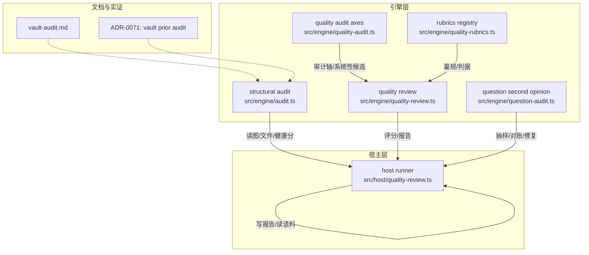
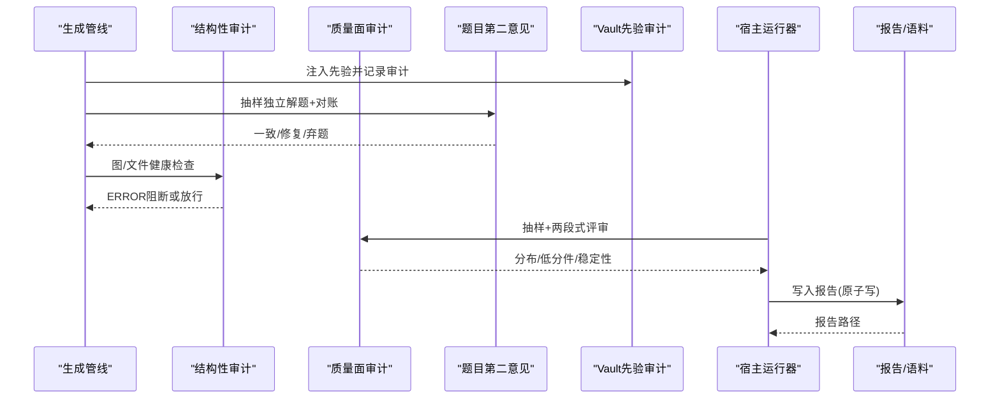
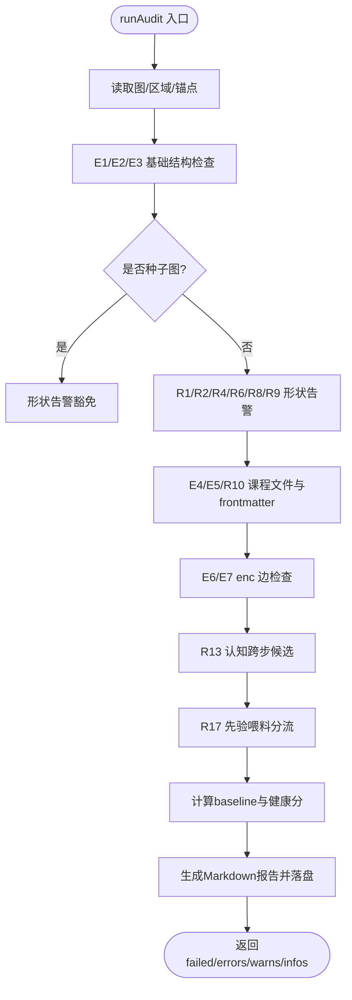
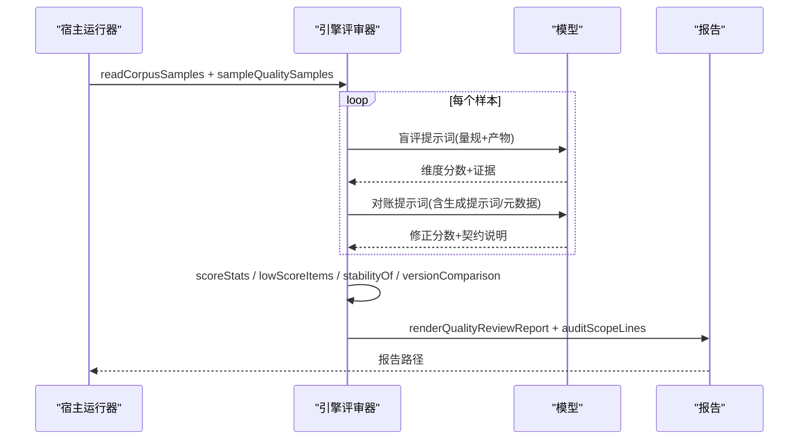
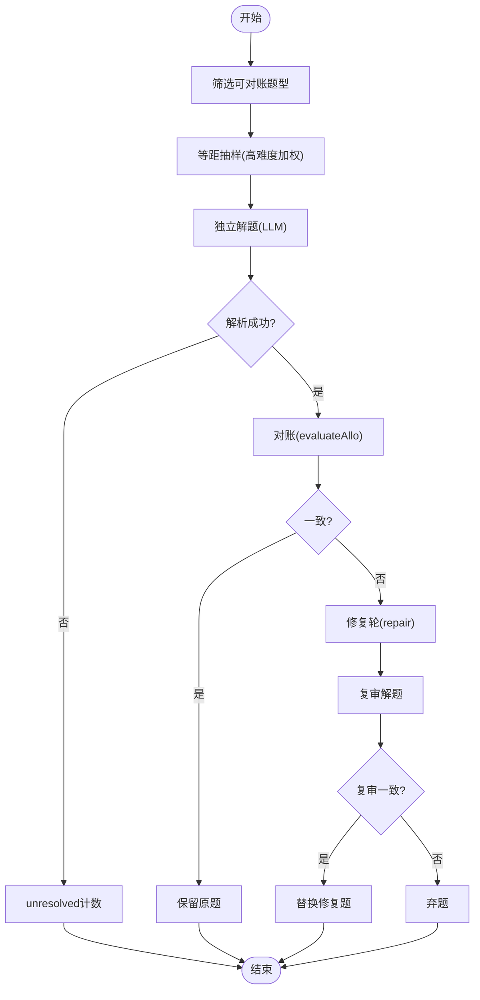
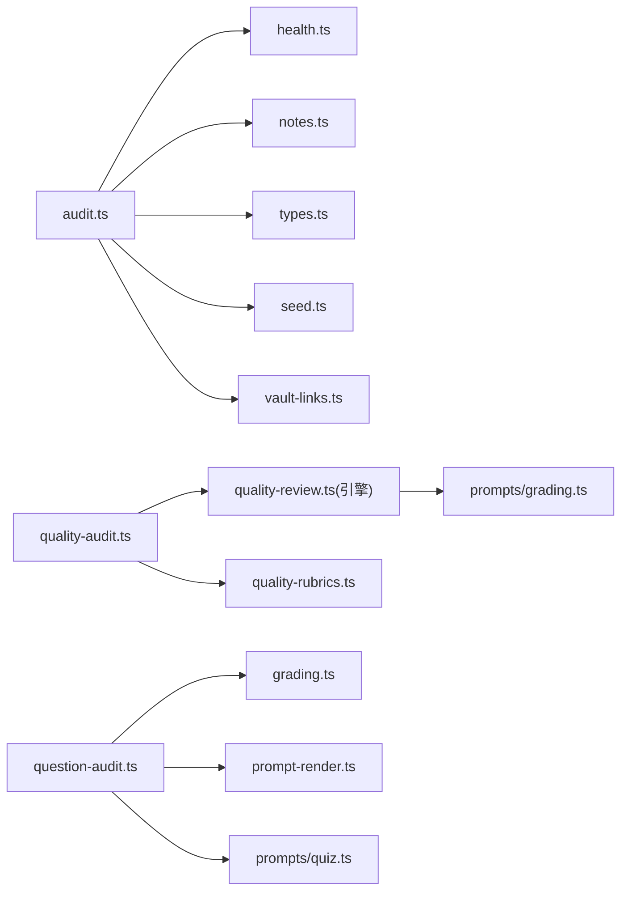

# 审计系统

<cite>
**本文引用的文件**
- [audit.ts](file://src/engine/audit.ts)
- [quality-audit.ts](file://src/engine/quality-audit.ts)
- [question-audit.ts](file://src/engine/question-audit.ts)
- [quality-review.ts（引擎）](file://src/engine/quality-review.ts)
- [quality-review.ts（宿主）](file://src/host/quality-review.ts)
- [quality-rubrics.ts](file://src/engine/quality-rubrics.ts)
- [vault-audit.md](file://docs/research/vault-audit.md)
- [0071-vault-prior-bm25-and-audit.md](file://docs/adr/0071-vault-prior-bm25-and-audit.md)
</cite>

## 目录
1. [简介](#简介)
2. [项目结构](#项目结构)
3. [核心组件](#核心组件)
4. [架构总览](#架构总览)
5. [详细组件分析](#详细组件分析)
6. [依赖关系分析](#依赖关系分析)
7. [性能考量](#性能考量)
8. [故障排查指南](#故障排查指南)
9. [结论](#结论)
10. [附录](#附录)

## 简介
本审计系统围绕“结构性健康”“内容质量面”“题目第二意见”“先验检索可观测”四大维度，形成从发现、评估到报告与反馈的闭环：
- 结构性审计：对图谱与课程文件的完整性、一致性进行门控式检查（ERROR/WARN/INFO），并输出基线与报告。
- 质量面审计：基于量规表对“教练回合裁决质量”和“种子/终点资格”进行抽样评审，系统性发现候选（低分率统计+趋势分析）。
- 题目第二意见：独立解题+答案键对账，不一致时触发修复轮，仍不一致则弃题，保障学习者不遭遇错误题目。
- Vault 先验审计：BM25 打分与检索审计，记录零命中、截断、扩展等关键信号，随生成回执带出。

## 项目结构
审计相关代码主要分布在 engine 与 host 两层：
- engine：纯函数实现、数据聚合、提示词组装、报告渲染、门控逻辑。
- host：适配文件系统、模型调用、语料读取与落盘。

图表来源
- [audit.ts:35-315](file://src/engine/audit.ts#L35-L315)
- [quality-review.ts（引擎）:126-235](file://src/engine/quality-review.ts#L126-L235)
- [quality-audit.ts:50-120](file://src/engine/quality-audit.ts#L50-L120)
- [question-audit.ts:168-279](file://src/engine/question-audit.ts#L168-L279)
- [quality-rubrics.ts:60-440](file://src/engine/quality-rubrics.ts#L60-L440)
- [quality-review.ts（宿主）:126-241](file://src/host/quality-review.ts#L126-L241)

章节来源
- [audit.ts:35-315](file://src/engine/audit.ts#L35-L315)
- [quality-review.ts（引擎）:126-235](file://src/engine/quality-review.ts#L126-L235)
- [quality-audit.ts:50-120](file://src/engine/quality-audit.ts#L50-L120)
- [question-audit.ts:168-279](file://src/engine/question-audit.ts#L168-L279)
- [quality-rubrics.ts:60-440](file://src/engine/quality-rubrics.ts#L60-L440)
- [quality-review.ts（宿主）:126-241](file://src/host/quality-review.ts#L126-L241)

## 核心组件
- 结构性审计（audit.ts）
  - 入口 runAudit：扫描节点重名、未定义前置、环、课程文件同步、frontmatter schema、enc 边、深度异常、冗余前置、连通分量、别名、认知跨步候选、先验喂料分流、概念字段组盘点；输出 baseline、exempt 与 Markdown 报告。
  - 种子图豁免：当图仍为锚集合种子节点并集时，形状类告警豁免，但 ERROR 仍执行。
- 质量面审计（quality-audit.ts + quality-review.ts）
  - 审计轴 AUDIT_AXES：教练回合裁决质量、种子/终点资格。
  - 系统性候选 systemicCandidates：按（站×维度）计算低分率，超过阈值即入候选（提议，需人审）。
  - 评审器：两段式盲评+对账，固定温度，稳定性读数，模板版本对照，证据定位核对。
- 题目第二意见（question-audit.ts）
  - 确定性等距抽样，高难度加权恒入样；独立解题→对账→修复轮→复审；不可解析保守放行。
- Vault 先验审计（ADR-0071）
  - BM25 打分、查询扩展、审计对象包含 zeroHit/scanTruncated/hitsTrimmed/expansionError 等，随生成回执带出。

章节来源
- [audit.ts:35-315](file://src/engine/audit.ts#L35-L315)
- [quality-audit.ts:50-120](file://src/engine/quality-audit.ts#L50-L120)
- [quality-review.ts（引擎）:126-235](file://src/engine/quality-review.ts#L126-L235)
- [question-audit.ts:168-279](file://src/engine/question-audit.ts#L168-L279)
- [0071-vault-prior-bm25-and-audit.md:1-72](file://docs/adr/0071-vault-prior-bm25-and-audit.md#L1-L72)

## 架构总览
审计系统由“检测—评估—报告—反馈”四段组成：
- 检测：结构性审计与题目第二意见在生成/结算前拦截问题；Vault 先验审计提供可观测性。
- 评估：质量面审计基于量规表进行两段式评审，产出分布与低分件。
- 报告：Markdown 报告含基线指标、分层统计、证据引用、模板版本对照、稳定性读数。
- 反馈：系统性候选进入票面，人审裁决后驱动量规/提示词/流程改进，效果通过下一轮评审对比。

图表来源
- [question-audit.ts:168-279](file://src/engine/question-audit.ts#L168-L279)
- [audit.ts:35-315](file://src/engine/audit.ts#L35-L315)
- [quality-review.ts（宿主）:126-241](file://src/host/quality-review.ts#L126-L241)

## 详细组件分析

### 结构性审计（coach-round 与 seed-endpoint 的健康面）
- 设计要点
  - 以图结构为中心：节点命名唯一性、前置定义、环检测、连通分量、深度异常、冗余边、enc 边合法性。
  - 课程文件与图同步：E4/E5/R10 校验 frontmatter stage/fsrs/content.status 等。
  - 认知跨步候选：R13 综合难度差与 depth 跨度，仅列前 15，全量走 analyze。
  - 先验喂料分流：R17 将 w≥0.7 的 vault 链接候选暴露给结构显式回应（pre/enc）。
  - 种子图豁免：形状告警豁免，但 ERROR 照查；健康分不设阈值。
- 报告与可视化
  - baseline 包含节点数、边数、根/叶子、图深度、课程文件数、终点锚、健康分等。
  - 报告分节：ERROR/WARN/INFO、未生成豁免登记、概念字段组盘点。

图表来源
- [audit.ts:35-315](file://src/engine/audit.ts#L35-L315)

章节来源
- [audit.ts:35-315](file://src/engine/audit.ts#L35-L315)

### 质量面审计（教练回合裁决质量、种子/终点资格）
- 审计轴与维度
  - 教练回合：生长纪律、算子语义、裁决与路线。
  - 种子/终点：起点资格、终点资格、骨架与路由。
- 系统性发现候选
  - 逐（站×维度）计算低分率，达到预注册线（默认 minSamples=2, lowRate=0.5）即入候选。
  - 候选附带 refs（低分件证据）与 criteria（判据出处），供人审贴票与改量规。
- 评审流程
  - 两段式防锚定：一期盲评（只给量规+产物原文），二期对账（加入生成提示词与元数据）。
  - 固定温度、重复评审稳定性读数、模板版本对照视图。
  - 证据定位核对：引文必须在产物原文中可定位，否则记 unlocated。

图表来源
- [quality-review.ts（宿主）:126-241](file://src/host/quality-review.ts#L126-L241)
- [quality-review.ts（引擎）:182-235](file://src/engine/quality-review.ts#L182-L235)

章节来源
- [quality-audit.ts:50-120](file://src/engine/quality-audit.ts#L50-L120)
- [quality-review.ts（引擎）:182-235](file://src/engine/quality-review.ts#L182-L235)
- [quality-review.ts（宿主）:126-241](file://src/host/quality-review.ts#L126-L241)
- [quality-rubrics.ts:292-440](file://src/engine/quality-rubrics.ts#L292-L440)

### 题目第二意见（独立解题+对账+修复）
- 抽样策略：等距抽样，difficulty=3 恒入样；客观题型才可对账。
- 流程：独立解题 → 对账（evaluateAllo） → 不一致则修复轮（kind='repair'） → 复审 → 仍不一致弃题。
- 保守放行：solver 输出不可解析 = unresolved，不阻塞整批。

图表来源
- [question-audit.ts:95-108](file://src/engine/question-audit.ts#L95-L108)
- [question-audit.ts:168-279](file://src/engine/question-audit.ts#L168-L279)

章节来源
- [question-audit.ts:95-108](file://src/engine/question-audit.ts#L95-L108)
- [question-audit.ts:168-279](file://src/engine/question-audit.ts#L168-L279)

### Vault 先验审计（BM25 与可观测性）
- 打分换核：IDF × 词频饱和 × 长度归一 + 标题字段加权。
- 查询扩展：概念登记表别名与易混概念低权重并入，只做一级。
- 审计对象：terms、expanded、scanned、matched、scanTruncated、hitsTrimmed、zeroHit、hitPaths、expansionError。
- 行为快照：注入面不变，审计走 onPrior 回调，随生成回执带出。

章节来源
- [0071-vault-prior-bm25-and-audit.md:1-72](file://docs/adr/0071-vault-prior-bm25-and-audit.md#L1-L72)

## 依赖关系分析
- 耦合与内聚
  - audit.ts 依赖 graph/health/notes/types/dates/seed/vault-links，职责清晰且边界明确。
  - quality-audit.ts 仅依赖 quality-review.ts 与 quality-rubrics.ts，保持审计轴与评审器的解耦。
  - question-audit.ts 依赖 grading/prompt-render/prompts，对外部 LLM 端口抽象化。
- 外部依赖
  - 宿主层负责 fs、llmSeam、corpus 读写；引擎层零副作用、纯函数。
- 循环依赖
  - 通过类型与常量对齐避免环（如 station 名称、rubric id）。

图表来源
- [audit.ts:13-24](file://src/engine/audit.ts#L13-L24)
- [quality-audit.ts:18-21](file://src/engine/quality-audit.ts#L18-L21)
- [quality-review.ts（引擎）:29-35](file://src/engine/quality-review.ts#L29-L35)
- [question-audit.ts:19-24](file://src/engine/question-audit.ts#L19-L24)

章节来源
- [audit.ts:13-24](file://src/engine/audit.ts#L13-L24)
- [quality-audit.ts:18-21](file://src/engine/quality-audit.ts#L18-L21)
- [quality-review.ts（引擎）:29-35](file://src/engine/quality-review.ts#L29-L35)
- [question-audit.ts:19-24](file://src/engine/question-audit.ts#L19-L24)

## 性能考量
- 结构性审计
  - 大图浅叶子与单浅前置叶子仅列前 15，避免报告淹没。
  - 种子图豁免减少噪音，提升效率。
- 质量面审计
  - 固定温度与重复次数控制成本；两阶段评审仅在宿主侧调用模型。
  - 证据定位核对为 O(n) 字符串匹配，代价可控。
- 题目第二意见
  - 等距抽样降低 LLM 调用成本；高难度加权确保关键题被覆盖。
  - 修复轮仅对不一致题触发，减少不必要开销。
- Vault 先验审计
  - BM25 一次扫面完成 IDF/TF/长度归一，避免多遍 IO。
  - maxFiles 截断与 mtime 优先减少无关文件影响。

[本节为通用指导，不直接分析具体文件]

## 故障排查指南
- 结构性审计失败（ERROR）
  - E1 重名：检查节点命名冲突。
  - E2 未定义前置：补齐前置或移除无效引用。
  - E3 环：调整依赖方向消除环。
  - E4/E5：修正课程文件位置与 frontmatter schema。
  - E6/E7：修复 enc 边指向与祖先关系。
- 质量面审计低分
  - 查看低分件清单与证据引用，确认是否评审失败（failure）而非产物差。
  - 关注稳定性读数与模板版本对照，识别漂移。
- 题目第二意见不一致
  - 检查 solver 输出解析与 evaluateAllo 比较器输入形态。
  - 修复轮失败则弃题，避免污染题库。
- Vault 先验零命中
  - 检查检索词派生、登记表扩展、扫描截断与命中裁剪。
  - 结合 vault-audit.md 实证，定位 est/difficulty 失真与膨胀问题。

章节来源
- [audit.ts:46-253](file://src/engine/audit.ts#L46-L253)
- [quality-review.ts（引擎）:392-408](file://src/engine/quality-review.ts#L392-L408)
- [question-audit.ts:198-279](file://src/engine/question-audit.ts#L198-L279)
- [vault-audit.md:11-22](file://docs/research/vault-audit.md#L11-L22)

## 结论
本审计系统以“结构化健康+内容质量面+题目第二意见+先验可观测”构成完整闭环：
- 结构性审计提供门控与基线，保障图与文件一致性。
- 质量面审计通过量规与两段式评审，系统化发现候选并沉淀证据。
- 题目第二意见在生成期拦截键错题，提升题库可靠性。
- Vault 先验审计增强个性化生成的可观测性与可诊断性。
建议持续优化：校准阈值（minSamples/lowRate）、扩大样本配额、引入更多稳定性读数与模板版本对比，推动量规与提示词的渐进改进。

[本节为总结，不直接分析具体文件]

## 附录
- 审计报告生成机制
  - 基线指标：节点/边/根/叶子/深度/课程文件/健康分等。
  - 分层统计：分布、低分件、稳定性、版本对照。
  - 证据收集：引文定位核对，unlocated 显式列出。
  - 结论提炼：审计面声明、系统性候选、票面贴行。
- 配置与频率
  - 质量面审计：badQuota/okQuota/repeats/systemic.minSamples/systemic.lowRate。
  - 题目第二意见：rate（默认 0.25），≤0 关闭。
  - 结构性审计：种子图豁免自动生效。
- 数据导出与分析
  - 报告落盘：atomicPut 原子写，文件名含时间戳与范围。
  - 语料回放：readCorpusSamples 支持历史语料目录。
  - 实证参考：vault-audit.md 提供真实数据洞察。

章节来源
- [quality-review.ts（宿主）:230-241](file://src/host/quality-review.ts#L230-L241)
- [quality-review.ts（引擎）:412-545](file://src/engine/quality-review.ts#L412-L545)
- [question-audit.ts:47-71](file://src/engine/question-audit.ts#L47-L71)
- [vault-audit.md:1-61](file://docs/research/vault-audit.md#L1-L61)