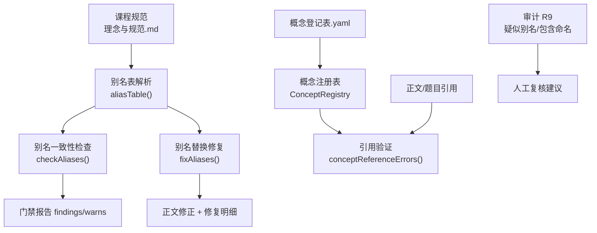
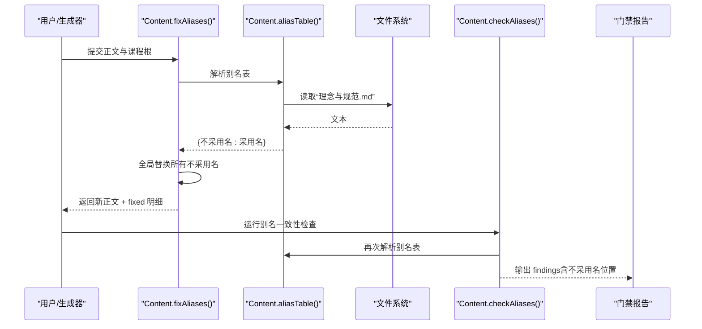
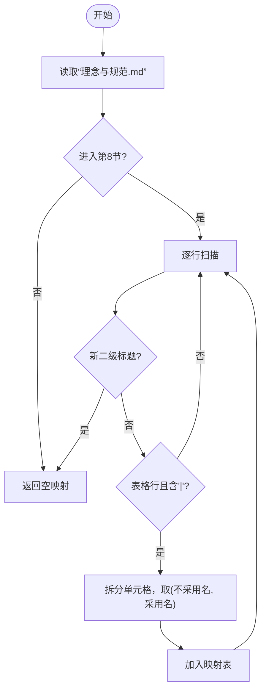
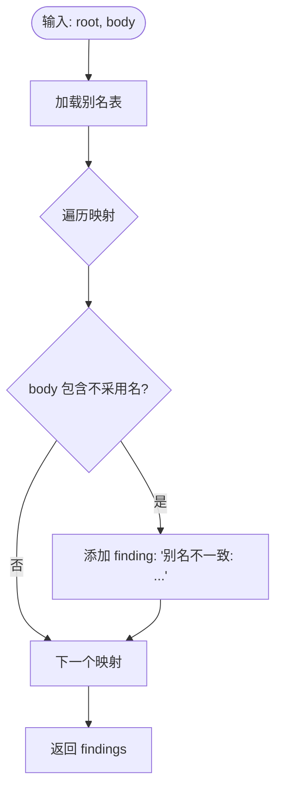
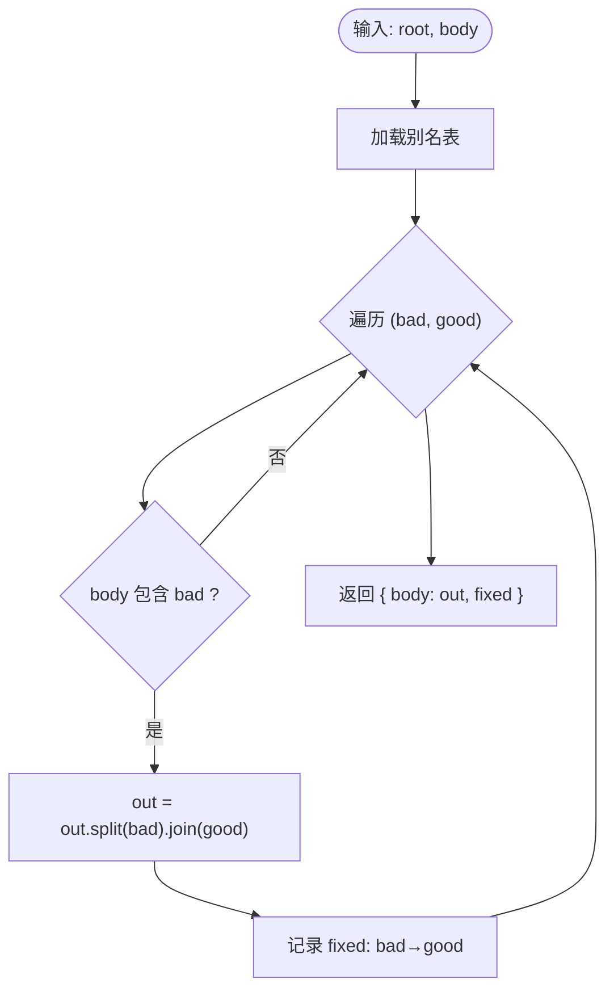
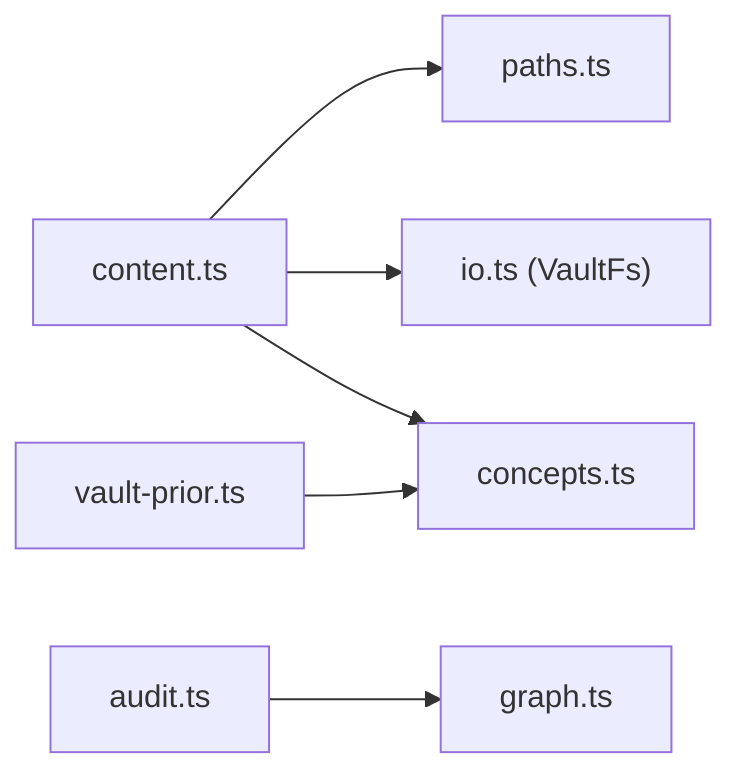

# 别名一致性检查

<cite>
**本文引用的文件**
- [src/engine/content.ts](file://src/engine/content.ts)
- [src/engine/concepts.ts](file://src/engine/concepts.ts)
- [src/engine/audit.ts](file://src/engine/audit.ts)
- [src/engine/vault-prior.ts](file://src/engine/vault-prior.ts)
- [src/engine/content-subsystem.ts](file://src/engine/content-subsystem.ts)
- [tests/copy-lock.test.ts](file://tests/copy-lock.test.ts)
- [tests/concept-registry.test.ts](file://tests/concept-registry.test.ts)
- [tests/vault-prior.test.ts](file://tests/vault-prior.test.ts)
</cite>

## 目录
1. [简介](#简介)
2. [项目结构](#项目结构)
3. [核心组件](#核心组件)
4. [架构总览](#架构总览)
5. [详细组件分析](#详细组件分析)
6. [依赖关系分析](#依赖关系分析)
7. [性能考量](#性能考量)
8. [故障排查指南](#故障排查指南)
9. [结论](#结论)
10. [附录](#附录)

## 简介
本文件系统化说明“别名一致性检查”的机制与实现，覆盖以下目标：
- 术语映射表（别名表）维护机制：从课程规范文件中解析别名表的实现细节。
- 跨文档引用验证逻辑：基于概念登记表的精确匹配、大小写处理与边界情况。
- 别名替换算法：全局替换策略与冲突解决机制。
- 配置格式示例与自定义规则开发指南。
- 常见不一致问题的诊断方法与自动修复流程。

该能力贯穿内容质检门、程序化修复、检索扩展与审计提示，确保课程内术语一致、可追溯、可演进。

## 项目结构
与别名一致性相关的关键代码集中在引擎层的内容子系统与概念子系统：
- 内容子系统负责从课程规范中解析别名表、执行别名一致性检查与程序化修复。
- 概念子系统提供概念登记表的读写、校验、合并与引用验证。
- 审计模块对命名包含关系进行启发式提示，辅助发现潜在别名问题。
- 先验检索将别名作为低权重召回扩展词，提升检索召回率。



图表来源
- [src/engine/content.ts:383-400](file://src/engine/content.ts#L383-L400)
- [src/engine/content.ts:483-488](file://src/engine/content.ts#L483-L488)
- [src/engine/content.ts:592-603](file://src/engine/content.ts#L592-L603)
- [src/engine/concepts.ts:114-138](file://src/engine/concepts.ts#L114-L138)
- [src/engine/concepts.ts:157-163](file://src/engine/concepts.ts#L157-L163)
- [src/engine/audit.ts:126-137](file://src/engine/audit.ts#L126-L137)

章节来源
- [src/engine/content.ts:383-400](file://src/engine/content.ts#L383-L400)
- [src/engine/content.ts:483-488](file://src/engine/content.ts#L483-L488)
- [src/engine/content.ts:592-603](file://src/engine/content.ts#L592-L603)
- [src/engine/concepts.ts:114-138](file://src/engine/concepts.ts#L114-L138)
- [src/engine/concepts.ts:157-163](file://src/engine/concepts.ts#L157-L163)
- [src/engine/audit.ts:126-137](file://src/engine/audit.ts#L126-L137)

## 核心组件
- 别名表解析器：从课程根下的“理念与规范.md”第8节表格中抽取“不采用名→采用名”的映射。
- 别名一致性检查器：扫描正文是否出现不采用名，产出 findings。
- 别名替换修复器：按别名表进行全局字符串替换，返回修复明细。
- 概念注册表：课程根下“概念登记表.yaml”，维护 canonical 与 aliases，提供精确匹配与引用验证。
- 审计 R9：检测节点名之间的包含关系，提示潜在别名/包含命名问题。
- 先验检索扩展：将别名与易混概念以较低权重并入检索词，提高召回。

章节来源
- [src/engine/content.ts:383-400](file://src/engine/content.ts#L383-L400)
- [src/engine/content.ts:483-488](file://src/engine/content.ts#L483-L488)
- [src/engine/content.ts:592-603](file://src/engine/content.ts#L592-L603)
- [src/engine/concepts.ts:19-28](file://src/engine/concepts.ts#L19-L28)
- [src/engine/concepts.ts:114-138](file://src/engine/concepts.ts#L114-L138)
- [src/engine/audit.ts:126-137](file://src/engine/audit.ts#L126-L137)
- [src/engine/vault-prior.ts:91-94](file://src/engine/vault-prior.ts#L91-L94)

## 架构总览
别名一致性检查在内容管线中的位置如下：
- 读取课程规范，解析别名表。
- 运行内容质检门：包括别名一致性检查、超纲引用、可视化块校验等。
- 若检测到不采用名，触发程序化修复：全局替换并记录变更明细。
- 同时，概念登记表的引用验证保证 teaches/assumes/misconceptions 等字段引用的是在册名称。
- 审计模块对命名包含关系给出提示，辅助发现潜在的别名冲突或重复命名。



图表来源
- [src/engine/content.ts:383-400](file://src/engine/content.ts#L383-L400)
- [src/engine/content.ts:483-488](file://src/engine/content.ts#L483-L488)
- [src/engine/content.ts:592-603](file://src/engine/content.ts#L592-L603)

## 详细组件分析

### 别名表解析与配置格式
- 解析入口：从课程根目录下“理念与规范.md”的第8节开始，逐行识别表格行，提取“不采用名→采用名”的映射。
- 配置格式：Markdown 表格，列头需包含“采用名”；每行至少两列，第一列为不采用名，第二列为采用名。
- 行为特性：
  - 仅在第8节范围内解析，遇到新的二级标题即停止。
  - 忽略分隔行与空行。
  - 未找到文件或无表格时返回空映射（合法 Missing）。



图表来源
- [src/engine/content.ts:383-400](file://src/engine/content.ts#L383-L400)

章节来源
- [src/engine/content.ts:383-400](file://src/engine/content.ts#L383-L400)

### 别名一致性检查（跨文档引用验证）
- 检查范围：当前正文中是否出现别名表中的“不采用名”。
- 匹配方式：子串匹配（简单高效），用于快速定位违规。
- 输出：每条不采用名命中生成一条 finding，提示应采用名。
- 大小写处理：保持原文大小写，不强制转换；采用名来自配置，严格使用配置值。
- 边界情况：
  - 正文不包含任何不采用名 → 无 findings。
  - 别名表为空 → 无 findings。
  - 多段正文（如多个节）统一扫描。



图表来源
- [src/engine/content.ts:483-488](file://src/engine/content.ts#L483-L488)

章节来源
- [src/engine/content.ts:483-488](file://src/engine/content.ts#L483-L488)

### 别名替换算法（全局替换与冲突解决）
- 替换策略：对正文进行全局字符串替换，将所有“不采用名”替换为“采用名”。
- 冲突解决：
  - 由于别名表由人维护，系统假设映射语义安全；若存在重叠（例如“A”是“B”的子串），按配置顺序逐个替换，后替换可能影响前替换结果。
  - 为避免误替换，建议在别名表中避免短词与长词的包含关系；审计 R9 会提示包含命名风险。
- 修复明细：记录每次替换的“不采用名→采用名”，供日志留痕与回滚参考。



图表来源
- [src/engine/content.ts:592-603](file://src/engine/content.ts#L592-L603)

章节来源
- [src/engine/content.ts:592-603](file://src/engine/content.ts#L592-L603)

### 概念登记表与引用验证
- 登记表位置：课程根下的“概念登记表.yaml”，每课程一份。
- 条目结构：canonical（主名）、aliases（可选别名列表）、definition（可选定义）、confusable（可选易混对）。
- 唯一性约束：全部名字（canonical ∪ 别名）在课程内联合唯一；违约时报错。
- 引用验证：teaches/assumes/misconceptions 等字段的 concept 必须是在册名称（精确匹配），否则拒绝并给出可执行错误信息。
- 合并策略：条目禁删只并入；被并入条目的 canonical 降级为别名，旧地址经别名继续解析。

```mermaid
classDiagram
class ConceptEntry {
+string canonical
+string[] aliases?
+string definition?
+string[] confusable?
}
class ConceptRegistry {
+load(root) Promise~ConceptEntry[]~
+save(root, entries) Promise~void~
+merge(root, from, into) Promise~{into, names}~
}
class Validation {
+validateConceptRegistry(raw) {errors, entries}
+conceptReferenceErrors(refs, known) string[]
+mintConflicts(mints, existing) string[]
+applyConceptMints(existing, mints) {errors, entries}
+mergeConceptEntries(entries, from, into) {errors, entries}
}
ConceptRegistry --> Validation : "调用"
```

图表来源
- [src/engine/concepts.ts:19-28](file://src/engine/concepts.ts#L19-L28)
- [src/engine/concepts.ts:114-138](file://src/engine/concepts.ts#L114-L138)
- [src/engine/concepts.ts:157-163](file://src/engine/concepts.ts#L157-L163)
- [src/engine/concepts.ts:183-202](file://src/engine/concepts.ts#L183-L202)
- [src/engine/concepts.ts:208-245](file://src/engine/concepts.ts#L208-L245)
- [src/engine/concepts.ts:250-280](file://src/engine/concepts.ts#L250-L280)
- [src/engine/concepts.ts:284-334](file://src/engine/concepts.ts#L284-L334)

章节来源
- [src/engine/concepts.ts:19-28](file://src/engine/concepts.ts#L19-L28)
- [src/engine/concepts.ts:114-138](file://src/engine/concepts.ts#L114-L138)
- [src/engine/concepts.ts:157-163](file://src/engine/concepts.ts#L157-L163)
- [src/engine/concepts.ts:183-202](file://src/engine/concepts.ts#L183-L202)
- [src/engine/concepts.ts:208-245](file://src/engine/concepts.ts#L208-L245)
- [src/engine/concepts.ts:250-280](file://src/engine/concepts.ts#L250-L280)
- [src/engine/concepts.ts:284-334](file://src/engine/concepts.ts#L284-L334)

### 审计 R9：疑似别名/包含命名
- 目的：检测节点名集合中是否存在包含关系（如“甲”是“甲方法”的子串），提示潜在别名或命名冲突。
- 行为：对长度≥3的名称进行两两比较，收集包含关系并输出至 INFO 项，便于人工复核。
- 适用场景：当别名表未覆盖某些历史命名或生成器产出不规范时，R9 可作为补充提示。

章节来源
- [src/engine/audit.ts:126-137](file://src/engine/audit.ts#L126-L137)

### 先验检索扩展：别名与易混概念
- 作用：在检索阶段将别名与易混概念以较低权重并入检索词，提升召回率。
- 权重：别名权重低于基础词，易混概念权重更低，避免污染相关性排序。
- 边界：同名取更高权重那一档；扩展只做一级，避免递归膨胀。

章节来源
- [src/engine/vault-prior.ts:91-94](file://src/engine/vault-prior.ts#L91-L94)
- [tests/vault-prior.test.ts:44-68](file://tests/vault-prior.test.ts#L44-L68)

## 依赖关系分析
- 内容子系统依赖路径与文件系统：通过 paths 与 fs 接口读取课程规范与概念登记表。
- 概念子系统提供纯函数校验与合并逻辑，被内容子系统与命令面调用。
- 审计模块独立于别名表，但可与别名表配合使用，形成互补的命名健康检查。
- 先验检索依赖概念登记表的别名与易混概念，作为检索增强。



图表来源
- [src/engine/content.ts:383-400](file://src/engine/content.ts#L383-L400)
- [src/engine/concepts.ts:284-334](file://src/engine/concepts.ts#L284-L334)
- [src/engine/vault-prior.ts:91-94](file://src/engine/vault-prior.ts#L91-L94)

章节来源
- [src/engine/content.ts:383-400](file://src/engine/content.ts#L383-L400)
- [src/engine/concepts.ts:284-334](file://src/engine/concepts.ts#L284-L334)
- [src/engine/vault-prior.ts:91-94](file://src/engine/vault-prior.ts#L91-L94)

## 性能考量
- 别名表解析：线性扫描 Markdown，开销极低。
- 别名一致性检查：对每个映射执行子串匹配，整体复杂度 O(N×M)，N 为映射数，M 为正文长度；通常 N 较小，性能可接受。
- 别名替换：split/join 全局替换，时间复杂度 O(M)；注意避免重叠替换导致的二次扫描。
- 概念登记校验：联合唯一性检查使用 Map，近似 O(K)；K 为条目总数。
- 审计 R9：两两比较包含关系，最坏 O(U^2)，U 为节点名数量；仅用于提示，不影响主流程。

[本节为通用性能讨论，无需特定文件分析]

## 故障排查指南
- 常见问题：
  - 别名表缺失或格式错误：确认“理念与规范.md”第8节存在且表格列头包含“采用名”。
  - 别名冲突：避免短词与长词包含关系；利用审计 R9 提示进行清理。
  - 概念引用未在册：确保 teaches/assumes/misconceptions 中的概念名在“概念登记表.yaml”中注册或使用别名精确匹配。
  - 生成器产出术语不一致：运行别名一致性检查并应用 fixAliases 进行批量修复。
- 自动修复流程：
  - 运行内容质检门，获取 findings。
  - 调用 fixAliases 进行全局替换，记录 fixed 明细。
  - 对概念引用错误，使用 merge 或 mint 操作修正登记。
  - 重新运行质检门，确认问题已消除。

章节来源
- [src/engine/content.ts:483-488](file://src/engine/content.ts#L483-L488)
- [src/engine/content.ts:592-603](file://src/engine/content.ts#L592-L603)
- [src/engine/concepts.ts:157-163](file://src/engine/concepts.ts#L157-L163)
- [src/engine/concepts.ts:250-280](file://src/engine/concepts.ts#L250-L280)
- [src/engine/audit.ts:126-137](file://src/engine/audit.ts#L126-L137)

## 结论
别名一致性检查通过“配置驱动 + 精确引用验证 + 程序化修复”的组合，确保课程术语的一致性与可演进性。结合概念登记表的联合唯一性与审计 R9 的包含命名提示，形成完整的术语治理闭环。建议在日常写作与生成过程中，优先遵循别名表与概念登记表，减少不一致带来的维护成本。

[本节为总结性内容，无需特定文件分析]

## 附录

### 别名表配置格式示例
- 文件位置：课程根下的“理念与规范.md”。
- 章节要求：第8节（## 8.）开始，直到下一个二级标题。
- 表格列头：必须包含“采用名”。
- 行格式：每行至少两列，第一列为“不采用名”，第二列为“采用名”。
- 示例（示意）：
  - | 不采用名 | 采用名 |
  - | 掌握度 | 熟练度 |
  - | 分数 | 进度 |
  - | 正确率 | 准确率 |

章节来源
- [src/engine/content.ts:383-400](file://src/engine/content.ts#L383-L400)
- [tests/copy-lock.test.ts:22-44](file://tests/copy-lock.test.ts#L22-L44)

### 自定义别名规则开发指南
- 新增别名：在“理念与规范.md”第8节表格中添加一行，指定不采用名与采用名。
- 避免冲突：不要添加会导致包含关系的短词别名；如有必要，使用更具体的短语。
- 验证规则：运行别名一致性检查，确认无 findings；必要时应用 fixAliases。
- 概念登记：如需引入新概念，先在“概念登记表.yaml”中注册 canonical 与 aliases。

章节来源
- [src/engine/content.ts:383-400](file://src/engine/content.ts#L383-L400)
- [src/engine/concepts.ts:114-138](file://src/engine/concepts.ts#L114-L138)
- [tests/concept-registry.test.ts:61-78](file://tests/concept-registry.test.ts#L61-L78)

### 常见别名不一致问题与诊断
- 症状：质检门报出“别名不一致: 正文用了「X」，应采用「Y」”。
- 原因：正文使用了别名表中的不采用名。
- 处理：
  - 手动修改正文为采用名。
  - 或运行 fixAliases 自动替换。
  - 检查别名表是否正确配置。

章节来源
- [src/engine/content.ts:483-488](file://src/engine/content.ts#L483-L488)
- [src/engine/content.ts:592-603](file://src/engine/content.ts#L592-L603)

### 概念引用未在册的诊断
- 症状：受理门报错“引用「X」未在概念登记表在册”。
- 原因：teaches/assumes/misconceptions 中的概念名未注册或未使用别名精确匹配。
- 处理：
  - 在“概念登记表.yaml”中注册该概念或使用其别名。
  - 或在提案 concepts 块中铸名（随 apply 落盘）。
  - 使用 merge 合并重复概念。

章节来源
- [src/engine/concepts.ts:157-163](file://src/engine/concepts.ts#L157-L163)
- [src/engine/concepts.ts:183-202](file://src/engine/concepts.ts#L183-L202)
- [src/engine/concepts.ts:250-280](file://src/engine/concepts.ts#L250-L280)