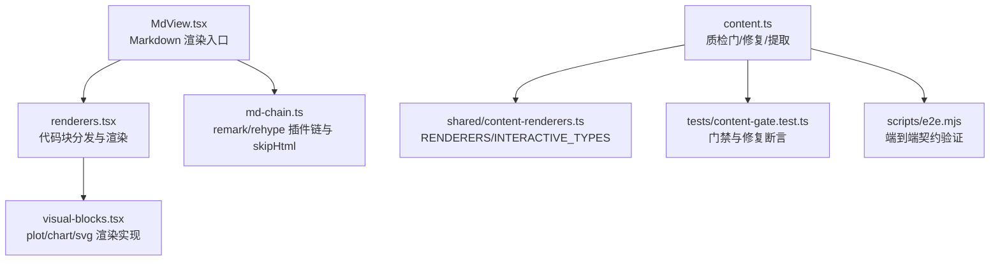
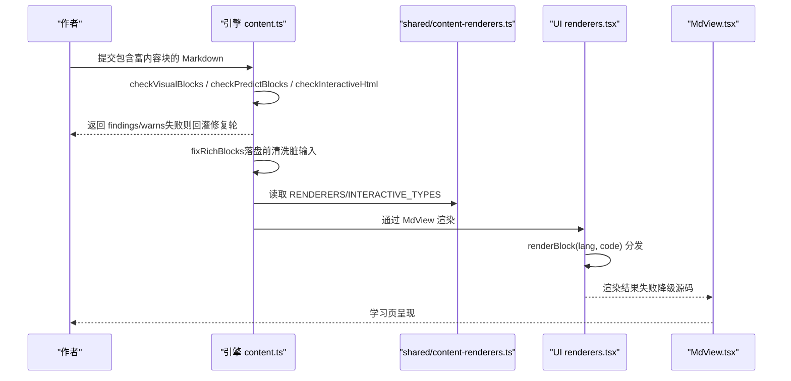
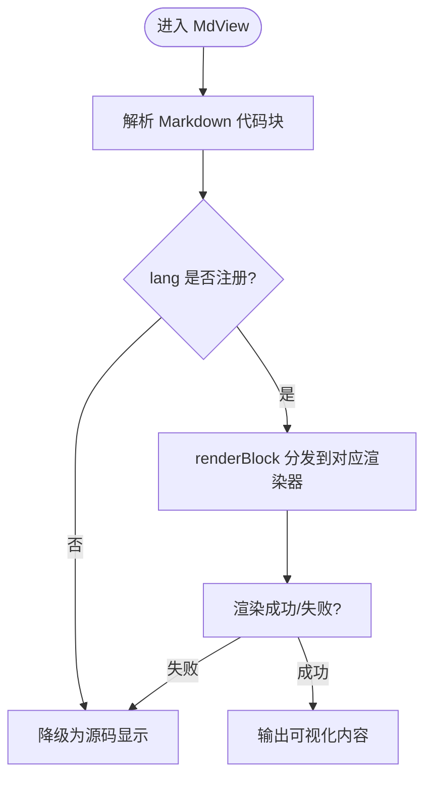
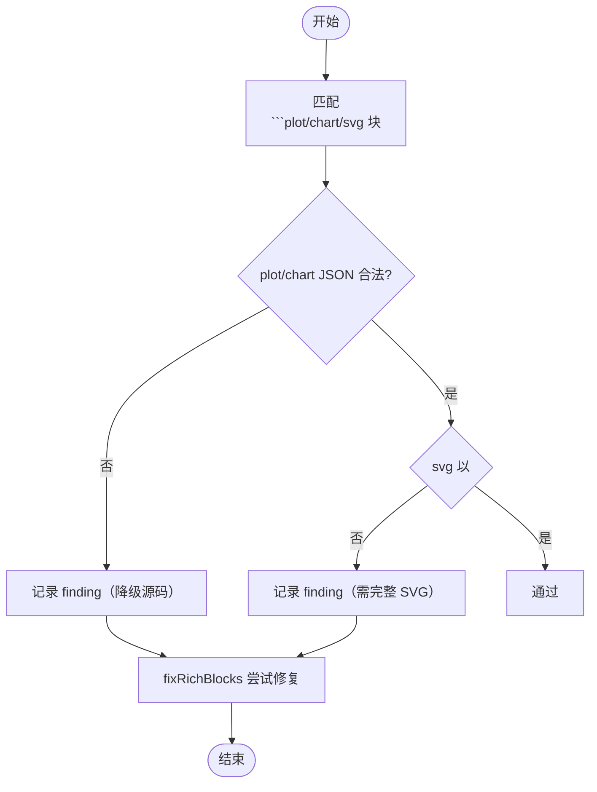
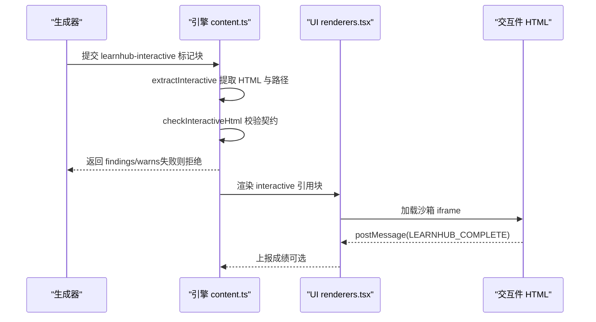
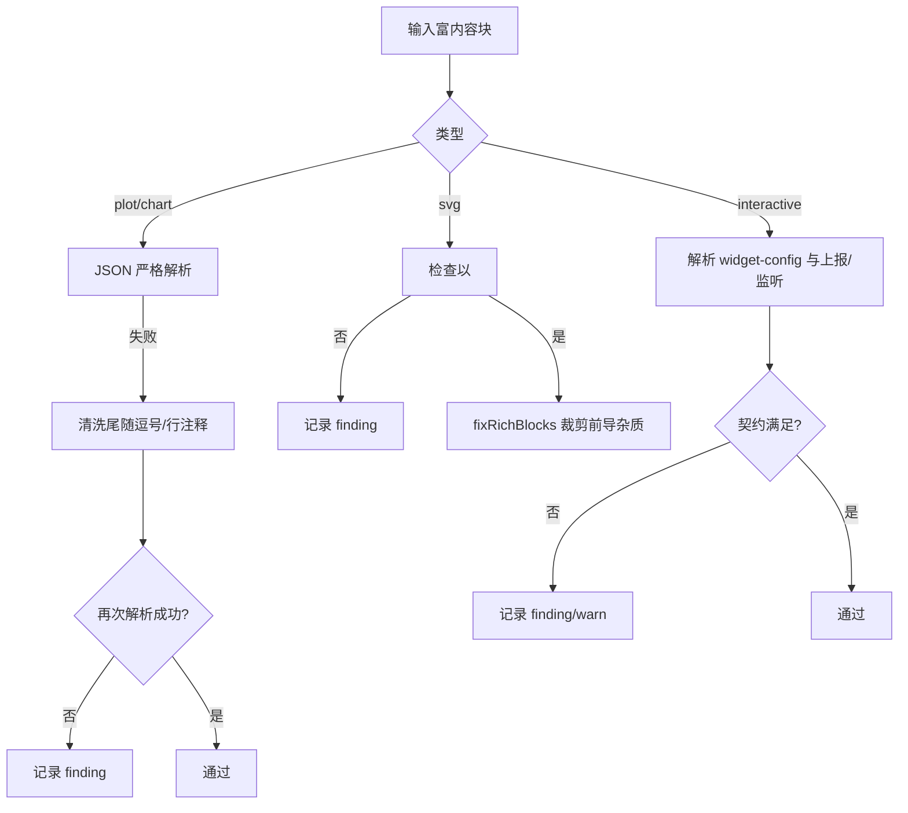
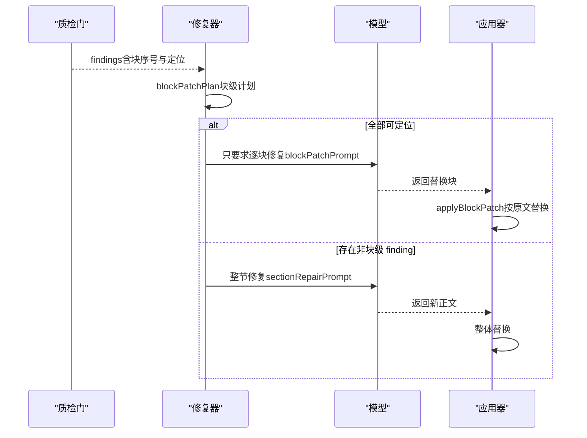
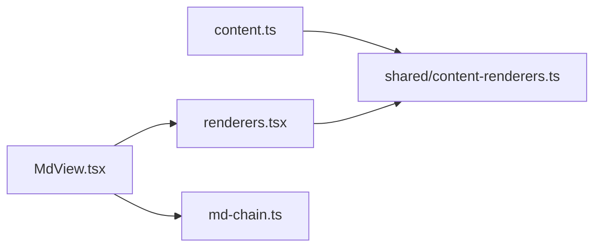

# 富内容块语法检查

<cite>
**本文引用的文件**
- [src/engine/content.ts](file://src/engine/content.ts)
- [shared/content-renderers.ts](file://shared/content-renderers.ts)
- [ui/src/components/renderers.tsx](file://ui/src/components/renderers.tsx)
- [ui/src/components/MdView.tsx](file://ui/src/components/MdView.tsx)
- [ui/src/lib/md-chain.ts](file://ui/src/lib/md-chain.ts)
- [tests/content-gate.test.ts](file://tests/content-gate.test.ts)
- [scripts/e2e.mjs](file://scripts/e2e.mjs)
</cite>

## 目录
1. [简介](#简介)
2. [项目结构](#项目结构)
3. [核心组件](#核心组件)
4. [架构总览](#架构总览)
5. [详细组件分析](#详细组件分析)
6. [依赖关系分析](#依赖关系分析)
7. [性能考量](#性能考量)
8. [故障排查指南](#故障排查指南)
9. [结论](#结论)
10. [附录](#附录)

## 简介
本文件系统性说明“富内容块语法检查”的解析、验证与修复机制，覆盖 Markdown 扩展代码块的语言识别、JSON/SVG/交互件等富内容的校验流程，以及不同富内容类型的特定规则（plot/chart JSON 对象、SVG 结构、interactive 组件契约）。同时给出编写规范、常见错误诊断与自动修复策略，帮助作者快速产出可渲染、可交互的高质量富内容。

## 项目结构
围绕富内容块的关键实现分布在引擎侧（内容质检与修复）、共享清单（渲染器与节类型事实源）和 UI 侧（渲染注册表与 MdView 渲染链）。测试与端到端脚本覆盖了门禁行为与修复效果。



图表来源
- [ui/src/components/MdView.tsx:1-22](file://ui/src/components/MdView.tsx#L1-L22)
- [ui/src/components/renderers.tsx:140-166](file://ui/src/components/renderers.tsx#L140-L166)
- [ui/src/lib/md-chain.ts:1-16](file://ui/src/lib/md-chain.ts#L1-L16)
- [src/engine/content.ts:521-587](file://src/engine/content.ts#L521-L587)
- [shared/content-renderers.ts:24-67](file://shared/content-renderers.ts#L24-L67)
- [tests/content-gate.test.ts:54-137](file://tests/content-gate.test.ts#L54-L137)
- [scripts/e2e.mjs:371-392](file://scripts/e2e.mjs#L371-L392)

章节来源
- [ui/src/components/MdView.tsx:1-22](file://ui/src/components/MdView.tsx#L1-L22)
- [ui/src/components/renderers.tsx:140-166](file://ui/src/components/renderers.tsx#L140-L166)
- [ui/src/lib/md-chain.ts:1-16](file://ui/src/lib/md-chain.ts#L1-L16)
- [src/engine/content.ts:521-587](file://src/engine/content.ts#L521-L587)
- [shared/content-renderers.ts:24-67](file://shared/content-renderers.ts#L24-L67)
- [tests/content-gate.test.ts:54-137](file://tests/content-gate.test.ts#L54-L137)
- [scripts/e2e.mjs:371-392](file://scripts/e2e.mjs#L371-L392)

## 核心组件
- 引擎质检与修复（content.ts）
  - 富内容块语法门：checkVisualBlocks（plot/chart 必须为合法 JSON 对象；svg 必须以 <svg 开头）
  - 程序性自动修复：fixRichBlocks（清洗尾随逗号/行注释、裁剪 svg 前导杂质、mermaid 自动补引号）
  - 预测门校验：checkPredictBlocks（learnhub-predict 字段齐全、options 互异且 answer ∈ options）
  - 交互件契约校验：checkInteractiveHtml（完成上报、外联限制、widget-config、TEACHER 监听）
  - 别名一致性、未注册语言警告、节形状与长度阈值、mermaid 引号告警等
- 共享清单（shared/content-renderers.ts）
  - RENDERERS：所有受支持的代码块语言及示例、提示
  - INTERACTIVE_TYPES：交互件类型菜单（simulation/visualization3d/diagram/game/code）
  - 预测门解析与分割：parsePredictBlock、splitPredictSegments
- UI 渲染（renderers.tsx + MdView.tsx）
  - renderBlock：按 lang 分发到具体渲染器（mermaid/media/interactive/svg/plot/chart）
  - verifyRendererCoverage：构建期对账 shared 清单与 UI 实现，遗漏即报错
  - MdView：基于 remark/rehype 的 Markdown 渲染链，skipHtml 丢弃裸 HTML（机器注释不显示）
- 测试与端到端（tests/content-gate.test.ts, scripts/e2e.mjs）
  - 断言 plot/chart 容错、svg 起始、fixRichBlocks 改写、interactive 契约等

章节来源
- [src/engine/content.ts:521-587](file://src/engine/content.ts#L521-L587)
- [src/engine/content.ts:647-736](file://src/engine/content.ts#L647-L736)
- [shared/content-renderers.ts:24-67](file://shared/content-renderers.ts#L24-L67)
- [shared/content-renderers.ts:117-197](file://shared/content-renderers.ts#L117-L197)
- [ui/src/components/renderers.tsx:140-166](file://ui/src/components/renderers.tsx#L140-L166)
- [ui/src/components/MdView.tsx:1-22](file://ui/src/components/MdView.tsx#L1-L22)
- [tests/content-gate.test.ts:54-137](file://tests/content-gate.test.ts#L54-L137)
- [scripts/e2e.mjs:371-392](file://scripts/e2e.mjs#L371-L392)

## 架构总览
下图展示从 Markdown 正文到富内容渲染与质检的完整链路，包括引擎侧的门禁与修复、UI 侧的渲染分发与契约校验。



图表来源
- [src/engine/content.ts:521-587](file://src/engine/content.ts#L521-L587)
- [src/engine/content.ts:647-736](file://src/engine/content.ts#L647-L736)
- [shared/content-renderers.ts:24-67](file://shared/content-renderers.ts#L24-L67)
- [ui/src/components/renderers.tsx:140-166](file://ui/src/components/renderers.tsx#L140-L166)
- [ui/src/components/MdView.tsx:1-22](file://ui/src/components/MdView.tsx#L1-L22)

## 详细组件分析

### 代码块语言识别与分发
- 引擎侧：
  - 使用 shared 的 RENDERERS 白名单识别受支持语言；未注册语言发出警告，避免 AI 产出无法渲染的块。
- UI 侧：
  - renderers.tsx 维护 BLOCK_RENDERERS 注册表，按 lang 分发到具体渲染器；缺失实现会在构建期抛出错误（verifyRendererCoverage），确保 shared 清单与 UI 实现一致。



图表来源
- [ui/src/components/renderers.tsx:140-166](file://ui/src/components/renderers.tsx#L140-L166)
- [shared/content-renderers.ts:24-67](file://shared/content-renderers.ts#L24-L67)
- [ui/src/components/MdView.tsx:1-22](file://ui/src/components/MdView.tsx#L1-L22)

章节来源
- [ui/src/components/renderers.tsx:140-166](file://ui/src/components/renderers.tsx#L140-L166)
- [shared/content-renderers.ts:24-67](file://shared/content-renderers.ts#L24-L67)
- [ui/src/components/MdView.tsx:1-22](file://ui/src/components/MdView.tsx#L1-L22)

### 富内容块语法验证（plot/chart/svg）
- 规则
  - plot/chart：必须是合法 JSON 对象（数组或标量视为非法）；容忍尾随逗号的“脏 JSON”，在门禁中会先尝试严格解析，失败后清洗重试。
  - svg：必须以 <svg 开头（完整 SVG 片段），否则判定非法。
- 修复
  - fixRichBlocks：将可解析的脏 JSON 改写为规范 JSON.stringify 产物；裁剪 svg 前导杂质至首个 <svg；mermaid 节点文本含 | 等特殊字符时自动补双引号。
- 定位
  - locateFinding：将门禁 finding 中的“第 N 块”映射到原文首行摘录，便于模型局部重写。



图表来源
- [src/engine/content.ts:521-587](file://src/engine/content.ts#L521-L587)
- [tests/content-gate.test.ts:54-137](file://tests/content-gate.test.ts#L54-L137)

章节来源
- [src/engine/content.ts:521-587](file://src/engine/content.ts#L521-L587)
- [tests/content-gate.test.ts:54-137](file://tests/content-gate.test.ts#L54-L137)

### 预测门（learnhub-predict）结构与语义校验
- 规则
  - q/options/answer/why 字段解析；options 必须为 2–4 项互不相同的数组；answer 必须为 options 中一项的原文。
- 作用
  - 思维节必备门（P-8 #97），用于“先预测再揭晓”的阅读流门；任何节出现该块都须合法。
- 处理
  - checkPredictBlocks：逐块解析并收集错误；MdView 通过 splitPredictSegments 切分 predict 段进行渲染控制。

```mermaid
classDiagram
class PredictBlock {
+string q
+string[] options
+string answer
+string why
}
class Parser {
+parsePredictBlock(text) PredictBlock|{error}
+predictBlockRe() RegExp
+splitPredictSegments(md) Array
}
Parser --> PredictBlock : "解析为"
```

图表来源
- [shared/content-renderers.ts:117-197](file://shared/content-renderers.ts#L117-L197)
- [src/engine/content.ts:503-519](file://src/engine/content.ts#L503-L519)

章节来源
- [shared/content-renderers.ts:117-197](file://shared/content-renderers.ts#L117-L197)
- [src/engine/content.ts:503-519](file://src/engine/content.ts#L503-L519)

### 交互式内容（interactive）契约校验
- 契约要点
  - widget-config 必填（type/description/variables/presets），type 必须在 INTERACTIVE_TYPES 内。
  - 完成上报：文档末尾需 postMessage({type:'LEARNHUB_COMPLETE', score?, detail?})。
  - AI 老师接口：必须实现 LEARNHUB_TEACHER 监听（highlight/setState/reveal/annotate）。
  - 单文件自包含：禁止外部 CDN 与网络请求；公式由伺服端注入 KaTeX。
  - 安全与体验：状态机清晰、动画可见、移动端友好、实时数据可读。
- 校验
  - checkInteractiveHtml：检测完成上报缺失、外联资源、widget-config 缺失或类型非法、TEACHER 监听缺失等。
  - e2e 用例：验证 v2 契约（缺上报/坏类型被拒）。



图表来源
- [src/engine/content.ts:778-787](file://src/engine/content.ts#L778-L787)
- [src/engine/content.ts:1074-1090](file://src/engine/content.ts#L1074-L1090)
- [ui/src/components/renderers.tsx:66-133](file://ui/src/components/renderers.tsx#L66-L133)
- [scripts/e2e.mjs:371-392](file://scripts/e2e.mjs#L371-L392)

章节来源
- [src/engine/content.ts:778-787](file://src/engine/content.ts#L778-L787)
- [src/engine/content.ts:1074-1090](file://src/engine/content.ts#L1074-L1090)
- [ui/src/components/renderers.tsx:66-133](file://ui/src/components/renderers.tsx#L66-L133)
- [scripts/e2e.mjs:371-392](file://scripts/e2e.mjs#L371-L392)

### 不同富内容类型的特定验证规则
- plot/chart（数据可视化）
  - 必须为合法 JSON 对象；面板按需渲染（ECharts option 等）；容错尾随逗号与行注释（仅当严格解析失败时清洗重试）。
  - 若非法，面板降级为源码显示；门禁记录 finding 并附带块序号与定位摘录。
- svg（矢量图）
  - 必须以 <svg 开头；面板清洗后渲染，禁止 <script> 与外部引用。
  - 若存在前导杂质，fixRichBlocks 会裁剪至首个 <svg。
- interactive（交互模拟）
  - widget-config.type 必须在 INTERACTIVE_TYPES；必须实现 LEARNHUB_COMPLETE 上报与 LEARNHUB_TEACHER 监听；禁止外联资源。
  - 违规将被拒绝（finding）或警告（warn）。

章节来源
- [src/engine/content.ts:521-587](file://src/engine/content.ts#L521-L587)
- [shared/content-renderers.ts:24-67](file://shared/content-renderers.ts#L24-L67)
- [src/engine/content.ts:1074-1090](file://src/engine/content.ts#L1074-L1090)

### 渲染验证流程（JSON 对象、SVG 结构、交互件）
- JSON 对象验证
  - 严格解析失败 → 清洗尾随逗号/行注释 → 再次解析 → 仍失败则报 finding。
- SVG 结构检查
  - 正则校验以 <svg 开头；fixRichBlocks 裁剪前导杂质。
- 交互件契约校验
  - 解析 widget-config JSON，校验 type；检测 LEARNHUB_COMPLETE 与 LEARNHUB_TEACHER；禁止外联。



图表来源
- [src/engine/content.ts:521-587](file://src/engine/content.ts#L521-L587)
- [src/engine/content.ts:1074-1090](file://src/engine/content.ts#L1074-L1090)

章节来源
- [src/engine/content.ts:521-587](file://src/engine/content.ts#L521-L587)
- [src/engine/content.ts:1074-1090](file://src/engine/content.ts#L1074-L1090)

### 自动修复策略与局部重写
- 自动修复
  - fixRichBlocks：清洗 plot/chart 的脏 JSON、裁剪 svg 前导杂质、mermaid 自动补引号。
  - 合法 JSON 原样保留（避免与模型产出逐字 diff）。
- 局部重写
  - blockPatchPlan：根据 gateReport 中的“第 N 块”定位，生成块级修补计划；若存在非块级 finding 则回退整节修复。
  - applyBlockPatch：按原文顺序替换违规块；extractFencedBlocks：从模型修复产出中提取围栏块。
  - sectionRepairPrompt/sectionRepairBody：将上次输出与质检清单（附定位）回灌，超长时显式压缩目标与计数口径。



图表来源
- [src/engine/content.ts:647-736](file://src/engine/content.ts#L647-L736)
- [tests/content-gate.test.ts:127-137](file://tests/content-gate.test.ts#L127-L137)

章节来源
- [src/engine/content.ts:647-736](file://src/engine/content.ts#L647-L736)
- [tests/content-gate.test.ts:127-137](file://tests/content-gate.test.ts#L127-L137)

## 依赖关系分析
- 引擎与共享清单
  - content.ts 依赖 shared/content-renderers.ts 的 RENDERERS、INTERACTIVE_TYPES、预测门解析与分割。
- UI 与共享清单
  - renderers.tsx 依赖 shared 清单进行构建期对账（verifyRendererCoverage），确保新增格式有对应实现。
- MdView 与渲染链
  - MdView 使用 md-chain.ts 的 REMARK_PLUGINS/REHYPE_PLUGINS 与 MD_HTML_POLICY（skipHtml），保证机器注释不显示。



图表来源
- [src/engine/content.ts:521-587](file://src/engine/content.ts#L521-L587)
- [shared/content-renderers.ts:24-67](file://shared/content-renderers.ts#L24-L67)
- [ui/src/components/renderers.tsx:140-166](file://ui/src/components/renderers.tsx#L140-L166)
- [ui/src/components/MdView.tsx:1-22](file://ui/src/components/MdView.tsx#L1-L22)
- [ui/src/lib/md-chain.ts:1-16](file://ui/src/lib/md-chain.ts#L1-L16)

章节来源
- [src/engine/content.ts:521-587](file://src/engine/content.ts#L521-L587)
- [shared/content-renderers.ts:24-67](file://shared/content-renderers.ts#L24-L67)
- [ui/src/components/renderers.tsx:140-166](file://ui/src/components/renderers.tsx#L140-L166)
- [ui/src/components/MdView.tsx:1-22](file://ui/src/components/MdView.tsx#L1-L22)
- [ui/src/lib/md-chain.ts:1-16](file://ui/src/lib/md-chain.ts#L1-L16)

## 性能考量
- 解析与修复复杂度
  - 富内容块匹配与 JSON 解析为 O(n) 扫描；清洗重试仅在严格解析失败时触发，避免额外开销。
  - mermaid 自动补引号为逐行正则替换，成本较低。
- 渲染降级
  - 未注册语言或渲染失败时降级为源码显示，避免阻塞主流程。
- 批量校验
  - 节形状与可视化块数量统计在一次遍历中完成，减少重复计算。

[本节提供一般性指导，无需特定文件分析]

## 故障排查指南
- 常见错误与修复建议
  - plot/chart 不是合法 JSON 对象
    - 现象：面板降级为源码显示；门禁记录 finding。
    - 修复：移除尾随逗号与行注释；确保为对象而非数组/标量。
  - svg 不以 <svg 开头
    - 现象：门禁记录 finding。
    - 修复：删除前导杂质，确保首个标签为 <svg。
  - mermaid 节点文本含 | 未加引号
    - 现象：渲染降级为源码；门禁 warn。
    - 修复：使用 fixRichBlocks 自动补引号，或手动包裹双引号。
  - interactive 缺少完成上报或 widget-config 类型非法
    - 现象：门禁 finding/warn；端到端拒绝。
    - 修复：添加 LEARNHUB_COMPLETE 上报；确保 widget-config.type 在 INTERACTIVE_TYPES。
- 自动修复与局部重写
  - 使用 fixRichBlocks 清洗脏输入；通过 blockPatchPlan 定位违规块并局部重写；超长时按预算压缩。

章节来源
- [src/engine/content.ts:521-587](file://src/engine/content.ts#L521-L587)
- [src/engine/content.ts:647-736](file://src/engine/content.ts#L647-L736)
- [tests/content-gate.test.ts:54-137](file://tests/content-gate.test.ts#L54-L137)
- [scripts/e2e.mjs:371-392](file://scripts/e2e.mjs#L371-L392)

## 结论
本系统通过“引擎侧门禁 + 程序性修复 + UI 侧渲染分发”的三层机制，确保富内容块在生成期尽早拦截错误、在落盘前自动清洗脏输入、在渲染期提供健壮降级。对不同富内容类型（plot/chart/svg/interactive）制定了明确的契约与校验规则，并通过测试与端到端脚本保障行为稳定。遵循本文编写的富内容块规范，可显著降低返工成本，提升学习页的可读性与交互体验。

[本节总结性内容，无需特定文件分析]

## 附录
- 编写规范速查
  - plot/chart：输出合法 JSON 对象；避免尾随逗号与行注释；如需注释，请确保可被清洗解析。
  - svg：以 <svg 开头；不包含 <script> 与外部引用；保持简洁与可访问性。
  - interactive：widget-config.type 在 INTERACTIVE_TYPES；实现 LEARNHUB_COMPLETE 与 LEARNHUB_TEACHER；单文件自包含。
  - mermaid：节点文本含 | 等特殊字符时包裹双引号。
- 参考实现路径
  - 引擎质检与修复：[src/engine/content.ts](file://src/engine/content.ts)
  - 共享清单：[shared/content-renderers.ts](file://shared/content-renderers.ts)
  - UI 渲染：[ui/src/components/renderers.tsx](file://ui/src/components/renderers.tsx)、[ui/src/components/MdView.tsx](file://ui/src/components/MdView.tsx)
  - 测试与端到端：[tests/content-gate.test.ts](file://tests/content-gate.test.ts)、[scripts/e2e.mjs](file://scripts/e2e.mjs)

[本节为补充信息，无需特定文件分析]