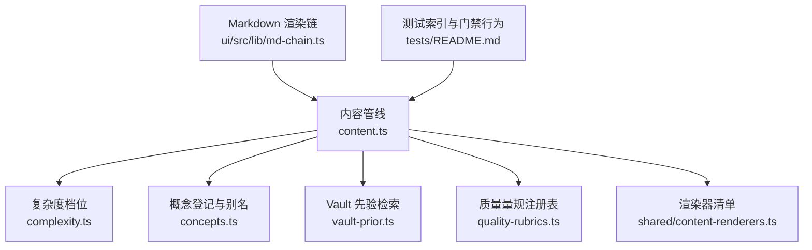
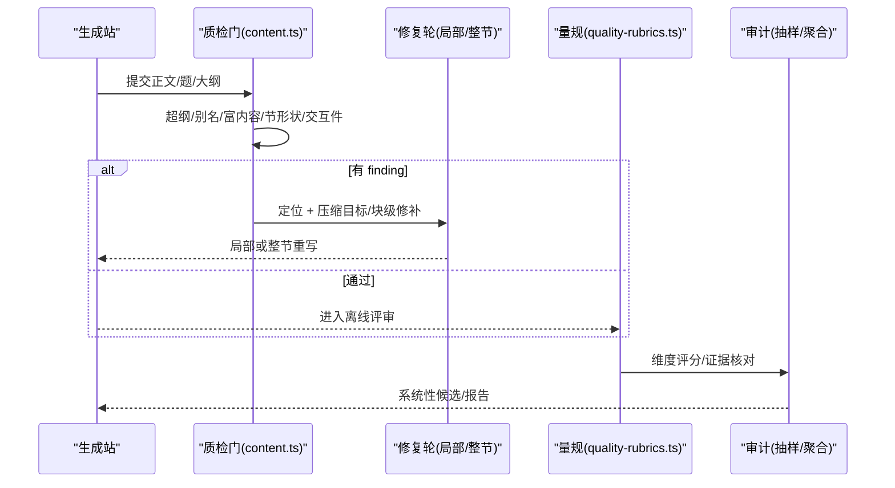
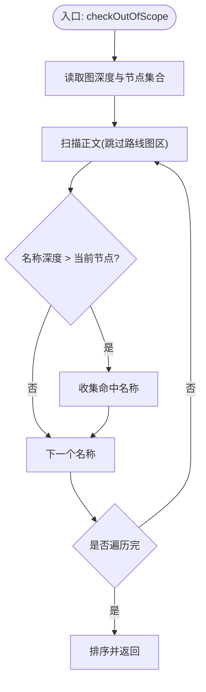
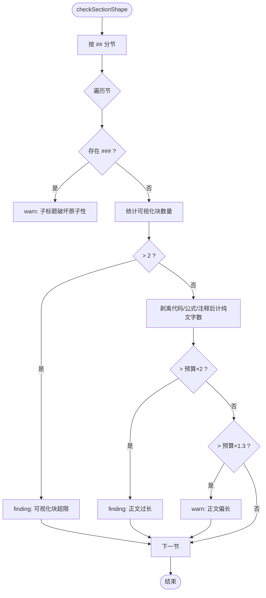
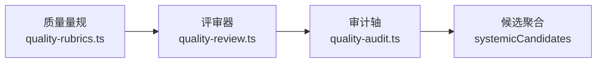
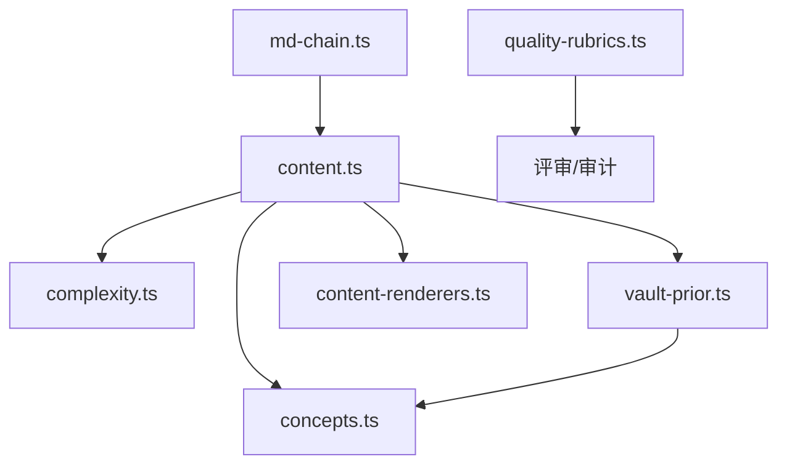

# 检查规则引擎

<cite>
**本文引用的文件**
- [src/engine/content.ts](file://src/engine/content.ts)
- [src/engine/complexity.ts](file://src/engine/complexity.ts)
- [src/engine/concepts.ts](file://src/engine/concepts.ts)
- [src/engine/vault-prior.ts](file://src/engine/vault-prior.ts)
- [src/engine/quality-rubrics.ts](file://src/engine/quality-rubrics.ts)
- [shared/content-renderers.ts](file://shared/content-renderers.ts)
- [ui/src/lib/md-chain.ts](file://ui/src/lib/md-chain.ts)
- [tests/README.md](file://tests/README.md)
</cite>

## 目录
1. [简介](#简介)
2. [项目结构](#项目结构)
3. [核心组件](#核心组件)
4. [架构总览](#架构总览)
5. [详细组件分析](#详细组件分析)
6. [依赖关系分析](#依赖关系分析)
7. [性能考量](#性能考量)
8. [故障排查指南](#故障排查指南)
9. [结论](#结论)
10. [附录](#附录)

## 简介
本文件系统化梳理“检查规则引擎”的实现与使用，覆盖以下目标：
- 超纲引用检测算法：知识点依赖关系分析与内容范围验证机制。
- 别名一致性检查：术语映射表维护与跨文档引用验证。
- 节形状验证规则：章节结构规范检查与格式合规性验证。
- 富内容块语法检查：Markdown 扩展语法解析与组件渲染验证。
- 配置示例与自定义规则开发指南。
- 常见质量问题诊断方法与自动修复建议。

该引擎以“门（gate）+ 量规（rubric）+ 审计（audit）”三层组织：门负责可机判的硬约束与轻量告警；量规提供教育学承诺的可核查条目；审计从生成语料中抽样并聚合系统性问题候选。

## 项目结构
检查规则引擎主要分布在 engine 层与共享 UI 渲染注册表：
- 内容质检门与修复轮：content.ts
- 复杂度档位与篇幅预算：complexity.ts
- 概念登记表与别名解析：concepts.ts
- Vault 先验检索（BM25 + 查询扩展 + 审计）：vault-prior.ts
- 质量量规注册表：quality-rubrics.ts
- 渲染器清单与交互类型：shared/content-renderers.ts
- Markdown 渲染策略（skipHtml 等）：ui/src/lib/md-chain.ts
- 测试用例索引与行为化断言：tests/README.md



图表来源
- [src/engine/content.ts:412-788](file://src/engine/content.ts#L412-L788)
- [src/engine/complexity.ts:219-269](file://src/engine/complexity.ts#L219-L269)
- [src/engine/concepts.ts:112-178](file://src/engine/concepts.ts#L112-L178)
- [src/engine/vault-prior.ts:185-360](file://src/engine/vault-prior.ts#L185-L360)
- [src/engine/quality-rubrics.ts:60-457](file://src/engine/quality-rubrics.ts#L60-L457)
- [shared/content-renderers.ts:20-33](file://shared/content-renderers.ts#L20-L33)
- [ui/src/lib/md-chain.ts:1-16](file://ui/src/lib/md-chain.ts#L1-L16)
- [tests/README.md:27-42](file://tests/README.md#L27-L42)

章节来源
- [tests/README.md:27-42](file://tests/README.md#L27-L42)

## 核心组件
- 内容质检门（Content.gateReport）：串联超纲引用、别名一致性、未注册语言、预测门、富内容块、节形状、Mermaid 引号、交互件存在性等检查，输出 findings/warns。
- 复杂度档位与篇幅预算：按节点难度/认知层级/前置规模折叠为低中高，派生单节字数预算与可视化块上限，驱动节长度阈值。
- 概念登记表：受控词表（canonical + aliases + definition + confusable），精确匹配解析，拒收未在册引用，支持合并与铸名冲突校验。
- Vault 先验检索：BM25 式打分（IDF × 词频饱和 × 长度归一 + 标题加权）、查询扩展（别名/易混概念低权重并入）、审计（扫描面/命中面/截断/零命中）。
- 质量量规注册表：五份量规（大纲/节正文/题目/教练回合/种子·终点），每条判据含标准、证据要求、出处与锚点，供评审器消费。
- 渲染器清单与 Markdown 策略：统一 lang 白名单与交互类型；MD 渲染链 skipHtml 丢弃机器注释，避免污染学习页。

章节来源
- [src/engine/content.ts:412-788](file://src/engine/content.ts#L412-L788)
- [src/engine/complexity.ts:219-269](file://src/engine/complexity.ts#L219-L269)
- [src/engine/concepts.ts:112-178](file://src/engine/concepts.ts#L112-L178)
- [src/engine/vault-prior.ts:185-360](file://src/engine/vault-prior.ts#L185-L360)
- [src/engine/quality-rubrics.ts:60-457](file://src/engine/quality-rubrics.ts#L60-L457)
- [shared/content-renderers.ts:20-33](file://shared/content-renderers.ts#L20-L33)
- [ui/src/lib/md-chain.ts:1-16](file://ui/src/lib/md-chain.ts#L1-L16)

## 架构总览
检查规则引擎围绕“生成产物 → 质检门 → 修复轮 → 量规评审 → 审计发现”的闭环运行。



图表来源
- [src/engine/content.ts:757-788](file://src/engine/content.ts#L757-L788)
- [src/engine/quality-rubrics.ts:60-457](file://src/engine/quality-rubrics.ts#L60-L457)
- [tests/README.md:27-42](file://tests/README.md#L27-L42)

## 详细组件分析

### 超纲引用检测算法（知识点依赖关系分析与内容范围验证）
- 原理：基于图深度 dSelf，遍历图内所有节点名，若某名称出现在正文且其深度大于 dSelf，则判定为超纲引用。
- 数据流：读取 Graph.nset 与 depth，过滤自身与短名，字符串包含命中即记录。
- 输出：返回排序后的超纲名称列表，作为 warn 提示。
- 关联：与“禁止使用的概念”上下文段配合，形成“不提前教后继”的内容边界。



图表来源
- [src/engine/content.ts:412-422](file://src/engine/content.ts#L412-L422)

章节来源
- [src/engine/content.ts:412-422](file://src/engine/content.ts#L412-L422)

### 别名一致性检查（术语映射表维护与跨文档引用验证）
- 术语映射表：从课程根“理念与规范.md §8”解析别名表（不采用名→采用名）。
- 检查逻辑：正文中出现不采用名即记录为 findings。
- 程序化修复：将不采用名替换为采用名，返回修改明细用于日志留痕。
- 跨文档引用：结合概念登记表的精确匹配，确保 teaches/assumes/误解/invokes 引用均在册。

```mermaid
classDiagram
class Content {
+aliasTable(root) Record~string,string~
+checkAliases(root, body) string[]
+fixAliases(root, body) {body, fixed}
}
class Concepts {
+validateConceptRegistry(raw) {errors, entries}
+resolveConcept(entries, name) ConceptEntry|null
+conceptReferenceErrors(refs, known) string[]
+invokesUnregistered(q, known) string|null
}
Content --> Concepts : "引用对表/精确匹配"
```

图表来源
- [src/engine/content.ts:382-400](file://src/engine/content.ts#L382-L400)
- [src/engine/content.ts:482-488](file://src/engine/content.ts#L482-L488)
- [src/engine/content.ts:589-603](file://src/engine/content.ts#L589-L603)
- [src/engine/concepts.ts:112-178](file://src/engine/concepts.ts#L112-L178)

章节来源
- [src/engine/content.ts:382-400](file://src/engine/content.ts#L382-L400)
- [src/engine/content.ts:482-488](file://src/engine/content.ts#L482-L488)
- [src/engine/content.ts:589-603](file://src/engine/content.ts#L589-L603)
- [src/engine/concepts.ts:112-178](file://src/engine/concepts.ts#L112-L178)

### 节形状验证规则（章节结构规范检查与格式合规性验证）
- 子标题限制：节内出现 ### 子标题记 warn（破坏原子性）。
- 篇幅预算：按复杂度档位派生单节文字预算，超过 1.3 倍 warn，超过 2 倍 finding。
- 可视化块上限：每节 mermaid/svg/plot/chart/interactive 合计 ≤2，超限 finding。
- 正文字数口径：剥离代码块、行内代码、公式、HTML 注释后计数。
- Mermaid 引号：节点文本含 | 等特殊字符未整体双引号包裹时 warn。



图表来源
- [src/engine/content.ts:424-463](file://src/engine/content.ts#L424-L463)
- [src/engine/complexity.ts:219-269](file://src/engine/complexity.ts#L219-L269)

章节来源
- [src/engine/content.ts:424-463](file://src/engine/content.ts#L424-L463)
- [src/engine/complexity.ts:219-269](file://src/engine/complexity.ts#L219-L269)

### 富内容块语法检查（Markdown 扩展语法解析与组件渲染验证）
- plot/chart：必须是合法 JSON 对象（容错尾随逗号/行注释），否则 finding。
- svg：必须以 <svg 开头，否则 finding。
- 自动修复：fixRichBlocks 清洗尾随逗号/行注释、裁剪 SVG 前导杂质、为 mermaid 节点文本补引号。
- 未注册语言：面板无渲染器的代码块语言会降级源码显示，记 warn。
- 预测门：learnhub-predict 块需字段齐全、answer ∈ options。

```mermaid
sequenceDiagram
participant Body as "正文"
participant Check as "checkVisualBlocks"
participant Fix as "fixRichBlocks"
Body->>Check : 提取
```plot/chart/svg 块
  Check-->>Body: 非法 JSON / 非SVG起始 → finding
  Body->>Fix: 落盘前尝试修复
  Fix-->>Body: 清洗尾随逗号/注释、裁剪SVG、补Mermaid引号
  Note over Check,Fix: 修复不改语义，仅提升可解析性
```

图表来源
- [src/engine/content.ts:521-587](file://src/engine/content.ts#L521-L587)
- [src/engine/content.ts:590-603](file://src/engine/content.ts#L590-L603)

章节来源
- [src/engine/content.ts:521-587](file://src/engine/content.ts#L521-L587)
- [src/engine/content.ts:590-603](file://src/engine/content.ts#L590-L603)

### 质量量规与审计（教育学承诺的可核查条目）
- 量规注册表：五份量规，每条判据含标准、证据要求、出处与锚点，供评审器消费。
- 审计轴：教练回合裁决质量、种子·终点资格等，抽样统计低分率，越线入候选。
- 评审流程：盲评（只给量规与产物原文）→ 对账（引入提示词与元数据确认/修正）。



图表来源
- [src/engine/quality-rubrics.ts:60-457](file://src/engine/quality-rubrics.ts#L60-L457)
- [src/engine/quality-audit.ts:50-124](file://src/engine/quality-audit.ts#L50-L124)

章节来源
- [src/engine/quality-rubrics.ts:60-457](file://src/engine/quality-rubrics.ts#L60-L457)
- [src/engine/quality-audit.ts:50-124](file://src/engine/quality-audit.ts#L50-L124)

### 配置示例与自定义规则开发指南
- 启用/关闭检查项：在 gateReport 调用处组合不同检查分支（如开关第二意见门、多样性仪表等由宿主参数控制）。
- 自定义别名映射：在“理念与规范.md §8”维护别名表，引擎自动解析并执行一致性检查与修复。
- 扩展渲染器：在 shared/content-renderers.ts 的 RENDERERS 增加新 lang，并在 UI 注册对应渲染器，两侧同步生效。
- 自定义 Markdown 策略：调整 ui/src/lib/md-chain.ts 的 MD_HTML_POLICY（如 skipHtml）影响渲染行为。
- 量规扩展：在 quality-rubrics.ts 新增维度/判据，补充 source 与 anchor，保持可追溯性。

章节来源
- [shared/content-renderers.ts:20-33](file://shared/content-renderers.ts#L20-L33)
- [ui/src/lib/md-chain.ts:1-16](file://ui/src/lib/md-chain.ts#L1-L16)
- [src/engine/content.ts:382-400](file://src/engine/content.ts#L382-L400)
- [src/engine/quality-rubrics.ts:60-457](file://src/engine/quality-rubrics.ts#L60-L457)

## 依赖关系分析
- content.ts 依赖 complexity.ts（复杂度档位与篇幅预算）、concepts.ts（概念登记与别名）、vault-prior.ts（先验注入）、shared/content-renderers.ts（渲染能力清单）。
- vault-prior.ts 依赖 concepts.ts（查询扩展）、types.ts（审计形状）。
- quality-rubrics.ts 被评审器与审计模块消费，提供可核查条目。
- md-chain.ts 为 UI 渲染链配置，影响学习页展示。



图表来源
- [src/engine/content.ts:1-30](file://src/engine/content.ts#L1-L30)
- [src/engine/vault-prior.ts:1-46](file://src/engine/vault-prior.ts#L1-L46)
- [src/engine/quality-rubrics.ts:1-15](file://src/engine/quality-rubrics.ts#L1-L15)
- [ui/src/lib/md-chain.ts:1-16](file://ui/src/lib/md-chain.ts#L1-L16)

章节来源
- [src/engine/content.ts:1-30](file://src/engine/content.ts#L1-L30)
- [src/engine/vault-prior.ts:1-46](file://src/engine/vault-prior.ts#L1-L46)
- [src/engine/quality-rubrics.ts:1-15](file://src/engine/quality-rubrics.ts#L1-L15)
- [ui/src/lib/md-chain.ts:1-16](file://ui/src/lib/md-chain.ts#L1-L16)

## 性能考量
- 节形状检查：正则扫描与字符串剥离开销小，适合高频调用。
- 富内容块检查：JSON 解析失败后二次宽松解析，避免误报同时保持性能。
- Vault 先验检索：BM25 一次扫面计算 IDF/TF/长度归一，maxFiles 限制扫描面，mtime 优先减少无关 IO。
- 渲染器校验：白名单比对 O(n)，开销极低。

[本节为通用指导，无需具体文件分析]

## 故障排查指南
- 超纲引用：检查 Graph.depth 与正文命中，确认“禁止使用的概念”上下文段是否正确注入。
- 别名不一致：确认“理念与规范.md §8”别名表是否存在与正确；必要时运行 fixAliases 批量替换。
- 节过长/可视化过多：按复杂度档位调整节拆分或压缩文字；合并可视化块。
- plot/chart 非法 JSON：使用 fixRichBlocks 自动修复尾随逗号/行注释；仍失败则回灌模型定向修复。
- svg 不以 <svg 开头：清理前导杂质，确保完整 SVG 片段。
- Mermaid 渲染降级：为含特殊字符的节点文本整体加双引号。
- 未注册语言：改用已注册的 lang 或扩展渲染器清单。
- 预测门不合法：补齐字段并确保 answer ∈ options。

章节来源
- [src/engine/content.ts:412-488](file://src/engine/content.ts#L412-L488)
- [src/engine/content.ts:521-587](file://src/engine/content.ts#L521-L587)
- [src/engine/content.ts:589-603](file://src/engine/content.ts#L589-L603)

## 结论
检查规则引擎通过“门—量规—审计”的体系化设计，将教育学承诺转化为可机判、可观测、可修复的规则集合。超纲引用、别名一致性、节形状与富内容块检查构成内容质量基线；质量量规与审计提供持续改进的证据与方向。借助自动化修复与提示词契约后置，可在保证质量的同时降低返工成本。

[本节为总结，无需具体文件分析]

## 附录
- 行为化门禁索引：tests/README.md 记录了各门禁与修复轮的行为断言，便于回归与自检。
- 渲染策略：MD 渲染链 skipHtml 确保机器注释不污染学习页。
- 复杂度档位：按 difficulty/bloom/est 与前置规模折叠，驱动节段数、篇幅与题量预算。

章节来源
- [tests/README.md:27-42](file://tests/README.md#L27-L42)
- [ui/src/lib/md-chain.ts:1-16](file://ui/src/lib/md-chain.ts#L1-L16)
- [src/engine/complexity.ts:219-269](file://src/engine/complexity.ts#L219-L269)