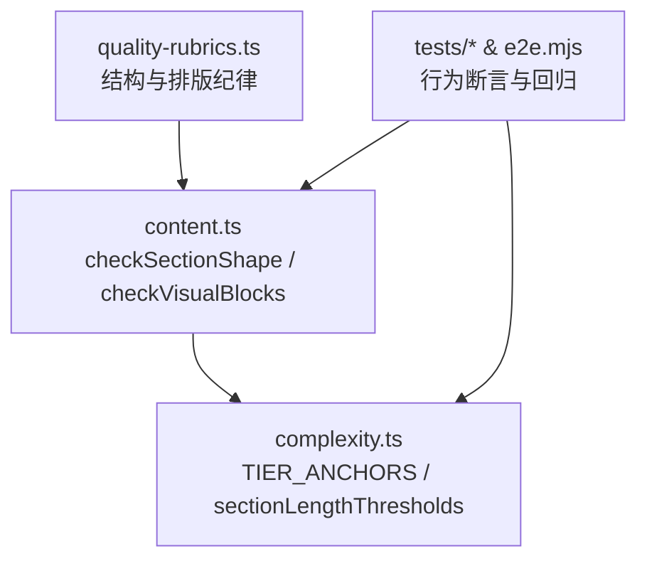
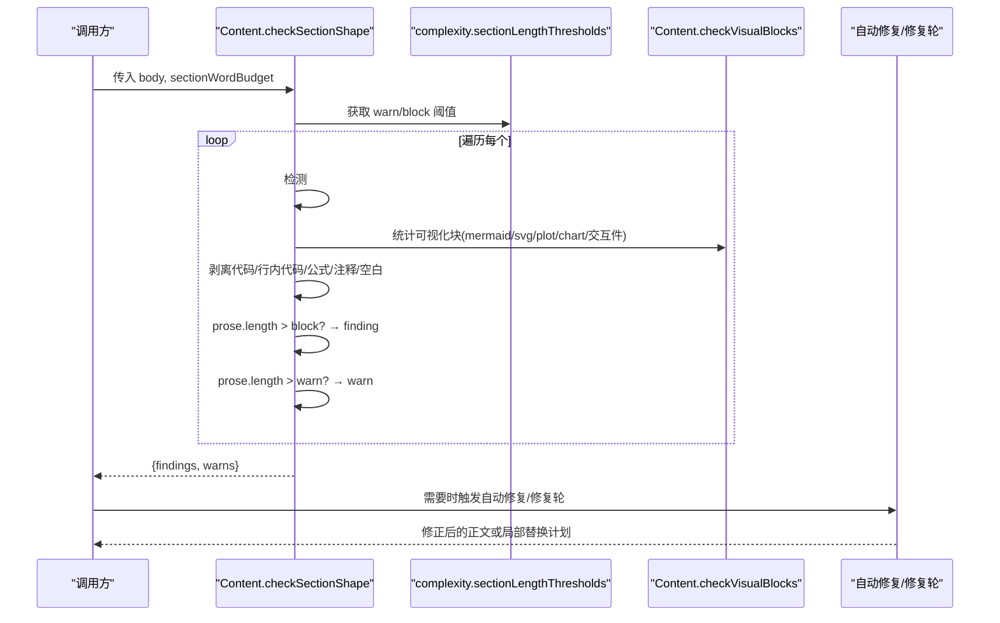
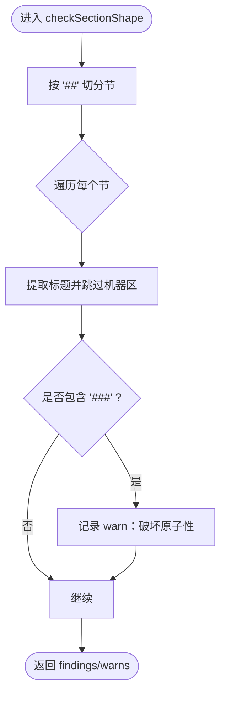
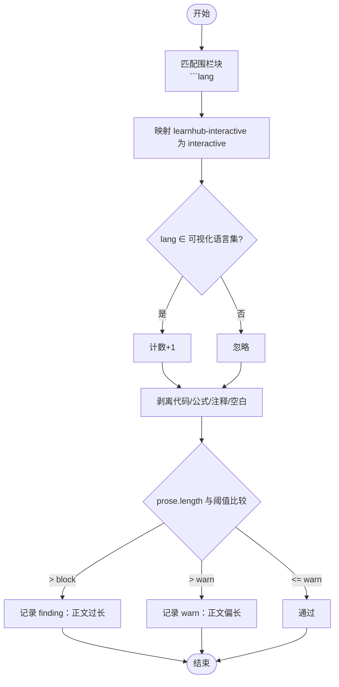
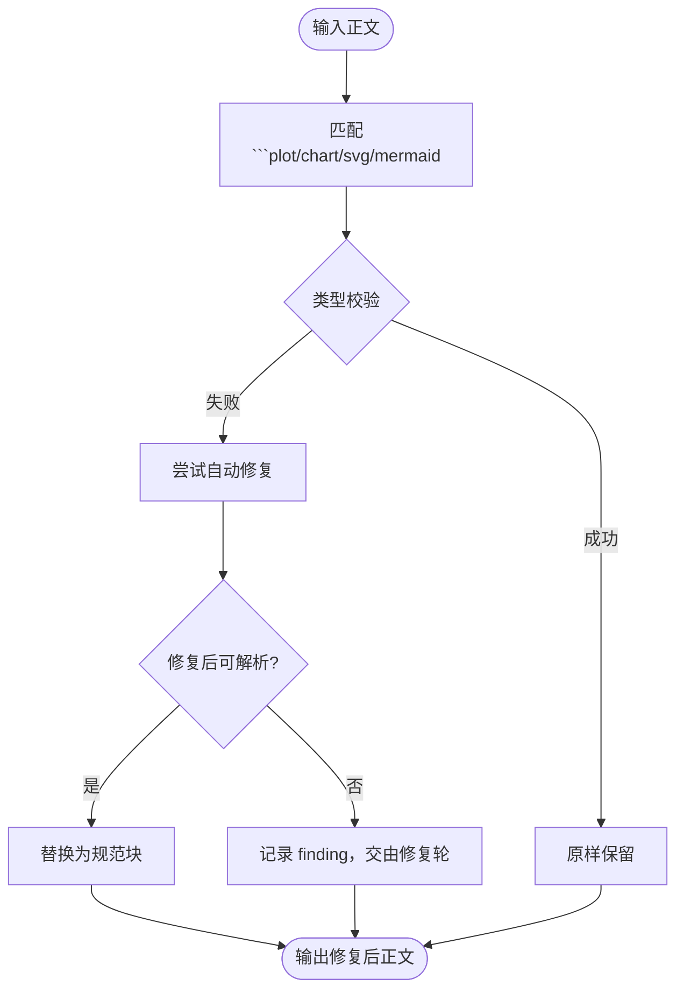
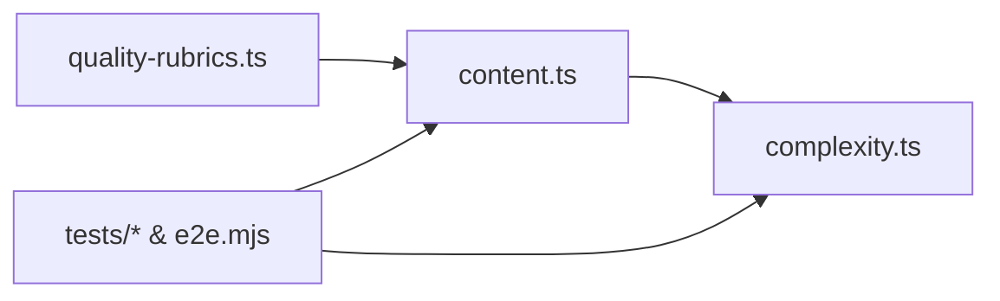

# 节形状验证

<cite>
**本文引用的文件**
- [src/engine/content.ts](file://src/engine/content.ts)
- [src/engine/complexity.ts](file://src/engine/complexity.ts)
- [src/engine/quality-rubrics.ts](file://src/engine/quality-rubrics.ts)
- [tests/section-split.test.ts](file://tests/section-split.test.ts)
- [tests/section-v9-misconceptions.test.ts](file://tests/section-v9-misconceptions.test.ts)
- [tests/content-gate.test.ts](file://tests/content-gate.test.ts)
- [scripts/e2e.mjs](file://scripts/e2e.mjs)
</cite>

## 目录
1. [简介](#简介)
2. [项目结构](#项目结构)
3. [核心组件](#核心组件)
4. [架构总览](#架构总览)
5. [详细组件分析](#详细组件分析)
6. [依赖关系分析](#依赖关系分析)
7. [性能考量](#性能考量)
8. [故障诊断指南](#故障诊断指南)
9. [结论](#结论)
10. [附录](#附录)

## 简介
本文件系统化阐述“节形状验证”的算法与机制，覆盖：
- Markdown 标题层级分析与子标题检测
- 原子性验证（一节一知识点）
- 格式合规性验证（正文长度阈值、可视化块计数、内容密度评估）
- 复杂度档案驱动的篇幅预算系统（档位派生、阈值计算、动态调整）
- 节结构配置示例与质量标准定制方法
- 常见问题诊断与自动优化建议

目标是让读者既能理解实现细节，也能据此制定或调整课程质量策略。

## 项目结构
围绕节形状验证的关键代码集中在引擎的内容校验与复杂度模块中，并通过测试与端到端脚本进行行为保障：
- 内容校验入口与规则：content.ts
- 复杂度档位与篇幅预算：complexity.ts
- 质量量规与标准：quality-rubrics.ts
- 行为断言与回归用例：tests/* 与 scripts/e2e.mjs



图表来源
- [src/engine/content.ts:424-463](file://src/engine/content.ts#L424-L463)
- [src/engine/complexity.ts:234-251](file://src/engine/complexity.ts#L234-L251)
- [src/engine/quality-rubrics.ts:203-218](file://src/engine/quality-rubrics.ts#L203-L218)

章节来源
- [src/engine/content.ts:424-463](file://src/engine/content.ts#L424-L463)
- [src/engine/complexity.ts:234-251](file://src/engine/complexity.ts#L234-L251)
- [src/engine/quality-rubrics.ts:203-218](file://src/engine/quality-rubrics.ts#L203-L218)

## 核心组件
- 节形状门禁：按节扫描 Markdown，检测 ### 子标题、统计可视化块数量、剥离代码/公式/注释后计算正文字数并对比阈值。
- 富内容块门：校验 plot/chart 为合法 JSON 对象、svg 以 <svg 开头；并提供落盘前自动修复能力。
- 复杂度档案驱动预算：基于节点复杂度档位（低/中/高）推导单节辅助文字预算，并派生警告线与拒收线。
- 大纲护栏：限制节段总数与极端分布，防止注水或过度压缩。
- 质量量规：将“篇幅预算”“可视化块上限”“无 ### 子标题”等要求固化为可评审的判据。

章节来源
- [src/engine/content.ts:424-463](file://src/engine/content.ts#L424-L463)
- [src/engine/content.ts:525-543](file://src/engine/content.ts#L525-L543)
- [src/engine/complexity.ts:234-251](file://src/engine/complexity.ts#L234-L251)
- [src/engine/complexity.ts:257-268](file://src/engine/complexity.ts#L257-L268)
- [src/engine/quality-rubrics.ts:203-218](file://src/engine/quality-rubrics.ts#L203-L218)

## 架构总览
下图展示从输入到输出的完整流程：解析节 → 原子性与子标题检查 → 可视化块计数 → 正文字数剥离与阈值比较 → 产出 findings/warns → 可选自动修复与修复轮提示词。



图表来源
- [src/engine/content.ts:424-463](file://src/engine/content.ts#L424-L463)
- [src/engine/content.ts:525-543](file://src/engine/content.ts#L525-L543)
- [src/engine/complexity.ts:247-251](file://src/engine/complexity.ts#L247-L251)

## 详细组件分析

### 组件A：Markdown 标题层级分析与原子性验证
- 节边界识别：按正则拆分 `##` 标题，跳过机器区（HTML 注释）。
- 子标题检测：若节内出现 `###`，视为破坏原子性，输出 warn（不硬拦，因为不可程序修复）。
- 原子性原则：一节只讲一个知识点，避免嵌套过深导致学习单元碎片化。



图表来源
- [src/engine/content.ts:424-463](file://src/engine/content.ts#L424-L463)

章节来源
- [src/engine/content.ts:424-463](file://src/engine/content.ts#L424-L463)

### 组件B：可视化块计数与内容密度评估
- 可视化块语言集合：mermaid、svg、plot、chart、interactive（含生成期标记块），统一计数。
- 上限约束：每节可视化块合计不超过固定上限，超出即 finding。
- 内容密度：通过剥离代码块、行内代码、公式、注释与空白，得到“纯文字数”，用于衡量内容密度与篇幅占用。



图表来源
- [src/engine/content.ts:424-463](file://src/engine/content.ts#L424-L463)
- [src/engine/content.ts:525-543](file://src/engine/content.ts#L525-L543)

章节来源
- [src/engine/content.ts:424-463](file://src/engine/content.ts#L424-L463)
- [src/engine/content.ts:525-543](file://src/engine/content.ts#L525-L543)

### 组件C：复杂度档案驱动的篇幅预算系统
- 档位折叠：根据 difficulty、bloom、pre 闭包规模与 p75 推导节点复杂度档位（低/中/高）。
- 档内锚点：不同档位对应不同的单节辅助文字预算与目标题量。
- 阈值派生：warn = 预算 × 1.3（建议压缩或拆节），block = 预算 × 2（拒收落盘）。
- 大纲护栏：任意档节段数超过总上限拦截；低档过多/高档过少方向性极端拦截。

```mermaid
classDiagram
class ComplexityTier {
+difficulty? : number
+bloom? : string
+est? : number
+preClosureSize? : number
+preClosureP75? : number
+complexityTier() ComplexityTier
}
class TierAnchors {
+sections : [number,number]
+sectionWordBudget : number
+perSectionQuestions : number
+genericQuizCount : number
}
class SectionLengthThresholds {
+sectionLengthThresholds(budget) {warn, block}
}
ComplexityTier --> TierAnchors : "查档内锚点"
SectionLengthThresholds --> TierAnchors : "预算×倍数"
```

图表来源
- [src/engine/complexity.ts:49-64](file://src/engine/complexity.ts#L49-L64)
- [src/engine/complexity.ts:234-251](file://src/engine/complexity.ts#L234-L251)

章节来源
- [src/engine/complexity.ts:49-64](file://src/engine/complexity.ts#L49-L64)
- [src/engine/complexity.ts:234-251](file://src/engine/complexity.ts#L234-L251)
- [src/engine/complexity.ts:257-268](file://src/engine/complexity.ts#L257-L268)

### 组件D：富内容块门与自动修复
- 富内容块校验：
  - plot/chart：必须为合法 JSON 对象（容错尾随逗号与行注释）。
  - svg：必须以 <svg 开头。
- 自动修复（落盘前）：
  - 清洗 plot/chart 中的尾随逗号与行注释，规范化 JSON。
  - 裁剪 svg 前导杂质至首个 <svg。
  - mermaid 节点文本含特殊字符时自动补引号，避免渲染降级。
- 定位与回灌：提供视觉块摘录与定位函数，便于修复轮精准替换。



图表来源
- [src/engine/content.ts:525-543](file://src/engine/content.ts#L525-L543)
- [src/engine/content.ts:561-587](file://src/engine/content.ts#L561-L587)
- [src/engine/content.ts:615-632](file://src/engine/content.ts#L615-L632)

章节来源
- [src/engine/content.ts:525-543](file://src/engine/content.ts#L525-L543)
- [src/engine/content.ts:561-587](file://src/engine/content.ts#L561-L587)
- [src/engine/content.ts:615-632](file://src/engine/content.ts#L615-L632)

### 组件E：质量量规与标准定制
- 结构与排版纪律：
  - 篇幅预算：一节约 1–2 屏，文字不超预算（1.3 倍警告、2 倍拒收）。
  - 可视化块：合计不超过上限。
  - 无 ### 子标题：保持节的原子性。
- 证据与出处：每条判据绑定证据要求与出处锚点，支持 AI 提议评分与人审终审。

章节来源
- [src/engine/quality-rubrics.ts:203-218](file://src/engine/quality-rubrics.ts#L203-L218)

## 依赖关系分析
- content.ts 依赖 complexity.ts 提供的预算与阈值，确保“长度治理口径一致”。
- quality-rubrics.ts 将业务规则形式化为可评审的维度与判据，供质量评审消费。
- tests/* 与 scripts/e2e.mjs 对关键路径进行断言，保证行为稳定与回归安全。



图表来源
- [src/engine/content.ts:424-463](file://src/engine/content.ts#L424-L463)
- [src/engine/complexity.ts:234-251](file://src/engine/complexity.ts#L234-L251)
- [src/engine/quality-rubrics.ts:203-218](file://src/engine/quality-rubrics.ts#L203-L218)

章节来源
- [src/engine/content.ts:424-463](file://src/engine/content.ts#L424-L463)
- [src/engine/complexity.ts:234-251](file://src/engine/complexity.ts#L234-L251)
- [src/engine/quality-rubrics.ts:203-218](file://src/engine/quality-rubrics.ts#L203-L218)

## 性能考量
- 正则与字符串处理：逐节扫描与正则匹配在常规体量下开销可控；避免重复全量解析。
- 剥离与计数：代码块/公式/注释一次性剥离，减少多次遍历。
- 自动修复：仅在必要时执行 JSON 清洗与 mermaid 引号补全，避免不必要的重写。
- 缓存与复用：复杂度档位与预计算信号由上层注入，避免重复图遍历。

[本节为通用指导，无需特定文件引用]

## 故障诊断指南
常见节结构问题与对策：
- 正文过长（超过 block 阈值）：
  - 现象：finding 提示“正文过长”，拒绝落盘。
  - 原因：去空白/公式/可视化块后的正文字数超过预算×2。
  - 对策：压缩文字或拆分为多个节（管线支持自动拆节）。
- 正文偏长（超过 warn 阈值）：
  - 现象：warn 提示“正文偏长”。
  - 原因：字数超过预算×1.3。
  - 对策：建议压缩或拆节，优先提升可视化表达。
- 可视化块过多：
  - 现象：finding 提示“可视化块超过上限”。
  - 原因：单节可视化块合计超过上限。
  - 对策：合并或精简可视化，或将内容拆分到新节。
- 存在 ### 子标题：
  - 现象：warn 提示“破坏原子性”。
  - 原因：节内嵌套子标题，影响学习单元完整性。
  - 对策：并入正文或拆成多个节。
- 富内容块非法：
  - 现象：plot/chart 非 JSON 对象、svg 不以 <svg 开头。
  - 原因：模型输出脏数据。
  - 对策：落盘前自动修复；仍失败则走修复轮局部替换。

章节来源
- [src/engine/content.ts:424-463](file://src/engine/content.ts#L424-L463)
- [src/engine/content.ts:525-543](file://src/engine/content.ts#L525-L543)
- [tests/section-split.test.ts:78-83](file://tests/section-split.test.ts#L78-L83)
- [scripts/e2e.mjs:486-501](file://scripts/e2e.mjs#L486-L501)

## 结论
节形状验证通过“原子性 + 可视化块 + 正文字数”三轴约束，结合复杂度档案驱动的预算体系，形成可度量、可修复、可评审的内容质量闭环。建议在课程生产中：
- 依据节点复杂度档位规划节段数与篇幅预算
- 优先使用可视化表达控制屏幕占用
- 遇到超长或违规块时，利用自动修复与修复轮快速纠偏
- 以质量量规作为评审与持续改进的依据

[本节为总结，无需特定文件引用]

## 附录

### A. 节结构配置示例（概念/例题/演示/练习/交互/思维）
- 概念节：聚焦单一概念讲解，配合少量图示，避免嵌套子标题。
- 例题节：以一道题为主线，强调思路与关键点。
- 演示节：步骤化演示，注意每步信息密度。
- 练习节：集中练习与反馈，控制题目数量与难度梯度。
- 交互节：引入交互件，注意可视化块上限与内容密度平衡。
- 思维节：引导推理过程，可使用预测门与可视化辅助。

[本节为概念说明，无需特定文件引用]

### B. 质量标准定制方法
- 调整预算与阈值：通过更改复杂度档位锚点与倍数系数，适配不同课程风格。
- 自定义可视化块语言：扩展可视化语言集合时需同步更新计数逻辑与上限策略。
- 量规扩展：新增判据需明确证据要求与出处锚点，确保可评审与可追溯。

[本节为概念说明，无需特定文件引用]

### C. 自动优化建议
- 超长节：优先拆分而非压缩，保持学习单元原子性。
- 可视化过多：合并同类图或移至新节，提升阅读节奏。
- 富内容块错误：启用自动修复；若仍失败，采用修复轮局部替换。
- 子标题泛滥：将子标题内容升格为新节，维持主节简洁。

[本节为概念说明，无需特定文件引用]