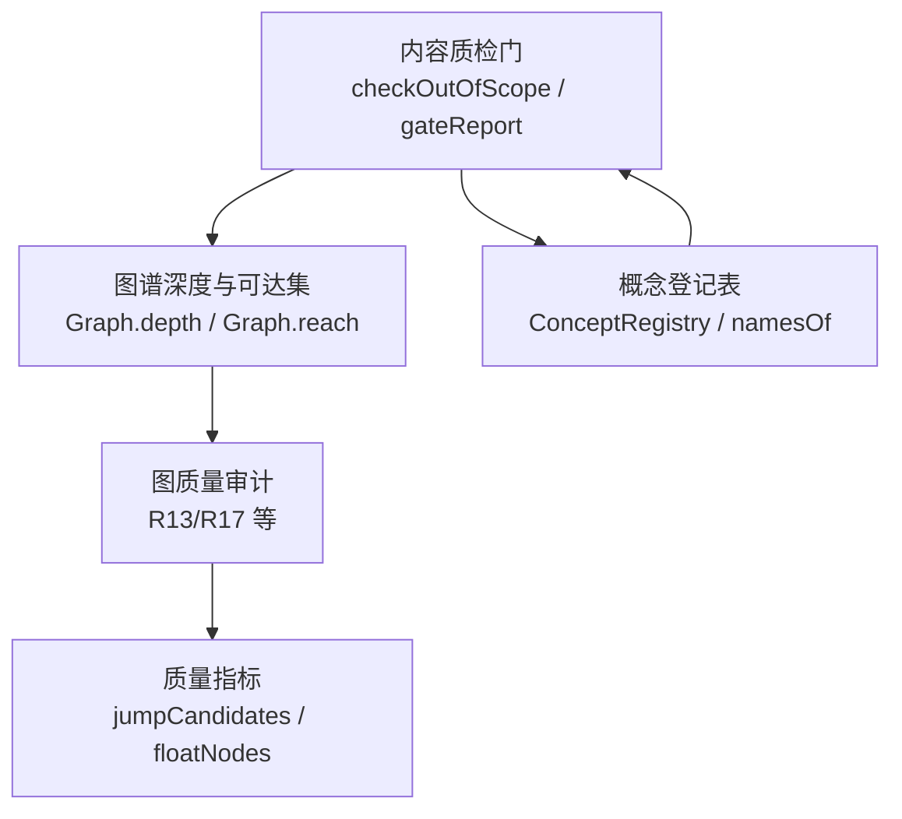
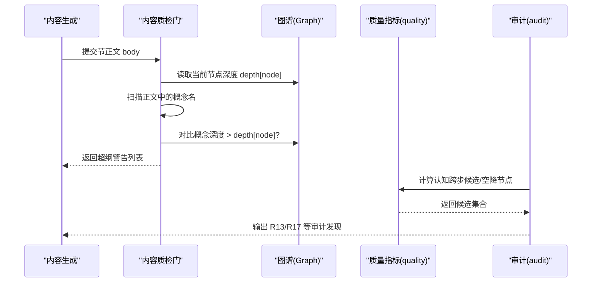
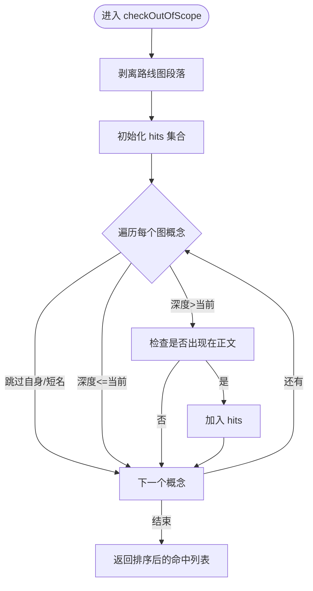
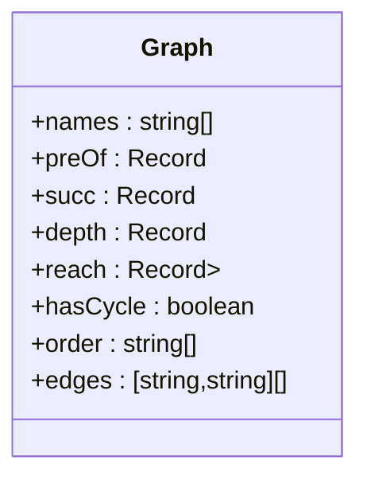
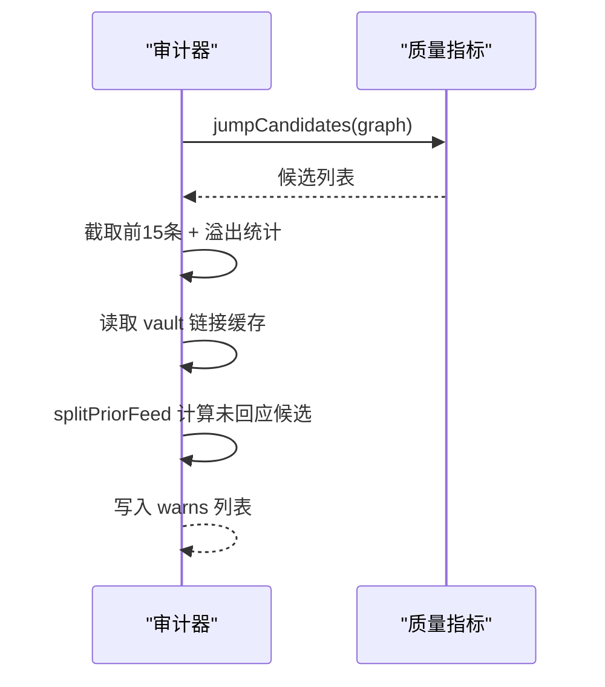
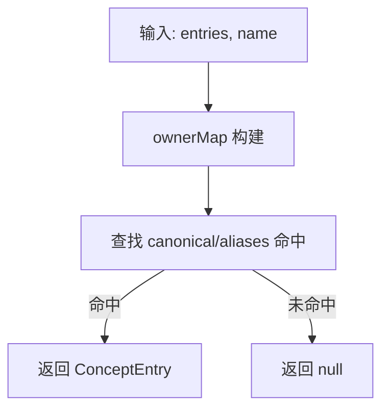
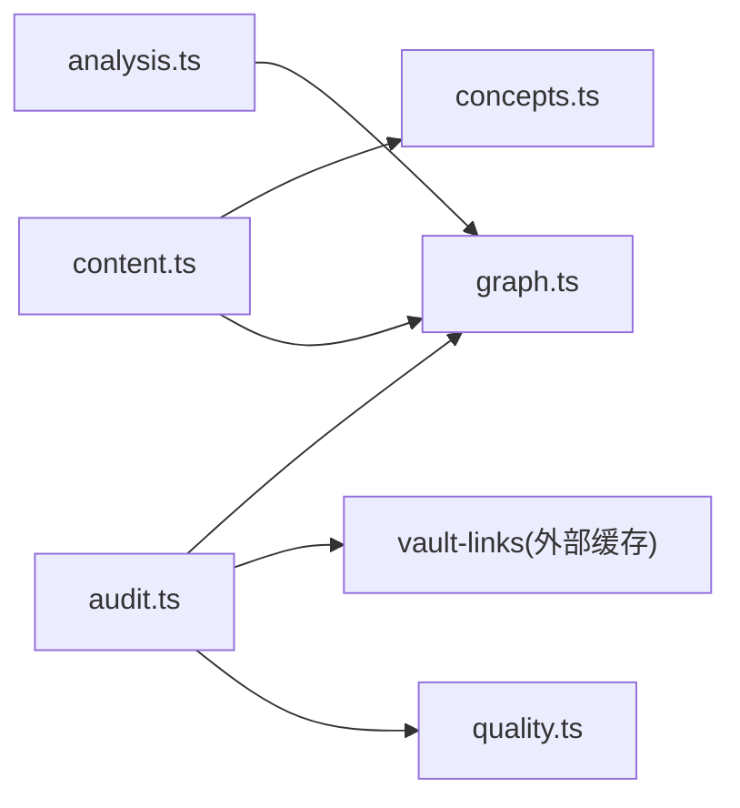

# 超纲引用检测

<cite>
**本文引用的文件**
- [content.ts](file://src/engine/content.ts)
- [graph.ts](file://src/engine/graph.ts)
- [quality.ts](file://src/engine/quality.ts)
- [audit.ts](file://src/engine/audit.ts)
- [concepts.ts](file://src/engine/concepts.ts)
- [analysis.ts](file://src/engine/analysis.ts)
- [CONTEXT.md](file://CONTEXT.md)
</cite>

## 目录
1. [引言](#引言)
2. [项目结构](#项目结构)
3. [核心组件](#核心组件)
4. [架构总览](#架构总览)
5. [详细组件分析](#详细组件分析)
6. [依赖关系分析](#依赖关系分析)
7. [性能考量](#性能考量)
8. [故障排查指南](#故障排查指南)
9. [结论](#结论)
10. [附录](#附录)

## 引言
本文件系统化阐述“超纲引用检测”的实现与原理，覆盖以下目标：
- 基于知识图谱深度的概念依赖关系分析算法（节点深度计算、前置概念闭包、超纲判定逻辑）
- 内容范围验证机制（正文文本解析、概念匹配策略、深度比较算法）
- 未学概念提前使用的识别（图遍历、依赖分析、上下文感知）
- 检测规则配置示例与误报处理方案
- 常见超纲问题的诊断方法与自动修复建议

## 项目结构
超纲引用检测由“内容质检门 + 图谱深度 + 审计告警”三部分协作完成：
- 内容层：对生成后的节正文进行扫描，提取并比对概念出现位置与深度，输出超纲警告
- 图谱层：维护节点深度、可达集、前置边等结构信息，支撑深度比较与闭包推导
- 审计层：在图级质量审计中汇总认知跨步候选、先验喂料分流等信号，辅助定位结构性问题



图表来源
- [content.ts:412-422](file://src/engine/content.ts#L412-L422)
- [graph.ts:317-396](file://src/engine/graph.ts#L317-L396)
- [quality.ts:31-48](file://src/engine/quality.ts#L31-L48)
- [audit.ts:234-253](file://src/engine/audit.ts#L234-L253)
- [concepts.ts:140-153](file://src/engine/concepts.ts#L140-L153)

章节来源
- [content.ts:412-422](file://src/engine/content.ts#L412-L422)
- [graph.ts:317-396](file://src/engine/graph.ts#L317-L396)
- [quality.ts:31-48](file://src/engine/quality.ts#L31-L48)
- [audit.ts:234-253](file://src/engine/audit.ts#L234-L253)
- [concepts.ts:140-153](file://src/engine/concepts.ts#L140-L153)

## 核心组件
- 内容质检门（Content.checkOutOfScope / Content.gateReport）
  - 负责从节正文中扫描概念出现，并与当前节点深度比较，输出超纲警告
- 图谱对象（Graph）
  - 提供节点深度 depth、可达集 reach、前置 preOf、后继 succ 等关键视图
- 质量指标（quality.ts）
  - 提供认知跨步候选（难度差/深度跨度）与空降节点检测，用于审计与诊断
- 审计器（audit.ts）
  - 将 R13/R17 等发现写入报告，辅助定位结构性超纲风险
- 概念登记（concepts.ts）
  - 提供在册名字集合与精确解析，确保概念匹配不模糊

章节来源
- [content.ts:412-422](file://src/engine/content.ts#L412-L422)
- [content.ts:757-788](file://src/engine/content.ts#L757-L788)
- [graph.ts:317-396](file://src/engine/graph.ts#L317-L396)
- [quality.ts:31-48](file://src/engine/quality.ts#L31-L48)
- [audit.ts:234-253](file://src/engine/audit.ts#L234-L253)
- [concepts.ts:140-153](file://src/engine/concepts.ts#L140-L153)

## 架构总览
下图展示“超纲引用检测”的端到端流程：从内容生成到质检门校验，再到审计告警与修复闭环。



图表来源
- [content.ts:412-422](file://src/engine/content.ts#L412-L422)
- [content.ts:757-788](file://src/engine/content.ts#L757-L788)
- [graph.ts:317-396](file://src/engine/graph.ts#L317-L396)
- [quality.ts:31-48](file://src/engine/quality.ts#L31-L48)
- [audit.ts:234-253](file://src/engine/audit.ts#L234-L253)

## 详细组件分析

### 组件A：内容质检门（超纲引用检测）
- 功能要点
  - 剥离路线图相关段落，避免干扰
  - 遍历全图概念集合，过滤短名与自身节点
  - 仅当概念深度大于当前节点且出现在正文中时，记为超纲命中
  - 作为 gateReport 的一部分统一输出，配合别名一致性、可视化块等其它门禁
- 复杂度
  - 时间复杂度 O(N·|Body|)，N 为图内概念数；可通过索引优化（见“性能考量”）
- 错误处理
  - 若正文为空或无概念命中，返回空结果
  - 与其他门禁合并后，决定是否放行落盘



图表来源
- [content.ts:412-422](file://src/engine/content.ts#L412-L422)

章节来源
- [content.ts:412-422](file://src/engine/content.ts#L412-L422)
- [content.ts:757-788](file://src/engine/content.ts#L757-L788)

### 组件B：图谱深度与可达集（Graph）
- 深度计算
  - 拓扑序（Kahn）基础上自根向叶推进，depth[u] = max(depth[p]) + 1
  - 有环时跳过深度计算，保留 hasCycle/cycleNodes
- 可达集
  - 逆拓扑序聚合后继可达集，reach[u] = ∪reach[v] ∪ {v}
- 用途
  - 超纲检测直接依赖 depth
  - 审计与质量指标依赖 reach 做冗余边/连通性分析



图表来源
- [graph.ts:317-396](file://src/engine/graph.ts#L317-L396)

章节来源
- [graph.ts:317-396](file://src/engine/graph.ts#L317-L396)

### 组件C：质量指标（认知跨步/空降）
- 认知跨步候选
  - 难度差阈值：|difficulty(n)-difficulty(p)| ≥ 2
  - 深度跨度阈值：depth(n)-depth(p) ≥ 3
  - 任一命中即纳入候选，供审计输出
- 空降节点
  - region 序靠后且无前置，提示内容拔高

```mermaid
flowchart TD
S["遍历所有边 (p->n)"] --> Diff{"两端都有 difficulty?"}
Diff --> |是| Gap="gap=|diff(n)-diff(p)|"
Diff --> |否| Gap=null
Gap --> Span="span=depth(n)-depth(p)"
Span --> Decide{"gap≥2 或 span≥3 ?"}
Decide --> |是| Candidate["加入 JumpCandidate"]
Decide --> |否| End["忽略"]
```

图表来源
- [quality.ts:31-48](file://src/engine/quality.ts#L31-L48)

章节来源
- [quality.ts:31-48](file://src/engine/quality.ts#L31-L48)

### 组件D：审计器（R13/R17 等）
- R13 认知跨步候选
  - 调用 quality.jumpCandidates，输出前 15 条并附溢出计数
- R17 先验候选未被结构回应
  - 结合 vault 链接缓存，识别高权重先验但未显式 pre/enc 回应的候选对
- 种子图豁免
  - 在种子阶段放宽形状类告警与健康分阈值



图表来源
- [audit.ts:234-253](file://src/engine/audit.ts#L234-L253)
- [quality.ts:31-48](file://src/engine/quality.ts#L31-L48)

章节来源
- [audit.ts:234-253](file://src/engine/audit.ts#L234-L253)

### 组件E：概念登记与匹配
- 在册名字集合
  - namesOf(entries) 返回 canonical ∪ aliases 的全集
- 精确匹配
  - resolveConcept 严格匹配 canonical 或别名，永不模糊匹配
- 题目 invokes 校验
  - invokesUnregistered 确保题目标注的概念在册



图表来源
- [concepts.ts:140-153](file://src/engine/concepts.ts#L140-L153)

章节来源
- [concepts.ts:140-153](file://src/engine/concepts.ts#L140-L153)

## 依赖关系分析
- 内容质检门依赖图谱的 depth 与 nset
- 审计器依赖质量指标与 vault 链接缓存
- 概念登记提供精确匹配能力，保证概念引用唯一性
- 分析模块（analysis.ts）提供不可达节点、瓶颈节点等辅助诊断



图表来源
- [content.ts:412-422](file://src/engine/content.ts#L412-L422)
- [graph.ts:317-396](file://src/engine/graph.ts#L317-L396)
- [quality.ts:31-48](file://src/engine/quality.ts#L31-L48)
- [audit.ts:234-253](file://src/engine/audit.ts#L234-L253)
- [analysis.ts:96-129](file://src/engine/analysis.ts#L96-L129)

章节来源
- [content.ts:412-422](file://src/engine/content.ts#L412-L422)
- [graph.ts:317-396](file://src/engine/graph.ts#L317-L396)
- [quality.ts:31-48](file://src/engine/quality.ts#L31-L48)
- [audit.ts:234-253](file://src/engine/audit.ts#L234-L253)
- [analysis.ts:96-129](file://src/engine/analysis.ts#L96-L129)

## 性能考量
- 当前实现的时间复杂度
  - checkOutOfScope：O(N·|Body|)，N 为图内概念数
- 优化建议
  - 建立“概念→出现位置”的正向索引（如正则词表），将扫描降为 O(|Body|)
  - 对短名（长度<2）已过滤，可进一步扩展白名单（如“我/的/了”等停用词）
  - 批量预处理：按课程粒度缓存 names 与 depth，减少重复构造
- 内存与吞吐
  - 大段正文下，正则匹配与字符串操作占主要开销，建议分段处理或使用流式解析

[本节为通用指导，不直接分析具体文件]

## 故障排查指南
- 常见超纲问题
  - 正文提及更深层概念：通过 checkOutOfScope 捕获，gateReport 输出超纲警告
  - 认知跨步过大：R13 预警，需调整 pre 或拆分节点
  - 空降节点：R13/健康分异常，需补充前置或调整区域顺序
  - 先验候选未回应：R17 提示，需补 pre/enc 显式回应
- 诊断步骤
  - 查看 gateReport 中超纲警告列表，定位具体概念
  - 使用 audit 报告中的 R13/R17 项，确认结构性问题
  - 借助 upstream DAG 摘要（CONTEXT.md）查看前置闭包，判断是否遗漏前置
- 自动修复建议
  - 别名不一致：fixAliases 自动替换
  - 富内容块语法：fixRichBlocks 自动修正 JSON/SVG/Mermaid
  - 节过长：sectionRepairPrompt 引导模型压缩或拆节
  - 超纲：优先调整内容表述，避免提前引入深层概念；必要时补充前置或拆分节点

章节来源
- [content.ts:589-603](file://src/engine/content.ts#L589-L603)
- [content.ts:561-587](file://src/engine/content.ts#L561-L587)
- [content.ts:642-668](file://src/engine/content.ts#L642-L668)
- [audit.ts:234-253](file://src/engine/audit.ts#L234-L253)
- [CONTEXT.md:451-457](file://CONTEXT.md#L451-L457)

## 结论
超纲引用检测以“图谱深度 + 内容扫描”为核心，辅以质量指标与审计告警，形成从内容到结构的闭环治理。通过精确的概念匹配、严格的深度比较与可执行的修复路径，系统能够在生成期尽早拦截超纲风险，并在审计期持续优化知识结构。

[本节为总结性内容，不直接分析具体文件]

## 附录

### 检测规则配置示例
- 超纲阈值
  - 默认：概念深度 > 当前节点深度即为超纲
  - 可调整：根据课程阶段放宽/收紧（例如允许浅层术语提前出现）
- 认知跨步阈值
  - 难度差 ≥ 2 或深度跨度 ≥ 3 触发 R13 预警
- 先验候选阈值
  - w ≥ 0.7 的 vault 链接未显式回应触发 R17 预警

章节来源
- [content.ts:412-422](file://src/engine/content.ts#L412-L422)
- [quality.ts:12-17](file://src/engine/quality.ts#L12-L17)
- [audit.ts:234-253](file://src/engine/audit.ts#L234-L253)

### 误报处理方案
- 短名误报：已在实现中过滤长度<2 的概念；可进一步扩展停用词表
- 别名不一致：通过 fixAliases 自动替换，减少人工成本
- 富内容块渲染失败：fixRichBlocks 自动修正 JSON/SVG/Mermaid 格式
- 节过长：sectionRepairPrompt 引导模型压缩或拆节，避免整节重写

章节来源
- [content.ts:412-422](file://src/engine/content.ts#L412-L422)
- [content.ts:589-603](file://src/engine/content.ts#L589-L603)
- [content.ts:561-587](file://src/engine/content.ts#L561-L587)
- [content.ts:642-668](file://src/engine/content.ts#L642-L668)