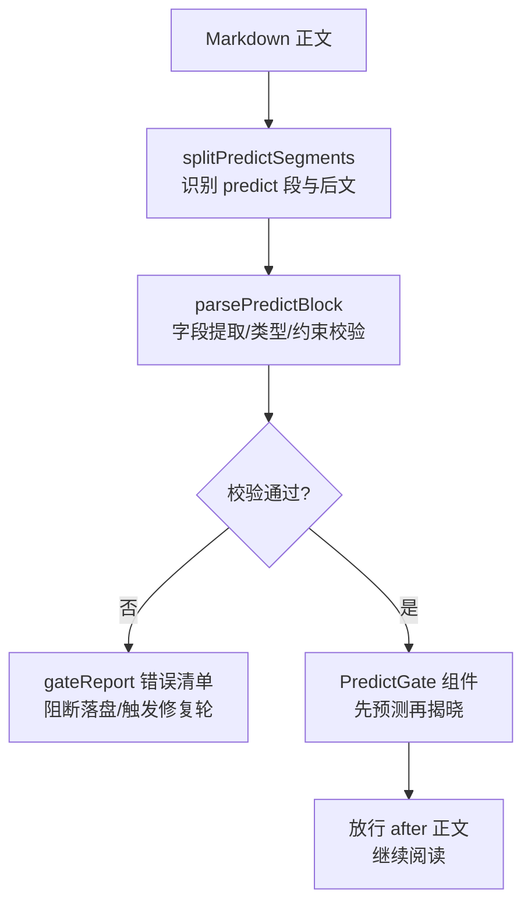
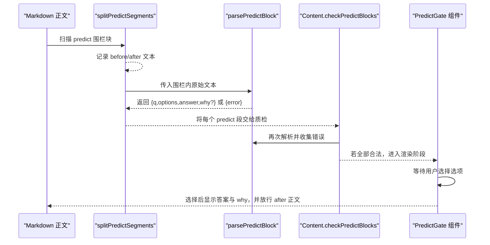
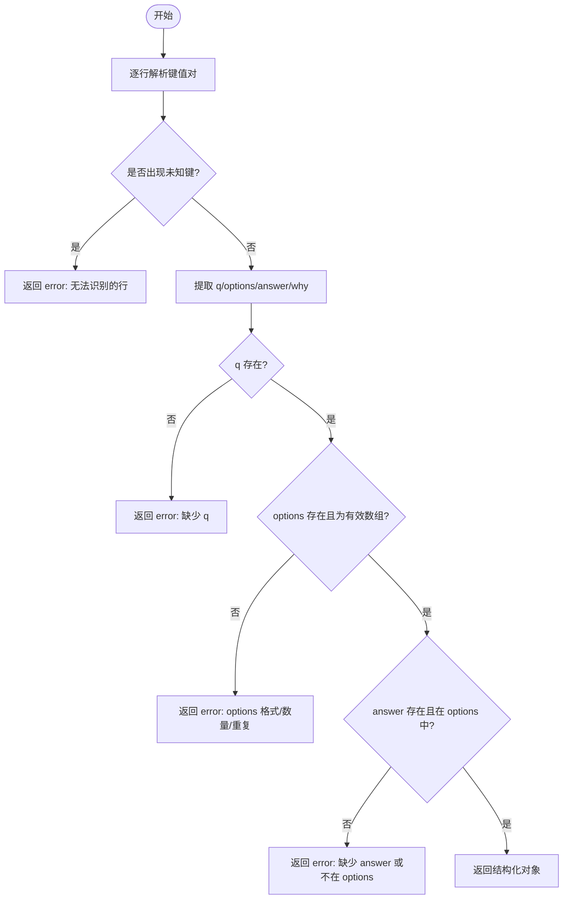
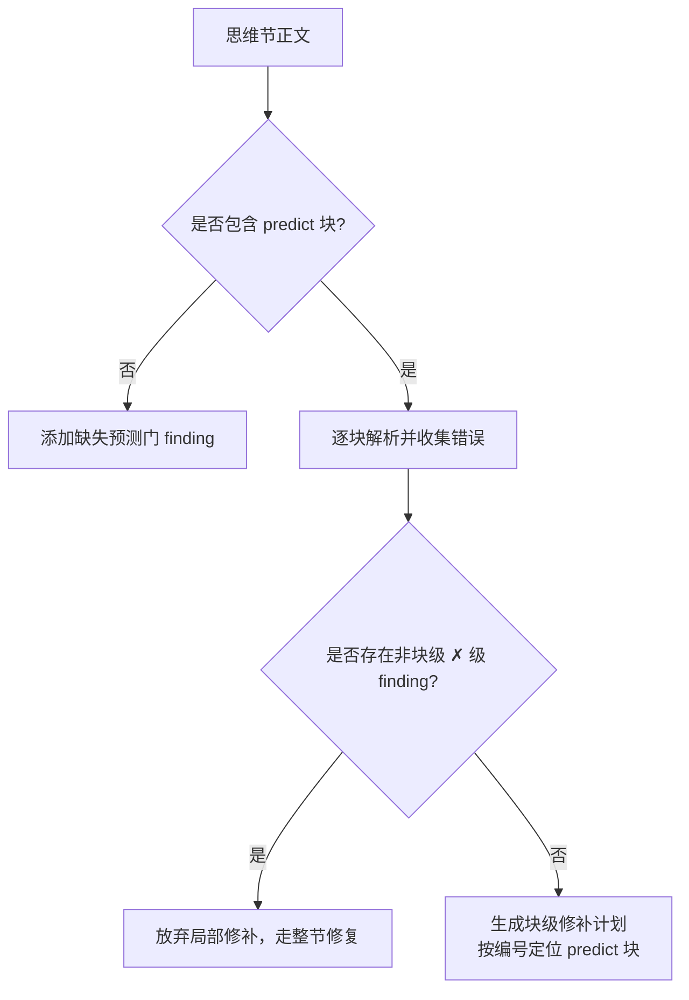
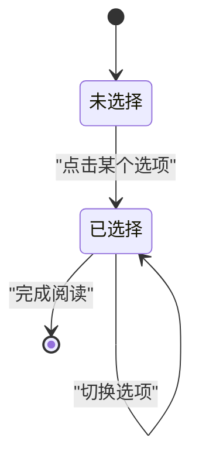
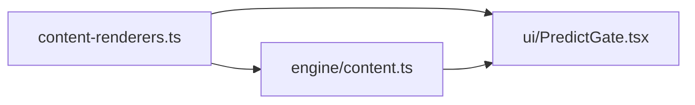

# 预测门块验证

<cite>
**本文引用的文件**
- [shared/content-renderers.ts](file://shared/content-renderers.ts)
- [src/engine/content.ts](file://src/engine/content.ts)
- [ui/src/components/PredictGate.tsx](file://ui/src/components/PredictGate.tsx)
- [CONTEXT.md](file://CONTEXT.md)
</cite>

## 目录
1. [简介](#简介)
2. [项目结构](#项目结构)
3. [核心组件](#核心组件)
4. [架构总览](#架构总览)
5. [详细组件分析](#详细组件分析)
6. [依赖关系分析](#依赖关系分析)
7. [性能考量](#性能考量)
8. [故障排查指南](#故障排查指南)
9. [结论](#结论)
10. [附录：编写规范与最佳实践](#附录编写规范与最佳实践)

## 简介
本文件围绕“预测门块”（learnhub-predict 机器块）的解析、校验与渲染进行系统化说明，覆盖字段提取、类型与约束检查、结构完整性验证、在思维节中的作用与必要性，以及常见错误的诊断与自动修复建议。目标是帮助内容创作者与引擎维护者稳定产出可被 UI 正确渲染、且通过质检门的预测门块。

## 项目结构
预测门块涉及三个关键位置：
- 共享解析与分割逻辑：位于 shared/content-renderers.ts，提供语言常量、数据结构、解析器、正则匹配与段落切分。
- 引擎质检与修复：位于 src/engine/content.ts，负责检测是否包含预测门、逐块校验、定位违规并参与局部修补计划。
- 前端交互渲染：位于 ui/src/components/PredictGate.tsx，将已解析的结构数据渲染为“先预测再揭晓”的阅读流门。



图表来源
- [shared/content-renderers.ts:174-196](file://shared/content-renderers.ts#L174-L196)
- [shared/content-renderers.ts:149-172](file://shared/content-renderers.ts#L149-L172)
- [ui/src/components/PredictGate.tsx:14-68](file://ui/src/components/PredictGate.tsx#L14-L68)
- [src/engine/content.ts:504-518](file://src/engine/content.ts#L504-L518)

章节来源
- [shared/content-renderers.ts:117-196](file://shared/content-renderers.ts#L117-L196)
- [src/engine/content.ts:504-518](file://src/engine/content.ts#L504-L518)
- [ui/src/components/PredictGate.tsx:1-68](file://ui/src/components/PredictGate.tsx#L1-L68)

## 核心组件
- 语言与数据结构
  - 语言标记：learnhub-predict
  - 数据结构：q（题面）、options（候选做法数组）、answer（正确项原文）、why（可选元评论）
- 解析与分割
  - predictBlockRe：匹配围栏块
  - splitPredictSegments：将 Markdown 切分为 md/predict 段序列，predict 段携带 parsed 结果与 after 正文
- 字段提取与约束校验
  - parsePredictBlock：行级键值解析；强制 q/options/answer；options 必须为流式数组、2–4 项、互异；answer 必须为 options 中一项的原文；why 可选
- 引擎质检与修复
  - hasPredictBlock：判断思维节是否包含至少一个预测门
  - checkPredictBlocks：逐块调用解析器，收集错误信息
  - blockPatchPlan：当所有 ✗ 级 finding 均可定位到具体 predict 块时，生成局部修补计划
- 前端渲染
  - PredictGate：未选择前隐藏 after 正文；选择后揭示答案与 why，并放行 after 正文

章节来源
- [shared/content-renderers.ts:123-172](file://shared/content-renderers.ts#L123-L172)
- [shared/content-renderers.ts:174-196](file://shared/content-renderers.ts#L174-L196)
- [src/engine/content.ts:504-518](file://src/engine/content.ts#L504-L518)
- [src/engine/content.ts:672-705](file://src/engine/content.ts#L672-L705)
- [ui/src/components/PredictGate.tsx:14-68](file://ui/src/components/PredictGate.tsx#L14-L68)

## 架构总览
预测门从“正文 → 解析 → 校验 → 渲染”的完整链路如下：



图表来源
- [shared/content-renderers.ts:174-196](file://shared/content-renderers.ts#L174-L196)
- [shared/content-renderers.ts:149-172](file://shared/content-renderers.ts#L149-L172)
- [src/engine/content.ts:504-518](file://src/engine/content.ts#L504-L518)
- [ui/src/components/PredictGate.tsx:14-68](file://ui/src/components/PredictGate.tsx#L14-L68)

## 详细组件分析

### 字段提取与类型验证（parsePredictBlock）
- 输入：围栏块内的原始文本（多行）
- 处理：
  - 忽略空行与注释行
  - 按行匹配 key:value（key 仅允许字母与下划线）
  - 提取 q、options、answer、why
- 约束：
  - q、options、answer 必填
  - options 必须是流式数组 ["...","..."] 形式，长度 2–4，元素互不相同
  - answer 必须与 options 中某一项完全一致
  - why 可选
- 输出：
  - 成功：{q, options, answer, why?}
  - 失败：{error: 字符串}



图表来源
- [shared/content-renderers.ts:149-172](file://shared/content-renderers.ts#L149-L172)

章节来源
- [shared/content-renderers.ts:127-172](file://shared/content-renderers.ts#L127-L172)

### 结构完整性验证（引擎侧）
- 存在性检查：思维轨迹节必须至少包含一处 learnhub-predict 预测门
- 合法性检查：对正文中每个 predict 块调用解析器，收集错误
- 修复策略：当所有 ✗ 级 finding 都可定位到具体 predict 块时，生成局部修补计划（仅替换该块），否则回退整节修复



图表来源
- [src/engine/content.ts:504-518](file://src/engine/content.ts#L504-L518)
- [src/engine/content.ts:672-705](file://src/engine/content.ts#L672-L705)
- [src/engine/content.ts:970-987](file://src/engine/content.ts#L970-L987)

章节来源
- [src/engine/content.ts:504-518](file://src/engine/content.ts#L504-L518)
- [src/engine/content.ts:672-705](file://src/engine/content.ts#L672-L705)
- [src/engine/content.ts:970-987](file://src/engine/content.ts#L970-L987)

### 前端交互与阅读流控制（PredictGate）
- 行为：
  - 未选择前：展示题目与选项按钮；隐藏块后正文（after）
  - 选择后：高亮正确答案与用户选择；显示 why（如有）；放行 after 正文继续渲染
- 设计要点：
  - 不记分、零写入，属于承诺装置而非测验
  - 与 JOL 抽查和 FSRS 预测保留率无关



图表来源
- [ui/src/components/PredictGate.tsx:14-68](file://ui/src/components/PredictGate.tsx#L14-L68)

章节来源
- [ui/src/components/PredictGate.tsx:1-68](file://ui/src/components/PredictGate.tsx#L1-L68)

### 思维节中的作用与必要性
- 作用：在专家意识流的关键转折处设置“先预测再揭晓”，引导学习者主动思考，增强认知投入与理解深度。
- 必要性：思维轨迹节的定义要求关键转折处设预测门；引擎在质检阶段会强制检查，缺失即拒收。

章节来源
- [shared/content-renderers.ts:77-87](file://shared/content-renderers.ts#L77-L87)
- [src/engine/content.ts:970-987](file://src/engine/content.ts#L970-L987)
- [CONTEXT.md:343-349](file://CONTEXT.md#L343-L349)

## 依赖关系分析
- shared/content-renderers.ts
  - 提供语言常量、数据结构、解析器、正则与分割函数
  - 被引擎与 UI 共同消费，作为单一事实源
- src/engine/content.ts
  - 使用 predictBlockRe、parsePredictBlock 进行质检与修复计划
  - 在思维节落盘前执行存在性与合法性检查
- ui/src/components/PredictGate.tsx
  - 消费 PredictBlock 类型，实现交互与阅读流控制



图表来源
- [shared/content-renderers.ts:123-196](file://shared/content-renderers.ts#L123-L196)
- [src/engine/content.ts:504-518](file://src/engine/content.ts#L504-L518)
- [ui/src/components/PredictGate.tsx:14-68](file://ui/src/components/PredictGate.tsx#L14-L68)

章节来源
- [shared/content-renderers.ts:123-196](file://shared/content-renderers.ts#L123-L196)
- [src/engine/content.ts:504-518](file://src/engine/content.ts#L504-L518)
- [ui/src/components/PredictGate.tsx:14-68](file://ui/src/components/PredictGate.tsx#L14-L68)

## 性能考量
- 解析复杂度：逐行扫描 + 流式数组解析，时间复杂度 O(N)，N 为围栏内行数；内存占用低。
- 正则匹配：predictBlockRe 使用全局匹配，适合多次扫描正文。
- 渲染性能：PredictGate 仅在用户交互时切换状态，after 正文按需渲染，避免不必要的重绘。

[本节为通用指导，无需特定文件引用]

## 故障排查指南
常见错误与定位方式：
- 缺少 q/options/answer
  - 现象：解析返回 error，引擎 gateReport 列出对应 finding
  - 修复：补全必填字段
- options 不是流式数组或数量不在 2–4
  - 现象：error 提示 options 格式/数量问题
  - 修复：改为 ["项一", "项二", …] 形式，并确保 2–4 项
- options 存在重复项
  - 现象：error 提示各项必须互不相同
  - 修复：去重并保持句式相近
- answer 不在 options 中
  - 现象：error 提示 answer 必须是 options 中一项的原文
  - 修复：确保逐字一致
- 思维节缺少预测门
  - 现象：gateReport 指出思维节必须至少设一处预测门
  - 修复：在关键转折处插入 predict 块

自动修复与局部修补：
- 当所有 ✗ 级 finding 都能定位到具体 predict 块时，引擎会生成块级修补计划，仅替换违规块，减少整节重写成本。
- 若存在非块级 ✗ 级 finding，则回退整节修复流程。

章节来源
- [shared/content-renderers.ts:149-172](file://shared/content-renderers.ts#L149-L172)
- [src/engine/content.ts:504-518](file://src/engine/content.ts#L504-L518)
- [src/engine/content.ts:672-705](file://src/engine/content.ts#L672-L705)
- [src/engine/content.ts:970-987](file://src/engine/content.ts#L970-L987)

## 结论
预测门块以共享解析器为核心，统一了引擎质检与 UI 渲染的数据契约。通过严格的字段提取与约束检查，保证“先预测再揭晓”的学习体验既安全又可控。思维节对预测门的存在性要求强化了认知引导机制，而引擎的局部修补能力显著降低了返工成本。遵循本文的编写规范与最佳实践，可稳定产出高质量预测门块。

[本节为总结性内容，无需特定文件引用]

## 附录：编写规范与最佳实践
- 基本写法
  - 使用围栏块 ```learnhub-predict
  - 每行一个字段：q、options、answer、why（可选）
- 字段规范
  - q：清晰描述“接下来专家会先做什么/哪条路是对的？”
  - options：流式数组，2–4 项，互不相同，句式相近
  - answer：与 options 中某一项完全一致的原文
  - why：简短元评论，解释为何选该项
- 位置与节奏
  - 置于思维轨迹节的关键转折处（坑前与收敛前至少各一处）
  - 与上下文包 §11 指令保持一致
- 自检清单
  - 是否包含 q/options/answer？
  - options 是否为 2–4 项的流式数组且无重复？
  - answer 是否在 options 中且逐字一致？
  - 思维节是否至少有一处预测门？
- 常见问题速查
  - 解析失败：检查键名是否合法、是否有未知行
  - 选项数量不符：调整为 2–4 项
  - 答案不一致：复制 options 中的原文作为 answer
  - 思维节缺门：在关键处补充 predict 块

章节来源
- [shared/content-renderers.ts:123-172](file://shared/content-renderers.ts#L123-L172)
- [src/engine/content.ts:249-259](file://src/engine/content.ts#L249-L259)
- [src/engine/content.ts:970-987](file://src/engine/content.ts#L970-L987)
- [CONTEXT.md:343-349](file://CONTEXT.md#L343-L349)