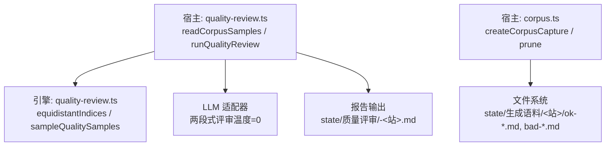
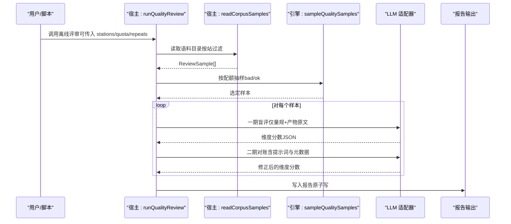
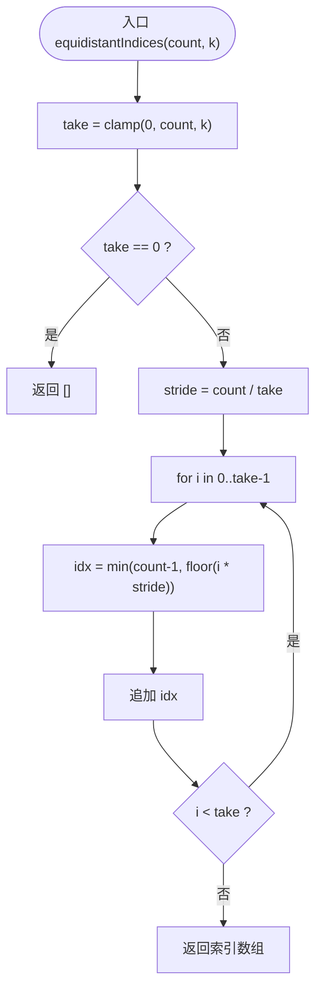
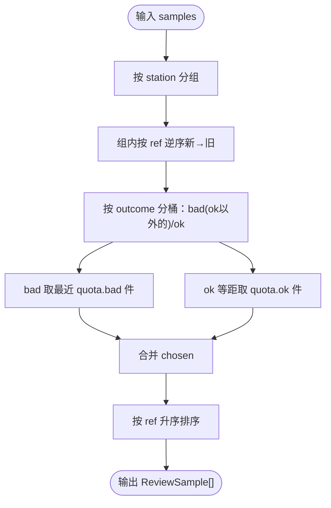
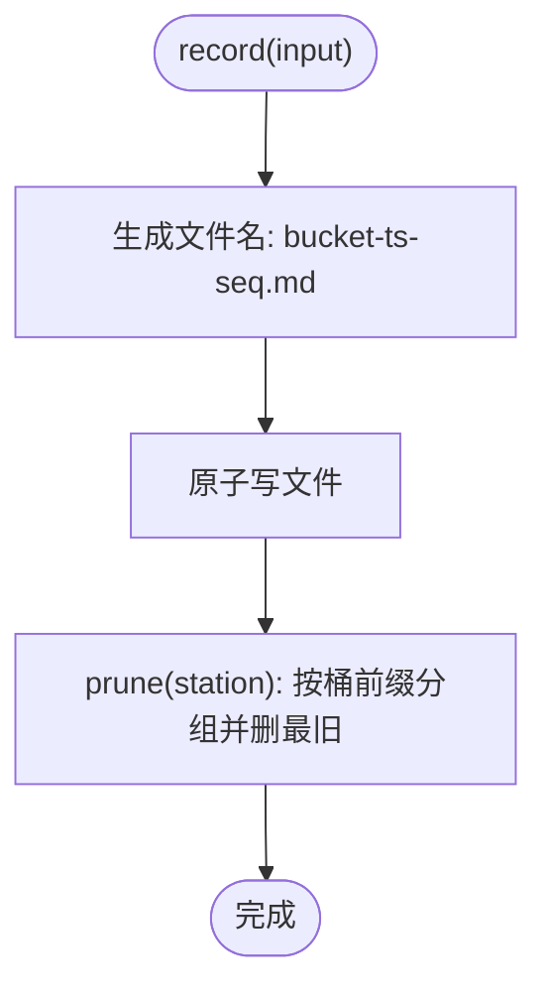
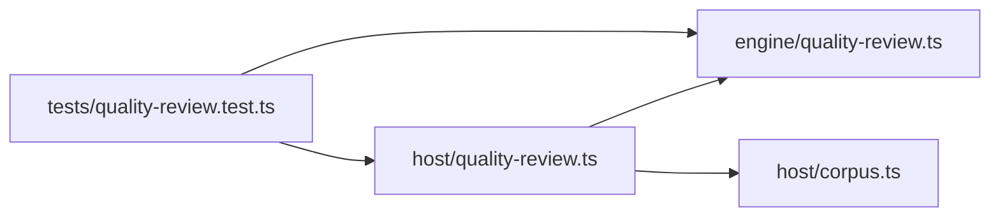

# 抽样策略

<cite>
**本文引用的文件**
- [src/engine/quality-review.ts](file://src/engine/quality-review.ts)
- [src/host/corpus.ts](file://src/host/corpus.ts)
- [src/host/quality-review.ts](file://src/host/quality-review.ts)
- [tests/quality-review.test.ts](file://tests/quality-review.test.ts)
</cite>

## 目录
1. [引言](#引言)
2. [项目结构](#项目结构)
3. [核心组件](#核心组件)
4. [架构总览](#架构总览)
5. [详细组件分析](#详细组件分析)
6. [依赖关系分析](#依赖关系分析)
7. [性能与内存考虑](#性能与内存考虑)
8. [故障排查指南](#故障排查指南)
9. [结论](#结论)

## 引言
本文件系统性说明质量评审的抽样策略：确定性等距取样、两桶定额抽样（失败件优先与成功件等距）、按站抽样的环形池口径与样本排序规则（时间戳解析与文件命名约定）、配额配置与自定义方法，以及可复现性保证（无随机数设计）和性能优化要点。目标是让读者在不深入代码的情况下也能理解并正确使用该抽样机制。

## 项目结构
与抽样相关的代码主要分布在以下位置：
- 引擎侧（纯函数、零副作用）：实现确定性等距取样、两桶抽样、评分聚合与报告渲染。
- 宿主侧（文件系统与 LLM 调用）：读取生成语料、组织抽样池、驱动评审流程并落盘报告。
- 测试用例：覆盖抽样行为、默认配额、CRLF 兼容、工具调用载荷合并视图等关键断言。

图表来源
- [src/host/quality-review.ts:80-151](file://src/host/quality-review.ts#L80-L151)
- [src/engine/quality-review.ts:122-160](file://src/engine/quality-review.ts#L122-L160)
- [src/host/corpus.ts:264-278](file://src/host/corpus.ts#L264-L278)

章节来源
- [src/host/quality-review.ts:80-151](file://src/host/quality-review.ts#L80-L151)
- [src/engine/quality-review.ts:122-160](file://src/engine/quality-review.ts#L122-L160)
- [src/host/corpus.ts:264-278](file://src/host/corpus.ts#L264-L278)

## 核心组件
- 确定性等距取样：从有序列表中按固定步长选取索引，不引入随机数，确保同输入同结果。
- 两桶定额抽样：将样本按 outcome 分为 bad（failed/tolerated）与 ok 两个桶；bad 取最近 N 件，ok 等距取 M 件。
- 按站抽样与环形池：每个站内维护独立样本列表；坏/好桶各自有上限（bad 200，ok 25），超出则删除最旧文件。
- 配额配置：DEFAULT_SAMPLE_QUOTA = { bad: 3, ok: 2 }；可通过运行参数覆盖。
- 可复现性：无随机数、温度固定为 0、证据定位核对严格、报告原子写。

章节来源
- [src/engine/quality-review.ts:56-66](file://src/engine/quality-review.ts#L56-L66)
- [src/engine/quality-review.ts:122-160](file://src/engine/quality-review.ts#L122-L160)
- [src/host/corpus.ts:27-30](file://src/host/corpus.ts#L27-L30)
- [src/host/quality-review.ts:137-141](file://src/host/quality-review.ts#L137-L141)

## 架构总览
下图展示从语料到评审报告的端到端流程，重点标注抽样与配额控制点。

图表来源
- [src/host/quality-review.ts:126-241](file://src/host/quality-review.ts#L126-L241)
- [src/engine/quality-review.ts:227-261](file://src/engine/quality-review.ts#L227-L261)

## 详细组件分析

### 确定性等距取样算法
- 目标：从 count 个元素中取 k 个，步长为 count/k，索引为 floor(i * stride)，i=0..k-1，且不超过 count-1。
- 特性：无随机数；当 k=0 返回空；当 k>count 等价于取全部；顺序稳定。
- 复杂度：时间 O(k)，空间 O(k)。

图表来源
- [src/engine/quality-review.ts:122-132](file://src/engine/quality-review.ts#L122-L132)

章节来源
- [src/engine/quality-review.ts:122-132](file://src/engine/quality-review.ts#L122-L132)
- [tests/quality-review.test.ts:94-100](file://tests/quality-review.test.ts#L94-L100)

### 两桶定额抽样机制（bad 桶与 ok 桶）
- 分组：按 station 分组，每组内按 ref 逆序（新→旧）。
- 分桶：outcome != 'ok' 归入 bad 桶；outcome == 'ok' 归入 ok 桶。
- 选择：
  - bad 桶：取最近 quota.bad 件（切片前 N）。
  - ok 桶：使用等距取样从 ok 桶取 quota.ok 件。
- 输出：合并后按 ref 升序排序，便于人读与 diff 稳定。
- 复杂度：分组 O(n)，排序 O(n log n)，抽样 O(n + k)。

图表来源
- [src/engine/quality-review.ts:134-160](file://src/engine/quality-review.ts#L134-L160)

章节来源
- [src/engine/quality-review.ts:134-160](file://src/engine/quality-review.ts#L134-L160)
- [tests/quality-review.test.ts:102-130](file://tests/quality-review.test.ts#L102-L130)

### 按站抽样的环形池口径与样本排序规则
- 环形池容量：
  - ok 桶：每站最多保留 25 件（CORPUS_KEEP_OK）。
  - bad 桶：每站最多保留 200 件（CORPUS_KEEP_BAD）。
- 修剪策略：按文件名升序（时间序）删除最旧文件，保持“最新”语义。
- 文件命名约定：
  - 前缀：ok-/bad- 表示 outcome。
  - 主体：ISO 时间戳替换冒号/点为短横线，保证字典序即时间序。
  - 序号：站内自增四位数字，保证同毫秒多条仍可排序。
- 排序规则：
  - 写入时：bucket + ts + seq 形成稳定时间序。
  - 抽样时：先按 ref 逆序（新→旧）再分桶；最终输出按 ref 升序。

图表来源
- [src/host/corpus.ts:287-300](file://src/host/corpus.ts#L287-L300)
- [src/host/corpus.ts:264-278](file://src/host/corpus.ts#L264-L278)

章节来源
- [src/host/corpus.ts:27-30](file://src/host/corpus.ts#L27-L30)
- [src/host/corpus.ts:264-300](file://src/host/corpus.ts#L264-L300)
- [src/engine/quality-review.ts:134-160](file://src/engine/quality-review.ts#L134-L160)

### 时间戳解析与文件命名约定
- 时间戳格式：ISO 8601，写入时将冒号与点替换为短横线，确保字符串比较等于时间比较。
- 站点目录：state/生成语料/<站>/，每个站独立环形池。
- 读侧解析：frontmatter 中的 ts/outcome/kind/effort/code/truncated 等字段用于构建 ReviewSample；提示词与原始输出原样保留，以便证据定位。

章节来源
- [src/host/corpus.ts:112-184](file://src/host/corpus.ts#L112-L184)
- [src/host/quality-review.ts:80-111](file://src/host/quality-review.ts#L80-L111)

### 抽样配额配置与自定义设置
- 默认配额：DEFAULT_SAMPLE_QUOTA = { bad: 3, ok: 2 }。
- 自定义方式：在运行离线评审时通过 QualityReviewRequest 的 badQuota/okQuota 覆盖。
- 行为：配额为 0 表示不抽取对应桶；两桶独立不满额不互补，避免制造“凑够配额”的假象。

章节来源
- [src/engine/quality-review.ts:56-66](file://src/engine/quality-review.ts#L56-L66)
- [src/host/quality-review.ts:53-69](file://src/host/quality-review.ts#L53-L69)
- [src/host/quality-review.ts:137-141](file://src/host/quality-review.ts#L137-L141)
- [tests/quality-review.test.ts:128-130](file://tests/quality-review.test.ts#L128-L130)

### 可复现性保证机制
- 无随机数：等距取样不使用随机种子或随机函数，保证同输入同结果。
- 温度固定：REVIEW_TEMPERATURE = 0，消除模型采样波动。
- 证据定位核对：引文去空白后必须能在产物原文中找到，否则记录 unlocated，报告显式列出。
- 报告原子写：单文件临时写后 rename，避免半写状态被读到。

章节来源
- [src/engine/quality-review.ts:24-27](file://src/engine/quality-review.ts#L24-L27)
- [src/engine/quality-review.ts:41-47](file://src/engine/quality-review.ts#L41-L47)
- [src/engine/quality-review.ts:350-362](file://src/engine/quality-review.ts#L350-L362)
- [src/host/quality-review.ts:244-255](file://src/host/quality-review.ts#L244-L255)

### 性能与内存管理
- 抽样阶段：
  - 分组与排序：O(n log n)，n 为站内样本数；通常较小（受环形池限制）。
  - 等距取样：O(k)，k 为配额，常数级开销。
- 文件 I/O：
  - 环形修剪：按桶前缀过滤并删除最旧文件，避免无限增长。
  - 原子写：tmp + rename，减少并发竞争风险。
- 评审阶段：
  - 温度=0 提升稳定性；repeats>1 用于稳定性读数但增加调用成本。
  - 未评分件（空输出）跳过评审，零模型调用。
- 内存：
  - 样本投影只保留必要字段；工具调用载荷仅在存在时附加，避免冗余。

章节来源
- [src/host/corpus.ts:264-300](file://src/host/corpus.ts#L264-L300)
- [src/host/quality-review.ts:159-209](file://src/host/quality-review.ts#L159-L209)
- [src/engine/quality-review.ts:113-118](file://src/engine/quality-review.ts#L113-L118)

## 依赖关系分析
- 宿主模块依赖引擎模块提供抽样与评分能力；引擎模块不直接访问文件系统。
- 宿主模块负责语料读取、LLM 调用与报告落盘；引擎模块专注纯函数计算。
- 测试覆盖抽样、配额、CRLF 兼容、工具调用载荷合并视图等关键点。

图表来源
- [src/host/quality-review.ts:23-51](file://src/host/quality-review.ts#L23-L51)
- [src/engine/quality-review.ts:29-37](file://src/engine/quality-review.ts#L29-L37)
- [tests/quality-review.test.ts:18-45](file://tests/quality-review.test.ts#L18-L45)

章节来源
- [src/host/quality-review.ts:23-51](file://src/host/quality-review.ts#L23-L51)
- [src/engine/quality-review.ts:29-37](file://src/engine/quality-review.ts#L29-L37)
- [tests/quality-review.test.ts:18-45](file://tests/quality-review.test.ts#L18-L45)

## 性能与内存考虑
- 抽样阶段以站为单位处理，避免跨站耦合；环形池限制内存占用。
- 评审阶段对未评分件快速跳过，减少无效 LLM 调用。
- 报告原子写避免锁竞争与部分写入问题。
- 建议：
  - 合理设置 repeats：仅当需要稳定性读数时启用。
  - 监控环形池大小：若某站样本过多，检查写入路径与修剪逻辑。
  - 关注证据定位失败率：unlocated 比例上升可能提示产物格式变化或提示词漂移。

[本节为通用指导，不直接分析具体文件]

## 故障排查指南
- 抽样结果为空：
  - 检查 stations 是否包含有量规的站；确认语料目录存在对应站目录。
  - 确认配额不为 0；bad/ok 桶是否有样本。
- 评审失败件增多：
  - 检查 LLM 应答是否可解析 JSON；确认维度齐备。
  - 查看 report.unscoreable 与 failure 字段定位原因。
- 证据定位失败：
  - 检查产物原文是否包含引文片段；注意空白差异与工具调用载荷合并视图。
  - 关注 unlocated 清单，必要时调整提示词或产物格式。
- 环形池未修剪：
  - 确认 prune 逻辑执行；检查文件命名是否符合 ok-/bad- 前缀与时间戳格式。

章节来源
- [src/host/quality-review.ts:145-148](file://src/host/quality-review.ts#L145-L148)
- [src/host/quality-review.ts:197-200](file://src/host/quality-review.ts#L197-L200)
- [src/engine/quality-review.ts:350-362](file://src/engine/quality-review.ts#L350-L362)
- [src/host/corpus.ts:264-278](file://src/host/corpus.ts#L264-L278)

## 结论
本抽样策略通过确定性等距取样与两桶定额机制，在保证可复现性的同时兼顾了失败件优先与成功件代表性。按站的环形池与严格的文件命名约定确保了样本的时效性与可控规模。配额可定制，支持不同场景下的成本与覆盖率权衡。配合温度固定与证据定位核对，整体流程具备高稳定性与可审计性。