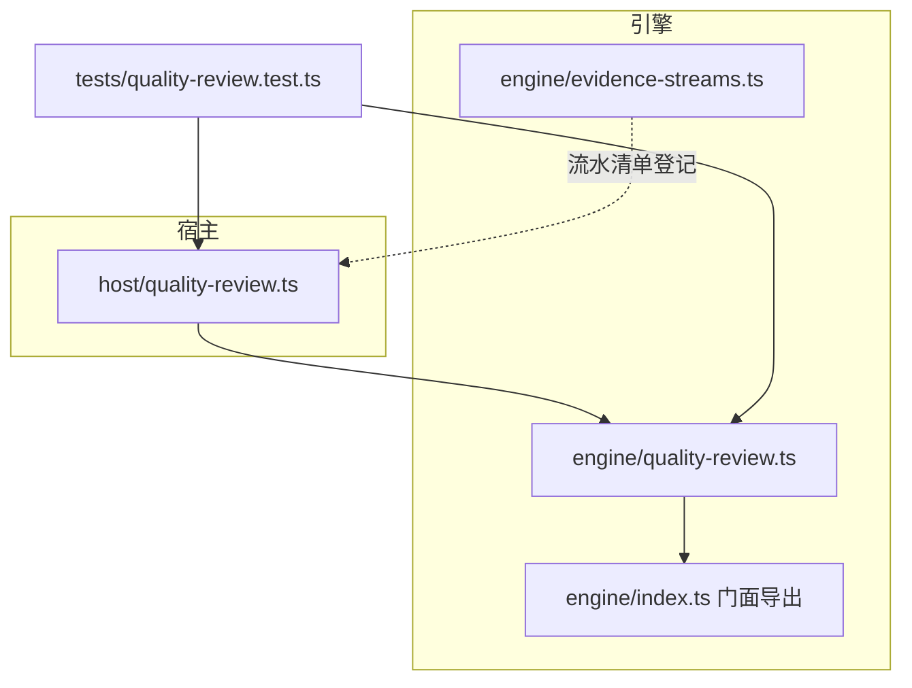
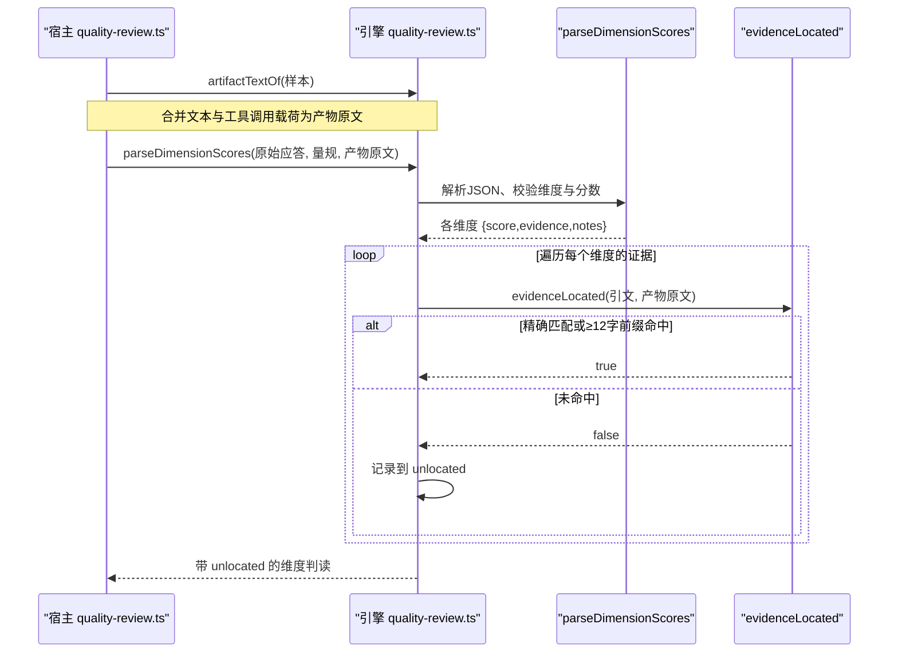
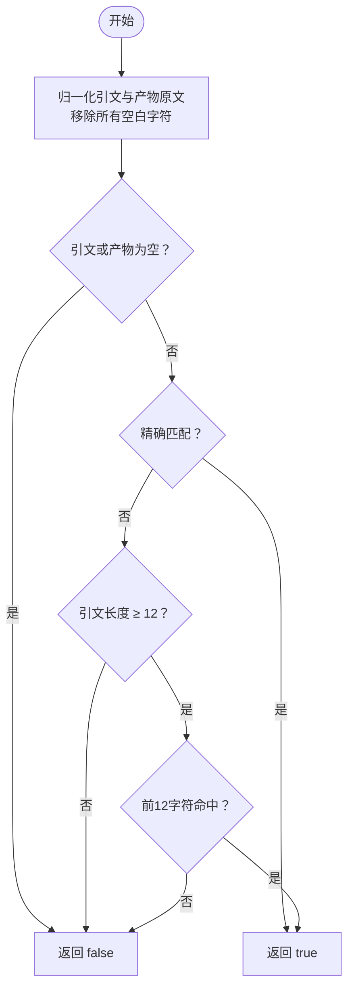
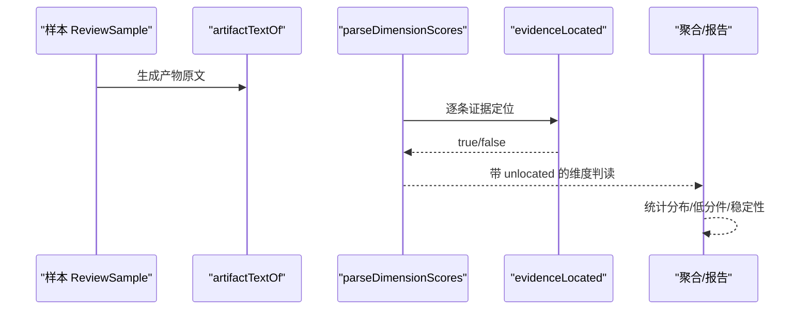
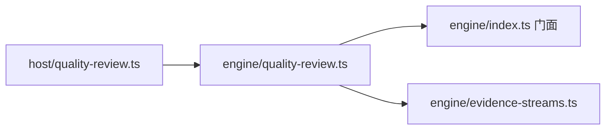

# 证据验证机制

<cite>
**本文引用的文件**
- [src/engine/quality-review.ts](file://src/engine/quality-review.ts)
- [tests/quality-review.test.ts](file://tests/quality-review.test.ts)
- [src/host/quality-review.ts](file://src/host/quality-review.ts)
- [src/engine/index.ts](file://src/engine/index.ts)
- [src/engine/evidence-streams.ts](file://src/engine/evidence-streams.ts)
</cite>

## 目录
1. [引言](#引言)
2. [项目结构](#项目结构)
3. [核心组件](#核心组件)
4. [架构总览](#架构总览)
5. [详细组件分析](#详细组件分析)
6. [依赖关系分析](#依赖关系分析)
7. [性能考量](#性能考量)
8. [故障排查指南](#故障排查指南)
9. [结论](#结论)
10. [附录](#附录)

## 引言
本文件聚焦“证据验证机制”，系统性说明证据定位核对的确定性算法、空白字符归一化与多行文本匹配策略、未定位证据（unlocated）的检测与报告机制，以及证据引用格式要求与最佳实践。同时提供失败诊断方法与常见问题的排查步骤，帮助读者正确编写有效的证据引用并快速定位问题。

## 项目结构
证据验证能力由引擎层质量评审模块实现，宿主侧负责读取样本、组装受评对象并调用解析与核对流程；测试用例覆盖关键断言，确保行为稳定可复现。

图表来源
- [src/host/quality-review.ts:180-200](file://src/host/quality-review.ts#L180-L200)
- [src/engine/quality-review.ts:103-118](file://src/engine/quality-review.ts#L103-L118)
- [src/engine/index.ts:111-117](file://src/engine/index.ts#L111-L117)
- [src/engine/evidence-streams.ts:26-39](file://src/engine/evidence-streams.ts#L26-L39)

章节来源
- [src/engine/quality-review.ts:103-118](file://src/engine/quality-review.ts#L103-L118)
- [src/host/quality-review.ts:180-200](file://src/host/quality-review.ts#L180-L200)
- [src/engine/index.ts:111-117](file://src/engine/index.ts#L111-L117)
- [src/engine/evidence-streams.ts:26-39](file://src/engine/evidence-streams.ts#L26-L39)

## 核心组件
- 受评对象合并视图：将“文本输出”和“工具调用载荷”拼接为统一产物原文，用于证据定位与提示词注入。
- 可评分性判定：仅当合并视图非空时才可评分；两者皆空视为不可评。
- 应答解析与维度对齐：从模型返回中抽取 JSON，校验维度齐备、分数合法，并按量规维度顺序组织结果。
- 证据定位核对：对每条证据引文执行“空白归一化 + 精确匹配 + ≥12 字前缀容错”的确定性核对，未命中则记入 unlocated。
- 聚合与报告：统计分布、低分件、稳定性等读数，并在报告中显式列出未定位证据。

章节来源
- [src/engine/quality-review.ts:103-118](file://src/engine/quality-review.ts#L103-L118)
- [src/engine/quality-review.ts:300-362](file://src/engine/quality-review.ts#L300-L362)
- [tests/quality-review.test.ts:169-206](file://tests/quality-review.test.ts#L169-L206)
- [tests/quality-review.test.ts:327-342](file://tests/quality-review.test.ts#L327-L342)

## 架构总览
证据验证在“宿主读样 → 构造受评对象 → 解析应答 → 逐条证据定位 → 聚合统计”的流水线中完成。

图表来源
- [src/engine/quality-review.ts:103-118](file://src/engine/quality-review.ts#L103-L118)
- [src/engine/quality-review.ts:300-362](file://src/engine/quality-review.ts#L300-L362)

## 详细组件分析

### 受评对象合并视图与可评分性
- 合并规则：先加入 trimmed 的 output，再依次追加每个 toolCalls 的 “[工具调用 <name>]\n<arguments>”，以双换行分隔。
- 可评分性：合并视图长度 > 0 即可评；两者皆空才不可评。

章节来源
- [src/engine/quality-review.ts:103-118](file://src/engine/quality-review.ts#L103-L118)
- [tests/quality-review.test.ts:169-182](file://tests/quality-review.test.ts#L169-L182)

### 应答解析与维度对齐
- 从原始应答中剥离围栏、提取首个 JSON 对象，去除尾逗号后解析。
- 维度匹配：优先 id，其次 name 兜底；重复维度报错；缺失维度整体评审失败。
- 分数校验：仅允许 1–4 整数或 null；非法值抛错。
- 证据清洗：过滤空串并去空白。

章节来源
- [src/engine/quality-review.ts:280-348](file://src/engine/quality-review.ts#L280-L348)
- [tests/quality-review.test.ts:287-314](file://tests/quality-review.test.ts#L287-L314)

### 证据定位核对算法（确定性）
- 空白归一化：将引文与产物原文中的全部空白字符序列替换为空串，消除空格、制表符、换行等差异。
- 精确匹配：若归一化后的引文作为子串存在于归一化产物原文中，则命中。
- 前缀容错：若精确匹配失败且引文归一化长度 ≥ 12，则检查产物原文是否包含该引文的前 12 个字符；命中即通过。
- 未定位记录：任何证据未命中均计入该维度的 unlocated 列表，并在聚合统计与报告中显式呈现。

图表来源
- [src/engine/quality-review.ts:350-362](file://src/engine/quality-review.ts#L350-L362)

章节来源
- [src/engine/quality-review.ts:350-362](file://src/engine/quality-review.ts#L350-L362)
- [tests/quality-review.test.ts:327-342](file://tests/quality-review.test.ts#L327-L342)

### 未定位证据（unlocated）检测与报告
- 检测时机：在解析每个维度的证据时，立即对每条证据调用定位核对，未命中者写入 unlocated。
- 报告呈现：聚合统计中累计 unlocated 数量；低分件清单与报告渲染中包含证据原文与未定位项，便于人审复核。
- 设计原则：不静默放过——即使评审员给出证据，只要无法在产物中找到对应片段，就明确标记。

章节来源
- [src/engine/quality-review.ts:300-362](file://src/engine/quality-review.ts#L300-L362)
- [tests/quality-review.test.ts:327-342](file://tests/quality-review.test.ts#L327-L342)

### 证据引用格式要求与最佳实践
- 必须来自产物原文：证据应为产物原文中的原句或合理改写（如尾部微调），保证归一化后可被精确或前缀匹配。
- 避免过度泛化：短于 12 字的片段可能无法享受前缀容错，建议尽量保留足够长度的上下文。
- 跨行与空白：不同换行、缩进、多余空格不影响匹配，但仍需保持语义一致。
- 工具调用载荷：当产物实质位于 arguments 中时，应引用载荷内的原句；合并视图会将载荷纳入产物原文。
- 示例指引（路径）：
  - 载荷内原句定位成功：[tests/quality-review.test.ts:193-206](file://tests/quality-review.test.ts#L193-L206)
  - 空白不敏感与前缀容错：[tests/quality-review.test.ts:327-342](file://tests/quality-review.test.ts#L327-L342)

章节来源
- [tests/quality-review.test.ts:193-206](file://tests/quality-review.test.ts#L193-L206)
- [tests/quality-review.test.ts:327-342](file://tests/quality-review.test.ts#L327-L342)

### 数据流与处理逻辑

图表来源
- [src/engine/quality-review.ts:103-118](file://src/engine/quality-review.ts#L103-L118)
- [src/engine/quality-review.ts:300-362](file://src/engine/quality-review.ts#L300-L362)

## 依赖关系分析
- 宿主侧 quality-review.ts 负责读取语料、构造 ReviewSample、调用引擎函数进行评审与解析。
- 引擎侧 quality-review.ts 暴露门面函数（index.ts 汇总导出），包括 artifactTextOf、isScoreable、parseDimensionScores、evidenceLocated 等。
- evidence-streams.ts 维护有读侧的追加流水清单，供数据体检使用，虽不直接参与证据定位，但体现系统对“证据流”的治理一致性。

图表来源
- [src/host/quality-review.ts:180-200](file://src/host/quality-review.ts#L180-L200)
- [src/engine/index.ts:111-117](file://src/engine/index.ts#L111-L117)
- [src/engine/evidence-streams.ts:26-39](file://src/engine/evidence-streams.ts#L26-L39)

章节来源
- [src/host/quality-review.ts:180-200](file://src/host/quality-review.ts#L180-L200)
- [src/engine/index.ts:111-117](file://src/engine/index.ts#L111-L117)
- [src/engine/evidence-streams.ts:26-39](file://src/engine/evidence-streams.ts#L26-L39)

## 性能考量
- 证据定位时间复杂度近似 O(N×M)，N 为证据条数，M 为产物原文长度；实际中产物规模有限，开销可忽略。
- 空白归一化仅需一次预处理，后续均为子串查找，常数级开销。
- 前缀容错仅在精确匹配失败时触发，减少不必要的计算。

## 故障排查指南
常见问题与解决步骤：
- 证据未定位（unlocated 不为空）
  - 检查证据是否为产物原文原句或合理改写；确认未被截断或重写导致前缀变化。
  - 若证据很短（<12 字），需确保精确匹配；否则考虑扩展上下文。
  - 若产物实质在工具调用载荷中，请引用 arguments 内的原句。
  - 参考断言位置：[tests/quality-review.test.ts:327-342](file://tests/quality-review.test.ts#L327-L342)
- 评审失败（缺少维度或非法分数）
  - 确认应答包含完整 dimensions 数组，且每个维度都有 score（可为 null）。
  - 分数必须为 1–4 整数或 null；其他值会抛错。
  - 参考断言位置：[tests/quality-review.test.ts:287-314](file://tests/quality-review.test.ts#L287-L314)
- 受评对象为空导致不可评
  - 若 output 为空但存在 toolCalls，仍应可评；确认合并视图是否正确构建。
  - 参考断言位置：[tests/quality-review.test.ts:169-182](file://tests/quality-review.test.ts#L169-L182)
- 工具调用载荷未纳入产物
  - 确认宿主侧已将 toolCalls 投影到样本，并使用 artifactTextOf 生成产物原文。
  - 参考实现位置：[src/engine/quality-review.ts:103-118](file://src/engine/quality-review.ts#L103-L118)

章节来源
- [tests/quality-review.test.ts:169-182](file://tests/quality-review.test.ts#L169-L182)
- [tests/quality-review.test.ts:287-314](file://tests/quality-review.test.ts#L287-L314)
- [tests/quality-review.test.ts:327-342](file://tests/quality-review.test.ts#L327-L342)
- [src/engine/quality-review.ts:103-118](file://src/engine/quality-review.ts#L103-L118)

## 结论
证据验证机制通过“合并视图 + 空白归一化 + 精确匹配 + ≥12 字前缀容错”的确定性算法，确保每条证据都能在产物原文中被核验；未定位证据被显式记录并在报告中呈现，避免静默放行。配合严格的应答解析与维度对齐，形成闭环的质量评审流水线，既保障可复现性，也为后续人审提供充分依据。

## 附录
- 相关常量与门面导出：
  - 评审温度、标签、抽样配额等常量与函数均在引擎门面集中导出，便于宿主统一消费。
  - 参考导出位置：[src/engine/index.ts:111-117](file://src/engine/index.ts#L111-L117)