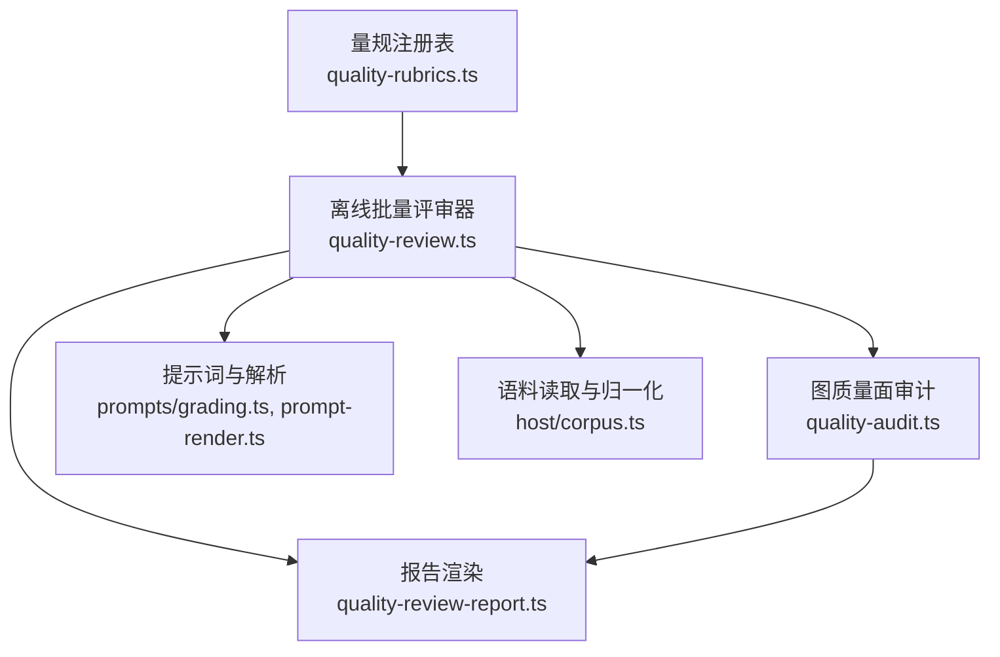
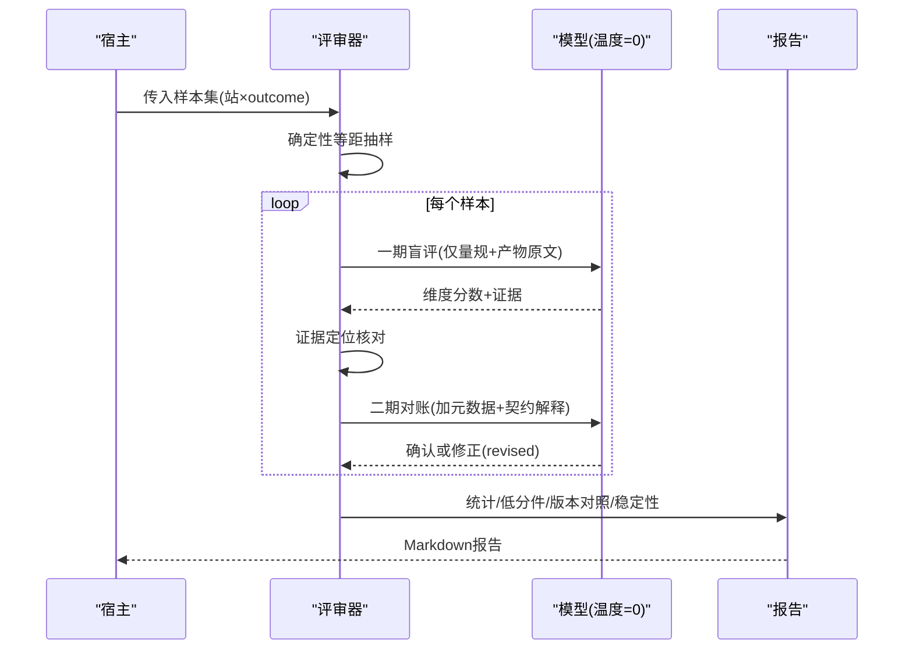
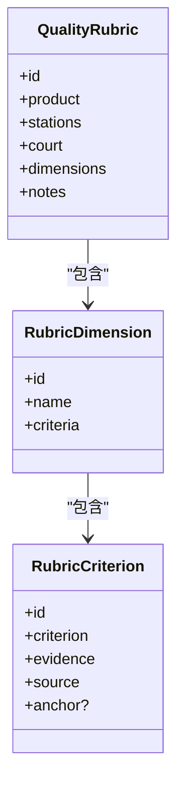
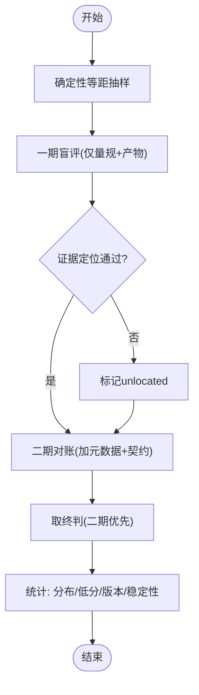
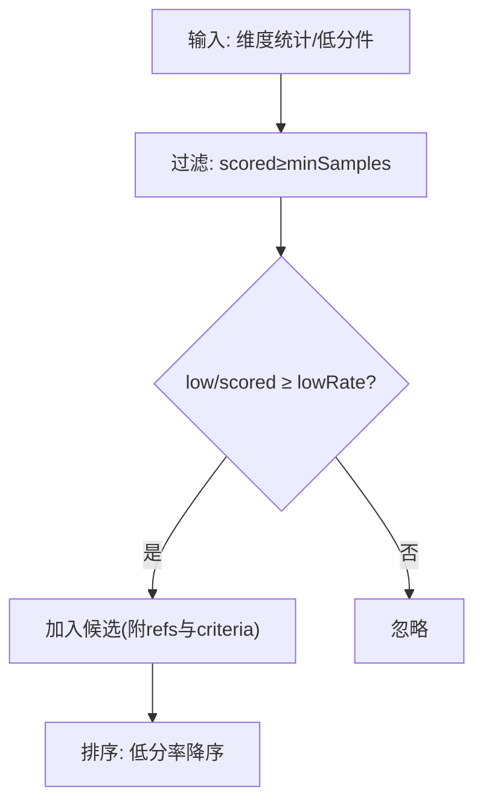
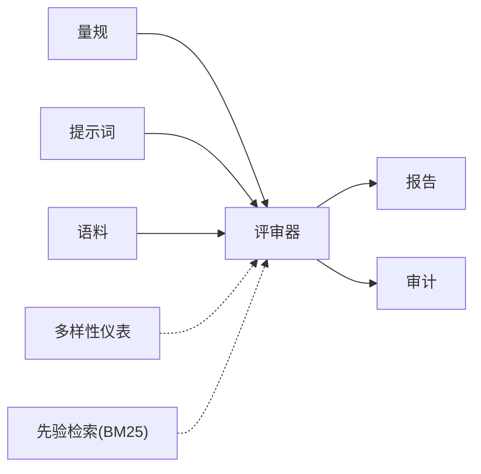

# 评分机制

<cite>
**本文引用的文件**
- [quality-rubrics.ts](file://src/engine/quality-rubrics.ts)
- [quality-review.ts](file://src/engine/quality-review.ts)
- [quality-audit.ts](file://src/engine/quality-audit.ts)
- [quality-review-report.ts](file://src/engine/quality-review-report.ts)
- [grading.ts](file://src/engine/prompts/grading.ts)
- [prompt-render.ts](file://src/engine/prompt-render.ts)
- [vault-prior.ts](file://src/engine/vault-prior.ts)
- [question-diversity.ts](file://src/engine/question-diversity.ts)
- [project-exec.ts](file://src/engine/project-exec.ts)
- [params.ts](file://src/engine/params.ts)
- [srs.ts](file://src/engine/srs.ts)
- [xp.ts](file://src/engine/xp.ts)
- [content-subsystem.ts](file://src/engine/content-subsystem.ts)
- [corpus.ts](file://src/host/corpus.ts)
- [CONTEXT.md](file://CONTEXT.md)
</cite>

## 目录
1. [简介](#简介)
2. [项目结构](#项目结构)
3. [核心组件](#核心组件)
4. [架构总览](#架构总览)
5. [详细组件分析](#详细组件分析)
6. [依赖关系分析](#依赖关系分析)
7. [性能与可维护性](#性能与可维护性)
8. [故障排查指南](#故障排查指南)
9. [结论](#结论)
10. [附录：阈值与参数清单](#附录阈值与参数清单)

## 简介
本文件系统化阐述“评分机制”的设计与实现，覆盖内容质量指标的量化方法（可读性、准确性、相关性）、格式合规性检查的计分规则（结构完整性、语法正确性）、结构完整性验证的权重分配、评分算法的实现细节（加权计算与阈值策略），以及评分结果的解释与改进建议生成。同时提供评分标准的定制化与调优指南，帮助在保持判定一致性的前提下持续优化评审效果。

## 项目结构
评分机制由“量规注册表 + 离线批量评审器 + 审计候选发现 + 报告渲染”构成，围绕“判定标准先于判定器”的原则展开：
- 量规注册表定义维度与判据，不直接参与打分流程；
- 评审器按站抽样、两段式提示词驱动 AI 逐维度评分，并做证据定位核对；
- 审计模块基于统计低分率发现系统性问题候选；
- 报告模块输出人读 Markdown，包含分布、低分件、版本对照与稳定性读数。

**图示来源**
- [quality-rubrics.ts:40-57](file://src/engine/quality-rubrics.ts#L40-L57)
- [quality-review.ts:138-177](file://src/engine/quality-review.ts#L138-L177)
- [quality-audit.ts:50-74](file://src/engine/quality-audit.ts#L50-L74)
- [corpus.ts:104-117](file://src/host/corpus.ts#L104-L117)

**章节来源**
- [quality-rubrics.ts:1-57](file://src/engine/quality-rubrics.ts#L1-L57)
- [quality-review.ts:1-28](file://src/engine/quality-review.ts#L1-L28)
- [CONTEXT.md:179-197](file://CONTEXT.md#L179-L197)

## 核心组件
- 质量量规注册表：以“产物类型 × 维度 × 判据”组织，每条判据含标准、证据要求与出处锚点，拒绝总分维度，强调分层法庭（AI提议、人审终审、结果法院各守领域）。
- 离线批量评审器：确定性抽样、两段式防锚定提示词、逐维度评分、证据定位核对、聚合统计（分布、低分件、版本对照、稳定性）。
- 图质量面审计：声明审计面、计算系统性候选（低分率越线即入候选），为票面提供贴行素材。
- 报告渲染：将统计与低分件、模板版本对照、稳定性读数输出为 Markdown，供人审对表。

**章节来源**
- [quality-rubrics.ts:17-57](file://src/engine/quality-rubrics.ts#L17-L57)
- [quality-review.ts:41-65](file://src/engine/quality-review.ts#L41-L65)
- [quality-audit.ts:76-120](file://src/engine/quality-audit.ts#L76-L120)

## 架构总览
评分机制遵循“先有标准，后有执行”的分层设计：
- 标准层：量规注册表（维度与判据）；
- 执行层：评审器（抽样、提示词、评分、解析、核对、聚合）；
- 审计层：系统性候选发现；
- 呈现层：报告渲染。

**图示来源**
- [quality-review.ts:122-160](file://src/engine/quality-review.ts#L122-L160)
- [quality-review.ts:227-261](file://src/engine/quality-review.ts#L227-L261)
- [quality-review.ts:300-362](file://src/engine/quality-review.ts#L300-L362)
- [quality-review.ts:412-593](file://src/engine/quality-review.ts#L412-L593)

## 详细组件分析

### 质量量规注册表（内容与格式维度的基准）
- 五份量规覆盖大纲、节正文、题目、教练回合、种子·终点；每条判据三要素：判定标准、证据要求、出处锚点。
- 拒绝跨维度总分，维度正交，避免合成噪声；分层法庭明确 AI 评分仅为提议。
- 提供扁平视图 allCriteria() 供评审器消费，确保“判据不重写”，只由注册表驱动。

**图示来源**
- [quality-rubrics.ts:40-57](file://src/engine/quality-rubrics.ts#L40-L57)
- [quality-rubrics.ts:27-38](file://src/engine/quality-rubrics.ts#L27-L38)

**章节来源**
- [quality-rubrics.ts:1-57](file://src/engine/quality-rubrics.ts#L1-L57)
- [CONTEXT.md:179-197](file://CONTEXT.md#L179-L197)

### 离线批量评审器（评分算法与证据核对）
- 温度固定为 0，effort 恒 deep，保证可比性与可复算；失败码与容忍命中优先采样，成功件等距补足。
- 两段式防锚定：一期盲评不给元数据，二期对账才给提示词与元数据，允许修正并记录 revised。
- 证据定位核对：去空白后必须能在产物原文找到，或满足≥12字前缀命中；未定位项显式列出。
- 聚合统计：维度分布、低分件清单、模板版本对照、重复评审稳定性（一致率与平均档差）。

**图示来源**
- [quality-review.ts:41-65](file://src/engine/quality-review.ts#L41-L65)
- [quality-review.ts:227-261](file://src/engine/quality-review.ts#L227-L261)
- [quality-review.ts:350-362](file://src/engine/quality-review.ts#L350-L362)
- [quality-review.ts:412-593](file://src/engine/quality-review.ts#L412-L593)

**章节来源**
- [quality-review.ts:1-28](file://src/engine/quality-review.ts#L1-L28)
- [quality-review.ts:122-177](file://src/engine/quality-review.ts#L122-L177)
- [quality-review.ts:300-362](file://src/engine/quality-review.ts#L300-L362)
- [quality-review.ts:412-593](file://src/engine/quality-review.ts#L412-L593)

### 图质量面审计（系统性问题候选发现）
- 审计面清单声明本轮审了什么、没审什么，避免“跑过一轮=全面覆盖”的误读。
- 系统性候选：按（站×维度）计算低分率，超过预注册线（≥2件已判档且低分率≥50%）即入候选，带低分件引用与判据出处。
- 候选为“提议”，需人审裁决是否蒸馏为新票或修改量规/提示词。

**图示来源**
- [quality-audit.ts:76-120](file://src/engine/quality-audit.ts#L76-L120)

**章节来源**
- [quality-audit.ts:1-17](file://src/engine/quality-audit.ts#L1-L17)
- [quality-audit.ts:50-74](file://src/engine/quality-audit.ts#L50-L74)
- [quality-audit.ts:76-120](file://src/engine/quality-audit.ts#L76-L120)

### 报告渲染（人读可读性与可追溯性）
- 报告包含：逐站×维度分布、低分件清单、模板版本对照视图、重复评审稳定性读数。
- 报告落盘不进 canonical，单文件原子写；评审调用本身进入语料（站标签“质量评审”）。
- 报告中的每条分数均可指回具体语料文件与产物原文的证据引用。

**章节来源**
- [quality-review.ts:412-593](file://src/engine/quality-review.ts#L412-L593)
- [CONTEXT.md:179-197](file://CONTEXT.md#L179-L197)

### 内容质量指标量化（可读性、准确性、相关性）
- 可读性：通过量规中关于表达清晰度、结构划分、术语一致性等判据评估；证据要求强制引原文定位，避免空泛评价。
- 准确性：以判据兑现度为核心，结合答案键正确性、讲解兑现教学法承诺、题目不趋同等；第二意见门独立解题对账保障答案键准确性。
- 相关性：通过“与相邻节衔接”“检索点”“误解坑位”等判据衡量内容前后一致性与学习路径连贯性。

说明：上述指标并非单一总分，而是维度级读数；多样性仪表（题型熵、干扰项编辑距离、self-BLEU）用于检测趋同，不与质量分合并。

**章节来源**
- [quality-rubrics.ts:60-440](file://src/engine/quality-rubrics.ts#L60-L440)
- [question-diversity.ts:16-32](file://src/engine/question-diversity.ts#L16-L32)
- [CONTEXT.md:179-197](file://CONTEXT.md#L179-L197)

### 格式合规性检查（结构完整性、语法正确性）
- 结构完整性：大纲/节正文/题目均有明确的 schema 与契约校验（如 sections、questions、note/route/ops 等字段存在性与类型约束），失败则报 finding。
- 语法正确性：富内容块（plot/chart/svg）清洗与修复、交互件门（完成上报/外联/大小限制）、YAML/JSON 转义损坏修复、LaTeX 命令还原。
- 输出契约后置：最终 prompt 末段为契约段，禁止在契约段内新增一级节；拼装缝文本门防止模板变量直插破坏契约。

**章节来源**
- [output-contracts.ts]（见测试用例引用）
- [tests/output-contract.test.ts:157-183](file://tests/output-contract.test.ts#L157-L183)
- [tests/prompt-contract.test.ts:27-350](file://tests/prompt-contract.test.ts#L27-L350)
- [tests/question-hygiene.test.ts:1-31](file://tests/question-hygiene.test.ts#L1-L31)

### 结构完整性验证的权重分配机制
- 量规维度间不作加权合成，拒绝总分维度；各维度独立读数，便于定位具体问题。
- 对于需要数值化的场景（如先验检索、难度校准、执行事件评分），采用明确的加权公式与阈值：
  - 先验检索 BM25：IDF 恒正 RSJ，词频饱和 k1=1.2，长度归一 b=0.75，标题字段加权 boost=3。
  - 难度校准因子 k：FSRS difficulty 按题权重加权平均，clamp [0.5, 3]。
  - 执行事件评分映射到 0–1，EMA 滚动更新。
  - 分类阈值：CROSS_AXIS_THRESHOLD 用于二维象限分类；TIER_REC_* 系列阈值用于入档推荐。

**章节来源**
- [vault-prior.ts:313-344](file://src/engine/vault-prior.ts#L313-L344)
- [xp.ts:44-70](file://src/engine/xp.ts#L44-L70)
- [project-exec.ts:135-191](file://src/engine/project-exec.ts#L135-L191)
- [params.ts:35-46](file://src/engine/params.ts#L35-L46)

### 评分算法实现细节（加权计算与阈值策略）
- 抽样配额：bad 桶定额取最近 N 件，ok 桶等距取 M 件；无随机数，同输入同抽样。
- 评分档位：1–4 四档（未兑现/部分兑现/基本兑现/充分兑现），≤2 视为低分。
- 证据定位：去空白匹配或≥12字前缀命中；未定位项计入 unlocated。
- 稳定性：同件多轮一致率与平均档差，反映模型侧漂移。
- 阈值策略：SYSTEMIC_MIN_SAMPLES=2，SYSTEMIC_LOW_RATE=0.5；REVIEW_TEMPERATURE=0；LOW_SCORE_THRESHOLD=2。

**章节来源**
- [quality-review.ts:41-65](file://src/engine/quality-review.ts#L41-L65)
- [quality-review.ts:122-160](file://src/engine/quality-review.ts#L122-L160)
- [quality-review.ts:350-362](file://src/engine/quality-review.ts#L350-L362)
- [quality-audit.ts:76-120](file://src/engine/quality-audit.ts#L76-L120)

### 评分结果解释与改进建议生成
- 解释方法：报告提供维度分布、低分件清单、版本对照与稳定性读数；每条分数可回溯至语料文件与产物原文证据。
- 改进建议：系统性候选（低分率越线）作为“可能成系统性问题”的提议，附带低分件引用与判据出处，供人审蒸馏为新票或修改量规/提示词。
- 反馈闭环：评审失败件与未评分件单独列示，避免将“评审失败”等同于“产物差”。

**章节来源**
- [quality-review.ts:412-593](file://src/engine/quality-review.ts#L412-L593)
- [quality-audit.ts:96-120](file://src/engine/quality-audit.ts#L96-L120)

### 评分标准的定制化与调优指南
- 定制维度与判据：在量规注册表中新增/调整维度与判据，确保每条判据具备证据要求与出处锚点；避免引入总分维度。
- 调整阈值：根据业务目标调整 SYSTEMIC_MIN_SAMPLES、SYSTEMIC_LOW_RATE、LOW_SCORE_THRESHOLD；谨慎变更 REVIEW_TEMPERATURE（会改变口径）。
- 提示词与契约：通过输出契约后置与变更登记门，确保最终 prompt 末段为契约段，避免契约句漂移。
- 多样性与质量解耦：使用多样性仪表检测趋同，但不与质量分合并；判断须与评审抽样池交叉看。

**章节来源**
- [quality-rubrics.ts:17-57](file://src/engine/quality-rubrics.ts#L17-L57)
- [quality-audit.ts:76-120](file://src/engine/quality-audit.ts#L76-L120)
- [tests/output-contract.test.ts:157-183](file://tests/output-contract.test.ts#L157-L183)
- [question-diversity.ts:16-32](file://src/engine/question-diversity.ts#L16-L32)

## 依赖关系分析
- 评审器依赖量规注册表与提示词模板，依赖语料读取与归一化；报告渲染依赖评审器统计。
- 审计模块复用评审器的统计接口，注入审计面清单与阈值。
- 多样性仪表与先验检索为内容质量提供辅助读数，但不参与评分合成。

**图示来源**
- [quality-review.ts:138-177](file://src/engine/quality-review.ts#L138-L177)
- [quality-audit.ts:50-74](file://src/engine/quality-audit.ts#L50-L74)
- [vault-prior.ts:313-344](file://src/engine/vault-prior.ts#L313-L344)
- [question-diversity.ts:16-32](file://src/engine/question-diversity.ts#L16-L32)

**章节来源**
- [quality-review.ts:1-28](file://src/engine/quality-review.ts#L1-L28)
- [quality-audit.ts:1-17](file://src/engine/quality-audit.ts#L1-L17)

## 性能与可维护性
- 确定性：抽样、证据核对、稳定性计算均无随机数，保证可复算与回归测试稳定。
- 纯函数：评审器与审计模块零副作用，便于单元测试与回放。
- 成本纪律：温度固定为 0，effort 恒 deep；报告落盘不进 canonical，避免污染正典。
- 可维护性：量规与提示词分离，契约后置与变更登记门降低漂移风险；测试覆盖关键路径（抽样、解析、核对、聚合）。

**章节来源**
- [quality-review.ts:41-65](file://src/engine/quality-review.ts#L41-L65)
- [quality-review.ts:300-362](file://src/engine/quality-review.ts#L300-L362)
- [tests/output-contract.test.ts:157-183](file://tests/output-contract.test.ts#L157-L183)

## 故障排查指南
- 评审失败：应答不可解析或缺维度时记 failure，报告单列未评分件；检查提示词与输出规格是否匹配。
- 证据未定位：检查产物原文与证据引用是否一致，注意空白归一与≥12字前缀命中规则。
- 低分率高：查看系统性候选，定位具体判据与低分件，考虑修改量规或提示词。
- 模板版本漂移：通过版本对照视图定位模板版本差异，确保契约段位置正确。

**章节来源**
- [quality-review.ts:300-362](file://src/engine/quality-review.ts#L300-L362)
- [quality-audit.ts:96-120](file://src/engine/quality-audit.ts#L96-L120)
- [quality-review.ts:503-545](file://src/engine/quality-review.ts#L503-L545)

## 结论
本评分机制以“量规先行、证据驱动、分层法庭”为核心，通过确定性抽样、两段式防锚定、证据定位核对与系统候选发现，构建了可复算、可追溯、可定制的内容质量评估体系。维度正交、拒绝总分，确保问题定位精准；多样性与先验检索提供辅助读数，不参与评分合成。通过阈值策略与契约后置，兼顾稳定性与可维护性，支持持续调优与扩展。

## 附录：阈值与参数清单
- REVIEW_TEMPERATURE = 0（温度固定）
- LOW_SCORE_THRESHOLD = 2（低分阈值）
- SYSTEMIC_MIN_SAMPLES = 2（系统性候选最小样本）
- SYSTEMIC_LOW_RATE = 0.5（系统性候选低分率阈值）
- BM25_K1 = 1.2（词频饱和）
- BM25_B = 0.75（长度归一）
- TITLE_FIELD_BOOST = 3（标题字段加权）
- CROSS_AXIS_THRESHOLD（二维分类阈值，见 project-exec.ts）
- TIER_REC_MIN_EVENTS / TIER_REC_PROMOTE_SCORE / TIER_REC_DEMOTE_SCORE（入档推荐阈值，见 params.ts）

**章节来源**
- [quality-review.ts:41-65](file://src/engine/quality-review.ts#L41-L65)
- [quality-audit.ts:76-78](file://src/engine/quality-audit.ts#L76-L78)
- [vault-prior.ts:313-344](file://src/engine/vault-prior.ts#L313-L344)
- [project-exec.ts:170-178](file://src/engine/project-exec.ts#L170-L178)
- [params.ts:35-46](file://src/engine/params.ts#L35-L46)