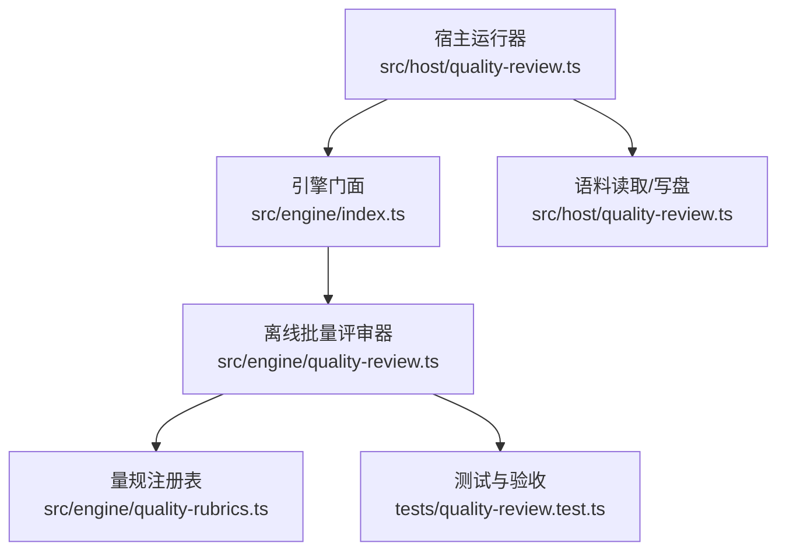
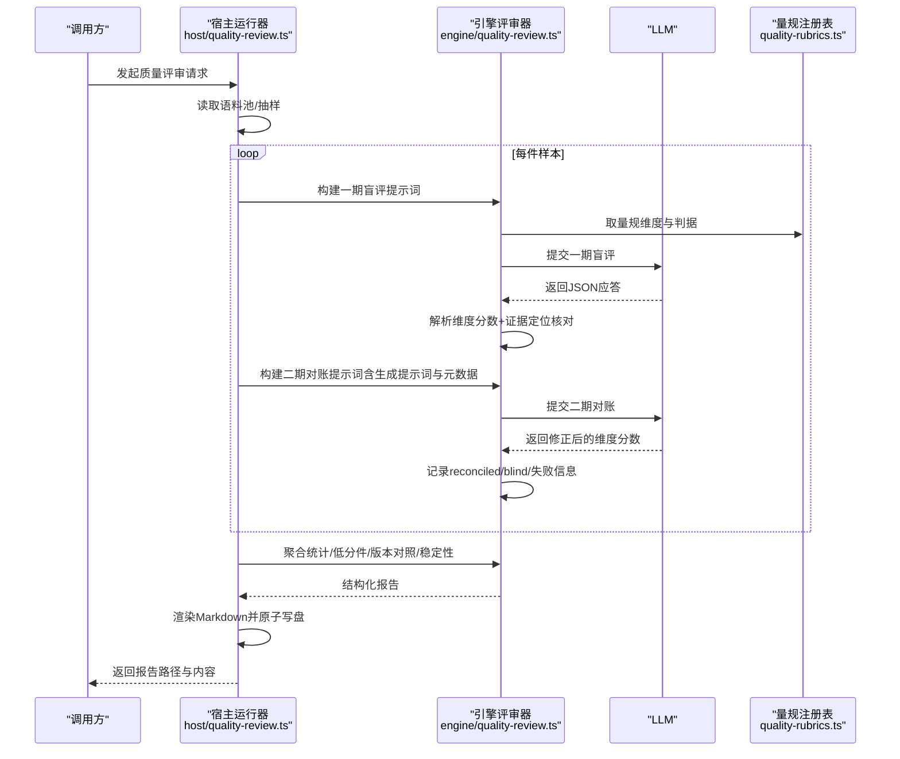
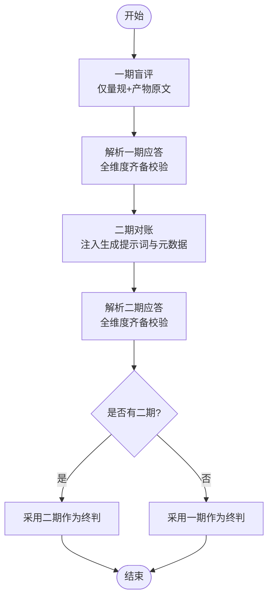
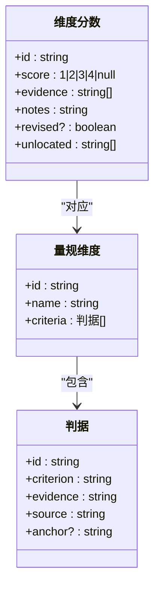
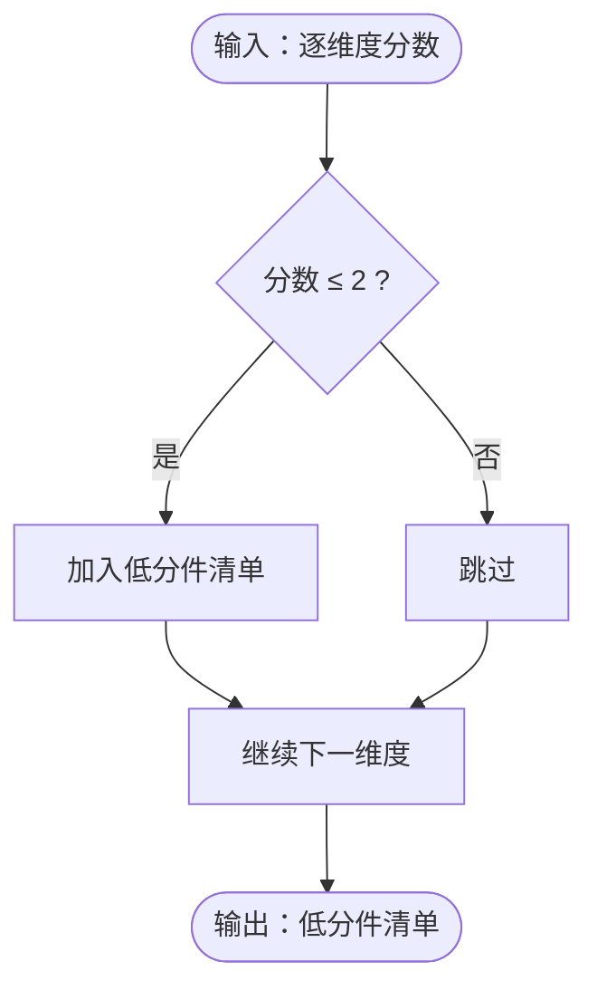
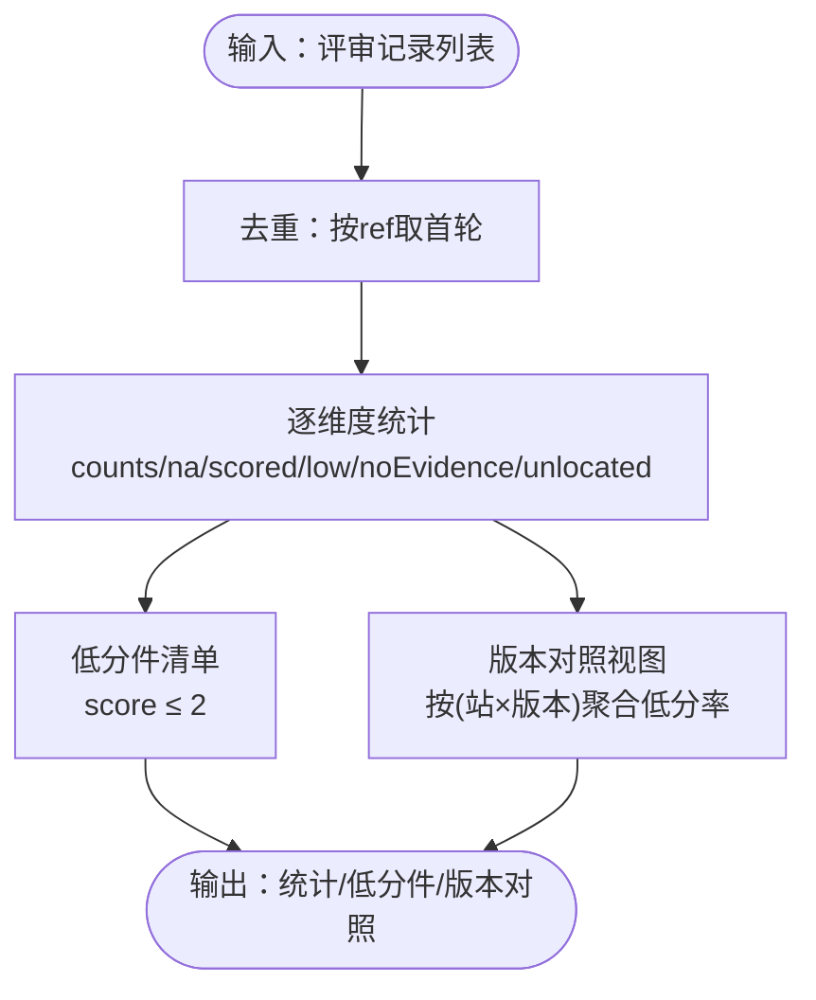
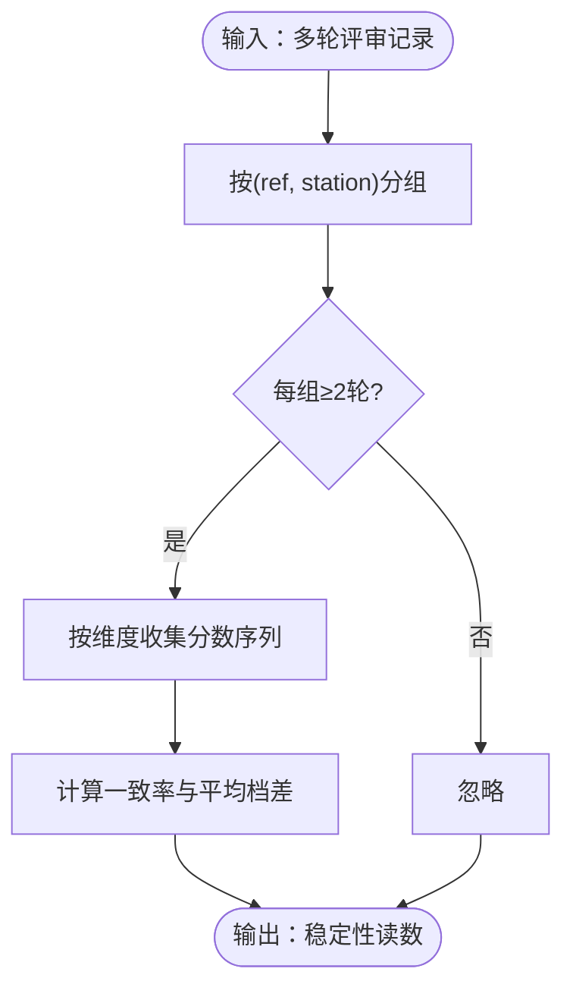
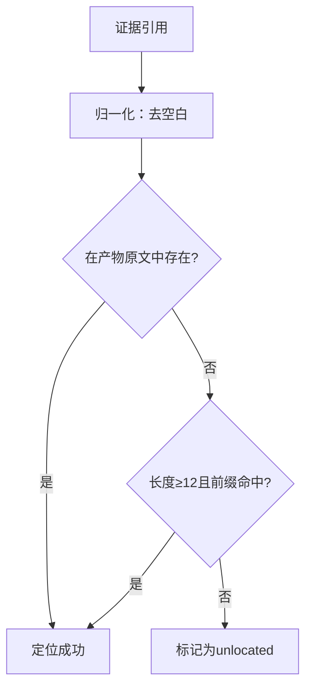
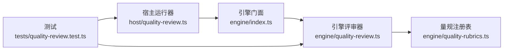

# 评分算法实现

<cite>
**本文引用的文件**
- [src/engine/quality-review.ts](file://src/engine/quality-review.ts)
- [src/host/quality-review.ts](file://src/host/quality-review.ts)
- [src/engine/quality-rubrics.ts](file://src/engine/quality-rubrics.ts)
- [src/engine/index.ts](file://src/engine/index.ts)
- [tests/quality-review.test.ts](file://tests/quality-review.test.ts)
- [docs/research/quality-review-224-report/2026-09-13T14-00-02-359Z-种子起草.md](file://docs/research/quality-review-224-report/2026-09-13T14-00-02-359Z-种子起草.md)
</cite>

## 目录
1. [简介](#简介)
2. [项目结构](#项目结构)
3. [核心组件](#核心组件)
4. [架构总览](#架构总览)
5. [详细组件分析](#详细组件分析)
6. [依赖关系分析](#依赖关系分析)
7. [性能考量](#性能考量)
8. [故障排查指南](#故障排查指南)
9. [结论](#结论)
10. [附录](#附录)

## 简介
本文件系统化说明“两段式防锚定评审”的评分算法实现，覆盖一期盲评与二期对账流程、量化评分标准（1–4档）、低分阈值与自动识别、逐维度聚合与分布计算、低分件清单生成、稳定性分析与重复评审一致性检测，以及配置选项与性能优化建议。该机制以“判定标准先于判定器”为原则：评分口径来自量规注册表，评审器仅负责提示词拼装、应答解析、证据定位核对与报告渲染。

## 项目结构
围绕质量评审的关键代码分布在引擎层与宿主适配层：
- 引擎层（纯函数、零副作用）：抽样、提示词构造、应答解析、证据定位、聚合统计、版本对照、稳定性计算等。
- 宿主层（文件系统与模型调用）：语料读取、LLM 调用、报告落盘。
- 量规注册表：定义五类产物对应的维度与判据，作为唯一权威来源。

图表来源
- [src/host/quality-review.ts:124-241](file://src/host/quality-review.ts#L124-L241)
- [src/engine/index.ts:104-127](file://src/engine/index.ts#L104-L127)
- [src/engine/quality-review.ts:120-261](file://src/engine/quality-review.ts#L120-L261)
- [src/engine/quality-rubrics.ts:17-57](file://src/engine/quality-rubrics.ts#L17-L57)

章节来源
- [src/host/quality-review.ts:124-241](file://src/host/quality-review.ts#L124-L241)
- [src/engine/index.ts:104-127](file://src/engine/index.ts#L104-L127)

## 核心组件
- 两段式防锚定评审：一期盲评只给产物原文与量规；二期对账才注入生成提示词与元数据，允许修正并记录差异。
- 评分标准量化：1–4档（未兑现/部分兑现/基本兑现/充分兑现），无总分；每维度独立。
- 低分阈值：≤2分为低分，用于低分件清单与系统性候选筛选。
- 聚合计算：按站×维度统计分布、不可判件数、低分件数、无证据与引文未定位计数。
- 稳定性分析：同输入重复评审的一致率与平均档差，温度固定为0保证可比性。
- 版本对照视图：按（站×模板版本）聚合低分率，便于跨版本比较同一维度的低分率。

章节来源
- [src/engine/quality-review.ts:41-54](file://src/engine/quality-review.ts#L41-L54)
- [src/engine/quality-review.ts:227-261](file://src/engine/quality-review.ts#L227-L261)
- [src/engine/quality-review.ts:412-501](file://src/engine/quality-review.ts#L412-L501)
- [src/engine/quality-review.ts:516-593](file://src/engine/quality-review.ts#L516-L593)

## 架构总览
整体流程从宿主触发，经引擎完成抽样、两段式评审、聚合与报告渲染，最终落盘人读报告。

图表来源
- [src/host/quality-review.ts:159-210](file://src/host/quality-review.ts#L159-L210)
- [src/engine/quality-review.ts:227-261](file://src/engine/quality-review.ts#L227-L261)
- [src/engine/quality-review.ts:412-501](file://src/engine/quality-review.ts#L412-L501)
- [src/engine/quality-rubrics.ts:17-57](file://src/engine/quality-rubrics.ts#L17-L57)

## 详细组件分析

### 两段式防锚定评审流程
- 一期盲评：仅向模型提供量规与产物原文（合并视图：文本 + 工具调用载荷），不暴露生成提示词与样本级元数据（站名、outcome、模板版本等），避免锚定。
- 二期对账：在保留一期判读基础上，注入生成提示词与元数据，要求模型逐维度确认或修正，并标注是否修订（revised）。
- 终判规则：若存在二期则取二期；否则回退到一期；评审失败（应答不可解析或缺维度）不产生终判，单独列示。

图表来源
- [src/host/quality-review.ts:181-200](file://src/host/quality-review.ts#L181-L200)
- [src/engine/quality-review.ts:227-261](file://src/engine/quality-review.ts#L227-L261)
- [src/engine/quality-review.ts:300-348](file://src/engine/quality-review.ts#L300-L348)
- [src/engine/quality-review.ts:388-395](file://src/engine/quality-review.ts#L388-L395)

章节来源
- [src/host/quality-review.ts:181-200](file://src/host/quality-review.ts#L181-L200)
- [src/engine/quality-review.ts:227-261](file://src/engine/quality-review.ts#L227-L261)
- [src/engine/quality-review.ts:300-348](file://src/engine/quality-review.ts#L300-L348)
- [src/engine/quality-review.ts:388-395](file://src/engine/quality-review.ts#L388-L395)

### 评分标准的量化方法（1–4档）
- 档位定义：1=未兑现，2=部分兑现，3=基本兑现，4=充分兑现。
- 无总分：各维度正交，不做加权合成；报告不得出现跨维度总分。
- 证据要求：每个维度必须附带产物原文中的证据引用；证据需通过确定性定位核对，找不到记 unlocated。
- 不可判：当产物本身不可判时，维度分数为 null（不计入分布，但计入未评分件）。

图表来源
- [src/engine/quality-rubrics.ts:27-57](file://src/engine/quality-rubrics.ts#L27-L57)
- [src/engine/quality-review.ts:265-278](file://src/engine/quality-review.ts#L265-L278)

章节来源
- [src/engine/quality-rubrics.ts:27-57](file://src/engine/quality-rubrics.ts#L27-L57)
- [src/engine/quality-review.ts:265-278](file://src/engine/quality-review.ts#L265-L278)

### 低分阈值设定与自动识别
- 低分阈值：≤2分为低分（LOW_SCORE_THRESHOLD = 2）。
- 自动识别：在聚合阶段，将低分件抽取为清单，供报告展示与后续审计使用。
- 评审失败件：即使有低分也不进入低分件清单（评审失败 ≠ 产物差）。

图表来源
- [src/engine/quality-review.ts:465-501](file://src/engine/quality-review.ts#L465-L501)
- [src/engine/quality-review.ts:412-463](file://src/engine/quality-review.ts#L412-L463)

章节来源
- [src/engine/quality-review.ts:412-463](file://src/engine/quality-review.ts#L412-L463)
- [src/engine/quality-review.ts:465-501](file://src/engine/quality-review.ts#L465-L501)

### 聚合计算方法（逐维度统计、分布、低分件清单）
- 逐维度统计：按（站 × 维度）统计 counts[1..4]、na（不可判）、scored（已判档）、low（低分）、noEvidence（无证据）、unlocated（引文未定位）。
- 分布计算：基于终判（二期优先，否则一期），评审失败件不参与分布。
- 低分件清单：过滤 score ≤ 2 的维度项，附 ref、维度名、证据、模板版本、是否修订。
- 版本对照视图：按（站 × 模板版本）聚合低分率，维度间不合成。

图表来源
- [src/engine/quality-review.ts:397-408](file://src/engine/quality-review.ts#L397-L408)
- [src/engine/quality-review.ts:412-463](file://src/engine/quality-review.ts#L412-L463)
- [src/engine/quality-review.ts:465-501](file://src/engine/quality-review.ts#L465-L501)
- [src/engine/quality-review.ts:516-545](file://src/engine/quality-review.ts#L516-L545)

章节来源
- [src/engine/quality-review.ts:397-408](file://src/engine/quality-review.ts#L397-L408)
- [src/engine/quality-review.ts:412-463](file://src/engine/quality-review.ts#L412-L463)
- [src/engine/quality-review.ts:465-501](file://src/engine/quality-review.ts#L465-L501)
- [src/engine/quality-review.ts:516-545](file://src/engine/quality-review.ts#L516-L545)

### 稳定性分析与重复评审一致性检测
- 温度固定：REVIEW_TEMPERATURE = 0，确保跨轮次可比性。
- 稳定性指标：一致率（完全一致的件数/可对件数）与平均档差（各轮极差均值）。
- 可对件：某维度在多轮中均判了档的件；判 null 的轮次不计入分歧。

图表来源
- [src/engine/quality-review.ts:547-593](file://src/engine/quality-review.ts#L547-L593)

章节来源
- [src/engine/quality-review.ts:547-593](file://src/engine/quality-review.ts#L547-L593)

### 证据定位核对与不可判处理
- 证据定位：去除空白后在产物原文中查找；整句找不到时尝试≥12字归一化前缀命中；两者皆失败记 unlocated。
- 不可判：当产物为空且无工具调用载荷时，视为不可评；评审失败（应答不可解析或缺维度）单独列示，不当低分。

图表来源
- [src/engine/quality-review.ts:350-362](file://src/engine/quality-review.ts#L350-L362)
- [src/engine/quality-review.ts:103-118](file://src/engine/quality-review.ts#L103-L118)

章节来源
- [src/engine/quality-review.ts:350-362](file://src/engine/quality-review.ts#L350-L362)
- [src/engine/quality-review.ts:103-118](file://src/engine/quality-review.ts#L103-L118)

## 依赖关系分析
- 宿主运行器依赖引擎门面提供的常量与函数（抽样、提示词、解析、聚合、渲染）。
- 引擎评审器依赖量规注册表获取维度与判据，依赖提示词模板生成两期提示词。
- 测试用例验证关键契约：两段式提示词、可评分性、证据定位、聚合与报告形态。

图表来源
- [src/engine/index.ts:104-127](file://src/engine/index.ts#L104-L127)
- [src/host/quality-review.ts:23-47](file://src/host/quality-review.ts#L23-L47)
- [tests/quality-review.test.ts:18-44](file://tests/quality-review.test.ts#L18-L44)

章节来源
- [src/engine/index.ts:104-127](file://src/engine/index.ts#L104-L127)
- [src/host/quality-review.ts:23-47](file://src/host/quality-review.ts#L23-L47)
- [tests/quality-review.test.ts:18-44](file://tests/quality-review.test.ts#L18-L44)

## 性能考量
- 温度固定为0：降低随机性，提升跨轮次可比性与复算成本可控。
- 确定性抽样：等距无随机数，保证同输入同结果，便于回归与回放。
- 证据定位优化：归一化与短前缀匹配减少误判，提高定位效率。
- 聚合复杂度：按站×维度线性扫描，适合中等规模语料集。
- 报告落盘：原子写（临时文件+rename），避免并发读取读到半新半旧报告。

[本节为通用指导，不直接分析具体文件]

## 故障排查指南
- 评审失败：应答不可解析或缺维度时，记录 failure 并单列，不计入分布与低分件。
- 证据未定位：检查产物原文与证据引用是否一致；必要时调整证据措辞或产物格式。
- 不可评分：产物为空且无工具调用载荷时，视为不可评；应检查生成链路是否产出有效载荷。
- 稳定性低：温度固定下仍出现分歧，关注模型/供应商漂移信号，优先审视低一致率维度。

章节来源
- [src/host/quality-review.ts:197-200](file://src/host/quality-review.ts#L197-L200)
- [src/engine/quality-review.ts:300-348](file://src/engine/quality-review.ts#L300-L348)
- [src/engine/quality-review.ts:350-362](file://src/engine/quality-review.ts#L350-L362)
- [docs/research/quality-review-224-report/2026-09-13T14-00-02-359Z-种子起草.md:48-56](file://docs/research/quality-review-224-report/2026-09-13T14-00-02-359Z-种子起草.md#L48-L56)

## 结论
该评分算法以“判定标准先于判定器”为核心，通过两段式防锚定评审、严格的证据定位核对与稳定的聚合口径，实现了可复算、可审计、可追溯的质量评估闭环。低分阈值与自动识别机制聚焦问题件，稳定性读数与版本对照视图支持持续改进。建议在保持温度固定与确定性抽样的前提下，结合业务反馈迭代量规与提示词，以提升判读一致性与有效性。

[本节为总结，不直接分析具体文件]

## 附录
- 配置选项
  - 温度：REVIEW_TEMPERATURE = 0（固定，不可调）。
  - 抽样配额：默认 bad=3, ok=2；可按站覆盖。
  - 重复次数：repeats ≥ 1；≥2 时启用稳定性读数。
  - 系统发现阈值：可覆盖 minSamples 与 lowRate。
- 最佳实践
  - 保持产物与证据引用一致，避免空证据或无法定位。
  - 定期复盘低分件与稳定性读数，定位系统性问题。
  - 模板版本变更时，关注版本对照视图的低分率变化。

章节来源
- [src/engine/quality-review.ts:41-65](file://src/engine/quality-review.ts#L41-L65)
- [src/host/quality-review.ts:53-69](file://src/host/quality-review.ts#L53-L69)
- [tests/quality-review.test.ts:240-283](file://tests/quality-review.test.ts#L240-L283)