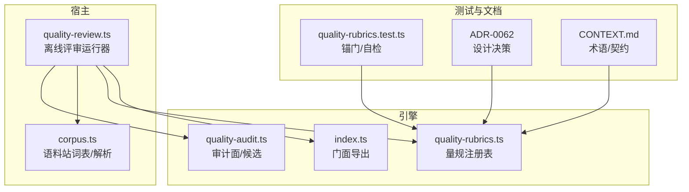
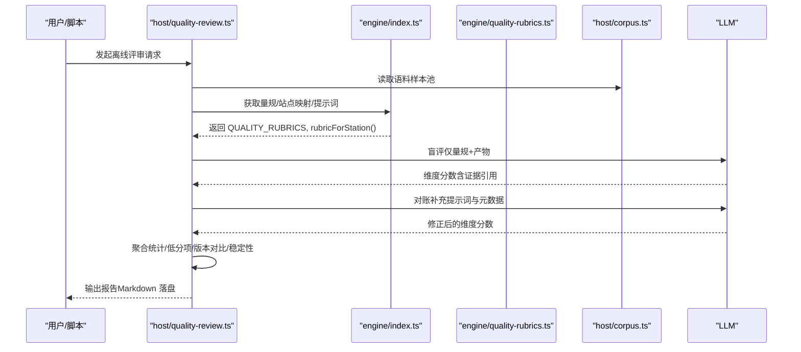
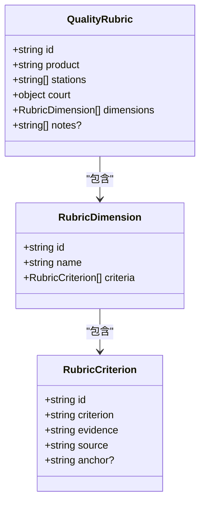
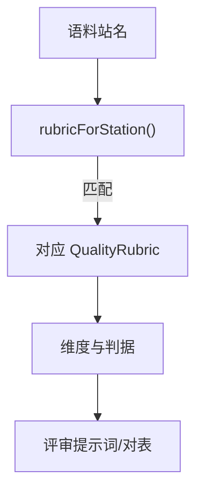
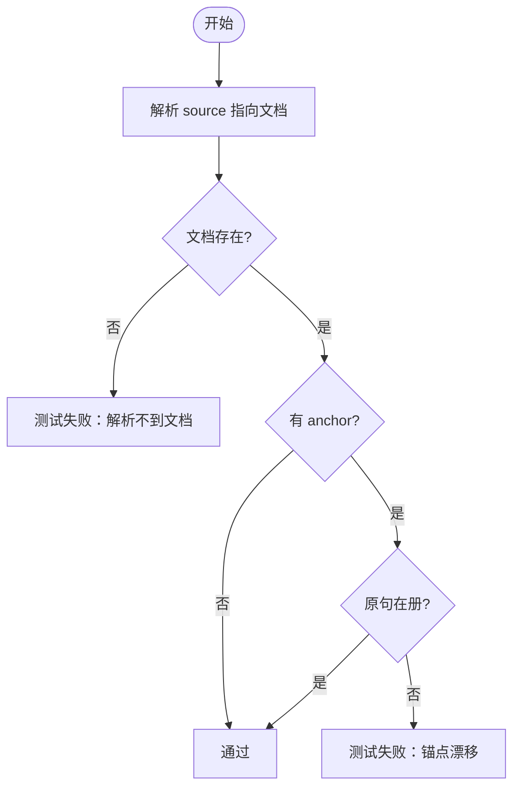
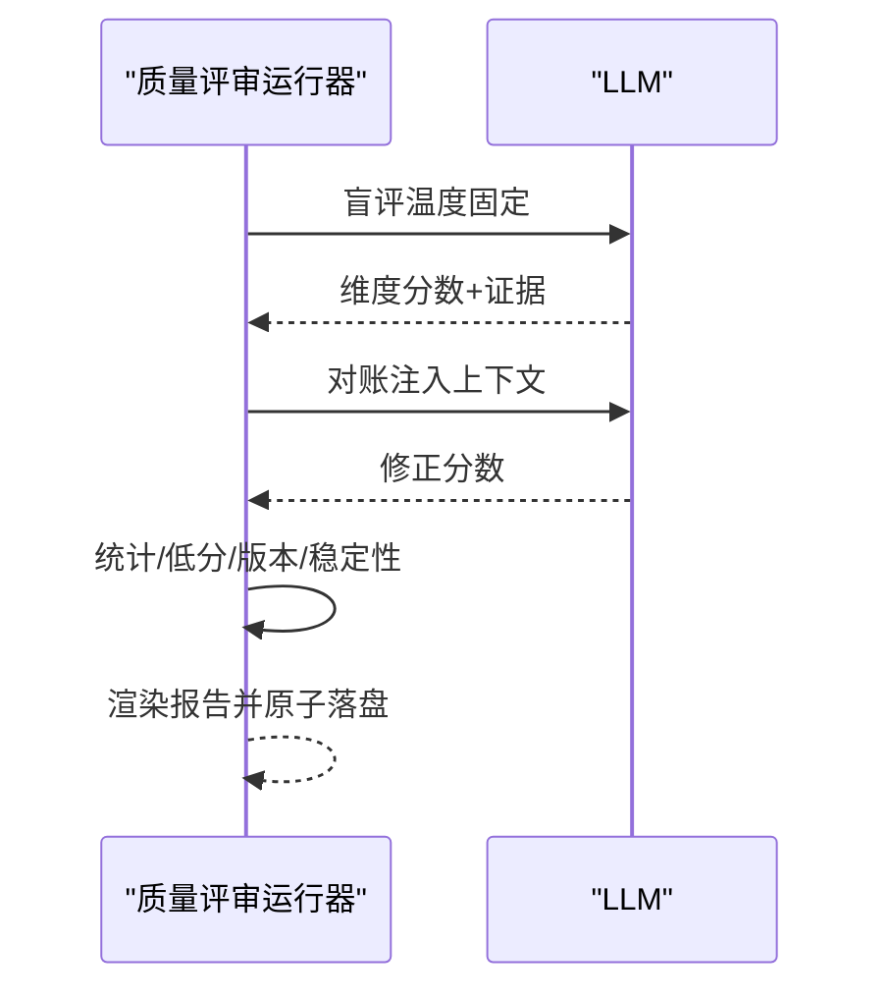
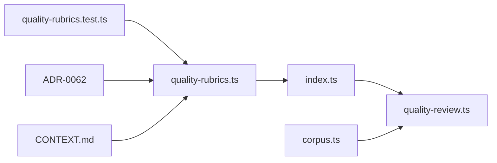

# 质量指标体系

<cite>
**本文引用的文件**
- [src/engine/quality-rubrics.ts](file://src/engine/quality-rubrics.ts)
- [src/engine/index.ts](file://src/engine/index.ts)
- [src/host/quality-review.ts](file://src/host/quality-review.ts)
- [tests/quality-rubrics.test.ts](file://tests/quality-rubrics.test.ts)
- [docs/adr/0062-quality-rubric-registry.md](file://docs/adr/0062-quality-rubric-registry.md)
- [CONTEXT.md](file://CONTEXT.md)
- [src/host/corpus.ts](file://src/host/corpus.ts)
- [src/engine/quality-audit.ts](file://src/engine/quality-audit.ts)
</cite>

## 目录
1. [引言](#引言)
2. [项目结构](#项目结构)
3. [核心组件](#核心组件)
4. [架构总览](#架构总览)
5. [详细组件分析](#详细组件分析)
6. [依赖关系分析](#依赖关系分析)
7. [性能与稳定性考量](#性能与稳定性考量)
8. [故障排查指南](#故障排查指南)
9. [结论](#结论)
10. [附录：量规定制与调优指南](#附录：量规定制与调优指南)

## 引言
本文件系统化阐述“质量指标体系”的设计与实现，聚焦于量规（Rubric）的维度定义、判据（criteria）与证据要求、站点对应关系、多站点共享机制，以及可配置化与调优方法。该体系以“判定标准先于判定器”为原则，将教育学承诺操作化为机器可读的注册表，并通过离线评审运行器进行两段式评分与报告沉淀，最终由人审终审。

## 项目结构
围绕质量指标体系的关键代码与文档分布如下：
- 引擎侧量规注册表与类型定义：src/engine/quality-rubrics.ts
- 引擎门面导出（供宿主消费）：src/engine/index.ts
- 离线批量评审运行器（宿主适配）：src/host/quality-review.ts
- 锚门与自检测试：tests/quality-rubrics.test.ts
- ADR 设计决策：docs/adr/0062-quality-rubric-registry.md
- 语料站词表与解析：src/host/corpus.ts
- 图质量面审计与系统性候选：src/engine/quality-audit.ts
- 术语与契约约定：CONTEXT.md

**图表来源**
- [src/engine/quality-rubrics.ts:40-57](file://src/engine/quality-rubrics.ts#L40-L57)
- [src/engine/index.ts:104-127](file://src/engine/index.ts#L104-L127)
- [src/host/quality-review.ts:124-241](file://src/host/quality-review.ts#L124-L241)
- [src/host/corpus.ts:91-117](file://src/host/corpus.ts#L91-L117)
- [tests/quality-rubrics.test.ts:41-71](file://tests/quality-rubrics.test.ts#L41-L71)
- [docs/adr/0062-quality-rubric-registry.md:9-30](file://docs/adr/0062-quality-rubric-registry.md#L9-L30)

**章节来源**
- [src/engine/quality-rubrics.ts:40-57](file://src/engine/quality-rubrics.ts#L40-L57)
- [src/engine/index.ts:104-127](file://src/engine/index.ts#L104-L127)
- [src/host/quality-review.ts:124-241](file://src/host/quality-review.ts#L124-L241)
- [src/host/corpus.ts:91-117](file://src/host/corpus.ts#L91-L117)
- [tests/quality-rubrics.test.ts:41-71](file://tests/quality-rubrics.test.ts#L41-L71)
- [docs/adr/0062-quality-rubric-registry.md:9-30](file://docs/adr/0062-quality-rubric-registry.md#L9-L30)

## 核心组件
- 量规注册表（QualityRubric）：定义五类产物（大纲/节正文/题目/教练回合/种子·终点），每个量规包含多个维度（Dimension），每个维度包含若干判据（Criterion）。每条判据明确“好”的标准、证据要求、出处与可选锚点。
- 分层法庭元数据（RUBRIC_COURTS）：统一声明 AI 评分面（提议）、人审面（终审）、结果法院（学习结果领域不混同评分）。
- 扁平判据视图（allCriteria）：为评审器提供逐判据的提示词与人审对表行。
- 离线评审运行器（runQualityReview）：从语料抽样、两段式评分（盲评→对账）、聚合统计、生成报告并落盘。
- 锚门与自检：确保源文档存在、锚点原句在册、无总分维度、站名在词表中等。

**章节来源**
- [src/engine/quality-rubrics.ts:17-57](file://src/engine/quality-rubrics.ts#L17-L57)
- [src/engine/quality-rubrics.ts:442-456](file://src/engine/quality-rubrics.ts#L442-L456)
- [src/host/quality-review.ts:124-241](file://src/host/quality-review.ts#L124-L241)
- [tests/quality-rubrics.test.ts:41-71](file://tests/quality-rubrics.test.ts#L41-L71)

## 架构总览
质量指标体系采用“纯数据注册表 + 宿主运行器”的分层架构：
- 引擎侧只维护量规与工具函数（纯函数、零 I/O），保证可测试性与可复现性。
- 宿主侧负责读取语料、调用模型、采样策略、报告渲染与落盘。
- 通过门面集中导出，避免宿主直接耦合内部模块。

**图表来源**
- [src/host/quality-review.ts:124-241](file://src/host/quality-review.ts#L124-L241)
- [src/engine/index.ts:104-127](file://src/engine/index.ts#L104-L127)
- [src/engine/quality-rubrics.ts:442-456](file://src/engine/quality-rubrics.ts#L442-L456)
- [src/host/corpus.ts:91-117](file://src/host/corpus.ts#L91-L117)

## 详细组件分析

### 量规数据结构与判据模型
- RubricCriterion：id、criterion（判定标准）、evidence（证据要求）、source（出处）、anchor（锚点）。
- RubricDimension：id、name、criteria[]。
- QualityRubric：id（产物类型）、product、stations[]（消费站）、court（引用单一 RUBRIC_COURTS）、dimensions[]、notes[]。

**图表来源**
- [src/engine/quality-rubrics.ts:27-57](file://src/engine/quality-rubrics.ts#L27-L57)

**章节来源**
- [src/engine/quality-rubrics.ts:27-57](file://src/engine/quality-rubrics.ts#L27-L57)

### 五份量规与维度定义
- 大纲：结构划分、教学法兑现（大纲面）、下游可用性。
- 节正文：教育学操作化承诺兑现、风格变体（苏格拉底/费曼）、节间衔接与领域边界、结构与排版纪律。
- 题目：答案键正确性、多样性（题型多样与不趋同）、覆盖与立场。
- 教练回合：生长纪律、算子语义、裁决与路线。
- 种子·终点：起点资格、终点资格、骨架与路由。

各维度均通过判据明确“好”的表现、证据要求与出处锚点，且禁止“总分”维度。

**章节来源**
- [src/engine/quality-rubrics.ts:60-440](file://src/engine/quality-rubrics.ts#L60-L440)

### 站点对应关系与多站点共享
- 每个量规通过 stations 字段声明消费站（如“课程大纲”“课程节生成”“题目生成”“笔记出题”“教练生长”“种子起草”）。
- 宿主通过 rubricForStation 按站取量规；语料站词表 STATIONS 用于校验站名合法性。
- 多站点共享同一份量规（例如“题目”量规同时服务“题目生成”和“笔记出题”），避免重复定义。

**图表来源**
- [src/engine/quality-rubrics.ts:46-57](file://src/engine/quality-rubrics.ts#L46-L57)
- [src/host/quality-review.ts:113-122](file://src/host/quality-review.ts#L113-L122)
- [src/host/corpus.ts:91-117](file://src/host/corpus.ts#L91-L117)

**章节来源**
- [src/engine/quality-rubrics.ts:46-57](file://src/engine/quality-rubrics.ts#L46-L57)
- [src/host/quality-review.ts:113-122](file://src/host/quality-review.ts#L113-L122)
- [src/host/corpus.ts:91-117](file://src/host/corpus.ts#L91-L117)

### 判据证据链与锚门校验
- 每条判据必须给出证据要求（引原文定位），并在测试中通过 resolveSource 解析四类出处（模板键、ADR、词条、引擎文件）。
- 若指定 anchor，则必须在出处文档中找到原句片段；否则测试失败。
- 强制无总分维度、法庭元数据引用单一出处、站名在词表中。

**图表来源**
- [tests/quality-rubrics.test.ts:18-71](file://tests/quality-rubrics.test.ts#L18-L71)

**章节来源**
- [tests/quality-rubrics.test.ts:18-71](file://tests/quality-rubrics.test.ts#L18-L71)

### 评分流程与报告产出
- 两段式评审：一期盲评（仅量规+产物），二期对账（补充提示词与元数据，允许修正）。
- 固定温度与重复次数，便于稳定性观测。
- 聚合统计：维度分数分布、低分项清单、版本对比、稳定性读数。
- 报告落盘到 state/质量评审，不进 canonical。

**图表来源**
- [src/host/quality-review.ts:169-241](file://src/host/quality-review.ts#L169-L241)

**章节来源**
- [src/host/quality-review.ts:169-241](file://src/host/quality-review.ts#L169-L241)

### 图质量面审计与系统性发现
- 审计面（AUDIT_AXES）针对特定站与维度，计算低分率并识别系统性候选。
- 候选作为“提议”，需人审裁决；报告单列，不影响生产流程。

**章节来源**
- [src/engine/quality-audit.ts:66-123](file://src/engine/quality-audit.ts#L66-L123)

## 依赖关系分析
- 引擎侧：quality-rubrics.ts 提供纯数据与工具函数；index.ts 集中导出，屏蔽内部细节。
- 宿主侧：quality-review.ts 依赖 index.ts 暴露的量规与评审工具，依赖 corpus.ts 解析语料与站名。
- 测试：quality-rubrics.test.ts 验证锚门、法庭元数据、站名一致性、无总分维度等。
- 文档：ADR-0062 与 CONTEXT.md 提供设计决策与术语约束。

**图表来源**
- [src/engine/index.ts:104-127](file://src/engine/index.ts#L104-L127)
- [src/host/quality-review.ts:124-241](file://src/host/quality-review.ts#L124-L241)
- [tests/quality-rubrics.test.ts:41-71](file://tests/quality-rubrics.test.ts#L41-L71)
- [docs/adr/0062-quality-rubric-registry.md:9-30](file://docs/adr/0062-quality-rubric-registry.md#L9-L30)

**章节来源**
- [src/engine/index.ts:104-127](file://src/engine/index.ts#L104-L127)
- [src/host/quality-review.ts:124-241](file://src/host/quality-review.ts#L124-L241)
- [tests/quality-rubrics.test.ts:41-71](file://tests/quality-rubrics.test.ts#L41-L71)
- [docs/adr/0062-quality-rubric-registry.md:9-30](file://docs/adr/0062-quality-rubric-registry.md#L9-L30)

## 性能与稳定性考量
- 固定温度与重复评审：保障跨轮次可比性，残余波动视为模型/供应商漂移信号。
- 抽样配额：失败/容忍件优先，成功件等距抽取，兼顾覆盖率与成本。
- 报告原子写：避免半新半旧读入，保证观测一致性。
- 无总分维度：避免合成带来的不稳定与误用。

[本节为通用指导，不直接分析具体文件]

## 故障排查指南
- 锚点漂移：当 source 指向的文档找不到 anchor 原句时，测试会失败。需同步更新量规或修正出处。
- 解析不到文档：模板键改名、ADR 改号、词条删除或引擎文件挪走都会导致失败。需恢复或更新引用。
- 总分维度违规：任何维度名称或 ID 包含“总分”将被拒绝。
- 站名不在词表：量规中的 stations 必须存在于 STATIONS 词表，否则会报错。
- 评审失败：应答不可解析或维度缺失会被记录为 failure，但不等同于产物差。

**章节来源**
- [tests/quality-rubrics.test.ts:41-71](file://tests/quality-rubrics.test.ts#L41-L71)
- [src/host/quality-review.ts:194-200](file://src/host/quality-review.ts#L194-L200)

## 结论
质量指标体系以“判定标准先于判定器”为核心，通过注册表化的量规、严格的锚门与自检、两段式评审与报告沉淀，形成可复现、可审计、可演进的内容质量治理闭环。其优势在于：
- 判据可追溯至模板/ADR/词条/引擎，确保教育学承诺不被漂移。
- 多站点共享量规，减少重复与维护成本。
- 无总分维度，避免不当合成与误用。
- 人审终审，AI 评分仅为提议，保障质量决策的权威性与审慎性。

[本节为总结性内容，不直接分析具体文件]

## 附录：量规定制与调优指南

### 新增维度与判据的最佳实践
- 明确“好”的定义：在 criterion 中描述可被人审对表的“好”长什么样，避免打分公式。
- 绑定证据要求：在 evidence 中写明评审必须引用的原文与定位方式。
- 标注出处与锚点：source 使用模板键/ADR/词条/引擎文件；anchor 指向原句片段，确保锚门通过。
- 加入维度与判据后，运行 tests/quality-rubrics.test.ts 确保锚门与自检通过。

**章节来源**
- [src/engine/quality-rubrics.ts:27-57](file://src/engine/quality-rubrics.ts#L27-L57)
- [tests/quality-rubrics.test.ts:41-71](file://tests/quality-rubrics.test.ts#L41-L71)

### 修改现有维度与判据
- 保持三要素完整：criterion/evidence/source 非空。
- 若变更 source 或 anchor，需同步更新相关文档与模板，确保锚门通过。
- 不得引入“总分”维度；如需综合评估，应在报告层面进行说明而非在量规内合成。

**章节来源**
- [tests/quality-rubrics.test.ts:41-71](file://tests/quality-rubrics.test.ts#L41-L71)
- [docs/adr/0062-quality-rubric-registry.md:15-21](file://docs/adr/0062-quality-rubric-registry.md#L15-L21)

### 多站点共享与站点对应
- 在 QualityRubric.stations 中列出所有消费站，确保与 STATIONS 词表一致。
- 通过 rubricForStation 按站取量规，避免硬编码映射。
- 若新增站，需在 STATIONS 中添加，并在量规中声明消费关系。

**章节来源**
- [src/engine/quality-rubrics.ts:46-57](file://src/engine/quality-rubrics.ts#L46-L57)
- [src/host/corpus.ts:91-117](file://src/host/corpus.ts#L91-L117)
- [src/host/quality-review.ts:113-122](file://src/host/quality-review.ts#L113-L122)

### 评审参数与调优
- 固定温度与重复次数：保障可复现性与稳定性观测。
- 抽样配额：根据业务需求调整 badQuota/okQuota，平衡覆盖率与成本。
- 报告落盘：位于 state/质量评审，仅供人读与分析，不参与生产流程。

**章节来源**
- [src/host/quality-review.ts:124-241](file://src/host/quality-review.ts#L124-L241)

### 与图质量面审计的协同
- 对于特定站与维度，可通过 AUDIT_AXES 定义审计面，计算低分率并识别系统性问题。
- 系统性候选作为“提议”，需人审裁决；报告单列，便于追踪与改进。

**章节来源**
- [src/engine/quality-audit.ts:66-123](file://src/engine/quality-audit.ts#L66-L123)