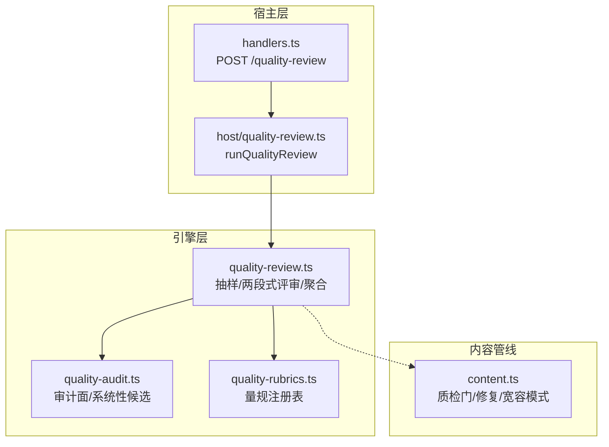
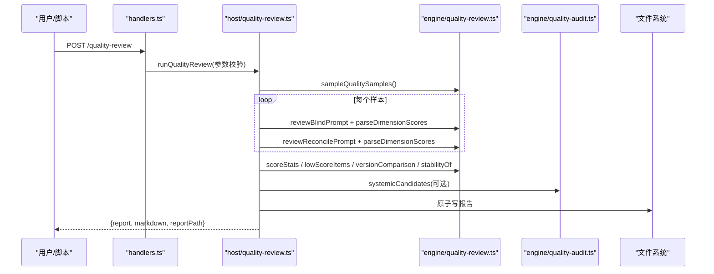
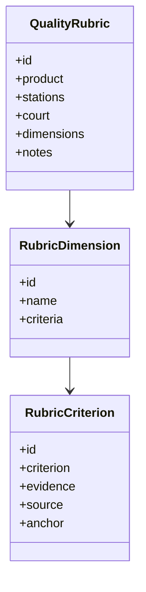
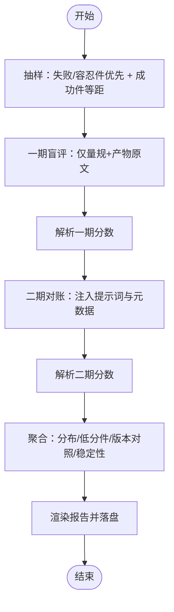
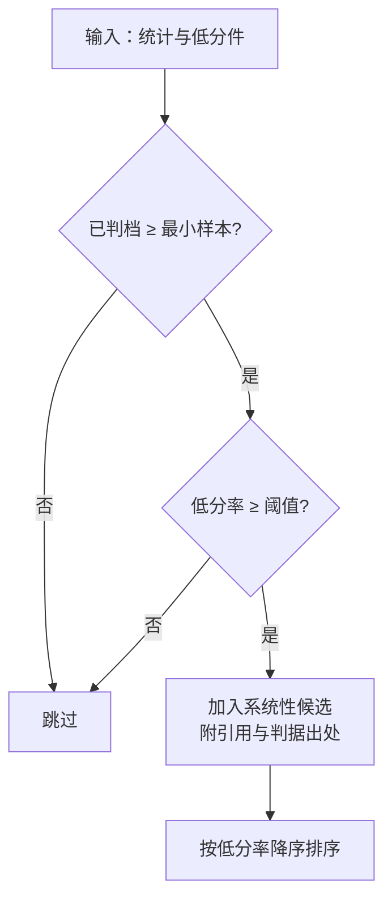
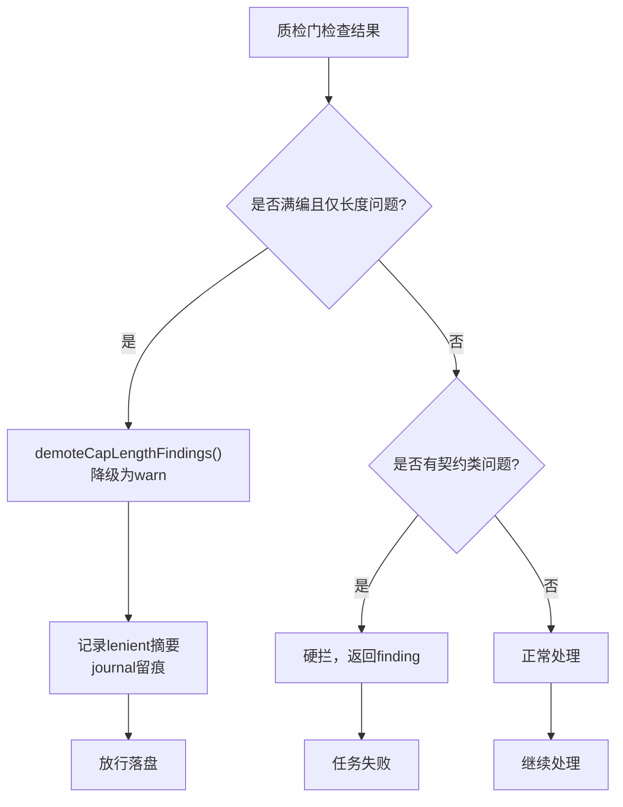
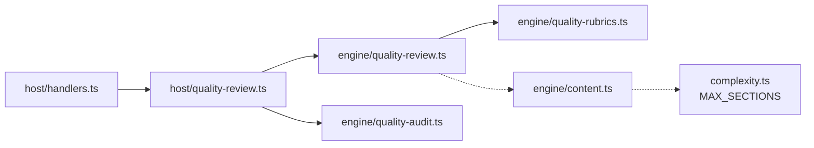

# 质量审核系统

<cite>
**本文引用的文件**
- [src/engine/quality-audit.ts](file://src/engine/quality-audit.ts)
- [src/engine/quality-rubrics.ts](file://src/engine/quality-rubrics.ts)
- [src/engine/quality-review.ts](file://src/engine/quality-review.ts)
- [src/host/quality-review.ts](file://src/host/quality-review.ts)
- [src/host/handlers.ts](file://src/host/handlers.ts)
- [src/engine/content.ts](file://src/engine/content.ts)
- [tests/README.md](file://tests/README.md)
- [docs/adr/0079-section-gate-contract-vs-tendency-and-cap-leniency.md](file://docs/adr/0079-section-gate-contract-vs-tendency-and-cap-leniency.md)
</cite>

## Update Summary
**Changes Made**
- 新增"宽容模式与满编放行机制"章节，详细说明ADR-0079的实现
- 更新质检门架构，区分契约类硬拦和倾向类警告
- 增强错误消息机制，提供详细的契约违规信息
- 更新故障诊断指南，包含满编放行的处理逻辑

## 目录
1. [简介](#简介)
2. [项目结构](#项目结构)
3. [核心组件](#核心组件)
4. [架构总览](#架构总览)
5. [详细组件分析](#详细组件分析)
6. [依赖关系分析](#依赖关系分析)
7. [性能与可观测性](#性能与可观测性)
8. [故障诊断与修复指南](#故障诊断与修复指南)
9. [结论](#结论)
10. [附录：规则与配置示例](#附录：规则与配置示例)

## 简介
本系统围绕"内容质量"轴，提供离线批量评审、图质量面审计、质检门（超纲引用检测、别名一致性检查、节形状验证、富内容块语法检查）以及自动评分与人工审核闭环。其设计原则是：判定标准先于判定器、人读报告先行、判读分层（AI提议、人审终审、结果法院各守领域），并通过确定性抽样、证据定位核对与模板版本对照，确保评审可复算、可追溯、可对比。

**最新更新**：引入宽容模式与满编放行机制，区分契约类硬拦和倾向类警告，在节点满编时允许长度超限的内容通过并记录警告。

## 项目结构
质量审核系统由"引擎层（纯函数、零副作用）+ 宿主层（I/O、LLM调用、落盘）+ 质检门（内容管线）"三部分构成：
- 引擎层负责量规定义、评审提示词拼装、应答解析、聚合统计、系统性候选发现与报告渲染数据准备。
- 宿主层负责语料读取、模型调用、报告落盘、路由接入与参数校验。
- 质检门在内容生成阶段对输出进行格式与合规性检查，并提供程序化修复建议。

**图表来源**
- [src/host/handlers.ts:220-235](file://src/host/handlers.ts#L220-L235)
- [src/host/quality-review.ts:126-241](file://src/host/quality-review.ts#L126-L241)
- [src/engine/quality-review.ts:138-160](file://src/engine/quality-review.ts#L138-L160)
- [src/engine/quality-audit.ts:51-78](file://src/engine/quality-audit.ts#L51-L78)
- [src/engine/quality-rubrics.ts:60-128](file://src/engine/quality-rubrics.ts#L60-L128)

## 核心组件
- 质量量规注册表：五类产物（大纲/节正文/题目/教练回合/种子·终点）的维度与判据，每条判据含判定标准、证据要求、出处与锚点，支撑评审器与人审对表。
- 离线批量评审器：从生成语料按站抽样，两段式防锚定评分（盲评→对账），逐维度分布、低分件清单、模板版本对照、稳定性读数。
- 图质量面审计：针对"教练回合裁决质量"和"种子/终点资格"两类审计面，计算系统性候选（低分率越线即入候选）。
- 质检门：超纲引用检测、别名一致性检查、节形状验证、富内容块语法检查与自动修复，**新增宽容模式支持**。

**章节来源**
- [src/engine/quality-rubrics.ts:60-440](file://src/engine/quality-rubrics.ts#L60-L440)
- [src/engine/quality-review.ts:138-160](file://src/engine/quality-review.ts#L138-L160)
- [src/engine/quality-audit.ts:51-78](file://src/engine/quality-audit.ts#L51-L78)
- [tests/README.md:27-35](file://tests/README.md#L27-L35)

## 架构总览
评审流程以"抽样→两段式评审→聚合→报告落盘"为主线；审计面在报告中追加声明行与系统性候选；质检门在内容生成阶段前置拦截并给出修复建议，**支持宽容模式下的分级处理**。

**图表来源**
- [src/host/handlers.ts:220-235](file://src/host/handlers.ts#L220-L235)
- [src/host/quality-review.ts:126-241](file://src/host/quality-review.ts#L126-L241)
- [src/engine/quality-review.ts:230-261](file://src/engine/quality-review.ts#L230-L261)
- [src/engine/quality-audit.ts:100-120](file://src/engine/quality-audit.ts#L100-L120)

## 详细组件分析

### 质量量规与判据管理
- 量规覆盖五类产物，维度与判据明确"好"的标准与证据要求，出处四族（模板键/ADR/词条/引擎文件），锚点用于文档原句对账。
- 提供扁平视图供评审器消费，避免评审器重复实现判据检索。

**图表来源**
- [src/engine/quality-rubrics.ts:40-57](file://src/engine/quality-rubrics.ts#L40-L57)
- [src/engine/quality-rubrics.ts:27-38](file://src/engine/quality-rubrics.ts#L27-L38)

**章节来源**
- [src/engine/quality-rubrics.ts:60-440](file://src/engine/quality-rubrics.ts#L60-L440)

### 离线批量评审器（两段式防锚定）
- 抽样：失败/容忍件定额优先，成功件等距补足；同输入同抽样。
- 两段式：一期盲评只给量规与产物原文；二期对账才给生成提示词与元数据，允许修正并标注revised。
- 解析与核对：严格全维度齐备；证据定位核对（去空白匹配或≥12字前缀命中），未定位项显式记录。
- 聚合：逐（站×维度）分布、低分件清单、模板版本对照、稳定性读数（温度固定为0，保证可比性）。

**图表来源**
- [src/engine/quality-review.ts:138-160](file://src/engine/quality-review.ts#L138-L160)
- [src/engine/quality-review.ts:230-261](file://src/engine/quality-review.ts#L230-L261)
- [src/engine/quality-review.ts:302-339](file://src/engine/quality-review.ts#L302-L339)
- [src/engine/quality-review.ts:433-463](file://src/engine/quality-review.ts#L433-L463)
- [src/engine/quality-review.ts:517-545](file://src/engine/quality-review.ts#L517-L545)
- [src/engine/quality-review.ts:561-592](file://src/engine/quality-review.ts#L561-L592)

**章节来源**
- [src/engine/quality-review.ts:138-160](file://src/engine/quality-review.ts#L138-L160)
- [src/engine/quality-review.ts:230-261](file://src/engine/quality-review.ts#L230-L261)
- [src/engine/quality-review.ts:302-339](file://src/engine/quality-review.ts#L302-L339)
- [src/engine/quality-review.ts:433-463](file://src/engine/quality-review.ts#L433-L463)
- [src/engine/quality-review.ts:517-545](file://src/engine/quality-review.ts#L517-L545)
- [src/engine/quality-review.ts:561-592](file://src/engine/quality-review.ts#L561-L592)

### 图质量面审计（系统性候选）
- 审计面：教练回合裁决质量、种子/终点资格。
- 预注册线：最低样本数与低分率阈值，越线即入候选；候选带低分件引用与判据出处，供贴票/蒸馏新票。
- 报告开头追加"审计面声明"，明确本轮审了什么、没审什么。

**图表来源**
- [src/engine/quality-audit.ts:100-120](file://src/engine/quality-audit.ts#L100-L120)
- [src/engine/quality-audit.ts:76-78](file://src/engine/quality-audit.ts#L76-L78)

**章节来源**
- [src/engine/quality-audit.ts:51-78](file://src/engine/quality-audit.ts#L51-L78)
- [src/engine/quality-audit.ts:100-120](file://src/engine/quality-audit.ts#L100-L120)

### 宽容模式与满编放行机制（ADR-0079）
**新增功能**：实现了分层质检门机制，区分契约类硬拦和倾向类警告，支持满编放行。

#### 核心设计理念
- **契约类硬拦**：可视化块（plot/chart/svg/交互件）与learnhub-predict预测门是模板向学习者声明的消费面契约，非法意味着承诺未兑现，必须硬拦。
- **倾向类警告**：正文偏长/过长、超纲引用、uses标注等影响学习体验但不是契约兑现的问题，降级为warn。
- **满编放行**：当节清单达到MAX_SECTIONS（8节）时，长度相关的拒收不再进入修复阶梯，直接降级为warn放行落盘。

#### 技术实现

**图表来源**
- [src/engine/content.ts:960-974](file://src/engine/content.ts#L960-L974)
- [src/engine/content.ts:1012-1018](file://src/engine/content.ts#L1012-L1018)

#### 错误消息增强
契约类finding现在提供详细的错误信息：
- plot/chart非法JSON：附带解析器原始报错与期望形态示例
- svg形状错误：附带块首行原文
- predict字段缺失：附带期望四行字段骨架

**章节来源**
- [docs/adr/0079-section-gate-contract-vs-tendency-and-cap-leniency.md:7-13](file://docs/adr/0079-section-gate-contract-vs-tendency-and-cap-leniency.md#L7-L13)
- [src/engine/content.ts:960-974](file://src/engine/content.ts#L960-L974)
- [src/engine/content.ts:524-551](file://src/engine/content.ts#L524-L551)
- [tests/section-split.test.ts:147-168](file://tests/section-split.test.ts#L147-L168)

### 质检门（内容生成阶段）
- 超纲引用检测：禁止概念清单与领域边界约束，防止提前教/引入未讲概念。
- 别名一致性检查：概念登记表别名解析与引用对表，确保名称精确一致。
- 节形状验证：子标题、正文长度预算、可视化块计数与类型限制。
- 富内容块语法检查：plot/chart JSON容错、svg起始、mermaid引号补齐等自动修复。
- **新增**：宽容模式支持，区分契约类和倾向类问题。

**章节来源**
- [tests/README.md:27-35](file://tests/README.md#L27-L35)
- [src/engine/content.ts:148-200](file://src/engine/content.ts#L148-L200)

## 依赖关系分析
- 宿主层依赖引擎层的评审与审计能力，通过常量对齐站点名与提示词契约。
- 引擎层依赖量规注册表作为唯一判据来源，避免评审器与量规表双实现。
- 质检门与内容管线耦合，产出finding与修复轮提示词，驱动重生成。
- **新增**：宽容模式依赖MAX_SECTIONS常量和sectionCount判断。

**图表来源**
- [src/host/handlers.ts:220-235](file://src/host/handlers.ts#L220-L235)
- [src/host/quality-review.ts:126-241](file://src/host/quality-review.ts#L126-L241)
- [src/engine/quality-review.ts:138-160](file://src/engine/quality-review.ts#L138-L160)
- [src/engine/quality-audit.ts:51-78](file://src/engine/quality-audit.ts#L51-L78)
- [src/engine/quality-rubrics.ts:60-128](file://src/engine/quality-rubrics.ts#L60-L128)
- [src/engine/content.ts:148-200](file://src/engine/content.ts#L148-L200)
- [src/engine/complexity.ts:241-245](file://src/engine/complexity.ts#L241-L245)

**章节来源**
- [src/host/handlers.ts:220-235](file://src/host/handlers.ts#L220-L235)
- [src/host/quality-review.ts:126-241](file://src/host/quality-review.ts#L126-L241)
- [src/engine/quality-review.ts:138-160](file://src/engine/quality-review.ts#L138-L160)
- [src/engine/quality-audit.ts:51-78](file://src/engine/quality-audit.ts#L51-L78)
- [src/engine/quality-rubrics.ts:60-128](file://src/engine/quality-rubrics.ts#L60-L128)
- [src/engine/content.ts:148-200](file://src/engine/content.ts#L148-L200)

## 性能与可观测性
- 温度固定为0，effort恒deep，保证跨轮次可比性与漂移信号可观测。
- 成本计量：calls、inputTokens、outputTokens随每次评审记录，便于评估开销。
- 稳定性读数：同件多轮一致率与平均档差，反映模型侧漂移。
- 报告原子写：tmp+rename，避免并发读写导致半新半旧。
- **新增**：宽容模式下的journal留痕，记录满编放行的详细信息。

**章节来源**
- [src/engine/quality-review.ts:41-47](file://src/engine/quality-review.ts#L41-L47)
- [src/host/quality-review.ts:177-208](file://src/host/quality-review.ts#L177-L208)
- [src/host/quality-review.ts:244-255](file://src/host/quality-review.ts#L244-L255)

## 故障诊断与修复指南
- 评审失败≠产物差：应答不可解析或缺维度记failure，不进低分件清单。
- 证据未定位：unlocated字段列出无法在产物中找到的引用，需修正评审或产物。
- 模板版本漂移：versionComparison按模板版本聚合低分率，辅助定位回归。
- 质检门失败：根据finding定位问题（如正文过长、富内容块非法JSON），使用修复轮局部重写。
- **新增**：满编放行处理 - 当遇到"正文过长"且节点已满编8节时，系统会自动降级为警告并放行，同时记录详细信息到journal。

### 常见故障场景
1. **契约类问题**：plot/chart JSON非法、svg格式错误、predict字段缺失 → 必须修复
2. **倾向类问题**：正文偏长、超纲引用 → 可接受但会记录警告
3. **满编放行**：节点满编时的长度超限 → 自动降级为警告并放行

**章节来源**
- [src/engine/quality-review.ts:302-339](file://src/engine/quality-review.ts#L302-L339)
- [src/engine/quality-review.ts:465-501](file://src/engine/quality-review.ts#L465-L501)
- [src/engine/quality-review.ts:517-545](file://src/engine/quality-review.ts#L517-L545)
- [tests/README.md:27-35](file://tests/README.md#L27-L35)

## 结论
本系统以"量规先行、报告先行、判读分层"为核心，结合确定性抽样、证据定位核对与模板版本对照，构建了可复算、可追溯的质量审核闭环。**最新的宽容模式与满编放行机制**进一步提升了系统的鲁棒性，区分了契约类硬拦和倾向类警告，在节点满编时能够智能降级处理长度相关问题，避免无意义的任务失败。质检门在生成期前置拦截，评审器在离线阶段提供深度洞察，审计面聚焦系统性问题，形成从"单点缺陷"到"系统性风险"的全景视图。

## 附录：规则与配置示例
- 质量量规：五类产物各自维度与判据，见量规注册表。
- 评审参数：badQuota、okQuota、repeats、systemic.minSamples/lowRate。
- 审计面：教练回合裁决质量、种子/终点资格，关注维度与焦点。
- 质检门：节形状、富内容块、交互件、超纲与别名一致性。
- **新增**：宽容模式配置 - MAX_SECTIONS=8，满编时长度问题自动降级为警告。

**章节来源**
- [src/engine/quality-rubrics.ts:60-440](file://src/engine/quality-rubrics.ts#L60-L440)
- [src/host/quality-review.ts:53-69](file://src/host/quality-review.ts#L53-L69)
- [src/engine/quality-audit.ts:51-78](file://src/engine/quality-audit.ts#L51-L78)
- [tests/README.md:27-35](file://tests/README.md#L27-L35)
- [src/engine/complexity.ts:241-245](file://src/engine/complexity.ts#L241-L245)