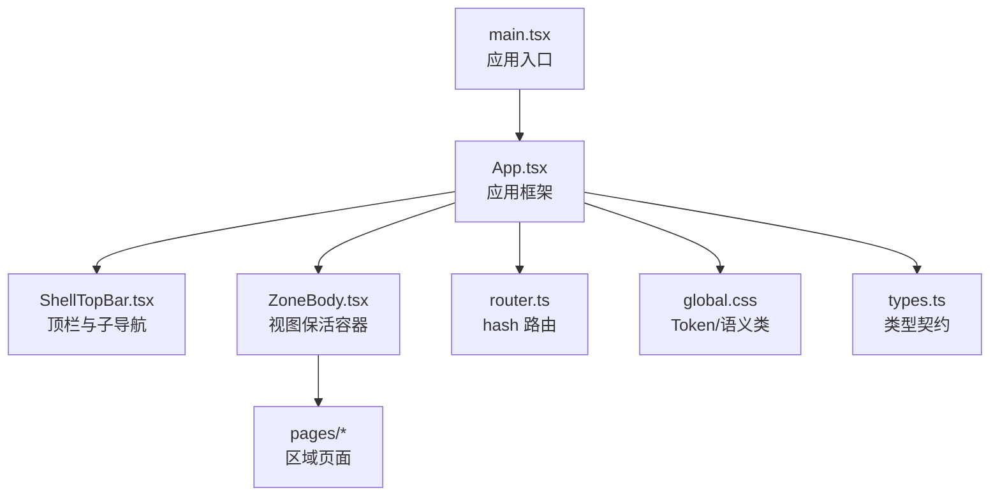
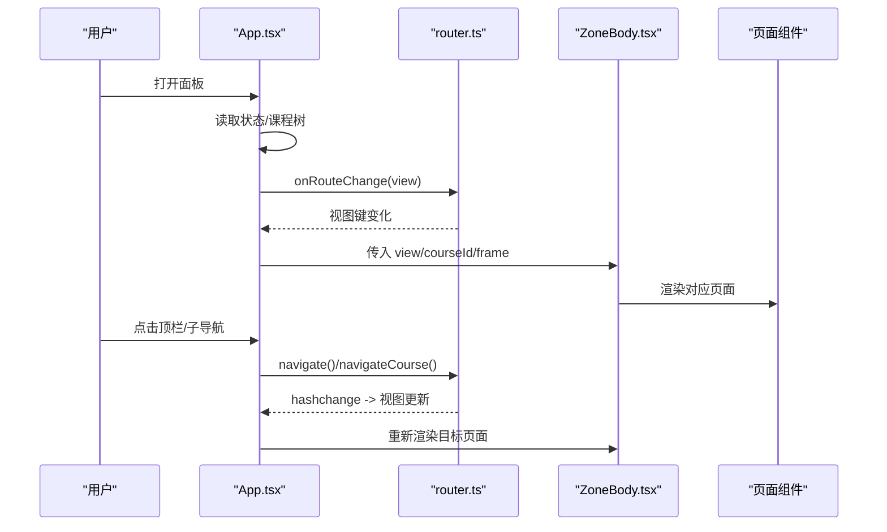
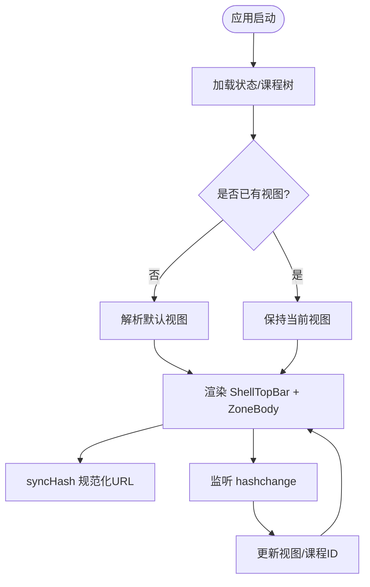
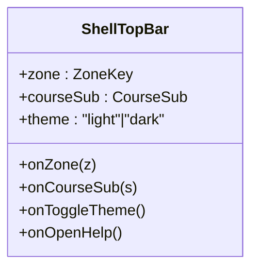
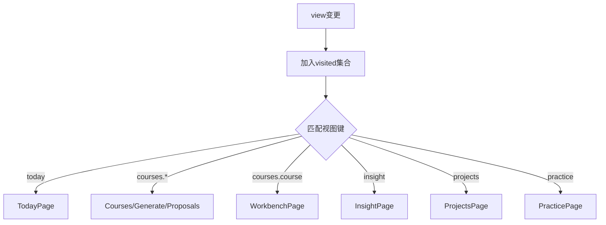
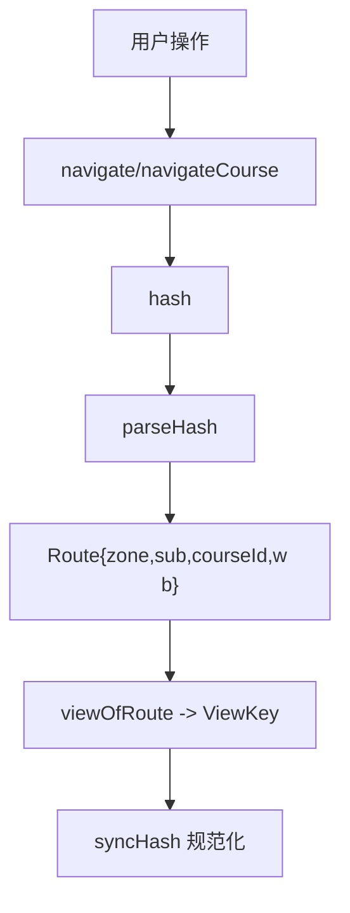
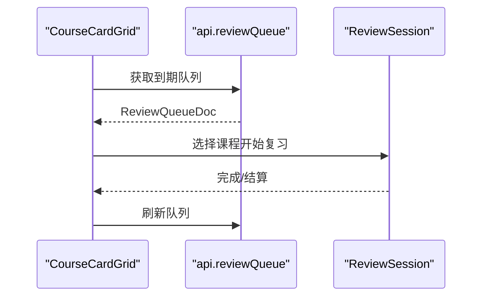
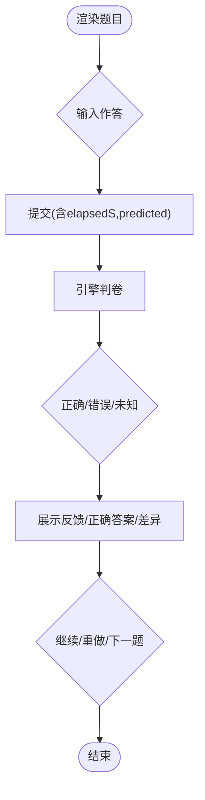
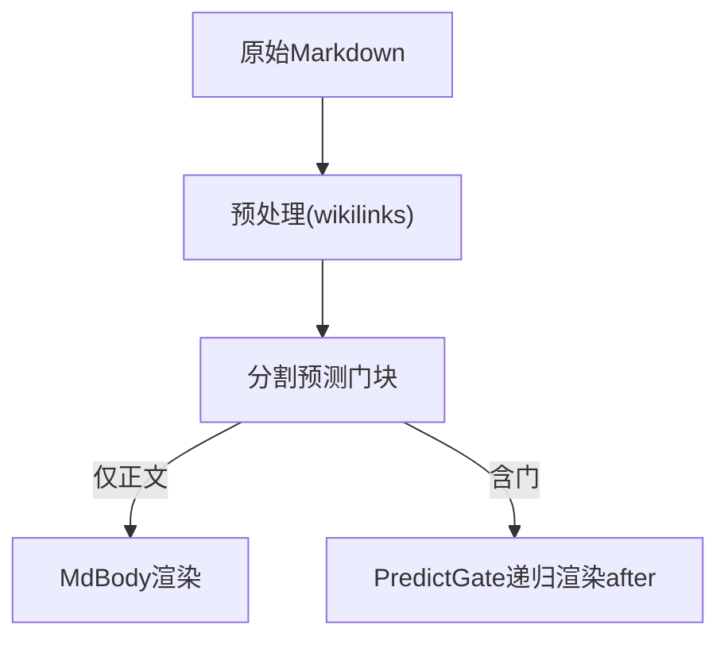
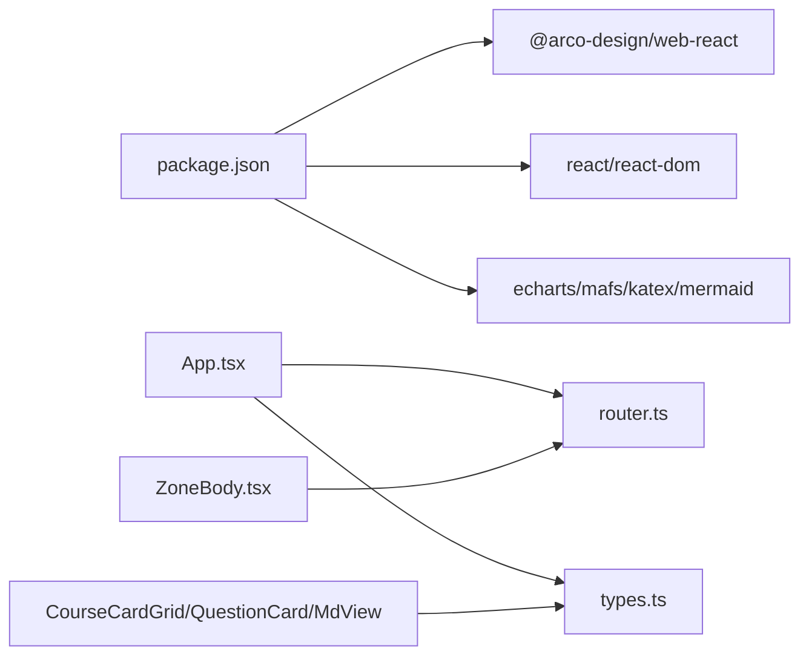

# UI组件库

<cite>
**本文引用的文件**
- [App.tsx](file://ui/src/App.tsx)
- [main.tsx](file://ui/src/main.tsx)
- [package.json](file://ui/package.json)
- [ShellTopBar.tsx](file://ui/src/components/ShellTopBar.tsx)
- [ZoneBody.tsx](file://ui/src/components/ZoneBody.tsx)
- [router.ts](file://ui/src/lib/router.ts)
- [types.ts](file://ui/src/types.ts)
- [global.css](file://ui/src/global.css)
- [CourseCardGrid.tsx](file://ui/src/components/CourseCardGrid.tsx)
- [QuestionCard.tsx](file://ui/src/components/QuestionCard.tsx)
- [MdView.tsx](file://ui/src/components/MdView.tsx)
</cite>

## 目录
1. [简介](#简介)
2. [项目结构](#项目结构)
3. [核心组件](#核心组件)
4. [架构总览](#架构总览)
5. [详细组件分析](#详细组件分析)
6. [依赖分析](#依赖分析)
7. [性能考虑](#性能考虑)
8. [故障排查指南](#故障排查指南)
9. [结论](#结论)
10. [附录](#附录)

## 简介
本文件面向“UI组件库”的复用化设计与实现，覆盖基础组件、业务组件与布局组件。文档聚焦以下方面：
- 组件API接口、属性配置与事件处理机制
- 组合模式与样式定制方法（Token 驱动、语义类）
- 响应式与移动端适配策略
- 使用示例与最佳实践
- 测试策略与性能优化建议

该UI基于 React + Arco Design，采用“壳层+区域视图+页面”的分层组织，通过极简 hash 路由进行导航与保活，配合 Token 驱动的样式体系与语义类，形成可维护、可扩展的组件生态。

## 项目结构
- 入口与初始化
  - main.tsx：挂载根节点并注入国际化语言包
  - App.tsx：应用框架（状态、主题、路由桥接、全局通知）
- 布局与导航
  - ShellTopBar.tsx：顶部区页签与课程区子导航
  - ZoneBody.tsx：视图保活容器，按访问历史渲染对应页面
  - router.ts：hash 路由解析、规范化与程序化跳转
- 类型与数据契约
  - types.ts：统一类型来源（引擎读视图、宿主返回、UI专有）
- 样式系统
  - global.css：Token 变量、壳级样式、语义类与内容排版
- 组件与页面
  - components：通用与业务组件（课程卡网格、问答卡、Markdown 渲染等）
  - pages：各区域页面（今日、课程、洞察、项目、实践、工作台等）

图表来源
- [main.tsx:1-16](file://ui/src/main.tsx#L1-L16)
- [App.tsx:47-179](file://ui/src/App.tsx#L47-L179)
- [ShellTopBar.tsx:19-63](file://ui/src/components/ShellTopBar.tsx#L19-L63)
- [ZoneBody.tsx:21-42](file://ui/src/components/ZoneBody.tsx#L21-L42)
- [router.ts:72-163](file://ui/src/lib/router.ts#L72-L163)
- [global.css:1-398](file://ui/src/global.css#L1-L398)
- [types.ts:1-93](file://ui/src/types.ts#L1-L93)

章节来源
- [main.tsx:1-16](file://ui/src/main.tsx#L1-L16)
- [App.tsx:47-179](file://ui/src/App.tsx#L47-L179)
- [router.ts:1-164](file://ui/src/lib/router.ts#L1-L164)

## 核心组件
- 应用框架（App）
  - 职责：加载状态、课程树、当前课程、学习视图定位、教练通知轮询、主题切换、路由同步、空态守卫
  - 对外能力：setCourse/goto/openCourse/openLesson/closeLesson/locateInGraph/locateJob/reload/loading
  - 关键流程：首次拉取 status/coursesTree；hashchange 回灌视图；主题写入 body 与 localStorage
- 顶栏（ShellTopBar）
  - 职责：五区页签高亮、课程区三入口子导航、帮助抽屉入口、主题切换、通知占位
  - 事件：onZone/onCourseSub/onToggleTheme/onOpenHelp
- 视图容器（ZoneBody）
  - 职责：按访问历史保活视图，隐藏非激活视图以节省资源；将 view/courseId/frame 透传给页面
- 路由（router）
  - 职责：parseHash/navigate/navigateCourse/syncHash/onRouteChange/viewOfRoute/routeOfView/zoneOfView
  - 规则：courses 区展开为 home/queue/proposals；单课工作台参数段 #/course/<id>/<wb>；旧键深链回落默认

章节来源
- [App.tsx:47-179](file://ui/src/App.tsx#L47-L179)
- [ShellTopBar.tsx:19-63](file://ui/src/components/ShellTopBar.tsx#L19-L63)
- [ZoneBody.tsx:21-42](file://ui/src/components/ZoneBody.tsx#L21-L42)
- [router.ts:72-163](file://ui/src/lib/router.ts#L72-L163)

## 架构总览
应用采用“壳-区-页-组件”分层：
- 壳层：App 管理全局状态与主题，ShellTopBar 提供导航与工具按钮
- 区层：ZoneBody 根据视图键渲染对应页面，支持多视图保活
- 页面层：Today/Courses/Insight/Projects/Practice/Workbench 等
- 组件层：CourseCardGrid、QuestionCard、MdView 等复用单元

图表来源
- [App.tsx:47-179](file://ui/src/App.tsx#L47-L179)
- [router.ts:134-163](file://ui/src/lib/router.ts#L134-L163)
- [ZoneBody.tsx:21-42](file://ui/src/components/ZoneBody.tsx#L21-L42)

## 详细组件分析

### 应用框架（App）
- 设计要点
  - 路由权威：location.hash 是导航唯一真相源，渲染态为其投影
  - 视图保活：通过 ZoneBody 记录 visited Set，首访后常驻、非激活隐藏
  - 主题持久化：写入 body 的 arco-theme 与 localStorage
  - 空课程守卫：对纯消费视图做拦截，避免建课死锁
- API 与事件
  - 暴露 frame 对象供子组件调用导航与定位
  - useCoachToasts 集成教练通知，按任务性质分流到生成队列或提案收件箱

图表来源
- [App.tsx:47-179](file://ui/src/App.tsx#L47-L179)
- [router.ts:145-163](file://ui/src/lib/router.ts#L145-L163)

章节来源
- [App.tsx:47-179](file://ui/src/App.tsx#L47-L179)

### 顶栏（ShellTopBar）
- 功能
  - 五区页签：今日/课程/洞察/项目/无界实践区
  - 课程区子导航：我的课程/生成队列/提案收件箱
  - 右侧控制：通知占位、帮助抽屉、主题切换
- 事件
  - onZone：切换区页签
  - onCourseSub：切换课程区子入口
  - onToggleTheme：切换亮/暗主题
  - onOpenHelp：打开帮助抽屉

图表来源
- [ShellTopBar.tsx:19-63](file://ui/src/components/ShellTopBar.tsx#L19-L63)

章节来源
- [ShellTopBar.tsx:19-63](file://ui/src/components/ShellTopBar.tsx#L19-L63)

### 视图容器（ZoneBody）
- 职责
  - 维护 visited Set，确保首访后视图保活
  - 根据 view 映射到具体页面组件
  - 将 courseId 与 frame 传递给 WorkbenchPage
- 性能
  - 隐藏非激活视图，减少重排与轮询开销

图表来源
- [ZoneBody.tsx:21-42](file://ui/src/components/ZoneBody.tsx#L21-L42)

章节来源
- [ZoneBody.tsx:21-42](file://ui/src/components/ZoneBody.tsx#L21-L42)

### 路由（router）
- 能力
  - parseHash：解析 hash 为 Route（zone/sub/courseId/wb）
  - viewOfRoute/routeOfView：视图键与路由互转
  - navigate/navigateCourse：程序化跳转（普通视图 vs 参数段工作台）
  - syncHash：规范化 URL，避免漂移
  - onRouteChange：订阅 hashchange 回调
- 规则
  - courses 区三入口与参数段工作台分离
  - 旧键深链回落默认，兼容历史链接

图表来源
- [router.ts:72-163](file://ui/src/lib/router.ts#L72-L163)

章节来源
- [router.ts:1-164](file://ui/src/lib/router.ts#L1-164)

### 课程卡网格（CourseCardGrid）
- 职责
  - 展示课程卡片网格，包含进度、到期数、终点读数
  - 触发复习会话（ReviewSession），过滤课程到期卡
  - 提供删除/重新生成等破坏性操作的确认与反馈
- 事件
  - onOpen：进入单课工作台图分栏
  - onReview：开启复习会话
  - onRegenerate/onDelete：重置或删除课程
- 数据流
  - 自取 reviewQueue，跨页刷新时通过 learnhub:reload 补拉

图表来源
- [CourseCardGrid.tsx:80-174](file://ui/src/components/CourseCardGrid.tsx#L80-L174)

章节来源
- [CourseCardGrid.tsx:1-174](file://ui/src/components/CourseCardGrid.tsx#L1-L174)

### 问答卡（QuestionCard）
- 题型支持
  - 单选/多选/判断/填空/数值/排序/配对/反思/开放题
- 交互
  - 提交载荷构造、计时上报、判卷结果内联展示
  - 复习变体：忘记申报门控、翻面答案/解析、自评难度
  - JOL 预测抽查、过信轻提示
  - 瑕疵题申诉（改判/作废/豁免）
- 事件
  - onDone：父级刷新统计/推进练习流
  - onForget：复习忘记申报
  - onEscape：判卷失败逃生门（直通卡口径）
  - onDisputeSettled：申诉结算回调

图表来源
- [QuestionCard.tsx:110-436](file://ui/src/components/QuestionCard.tsx#L110-L436)

章节来源
- [QuestionCard.tsx:1-481](file://ui/src/components/QuestionCard.tsx#L1-L481)

### Markdown 渲染（MdView）
- 能力
  - react-markdown + remark-math/rehype-katex 公式渲染
  - 代码块分发（Mermaid/媒体等），未注册语言降级源码
  - Obsidian 嵌入语法预处理为面板文件路由
  - 预测门块（PredictGate）：先预测再揭晓，支持嵌套
- 行内渲染
  - InlineMd：段落降 span，保持行内布局一致性

图表来源
- [MdView.tsx:1-103](file://ui/src/components/MdView.tsx#L1-L103)

章节来源
- [MdView.tsx:1-103](file://ui/src/components/MdView.tsx#L1-L103)

## 依赖分析
- 外部依赖
  - @arco-design/web-react：UI 组件与图标
  - react/react-dom：框架
  - echarts/mafs/katex/mermaid/mathjs：可视化与数学渲染
  - dompurify：安全清洗（在 md-chain 中启用）
- 内部依赖
  - App 依赖 router、api、useCoachToasts、components
  - ZoneBody 依赖 lib/router 与 pages
  - 组件通过 types.ts 共享类型契约

图表来源
- [package.json:1-48](file://ui/package.json#L1-L48)
- [App.tsx:47-179](file://ui/src/App.tsx#L47-L179)
- [ZoneBody.tsx:21-42](file://ui/src/components/ZoneBody.tsx#L21-L42)
- [types.ts:1-93](file://ui/src/types.ts#L1-L93)

章节来源
- [package.json:1-48](file://ui/package.json#L1-L48)

## 性能考虑
- 视图保活与轮询门
  - ZoneBody 记录 visited Set，隐藏非激活视图，降低重排与轮询成本
  - active-tab 信号由 App 设置，页面据此跳过后台取数
- 路由规范化
  - syncHash 仅在漂移时 replaceState，避免多余历史条目
- 样式与渲染
  - 使用 Token 与语义类，减少内联样式与重复计算
  - MdView 的代码块按需渲染，未注册语言降级源码
- 网络请求
  - CourseCardGrid 自取 reviewQueue，跨页刷新通过事件补拉，避免全量刷新

[本节为通用指导，不直接分析具体文件]

## 故障排查指南
- 加载失败
  - App 在 loading/fatal 分支显示重试按钮，调用 reload 重新拉取状态与课程树
- 路由异常
  - 非法 hash 会被 syncHash 收敛到规范形；旧键深链自动回落默认区
- 判卷失败
  - QuestionCard 累计 AI 判卷失败次数达到阈值后出现“跳过此题”，保障流程推进
- 主题切换无效
  - 检查 body.arco-theme 与 localStorage.learnhub-theme 是否一致

章节来源
- [App.tsx:130-179](file://ui/src/App.tsx#L130-L179)
- [router.ts:145-163](file://ui/src/lib/router.ts#L145-L163)
- [QuestionCard.tsx:354-361](file://ui/src/components/QuestionCard.tsx#L354-L361)

## 结论
本 UI 组件库以“壳-区-页-组件”分层与 Token 驱动的样式体系为核心，结合极简 hash 路由与视图保活机制，实现了高内聚、低耦合的可复用组件生态。通过统一的类型契约与清晰的 API/事件模型，组件易于组合与扩展。建议在后续迭代中持续完善单元测试与视觉预算门禁，进一步提升稳定性与可维护性。

## 附录

### 组件 API 速查
- AppFrame（App 暴露）
  - setCourse(c): 设置当前课程
  - goto(v): 跳转到指定视图
  - openCourse(course, wb?): 进入单课工作台
  - openLesson(course, node): 打开学习视图
  - closeLesson(): 关闭学习视图
  - locateInGraph(node): 在工作台图分栏定位节点
  - locateJob(key): 定位生成队列中的任务
  - reload(): 刷新状态
  - loading: 加载态
- ShellTopBar
  - zone/courseSub/theme: 受控属性
  - onZone/onCourseSub/onToggleTheme/onOpenHelp: 事件回调
- ZoneBody
  - view/courseId/frame: 传入视图键、课程ID与应用框架
- CourseCardGrid
  - frame: 应用框架（用于导航与刷新）
- QuestionCard
  - course/node/question: 题目上下文
  - variant/jolAsk/calibrationHint: 交互开关
  - submitter/onForget/footer/menu/onEscape/onDisputeSettled: 事件回调
  - onDone: 作答完成回调
- MdView/InlineMd
  - md/text: 渲染内容
  - className: 附加样式类

章节来源
- [App.tsx:17-38](file://ui/src/App.tsx#L17-L38)
- [ShellTopBar.tsx:19-27](file://ui/src/components/ShellTopBar.tsx#L19-L27)
- [ZoneBody.tsx:21-21](file://ui/src/components/ZoneBody.tsx#L21-L21)
- [CourseCardGrid.tsx:80-80](file://ui/src/components/CourseCardGrid.tsx#L80-L80)
- [QuestionCard.tsx:110-140](file://ui/src/components/QuestionCard.tsx#L110-L140)
- [MdView.tsx:60-103](file://ui/src/components/MdView.tsx#L60-L103)

### 样式定制与响应式
- Token 驱动
  - 颜色/间距/圆角/动效通过 --lh-* 变量集中管理，便于主题切换与一致性
- 语义类
  - lh-* 类名表达意图（如 lh-card、lh-grid-cards、lh-t-16），静态样式走类名，动态值保留内联
- 响应式
  - 使用 flex-wrap/grid auto-fill/minmax 实现自适应布局
  - 图表容器高度通过视口计算，避免画布塌缩

章节来源
- [global.css:1-398](file://ui/src/global.css#L1-L398)

### 使用示例与最佳实践
- 导航
  - 使用 navigate/navigateCourse 进行程序化跳转，避免直接修改 location.hash
- 主题
  - 通过 App 提供的 theme 状态与 onToggleTheme 切换，持久化至 localStorage
- 列表刷新
  - 跨页数据更新通过 window 'learnhub:reload' 事件触发局部刷新
- 判卷失败处理
  - 当 AI 判卷多次失败时，使用“跳过此题”保障流程推进，并在后续恢复会话状态

章节来源
- [router.ts:134-163](file://ui/src/lib/router.ts#L134-L163)
- [App.tsx:119-128](file://ui/src/App.tsx#L119-L128)
- [CourseCardGrid.tsx:85-89](file://ui/src/components/CourseCardGrid.tsx#L85-L89)
- [QuestionCard.tsx:354-361](file://ui/src/components/QuestionCard.tsx#L354-L361)

### 测试策略
- 路由对账
  - 顶栏页签、课程区子导航、视图键表三者由 tests/ui-router.test.ts 对账，防止不一致
- 视觉预算
  - 壳级样式与内联 style 由 tests/ui-budget.test.ts 门禁约束，确保 Token 与语义类优先
- 组件行为
  - 针对 QuestionCard 的判卷失败逃生门、JOL 预测、复习变体等进行用例覆盖
  - 针对 MdView 的预测门块解析与降级路径进行断言

章节来源
- [ShellTopBar.tsx:1-7](file://ui/src/components/ShellTopBar.tsx#L1-L7)
- [ZoneBody.tsx:1-7](file://ui/src/components/ZoneBody.tsx#L1-L7)
- [global.css:1-3](file://ui/src/global.css#L1-L3)