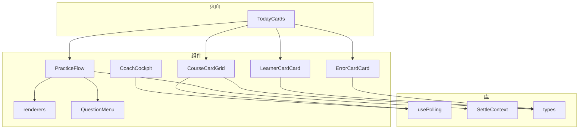
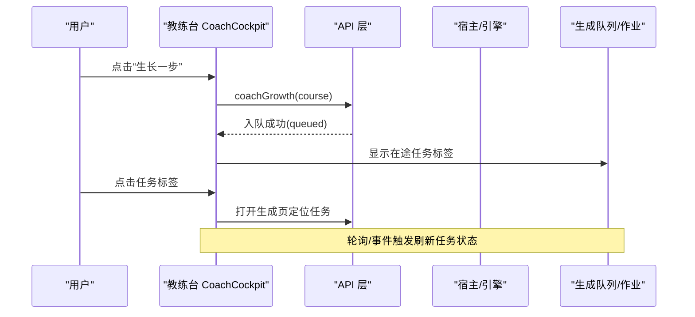
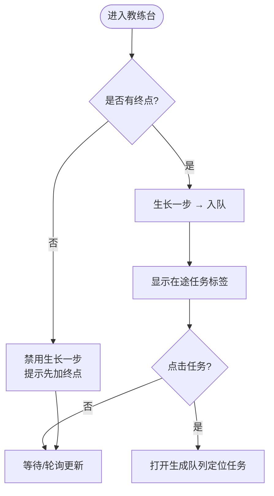
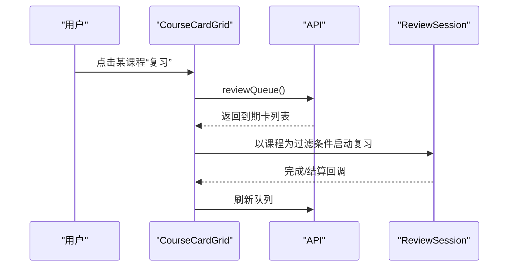
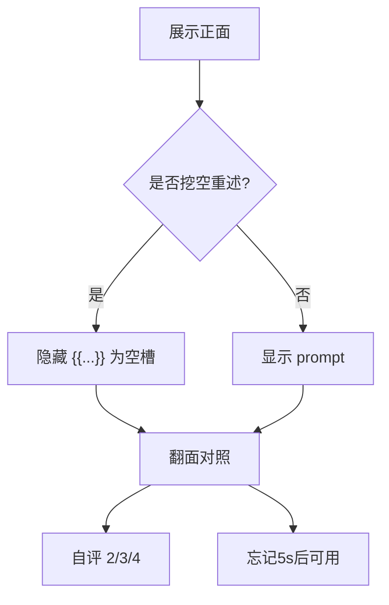
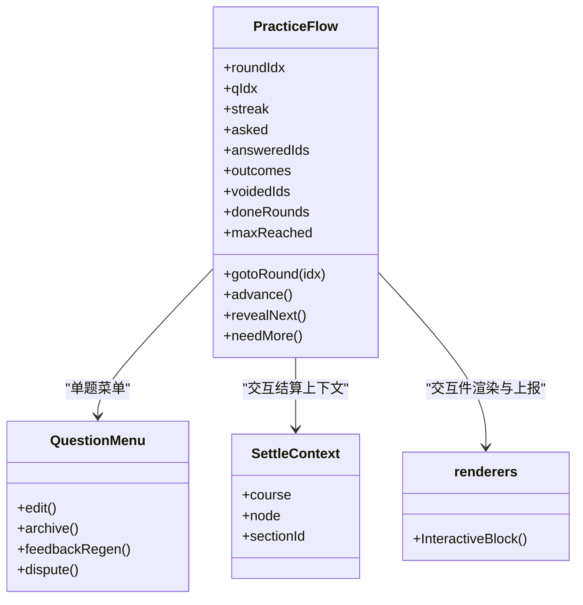
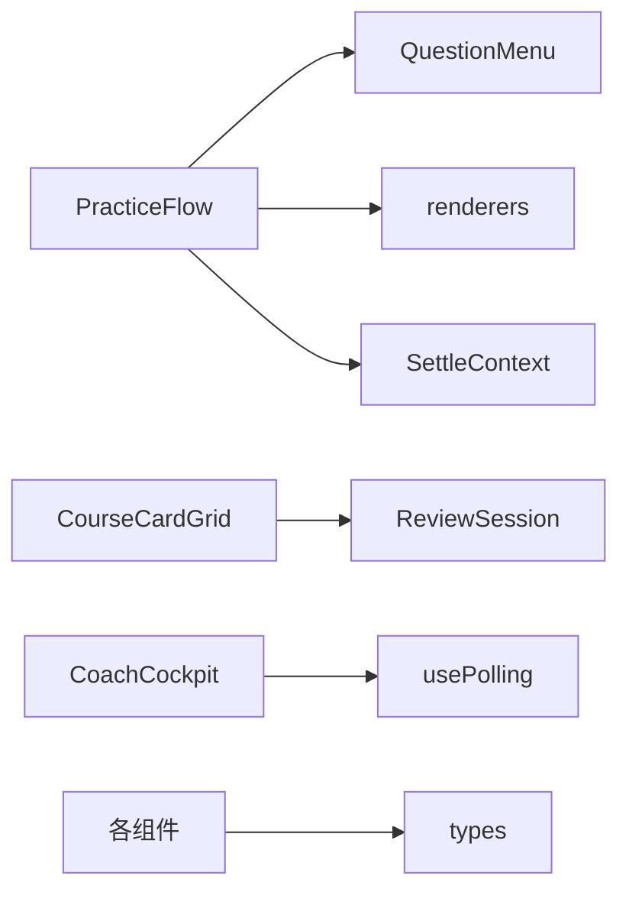

# 业务组件

<cite>
**本文引用的文件**
- [CoachCockpit.tsx](file://ui/src/components/CoachCockpit.tsx)
- [CourseCardGrid.tsx](file://ui/src/components/CourseCardGrid.tsx)
- [LearnerCardCard.tsx](file://ui/src/components/LearnerCardCard.tsx)
- [ErrorCardCard.tsx](file://ui/src/components/ErrorCardCard.tsx)
- [PracticeFlow.tsx](file://ui/src/components/PracticeFlow.tsx)
- [TodayCards.tsx](file://ui/src/pages/TodayPage/TodayCards.tsx)
- [LearnerCardManager.tsx](file://ui/src/pages/TodayPage/LearnerCardManager.tsx)
- [renderers.tsx](file://ui/src/components/renderers.tsx)
- [QuestionMenu.tsx](file://ui/src/components/QuestionMenu.tsx)
- [settle-context.ts](file://ui/src/lib/settle-context.ts)
- [usePolling.ts](file://ui/src/hooks/usePolling.ts)
- [types.ts](file://ui/src/types.ts)
</cite>

## 目录
1. [简介](#简介)
2. [项目结构](#项目结构)
3. [核心组件](#核心组件)
4. [架构总览](#架构总览)
5. [详细组件分析](#详细组件分析)
6. [依赖关系分析](#依赖关系分析)
7. [性能考虑](#性能考虑)
8. [故障排查指南](#故障排查指南)
9. [结论](#结论)
10. [附录](#附录)

## 简介
本文件面向学习场景的业务组件，系统性梳理教练仪表板、课程卡片网格、学习者卡片、题目练习流与错误对比卡等关键 UI 组件。内容覆盖：
- 每个组件的业务职责、数据绑定与用户交互
- 状态管理与事件处理机制（轮询、上下文、会话内状态）
- 组件集成方式与可定制扩展点
- 性能优化与用户体验设计要点

## 项目结构
前端 UI 位于 ui/src 下，按“页面 + 组件 + 库”组织：
- 页面层：今日页 TodayCards、课程页等聚合展示
- 组件层：教练台、课程网格、学习者卡片、错误对比卡、练习流、渲染器、题目菜单等
- 库层：轮询 Hook、结算上下文、类型定义等

图表来源
- [TodayCards.tsx:1-232](file://ui/src/pages/TodayPage/TodayCards.tsx#L1-L232)
- [CoachCockpit.tsx:1-253](file://ui/src/components/CoachCockpit.tsx#L1-L253)
- [CourseCardGrid.tsx:1-174](file://ui/src/components/CourseCardGrid.tsx#L1-L174)
- [LearnerCardCard.tsx:1-129](file://ui/src/components/LearnerCardCard.tsx#L1-L129)
- [ErrorCardCard.tsx:1-106](file://ui/src/components/ErrorCardCard.tsx#L1-L106)
- [PracticeFlow.tsx:1-462](file://ui/src/components/PracticeFlow.tsx#L1-L462)
- [renderers.tsx:1-166](file://ui/src/components/renderers.tsx#L1-L166)
- [QuestionMenu.tsx:1-163](file://ui/src/components/QuestionMenu.tsx#L1-L163)
- [settle-context.ts:1-9](file://ui/src/lib/settle-context.ts#L1-L9)
- [usePolling.ts:1-48](file://ui/src/hooks/usePolling.ts#L1-L48)
- [types.ts:1-93](file://ui/src/types.ts#L1-L93)

章节来源
- [TodayCards.tsx:1-232](file://ui/src/pages/TodayPage/TodayCards.tsx#L1-L232)
- [CoachCockpit.tsx:1-253](file://ui/src/components/CoachCockpit.tsx#L1-L253)
- [CourseCardGrid.tsx:1-174](file://ui/src/components/CourseCardGrid.tsx#L1-L174)

## 核心组件
- 教练仪表板（CoachCockpit）：提供建课、生长一步、罗盘重画、enc 回填、就绪深度与复诊实验面板；在途任务可视化。
- 课程卡片网格（CourseCardGrid）：课程树与状态面投影，复习队列过滤启动单课复习，支持重新生成与删除。
- 学习者卡片（LearnerCardCard）：三段式复习（提示重述/挖空重述/自注讲解），翻面对照+自评推进，忘记门控。
- 错误对比卡（ErrorCardCard）：三选一辨别卡，自动判分并揭晓解析。
- 练习流（PracticeFlow）：节序列驱动的学习会话，阅读/练习/交互轮次，连对达标过关，AI 定向补题与申诉结算。
- 今日页卡片组（TodayCards）：XP 进度、复习横幅、推荐大卡（含诊断建议与定向复习）。
- 我的卡管理（LearnerCardManager）：归档/恢复学习者理解卡。
- 渲染器（renderers）：代码块分发（Mermaid/媒体/交互/图表等），交互件成绩上报。
- 题目菜单（QuestionMenu）：编辑、归档、提意见重出、申诉入口。
- 轮询 Hook（usePolling）：页签保活、切回补拉、自定义节拍。
- 结算上下文（SettleContext）：交互件成绩结算的跨组件上下文。
- 类型（types）：统一从引擎视图与命令输出派生，避免手工镜像。

章节来源
- [CoachCockpit.tsx:1-253](file://ui/src/components/CoachCockpit.tsx#L1-L253)
- [CourseCardGrid.tsx:1-174](file://ui/src/components/CourseCardGrid.tsx#L1-L174)
- [LearnerCardCard.tsx:1-129](file://ui/src/components/LearnerCardCard.tsx#L1-L129)
- [ErrorCardCard.tsx:1-106](file://ui/src/components/ErrorCardCard.tsx#L1-L106)
- [PracticeFlow.tsx:1-462](file://ui/src/components/PracticeFlow.tsx#L1-L462)
- [TodayCards.tsx:1-232](file://ui/src/pages/TodayPage/TodayCards.tsx#L1-L232)
- [LearnerCardManager.tsx:1-91](file://ui/src/pages/TodayPage/LearnerCardManager.tsx#L1-L91)
- [renderers.tsx:1-166](file://ui/src/components/renderers.tsx#L1-L166)
- [QuestionMenu.tsx:1-163](file://ui/src/components/QuestionMenu.tsx#L1-L163)
- [usePolling.ts:1-48](file://ui/src/hooks/usePolling.ts#L1-L48)
- [settle-context.ts:1-9](file://ui/src/lib/settle-context.ts#L1-L9)
- [types.ts:1-93](file://ui/src/types.ts#L1-L93)

## 架构总览
组件通过 API 与宿主/引擎通信，使用轮询 Hook 保持数据新鲜度，通过上下文传递会话级信息（如交互结算），并通过事件总线或全局事件实现跨页刷新。

图表来源
- [CoachCockpit.tsx:142-248](file://ui/src/components/CoachCockpit.tsx#L142-L248)
- [usePolling.ts:15-47](file://ui/src/hooks/usePolling.ts#L15-L47)

## 详细组件分析

### 教练仪表板（CoachCockpit）
- 业务逻辑
  - 建课：创建空图课程，终点由用户在图屏添加；零终点时禁用“生长一步”并提示。
  - 生长一步：提交后进入队列，结果在生成队列可见；就绪深度卡根据前瞻需求与就绪存量计算进度条，尾段“前沿清空”视为达标。
  - 罗盘重画：入队即返回，失败不阻塞。
  - enc 回填：依据作答记录推断缺失成分技能边，产出提案供人审。
  - 复诊实验：展示在途/到期未决、插入率/剪除率、韧性闸门；支持立即结算。
- 数据绑定
  - 课程状态 coach、completions、jobs 等来自 status/tree；复诊数据通过 /probation 获取。
- 用户交互
  - Modal 确认危险操作；Tag 点击跳转生成队列；按钮 loading 态防重复提交。
- 状态管理与事件
  - usePolling 低频轮询复诊数据；本地 busy 状态控制按钮；Modal.confirm 二次确认。
- 集成与扩展
  - onOpenJob 回调用于跳转到生成队列对应任务；SeedFormModal 新建课程成功后派发 reload 事件。

图表来源
- [CoachCockpit.tsx:142-248](file://ui/src/components/CoachCockpit.tsx#L142-L248)

章节来源
- [CoachCockpit.tsx:1-253](file://ui/src/components/CoachCockpit.tsx#L1-L253)

### 课程卡片网格（CourseCardGrid）
- 业务逻辑
  - 展示课程树与状态面投影，统计未学/进行/复习/掌握/跳过/到期数量；终点读数（已铺通/已达成）。
  - 支持单课复习（按课程过滤到期卡）、整课重新生成、删除课程。
- 数据绑定
  - frame.tree.courses 与 frame.status.courses；复习队列独立取数并监听 learnhub:reload 补拉。
- 用户交互
  - “打开图”进入课程工作台；“复习”拉起 ReviewSession；“…”菜单承载破坏性操作。
- 状态管理与事件
  - 本地 reviewQueueDoc 缓存；全局事件 learnhub:reload 触发刷新；Modal.confirm 确认删除/重置。
- 集成与扩展
  - 与 ReviewSession 共用复习会话缝；frame.reload 刷新页面。

图表来源
- [CourseCardGrid.tsx:80-174](file://ui/src/components/CourseCardGrid.tsx#L80-L174)

章节来源
- [CourseCardGrid.tsx:1-174](file://ui/src/components/CourseCardGrid.tsx#L1-L174)

### 学习者卡片（LearnerCardCard）
- 业务逻辑
  - 三段式复习：提示重述/挖空重述/自注讲解；正面心里重述→翻面对照→自评 Hard/Good/Easy。
  - 忘记申报受 5 秒门控，防止以申报代替回忆。
- 数据绑定
  - card.kind 决定正面呈现（挖空隐藏 {{…}}，背面加粗对照）。
- 用户交互
  - 键盘快捷键 2/3/4 快速评分；翻面切换；忘记按钮倒计时。
- 状态管理与事件
  - 本地 flipped/busy/forgetIn 状态；键盘事件监听与清理。
- 集成与扩展
  - 父组件传入 onRate/onForget 回调；可与复习队列联动。

图表来源
- [LearnerCardCard.tsx:1-129](file://ui/src/components/LearnerCardCard.tsx#L1-L129)

章节来源
- [LearnerCardCard.tsx:1-129](file://ui/src/components/LearnerCardCard.tsx#L1-L129)

### 错误对比卡（ErrorCardCard）
- 业务逻辑
  - 三选一辨别卡：正确做法、学习者错法、干扰项；选后即判分并揭晓解析。
- 数据绑定
  - options 数组与 q 题干；揭晓后高亮正确项与“你的错法”。
- 用户交互
  - 选项按钮选择；揭晓后展示解析与反馈。
- 状态管理与事件
  - busy/reveal/picked 本地状态；onAnswer 异步返回判分结果。
- 集成与扩展
  - 与复习队列结合，作为自动判分题型。

章节来源
- [ErrorCardCard.tsx:1-106](file://ui/src/components/ErrorCardCard.tsx#L1-L106)

### 练习流（PracticeFlow）
- 业务逻辑
  - 节序列驱动：阅读节→做该节题（连对目标随组内题量收缩，基准 2、上限 5）；练习节直接做题；交互节运行沙箱 iframe 并上报成绩。
  - 直通卡（advancedToday）仅展示不产连对；struggle 分支支持 AI 定向补题；申诉结算支持改判/作废/豁免并恢复会话状态。
- 数据绑定
  - sections/manifest/questions 构建 rounds/steps；answeredIds/outcomes/voidedIds 维护会话内答题与判罚中性。
- 用户交互
  - Stepper 导航；上一题/下一题；重读本节/AI 再出题；跳过本节。
- 状态管理与事件
  - 外部题目集变化（定向补题并入/会话内归档重生成）自动重定位到第一个未作答题；onPassChange 通知父级“全部节过关”。
- 集成与扩展
  - QuestionMenu 提供编辑/归档/提意见重出/申诉；SettleContext 提供交互结算上下文；renderers 中 InteractiveBlock 上报成绩。

图表来源
- [PracticeFlow.tsx:58-462](file://ui/src/components/PracticeFlow.tsx#L58-L462)
- [QuestionMenu.tsx:1-163](file://ui/src/components/QuestionMenu.tsx#L1-L163)
- [settle-context.ts:1-9](file://ui/src/lib/settle-context.ts#L1-L9)
- [renderers.tsx:66-133](file://ui/src/components/renderers.tsx#L66-L133)

章节来源
- [PracticeFlow.tsx:1-462](file://ui/src/components/PracticeFlow.tsx#L1-L462)
- [QuestionMenu.tsx:1-163](file://ui/src/components/QuestionMenu.tsx#L1-L163)
- [renderers.tsx:1-166](file://ui/src/components/renderers.tsx#L1-L166)
- [settle-context.ts:1-9](file://ui/src/lib/settle-context.ts#L1-L9)

### 今日页卡片组（TodayCards）
- 业务逻辑
  - XP 时间账本条：今日 XP、每日目标环、连续学习天数。
  - 复习横幅：到期卡驱动，支持开始复习、挖错误卡、笔记源漂移/挂起处理。
  - 推荐流大卡：已生成/生成中/排队中三态；诊断建议直达重写；建议先复习直达定向复习。
- 数据绑定
  - xp/status/reviewQ/recEvents 等通过 props 注入；genLabel 读取生成进度。
- 用户交互
  - 调整目标、开始复习、挖错误卡、重写此节、定向复习、跳过节点。
- 状态管理与事件
  - 组件内局部状态（rewriting 等）；Popconfirm 确认危险操作；Message 反馈。
- 集成与扩展
  - 与复习队列、生成队列、工作区动作解耦，通过回调上抛。

章节来源
- [TodayCards.tsx:1-232](file://ui/src/pages/TodayPage/TodayCards.tsx#L1-L232)

### 我的卡管理（LearnerCardManager）
- 业务逻辑
  - 加载在库卡清单；归档/恢复操作；本次会话已归档的卡可恢复。
- 数据绑定
  - LearnerQueueDoc.cards；archived 列表与会话级状态。
- 用户交互
  - Drawer 抽屉；归档/恢复按钮；消息提示。
- 状态管理与事件
  - open 控制抽屉显隐；busy 防抖；onChanged 通知父级刷新。
- 集成与扩展
  - 与 api.learnerArchive 对接；与学习页会话级状态联动。

章节来源
- [LearnerCardManager.tsx:1-91](file://ui/src/pages/TodayPage/LearnerCardManager.tsx#L1-L91)

### 渲染器（renderers）
- 业务逻辑
  - 代码块分发：mermaid/media/interactive/svg/plot/chart；未注册 lang 降级源码显示。
  - 交互件：iframe postMessage 协议 LEARNHUB_COMPLETE/SHOW_ANNOTATION；在练习节上下文中上报成绩。
- 数据绑定
  - SettleContext 提供 course/node/sectionId；RENDERERS 清单与实现同步校验。
- 用户交互
  - 音视频播放器；Mermaid 图渲染；交互件完成徽标与注解浮层。
- 状态管理与事件
  - 动态导入 mermaid；noteTimer 自动消失；message 事件监听与清理。
- 集成与扩展
  - 新增格式需同时更新 shared/content-renderers.ts 与 BLOCK_RENDERERS。

章节来源
- [renderers.tsx:1-166](file://ui/src/components/renderers.tsx#L1-L166)
- [settle-context.ts:1-9](file://ui/src/lib/settle-context.ts#L1-L9)

## 依赖关系分析
- 组件耦合
  - PracticeFlow 依赖 QuestionMenu、renderers、SettleContext；CourseCardGrid 依赖 ReviewSession；CoachCockpit 依赖 usePolling。
- 外部依赖
  - API 层封装宿主路由；类型从引擎视图与命令输出派生，避免手工镜像。
- 潜在循环
  - 组件间通过回调与上下文解耦，未见直接循环依赖。
- 接口契约
  - types.ts 集中声明 UI 专有与引擎视图类型；CommandOutput 派生确保响应类型一致。

图表来源
- [PracticeFlow.tsx:1-462](file://ui/src/components/PracticeFlow.tsx#L1-L462)
- [CourseCardGrid.tsx:1-174](file://ui/src/components/CourseCardGrid.tsx#L1-L174)
- [CoachCockpit.tsx:1-253](file://ui/src/components/CoachCockpit.tsx#L1-L253)
- [types.ts:1-93](file://ui/src/types.ts#L1-L93)

章节来源
- [types.ts:1-93](file://ui/src/types.ts#L1-L93)

## 性能考虑
- 轮询节流
  - usePolling 基于 isActiveTab 与 idleMs 控制非激活页签的取数频率，减少无效请求。
- 渲染优化
  - 代码块按需动态导入（如 mermaid）；交互件 lazy loading；长列表分页/虚拟滚动可扩展。
- 状态最小化
  - 会话内 answeredIds/outcomes/voidedIds 仅维护必要集合；外部题目集变化通过签名比对避免重排。
- 网络与错误
  - 失败按空处理不阻断翻页；Message 提示错误；Modal.confirm 二次确认降低误操作成本。

[本节为通用指导，无需具体文件引用]

## 故障排查指南
- 教练台无终点导致生长失败
  - 现象：生长一步按钮禁用或失败。
  - 处理：先到图屏添加终点；查看就绪深度卡提示。
  - 参考路径：[CoachCockpit.tsx:208-226](file://ui/src/components/CoachCockpit.tsx#L208-L226)
- 复诊数据不更新
  - 现象：复诊面板无在途/到期信息。
  - 处理：检查 usePolling 配置与 tab 切换事件；确认 /probation 接口可用。
  - 参考路径：[CoachCockpit.tsx:77-135](file://ui/src/components/CoachCockpit.tsx#L77-L135), [usePolling.ts:15-47](file://ui/src/hooks/usePolling.ts#L15-L47)
- 复习队列不同步
  - 现象：课程复习按钮不可用或无到期卡。
  - 处理：监听 learnhub:reload 事件；确认 ReviewSession 过滤逻辑。
  - 参考路径：[CourseCardGrid.tsx:80-174](file://ui/src/components/CourseCardGrid.tsx#L80-L174)
- 交互件成绩未计入
  - 现象：交互完成但练习档案未更新。
  - 处理：检查 SettleContext 是否提供；确认 iframe postMessage 协议与 settle 调用。
  - 参考路径：[renderers.tsx:66-133](file://ui/src/components/renderers.tsx#L66-L133), [settle-context.ts:1-9](file://ui/src/lib/settle-context.ts#L1-L9)
- 题目申诉后状态异常
  - 现象：申诉结算后连对/预算计数不对。
  - 处理：核对 handleDisputeSettled 对 outcomes/voidedIds/asked 的更新逻辑。
  - 参考路径：[PracticeFlow.tsx:257-297](file://ui/src/components/PracticeFlow.tsx#L257-L297)

章节来源
- [CoachCockpit.tsx:77-226](file://ui/src/components/CoachCockpit.tsx#L77-L226)
- [usePolling.ts:15-47](file://ui/src/hooks/usePolling.ts#L15-L47)
- [CourseCardGrid.tsx:80-174](file://ui/src/components/CourseCardGrid.tsx#L80-L174)
- [renderers.tsx:66-133](file://ui/src/components/renderers.tsx#L66-L133)
- [PracticeFlow.tsx:257-297](file://ui/src/components/PracticeFlow.tsx#L257-L297)

## 结论
本套业务组件围绕“教练—课程—学习者—题目”的学习闭环，提供了从课程治理、复习调度到练习会话的完整前端能力。通过统一的类型派生、轮询 Hook、上下文与事件机制，实现了低耦合、高内聚的可维护架构。建议在扩展新题型或新流程时，优先复用现有模式（轮询、上下文、回调上抛），并保持与共享清单的一致性。

[本节为总结，无需具体文件引用]

## 附录
- 组件集成示例
  - 在课程页嵌入 CourseCardGrid，并通过 frame.openCourse/frame.reload 打通导航与刷新。
  - 在学习页嵌入 PracticeFlow，传入 sections/manifest/questions，并在 onNeedMore 中接入定向补题。
  - 在复习流程中使用 LearnerCardCard/ErrorCardCard，配合复习队列与结算回调。
- 自定义扩展方法
  - 新增代码块渲染器：在 renderers.tsx 的 BLOCK_RENDERERS 中添加实现，并确保 shared/content-renderers.ts 同步。
  - 新增轮询策略：封装 usePolling 的 tick 函数，返回自定义延迟以实现差异化刷新节奏。
  - 新增题目类型：在 types.ts 中从引擎视图/命令输出派生，避免手工镜像。

[本节为补充说明，无需具体文件引用]