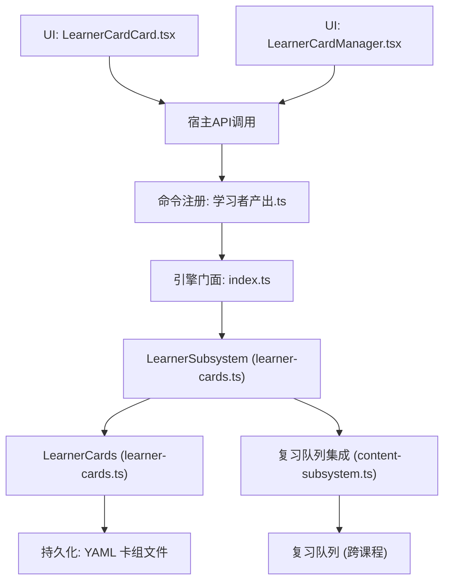
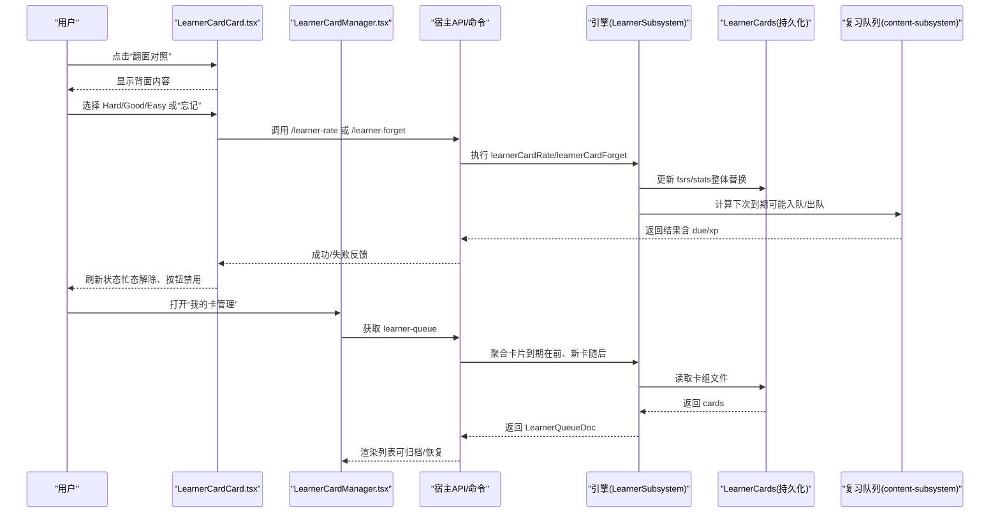
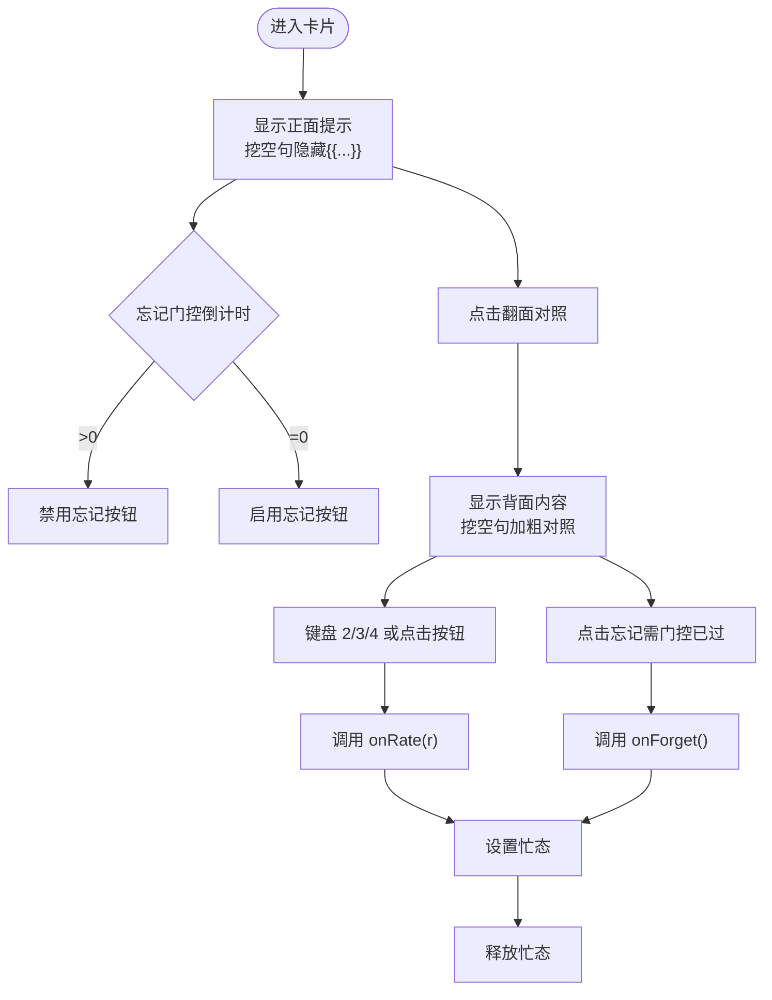
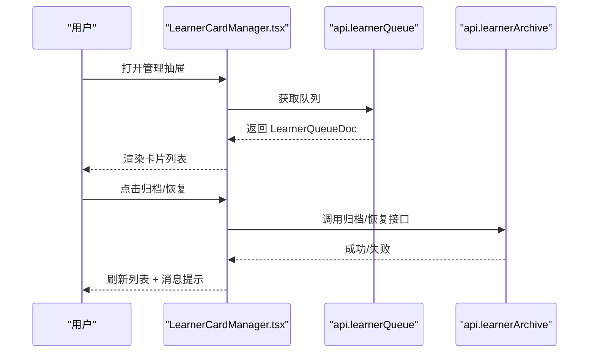
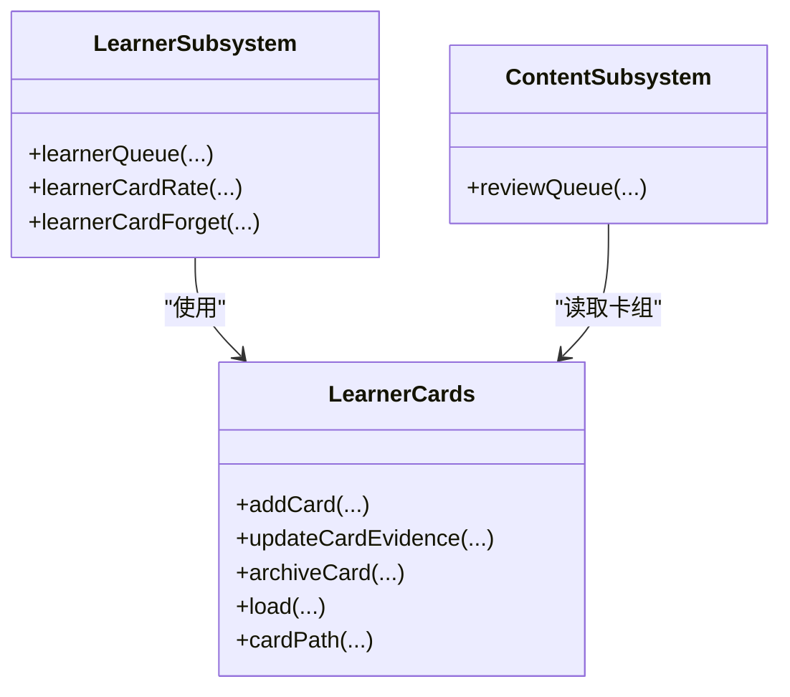
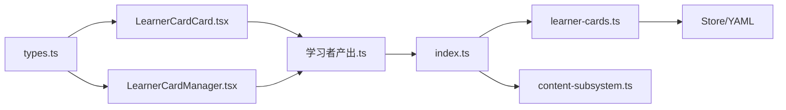

# 学习者卡片

<cite>
**本文引用的文件**
- [LearnerCardCard.tsx](file://ui/src/components/LearnerCardCard.tsx)
- [LearnerCardManager.tsx](file://ui/src/pages/TodayPage/LearnerCardManager.tsx)
- [learner.ts（视图类型）](file://src/engine/views/learner.ts)
- [learner-cards.ts（引擎实现）](file://src/engine/learner-cards.ts)
- [index.ts（引擎门面）](file://src/engine/index.ts)
- [content-subsystem.ts（复习队列集成）](file://src/engine/content-subsystem.ts)
- [学习者产出命令注册](file://src/commands/学习者产出.ts)
- [learner-cards.test.ts（测试用例）](file://tests/learner-cards.test.ts)
- [types.ts（UI 类型重导出）](file://ui/src/types.ts)
</cite>

## 目录
1. [简介](#简介)
2. [项目结构](#项目结构)
3. [核心组件](#核心组件)
4. [架构总览](#架构总览)
5. [详细组件分析](#详细组件分析)
6. [依赖关系分析](#依赖关系分析)
7. [性能与体验优化建议](#性能与体验优化建议)
8. [故障排查指南](#故障排查指南)
9. [结论](#结论)

## 简介
本文件面向“学习者卡片”（又称“我的卡”）的学习者侧展示、交互与数据流转，覆盖以下要点：
- 信息展示：卡片正面提示、背面内容、到期日、尝试次数、来源课程/节点/小节。
- 掌握度指标与进度跟踪：基于 FSRS 的独立调度块与“一卡一天一次推进”门禁；通过复习队列统一呈现并结算无绑定 XP。
- 交互功能：翻面对照、自评 Hard/Good/Easy、忘记申报（受 5 秒门控）、键盘快捷键、归档/恢复管理。
- 数据刷新机制：页面打开时拉取队列，操作后刷新；复习队列合并跨课程到期与新卡。
- 状态可视化：颜色编码（按卡面种类）、到期标签、尝试计数、忙态禁用。
- 样式定制与事件处理：基于 Arco Design 的 Tag/Button/Tabs 组合，事件回调 onRate/onForget 由上层注入。
- 性能与体验：防连点去重、最小化渲染、错误边界与友好提示。

## 项目结构
学习者卡片涉及 UI 层与引擎层的协作：
- UI 层
  - LearnerCardCard.tsx：单张卡片的展示与交互（翻面、评分、忘记）。
  - LearnerCardManager.tsx：卡片管理抽屉（列出在库卡、归档/恢复）。
  - types.ts：从引擎视图类型重导出 LearnerCardItem/LearnerQueueDoc 等。
- 引擎层
  - learner-cards.ts：卡片增删改查、校验、归档、证据写回（FSRS/stats）、队列聚合。
  - views/learner.ts：视图类型定义（LearnerCardKind、LearnerCardItem、LearnerQueueDoc）。
  - content-subsystem.ts：将“我的卡”并入复习队列（未调度新卡队尾首推，到期卡入队）。
  - index.ts：引擎门面暴露 LearnerSubsystem/LearnerCards。
  - 学习者产出命令注册：对外提供 /learner-queue、/learner-rate、/learner-forget 等路由。

图表来源
- [LearnerCardCard.tsx:34-128](file://ui/src/components/LearnerCardCard.tsx#L34-L128)
- [LearnerCardManager.tsx:12-90](file://ui/src/pages/TodayPage/LearnerCardManager.tsx#L12-L90)
- [学习者产出命令注册:511-555](file://src/commands/学习者产出.ts#L511-L555)
- [index.ts:149-184](file://src/engine/index.ts#L149-L184)
- [learner-cards.ts:184-309](file://src/engine/learner-cards.ts#L184-L309)
- [content-subsystem.ts:538-561](file://src/engine/content-subsystem.ts#L538-L561)

章节来源
- [LearnerCardCard.tsx:1-129](file://ui/src/components/LearnerCardCard.tsx#L1-L129)
- [LearnerCardManager.tsx:1-91](file://ui/src/pages/TodayPage/LearnerCardManager.tsx#L1-L91)
- [learner.ts:89-117](file://src/engine/views/learner.ts#L89-L117)
- [learner-cards.ts:1-100](file://src/engine/learner-cards.ts#L1-L100)
- [index.ts:149-184](file://src/engine/index.ts#L149-L184)
- [content-subsystem.ts:538-561](file://src/engine/content-subsystem.ts#L538-L561)
- [学习者产出命令注册:511-555](file://src/commands/学习者产出.ts#L511-L555)

## 核心组件
- 卡片展示与交互（LearnerCardCard.tsx）
  - 三段式复习：正面提示 → 翻面对照 → 自评（Hard/Good/Easy）。
  - 忘记申报：受 5 秒门控，防止以“忘记”代替回忆。
  - 键盘快捷键：翻面后可用 2/3/4 快捷评分。
  - 忙态与禁用：避免重复提交。
- 卡片管理（LearnerCardManager.tsx）
  - 列出在库卡（到期在前、新卡随后），支持归档/恢复。
  - 会话级“本次已归档”清单，便于即时恢复。
- 引擎能力（learner-cards.ts）
  - 卡片增删改查、校验（长度、控制字符、挖空标记、白名单 kind）。
  - 归档/恢复、证据写回（fsrs/stats 整体替换）。
  - 队列聚合与复习队列集成（ADR-0021）。
- 视图类型（views/learner.ts）
  - 明确 LearnerCardKind、LearnerCardItem、LearnerQueueDoc 等数据结构。

章节来源
- [LearnerCardCard.tsx:14-128](file://ui/src/components/LearnerCardCard.tsx#L14-L128)
- [LearnerCardManager.tsx:20-90](file://ui/src/pages/TodayPage/LearnerCardManager.tsx#L20-L90)
- [learner-cards.ts:113-182](file://src/engine/learner-cards.ts#L113-L182)
- [learner-cards.ts:241-309](file://src/engine/learner-cards.ts#L241-L309)
- [learner.ts:89-117](file://src/engine/views/learner.ts#L89-L117)

## 架构总览
“我的卡”是独立域（E1），不污染题库与节点掌握度，但会汇入复习队列统一呈现。关键流程如下：

图表来源
- [LearnerCardCard.tsx:66-83](file://ui/src/components/LearnerCardCard.tsx#L66-L83)
- [LearnerCardManager.tsx:23-47](file://ui/src/pages/TodayPage/LearnerCardManager.tsx#L23-L47)
- [学习者产出命令注册:511-555](file://src/commands/学习者产出.ts#L511-L555)
- [learner-cards.ts:273-309](file://src/engine/learner-cards.ts#L273-L309)
- [content-subsystem.ts:538-561](file://src/engine/content-subsystem.ts#L538-L561)

## 详细组件分析

### 卡片展示与交互（LearnerCardCard.tsx）
- 数据模型
  - 接收 card: LearnerCardItem，包含 course/node/id/kind/prompt/content/source_section/due/attempts。
  - 根据 kind 映射标签与颜色（recall_cue=arcoblue, cloze_rewrite=purple, self_explain=green）。
- 交互逻辑
  - 翻面：切换 flipped 状态，正面提示 vs 背面内容（挖空句正面隐藏 {{…}}，背面加粗对照）。
  - 忘记门控：FORGET_AFTER_SECONDS=5s，倒计时结束前禁用“忘记”。
  - 评分：onRate(r: 2|3|4)，忙态下禁用按钮，异步调用后释放忙态。
  - 键盘快捷键：翻面后监听 2/3/4，忽略输入框焦点。
- 视觉与状态
  - 到期标签、尝试次数、忙态禁用、错误/成功反馈由上层消息系统处理。
  - 文本渲染使用 InlineMd，支持 Markdown。

图表来源
- [LearnerCardCard.tsx:14-83](file://ui/src/components/LearnerCardCard.tsx#L14-L83)
- [LearnerCardCard.tsx:85-128](file://ui/src/components/LearnerCardCard.tsx#L85-L128)

章节来源
- [LearnerCardCard.tsx:14-128](file://ui/src/components/LearnerCardCard.tsx#L14-L128)

### 卡片管理（LearnerCardManager.tsx）
- 功能
  - 打开抽屉时加载 learner-queue（api.learnerQueue）。
  - 列表展示：kind 标签、prompt、node、due/attempts。
  - 归档/恢复：调用 api.learnerArchive(course,node,id,flag)，成功后刷新列表并提示。
  - 会话级“本次已归档”清单：关闭再开仍可恢复。
- 状态与反馈
  - busy 防止重复操作。
  - Message.success/error 反馈操作结果。

图表来源
- [LearnerCardManager.tsx:23-47](file://ui/src/pages/TodayPage/LearnerCardManager.tsx#L23-L47)
- [LearnerCardManager.tsx:51-90](file://ui/src/pages/TodayPage/LearnerCardManager.tsx#L51-L90)

章节来源
- [LearnerCardManager.tsx:12-90](file://ui/src/pages/TodayPage/LearnerCardManager.tsx#L12-L90)

### 引擎实现与数据流（learner-cards.ts）
- 卡片创建与校验
  - addCard：追加一张卡，同内容去重，生成 id（c1,c2...），写入 YAML。
  - validateLearnerCards：白名单 kind、长度上限、控制字符、挖空标记、source_node 必填。
- 证据写回与归档
  - updateCardEvidence：仅允许整体替换 fsrs/stats，确保派生证据一致性。
  - archiveCard：标记 archived=true 或移除该字段。
- 队列与复习集成
  - 新卡首次评估后调度到明天（一卡一天一次推进）。
  - 复习队列中，未调度新卡队尾首推，到期卡按预测遗忘风险排序。
  - 自评与忘记走无绑定 XP（journal），不写 practice/review-log。

图表来源
- [learner-cards.ts:184-309](file://src/engine/learner-cards.ts#L184-L309)
- [content-subsystem.ts:538-561](file://src/engine/content-subsystem.ts#L538-L561)

章节来源
- [learner-cards.ts:113-182](file://src/engine/learner-cards.ts#L113-L182)
- [learner-cards.ts:241-309](file://src/engine/learner-cards.ts#L241-L309)
- [content-subsystem.ts:538-561](file://src/engine/content-subsystem.ts#L538-L561)

### 视图类型与数据模型（views/learner.ts）
- LearnerCardKind：'recall_cue' | 'cloze_rewrite' | 'self_explain'
- LearnerCardItem：course/node/id/kind/prompt/content/source_section/due/attempts
- LearnerQueueDoc：date/total/due_count/cards

章节来源
- [learner.ts:89-117](file://src/engine/views/learner.ts#L89-L117)

### 复习队列集成（content-subsystem.ts）
- 复习队列包含到期题卡、“我的卡”与错误对比卡。
- 未调度的“我的卡”直接入队尾（作为首推入口）；到期卡按预测遗忘风险升序为主、同档难度渐进出示。
- 定向入口（指定课程/节点）可见并携带起点难度带。

章节来源
- [content-subsystem.ts:538-561](file://src/engine/content-subsystem.ts#L538-L561)

### 命令与路由（学习者产出.ts）
- /learner-queue：列出所有“我的卡”（E1），用于管理与清点。
- /learner-rate：自评结算（2=Hard, 3=Good, 4=Easy），一卡一天一次推进。
- /learner-forget：忘记申报（rating=1），受门控约束。

章节来源
- [学习者产出命令注册:511-555](file://src/commands/学习者产出.ts#L511-L555)

## 依赖关系分析
- UI 依赖
  - LearnerCardCard.tsx 依赖 types.ts 中的 LearnerCardItem/LearnerCardKind。
  - LearnerCardManager.tsx 依赖 api 与 types.ts。
- 引擎依赖
  - LearnerSubsystem 依赖 LearnerCards、Store、Paths、Registry、NoteSourceManifest 等。
  - 复习队列集成依赖 sched、graph、state 等子系统。
- 外部契约
  - 命令注册表暴露 /learner-queue、/learner-rate、/learner-forget。
  - 测试用例验证 schema 门禁、归档/恢复、队列行为、XP 落盘。

图表来源
- [types.ts:34-52](file://ui/src/types.ts#L34-L52)
- [LearnerCardCard.tsx:9-10](file://ui/src/components/LearnerCardCard.tsx#L9-L10)
- [LearnerCardManager.tsx:8-9](file://ui/src/pages/TodayPage/LearnerCardManager.tsx#L8-L9)
- [学习者产出命令注册:511-555](file://src/commands/学习者产出.ts#L511-L555)
- [index.ts:149-184](file://src/engine/index.ts#L149-L184)
- [learner-cards.ts:184-309](file://src/engine/learner-cards.ts#L184-L309)
- [content-subsystem.ts:538-561](file://src/engine/content-subsystem.ts#L538-L561)

章节来源
- [types.ts:34-52](file://ui/src/types.ts#L34-L52)
- [LearnerCardCard.tsx:9-10](file://ui/src/components/LearnerCardCard.tsx#L9-L10)
- [LearnerCardManager.tsx:8-9](file://ui/src/pages/TodayPage/LearnerCardManager.tsx#L8-L9)
- [学习者产出命令注册:511-555](file://src/commands/学习者产出.ts#L511-L555)
- [index.ts:149-184](file://src/engine/index.ts#L149-L184)
- [learner-cards.ts:184-309](file://src/engine/learner-cards.ts#L184-L309)
- [content-subsystem.ts:538-561](file://src/engine/content-subsystem.ts#L538-L561)

## 性能与体验优化建议
- 防连点与忙态
  - 评分/忘记操作期间禁用按钮，避免重复提交（已在 UI 层实现）。
- 最小化渲染
  - 仅在翻面时切换内容，减少不必要的重渲染。
- 错误边界与提示
  - 使用 Message.error 展示错误原因（如无效 kind、内容过长、控制字符）。
- 数据刷新策略
  - 管理抽屉打开时拉取队列，操作成功后立即刷新；复习队列变更通过宿主通知或轮询补拉。
- 用户体验改进
  - 增加“今日已推进过”的提示（当同日再次评分时拒绝）。
  - 为忘记门控提供视觉倒计时（当前已实现按钮文案提示）。
  - 对挖空句提供更直观的占位符（当前已用“＿＿＿”表示）。

[本节为通用建议，无需特定文件引用]

## 故障排查指南
- 常见错误
  - 非法 kind：仅允许 recall_cue/cloze_rewrite/self_explain。
  - 内容为空或超过长度上限：prompt ≤ 500 字符，content ≤ 2000 字符。
  - 挖空重述缺少 {{…}}：必须包含至少一个非空挖空标记。
  - 控制字符：除换行/制表外均拒绝。
  - 同日重复推进：一卡一天一次，第二次评分/忘记会被拒绝。
- 定位方法
  - 查看引擎日志与错误消息（如“我的卡 Broken”）。
  - 检查卡组 YAML 文件是否损坏或字段缺失。
  - 确认复习队列是否正确聚合（未调度新卡应队尾首推）。
- 回归测试参考
  - 测试用例覆盖了 schema 门禁、归档/恢复、队列行为、XP 落盘等场景。

章节来源
- [learner-cards.ts:113-182](file://src/engine/learner-cards.ts#L113-L182)
- [learner-cards.test.ts:68-109](file://tests/learner-cards.test.ts#L68-L109)
- [learner-cards.test.ts:350-392](file://tests/learner-cards.test.ts#L350-L392)
- [learner-cards.test.ts:394-441](file://tests/learner-cards.test.ts#L394-L441)

## 结论
学习者卡片作为独立域（E1），通过清晰的视图类型、严格的 schema 门禁与稳健的引擎实现，提供了直观的学习者自注与复习体验。其三大特性——三段式复习、忘记门控、一卡一天一次推进——确保了学习行为的真实性与可持续性。同时，与复习队列的无缝集成使得“我的卡”能够与其他学习内容统一调度与呈现，提升学习效率。建议在后续迭代中继续强化错误提示、数据刷新策略与用户体验细节，以进一步提升可用性与稳定性。