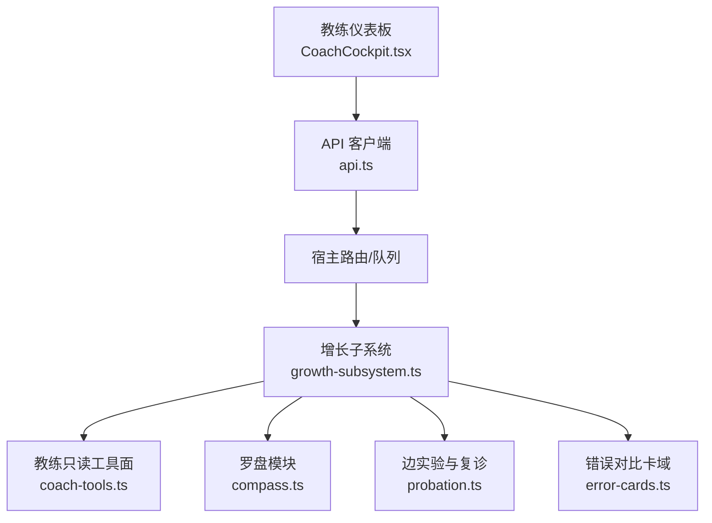
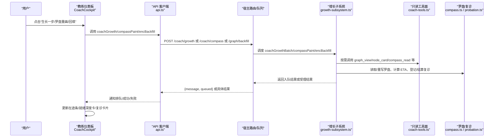
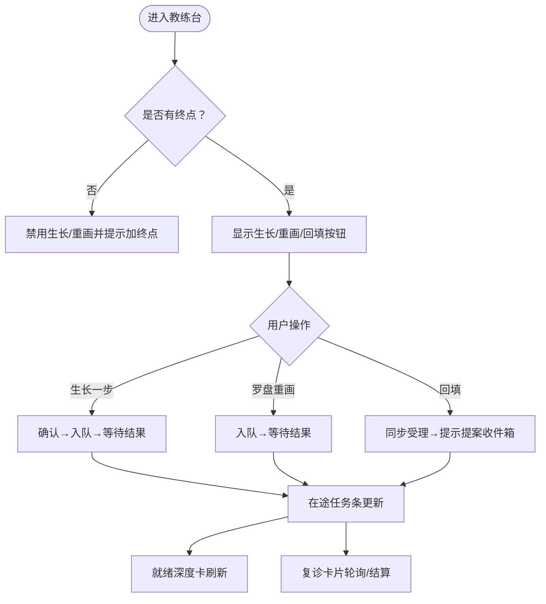
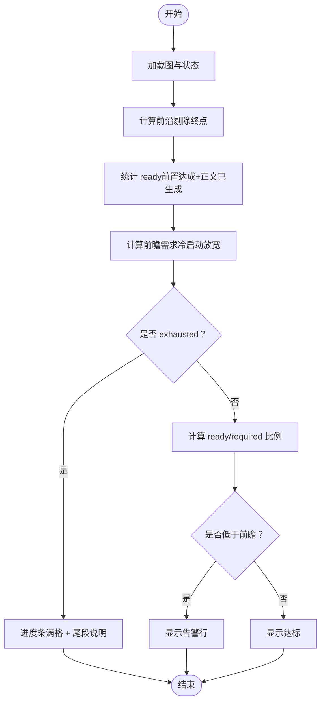
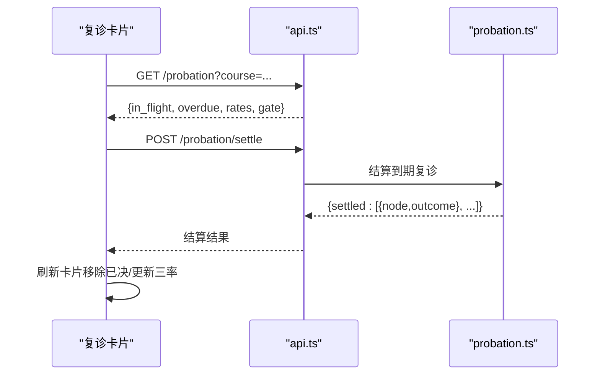
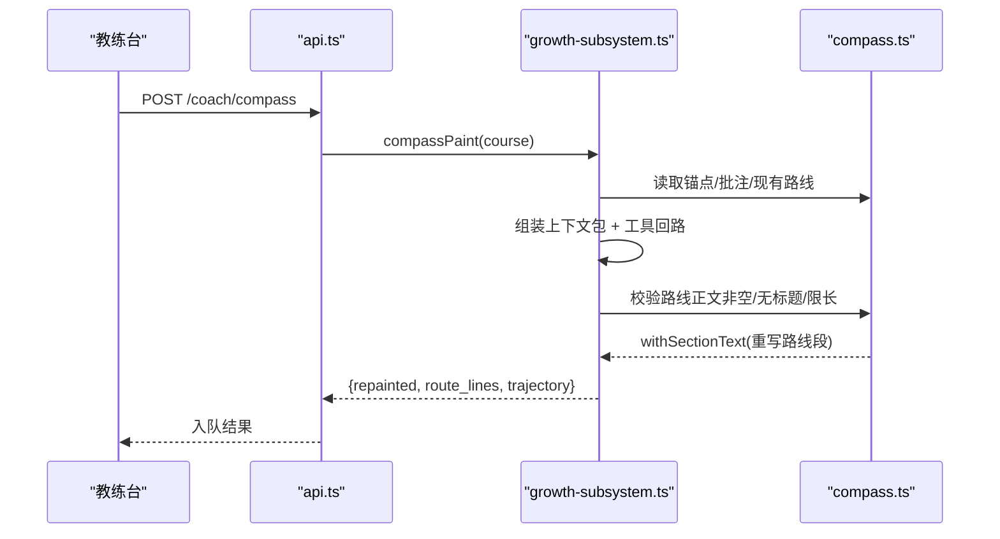
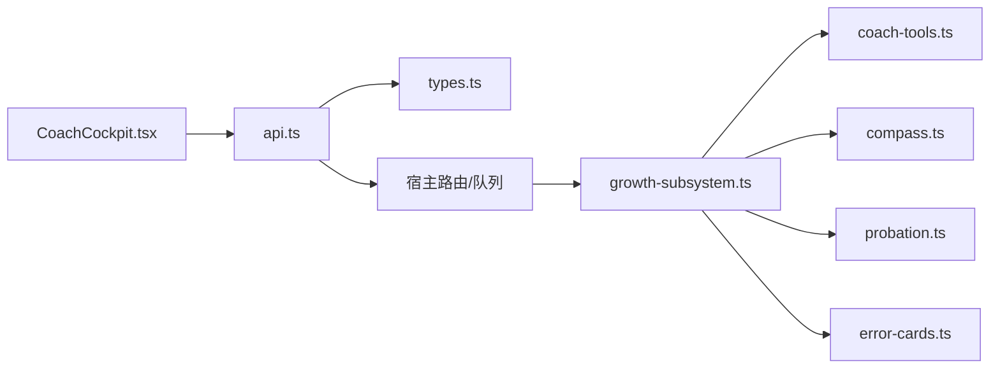

# 教练仪表板

<cite>
**本文引用的文件**
- [CoachCockpit.tsx](file://ui/src/components/CoachCockpit.tsx)
- [coach-tools.ts](file://src/engine/coach-tools.ts)
- [compass.ts](file://src/engine/compass.ts)
- [growth-subsystem.ts](file://src/engine/growth-subsystem.ts)
- [probation.ts](file://src/engine/probation.ts)
- [error-cards.ts](file://src/engine/error-cards.ts)
- [api.ts](file://ui/src/api.ts)
- [types.ts](file://ui/src/types.ts)
</cite>

## 目录
1. [简介](#简介)
2. [项目结构](#项目结构)
3. [核心组件](#核心组件)
4. [架构总览](#架构总览)
5. [详细组件分析](#详细组件分析)
6. [依赖关系分析](#依赖关系分析)
7. [性能考虑](#性能考虑)
8. [故障排查指南](#故障排查指南)
9. [结论](#结论)
10. [附录](#附录)

## 简介
本文件面向“教练仪表板”（CoachCockpit）的完整技术文档，聚焦学习图生命周期管理在面板侧的可视化与交互：课程生长、罗盘重画、成分技能边回填、就绪深度检查、复诊卡片与在途任务状态显示。文档同时覆盖状态管理、用户交互流程、错误处理机制、配置选项与扩展方式，并给出性能优化建议与用户体验设计要点。

## 项目结构
教练仪表板由前端组件与引擎能力共同构成：
- 前端组件：CoachCockpit 提供建课、生长一步、罗盘重画、回填、就绪深度卡、复诊卡片与在途任务条等 UI。
- 引擎能力：GrowthSubsystem 负责教练回合、罗盘读写、ETA 挂载、就绪深度检查；coach-tools 提供只读工具面；probation 实现插入边实验账本与复诊；error-cards 提供错误对比卡域；api.ts 暴露面板到宿主路由的调用；types.ts 统一类型来源。

图表来源
- [CoachCockpit.tsx:142-253](file://ui/src/components/CoachCockpit.tsx#L142-L253)
- [api.ts:314-340](file://ui/src/api.ts#L314-L340)
- [growth-subsystem.ts:100-244](file://src/engine/growth-subsystem.ts#L100-L244)
- [coach-tools.ts:30-35](file://src/engine/coach-tools.ts#L30-L35)
- [compass.ts:18-38](file://src/engine/compass.ts#L18-L38)
- [probation.ts:37-123](file://src/engine/probation.ts#L37-L123)
- [error-cards.ts:1-16](file://src/engine/error-cards.ts#L1-L16)

章节来源
- [CoachCockpit.tsx:142-253](file://ui/src/components/CoachCockpit.tsx#L142-L253)
- [api.ts:314-340](file://ui/src/api.ts#L314-L340)

## 核心组件
- 教练台主卡片：提供新建课程、生长一步、罗盘重画、回填成分技能边按钮；零终点时禁用生长与重画并提示先加终点；展示在途任务条；渲染就绪深度卡与复诊卡片。
- 就绪深度卡：读取 course.coach 的就绪深度检查，计算进度比例，区分冷启动首周与尾段停摆（exhausted），并输出告警信息。
- 复诊卡片：轮询加载当前课程的边实验账本视图，展示在途/到期未决、三率与韧性闸门状态，支持立即结算。
- 在途任务条：映射生成任务状态为标签颜色与文案，点击跳转生成页查看详情。

章节来源
- [CoachCockpit.tsx:17-72](file://ui/src/components/CoachCockpit.tsx#L17-L72)
- [CoachCockpit.tsx:77-135](file://ui/src/components/CoachCockpit.tsx#L77-L135)
- [CoachCockpit.tsx:142-253](file://ui/src/components/CoachCockpit.tsx#L142-L253)

## 架构总览
教练仪表板的控制流从 UI 触发到引擎执行，再到结果回显：
- 用户点击“生长一步/罗盘重画/回填”，组件调用 api 对应方法入队或同步受理。
- 宿主将请求转至 GrowthSubsystem 的 coachGrowthBatch/compassPaint/encBackfill 等入口。
- GrowthSubsystem 组合只读工具面（coach-tools）、罗盘读写（compass）、复诊与 ETA（probation/compass）完成裁决与落盘。
- 结果通过任务消息、statusJson、/probation 等接口回传 UI，更新在途条、就绪深度卡与复诊卡片。

图表来源
- [CoachCockpit.tsx:153-201](file://ui/src/components/CoachCockpit.tsx#L153-L201)
- [api.ts:314-340](file://ui/src/api.ts#L314-L340)
- [growth-subsystem.ts:156-244](file://src/engine/growth-subsystem.ts#L156-L244)
- [coach-tools.ts:235-297](file://src/engine/coach-tools.ts#L235-L297)
- [compass.ts:104-173](file://src/engine/compass.ts#L104-L173)
- [probation.ts:284-347](file://src/engine/probation.ts#L284-L347)

## 详细组件分析

### 教练仪表板组件（CoachCockpit）
- 状态管理
  - seedForm：控制新建课程弹窗可见性。
  - busy：标记生长/重画/回填的忙碌态，用于按钮 loading。
  - noEndpoints：当 endpointCount=0 且已选课程时，禁用生长与重画并提示先加终点。
- 用户交互流程
  - 新建课程：打开 SeedFormModal，创建后触发全局 reload。
  - 生长一步：确认弹窗 → 调用 api.coachGrowth → notifyQueued → 错误捕获与 Message 反馈。
  - 罗盘重画：调用 api.compassPaint → 入队即返回 → 错误捕获。
  - 回填成分技能边：确认弹窗 → 调用 api.encBackfill → 成功提示（含提案收件箱指引）。
- 就绪深度卡
  - 读取 StatusCourse.coach，计算 ready/required 比例；exhausted 时显示满格与说明；cold_start 首周放宽需求。
- 复诊卡片
  - usePolling 低频轮询 /probation，展示 in_flight/overdue/rates/gate；立即结算调用 /probation/settle。
- 在途任务条
  - 使用 JOB_STATUS 映射 GenJobItem.status 为标签颜色与文案；点击 onOpenJob 跳转生成队列定位任务。

图表来源
- [CoachCockpit.tsx:142-253](file://ui/src/components/CoachCockpit.tsx#L142-L253)
- [CoachCockpit.tsx:17-72](file://ui/src/components/CoachCockpit.tsx#L17-L72)
- [CoachCockpit.tsx:77-135](file://ui/src/components/CoachCockpit.tsx#L77-L135)

章节来源
- [CoachCockpit.tsx:142-253](file://ui/src/components/CoachCockpit.tsx#L142-L253)
- [CoachCockpit.tsx:17-72](file://ui/src/components/CoachCockpit.tsx#L17-L72)
- [CoachCockpit.tsx:77-135](file://ui/src/components/CoachCockpit.tsx#L77-L135)

### 就绪深度检查机制（coachCheckFor/readyDepthCheck）
- 计算前沿节点集合（readySet），剔除终点，统计 ready（前置达成且正文已生成）数量。
- 前瞻需求按冷启动首周放宽（×1.5 取整），exhausted 判据包括：零节点空课、所有终点已达成、前沿除终点外清空。
- UI 中根据 ok/exhausted/cold_start 显示进度条与告警文案。

图表来源
- [growth-subsystem.ts:348-375](file://src/engine/growth-subsystem.ts#L348-L375)
- [CoachCockpit.tsx:28-72](file://ui/src/components/CoachCockpit.tsx#L28-L72)

章节来源
- [growth-subsystem.ts:348-375](file://src/engine/growth-subsystem.ts#L348-L375)
- [CoachCockpit.tsx:28-72](file://ui/src/components/CoachCockpit.tsx#L28-L72)

### 复诊卡片与边实验账本（probation）
- 在途/到期未决：foldProbation 折叠账本，in_flight 为无 outcome 条目，overdue 为已到复诊期仍未决。
- 三率：滚动 30 学习日内的插入率、剪枝率、复诊通过率；样本不足时静默。
- 韧性闸门：基于复诊通过率与旁支占比上限进行插入/旁支批的闸停或放行。
- 立即结算：调用 /probation/settle，到期自动判定 proven 或剪除，UI 展示结算结果。

图表来源
- [probation.ts:79-123](file://src/engine/probation.ts#L79-L123)
- [probation.ts:284-347](file://src/engine/probation.ts#L284-L347)
- [CoachCockpit.tsx:77-135](file://ui/src/components/CoachCockpit.tsx#L77-L135)
- [api.ts:335-340](file://ui/src/api.ts#L335-L340)

章节来源
- [probation.ts:79-123](file://src/engine/probation.ts#L79-L123)
- [probation.ts:284-347](file://src/engine/probation.ts#L284-L347)
- [CoachCockpit.tsx:77-135](file://ui/src/components/CoachCockpit.tsx#L77-L135)
- [api.ts:335-340](file://ui/src/api.ts#L335-L340)

### 罗盘重画与路线对账（compass）
- 初画/重画：读取锚点、现有罗盘、学习者批注，组装上下文包，经 agentLoop 产出路线正文，校验通过后仅重写“剩余路线”段，ETA 重置待刷新。
- 路线对账：周复盘挂载 ETA 时顺带做零模型粗 diff，识别有锚/标候选/无锚漂移，不阻塞 ETA。
- UI 消费：/compass 读视图包含剩余路线、批注区、ETA 现势。

图表来源
- [growth-subsystem.ts:156-244](file://src/engine/growth-subsystem.ts#L156-L244)
- [compass.ts:104-173](file://src/engine/compass.ts#L104-L173)
- [api.ts:319-321](file://ui/src/api.ts#L319-L321)

章节来源
- [growth-subsystem.ts:156-244](file://src/engine/growth-subsystem.ts#L156-L244)
- [compass.ts:104-173](file://src/engine/compass.ts#L104-L173)
- [api.ts:319-321](file://ui/src/api.ts#L319-L321)

### 成分技能边回填（enc backfill）
- 确定性推断：依据真实作答记录推断缺失 enc 边，产出富化提案，待人审生效。
- UI 行为：调用 /graph/backfill，成功后提示结果摘要与提案收件箱位置。

章节来源
- [CoachCockpit.tsx:183-201](file://ui/src/components/CoachCockpit.tsx#L183-L201)
- [api.ts:322-324](file://ui/src/api.ts#L322-L324)

### 错误对比卡域（error cards）
- 独立于题库九题型，走 FSRS 自调度，复习呈现并入复习队列，零 XP 零绑定。
- 挖矿高频错误模式，生成三选一辨别卡，schema 门禁严格，存储与归档管理完善。

章节来源
- [error-cards.ts:1-16](file://src/engine/error-cards.ts#L1-L16)
- [error-cards.ts:50-115](file://src/engine/error-cards.ts#L50-L115)
- [error-cards.ts:117-219](file://src/engine/error-cards.ts#L117-L219)
- [error-cards.ts:221-353](file://src/engine/error-cards.ts#L221-L353)

## 依赖关系分析
- 组件耦合
  - CoachCockpit 依赖 api.ts 暴露的图域命令；通过 types.ts 统一类型来源（StatusDoc、GenJobItem、ProbationDoc、CompassDoc）。
  - GrowthSubsystem 依赖 coach-tools 的只读工具面、compass 的罗盘读写、probation 的复诊与闸门、error-cards 的错误卡域（作为数据源之一）。
- 外部依赖与集成点
  - 宿主路由与队列：/coach/growth、/coach/compass、/graph/backfill、/probation/settle。
  - 生成队列：phase=growth/compass，任务状态映射到在途条。
- 潜在环与解耦
  - coach-tools 明确不回引 growth-subsystem，避免 R7 环；通过结构化注入 CoachToolDeps 获取所需视图。
  - GrowthSubsystem 通过窄面 GrowthDeps 与门面解耦。

图表来源
- [CoachCockpit.tsx:142-253](file://ui/src/components/CoachCockpit.tsx#L142-L253)
- [api.ts:314-340](file://ui/src/api.ts#L314-L340)
- [types.ts:1-93](file://ui/src/types.ts#L1-L93)
- [growth-subsystem.ts:36-89](file://src/engine/growth-subsystem.ts#L36-L89)
- [coach-tools.ts:218-227](file://src/engine/coach-tools.ts#L218-L227)

章节来源
- [types.ts:1-93](file://ui/src/types.ts#L1-L93)
- [coach-tools.ts:218-227](file://src/engine/coach-tools.ts#L218-L227)
- [growth-subsystem.ts:36-89](file://src/engine/growth-subsystem.ts#L36-L89)

## 性能考虑
- 轮询频率：复诊卡片使用低频轮询（30s），减少后端压力；在激活页签保活，切回补数。
- 只读工具面：coach-tools 白名单七件，零写侧、零队列触点，降低副作用与开销。
- 路线长度限制：ROUTE_MAX_CHARS 防止罗盘正文膨胀影响上下文与性能。
- 预览上限：GRAPH_NAMES_CAP/LIST_CAP 控制图名与列表视图大小，避免提示词失控。
- 进程级缓存：ETA 折叠使用进程级 memo（同学习周复用），减少重复蒙特卡洛计算。
- 批量上限：ERROR_CARD_BATCH_MAX 限制单次生成卡数，防批量注水。

[本节为通用指导，无需特定文件引用]

## 故障排查指南
- 零终点导致生长/重画不可用：UI 会禁用并提示先添加终点；若仍异常，检查锚点文件是否存在与解析是否 Broken。
- 就绪深度始终偏低：检查冷启动首周放宽逻辑、前沿节点是否正文已生成、终点是否被计入前瞻需求。
- 复诊长期未决：查看 /probation 的 overdue 列表与 learningDaysOf 窗口；确认复诊期 days 是否合理；必要时手动结算。
- 罗盘重画失败：检查路线门（非空/无标题/限长）；查看轨迹与语料捕获；确认锚点存在且合法。
- 在途任务失败：点击在途条跳转生成队列，查看任务消息中的失败原因；必要时重试或取消。

章节来源
- [CoachCockpit.tsx:153-201](file://ui/src/components/CoachCockpit.tsx#L153-L201)
- [growth-subsystem.ts:156-244](file://src/engine/growth-subsystem.ts#L156-L244)
- [probation.ts:284-347](file://src/engine/probation.ts#L284-L347)
- [compass.ts:104-173](file://src/engine/compass.ts#L104-L173)

## 结论
教练仪表板以清晰的状态驱动与低侵入式只读工具面，实现了学习图生命周期的可视化与可控干预：生长一步、罗盘重画、回填、就绪深度检查与复诊管理形成闭环。通过严格的路线门、复诊闸门与 ETA 透明度装置，系统在自动化与可解释性之间取得平衡。建议在大规模课程场景下关注轮询与预览上限策略，并结合在途任务条与语料捕获进行持续优化。

## 附录
- 配置选项与自定义扩展
  - 就绪深度阈值：默认 3，clamp [2,5]；冷启动首周需求 ×1.5 取整。
  - 复诊期：缺省 10 学习日，clamp [5,20]；days 非法值拒收、越界值 clamp 并 warn。
  - 韧性闸门：旁支占比上限 20%→30%（韧性高放宽）；复诊通过率触底/插入率超限闸停插入批。
  - 扩展点：coach-tools 白名单可扩展只读视图；probation 指标与闸门参数集中 params.ts；compass 段落结构稳定，新增机器段需遵循 withSectionText 语义。
- 用户体验设计考虑
  - 诚实性：零终点禁用生长/重画并明确引导；就绪深度在 exhausted 时显满格而非误导。
  - 可观测性：在途任务条常驻可见，点击直达生成队列；复诊卡片展示三率与闸门现势。
  - 低打扰：低频轮询、静默低数据闸门、占位文案与机器标记保护手编内容。

章节来源
- [growth-subsystem.ts:348-375](file://src/engine/growth-subsystem.ts#L348-L375)
- [probation.ts:125-168](file://src/engine/probation.ts#L125-L168)
- [probation.ts:349-416](file://src/engine/probation.ts#L349-L416)
- [compass.ts:104-173](file://src/engine/compass.ts#L104-L173)
- [CoachCockpit.tsx:142-253](file://ui/src/components/CoachCockpit.tsx#L142-L253)