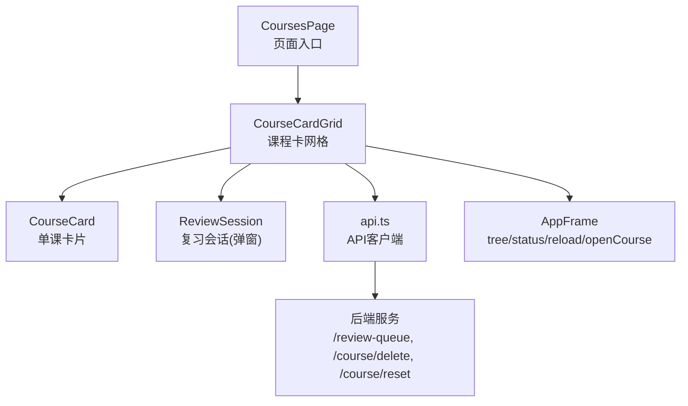
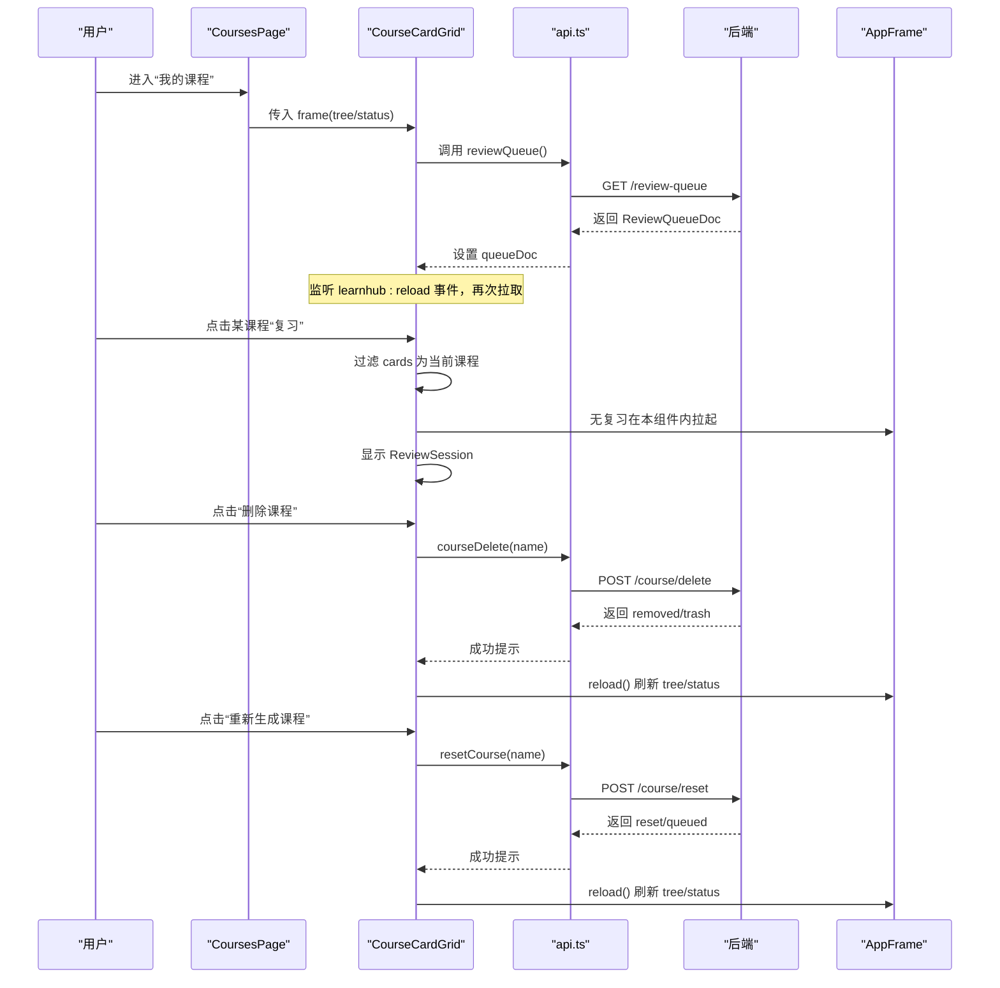
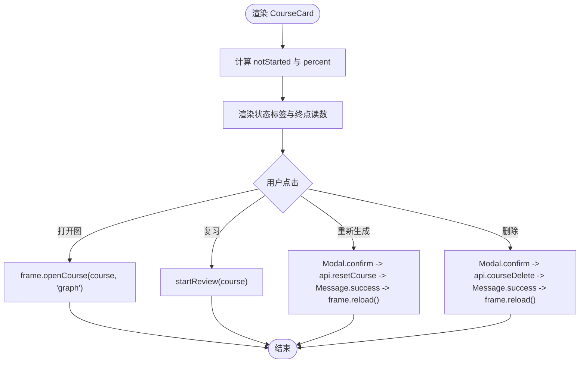
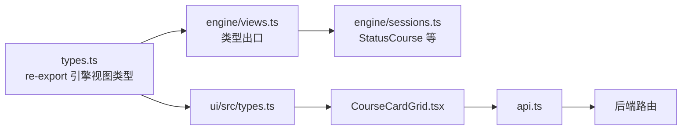

# 课程卡片网格

<cite>
**本文引用的文件**
- [CourseCardGrid.tsx](file://ui/src/components/CourseCardGrid.tsx)
- [CoursesPage/index.tsx](file://ui/src/pages/CoursesPage/index.tsx)
- [api.ts](file://ui/src/api.ts)
- [types.ts](file://ui/src/types.ts)
- [global.css](file://ui/src/global.css)
- [views.ts](file://src/engine/views.ts)
- [sessions.ts](file://src/engine/sessions.ts)
</cite>

## 目录
1. [简介](#简介)
2. [项目结构](#项目结构)
3. [核心组件](#核心组件)
4. [架构总览](#架构总览)
5. [详细组件分析](#详细组件分析)
6. [依赖关系分析](#依赖关系分析)
7. [性能与缓存](#性能与缓存)
8. [样式定制与布局调整](#样式定制与布局调整)
9. [响应式设计与可访问性](#响应式设计与可访问性)
10. [故障排查](#故障排查)
11. [结论](#结论)

## 简介
本组件负责“我的课程”首屏的课程卡片网格展示，提供课程状态概览、进度条、终点读数、到期提醒以及“打开图/复习/重新生成/删除”等交互。数据来源于应用框架提供的树与状态（frame.tree / frame.status），并自取复习队列以支持按课程的复习会话。组件遵循“失败按空处理不翻页”的稳健策略，并通过全局事件跨页刷新时补拉到期数。

## 项目结构
- 页面入口：CoursesPage 根据是否有课程决定渲染教练台或课程卡网格。
- 组件实现：CourseCardGrid 聚合课程列表、状态、复习队列，并提供单课复习会话。
- 类型定义：通过 types.ts 统一从引擎视图导出 StatusCourse、ReviewQueueDoc、QueueCard 等类型。
- API 客户端：ui/src/api.ts 暴露 reviewQueue、courseDelete、resetCourse 等接口。
- 样式：global.css 提供 lh-grid-cards 等语义类，驱动卡片网格布局。



图表来源
- [CoursesPage/index.tsx:1-31](file://ui/src/pages/CoursesPage/index.tsx#L1-L31)
- [CourseCardGrid.tsx:1-174](file://ui/src/components/CourseCardGrid.tsx#L1-L174)
- [api.ts:80-243](file://ui/src/api.ts#L80-L243)

章节来源
- [CoursesPage/index.tsx:1-31](file://ui/src/pages/CoursesPage/index.tsx#L1-L31)
- [CourseCardGrid.tsx:1-174](file://ui/src/components/CourseCardGrid.tsx#L1-L174)
- [api.ts:80-243](file://ui/src/api.ts#L80-L243)
- [global.css:371-377](file://ui/src/global.css#L371-L377)

## 核心组件
- CourseCardGrid：管理课程列表、状态、复习队列；触发删除/重置/复习；监听 learnhub:reload 事件补拉数据。
- CourseCard：展示课程名、进度条、各阶段计数标签、终点读数、操作按钮与菜单。
- ReviewSession：在 CourseCardGrid 内聚拉起，用于单课复习会话（由组件内部维护状态）。

章节来源
- [CourseCardGrid.tsx:15-77](file://ui/src/components/CourseCardGrid.tsx#L15-L77)
- [CourseCardGrid.tsx:79-174](file://ui/src/components/CourseCardGrid.tsx#L79-L174)

## 架构总览
课程卡片网格的数据流与交互流程如下：



图表来源
- [CourseCardGrid.tsx:81-139](file://ui/src/components/CourseCardGrid.tsx#L81-L139)
- [CourseCardGrid.tsx:141-174](file://ui/src/components/CourseCardGrid.tsx#L141-L174)
- [api.ts:80-243](file://ui/src/api.ts#L80-L243)

## 详细组件分析

### 课程卡片（CourseCard）
- 展示内容
  - 课程名称、进度百分比（基于 mastered/total）。
  - 多状态标签：未学（unseen+ready）、进行中（learning）、复习（review）、掌握（mastered）、跳过（skipped）、到期（due_today）。
  - 终点读数：统计 sealed/reached 数量，展示“N个终点·M个已铺通”。
  - 操作区：打开图、复习、下拉菜单（重新生成、删除）。
- 数据绑定
  - 接收 name、counts、total、due、completions 等 props。
  - 计算 notStarted = unseen + ready；percent = Math.round(mastered/total*100)。
- 交互
  - onOpen：打开课程图（通过 frame.openCourse）。
  - onReview：启动单课复习（由父组件过滤队列）。
  - onRegenerate/onDelete：弹出确认框后调用对应 API 并刷新。



图表来源
- [CourseCardGrid.tsx:15-77](file://ui/src/components/CourseCardGrid.tsx#L15-L77)
- [CourseCardGrid.tsx:91-131](file://ui/src/components/CourseCardGrid.tsx#L91-L131)

章节来源
- [CourseCardGrid.tsx:15-77](file://ui/src/components/CourseCardGrid.tsx#L15-L77)

### 课程卡网格（CourseCardGrid）
- 数据获取
  - 初始化即调用 api.reviewQueue() 获取跨课程到期队列，失败按空处理。
  - 监听 window.learnhub:reload 事件，再次拉取复习队列以同步到期数。
  - 课程列表与状态来自 frame.tree.courses 与 frame.status.courses。
- 状态与进度
  - 使用 StatusCourse 中的 counts、due_today、completions 等字段渲染。
  - 进度条基于 total 与 mastered 计算百分比。
- 用户交互
  - 删除课程：确认后调用 api.courseDelete，成功后提示并刷新。
  - 重新生成课程：确认后调用 api.resetCourse，成功后提示并刷新。
  - 单课复习：过滤 queueDoc.cards 中 course 等于当前课程的卡片，若为空则提示“暂无到期复习”，否则拉起 ReviewSession。
- 事件与刷新
  - 复习完成后调用 frame.reload() 并重新拉取 reviewQueue，保证状态一致。

```mermaid
classDiagram
class CourseCardGrid {
+reviewQ() Promise~ReviewQueueDoc|null~
+deleteCourse(name) void
+regenerateCourse(name) void
+startReview(course) void
+render() JSX
}
class Api {
+reviewQueue() Promise~ReviewQueueDoc~
+courseDelete(name) Promise~{removed,trash}~
+resetCourse(name) Promise~{reset,queued}~
}
class AppFrame {
+tree
+status
+reload() Promise~void~
+openCourse(name, view) void
}
CourseCardGrid --> Api : "调用"
CourseCardGrid --> AppFrame : "读取/刷新"
```

图表来源
- [CourseCardGrid.tsx:79-174](file://ui/src/components/CourseCardGrid.tsx#L79-L174)
- [api.ts:80-243](file://ui/src/api.ts#L80-L243)

章节来源
- [CourseCardGrid.tsx:79-174](file://ui/src/components/CourseCardGrid.tsx#L79-L174)
- [api.ts:80-243](file://ui/src/api.ts#L80-L243)

### 页面入口（CoursesPage）
- 当没有课程时，显示引导文案与教练台（CoachCockpit）。
- 有课程时，直接渲染 CourseCardGrid。

章节来源
- [CoursesPage/index.tsx:1-31](file://ui/src/pages/CoursesPage/index.tsx#L1-L31)

## 依赖关系分析
- 类型来源
  - StatusCourse、ReviewQueueDoc、QueueCard 等类型从引擎视图统一 re-export，确保 UI 与引擎契约一致。
- API 契约
  - reviewQueue 返回 ReviewQueueDoc，包含 cards 数组与校准提示等。
  - courseDelete 与 resetCourse 分别处理删除与整课重生成，返回结果用于提示与后续刷新。
- 运行时依赖
  - AppFrame 提供 tree/status 读视图与 reload/openCourse 能力。
  - 全局事件 learnhub:reload 用于跨页刷新时的数据一致性。



图表来源
- [types.ts:34-52](file://ui/src/types.ts#L34-L52)
- [views.ts:1-29](file://src/engine/views.ts#L1-L29)
- [sessions.ts:145-172](file://src/engine/sessions.ts#L145-L172)

章节来源
- [types.ts:34-52](file://ui/src/types.ts#L34-L52)
- [views.ts:1-29](file://src/engine/views.ts#L1-L29)
- [sessions.ts:145-172](file://src/engine/sessions.ts#L145-L172)

## 性能与缓存
- 数据获取策略
  - 首次加载即拉取复习队列；失败按空处理，避免阻塞渲染。
  - 监听 learnhub:reload 事件进行增量刷新，减少全量刷新开销。
- 本地缓存
  - 组件内使用 useState 缓存 queueDoc，避免重复请求。
  - 课程列表与状态来自 frame，由上层统一管理生命周期。
- 优化建议
  - 对 reviewQueue 增加防抖或节流，避免高频事件下的重复请求。
  - 对大课程列表考虑虚拟滚动或分页（当前为网格自适应布局，通常无需分页）。
  - 将频繁变化的 due_today 与 counts 合并到一次 status 更新中，减少重渲染。

[本节为通用指导，不直接分析具体文件]

## 样式定制与布局调整
- 网格布局
  - 使用 .lh-grid-cards 实现自适应网格列宽（minmax(260px,1fr)），在不同屏幕尺寸下自动换行。
- 卡片样式
  - .lh-card 提供圆角与基础卡片外观；可通过主题 token 变量控制颜色与间距。
- 文本与间距
  - 使用 lh-t-*、lh-gap-*、lh-mt-*、lh-mb-* 等工具类快速调整字号、间距与边距。
- 自定义扩展
  - 可在 global.css 中新增语义类，保持与现有设计系统一致。
  - 动态值（如进度条宽度）保留内联 style，静态样式尽量迁移至 CSS 类。

章节来源
- [global.css:371-377](file://ui/src/global.css#L371-L377)
- [global.css:196-398](file://ui/src/global.css#L196-L398)

## 响应式设计与可访问性
- 响应式
  - 网格采用 auto-fill + minmax，适配移动端与桌面端。
  - 小屏幕下卡片自动换行，保持可读性与触控友好。
- 可访问性
  - 按钮具备明确的语义与可聚焦行为（Arc Design 组件默认支持）。
  - 重要信息（如到期、掌握）通过 Tag 颜色区分，建议同时提供文本提示或 aria-label。
  - 模态确认框提供清晰的标题与内容，降低误操作风险。

[本节为通用指导，不直接分析具体文件]

## 故障排查
- 复习队列为空
  - 现象：点击“复习”提示“该课程暂无到期复习”。
  - 原因：queueDoc.cards 中没有匹配当前课程的卡片。
  - 处理：检查后端调度与到期逻辑；必要时手动触发复习或等待调度。
- 删除/重置失败
  - 现象：Message.error 显示错误信息。
  - 原因：网络错误或后端校验失败。
  - 处理：查看 errorMessage 输出；重试或联系后端定位问题。
- 跨页刷新不同步
  - 现象：完成复习后状态未及时更新。
  - 原因：未触发 learnhub:reload 或未重新拉取 reviewQueue。
  - 处理：确保 onFinish/onSettled 回调中执行 frame.reload() 与 reviewQ()。

章节来源
- [CourseCardGrid.tsx:81-139](file://ui/src/components/CourseCardGrid.tsx#L81-L139)
- [CourseCardGrid.tsx:141-174](file://ui/src/components/CourseCardGrid.tsx#L141-L174)

## 结论
课程卡片网格以简洁的卡片形式呈现课程状态与进度，结合复习队列实现按课程的复习入口。组件通过统一的类型契约与 API 客户端与后端解耦，利用全局事件保障跨页数据一致性。样式层采用语义化类与主题 token，便于响应式与可访问性优化。建议在高频场景下引入防抖与更细粒度的状态更新，以提升性能与用户体验。