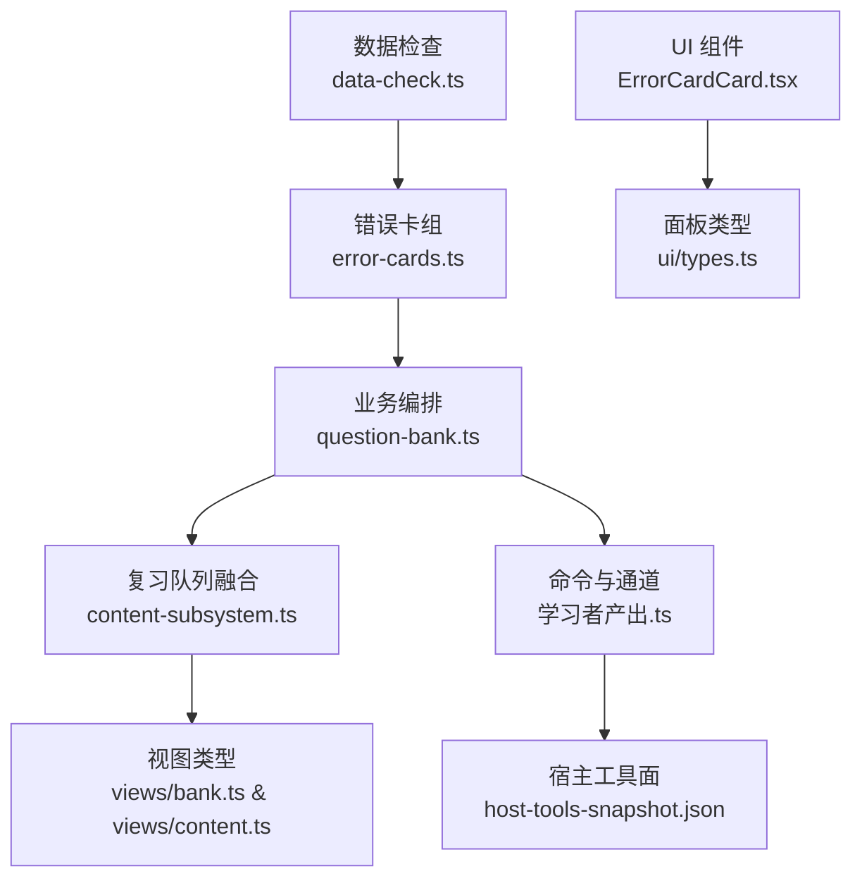
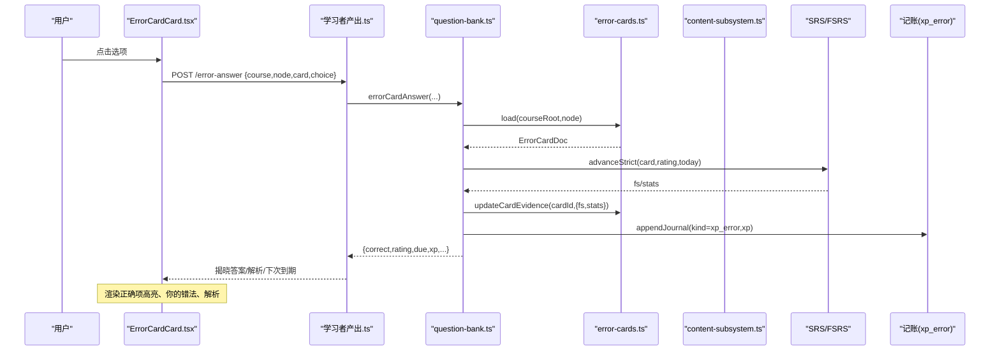
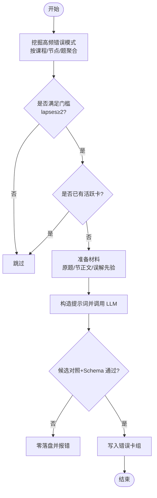
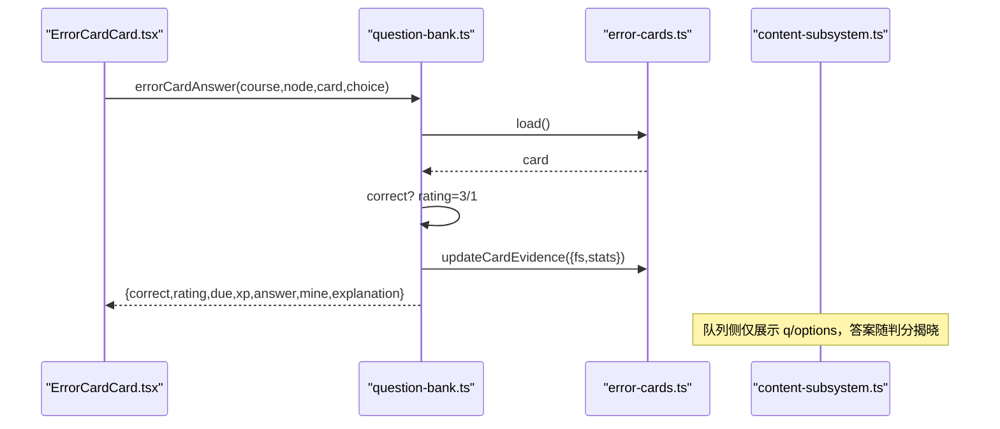
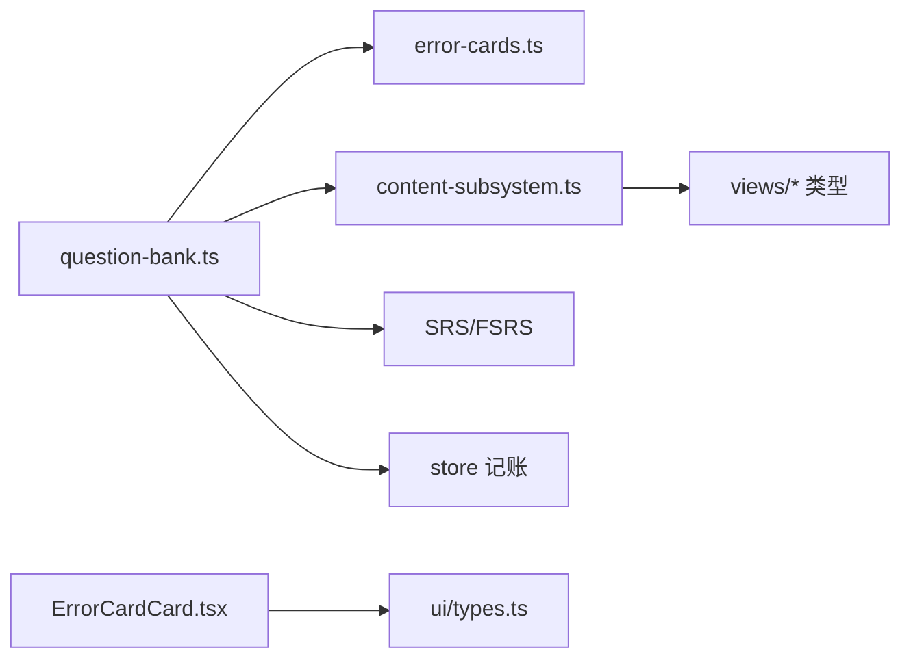

# 错题卡片

<cite>
**本文引用的文件**
- [error-cards.ts](file://src/engine/error-cards.ts)
- [question-bank.ts](file://src/engine/question-bank.ts)
- [content-subsystem.ts](file://src/engine/content-subsystem.ts)
- [bank.ts](file://src/engine/views/bank.ts)
- [content.ts](file://src/engine/views/content.ts)
- [学习者产出.ts](file://src/commands/学习者产出.ts)
- [ErrorCardCard.tsx](file://ui/src/components/ErrorCardCard.tsx)
- [types.ts](file://ui/src/types.ts)
- [data-check.ts](file://src/engine/data-check.ts)
- [error-cards.test.ts](file://tests/error-cards.test.ts)
</cite>

## 目录
1. [简介](#简介)
2. [项目结构](#项目结构)
3. [核心组件](#核心组件)
4. [架构总览](#架构总览)
5. [详细组件分析](#详细组件分析)
6. [依赖关系分析](#依赖关系分析)
7. [性能与可扩展性](#性能与可扩展性)
8. [故障排查指南](#故障排查指南)
9. [结论](#结论)
10. [附录：接口与数据模型](#附录接口与数据模型)

## 简介
本模块实现“错误对比卡”（C-3 #82）：从学习者的作答流水中挖掘高频错误模式，自动生成三选一辨别卡（正确做法、学习者错法、干扰项），进入独立错误卡组并参与统一复习队列。答题自动判分（选对=3、选错=1），一卡一天一次推进；结果仅影响该卡的 FSRS 调度与无绑定 XP 统计，不污染题库、节点 frontmatter 或常规复习日志。

## 项目结构
- 引擎层
  - 错误卡组定义、校验与持久化：src/engine/error-cards.ts
  - 生成、作答、清单、归档等业务流程：src/engine/question-bank.ts
  - 与复习队列的融合与呈现：src/engine/content-subsystem.ts
  - 视图类型与清单形状：src/engine/views/bank.ts, src/engine/views/content.ts
  - 命令注册与通道暴露：src/commands/学习者产出.ts
  - 数据健康检查：src/engine/data-check.ts
- 前端层
  - 错误对比卡 UI 组件：ui/src/components/ErrorCardCard.tsx
  - 面板类型重导出：ui/src/types.ts
- 测试
  - 端到端行为验证：tests/error-cards.test.ts



图表来源
- [error-cards.ts:1-353](file://src/engine/error-cards.ts#L1-L353)
- [question-bank.ts:582-754](file://src/engine/question-bank.ts#L582-L754)
- [content-subsystem.ts:584-620](file://src/engine/content-subsystem.ts#L584-L620)
- [bank.ts:154-197](file://src/engine/views/bank.ts#L154-L197)
- [content.ts:93-140](file://src/engine/views/content.ts#L93-L140)
- [学习者产出.ts:16-119](file://src/commands/学习者产出.ts#L16-L119)
- [ErrorCardCard.tsx:1-106](file://ui/src/components/ErrorCardCard.tsx#L1-L106)
- [types.ts:34-52](file://ui/src/types.ts#L34-L52)
- [data-check.ts:504-537](file://src/engine/data-check.ts#L504-L537)

章节来源
- [error-cards.ts:1-353](file://src/engine/error-cards.ts#L1-L353)
- [question-bank.ts:582-754](file://src/engine/question-bank.ts#L582-L754)
- [content-subsystem.ts:584-620](file://src/engine/content-subsystem.ts#L584-L620)
- [bank.ts:154-197](file://src/engine/views/bank.ts#L154-L197)
- [content.ts:93-140](file://src/engine/views/content.ts#L93-L140)
- [学习者产出.ts:16-119](file://src/commands/学习者产出.ts#L16-L119)
- [ErrorCardCard.tsx:1-106](file://ui/src/components/ErrorCardCard.tsx#L1-L106)
- [types.ts:34-52](file://ui/src/types.ts#L34-L52)
- [data-check.ts:504-537](file://src/engine/data-check.ts#L504-L537)

## 核心组件
- 错误卡组与存储
  - 数据结构：ErrorCard（含 id、kind、q、options、answer、mine、explanation、source_node/source_q/source_section、fsrs、stats）
  - 持久化：按课程根下“错误卡/<节点>.yaml”组织，支持加载、批量追加、证据更新、归档/恢复
  - Schema 门禁：严格校验选项数量、互异性、答案/错法合法性、长度限制、控制字符等
- 错误模式挖掘
  - 基于 practice 流水聚合：同一题实质答错≥2次即入围；lapses 计数全部实质答错次数，wrongs 去重且最近在前
  - 过滤条件：忽略忘记申报、空作答、无 qid 的记录
- 生成流程
  - 读取原题与节正文节选、误解先验，构造提示词调用 LLM 产出三选一卡
  - 候选对照门：(node, source_q) 必须来自系统候选集；schema 校验通过后落盘
  - 去重：同节点同来源题的活跃卡拒绝重复建卡
- 作答结算
  - 自动判分：选对 rating=3，选错 rating=1；一卡一天一次推进（stats.last 守卫）
  - 仅推进该卡自身 FSRS（默认参数，优化器不训练）；正确选择计入无绑定 XP（xp_error 行），错误选择记 0 XP 净行
  - 不写复习日志/practice/节点 frontmatter
- 复习队列融合
  - 以 source='error' 并入全局复习队列；队列卡面只带 q/options，答案/错法/解析在作答后揭晓
  - 到期排序：due 升序优先，未调度新卡在后
- 管理面
  - 全量清单 errorCardQueue：返回完整卡面（含 answer/mine/explanation），用于人工抽查
  - 归档/恢复：archived=true 时离开复习队列，但保留历史；归档后可重新挖出

章节来源
- [error-cards.ts:24-46](file://src/engine/error-cards.ts#L24-L46)
- [error-cards.ts:130-219](file://src/engine/error-cards.ts#L130-L219)
- [error-cards.ts:221-353](file://src/engine/error-cards.ts#L221-L353)
- [question-bank.ts:582-684](file://src/engine/question-bank.ts#L582-L684)
- [question-bank.ts:687-754](file://src/engine/question-bank.ts#L687-L754)
- [content-subsystem.ts:584-620](file://src/engine/content-subsystem.ts#L584-L620)
- [bank.ts:154-197](file://src/engine/views/bank.ts#L154-L197)
- [content.ts:93-140](file://src/engine/views/content.ts#L93-L140)

## 架构总览
错误对比卡贯穿“挖掘→生成→存储→队列→作答→统计”闭环，并与题库、图视图、SRS 调度、XP 记账解耦。



图表来源
- [ErrorCardCard.tsx:14-34](file://ui/src/components/ErrorCardCard.tsx#L14-L34)
- [学习者产出.ts:16-34](file://src/commands/学习者产出.ts#L16-L34)
- [question-bank.ts:687-720](file://src/engine/question-bank.ts#L687-L720)
- [error-cards.ts:316-337](file://src/engine/error-cards.ts#L316-L337)

## 详细组件分析

### 错误卡组与存储（error-cards.ts）
- 职责
  - 定义 ErrorCard/Doc、常量阈值（MIN_ERROR_LAPSES/MAX_WRONG_SAMPLES/ERROR_CARD_BATCH_MAX）
  - 提供 validateErrorCards 进行 schema 门禁
  - 提供 ErrorCards 类负责路径计算、读/写、批量追加、证据更新、归档/恢复
- 关键约束
  - 选项必须恰好 3 项且互不相同
  - answer 与 mine 必须是选项原文且不能相同
  - 题面/选项/解析有长度上限，禁止控制字符
  - 文件缺失为合法 Missing；存在但坏则抛 Broken
- 复杂度
  - 追加与证据更新均为 O(n) 列表扫描与校验，n 为单节点卡数（通常较小）

```mermaid
classDiagram
class ErrorCard {
+string id
+string kind
+string q
+string[] options
+string answer
+string mine
+string explanation
+string source_node
+string source_q
+string? source_section
+boolean? archived
+FsrsBlock? fsrs
+{attempts : number;correct : number;last? : string}? stats
}
class ErrorCards {
+cardPath(courseRoot,node) string
+load(courseRoot,node) Promise<ErrorCardDoc>
+addCards(courseRoot,node,cards) Promise<{ids,count}>
+updateCardEvidence(courseRoot,node,cardId,patch) Promise<void>
+archiveCard(courseRoot,node,cardId,archived) Promise<void>
}
ErrorCards --> ErrorCard : "读写/校验"
```

图表来源
- [error-cards.ts:24-46](file://src/engine/error-cards.ts#L24-L46)
- [error-cards.ts:130-219](file://src/engine/error-cards.ts#L130-L219)
- [error-cards.ts:221-353](file://src/engine/error-cards.ts#L221-L353)

章节来源
- [error-cards.ts:24-46](file://src/engine/error-cards.ts#L24-L46)
- [error-cards.ts:130-219](file://src/engine/error-cards.ts#L130-L219)
- [error-cards.ts:221-353](file://src/engine/error-cards.ts#L221-L353)

### 错误模式挖掘与生成（question-bank.ts）
- 挖掘
  - 遍历 practiceAll，按 course/node/qid 分组，筛选 isMinableWrong，统计 lapses 与 wrongs
  - 过滤已覆盖（已有活跃卡）的候选，限制批次上限（默认 5）
- 生成
  - 读取原题与节正文节选、误解先验，组装提示词调用 LLM（fast 档）
  - 模型输出需通过候选对照门与 schema 门禁，否则零落盘
  - 写入 per-node 错误卡组，返回生成的 ids
- 复杂度
  - 挖掘阶段 O(N) 遍历实践记录；生成阶段受 max 限制，LLM 调用次数与候选数线性相关



图表来源
- [question-bank.ts:582-684](file://src/engine/question-bank.ts#L582-L684)
- [error-cards.ts:78-115](file://src/engine/error-cards.ts#L78-L115)

章节来源
- [question-bank.ts:582-684](file://src/engine/question-bank.ts#L582-L684)
- [error-cards.ts:78-115](file://src/engine/error-cards.ts#L78-L115)

### 作答结算与复习队列融合（question-bank.ts, content-subsystem.ts）
- 作答
  - 校验 choice 属于选项之一；correct 判定后 rating=3/1
  - 使用 advanceStrict 保证一卡一天一次推进；写回 fsrs/stats
  - 记录 xp_error 行（正确得 XP，错误 0 XP）
- 队列融合
  - 以 source='error' 并入 reviewQueue；队列卡面仅携带 q/options，避免泄露答案
  - due 排序：到期卡在前，从未调度的新卡在后
- 难度与知识点
  - 难度取自 card.fsrs.difficulty（若为空则取中间值）
  - 关联知识点通过 source_node/source_q/source_section 软引用到原节/题



图表来源
- [question-bank.ts:687-720](file://src/engine/question-bank.ts#L687-L720)
- [content-subsystem.ts:584-620](file://src/engine/content-subsystem.ts#L584-L620)
- [ErrorCardCard.tsx:14-34](file://ui/src/components/ErrorCardCard.tsx#L14-L34)

章节来源
- [question-bank.ts:687-720](file://src/engine/question-bank.ts#L687-L720)
- [content-subsystem.ts:584-620](file://src/engine/content-subsystem.ts#L584-L620)

### 前端组件（ErrorCardCard.tsx）
- 交互
  - 三选一按钮，点击后调用 onAnswer，显示“你的错法”“正确做法”标签与解析
  - 状态：busy、picked、reveal；防止重复提交
- 视觉
  - 未揭晓：中性选项；揭晓后正确项绿色高亮，错法项橙色标注“你的错法”，其余半透明
  - 顶部标签：错误对比卡、课程/节点、来源小节、到期日、推进次数

章节来源
- [ErrorCardCard.tsx:1-106](file://ui/src/components/ErrorCardCard.tsx#L1-L106)
- [types.ts:34-52](file://ui/src/types.ts#L34-L52)

### 命令与工具面（学习者产出.ts, host-tools-snapshot.json）
- 暴露能力
  - error-card-mine：只读预览高频错误模式
  - error-card-generate：根据候选生成错误对比卡
  - error-card-queue：全量清单（含完整卡面）
  - error-card-answer：作答结算
  - error-card-archive：归档/恢复
- 通道
  - agent 同步工具与 panel 路由（GET/POST）

章节来源
- [学习者产出.ts:16-119](file://src/commands/学习者产出.ts#L16-L119)
- [host-tools-snapshot.json:1432-1568](file://tests/fixtures/host-tools-snapshot.json#L1432-L1568)

## 依赖关系分析
- 耦合点
  - question-bank.ts 依赖 error-cards.ts（存储）、content-subsystem.ts（队列融合）、SRS（调度）、store（记账）
  - content-subsystem.ts 将错误卡以 source='error' 注入复习队列，复用 sched(null) 隔离调度
  - 前端 ErrorCardCard.tsx 依赖 ui/types.ts 中的 ErrorCardFace 等类型
- 外部依赖
  - LLM 用于生成（fast 档）
  - YAML 序列化/反序列化
  - VaultFs 文件系统抽象



图表来源
- [question-bank.ts:582-754](file://src/engine/question-bank.ts#L582-L754)
- [content-subsystem.ts:584-620](file://src/engine/content-subsystem.ts#L584-L620)
- [bank.ts:154-197](file://src/engine/views/bank.ts#L154-L197)
- [content.ts:93-140](file://src/engine/views/content.ts#L93-L140)
- [ErrorCardCard.tsx:1-106](file://ui/src/components/ErrorCardCard.tsx#L1-L106)
- [types.ts:34-52](file://ui/src/types.ts#L34-L52)

章节来源
- [question-bank.ts:582-754](file://src/engine/question-bank.ts#L582-L754)
- [content-subsystem.ts:584-620](file://src/engine/content-subsystem.ts#L584-L620)
- [bank.ts:154-197](file://src/engine/views/bank.ts#L154-L197)
- [content.ts:93-140](file://src/engine/views/content.ts#L93-L140)
- [ErrorCardCard.tsx:1-106](file://ui/src/components/ErrorCardCard.tsx#L1-L106)
- [types.ts:34-52](file://ui/src/types.ts#L34-L52)

## 性能与可扩展性
- 性能特征
  - 挖掘阶段 O(N) 遍历实践记录，N 为实践流水规模；通过 minLapses 与 MAX_WRONG_SAMPLES 控制候选规模
  - 生成阶段受 ERROR_CARD_BATCH_MAX 限制，避免批量注水
  - 存储操作为小列表增改，开销低
- 可扩展性
  - 新增错误卡类型只需扩展 ERROR_CARD_KINDS 与校验逻辑
  - 可通过调整 MIN_ERROR_LAPSES、MAX_WRONG_SAMPLES、ERROR_CARD_BATCH_MAX 调节灵敏度与吞吐
  - 队列融合与作答结算与题库/我的卡解耦，便于横向扩展

[本节为通用指导，无需特定文件来源]

## 故障排查指南
- 常见错误
  - YAML 无法解析或 schema 校验失败：data-check 会报告 broken，定位到具体文件与错误原因
  - 生成失败：模型未产出可用卡清单或 (node,source_q) 不在候选集，零落盘并抛出明确错误
  - 重复建卡：同节点同来源题已有活跃卡，需先归档旧卡再重做
  - 同日重复作答：stats.last 守卫阻止同一天第二次推进
- 诊断步骤
  - 使用 error-card-mine 查看候选是否合理
  - 使用 error-card-queue 核对清单与到期情况
  - 检查错误卡组文件是否存在/损坏（data-check 扫描）
  - 确认 choice 是否为选项原文

章节来源
- [data-check.ts:504-537](file://src/engine/data-check.ts#L504-L537)
- [question-bank.ts:600-684](file://src/engine/question-bank.ts#L600-L684)
- [error-cards.ts:280-313](file://src/engine/error-cards.ts#L280-L313)
- [error-cards.test.ts:171-181](file://tests/error-cards.test.ts#L171-L181)
- [error-cards.test.ts:202-211](file://tests/error-cards.test.ts#L202-L211)

## 结论
错误对比卡以“高频错误模式→三选一辨别卡→自动判分→独立调度”的闭环，精准针对学习者真实错法进行强化复习。其设计强调安全与可审计：严格的 schema 门禁、候选对照门、一卡一天一次推进、零污染主库与日志。通过统一的复习队列与无绑定 XP 统计，既不影响既有学习路径，又能显著提升错法识别与纠正效率。

[本节为总结，无需特定文件来源]

## 附录：接口与数据模型
- 错误对比卡条目（管理面/队列共用形状）
  - 字段：course, node, id, q, options, answer, mine, explanation, source_q, source_section, due, attempts
- 错误对比卡复习队列卡面（队列侧）
  - 字段：course, node, id, q, options, source_q, source_section, due, attempts
- 错误模式候选（挖矿预览）
  - 字段：course, node, qid, lapses, wrongs, last_wrong
- 命令与工具面
  - learnhub_error_card_mine / generate / queue / answer / archive
  - 对应参数与描述见宿主工具快照

章节来源
- [bank.ts:154-197](file://src/engine/views/bank.ts#L154-L197)
- [content.ts:128-140](file://src/engine/views/content.ts#L128-L140)
- [学习者产出.ts:16-119](file://src/commands/学习者产出.ts#L16-L119)
- [host-tools-snapshot.json:1432-1568](file://tests/fixtures/host-tools-snapshot.json#L1432-L1568)