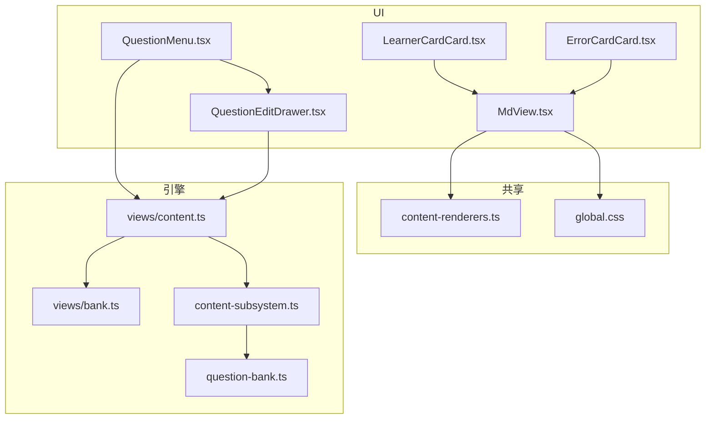
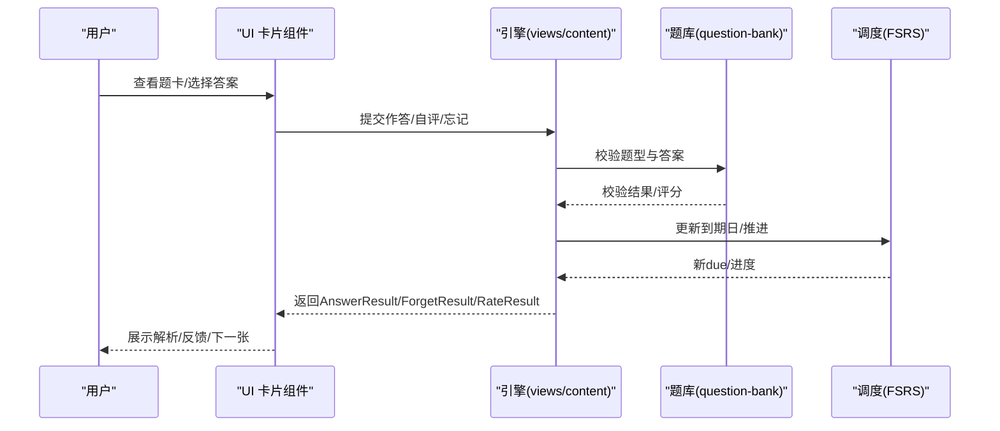
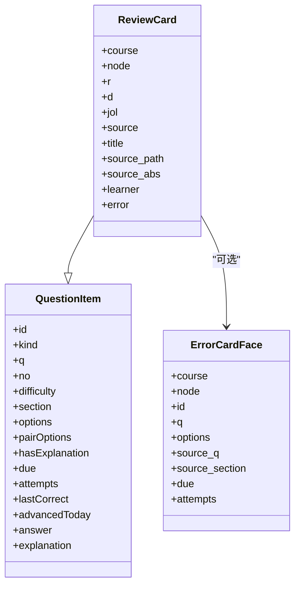
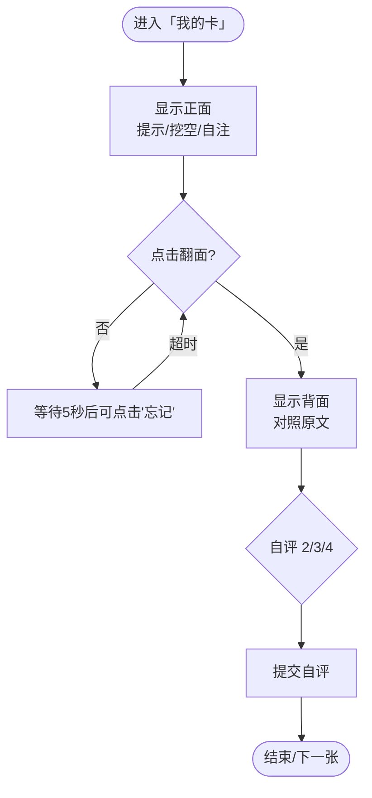
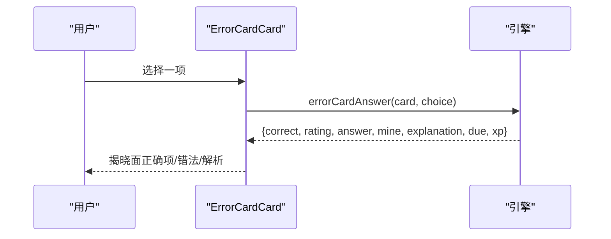
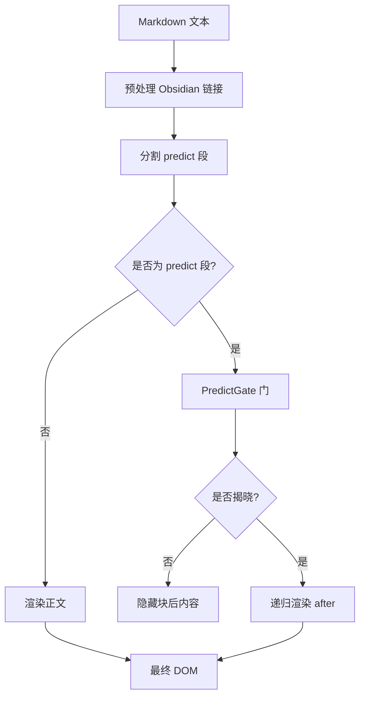
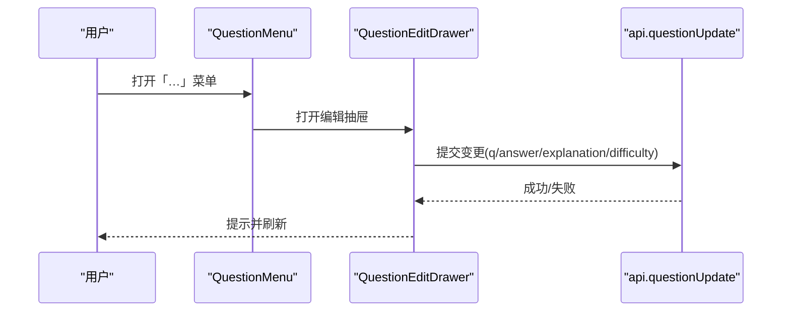
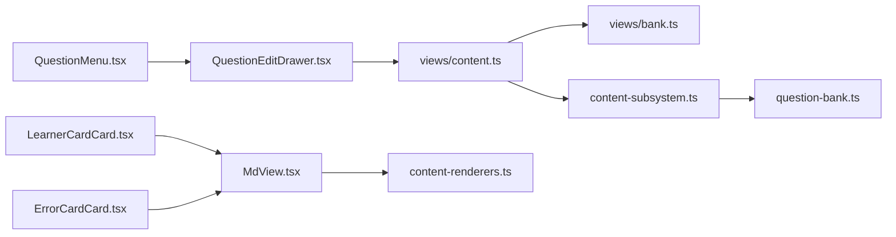

# 题目卡片

<cite>
**本文引用的文件**
- [LearnerCardCard.tsx](file://ui/src/components/LearnerCardCard.tsx)
- [ErrorCardCard.tsx](file://ui/src/components/ErrorCardCard.tsx)
- [MdView.tsx](file://ui/src/components/MdView.tsx)
- [content-renderers.ts](file://shared/content-renderers.ts)
- [global.css](file://ui/src/global.css)
- [views_content.ts](file://src/engine/views/content.ts)
- [views_bank.ts](file://src/engine/views/bank.ts)
- [question-bank.ts](file://src/engine/question-bank.ts)
- [content-subsystem.ts](file://src/engine/content-subsystem.ts)
- [QuestionMenu.tsx](file://ui/src/components/QuestionMenu.tsx)
- [QuestionEditDrawer.tsx](file://ui/src/components/QuestionEditDrawer.tsx)
- [types.ts](file://ui/src/types.ts)
</cite>

## 目录
1. [简介](#简介)
2. [项目结构](#项目结构)
3. [核心组件](#核心组件)
4. [架构总览](#架构总览)
5. [详细组件分析](#详细组件分析)
6. [依赖关系分析](#依赖关系分析)
7. [性能考量](#性能考量)
8. [故障排查指南](#故障排查指南)
9. [结论](#结论)
10. [附录](#附录)

## 简介
本文件面向“题目卡片”能力，系统性说明：
- 题目的展示格式、答案输入方式与答题交互流程
- 支持的题目类型、富文本渲染与多媒体内容显示
- 答题状态管理、即时反馈与错误提示机制
- 题目编辑、批量操作与导入导出接口
- 题目质量评估、难度标注与知识点关联

该能力由三类卡片协同构成：
- 题库题卡（常规判卷型）：来自复习队列或节点题库视图
- “我的卡”（自评型）：三段式主动回忆，无自动判分
- “错误对比卡”（三选一辨别）：自动判分并揭晓解析

## 项目结构
围绕题目卡片的关键代码分布在 UI 组件、共享渲染器与引擎视图/子系统之间：
- UI 层：三种卡片组件负责呈现与交互；Markdown 渲染统一走 MdView
- 共享层：content-renderers 定义可渲染的媒体/图表/交互块与预测门
- 引擎层：views 定义数据契约（题卡、队列、作答结果等），question-bank 校验题型与答案，content-subsystem 组装复习队列与视图

**图示来源**
- [LearnerCardCard.tsx:1-129](file://ui/src/components/LearnerCardCard.tsx#L1-L129)
- [ErrorCardCard.tsx:1-28](file://ui/src/components/ErrorCardCard.tsx#L1-L28)
- [MdView.tsx:1-103](file://ui/src/components/MdView.tsx#L1-L103)
- [content-renderers.ts:1-197](file://shared/content-renderers.ts#L1-L197)
- [global.css:169-192](file://ui/src/global.css#L169-L192)
- [views/content.ts:47-222](file://src/engine/views/content.ts#L47-L222)
- [views/bank.ts:1-229](file://src/engine/views/bank.ts#L1-L229)
- [question-bank.ts:140-211](file://src/engine/question-bank.ts#L140-L211)
- [content-subsystem.ts:458-650](file://src/engine/content-subsystem.ts#L458-L650)

**章节来源**
- [LearnerCardCard.tsx:1-129](file://ui/src/components/LearnerCardCard.tsx#L1-L129)
- [ErrorCardCard.tsx:1-28](file://ui/src/components/ErrorCardCard.tsx#L1-L28)
- [MdView.tsx:1-103](file://ui/src/components/MdView.tsx#L1-L103)
- [content-renderers.ts:1-197](file://shared/content-renderers.ts#L1-L197)
- [global.css:169-192](file://ui/src/global.css#L169-L192)
- [views/content.ts:47-222](file://src/engine/views/content.ts#L47-L222)
- [views/bank.ts:1-229](file://src/engine/views/bank.ts#L1-L229)
- [question-bank.ts:140-211](file://src/engine/question-bank.ts#L140-L211)
- [content-subsystem.ts:458-650](file://src/engine/content-subsystem.ts#L458-L650)

## 核心组件
- 题库题卡（ReviewCard/QuestionItem）：用于复习队列与节点题库，支持多种题型与 FSRS 调度
- “我的卡”（LearnerCardCard）：三段式主动回忆，翻面对照自评，带“忘记”门控
- “错误对比卡”（ErrorCardCard）：三选一辨别，自动判分并揭晓解析
- Markdown 渲染（MdView + content-renderers）：统一处理公式、Mermaid、SVG、图表、交互模拟与预测门
- 题目编辑与会话菜单（QuestionMenu + QuestionEditDrawer）：编辑、归档、提意见重生成、申诉

**章节来源**
- [views/content.ts:47-222](file://src/engine/views/content.ts#L47-L222)
- [views/bank.ts:1-229](file://src/engine/views/bank.ts#L1-L229)
- [LearnerCardCard.tsx:1-129](file://ui/src/components/LearnerCardCard.tsx#L1-L129)
- [ErrorCardCard.tsx:1-28](file://ui/src/components/ErrorCardCard.tsx#L1-L28)
- [MdView.tsx:1-103](file://ui/src/components/MdView.tsx#L1-L103)
- [content-renderers.ts:1-197](file://shared/content-renderers.ts#L1-L197)
- [QuestionMenu.tsx:1-163](file://ui/src/components/QuestionMenu.tsx#L1-L163)
- [QuestionEditDrawer.tsx:1-103](file://ui/src/components/QuestionEditDrawer.tsx#L1-L103)

## 架构总览
题目卡片的数据流从引擎视图到 UI 渲染，再到作答与结算：
- 引擎通过 views 暴露题卡、队列、作答结果等契约
- UI 使用 MdView 渲染题干/选项/解析，支持富文本与多媒体
- 作答后返回 AnswerResult/ForgetResult/RateResult，驱动 FSRS 调度与掌握度更新

**图示来源**
- [views/content.ts:163-222](file://src/engine/views/content.ts#L163-L222)
- [question-bank.ts:140-211](file://src/engine/question-bank.ts#L140-L211)
- [content-subsystem.ts:458-650](file://src/engine/content-subsystem.ts#L458-L650)

## 详细组件分析

### 题库题卡（ReviewCard / QuestionItem）
- 展示字段：课程、节点、题号、题干、选项、难度、FSRS 到期日、尝试次数、最近对错、是否已推进、答案/解析（按披露边界）
- 复习队列扩展：携带 r（回忆率）、d（会话内难度标量）、jol（JOL 抽查标记）、source/title/source_path/source_abs（笔记源/我的卡/错误卡）
- 错误对比卡面：仅 q/options 等泄露纪律子集，答案/错法/解析随判分揭晓

**图示来源**
- [views/content.ts:47-140](file://src/engine/views/content.ts#L47-L140)

**章节来源**
- [views/content.ts:47-140](file://src/engine/views/content.ts#L47-L140)

### “我的卡”（LearnerCardCard）
- 三段式复习：正面出题（提示重述/挖空重述/自注讲解）→ 心里重述 → 翻面对照自评
- 自评快捷键：背面时 2/3/4 对应 Hard/Good/Easy
- “忘记”门控：展示满 5 秒才可申报，防止以申报代替回忆
- 无自动判分：复习全程为自评语义，一卡一天一次推进

**图示来源**
- [LearnerCardCard.tsx:1-129](file://ui/src/components/LearnerCardCard.tsx#L1-L129)

**章节来源**
- [LearnerCardCard.tsx:1-129](file://ui/src/components/LearnerCardCard.tsx#L1-L129)

### “错误对比卡”（ErrorCardCard）
- 三选一辨别：正确做法、学习者错法、干扰项
- 自动判分：选对=3，选错=1；一卡一天一次；作答即推进
- 揭晓面：返回 answer/mine/explanation，高亮正确项、标注错法

**图示来源**
- [ErrorCardCard.tsx:1-28](file://ui/src/components/ErrorCardCard.tsx#L1-L28)
- [views/bank.ts:128-144](file://src/engine/views/bank.ts#L128-L144)

**章节来源**
- [ErrorCardCard.tsx:1-28](file://ui/src/components/ErrorCardCard.tsx#L1-L28)
- [views/bank.ts:128-144](file://src/engine/views/bank.ts#L128-L144)

### 富文本与多媒体渲染（MdView + content-renderers）
- 支持 Markdown + 数学公式（KaTeX）+ GFM
- 代码块语言注册表：Mermaid、数学公式、音视频、交互模拟、SVG、函数图像/坐标几何、数据图表
- 图片嵌入：Obsidian 语法 ![[path]] 预处理为面板路由 URL
- 预测门：learnhub-predict 围栏块，先预测再揭晓，非法降级源码显示
- 样式：公式与可视化块自适应滚动与限高

**图示来源**
- [MdView.tsx:1-103](file://ui/src/components/MdView.tsx#L1-L103)
- [content-renderers.ts:24-67](file://shared/content-renderers.ts#L24-L67)
- [content-renderers.ts:117-197](file://shared/content-renderers.ts#L117-L197)
- [global.css:169-192](file://ui/src/global.css#L169-L192)

**章节来源**
- [MdView.tsx:1-103](file://ui/src/components/MdView.tsx#L1-L103)
- [content-renderers.ts:24-67](file://shared/content-renderers.ts#L24-L67)
- [content-renderers.ts:117-197](file://shared/content-renderers.ts#L117-L197)
- [global.css:169-192](file://ui/src/global.css#L169-L192)

### 题目编辑、批量操作与导入导出
- 单题编辑：QuestionEditDrawer 提供题干/答案/解析/难度编辑，保存走 questionUpdate（白名单门禁）
- 会话内菜单：QuestionMenu 支持编辑、归档/恢复、提意见重生成（归档旧题 + 定向生成新题）、题目有误申诉
- 批量清理建议：TooEasyAdvice 基于调度证据给出“过于简单”归档建议
- 导入导出：AnkiImportResult/AnkiExportResult 类型表明存在 Anki 导入导出能力

**图示来源**
- [QuestionMenu.tsx:1-163](file://ui/src/components/QuestionMenu.tsx#L1-L163)
- [QuestionEditDrawer.tsx:1-103](file://ui/src/components/QuestionEditDrawer.tsx#L1-L103)
- [views/bank.ts:219-229](file://src/engine/views/bank.ts#L219-L229)
- [types.ts:66-67](file://ui/src/types.ts#L66-L67)

**章节来源**
- [QuestionMenu.tsx:1-163](file://ui/src/components/QuestionMenu.tsx#L1-L163)
- [QuestionEditDrawer.tsx:1-103](file://ui/src/components/QuestionEditDrawer.tsx#L1-L103)
- [views/bank.ts:219-229](file://src/engine/views/bank.ts#L219-L229)
- [types.ts:66-67](file://ui/src/types.ts#L66-L67)

### 题目类型支持与判分规则
- 支持题型：single_choice、true_false、fill_in_blank、multi_choice、numeric、ordering、matching、open_question、reflection
- 答案校验：
  - single_choice：需 options 且 answer 为合法选项字母
  - true_false：布尔或对/错/是/否等
  - fill_in_blank：字符串或字符串列表（可接受答案）
  - multi_choice：options≥2，answer 为合法选项字母数组
  - numeric：数值（支持小数/分数/百分数），tol 为正数
  - ordering/matching：顺序/配对校验
- 反射题：AI 按评分要点打分

**章节来源**
- [question-bank.ts:140-211](file://src/engine/question-bank.ts#L140-L211)

### 答题状态管理、即时反馈与错误提示
- 作答结果：AnswerResult 包含 correct/score/feedback/answer/kind/due/scheduled/pendingRating/previews/xp/explanation/mastery/xp_reason/diff/evidence_gated
- 忘记申报：QuestionForgetResult 标记 judge='forget'，不作答但按答错推进
- 自评推进：QuestionRateResult 返回 new due，用于复习刷卡流
- 错误对比卡：ErrorAnswerResult 自动判分并返回解析
- 即时反馈：UI 通过 Message.success/error 提示保存/归档/重生成等操作结果

**章节来源**
- [views/content.ts:163-222](file://src/engine/views/content.ts#L163-L222)
- [views/bank.ts:128-144](file://src/engine/views/bank.ts#L128-L144)
- [QuestionMenu.tsx:47-79](file://ui/src/components/QuestionMenu.tsx#L47-L79)

### 题目质量评估、难度标注与知识点关联
- 质量评估：TooEasyAdvice 基于调度证据（次数×零遗忘×间隔）建议归档；quality-rubrics 提供教学法兑现、难度档弧线等准则
- 难度标注：QuestionItem.difficulty 与 FSRS difficulty 共同形成会话内难度标量 d
- 知识点关联：QuestionItem.section 绑定节清单 id 或节标题，便于定位与定向生成

**章节来源**
- [views/bank.ts:219-229](file://src/engine/views/bank.ts#L219-L229)
- [content-subsystem.ts:629-650](file://src/engine/content-subsystem.ts#L629-L650)
- [views/content.ts:47-70](file://src/engine/views/content.ts#L47-L70)

## 依赖关系分析
- UI 组件依赖 MdView 进行富文本渲染，MdView 依赖 content-renderers 注册表
- 引擎视图 views 定义数据契约，question-bank 负责题型与答案校验
- content-subsystem 将题库题、我的卡、错误对比卡合并为复习队列，并计算 r/d 与 JOL 标记
- types.ts 集中 re-export 引擎读视图类型，避免手工镜像

**图示来源**
- [QuestionMenu.tsx:1-163](file://ui/src/components/QuestionMenu.tsx#L1-L163)
- [QuestionEditDrawer.tsx:1-103](file://ui/src/components/QuestionEditDrawer.tsx#L1-L103)
- [LearnerCardCard.tsx:1-129](file://ui/src/components/LearnerCardCard.tsx#L1-L129)
- [ErrorCardCard.tsx:1-28](file://ui/src/components/ErrorCardCard.tsx#L1-L28)
- [MdView.tsx:1-103](file://ui/src/components/MdView.tsx#L1-L103)
- [content-renderers.ts:1-197](file://shared/content-renderers.ts#L1-L197)
- [views/content.ts:47-222](file://src/engine/views/content.ts#L47-L222)
- [views/bank.ts:1-229](file://src/engine/views/bank.ts#L1-L229)
- [content-subsystem.ts:458-650](file://src/engine/content-subsystem.ts#L458-L650)
- [question-bank.ts:140-211](file://src/engine/question-bank.ts#L140-L211)

**章节来源**
- [QuestionMenu.tsx:1-163](file://ui/src/components/QuestionMenu.tsx#L1-L163)
- [QuestionEditDrawer.tsx:1-103](file://ui/src/components/QuestionEditDrawer.tsx#L1-L103)
- [LearnerCardCard.tsx:1-129](file://ui/src/components/LearnerCardCard.tsx#L1-L129)
- [ErrorCardCard.tsx:1-28](file://ui/src/components/ErrorCardCard.tsx#L1-L28)
- [MdView.tsx:1-103](file://ui/src/components/MdView.tsx#L1-L103)
- [content-renderers.ts:1-197](file://shared/content-renderers.ts#L1-L197)
- [views/content.ts:47-222](file://src/engine/views/content.ts#L47-L222)
- [views/bank.ts:1-229](file://src/engine/views/bank.ts#L1-L229)
- [content-subsystem.ts:458-650](file://src/engine/content-subsystem.ts#L458-L650)
- [question-bank.ts:140-211](file://src/engine/question-bank.ts#L140-L211)

## 性能考量
- 富文本渲染：MdView 使用 useMemo 缓存预处理与分段，减少重复计算
- 可视化块：CSS 限制 SVG/图表最大高度与溢出滚动，避免长图影响布局
- 队列构建：content-subsystem 在构建复习队列时计算 r/d 并过滤过期题，减少无效渲染
- 交互门控：“我的卡”忘记按钮有 5 秒倒计时，降低误操作与频繁请求

[本节为通用指导，不直接分析具体文件]

## 故障排查指南
- 题型校验失败：检查 kind 与 answer 是否符合 question-bank 校验规则（如 single_choice 需选项字母、numeric 需数值等）
- 渲染异常：确认代码块 lang 是否在 content-renderers 注册表中；未注册则降级源码显示
- 预测门报错：learnhub-predict 块必须包含 q/options/answer，且 options 为 2–4 项互异数组，answer 必须在选项中
- 编辑保存失败：确认 questionUpdate 白名单门禁；答案留空表示不修改
- 归档/重生成：注意新题从零调度，不继承旧题 FSRS 状态；归档后可在工作台恢复

**章节来源**
- [question-bank.ts:140-211](file://src/engine/question-bank.ts#L140-L211)
- [content-renderers.ts:117-197](file://shared/content-renderers.ts#L117-L197)
- [MdView.tsx:1-103](file://ui/src/components/MdView.tsx#L1-L103)
- [QuestionEditDrawer.tsx:43-65](file://ui/src/components/QuestionEditDrawer.tsx#L43-L65)
- [QuestionMenu.tsx:60-79](file://ui/src/components/QuestionMenu.tsx#L60-L79)

## 结论
题目卡片体系通过三类卡片覆盖不同学习场景：常规判卷、主动回忆与错误对比。借助统一的富文本渲染与严格的题型校验，系统实现了稳定的展示与交互体验；结合 FSRS 调度与掌握度模型，提供科学的复习节奏。编辑与批量管理能力保障了题库质量与可维护性。

[本节为总结性内容，不直接分析具体文件]

## 附录
- 关键数据契约路径：
  - 题卡/队列/作答结果：[views/content.ts:47-222](file://src/engine/views/content.ts#L47-L222)
  - 题库条目/错误卡/申诉结果：[views/bank.ts:1-229](file://src/engine/views/bank.ts#L1-L229)
  - 题型校验：[question-bank.ts:140-211](file://src/engine/question-bank.ts#L140-L211)
  - 渲染器清单与预测门：[content-renderers.ts:24-67](file://shared/content-renderers.ts#L24-L67), [content-renderers.ts:117-197](file://shared/content-renderers.ts#L117-L197)
  - 卡片组件：[LearnerCardCard.tsx:1-129](file://ui/src/components/LearnerCardCard.tsx#L1-L129), [ErrorCardCard.tsx:1-28](file://ui/src/components/ErrorCardCard.tsx#L1-L28)
  - 编辑与会话菜单：[QuestionEditDrawer.tsx:1-103](file://ui/src/components/QuestionEditDrawer.tsx#L1-L103), [QuestionMenu.tsx:1-163](file://ui/src/components/QuestionMenu.tsx#L1-L163)