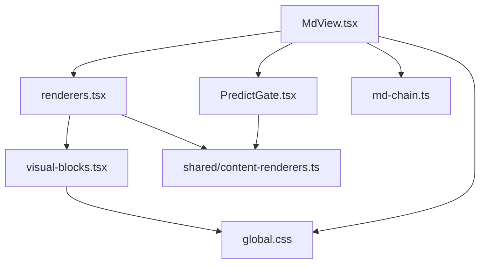
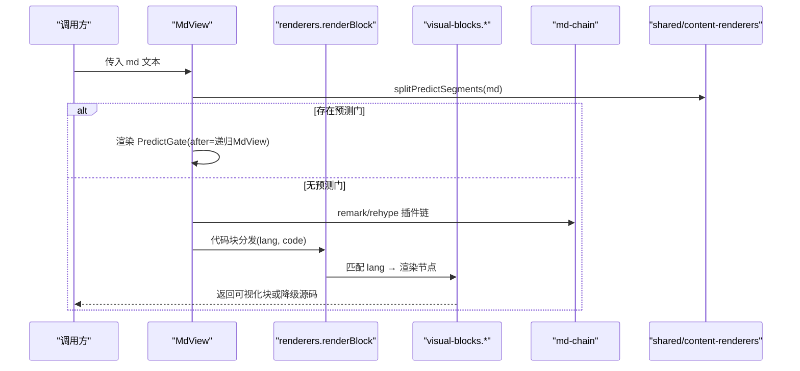
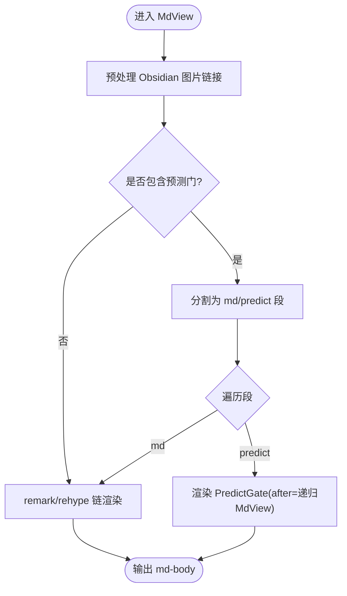
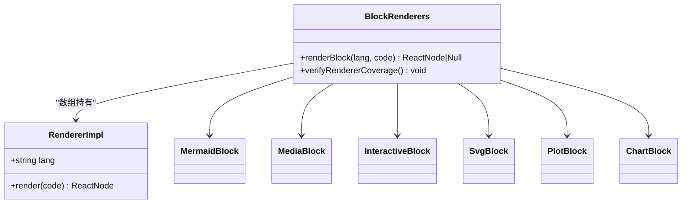
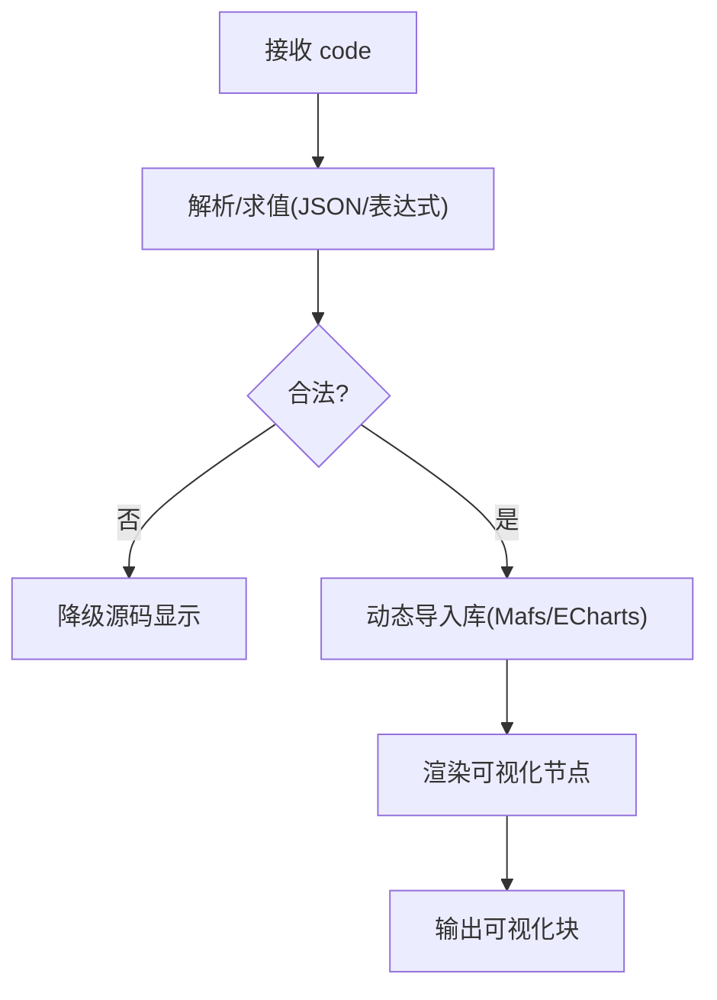
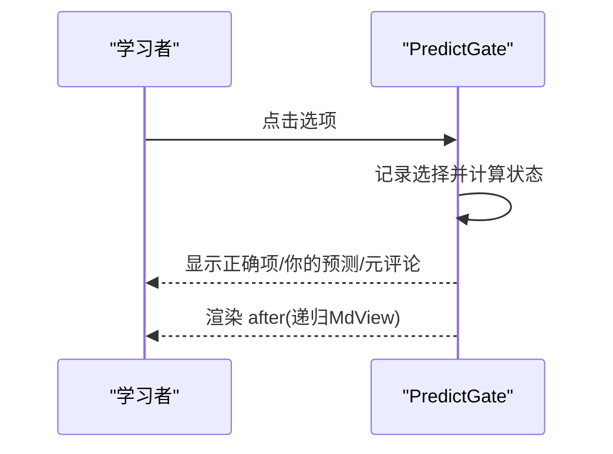
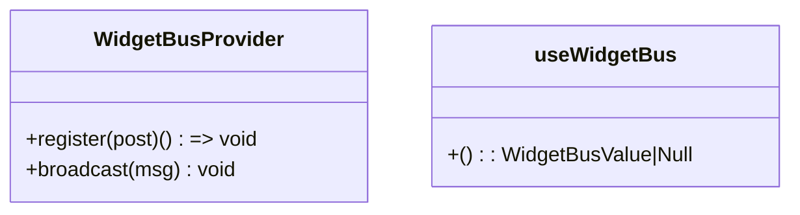
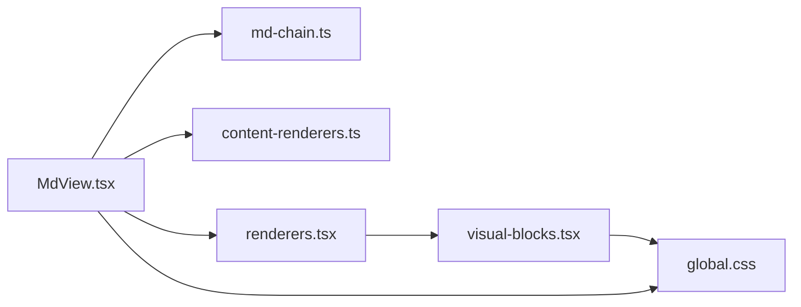

# 基础组件

<cite>
**本文引用的文件**
- [MdView.tsx](file://ui/src/components/MdView.tsx)
- [renderers.tsx](file://ui/src/components/renderers.tsx)
- [visual-blocks.tsx](file://ui/src/components/visual-blocks.tsx)
- [PredictGate.tsx](file://ui/src/components/PredictGate.tsx)
- [widget-bus.tsx](file://ui/src/components/widget-bus.tsx)
- [md-chain.ts](file://ui/src/lib/md-chain.ts)
- [content-renderers.ts](file://shared/content-renderers.ts)
- [global.css](file://ui/src/global.css)
</cite>

## 目录
1. [简介](#简介)
2. [项目结构](#项目结构)
3. [核心组件](#核心组件)
4. [架构总览](#架构总览)
5. [详细组件分析](#详细组件分析)
6. [依赖关系分析](#依赖关系分析)
7. [性能与可维护性](#性能与可维护性)
8. [故障排查指南](#故障排查指南)
9. [结论](#结论)
10. [附录：API 参考与最佳实践](#附录api-参考与最佳实践)

## 简介
本文件面向“基础 UI 组件”的复用与扩展，覆盖三类能力：
- Markdown 渲染器：支持 GFM、数学公式、代码块分发、Obsidian 图片嵌入、预测门阅读流。
- 可视化块组件：Mermaid 图、SVG 示意图、函数图像/坐标几何（plot）、数据图表（chart）、音视频媒体、交互模拟沙箱。
- 通用展示组件：行内 Markdown、预测门、消息总线等。

文档将说明各组件的 API、属性配置、样式定制方法、组合模式与扩展机制，并提供使用示例与最佳实践，同时涵盖响应式设计与无障碍访问要点。

## 项目结构
UI 层围绕“Markdown 渲染 + 代码块注册表 + 可视化块实现”组织：
- MdView：Markdown 入口，负责预处理、段落拆分、预测门分界、代码块分发。
- renderers：代码块语言到 React 节点的注册表（mermaid/media/interactive/svg/plot/chart）。
- visual-blocks：具体可视化块的实现（SvgBlock、PlotBlock、ChartBlock），含安全清洗、动态加载、降级策略。
- PredictGate：预测门交互组件，控制“先预测再揭晓”的阅读流。
- widget-bus：AI 老师广播通道，用于向交互件发送动作。
- md-chain：Markdown 解析链配置（remark/rehype 插件与 HTML 策略）。
- shared/content-renderers：渲染器清单与预测门解析逻辑（引擎与 UI 共享事实源）。
- global.css：语义化样式类与内容排版规则。



图示来源
- [MdView.tsx:1-103](file://ui/src/components/MdView.tsx#L1-L103)
- [renderers.tsx:1-166](file://ui/src/components/renderers.tsx#L1-L166)
- [visual-blocks.tsx:1-296](file://ui/src/components/visual-blocks.tsx#L1-L296)
- [PredictGate.tsx:1-69](file://ui/src/components/PredictGate.tsx#L1-L69)
- [md-chain.ts:1-17](file://ui/src/lib/md-chain.ts#L1-L17)
- [content-renderers.ts:1-197](file://shared/content-renderers.ts#L1-L197)
- [global.css:138-176](file://ui/src/global.css#L138-L176)

章节来源
- [MdView.tsx:1-103](file://ui/src/components/MdView.tsx#L1-L103)
- [renderers.tsx:1-166](file://ui/src/components/renderers.tsx#L1-L166)
- [visual-blocks.tsx:1-296](file://ui/src/components/visual-blocks.tsx#L1-L296)
- [PredictGate.tsx:1-69](file://ui/src/components/PredictGate.tsx#L1-L69)
- [md-chain.ts:1-17](file://ui/src/lib/md-chain.ts#L1-L17)
- [content-renderers.ts:1-197](file://shared/content-renderers.ts#L1-L197)
- [global.css:138-176](file://ui/src/global.css#L138-L176)

## 核心组件
- Markdown 渲染器（MdView）
  - 职责：预处理 Obsidian 图片、按预测门切分正文、调用注册表渲染代码块、提供行内变体 InlineMd。
  - 关键特性：GFM、数学公式、跳过裸 HTML、预测门阅读流、未注册语言降级源码显示。
- 代码块渲染器注册表（renderers）
  - 职责：按 ```lang 分发到对应渲染器；构建期校验 UI 实现与共享清单一致。
  - 已支持：mermaid、media、interactive、svg、plot、chart。
- 可视化块（visual-blocks）
  - 职责：实现 svg/plot/chart 的安全渲染与降级；按需动态导入第三方库；主题跟随与自适应尺寸。
- 预测门（PredictGate）
  - 职责：呈现“先预测再揭晓”的交互；选择后揭示答案与元评论，并放行后续内容。
- 消息总线（widget-bus）
  - 职责：为交互件提供 AI 老师广播通道（highlight/setState/reveal/annotate）。

章节来源
- [MdView.tsx:1-103](file://ui/src/components/MdView.tsx#L1-L103)
- [renderers.tsx:1-166](file://ui/src/components/renderers.tsx#L1-L166)
- [visual-blocks.tsx:1-296](file://ui/src/components/visual-blocks.tsx#L1-L296)
- [PredictGate.tsx:1-69](file://ui/src/components/PredictGate.tsx#L1-L69)
- [widget-bus.tsx:1-50](file://ui/src/components/widget-bus.tsx#L1-L50)

## 架构总览
Markdown 渲染管线与可视化块的分发流程如下：



图示来源
- [MdView.tsx:46-85](file://ui/src/components/MdView.tsx#L46-L85)
- [renderers.tsx:151-155](file://ui/src/components/renderers.tsx#L151-L155)
- [visual-blocks.tsx:23-37](file://ui/src/components/visual-blocks.tsx#L23-L37)
- [md-chain.ts:9-17](file://ui/src/lib/md-chain.ts#L9-L17)
- [content-renderers.ts:179-196](file://shared/content-renderers.ts#L179-L196)

## 详细组件分析

### Markdown 渲染器（MdView）
- 输入输出
  - 输入：md 字符串、可选 className。
  - 输出：渲染后的 Markdown 内容（含公式、表格、任务列表、代码块、图片、预测门）。
- 处理流程
  - 预处理 Obsidian 嵌入语法为面板文件路由 URL。
  - 按预测门围栏切分为 md/predict 段序列。
  - 无预测门时直接走 remark-math + rehype-katex 链。
  - 代码块通过 renderBlock 分发；未注册语言降级源码。
  - 行内变体 InlineMd 将段落降为 span，保持行内布局。
- 错误与降级
  - 非法预测门块降级为源码显示，避免页面崩溃。
  - skipHtml 丢弃机器注释等裸 HTML 节点。
- 样式
  - 外层容器类名 md-body，标题/段落/表格/图片等排版由全局样式统一控制。



图示来源
- [MdView.tsx:37-85](file://ui/src/components/MdView.tsx#L37-L85)
- [md-chain.ts:9-17](file://ui/src/lib/md-chain.ts#L9-L17)
- [content-renderers.ts:179-196](file://shared/content-renderers.ts#L179-L196)

章节来源
- [MdView.tsx:1-103](file://ui/src/components/MdView.tsx#L1-L103)
- [md-chain.ts:1-17](file://ui/src/lib/md-chain.ts#L1-L17)
- [content-renderers.ts:117-196](file://shared/content-renderers.ts#L117-L196)

### 代码块渲染器注册表（renderers）
- 职责
  - 维护 BLOCK_RENDERERS 表，按 lang 查找并渲染。
  - verifyRendererCoverage 在启动时校验 shared 清单中的渲染器均有 UI 实现。
- 已实现
  - mermaid：动态导入 mermaid，主题跟随 arco-theme，失败降级源码。
  - media：按扩展名渲染 video/audio，路径经 /learnhub/api/file 路由。
  - interactive：sandbox iframe 加载交互件，postMessage 协议上报完成与标注。
  - svg：DOMPurify 白名单清洗后内联渲染。
  - plot：JSON spec → Mafs 坐标系渲染（函数/参数曲线/点/向量/线段/圆/多边形/标签）。
  - chart：ECharts option 解析守卫（series 白名单、禁外部 URL），按需注册渲染器。
- 扩展方式
  - 新增格式需在 shared/content-renderers.ts 的 RENDERERS 加一项，并在 renderers 中实现对应渲染器。



图示来源
- [renderers.tsx:135-166](file://ui/src/components/renderers.tsx#L135-L166)
- [content-renderers.ts:24-67](file://shared/content-renderers.ts#L24-L67)

章节来源
- [renderers.tsx:1-166](file://ui/src/components/renderers.tsx#L1-L166)
- [content-renderers.ts:1-67](file://shared/content-renderers.ts#L1-L67)

### 可视化块组件（visual-blocks）
- SVG 示意图
  - 使用 DOMPurify 白名单清洗，仅允许 svg/profile 与受控 URI 正则。
  - 失败或无效则降级为源码 pre/code。
- 函数图像/坐标几何（plot）
  - JSON spec 求值（mathjs/number），生成闭包列表。
  - 动态导入 Mafs，按元素类型渲染坐标系与图形。
  - 默认坐标范围与网格类型可配置。
- 数据图表（chart）
  - 解析 ECharts option，限制 series 类型为 line/bar/pie/scatter，禁止外部 URL。
  - 动态导入 echarts/core/charts/components，ResizeObserver 自适应尺寸，主题跟随。
- 通用降级
  - 所有可视化块在解析失败、动态加载失败或渲染异常时，均回退到源码显示，保证学习者可见原文。



图示来源
- [visual-blocks.tsx:23-37](file://ui/src/components/visual-blocks.tsx#L23-L37)
- [visual-blocks.tsx:144-232](file://ui/src/components/visual-blocks.tsx#L144-L232)
- [visual-blocks.tsx:256-295](file://ui/src/components/visual-blocks.tsx#L256-L295)

章节来源
- [visual-blocks.tsx:1-296](file://ui/src/components/visual-blocks.tsx#L1-L296)

### 预测门（PredictGate）
- 交互流程
  - 展示问题与选项，用户选择后揭示正确答案与元评论。
  - 选择前隐藏块后正文，选择后递归渲染 MdView 以继续阅读。
- 状态与样式
  - 使用 Tag、Button、Typography 等 Arco 组件。
  - 根据状态（idle/answer/picked/dim）切换背景与边框色。
- 无障碍
  - 按钮具备可点击语义；颜色对比度遵循主题变量。



图示来源
- [PredictGate.tsx:14-68](file://ui/src/components/PredictGate.tsx#L14-L68)
- [MdView.tsx:71-84](file://ui/src/components/MdView.tsx#L71-L84)

章节来源
- [PredictGate.tsx:1-69](file://ui/src/components/PredictGate.tsx#L1-L69)
- [MdView.tsx:60-84](file://ui/src/components/MdView.tsx#L60-L84)

### 消息总线（widget-bus）
- 作用
  - 为交互件提供 AI 老师广播通道，支持 highlight/setState/reveal/annotate。
  - Provider 挂在 LessonView；无 Provider 时 useWidgetBus 返回 null，交互件仍可渲染。
- 接口
  - register(post): 注册发送器，返回注销函数。
  - broadcast(msg): 向全部交互件广播消息。



图示来源
- [widget-bus.tsx:32-49](file://ui/src/components/widget-bus.tsx#L32-L49)

章节来源
- [widget-bus.tsx:1-50](file://ui/src/components/widget-bus.tsx#L1-L50)

## 依赖关系分析
- MdView 依赖 md-chain（remark/rehype 插件与 HTML 策略）与 shared/content-renderers（预测门解析与分段）。
- renderers 依赖 shared/content-renderers（RENDERERS 清单）与 visual-blocks（可视化块实现）。
- visual-blocks 依赖 dompurify、mathjs、Mafs、ECharts，采用动态 import 降低首屏体积。
- PredictGate 依赖 Arco Design 组件与 shared 预测门数据结构。
- 样式由 global.css 统一提供语义类与内容排版规则。



图示来源
- [MdView.tsx:10-21](file://ui/src/components/MdView.tsx#L10-L21)
- [renderers.tsx:12-15](file://ui/src/components/renderers.tsx#L12-L15)
- [visual-blocks.tsx:8-13](file://ui/src/components/visual-blocks.tsx#L8-L13)
- [global.css:138-176](file://ui/src/global.css#L138-L176)

章节来源
- [MdView.tsx:1-103](file://ui/src/components/MdView.tsx#L1-L103)
- [renderers.tsx:1-166](file://ui/src/components/renderers.tsx#L1-L166)
- [visual-blocks.tsx:1-296](file://ui/src/components/visual-blocks.tsx#L1-L296)
- [global.css:138-176](file://ui/src/global.css#L138-L176)

## 性能与可维护性
- 首屏优化
  - 可视化块（Mafs、ECharts、Mermaid）均采用动态 import，仅在需要时加载，减少首屏 bundle。
- 降级策略
  - 解析失败、动态加载失败、渲染异常均回退到源码显示，确保内容可读性与稳定性。
- 构建期校验
  - verifyRendererCoverage 保证 UI 实现与共享清单一致，防止遗漏导致运行时缺失。
- 样式治理
  - 语义类集中管理，静态样式不内联，便于主题与一致性维护。
- 可扩展性
  - 新增渲染器只需两处改动：shared 清单与 UI 注册表，自动同步至提示词与质检门。

[本节为通用指导，无需特定文件引用]

## 故障排查指南
- Markdown 渲染异常
  - 检查 md-chain 插件链是否正确注入；确认 skipHtml 策略符合预期。
  - 若出现裸 HTML 文本，确认是否被 skipHtml 丢弃而非转义显示。
- 预测门失效
  - 确认 learnhub-predict 围栏块格式正确；非法块会降级源码显示。
  - 检查 splitPredictSegments 是否能正确切分 md/predict 段。
- 可视化块不显示
  - 检查 JSON spec 是否合法（plot/chart）；非法将被拒绝并降级源码。
  - 动态导入失败时会设置 failed 标志并降级源码。
- 交互件无反馈
  - 确认 postMessage 协议是否正确（LEARNHUB_COMPLETE、SHOW_ANNOTATION）。
  - 检查 SettleContext 与 widget-bus 是否可用（无 Provider 时仅广播不可用）。

章节来源
- [MdView.tsx:60-85](file://ui/src/components/MdView.tsx#L60-L85)
- [content-renderers.ts:149-196](file://shared/content-renderers.ts#L149-L196)
- [visual-blocks.tsx:144-232](file://ui/src/components/visual-blocks.tsx#L144-L232)
- [visual-blocks.tsx:256-295](file://ui/src/components/visual-blocks.tsx#L256-L295)
- [renderers.tsx:71-133](file://ui/src/components/renderers.tsx#L71-L133)

## 结论
本基础组件体系以 Markdown 渲染为核心，结合代码块注册表与可视化块实现，提供了稳定、可扩展、可降级的内容呈现能力。通过共享清单与构建期校验，保证了 UI 与引擎的一致性；通过语义化样式与动态加载，兼顾了可维护性与性能。预测门与消息总线进一步增强了学习体验与交互能力。

[本节为总结，无需特定文件引用]

## 附录：API 参考与最佳实践

### Markdown 渲染器（MdView）
- 属性
  - md: string — Markdown 文本。
  - className?: string — 外层容器类名。
- 行为
  - 支持 GFM、数学公式、代码块分发、预测门阅读流。
  - 行内变体 InlineMd 将段落降为 span，适合题干/选项/判卷反馈。
- 最佳实践
  - 使用 MdView 承载长文，InlineMd 用于短文本。
  - 代码块尽量使用共享清单中的 lang，以获得更好的渲染与质检。

章节来源
- [MdView.tsx:23-103](file://ui/src/components/MdView.tsx#L23-L103)

### 代码块渲染器（renderers）
- 接口
  - renderBlock(lang, code): ReactNode | null — 按 lang 渲染，未注册返回 null。
  - verifyRendererCoverage(): void — 构建期校验 UI 实现与共享清单一致。
- 已支持 lang
  - mermaid、media、interactive、svg、plot、chart。
- 最佳实践
  - 新增格式需同步更新 shared/content-renderers.ts 与 UI 注册表。
  - 对复杂可视化块优先使用 JSON spec（plot/chart），避免手写像素。

章节来源
- [renderers.tsx:135-166](file://ui/src/components/renderers.tsx#L135-L166)
- [content-renderers.ts:24-67](file://shared/content-renderers.ts#L24-L67)

### 可视化块（visual-blocks）
- 组件
  - SvgBlock(code): 安全清洗后内联 SVG。
  - PlotBlock(code): JSON spec → Mafs 坐标系渲染。
  - ChartBlock(code): ECharts option 解析守卫后渲染。
- 最佳实践
  - 确保 JSON spec 合法；非法将被拒绝并降级源码。
  - 利用 ResizeObserver 自适应尺寸；主题跟随 arco-theme。

章节来源
- [visual-blocks.tsx:23-37](file://ui/src/components/visual-blocks.tsx#L23-L37)
- [visual-blocks.tsx:144-232](file://ui/src/components/visual-blocks.tsx#L144-L232)
- [visual-blocks.tsx:256-295](file://ui/src/components/visual-blocks.tsx#L256-L295)

### 预测门（PredictGate）
- 属性
  - parsed: PredictBlock — 预测门结构化数据。
  - after: ReactNode — 门后正文（选择后渲染）。
- 最佳实践
  - 使用 learnhub-predict 围栏块生成结构化数据；非法块会降级源码。
  - 在专家思维轨迹节中使用，提升学习者参与度。

章节来源
- [PredictGate.tsx:14-68](file://ui/src/components/PredictGate.tsx#L14-L68)
- [content-renderers.ts:117-196](file://shared/content-renderers.ts#L117-L196)

### 消息总线（widget-bus）
- 接口
  - register(post): 注册发送器，返回注销函数。
  - broadcast(msg): 广播 AI 老师动作。
- 最佳实践
  - 在 LessonView 中提供 WidgetBusProvider 以启用广播。
  - 交互件监听 LEARNHUB_TEACHER 动作以实现高亮/状态更新/标注。

章节来源
- [widget-bus.tsx:12-49](file://ui/src/components/widget-bus.tsx#L12-L49)

### 样式与响应式
- 语义类
  - 使用 .lh-* 系列工具类进行布局、间距、尺寸控制。
  - 内容排版（标题、段落、表格、图片）由 .md-body 及其子规则控制。
- 响应式
  - 图表与可视化块支持横向滚动与自适应高度；媒体块按扩展名选择播放器。
- 无障碍
  - 按钮与标签使用 Arco 组件，具备基本可访问性；颜色与对比度遵循主题变量。

章节来源
- [global.css:138-176](file://ui/src/global.css#L138-L176)
- [global.css:196-398](file://ui/src/global.css#L196-L398)