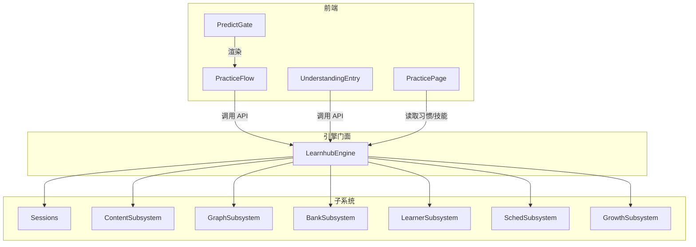
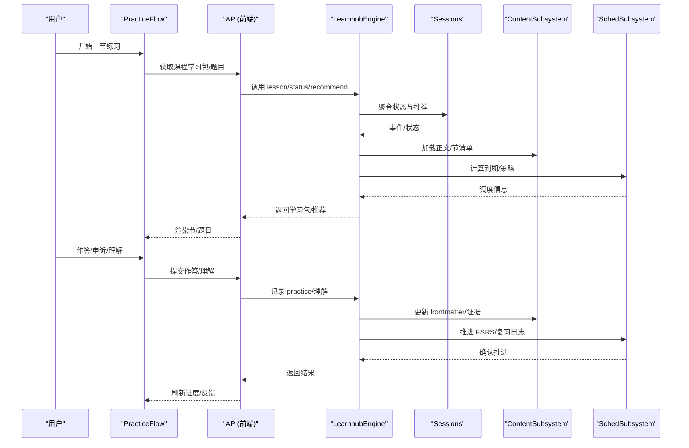
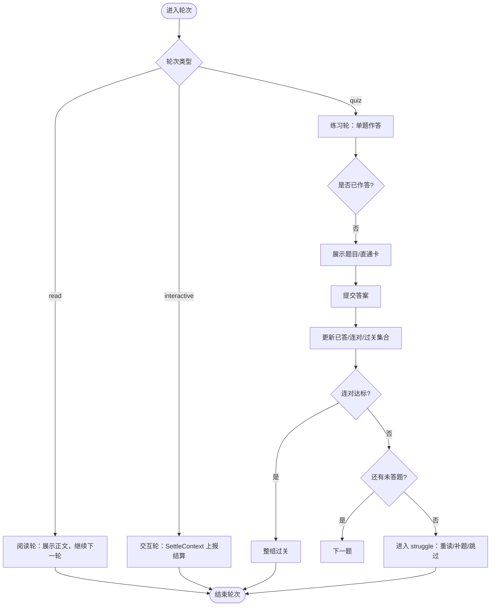
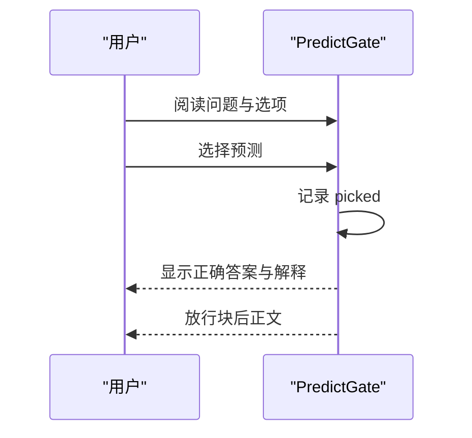
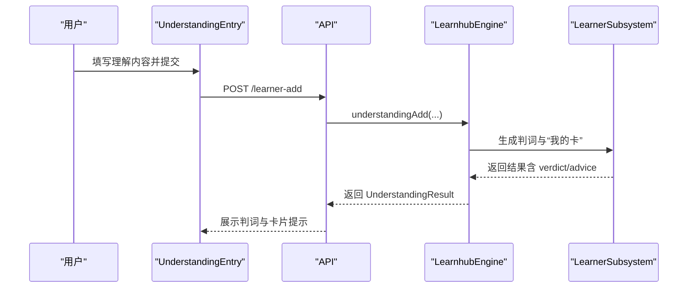
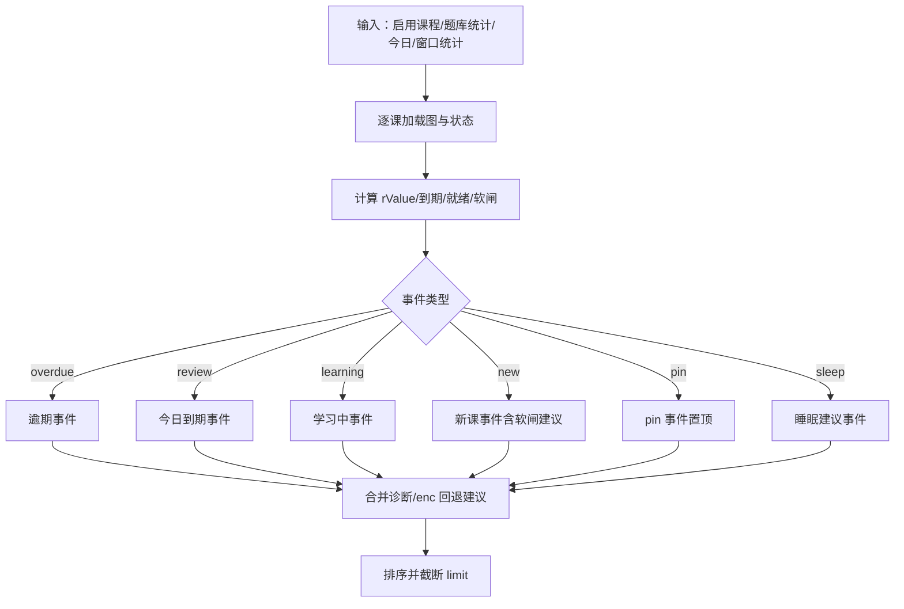
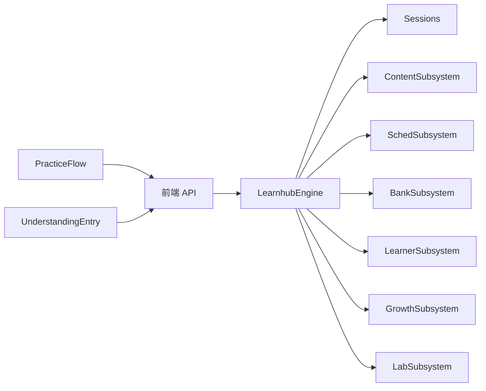

# 学习流程组件

<cite>
**本文引用的文件**
- [src/engine/index.ts](file://src/engine/index.ts)
- [src/engine/sessions.ts](file://src/engine/sessions.ts)
- [src/engine/types.ts](file://src/engine/types.ts)
- [ui/src/components/PracticeFlow.tsx](file://ui/src/components/PracticeFlow.tsx)
- [ui/src/components/PredictGate.tsx](file://ui/src/components/PredictGate.tsx)
- [ui/src/components/UnderstandingEntry.tsx](file://ui/src/components/UnderstandingEntry.tsx)
- [ui/src/pages/PracticePage.tsx](file://ui/src/pages/PracticePage.tsx)
- [ui/src/api.ts](file://ui/src/api.ts)
</cite>

## 目录
1. [简介](#简介)
2. [项目结构](#项目结构)
3. [核心组件](#核心组件)
4. [架构总览](#架构总览)
5. [详细组件分析](#详细组件分析)
6. [依赖关系分析](#依赖关系分析)
7. [性能与可扩展性](#性能与可扩展性)
8. [故障排查指南](#故障排查指南)
9. [结论](#结论)
10. [附录：配置与个性化](#附录配置与个性化)

## 简介
本文件面向“学习流程组件”的完整文档，覆盖练习流程、复习会话、预测门控与理解入口等关键能力。重点说明：
- 学习状态管理（节点阶段、题目 FSRS、事件推荐）
- 进度跟踪（节清单、连对目标、回看与重定位）
- 反馈机制（判卷、申诉冲正、AI 补题、理解反馈）
- 与学习引擎的数据交互与事件处理（门面、子系统、视图聚合）
- 学习体验优化与个性化（软闸建议、睡眠耦合、pin 今日学它）
- 学习数据分析与多设备同步方案（基于 vault 文件的追加流水与只读视图）

## 项目结构
学习流程由前端 UI 组件与后端引擎协作完成：
- 前端
  - PracticeFlow：节驱动练习流（阅读/练习/交互轮），维护会话内状态（已答、连对、过关、申诉作废）
  - PredictGate：正文中的“先预测再揭晓”门，零记分、零写入
  - UnderstandingEntry：节级“加我的理解”，提交后 AI 对照要点给出是非与定位，并生成“我的卡”
  - PracticePage：无界实践区（习惯与技能条目 lane），与题目调度并行
- 后端
  - LearnhubEngine：统一门面，装配各子系统（Sessions、Content、Sched、Growth、Lab、Bank 等）
  - Sessions：学习状态与推荐事件生产（status/recommend/lesson），聚合题库到期、struggle、睡眠建议等
  - types：共享类型（Stage、Fm、PracticeRec、ReviewRec 等）

图表来源
- [src/engine/index.ts:149-398](file://src/engine/index.ts#L149-L398)
- [src/engine/sessions.ts:293-357](file://src/engine/sessions.ts#L293-L357)
- [ui/src/components/PracticeFlow.tsx:58-112](file://ui/src/components/PracticeFlow.tsx#L58-L112)
- [ui/src/components/PredictGate.tsx:14-68](file://ui/src/components/PredictGate.tsx#L14-L68)
- [ui/src/components/UnderstandingEntry.tsx:26-56](file://ui/src/components/UnderstandingEntry.tsx#L26-L56)
- [ui/src/pages/PracticePage.tsx:38-54](file://ui/src/pages/PracticePage.tsx#L38-L54)

章节来源
- [src/engine/index.ts:149-398](file://src/engine/index.ts#L149-L398)
- [src/engine/sessions.ts:293-357](file://src/engine/sessions.ts#L293-L357)
- [ui/src/components/PracticeFlow.tsx:58-112](file://ui/src/components/PracticeFlow.tsx#L58-L112)
- [ui/src/components/PredictGate.tsx:14-68](file://ui/src/components/PredictGate.tsx#L14-L68)
- [ui/src/components/UnderstandingEntry.tsx:26-56](file://ui/src/components/UnderstandingEntry.tsx#L26-L56)
- [ui/src/pages/PracticePage.tsx:38-54](file://ui/src/pages/PracticePage.tsx#L38-L54)

## 核心组件
- 练习流程（PracticeFlow）
  - 按节清单构建轮次（read/quiz/interactive），维护会话内作答记录、连对、过关集合、最大到达轮次
  - 直通卡（advancedToday）中性推进；申诉作废题退出预算且不影响连对
  - struggle 时触发 AI 定向补题（入队即返回，新题刷新并入）
- 预测门控（PredictGate）
  - 正文中“先预测再揭晓”的机器块，选择后才显示答案与解释，不记分、不写数据
- 理解入口（UnderstandingEntry）
  - 节级“加我的理解”，保存后 AI 对照该节要点给出是非、定位与建议，结果存入“我的卡”（独立自调度，不计 XP 与掌握度）
- 学习会话与推荐（Sessions）
  - 聚合课程状态、题库到期、struggle、睡眠建议、pin 置顶等，输出 recommend/status/lesson
- 引擎门面（LearnhubEngine）
  - 装配各子系统，提供 statusJson/recommend/lesson 等聚合接口；保证数据主权（vault 笔记 frontmatter 为事实源）

章节来源
- [ui/src/components/PracticeFlow.tsx:58-112](file://ui/src/components/PracticeFlow.tsx#L58-L112)
- [ui/src/components/PredictGate.tsx:14-68](file://ui/src/components/PredictGate.tsx#L14-L68)
- [ui/src/components/UnderstandingEntry.tsx:26-56](file://ui/src/components/UnderstandingEntry.tsx#L26-L56)
- [src/engine/sessions.ts:293-357](file://src/engine/sessions.ts#L293-L357)
- [src/engine/index.ts:149-398](file://src/engine/index.ts#L149-L398)

## 架构总览
学习流程通过“UI 组件 → 引擎门面 → 子系统”的分层协作实现：
- UI 负责学习体验与交互（节步进、连对、申诉、理解输入）
- 引擎门面统一装配与约束访问，避免绕过 engine 直写数据
- 子系统专注各自领域（Sessions 推荐与状态、Content 内容管线、Sched 调度、Bank 题库、Learner 学习者产出、Growth 教练与闸门、Lab 实验台）

图表来源
- [src/engine/index.ts:410-569](file://src/engine/index.ts#L410-L569)
- [src/engine/sessions.ts:318-572](file://src/engine/sessions.ts#L318-L572)
- [ui/src/components/PracticeFlow.tsx:192-222](file://ui/src/components/PracticeFlow.tsx#L192-L222)
- [ui/src/components/UnderstandingEntry.tsx:39-56](file://ui/src/components/UnderstandingEntry.tsx#L39-L56)

## 详细组件分析

### 练习流程（PracticeFlow）
- 节驱动轮次：read/quiz/interactive 三类轮，按 manifest 或标题切分
- 会话内状态：已答题集合、连对计数、过关集合、最大到达轮次、申诉作废集合
- 直通卡：advancedToday 仅标记已看，中性推进
- 连对目标：随组内可作答题量收缩，达标则整组过关
- struggle：提示重读本节/AI 再出题/跳过；定向补题任务化，完成后自动并入
- 申诉冲正：改判对恢复连对；作废/豁免中性处理，归档旧题并重出同类题

图表来源
- [ui/src/components/PracticeFlow.tsx:79-112](file://ui/src/components/PracticeFlow.tsx#L79-L112)
- [ui/src/components/PracticeFlow.tsx:167-222](file://ui/src/components/PracticeFlow.tsx#L167-L222)
- [ui/src/components/PracticeFlow.tsx:237-297](file://ui/src/components/PracticeFlow.tsx#L237-L297)

章节来源
- [ui/src/components/PracticeFlow.tsx:58-112](file://ui/src/components/PracticeFlow.tsx#L58-L112)
- [ui/src/components/PracticeFlow.tsx:167-222](file://ui/src/components/PracticeFlow.tsx#L167-L222)
- [ui/src/components/PracticeFlow.tsx:237-297](file://ui/src/components/PracticeFlow.tsx#L237-L297)

### 预测门控（PredictGate）
- 正文中 learnhub-predict 机器块渲染为“先预测再揭晓”
- 学习者凭直觉选一个做法，选后才揭示正确项与元评论
- 零记分、零写入，与 JOL 抽查无关；门未过不渲染块后正文

图表来源
- [ui/src/components/PredictGate.tsx:14-68](file://ui/src/components/PredictGate.tsx#L14-L68)

章节来源
- [ui/src/components/PredictGate.tsx:14-68](file://ui/src/components/PredictGate.tsx#L14-L68)

### 理解入口（UnderstandingEntry）
- 节级入口：写一句自己的解释/例子/助记
- 保存后 AI 对照该节要点给是非 + 定位（含糊/跳跃/说错）+ 可怎么补
- 结果存为“我的卡”（独立域自调度，零 XP、不进掌握度）
- 同节可多次写（引擎侧去重）

图表来源
- [ui/src/components/UnderstandingEntry.tsx:39-56](file://ui/src/components/UnderstandingEntry.tsx#L39-L56)
- [ui/src/api.ts:134-136](file://ui/src/api.ts#L134-L136)
- [src/engine/index.ts:275-293](file://src/engine/index.ts#L275-L293)

章节来源
- [ui/src/components/UnderstandingEntry.tsx:26-56](file://ui/src/components/UnderstandingEntry.tsx#L26-L56)
- [ui/src/api.ts:134-136](file://ui/src/api.ts#L134-L136)
- [src/engine/index.ts:275-293](file://src/engine/index.ts#L275-L293)

### 学习会话与推荐（Sessions）
- 状态聚合：课程 counts、due_today、overdue、ready/gated、blocked 软闸建议
- 动态推荐：复习/逾期/学习中/新课/pin/睡眠建议，按 score 排序
- struggle 判定：近期窗口正确率阈值与作答量下限，低数据静默
- enc 回退建议：struggle 节点按 w×(1−R) 降序推荐成分技能
- pin 置顶：当日有效，课程内榜首，附执行意图（只读侧展示）

图表来源
- [src/engine/sessions.ts:318-572](file://src/engine/sessions.ts#L318-L572)

章节来源
- [src/engine/sessions.ts:318-572](file://src/engine/sessions.ts#L318-L572)

### 引擎门面（LearnhubEngine）
- 装配子系统：Sessions、Content、Graph、Bank、Learner、Sched、Growth、Lab
- 数据主权：课程笔记 frontmatter 为调度状态唯一事实源；data/*.yaml 为图结构事实源
- 学习日与截止：统一入口，所有调度/结算使用同一口径
- 推荐/状态：statusJson/recommend 聚合各子系统产出

章节来源
- [src/engine/index.ts:149-398](file://src/engine/index.ts#L149-L398)
- [src/engine/index.ts:400-569](file://src/engine/index.ts#L400-L569)

## 依赖关系分析
- 组件耦合
  - PracticeFlow 依赖题型规则与轮次构建（buildRounds），并通过 API 与引擎交互
  - PredictGate 仅消费 content-renderers 的 PredictBlock，零副作用
  - UnderstandingEntry 通过 api.understandingAdd 调用引擎，结果就地展示
  - Sessions 依赖 Graph、FSRS、题库统计、睡眠建议、pin 等模块
- 外部依赖
  - VaultFs 抽象存储端口，engine 侧一切读写经此通道
  - Clock/Rng 注入，保证确定性与时空一致性
- 潜在循环
  - 门面集中装配，子系统间通过回调注入，避免直接环引用

图表来源
- [src/engine/index.ts:242-398](file://src/engine/index.ts#L242-L398)
- [ui/src/api.ts:124-138](file://ui/src/api.ts#L124-L138)

章节来源
- [src/engine/index.ts:242-398](file://src/engine/index.ts#L242-L398)
- [ui/src/api.ts:124-138](file://ui/src/api.ts#L124-L138)

## 性能与可扩展性
- 缓存与惰性
  - 引擎缓存每课程的 FSRS 调度器实例，减少重复构造开销
  - 推荐事件按需聚合，limit 控制输出规模
- 增量与幂等
  - 练习轮会话内去重（已答题集合），避免重复计分
  - 理解入口引擎侧去重，同节多次写安全
- 扩展点
  - 子系统通过回调注入（如 sched/loadView/learningDay），便于替换实现
  - 推荐事件可叠加新信号（如睡眠建议、诊断建议）而不破坏既有流程

[本节为通用指导，无需特定文件来源]

## 故障排查指南
- 笔记 Broken
  - 状态聚合前会 fail loud，列出损坏路径与原因，需修复后再查看学习汇总
- 节点不在图内
  - 课程学习包/讨论包会校验节点存在性，不存在则抛错
- 生成任务注册表损坏
  - loadGenJobs 对缺失/非 JSON/非数组分别处理：缺失视为空，其他抛错并指引修复
- 练习轮卡顿
  - struggle 分支提供重读本节/AI 再出题/跳过；检查 quizPending 与题目集变化是否导致重定位

章节来源
- [src/engine/sessions.ts:36-40](file://src/engine/sessions.ts#L36-L40)
- [src/engine/index.ts:419-448](file://src/engine/index.ts#L419-L448)
- [src/engine/index.ts:724-753](file://src/engine/index.ts#L724-L753)
- [ui/src/components/PracticeFlow.tsx:380-419](file://ui/src/components/PracticeFlow.tsx#L380-L419)

## 结论
学习流程组件以“节驱动练习流 + 预测门控 + 理解入口 + 会话推荐”为核心，结合引擎门面与各子系统，实现了：
- 清晰的学习状态管理与进度跟踪
- 即时反馈与申诉冲正机制
- 与学习引擎的解耦交互与事件处理
- 可配置的个性化体验（软闸建议、睡眠耦合、pin 置顶）
- 基于 vault 的追加流水与只读视图，天然支持多设备同步

[本节为总结，无需特定文件来源]

## 附录：配置与个性化
- 软闸建议（R-gate）
  - 被 R-gate 拦下的候选节点附带前置衰减清单与直达复习入口，文案引导先复习到期题再继续
- 睡眠耦合建议（D-4）
  - 重巩固型节点在推荐中附加“睡前练、醒后验”时段建议，全局可关
- “今天学它”pin（E3）
  - 当日有效，课程内置顶，附执行意图（只读侧展示），未就绪仍保留照开自由
- 理解入口（E1）
  - 三种模式：提示重述、挖空重述、自注讲解；判词入档案，不计 XP 与掌握度

章节来源
- [src/engine/sessions.ts:454-542](file://src/engine/sessions.ts#L454-L542)
- [ui/src/components/UnderstandingEntry.tsx:14-18](file://ui/src/components/UnderstandingEntry.tsx#L14-L18)
- [ui/src/components/UnderstandingEntry.tsx:97-113](file://ui/src/components/UnderstandingEntry.tsx#L97-L113)