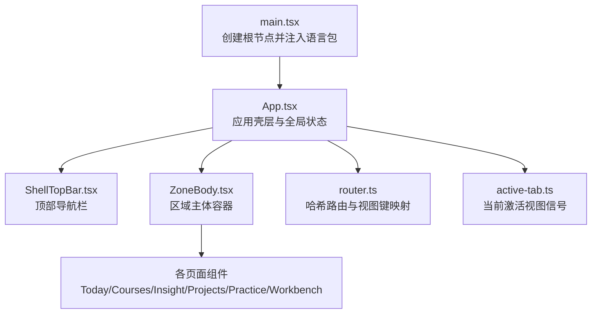
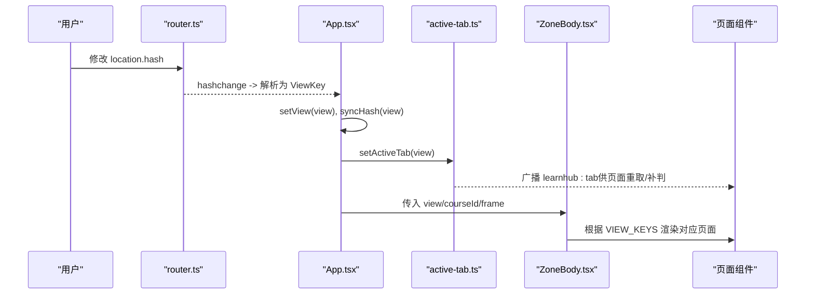
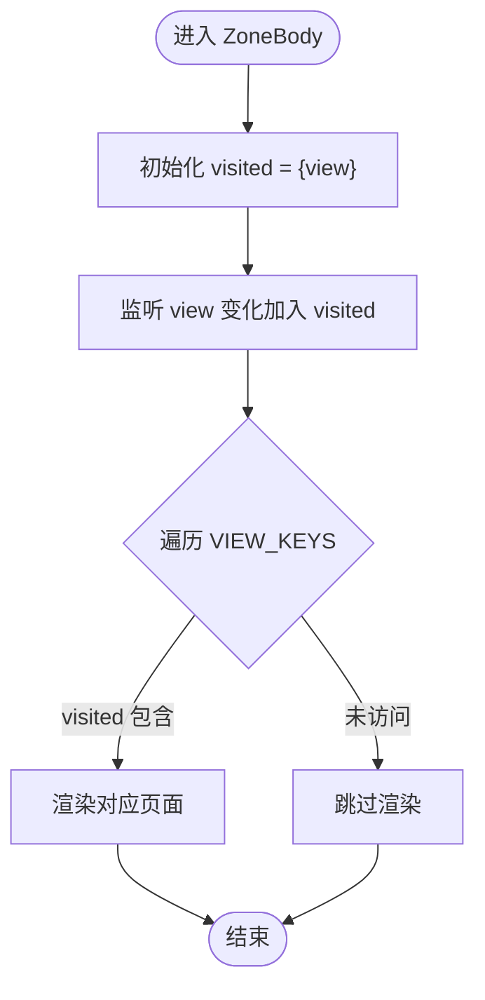
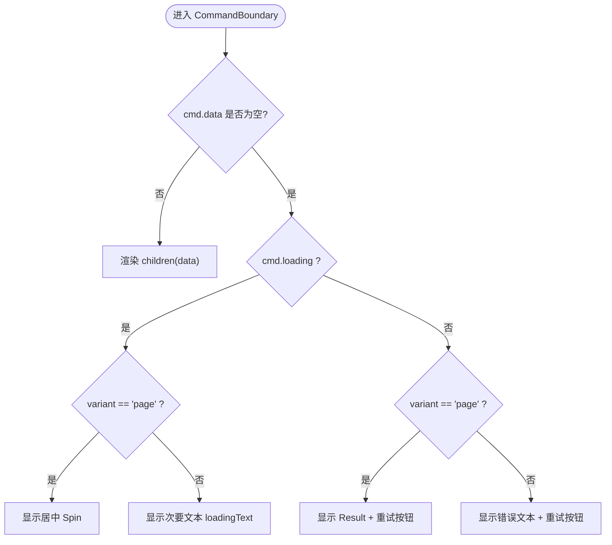
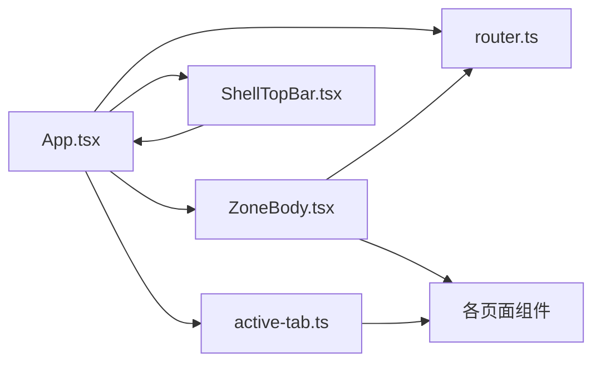

# 布局组件

<cite>
**本文引用的文件**
- [App.tsx](file://ui/src/App.tsx)
- [ZoneBody.tsx](file://ui/src/components/ZoneBody.tsx)
- [CommandBoundary.tsx](file://ui/src/components/CommandBoundary.tsx)
- [ShellTopBar.tsx](file://ui/src/components/ShellTopBar.tsx)
- [router.ts](file://ui/src/lib/router.ts)
- [active-tab.ts](file://ui/src/active-tab.ts)
- [main.tsx](file://ui/src/main.tsx)
- [global.css](file://ui/src/global.css)
</cite>

## 目录
1. [简介](#简介)
2. [项目结构](#项目结构)
3. [核心组件](#核心组件)
4. [架构总览](#架构总览)
5. [详细组件分析](#详细组件分析)
6. [依赖关系分析](#依赖关系分析)
7. [性能考量](#性能考量)
8. [故障排查指南](#故障排查指南)
9. [结论](#结论)
10. [附录](#附录)

## 简介
本章节面向应用级布局体系，围绕“区域主体容器”“顶部导航栏”“命令边界组件”三大构件，系统阐述其职责、组织方式、响应式适配与状态管理策略，并说明组件间通信机制与数据传递方式。同时给出布局定制方法与主题扩展方案，覆盖移动端适配与屏幕尺寸处理策略，帮助读者在保持统一体验的前提下进行二次开发与主题化改造。

## 项目结构
应用以 React 为渲染框架，入口通过配置提供者注入全局语言环境，随后挂载 App 壳层。App 负责：
- 初始化路由视图与课程树等全局状态
- 维护主题（明/暗）与帮助抽屉
- 组装顶部导航栏 ShellTopBar 与内容区 ZoneBody
- 将 AppFrame 作为上下文能力向下透传

图表来源
- [main.tsx:1-16](file://ui/src/main.tsx#L1-L16)
- [App.tsx:47-179](file://ui/src/App.tsx#L47-L179)
- [router.ts:1-164](file://ui/src/lib/router.ts#L1-L164)
- [active-tab.ts:1-38](file://ui/src/active-tab.ts#L1-L38)

章节来源
- [main.tsx:1-16](file://ui/src/main.tsx#L1-L16)
- [App.tsx:47-179](file://ui/src/App.tsx#L47-L179)

## 核心组件
- 区域主体容器 ZoneBody：基于“视图保活”的常驻容器，仅首次访问后保留 DOM，非激活视图隐藏；按视图键映射到具体页面，避免重复挂载与轮询风暴。
- 顶部导航栏 ShellTopBar：五区页签 + 课程区子导航 + 右侧控制区（主题切换、帮助），驱动区/子路由跳转。
- 命令边界 CommandBoundary：统一承载加载/失败/内容三态，屏蔽业务侧重复实现，支持卡片与整页两种变体。

章节来源
- [ZoneBody.tsx:1-43](file://ui/src/components/ZoneBody.tsx#L1-L43)
- [ShellTopBar.tsx:1-200](file://ui/src/components/ShellTopBar.tsx#L1-L200)
- [CommandBoundary.tsx:1-46](file://ui/src/components/CommandBoundary.tsx#L1-L46)

## 架构总览
布局由“壳层 App”统筹，路由与视图键是导航权威，激活视图信号用于控制后台轮询与页面重取。整体数据流如下：

图表来源
- [router.ts:106-163](file://ui/src/lib/router.ts#L106-L163)
- [App.tsx:102-117](file://ui/src/App.tsx#L102-L117)
- [active-tab.ts:15-37](file://ui/src/active-tab.ts#L15-L37)
- [ZoneBody.tsx:21-42](file://ui/src/components/ZoneBody.tsx#L21-L42)

## 详细组件分析

### 区域主体容器 ZoneBody
- 职责：维护已访问视图集合，渲染可见视图；非激活视图隐藏但保留 DOM，实现“首访后常驻、非激活隐藏”。
- 视图映射：依据 VIEW_KEYS 过滤已访问视图，按视图键分支渲染 Today/Courses/Generate/Proposals/Workbench/Insight/Projects/Practice。
- 与路由联动：接收 view 与 courseId，配合 App 的 onRouteChange 与 navigateCourse 完成参数段工作台深链直达。
- 与轮询联动：隐藏视图的后台轮询由 active-tab 的 isActiveTab 门控跳过，避免无效请求。

图表来源
- [ZoneBody.tsx:21-42](file://ui/src/components/ZoneBody.tsx#L21-L42)
- [router.ts:49-58](file://ui/src/lib/router.ts#L49-L58)

章节来源
- [ZoneBody.tsx:1-43](file://ui/src/components/ZoneBody.tsx#L1-L43)
- [router.ts:49-58](file://ui/src/lib/router.ts#L49-L58)

### 顶部导航栏 ShellTopBar
- 职责：展示五区页签与课程区子导航，提供主题切换与帮助入口；驱动 goZone/goCourseSub 等跳转。
- 与 App 协作：接收 zone 与 courseSub，调用 App 提供的回调更新视图与 URL；App 同步写回 hash 保证前进/后退一致。
- 响应式：顶栏采用 flex 换行布局，第二行子导航占满一行，便于小屏折叠与触控操作。

章节来源
- [ShellTopBar.tsx:1-200](file://ui/src/components/ShellTopBar.tsx#L1-L200)
- [App.tsx:160-166](file://ui/src/App.tsx#L160-L166)
- [global.css:20-61](file://ui/src/global.css#L20-L61)

### 命令边界 CommandBoundary
- 职责：统一呈现加载/失败/内容三态；已有数据时直接渲染内容，错误保留在 cmd.error，由调用方决定是否轻提示。
- 变体：card 用于轻量内联提示；page 用于首载失败的整页 Result。
- 重试：默认使用 cmd.reload，也可通过 onRetry 自定义。

图表来源
- [CommandBoundary.tsx:10-45](file://ui/src/components/CommandBoundary.tsx#L10-L45)

章节来源
- [CommandBoundary.tsx:1-46](file://ui/src/components/CommandBoundary.tsx#L1-L46)

### 路由与视图键（lib/router）
- 视图键 VIEW_KEYS：保活/轮询门/程序化跳转的统一口径；课程区多子视图互斥可见，单课工作台共享 courses.course。
- 参数段工作台：#/course/<id>/<wb>，navigateCourse 写入完整 hash；parseHash 解码 id 并校验 wb。
- 规范化：syncHash 仅在漂移时用 replaceState 修正，避免历史污染；onRouteChange 订阅 hashchange 回灌视图。

章节来源
- [router.ts:1-164](file://ui/src/lib/router.ts#L1-L164)

### 激活视图信号（active-tab）
- 作用：桥接路由与页面轮询；App 在路由变化时 setActiveTab，页面通过 onTabActive 监听切回事件，实现“进入即取数/补判”的语义。
- 初始值：从当前 hash 解析得到，确保深链直达时首拍不丢失。

章节来源
- [active-tab.ts:1-38](file://ui/src/active-tab.ts#L1-L38)
- [App.tsx:102-117](file://ui/src/App.tsx#L102-L117)

## 依赖关系分析
- App 依赖 router 与 active-tab 完成导航与激活信号；向 ShellTopBar 与 ZoneBody 注入回调与状态。
- ZoneBody 依赖 router 的 VIEW_KEYS 与页面组件；通过 frame 向页面传递跨视图共享能力。
- ShellTopBar 依赖 router 的区/子路由枚举，驱动 App 的 goZone/goCourseSub。
- CommandBoundary 依赖 useCommand 的 Command 类型，解耦业务加载逻辑。

图表来源
- [App.tsx:47-179](file://ui/src/App.tsx#L47-L179)
- [router.ts:1-164](file://ui/src/lib/router.ts#L1-L164)
- [active-tab.ts:1-38](file://ui/src/active-tab.ts#L1-L38)
- [ZoneBody.tsx:1-43](file://ui/src/components/ZoneBody.tsx#L1-L43)
- [ShellTopBar.tsx:1-200](file://ui/src/components/ShellTopBar.tsx#L1-L200)

## 性能考量
- 视图保活：ZoneBody 对已访问视图保留 DOM，避免重复挂载；非激活视图隐藏，减少渲染压力。
- 轮询门控：active-tab 提供 isActiveTab 门，隐藏视图跳过取数，降低网络与计算开销。
- 路由规范化：syncHash 使用 replaceState，避免多余历史条目与事件风暴。
- 样式与 Token：全局样式通过 CSS 变量（--lh-*）集中管理，减少硬编码色值，利于主题切换与预算审计。

[本节为通用性能建议，不直接分析具体代码文件]

## 故障排查指南
- 无法进入单课工作台：检查 navigateCourse 是否被调用，确认 courseId 与 wb 合法；若 hash 不以 #/course/ 开头，syncHash 会规范到课程区首屏。
- 页面未刷新或数据陈旧：确认 active-tab 是否正确设置当前视图；页面是否在 onTabActive 中实现切回重取逻辑。
- 主题切换无效：检查 App 中对 arco-theme 属性的设置与 localStorage 读写；确认 ConfigProvider 已在 main.tsx 中正确注入。
- 加载失败无重试：CommandBoundary 的 page 变体会显示 Result 并提供重试按钮；card 变体内联重试按钮，需确保 cmd.reload 可用。

章节来源
- [router.ts:140-156](file://ui/src/lib/router.ts#L140-L156)
- [active-tab.ts:15-37](file://ui/src/active-tab.ts#L15-L37)
- [App.tsx:119-128](file://ui/src/App.tsx#L119-L128)
- [CommandBoundary.tsx:24-45](file://ui/src/components/CommandBoundary.tsx#L24-L45)

## 结论
本布局体系以“路由即权威、视图键为口径、激活信号为门控”为核心原则，结合 ZoneBody 的视图保活与 ShellTopBar 的导航编排，实现了稳定、可维护且易于扩展的应用外壳。CommandBoundary 将加载/失败/内容三态收敛至一处，提升一致性并降低重复实现成本。通过 CSS 变量与主题开关，布局具备良好的主题扩展能力；通过 active-tab 与路由联动，兼顾了性能与用户体验。

## 附录

### 布局定制方法
- 新增区/子路由：在 router.ts 的 ZONE_KEYS、COURSE_SUBS、WORKBENCH_SUBS 中声明，并在 ShellTopBar 与 ZoneBody 中补齐 UI 分支。
- 调整视图保活策略：可在 ZoneBody 中调整 visited 集合的维护逻辑，或在 active-tab 中细化激活判定。
- 扩展命令边界：在 CommandBoundary 中增加新的 variant 或自定义 loadingNode，满足更多场景。

章节来源
- [router.ts:24-58](file://ui/src/lib/router.ts#L24-L58)
- [ZoneBody.tsx:21-42](file://ui/src/components/ZoneBody.tsx#L21-L42)
- [CommandBoundary.tsx:10-45](file://ui/src/components/CommandBoundary.tsx#L10-L45)

### 主题扩展方案
- 通过 CSS 变量 --lh-* 定义颜色、间距、圆角、动效等，替换硬编码值，便于明/暗主题切换。
- App 中维护 theme 状态并写入 document.body.arco-theme，持久化到 localStorage。
- 入口 main.tsx 通过 ConfigProvider 注入语言包，确保 UI 文案本地化。

章节来源
- [global.css:1-18](file://ui/src/global.css#L1-L18)
- [App.tsx:119-128](file://ui/src/App.tsx#L119-L128)
- [main.tsx:7-15](file://ui/src/main.tsx#L7-L15)

### 移动端适配与屏幕尺寸处理
- 顶栏与子导航采用 flex 换行，在小屏下自动折行，保证触控友好。
- 内容区使用 padding 与最小高度约束，避免内容挤压；图类组件通过视口高度计算确保画布不塌缩。
- 语义类库 lh-* 提供常用布局工具类，便于快速构建响应式界面。

章节来源
- [global.css:20-76](file://ui/src/global.css#L20-L76)
- [global.css:126-132](file://ui/src/global.css#L126-L132)
- [global.css:237-398](file://ui/src/global.css#L237-L398)