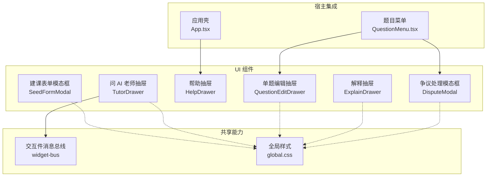
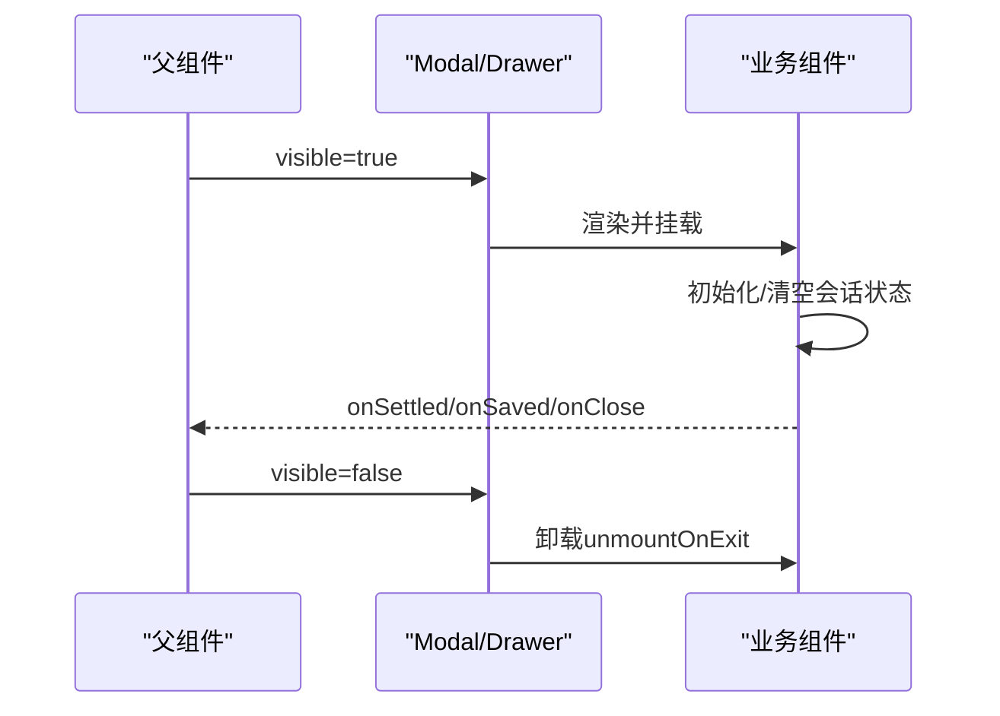
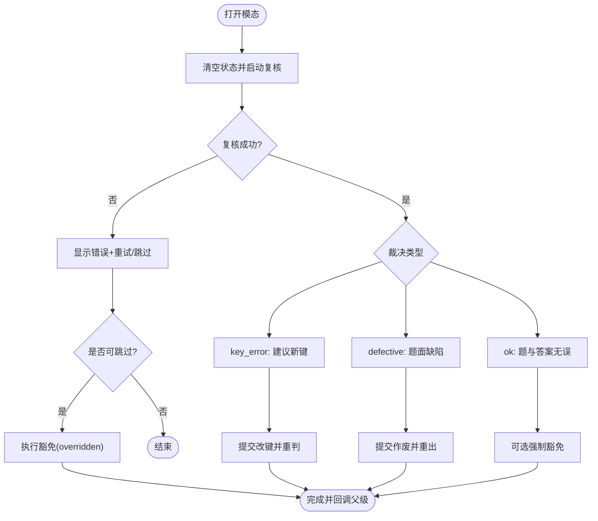
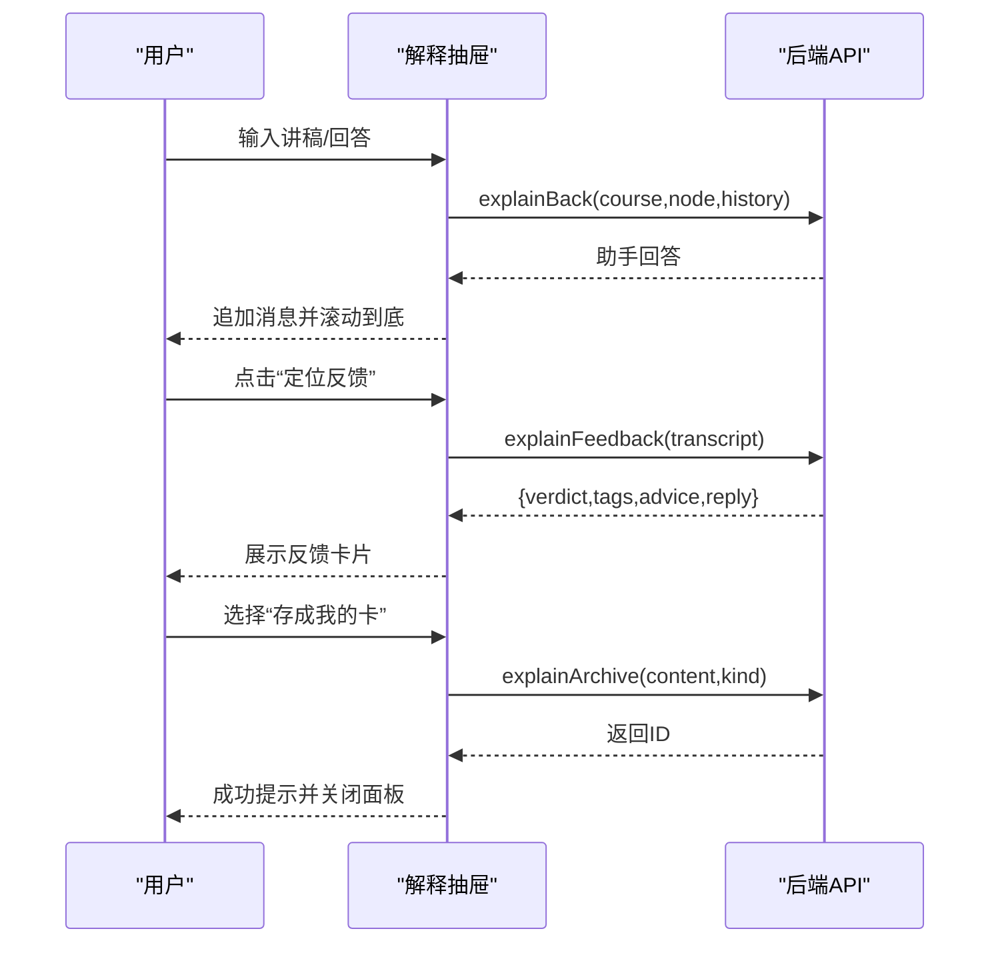
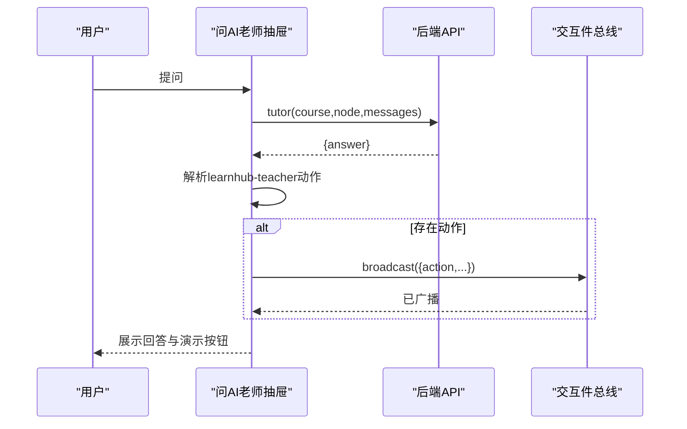
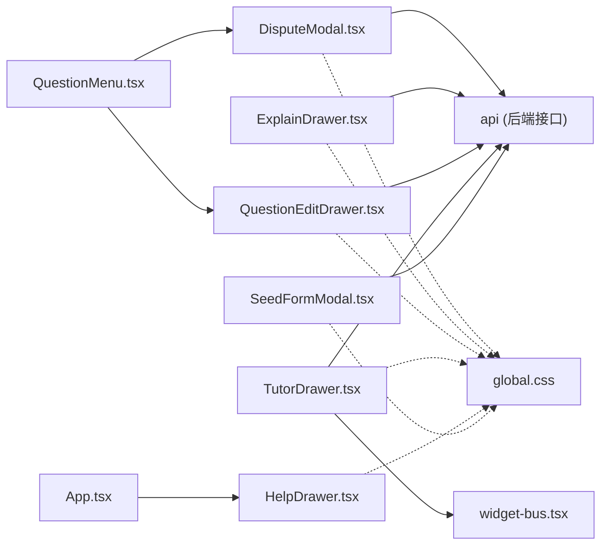

# 模态框与抽屉组件

<cite>
**本文引用的文件**
- [DisputeModal.tsx](file://ui/src/components/DisputeModal.tsx)
- [ExplainDrawer.tsx](file://ui/src/components/ExplainDrawer.tsx)
- [HelpDrawer.tsx](file://ui/src/components/HelpDrawer.tsx)
- [QuestionEditDrawer.tsx](file://ui/src/components/QuestionEditDrawer.tsx)
- [TutorDrawer.tsx](file://ui/src/components/TutorDrawer.tsx)
- [SeedFormModal.tsx](file://ui/src/components/SeedFormModal.tsx)
- [widget-bus.tsx](file://ui/src/components/widget-bus.tsx)
- [global.css](file://ui/src/global.css)
- [App.tsx](file://ui/src/App.tsx)
- [QuestionMenu.tsx](file://ui/src/components/QuestionMenu.tsx)
</cite>

## 目录
1. [简介](#简介)
2. [项目结构](#项目结构)
3. [核心组件](#核心组件)
4. [架构总览](#架构总览)
5. [详细组件分析](#详细组件分析)
6. [依赖关系分析](#依赖关系分析)
7. [性能考虑](#性能考虑)
8. [故障排查指南](#故障排查指南)
9. [结论](#结论)
10. [附录](#附录)

## 简介
本文件面向“弹出式界面”的 UI 层实现，聚焦以下组件：争议处理模态框、解释抽屉、帮助抽屉、编辑抽屉、问 AI 老师抽屉、建课表单模态框。文档从触发机制、生命周期管理、状态同步、动画与过渡、配置选项与自定义样式、键盘导航与无障碍支持等维度进行系统化说明，并给出关键流程的时序图与流程图，便于快速定位问题与扩展能力。

## 项目结构
这些组件统一位于前端 UI 层的 components 目录，通过父级页面或菜单触发显示；样式基于全局 CSS 语义类与 Arco Design 主题变量；交互总线 widget-bus 用于在“问 AI 老师”场景中向当前视图内的交互件广播动作。

图表来源
- [App.tsx:6-166](file://ui/src/App.tsx#L6-L166)
- [QuestionMenu.tsx:12-150](file://ui/src/components/QuestionMenu.tsx#L12-L150)
- [widget-bus.tsx:1-50](file://ui/src/components/widget-bus.tsx#L1-L50)
- [global.css:196-398](file://ui/src/global.css#L196-L398)

章节来源
- [App.tsx:6-166](file://ui/src/App.tsx#L6-L166)
- [QuestionMenu.tsx:12-150](file://ui/src/components/QuestionMenu.tsx#L12-L150)
- [widget-bus.tsx:1-50](file://ui/src/components/widget-bus.tsx#L1-L50)
- [global.css:196-398](file://ui/src/global.css#L196-L398)

## 核心组件
- 争议处理模态框（DisputeModal）：用于对规则题型发起申诉，调用引擎两阶段复核，支持改键、作废重出、强制豁免三种结算路径。
- 解释抽屉（ExplainDrawer）：学习者用自身语言讲解，AI 以初学者身份追问，最终产出“定位反馈”，并可存为个人卡片。
- 帮助抽屉（HelpDrawer）：将“能力指南”作为壳级抽屉展示，内容复用 GuidePage。
- 单题编辑抽屉（QuestionEditDrawer）：题库与会话内复用的题目编辑面，按题型解析答案格式，走白名单更新接口。
- 问 AI 老师抽屉（TutorDrawer）：节点范围轻量答疑，支持从回答中抽取“演示动作”并通过交互件总线广播。
- 建课表单模态框（SeedFormModal）：创建空课程，不自动开始生成，后续由教练回合生长。

章节来源
- [DisputeModal.tsx:1-210](file://ui/src/components/DisputeModal.tsx#L1-L210)
- [ExplainDrawer.tsx:1-199](file://ui/src/components/ExplainDrawer.tsx#L1-L199)
- [HelpDrawer.tsx:1-14](file://ui/src/components/HelpDrawer.tsx#L1-L14)
- [QuestionEditDrawer.tsx:1-103](file://ui/src/components/QuestionEditDrawer.tsx#L1-L103)
- [TutorDrawer.tsx:1-144](file://ui/src/components/TutorDrawer.tsx#L1-L144)
- [SeedFormModal.tsx:1-62](file://ui/src/components/SeedFormModal.tsx#L1-L62)

## 架构总览
所有弹出式组件均遵循统一的可见性控制模式：由父组件持有 visible 状态，传入子组件；子组件内部维护业务状态（如对话历史、加载态、错误信息等），并在打开时重置会话数据。动画与过渡由底层 Modal/Drawer 提供，配合 unmountOnExit 在关闭后卸载 DOM，减少内存占用。

图表来源
- [DisputeModal.tsx:73-83](file://ui/src/components/DisputeModal.tsx#L73-L83)
- [ExplainDrawer.tsx:39-47](file://ui/src/components/ExplainDrawer.tsx#L39-L47)
- [TutorDrawer.tsx:62-68](file://ui/src/components/TutorDrawer.tsx#L62-L68)
- [QuestionEditDrawer.tsx:33-41](file://ui/src/components/QuestionEditDrawer.tsx#L33-L41)
- [SeedFormModal.tsx:22-24](file://ui/src/components/SeedFormModal.tsx#L22-L24)

## 详细组件分析

### 争议处理模态框（DisputeModal）
- 触发机制：由题目菜单入口触发，仅对规则题型开放（isRuleKind）。
- 生命周期：visible 变化时自动清空复核结果与理由，并立即启动一次复核请求；使用 runId 防抖避免竞态。
- 状态同步：
  - 本地：reason、reviewing、applying、reviewError、fallbackable、review。
  - 远程：questionDisputeReview → questionDisputeApply，返回 correct_now/xp 等。
- 结算路径：
  - rekey：改键并重判原作答，可能补记 XP。
  - void：作废本次判罚并归档重出，XP 归零。
  - overridden：强制豁免，不计对错且零 XP。
- 降级策略：当 AI 复核输出不可用时，允许跳过复核直接豁免。
- 样式与可访问性：使用 Arco Modal，结合全局语义类 lh-w-580 控制宽度；Popconfirm 提供二次确认。

图表来源
- [DisputeModal.tsx:53-110](file://ui/src/components/DisputeModal.tsx#L53-L110)
- [DisputeModal.tsx:148-199](file://ui/src/components/DisputeModal.tsx#L148-L199)

章节来源
- [DisputeModal.tsx:15-210](file://ui/src/components/DisputeModal.tsx#L15-L210)
- [QuestionMenu.tsx:12-150](file://ui/src/components/QuestionMenu.tsx#L12-L150)

### 解释抽屉（ExplainDrawer）
- 触发机制：由学习页或相关入口打开，承载“讲给我听”的对话流。
- 生命周期：visible/course/node 变化时清空消息与反馈；滚动条跟随最新内容。
- 状态同步：
  - 本地：messages、input、busy、feedback、archiveOpen/archiveKind/archiveText/archiveBusy。
  - 远程：explainBack 多轮对话；explainFeedback 获取定位反馈；explainArchive 存入个人卡。
- 交互要点：
  - 发送讲稿/回答，助手以初学者角色追问。
  - “定位反馈”汇总对话，返回 verdict/tags/advice/reply。
  - “存成我的卡”支持“再讲一遍”或“挖空重述”。
- 样式与可访问性：Arco Drawer + 语义类布局；Empty/Spin 提示；输入框支持 Enter 发送。

图表来源
- [ExplainDrawer.tsx:49-99](file://ui/src/components/ExplainDrawer.tsx#L49-L99)
- [ExplainDrawer.tsx:103-199](file://ui/src/components/ExplainDrawer.tsx#L103-L199)

章节来源
- [ExplainDrawer.tsx:1-199](file://ui/src/components/ExplainDrawer.tsx#L1-L199)

### 帮助抽屉（HelpDrawer）
- 触发机制：顶栏问号按钮打开，复用 GuidePage 内容。
- 生命周期：visible 控制显示；无额外业务状态。
- 样式与可访问性：Arco Drawer，宽度自适应；footer 为空，聚焦管理由框架负责。

章节来源
- [HelpDrawer.tsx:1-14](file://ui/src/components/HelpDrawer.tsx#L1-L14)
- [App.tsx:6-166](file://ui/src/App.tsx#L6-L166)

### 单题编辑抽屉（QuestionEditDrawer）
- 触发机制：题库管理页或题目菜单打开。
- 生命周期：target 变化时回填字段；保存后回调 onSaved。
- 状态同步：
  - 本地：q、answer、explanation、difficulty、busy。
  - 远程：questionUpdate，按题型解析 answer 格式。
- 校验与门禁：答案留空表示不修改；难度三档切换；保存走白名单门禁。
- 样式与可访问性：Arco Drawer + Space 布局；Tag 展示选项；Button loading 态。

章节来源
- [QuestionEditDrawer.tsx:1-103](file://ui/src/components/QuestionEditDrawer.tsx#L1-L103)
- [QuestionMenu.tsx:111-150](file://ui/src/components/QuestionMenu.tsx#L111-L150)

### 问 AI 老师抽屉（TutorDrawer）
- 触发机制：节点范围轻量答疑入口。
- 生命周期：visible/course/node 变化时清空会话；滚动跟随。
- 状态同步：
  - 本地：messages、input、busy。
  - 远程：tutor 接口返回回答。
- 特殊能力：解析回答中的 learnhub-teacher JSON 块，提取动作（highlight/setState/reveal/annotate），通过 widget-bus 广播到当前视图的交互件。
- 样式与可访问性：Arco Drawer + MdView 渲染；Empty/Spin；Enter 发送。

图表来源
- [TutorDrawer.tsx:24-48](file://ui/src/components/TutorDrawer.tsx#L24-L48)
- [TutorDrawer.tsx:70-86](file://ui/src/components/TutorDrawer.tsx#L70-L86)
- [TutorDrawer.tsx:111-121](file://ui/src/components/TutorDrawer.tsx#L111-L121)
- [widget-bus.tsx:32-44](file://ui/src/components/widget-bus.tsx#L32-L44)

章节来源
- [TutorDrawer.tsx:1-144](file://ui/src/components/TutorDrawer.tsx#L1-L144)
- [widget-bus.tsx:1-50](file://ui/src/components/widget-bus.tsx#L1-L50)

### 建课表单模态框（SeedFormModal）
- 触发机制：学习页空态或顶栏入口。
- 生命周期：visible 变化时预填课程名（编辑场景）。
- 状态同步：name、busy；提交 courseCreate。
- 行为约束：只接收课程名，创建空课程，不自动开始生成。
- 样式与可访问性：Arco Modal，语义类 lh-w-560；onOk 提交。

章节来源
- [SeedFormModal.tsx:1-62](file://ui/src/components/SeedFormModal.tsx#L1-L62)

## 依赖关系分析
- 组件对外依赖：
  - Arco Design 的 Modal/Drawer/Input/Button/Message/Spin/Tag/Empty/Popconfirm 等基础控件。
  - 本地 api 模块（封装后端接口）。
  - 全局样式 global.css 的语义类（lh-*）控制尺寸、间距、颜色等。
  - 交互件总线 widget-bus（TutorDrawer 专用）。
- 组件间耦合：
  - DisputeModal 与 QuestionMenu 通过 target 与回调耦合。
  - TutorDrawer 与 widget-bus 通过 TeacherAction 契约耦合。
  - HelpDrawer 与 App.tsx 通过 visible 状态耦合。
- 外部依赖：
  - 后端接口：questionDisputeReview/Apply、explainBack/Feedback/Archive、tutor、courseCreate、questionUpdate 等。

图表来源
- [QuestionMenu.tsx:12-150](file://ui/src/components/QuestionMenu.tsx#L12-L150)
- [App.tsx:6-166](file://ui/src/App.tsx#L6-L166)
- [widget-bus.tsx:1-50](file://ui/src/components/widget-bus.tsx#L1-L50)
- [global.css:196-398](file://ui/src/global.css#L196-L398)

章节来源
- [QuestionMenu.tsx:12-150](file://ui/src/components/QuestionMenu.tsx#L12-L150)
- [App.tsx:6-166](file://ui/src/App.tsx#L6-L166)
- [widget-bus.tsx:1-50](file://ui/src/components/widget-bus.tsx#L1-L50)
- [global.css:196-398](file://ui/src/global.css#L196-L398)

## 性能考虑
- 延迟卸载：Modal/Drawer 使用 unmountOnExit，关闭后卸载 DOM，降低长会话下的内存占用。
- 列表滚动优化：聊天类抽屉在消息/反馈变化时滚动到底部，避免频繁重排影响体验。
- 并发防护：争议模态使用 runId 防止多次复核覆盖导致的状态错乱。
- 条件渲染：仅在必要时渲染富文本与复杂区域（如 InlineMd/MdView），减少渲染开销。
- 样式收敛：静态样式统一使用语义类 lh-*，减少内联 style，利于主题与预算检查。

[本节为通用指导，不直接分析具体文件]

## 故障排查指南
- 复核失败：
  - 现象：显示错误信息并提供“重试复核”；若检测到“AI 复核输出不可用”，出现“跳过复核，直接豁免”入口。
  - 排查：检查网络与后端可用性；确认目标 course/node/qid 有效；查看 errorMessage 输出。
  - 参考位置：[DisputeModal.tsx:53-71](file://ui/src/components/DisputeModal.tsx#L53-L71)、[DisputeModal.tsx:131-146](file://ui/src/components/DisputeModal.tsx#L131-L146)
- 对话无响应：
  - 现象：发送后无回复或回滚。
  - 排查：确认 busy 状态与输入非空；检查接口异常捕获与消息回滚逻辑。
  - 参考位置：[ExplainDrawer.tsx:49-66](file://ui/src/components/ExplainDrawer.tsx#L49-L66)、[TutorDrawer.tsx:70-86](file://ui/src/components/TutorDrawer.tsx#L70-L86)
- 存档失败：
  - 现象：存卡报错或无效。
  - 排查：检查挖空语法（{{…}}）是否符合要求；确认 lastLearnerText 是否存在。
  - 参考位置：[ExplainDrawer.tsx:85-99](file://ui/src/components/ExplainDrawer.tsx#L85-L99)
- 编辑保存失败：
  - 现象：保存时报错或无变更。
  - 排查：确认答案格式与题型匹配；检查白名单门禁错误；观察 Message 提示。
  - 参考位置：[QuestionEditDrawer.tsx:43-65](file://ui/src/components/QuestionEditDrawer.tsx#L43-L65)
- 演示动作未生效：
  - 现象：点击“在交互件上演示”无效果。
  - 排查：确认当前视图包含交互件且已注册 WidgetBus；检查动作载荷是否合法。
  - 参考位置：[TutorDrawer.tsx:24-48](file://ui/src/components/TutorDrawer.tsx#L24-L48)、[widget-bus.tsx:32-44](file://ui/src/components/widget-bus.tsx#L32-L44)

章节来源
- [DisputeModal.tsx:53-71](file://ui/src/components/DisputeModal.tsx#L53-L71)
- [DisputeModal.tsx:131-146](file://ui/src/components/DisputeModal.tsx#L131-L146)
- [ExplainDrawer.tsx:49-66](file://ui/src/components/ExplainDrawer.tsx#L49-L66)
- [TutorDrawer.tsx:70-86](file://ui/src/components/TutorDrawer.tsx#L70-L86)
- [ExplainDrawer.tsx:85-99](file://ui/src/components/ExplainDrawer.tsx#L85-L99)
- [QuestionEditDrawer.tsx:43-65](file://ui/src/components/QuestionEditDrawer.tsx#L43-L65)
- [TutorDrawer.tsx:24-48](file://ui/src/components/TutorDrawer.tsx#L24-L48)
- [widget-bus.tsx:32-44](file://ui/src/components/widget-bus.tsx#L32-L44)

## 结论
该套弹出式组件采用一致的可见性与生命周期管理模式，结合 Arco 基础控件与全局语义样式，实现了高内聚、低耦合的可复用 UI 单元。争议处理、讲解反馈、问答演示等关键流程均有清晰的异步处理与降级策略。建议在新增功能时延续现有模式：显式可见性控制、会话级状态隔离、错误可恢复、样式语义化，并优先保障键盘与无障碍体验。

[本节为总结性内容，不直接分析具体文件]

## 附录

### 组件配置选项速查
- 争议处理模态框
  - props: target（course/node/qid/kind）、onClose、onSettled
  - 行为：自动复核、可重试、可跳过复核豁免
  - 参考：[DisputeModal.tsx:39-51](file://ui/src/components/DisputeModal.tsx#L39-L51)
- 解释抽屉
  - props: course、node、visible、onClose
  - 行为：多轮对话、定位反馈、存卡（recall_cue/cloze_rewrite）
  - 参考：[ExplainDrawer.tsx:21-35](file://ui/src/components/ExplainDrawer.tsx#L21-L35)
- 帮助抽屉
  - props: visible、onClose
  - 行为：展示 GuidePage
  - 参考：[HelpDrawer.tsx:6-11](file://ui/src/components/HelpDrawer.tsx#L6-L11)
- 单题编辑抽屉
  - props: target（含 kind/q/difficulty/options）、onClose、onSaved
  - 行为：按题型解析答案、难度选择、保存
  - 参考：[QuestionEditDrawer.tsx:11-26](file://ui/src/components/QuestionEditDrawer.tsx#L11-L26)
- 问 AI 老师抽屉
  - props: course、node、visible、onClose
  - 行为：轻量答疑、演示动作广播
  - 参考：[TutorDrawer.tsx:50-65](file://ui/src/components/TutorDrawer.tsx#L50-L65)
- 建课表单模态框
  - props: visible、course（可选）、onCancel、onCreated
  - 行为：创建空课程
  - 参考：[SeedFormModal.tsx:12-18](file://ui/src/components/SeedFormModal.tsx#L12-L18)

### 动画与过渡
- 使用 Arco 的 Modal/Drawer 内置动画；通过 unmountOnExit 在关闭后卸载，避免残留 DOM。
- 全局样式中对背景、边框等属性添加了 transition，保证主题切换时的平滑过渡。
- 参考：[global.css:11-28](file://ui/src/global.css#L11-L28)

### 键盘导航与无障碍
- 基础控件（Modal/Drawer/Input/Button/Popconfirm）自带焦点管理与键盘事件支持。
- 建议：
  - 打开弹窗时将焦点置于首个可交互元素；关闭时归还焦点。
  - 为重要操作提供 aria-label 或 title 描述。
  - 确保 Tab 顺序符合视觉阅读顺序。
- 参考：各组件均基于 Arco 控件，遵循其无障碍规范。

### 自定义样式方法
- 使用全局语义类 lh-* 控制尺寸、间距、颜色等，避免内联 style。
- 常用类：
  - 尺寸：lh-w-580、lh-w-480、lh-h-viewport-120、lh-h-viewport-140
  - 布局：lh-col、lh-row、lh-gap-8、lh-flex-1、lh-scroll-y
  - 文本：lh-t-12、lh-t-13、lh-muted、lh-strong
  - 表面：lh-surface-1、lh-surface-2、lh-border
- 参考：[global.css:196-398](file://ui/src/global.css#L196-L398)