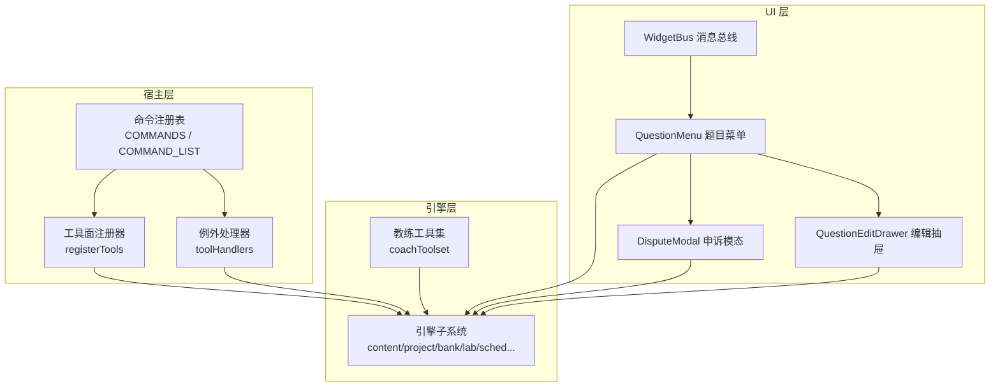
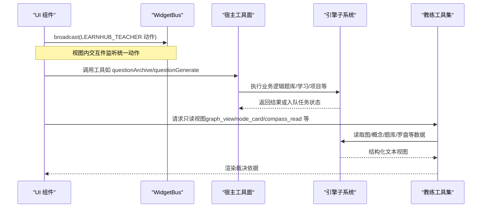
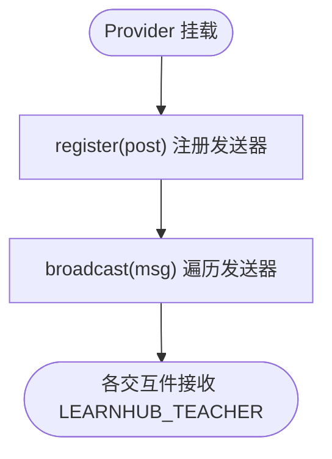
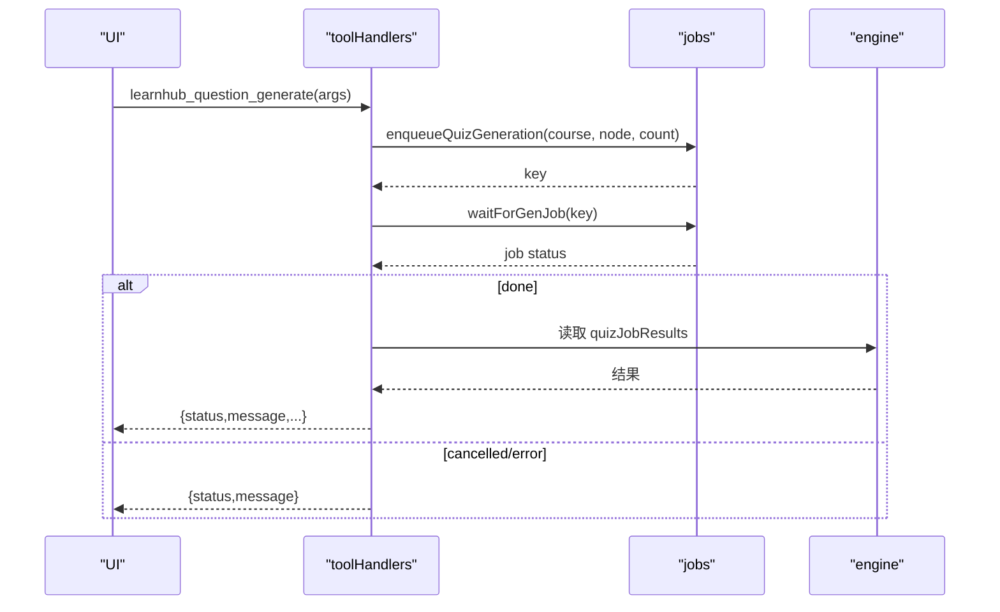
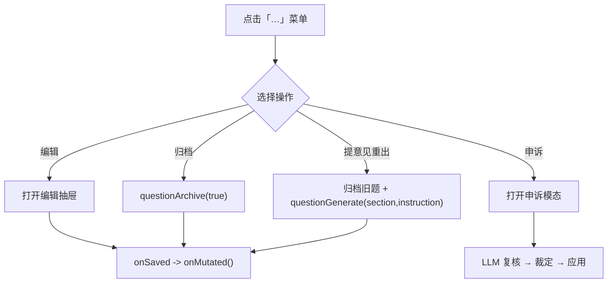
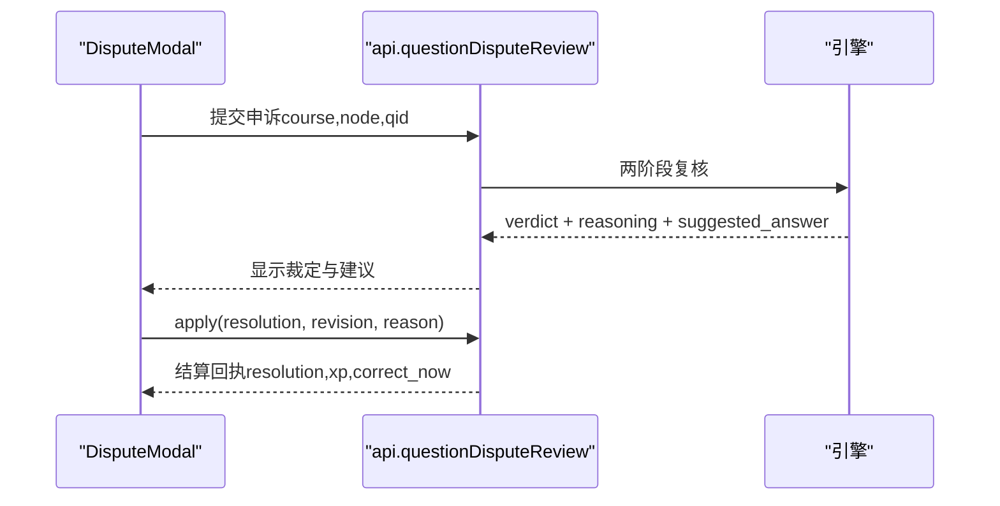
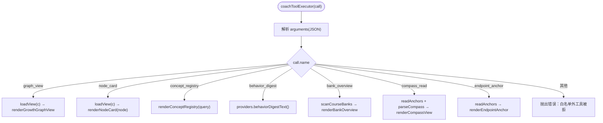
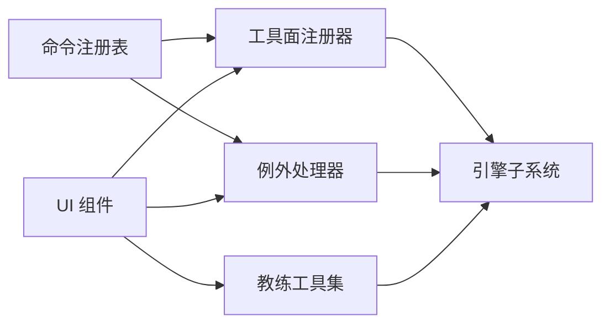

# 组件工具库

<cite>
**本文引用的文件**
- [src/host/tools.ts](file://src/host/tools.ts)
- [src/host/tool-handlers.ts](file://src/host/tool-handlers.ts)
- [src/commands/index.ts](file://src/commands/index.ts)
- [src/commands/types.ts](file://src/commands/types.ts)
- [src/tool-contracts.ts](file://src/tool-contracts.ts)
- [ui/src/components/widget-bus.tsx](file://ui/src/components/widget-bus.tsx)
- [ui/src/components/QuestionMenu.tsx](file://ui/src/components/QuestionMenu.tsx)
- [ui/src/components/DisputeModal.tsx](file://ui/src/components/DisputeModal.tsx)
- [ui/src/components/QuestionEditDrawer.tsx](file://ui/src/components/QuestionEditDrawer.tsx)
- [src/engine/coach-tools.ts](file://src/engine/coach-tools.ts)
</cite>

## 目录
1. [简介](#简介)
2. [项目结构](#项目结构)
3. [核心组件](#核心组件)
4. [架构总览](#架构总览)
5. [详细组件分析](#详细组件分析)
6. [依赖关系分析](#依赖关系分析)
7. [性能与内存管理](#性能与内存管理)
8. [故障排查指南](#故障排查指南)
9. [结论](#结论)
10. [附录：使用示例与集成指南](#附录使用示例与集成指南)

## 简介
本仓库的“组件工具库”围绕三类能力展开：
- 组件间通信机制：基于 React Context 的消息总线，支持在视图范围内向交互件广播统一动作（如高亮、状态更新、批注等）。
- 提示系统与智能生成：通过命令注册表将引擎入口声明为工具面参数与执行路径，实现“参数即契约、类型即文档”的智能提示；并提供教练只读工具集用于裁决前自检。
- 菜单组件与动态构建：提供会话内题目操作菜单、申诉模态与编辑抽屉，结合 API 完成归档、重出、改键等操作。

这些能力共同构成插件的“工具层”，向上支撑 UI 交互，向下对接引擎子系统，并通过显式契约保证前后端一致性与可维护性。

## 项目结构
- 宿主工具面与路由装配
  - 命令注册表集中定义所有命令、通道、参数与输出类型，驱动 agent 工具面与 panel 路由面。
  - 工具面注册器将命令映射到 defineTool，并自动投影 schema 与执行路径。
  - 例外处理器处理无法走生成路径的工具（形状加工、参数换算、队列型任务等）。
- 前端交互组件
  - 消息总线 WidgetBus：提供 register/broadcast 能力，供面板侧向当前视图内的交互件广播动作。
  - 题目菜单 QuestionMenu：提供编辑、归档、提意见重出、申诉等入口。
  - 申诉模态 DisputeModal：LLM 两阶段复核后给出三态裁定，支持改键、作废重出、豁免。
  - 编辑抽屉 QuestionEditDrawer：统一的题目编辑界面，复用题库与会话场景。
- 教练工具集
  - 七项只读视图工具（图面、节点卡、概念登记、行为摘要、题库概况、罗盘、终点锚），用于裁决前的证据收集与对表。



图表来源
- [src/commands/index.ts:25-71](file://src/commands/index.ts#L25-L71)
- [src/host/tools.ts:101-125](file://src/host/tools.ts#L101-L125)
- [src/host/tool-handlers.ts:23-286](file://src/host/tool-handlers.ts#L23-L286)
- [src/engine/coach-tools.ts:235-304](file://src/engine/coach-tools.ts#L235-L304)
- [ui/src/components/widget-bus.tsx:32-49](file://ui/src/components/widget-bus.tsx#L32-L49)
- [ui/src/components/QuestionMenu.tsx:34-162](file://ui/src/components/QuestionMenu.tsx#L34-L162)
- [ui/src/components/DisputeModal.tsx:39-209](file://ui/src/components/DisputeModal.tsx#L39-L209)
- [ui/src/components/QuestionEditDrawer.tsx:22-102](file://ui/src/components/QuestionEditDrawer.tsx#L22-L102)

章节来源
- [src/commands/index.ts:1-72](file://src/commands/index.ts#L1-L72)
- [src/host/tools.ts:1-126](file://src/host/tools.ts#L1-L126)
- [src/host/tool-handlers.ts:1-288](file://src/host/tool-handlers.ts#L1-L288)
- [src/engine/coach-tools.ts:1-305](file://src/engine/coach-tools.ts#L1-L305)
- [ui/src/components/widget-bus.tsx:1-50](file://ui/src/components/widget-bus.tsx#L1-L50)
- [ui/src/components/QuestionMenu.tsx:1-163](file://ui/src/components/QuestionMenu.tsx#L1-L163)
- [ui/src/components/DisputeModal.tsx:1-210](file://ui/src/components/DisputeModal.tsx#L1-L210)
- [ui/src/components/QuestionEditDrawer.tsx:1-103](file://ui/src/components/QuestionEditDrawer.tsx#L1-L103)

## 核心组件
- 命令注册表与工具面装配
  - 以“命令 id + 通道 + 参数 schema + 引擎入口绑定”为核心，自动生成 agent 工具描述与执行函数。
  - 参数 schema 在工具面前被剥离投递层扩展键，保持 SDK 契约稳定。
- 例外处理器
  - 针对需要特殊处理的工具（队列型、参数换算、形状加工）提供独立 handler，确保主流程简洁。
- 消息总线 WidgetBus
  - 基于 React Context 的轻量发布订阅，支持在当前视图内注册多个发送器并广播统一动作。
- 题目菜单与申诉
  - 提供归档、重出、申诉、编辑等入口，串联后端 API 与引擎子系统，形成闭环工作流。
- 教练工具集
  - 仅暴露只读视图，避免写路径自激；通过白名单与参数校验保障安全与一致性。

章节来源
- [src/commands/types.ts:54-129](file://src/commands/types.ts#L54-L129)
- [src/host/tools.ts:72-125](file://src/host/tools.ts#L72-L125)
- [src/host/tool-handlers.ts:23-286](file://src/host/tool-handlers.ts#L23-L286)
- [ui/src/components/widget-bus.tsx:11-49](file://ui/src/components/widget-bus.tsx#L11-L49)
- [ui/src/components/QuestionMenu.tsx:19-162](file://ui/src/components/QuestionMenu.tsx#L19-L162)
- [ui/src/components/DisputeModal.tsx:15-209](file://ui/src/components/DisputeModal.tsx#L15-L209)
- [src/engine/coach-tools.ts:30-34](file://src/engine/coach-tools.ts#L30-L34)

## 架构总览
下图展示从 UI 到宿主再到引擎的调用链路与数据流向，包括事件总线、菜单操作与工具面装配。



图表来源
- [ui/src/components/widget-bus.tsx:32-49](file://ui/src/components/widget-bus.tsx#L32-L49)
- [src/host/tools.ts:101-125](file://src/host/tools.ts#L101-L125)
- [src/host/tool-handlers.ts:23-286](file://src/host/tool-handlers.ts#L23-L286)
- [src/engine/coach-tools.ts:235-304](file://src/engine/coach-tools.ts#L235-L304)

## 详细组件分析

### 组件总线（WidgetBus）
- 设计要点
  - 使用 React Context 提供 register/broadcast 能力，支持在 LessonView 等父级挂载 Provider。
  - 无 Provider 时 useWidgetBus 返回 null，组件仍可渲染但无广播能力。
  - 广播消息统一包装为 LEARNHUB_TEACHER 动作，包含 highlight/setState/reveal/annotate 等语义。
- 复杂度与性能
  - 注册表为 Set，遍历开销 O(n)，n 为当前视图内注册的交互件数量。
  - 建议控制交互件数量，避免频繁大载荷广播。



图表来源
- [ui/src/components/widget-bus.tsx:32-49](file://ui/src/components/widget-bus.tsx#L32-L49)

章节来源
- [ui/src/components/widget-bus.tsx:1-50](file://ui/src/components/widget-bus.tsx#L1-L50)

### 命令注册表与工具面装配
- 设计要点
  - COMMANDS 聚合各域命令，COMMAND_LIST 提供运行时遍历面。
  - registerTools 遍历命令，按 agent 通道生成 defineTool，自动投影 schema 与执行路径。
  - 对于有 engine 绑定的命令，execute 通过 run 调用引擎入口；否则走 toolHandlers。
- 扩展机制
  - 新增命令只需在对应域文件中声明 command(...)，即可自动出现在工具面与路由面。
  - 参数 schema 由 ParamSpec 描述，read 字段仅在投递层消费，下发前剥离。

```mermaid
classDiagram
class CommandSpec {
+string id
+string summary
+ParameterSchemaSpec args
+EngineMethod? engine
+ChannelSpec[] channels
+CommandDomain domain
}
class ChannelSpec {
+string channel
+string mode
+string? tool
+{method : string; path : string}? route
+GenJobPhase? phase
+string|null[]? bind
+string[]? required
+boolean? prefix
+boolean? log
}
class ParameterSchemaSpec {
+Record~string, ParamSpec~
}
CommandSpec --> ChannelSpec : "channels"
CommandSpec --> ParameterSchemaSpec : "args"
```

图表来源
- [src/commands/types.ts:54-129](file://src/commands/types.ts#L54-L129)
- [src/commands/index.ts:25-71](file://src/commands/index.ts#L25-L71)
- [src/host/tools.ts:72-125](file://src/host/tools.ts#L72-L125)

章节来源
- [src/commands/index.ts:1-72](file://src/commands/index.ts#L1-L72)
- [src/commands/types.ts:1-129](file://src/commands/types.ts#L1-L129)
- [src/host/tools.ts:1-126](file://src/host/tools.ts#L1-L126)

### 例外处理器（toolHandlers）
- 设计要点
  - 集中处理无法走生成路径的工具：队列型任务、参数换算、形状加工等。
  - 通过 run(rt, tool, fn) 包装执行，统一记录运行上下文与错误。
  - 与命令注册表互补：注册表负责“声明驱动”，例外处理器负责“特例适配”。
- 典型流程（出题任务）
  - 入队出题任务 → 等待终态 → 清理结果缓存 → 返回多样性指标与统计。



图表来源
- [src/host/tool-handlers.ts:82-99](file://src/host/tool-handlers.ts#L82-L99)

章节来源
- [src/host/tool-handlers.ts:1-288](file://src/host/tool-handlers.ts#L1-L288)

### 题目菜单（QuestionMenu）
- 功能概览
  - 编辑本题：打开 QuestionEditDrawer，保存后刷新会话。
  - 归档本题：调用 questionArchive，立即退出会话与复习调度。
  - 提意见重出：先归档旧题，再携带 instruction 定向生成新题（同节定向）。
  - 申诉：触发 DisputeModal，进行 LLM 两阶段复核与裁定。
- 数据流
  - onMutated 回调通知父级静默刷新 questions，确保轮次重建与新题并入。
  - 反馈意图标签一键填入，提升指令质量。



图表来源
- [ui/src/components/QuestionMenu.tsx:47-162](file://ui/src/components/QuestionMenu.tsx#L47-L162)
- [ui/src/components/DisputeModal.tsx:53-110](file://ui/src/components/DisputeModal.tsx#L53-L110)

章节来源
- [ui/src/components/QuestionMenu.tsx:1-163](file://ui/src/components/QuestionMenu.tsx#L1-L163)
- [ui/src/components/DisputeModal.tsx:1-210](file://ui/src/components/DisputeModal.tsx#L1-L210)

### 申诉模态（DisputeModal）
- 设计要点
  - 两阶段复核：独立解题 + 对账，输出 verdict（key_error/defective/ok）与 reasoning。
  - 三态裁定：改键并重判、作废并归档重出、强制豁免（零 XP）。
  - 降级入口：当复核不可用时允许跳过复核直接豁免。
- 用户体验
  - 理由输入留痕进勘误记录；作废重出时作为新题生成指令。
  - 明确提示“豁免只是不算，不是算你对”。



图表来源
- [ui/src/components/DisputeModal.tsx:53-110](file://ui/src/components/DisputeModal.tsx#L53-L110)
- [ui/src/components/DisputeModal.tsx:85-110](file://ui/src/components/DisputeModal.tsx#L85-L110)

章节来源
- [ui/src/components/DisputeModal.tsx:1-210](file://ui/src/components/DisputeModal.tsx#L1-L210)

### 编辑抽屉（QuestionEditDrawer）
- 设计要点
  - 统一编辑面，题库管理与会话内复用。
  - 答案留空表示不修改；不同题型的答案格式自动转换。
  - 保存走 questionUpdate，受白名单门禁保护。
- 交互细节
  - 选项以 Tag 展示；难度按钮快速切换。
  - 保存成功后提示“validateBank 门禁通过”。

章节来源
- [ui/src/components/QuestionEditDrawer.tsx:1-103](file://ui/src/components/QuestionEditDrawer.tsx#L1-L103)

### 教练工具集（coach-tools）
- 设计要点
  - 七项只读视图工具：graph_view、node_card、concept_registry、behavior_digest、bank_overview、compass_read、endpoint_anchor。
  - 白名单外调用 fail loud，防止写路径自激与越权。
  - 列表与图名预览上限（LIST_CAP/GRAPH_NAMES_CAP）防膨胀。
- 执行器
  - coachToolExecutor 解析参数 JSON，分发到具体渲染函数。
  - coachToolset 组装 specs 与 runTool，供 coachGrowthBatch/compassPaint 注入。



图表来源
- [src/engine/coach-tools.ts:251-296](file://src/engine/coach-tools.ts#L251-L296)

章节来源
- [src/engine/coach-tools.ts:1-305](file://src/engine/coach-tools.ts#L1-L305)

## 依赖关系分析
- 命令注册表是单点装配源，决定工具面与路由面的契约。
- 工具面注册器依赖命令注册表与运行时环境，生成 defineTool。
- 例外处理器依赖 jobs 与引擎子系统，处理队列型与复杂参数工具。
- UI 组件依赖 api 与宿主工具面，通过消息总线解耦交互件。
- 教练工具集依赖引擎只读视图与文件系统，严格白名单访问。



图表来源
- [src/commands/index.ts:25-71](file://src/commands/index.ts#L25-L71)
- [src/host/tools.ts:101-125](file://src/host/tools.ts#L101-L125)
- [src/host/tool-handlers.ts:23-286](file://src/host/tool-handlers.ts#L23-L286)
- [src/engine/coach-tools.ts:235-304](file://src/engine/coach-tools.ts#L235-L304)

章节来源
- [src/commands/index.ts:1-72](file://src/commands/index.ts#L1-L72)
- [src/host/tools.ts:1-126](file://src/host/tools.ts#L1-L126)
- [src/host/tool-handlers.ts:1-288](file://src/host/tool-handlers.ts#L1-L288)
- [src/engine/coach-tools.ts:1-305](file://src/engine/coach-tools.ts#L1-L305)

## 性能与内存管理
- 消息总线
  - 使用 Set 存储发送器，注册/注销 O(1)，广播 O(n)。建议限制交互件数量，避免高频大载荷广播。
- 命令注册表
  - 编译期类型推导减少运行时开销；schema 剥离投递层扩展键，降低传输体积。
- 教练工具集
  - 列表与图名预览上限防止响应过大；只读访问避免写锁竞争。
- 队列型任务
  - 入队与等待终态分离，避免阻塞主线程；结果缓存及时清理，防止内存泄漏。
- 最佳实践
  - 批量操作优先：合并多次小更新为一次 patch。
  - 懒加载与分页：对大图/长列表采用分页与虚拟滚动。
  - 错误快速失败：参数校验尽早抛错，避免无效计算。

[本节为通用指导，无需特定文件引用]

## 故障排查指南
- 参数校验错误
  - 使用 tool-contracts 中的校验函数（如 requireSkipDirection、questionCount、rejectId）捕获非法输入，返回明确错误信息。
- 工具面调用失败
  - 检查命令是否已注册、agent 通道是否存在、engine 绑定是否正确。
  - 查看例外处理器中是否有该工具的 handler，必要时补充。
- 队列型任务异常
  - 确认入队阶段与任务键正确；检查 waitForGenJob 返回状态；清理残留结果缓存。
- 教练工具白名单拒绝
  - 确认 call.name 在白名单内；参数 JSON 合法；只读视图依赖可用。

章节来源
- [src/tool-contracts.ts:11-54](file://src/tool-contracts.ts#L11-L54)
- [src/host/tool-handlers.ts:23-286](file://src/host/tool-handlers.ts#L23-L286)
- [src/engine/coach-tools.ts:251-296](file://src/engine/coach-tools.ts#L251-L296)

## 结论
本工具库通过命令注册表统一契约、消息总线解耦交互、教练工具集保障裁决质量，形成“声明驱动、类型可见、只读安全”的工具体系。配合题目菜单与申诉模态，实现了从交互到执行的完整闭环。遵循本文的性能与内存管理建议，可进一步提升系统稳定性与用户体验。

[本节为总结，无需特定文件引用]

## 附录：使用示例与集成指南
- 集成 WidgetBus
  - 在视图根组件挂载 WidgetBusProvider，子组件通过 useWidgetBus 获取 register/broadcast。
  - 交互件在 mount 时 register 发送器，unmount 时调用返回的注销函数。
- 新增命令
  - 在对应域文件中声明 command(...)，指定 id、summary、args、engine/bind、channels。
  - 如需例外处理，在 toolHandlers 中补充 handler。
- 使用题目菜单
  - 传入 target 与 onMutated 回调，根据用户操作调用相应 API。
  - 申诉模态自动触发复核与裁定，注意处理降级入口。
- 调用教练工具
  - 通过 coachToolset 获取 tools 与 runTool，在裁决前调用只读视图收集证据。

[本节为使用指导，无需特定文件引用]