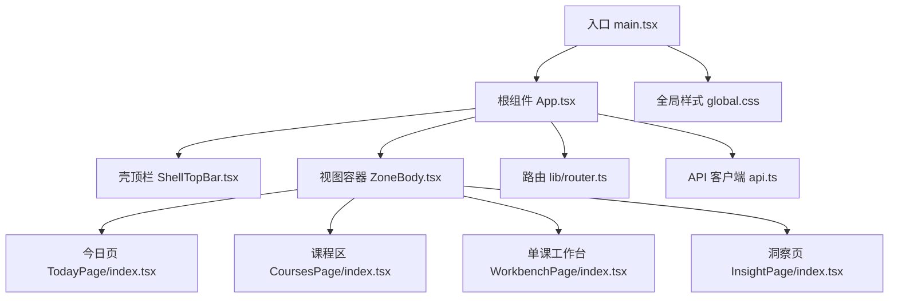
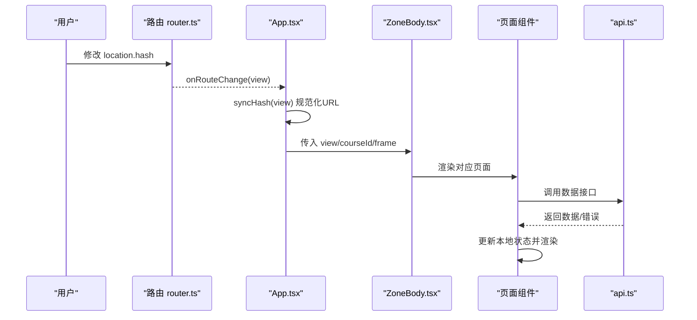
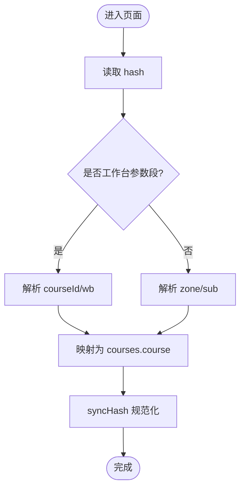
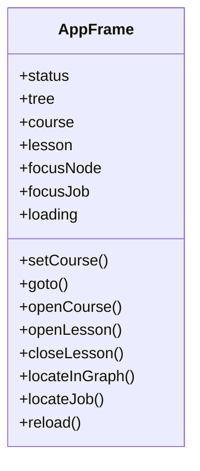
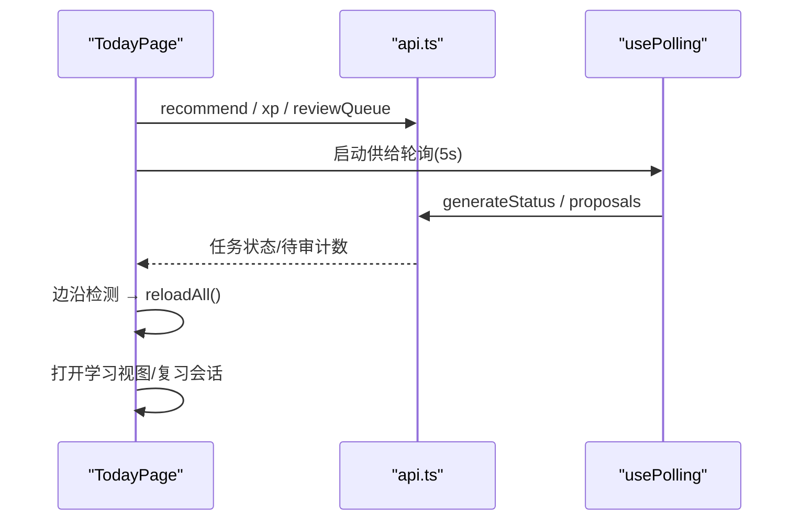
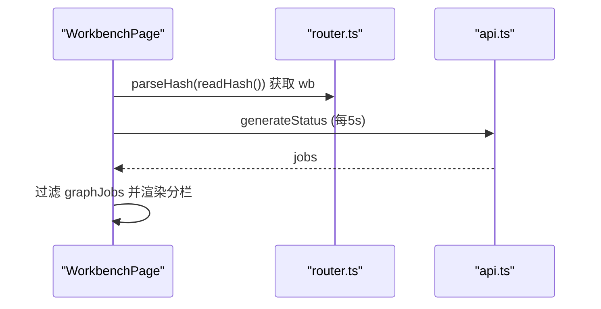
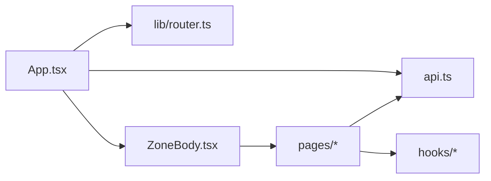

# 前端界面

<cite>
**本文引用的文件**
- [ui/src/main.tsx](file://ui/src/main.tsx)
- [ui/src/App.tsx](file://ui/src/App.tsx)
- [ui/src/lib/router.ts](file://ui/src/lib/router.ts)
- [ui/src/components/ZoneBody.tsx](file://ui/src/components/ZoneBody.tsx)
- [ui/src/components/ShellTopBar.tsx](file://ui/src/components/ShellTopBar.tsx)
- [ui/src/pages/TodayPage/index.tsx](file://ui/src/pages/TodayPage/index.tsx)
- [ui/src/pages/CoursesPage/index.tsx](file://ui/src/pages/CoursesPage/index.tsx)
- [ui/src/pages/WorkbenchPage/index.tsx](file://ui/src/pages/WorkbenchPage/index.tsx)
- [ui/src/pages/InsightPage/index.tsx](file://ui/src/pages/InsightPage/index.tsx)
- [ui/src/api.ts](file://ui/src/api.ts)
- [ui/src/global.css](file://ui/src/global.css)
- [ui/package.json](file://ui/package.json)
- [ui/vite.config.ts](file://ui/vite.config.ts)
</cite>

## 目录
1. [简介](#简介)
2. [项目结构](#项目结构)
3. [核心组件](#核心组件)
4. [架构总览](#架构总览)
5. [详细组件分析](#详细组件分析)
6. [依赖关系分析](#依赖关系分析)
7. [性能考虑](#性能考虑)
8. [故障排查指南](#故障排查指南)
9. [结论](#结论)
10. [附录](#附录)

## 简介
本文件面向基于 React 的前端应用，系统化说明其架构、组件设计、状态管理、路由配置与页面实现。重点覆盖学习仪表板（今日）、课程管理（我的课程与单课工作台）以及洞察页面的功能与交互；同时给出组件库复用策略、主题定制、响应式适配方案与前端性能优化实践，并提供开发指引与使用示例路径。

## 项目结构
前端位于 ui 子工程，采用 Vite + React 构建，通过 Arco Design 提供 UI 基础能力，结合自研 lib/router 进行 hash 路由与视图保活，页面按功能域拆分到 pages 目录，通用布局与容器在 components 中集中管理。

图表来源
- [ui/src/main.tsx:1-16](file://ui/src/main.tsx#L1-L16)
- [ui/src/App.tsx:47-179](file://ui/src/App.tsx#L47-L179)
- [ui/src/components/ZoneBody.tsx:21-42](file://ui/src/components/ZoneBody.tsx#L21-L42)
- [ui/src/components/ShellTopBar.tsx:19-63](file://ui/src/components/ShellTopBar.tsx#L19-L63)
- [ui/src/lib/router.ts:1-164](file://ui/src/lib/router.ts#L1-L164)
- [ui/src/api.ts:1-370](file://ui/src/api.ts#L1-L370)
- [ui/src/global.css:1-398](file://ui/src/global.css#L1-L398)

章节来源
- [ui/src/main.tsx:1-16](file://ui/src/main.tsx#L1-L16)
- [ui/src/App.tsx:47-179](file://ui/src/App.tsx#L47-L179)
- [ui/src/lib/router.ts:1-164](file://ui/src/lib/router.ts#L1-L164)
- [ui/src/components/ZoneBody.tsx:21-42](file://ui/src/components/ZoneBody.tsx#L21-L42)
- [ui/src/components/ShellTopBar.tsx:19-63](file://ui/src/components/ShellTopBar.tsx#L19-L63)
- [ui/src/api.ts:1-370](file://ui/src/api.ts#L1-L370)
- [ui/src/global.css:1-398](file://ui/src/global.css#L1-L398)

## 核心组件
- 根组件 App：负责全局状态（状态、课程树、当前课程、学习视图定位）、主题切换、加载/致命态处理、导航桥接与教练通知轮询。
- 路由 lib/router：定义五区键、课程区三入口、单课工作台参数段路由，提供解析、跳转、规范化与订阅能力。
- 视图容器 ZoneBody：基于“访问即保活”的策略，隐藏视图保留状态，配合 active-tab 信号控制后台轮询。
- 壳顶栏 ShellTopBar：五区页签、课程区子导航、帮助抽屉入口与亮暗主题切换。
- API 客户端 api：统一封装后端接口，包含错误类型与消息提取。

章节来源
- [ui/src/App.tsx:17-179](file://ui/src/App.tsx#L17-L179)
- [ui/src/lib/router.ts:24-164](file://ui/src/lib/router.ts#L24-L164)
- [ui/src/components/ZoneBody.tsx:1-42](file://ui/src/components/ZoneBody.tsx#L1-L42)
- [ui/src/components/ShellTopBar.tsx:1-63](file://ui/src/components/ShellTopBar.tsx#L1-L63)
- [ui/src/api.ts:1-370](file://ui/src/api.ts#L1-L370)

## 架构总览
整体采用“壳-视图-页面”分层：壳层提供导航与全局上下文，视图容器负责保活与挂载，页面组件承载业务逻辑与数据获取，路由层以 hash 为权威源，API 层统一通信。

图表来源
- [ui/src/lib/router.ts:72-164](file://ui/src/lib/router.ts#L72-L164)
- [ui/src/App.tsx:102-117](file://ui/src/App.tsx#L102-L117)
- [ui/src/components/ZoneBody.tsx:21-42](file://ui/src/components/ZoneBody.tsx#L21-L42)
- [ui/src/api.ts:13-32](file://ui/src/api.ts#L13-L32)

## 详细组件分析

### 路由与导航（lib/router.ts）
- 区键与视图键：五区（今日/课程/洞察/项目/无界实践区），课程区展开为三入口视图键，单课工作台共享一个视图键。
- 参数段路由：#/course/<id>/，支持前进后退与深链直达。
- 工具函数：parseHash、navigate、navigateCourse、syncHash、onRouteChange、viewOfRoute、routeOfView、zoneOfView。

图表来源
- [ui/src/lib/router.ts:72-164](file://ui/src/lib/router.ts#L72-L164)

章节来源
- [ui/src/lib/router.ts:24-164](file://ui/src/lib/router.ts#L24-L164)

### 根组件与全局状态（App.tsx）
- 全局状态：status、tree、course、lesson、focusNode/focusJob、loading/fatal。
- 初始化与刷新：首次加载 status 与课程树，自动回退到首个启用课程。
- 导航同步：hash 变化回灌渲染态，渲染态变更规范化 URL。
- 主题：跟随系统或 localStorage，设置 arco-theme。
- 空课程守卫：对特定视图在无课程时显示引导。

图表来源
- [ui/src/App.tsx:17-38](file://ui/src/App.tsx#L17-L38)
- [ui/src/App.tsx:47-179](file://ui/src/App.tsx#L47-L179)

章节来源
- [ui/src/App.tsx:47-179](file://ui/src/App.tsx#L47-L179)

### 视图保活容器（ZoneBody.tsx）
- 首访后常驻，非激活隐藏，避免重复初始化。
- 根据 VIEW_KEYS 列表动态挂载页面，activeTab 信号用于跳过隐藏视图的轮询。

章节来源
- [ui/src/components/ZoneBody.tsx:1-42](file://ui/src/components/ZoneBody.tsx#L1-L42)

### 壳顶栏（ShellTopBar.tsx）
- 五区页签与课程区子导航（我的课程/生成队列/提案收件箱）。
- 右侧控制：通知占位、帮助抽屉、亮暗主题切换。

章节来源
- [ui/src/components/ShellTopBar.tsx:1-63](file://ui/src/components/ShellTopBar.tsx#L1-L63)

### 今日页（学习仪表板）（TodayPage/index.tsx）
- 主数据：推荐流、XP、复习队列；失败态由 CommandBoundary 统一处理。
- 供给与闸门：轮询生成状态与提案数，边沿检测触发推荐流重拉。
- 二级视图：节点学习（LessonView）与复习会话（ReviewSession）。
- 资产菜单：笔记源抽屉、我的卡管理、导出 Anki（归洞察通道卡）。

图表来源
- [ui/src/pages/TodayPage/index.tsx:36-118](file://ui/src/pages/TodayPage/index.tsx#L36-L118)
- [ui/src/api.ts:43-223](file://ui/src/api.ts#L43-L223)

章节来源
- [ui/src/pages/TodayPage/index.tsx:1-287](file://ui/src/pages/TodayPage/index.tsx#L1-L287)

### 课程管理（CoursesPage/index.tsx）
- 空仓：展示引导与教练台入口。
- 有课：课程卡网格，点击进入单课工作台。

章节来源
- [ui/src/pages/CoursesPage/index.tsx:1-31](file://ui/src/pages/CoursesPage/index.tsx#L1-L31)

### 单课工作台（WorkbenchPage/index.tsx）
- 参数段路由：#/course/<id>/，分栏包括罗盘与图、教练台、生长与队列、提案、题库。
- 统一轮询：工作台下所有分栏共用生成任务注册表轮询，避免重复请求。
- 异常深链：未知/已删课程显式空态并引导返回。

图表来源
- [ui/src/pages/WorkbenchPage/index.tsx:33-52](file://ui/src/pages/WorkbenchPage/index.tsx#L33-L52)
- [ui/src/lib/router.ts:72-104](file://ui/src/lib/router.ts#L72-L104)
- [ui/src/api.ts:205-213](file://ui/src/api.ts#L205-L213)

章节来源
- [ui/src/pages/WorkbenchPage/index.tsx:1-85](file://ui/src/pages/WorkbenchPage/index.tsx#L1-L85)

### 洞察页（InsightPage/index.tsx）
- 观测与实验：周复盘、记忆健康、自评校准画像、沙盘、N-of-1 实验、睡眠建议、Anki 通道、运行环境。
- 数据获取：多路 useCommand 并行取数，失败显式三态；教练反馈信息性横幅。
- 目标编辑：每日 XP 目标可即时保存并刷新。

章节来源
- [ui/src/pages/InsightPage/index.tsx:1-207](file://ui/src/pages/InsightPage/index.tsx#L1-L207)

### 组件库与复用策略
- 布局与容器：ZoneBody 提供视图保活；ShellTopBar 提供统一导航与主题控制。
- 命令边界：CommandBoundary 统一处理加载/失败/内容三态，降低页面级错误分支复杂度。
- 轮询钩子：usePolling 抽象定时刷新，配合 active-tab 信号避免隐藏视图浪费资源。
- 页面内聚：各页面仅关注自身数据与交互，通过 frame 与 api 协作。

章节来源
- [ui/src/components/ZoneBody.tsx:1-42](file://ui/src/components/ZoneBody.tsx#L1-L42)
- [ui/src/components/ShellTopBar.tsx:1-63](file://ui/src/components/ShellTopBar.tsx#L1-L63)
- [ui/src/pages/TodayPage/index.tsx:36-118](file://ui/src/pages/TodayPage/index.tsx#L36-L118)

### 用户交互流程与状态同步
- 导航权威：location.hash 唯一权威，App 监听 hashchange 并同步渲染态，必要时 replaceState 规范化。
- 保活机制：ZoneBody 维护 visited Set，隐藏视图不卸载，轮询由 active-tab 门控。
- 数据一致性：页面侧通过 useCommand/usePolling 保证数据最新，边沿事件驱动重拉。

章节来源
- [ui/src/lib/router.ts:106-164](file://ui/src/lib/router.ts#L106-L164)
- [ui/src/App.tsx:102-117](file://ui/src/App.tsx#L102-L117)
- [ui/src/components/ZoneBody.tsx:21-42](file://ui/src/components/ZoneBody.tsx#L21-L42)

### 响应式设计与移动端适配
- 布局：Flex/Grid 组合，语义类 lh-* 提供间距/尺寸/对齐等原子能力。
- 图表容器：React Flow 容器高度通过视口计算，确保画布不塌缩。
- 文本与卡片：md-body 限宽阅读，卡片网格自适应列数。

章节来源
- [ui/src/global.css:126-136](file://ui/src/global.css#L126-L136)
- [ui/src/global.css:237-398](file://ui/src/global.css#L237-L398)

### 主题定制与样式覆盖
- 主题开关：App 设置 body.arco-theme，持久化至 localStorage。
- Token 驱动：全局样式消费 --lh-* 变量，便于统一换肤。
- 覆盖方式：通过 tokens.css 调整 token 值；页面级样式遵循语义类命名规范。

章节来源
- [ui/src/App.tsx:119-128](file://ui/src/App.tsx#L119-L128)
- [ui/src/global.css:1-28](file://ui/src/global.css#L1-L28)

### 前端性能优化策略
- 代码分割与懒加载：Vite 默认按需打包，页面组件按路由懒加载（框架层面）。
- 轮询节流：usePolling 统一间隔，隐藏视图跳过取数。
- 缓存与去抖：推荐流与复习队列失败不翻整页，局部降级；供给轮询边沿检测减少不必要重拉。
- 构建优化：chunkSizeWarningLimit 提示大包风险，base 相对路径适配宿主前缀。

章节来源
- [ui/vite.config.ts:1-15](file://ui/vite.config.ts#L1-L15)
- [ui/src/pages/TodayPage/index.tsx:74-118](file://ui/src/pages/TodayPage/index.tsx#L74-L118)
- [ui/src/components/ZoneBody.tsx:1-7](file://ui/src/components/ZoneBody.tsx#L1-L7)

### 具体组件使用示例与开发指南
- 新增页面：在 pages 下创建目录与 index.tsx，并在 ZoneBody 中添加视图键分支。
- 新增路由：在 lib/router 的 ZONE_KEYS/VIEW_KEYS 中登记，保持三表一致（测试门约束）。
- 数据获取：使用 useCommand 包装 api 调用，CommandBoundary 包裹渲染区域。
- 轮询：使用 usePolling 指定 tab 与 intervalMs，注意在隐藏视图时跳过。
- 主题：通过 App 提供的 theme 与 ShellTopBar 切换按钮控制。

章节来源
- [ui/src/components/ZoneBody.tsx:21-42](file://ui/src/components/ZoneBody.tsx#L21-L42)
- [ui/src/lib/router.ts:24-58](file://ui/src/lib/router.ts#L24-L58)
- [ui/src/pages/TodayPage/index.tsx:36-118](file://ui/src/pages/TodayPage/index.tsx#L36-L118)

## 依赖关系分析
- 外部依赖：React、Arco Design、ECharts、Mermaid、KaTeX、Mafs、Math.js 等。
- 内部依赖：App 依赖 router、api、components；页面依赖 api 与 hooks；ZoneBody 依赖 router 的 VIEW_KEYS。

图表来源
- [ui/src/App.tsx:47-179](file://ui/src/App.tsx#L47-L179)
- [ui/src/components/ZoneBody.tsx:21-42](file://ui/src/components/ZoneBody.tsx#L21-L42)
- [ui/src/pages/TodayPage/index.tsx:36-118](file://ui/src/pages/TodayPage/index.tsx#L36-L118)

章节来源
- [ui/package.json:12-42](file://ui/package.json#L12-L42)
- [ui/src/App.tsx:47-179](file://ui/src/App.tsx#L47-L179)
- [ui/src/components/ZoneBody.tsx:21-42](file://ui/src/components/ZoneBody.tsx#L21-L42)

## 性能考虑
- 构建产物：输出到 ../web/dist，base 相对路径，chunk 大小告警阈值 1500。
- 运行时：隐藏视图跳过轮询，边沿检测减少重拉，局部失败不破坏整页。
- 资源：按需引入 Arco 语言包与图标，避免全量加载。

章节来源
- [ui/vite.config.ts:1-15](file://ui/vite.config.ts#L1-L15)
- [ui/src/components/ZoneBody.tsx:1-7](file://ui/src/components/ZoneBody.tsx#L1-L7)
- [ui/src/main.tsx:7-15](file://ui/src/main.tsx#L7-L15)

## 故障排查指南
- 加载失败：App 捕获 fatal 并展示重试按钮；页面级失败由 CommandBoundary 呈现三态。
- 网络错误：api 抛出 ApiError，携带 HTTP 状态与错误消息；Message.error 提示用户。
- 路由漂移：syncHash 将非法/旧键收敛为规范形，避免历史不一致。
- 轮询异常：usePolling 捕获错误并清空状态，避免假死。

章节来源
- [ui/src/App.tsx:62-79](file://ui/src/App.tsx#L62-L79)
- [ui/src/api.ts:13-32](file://ui/src/api.ts#L13-L32)
- [ui/src/lib/router.ts:145-156](file://ui/src/lib/router.ts#L145-L156)

## 结论
该前端应用以 hash 路由为权威、视图保活为核心、命令边界与轮询钩子为数据基础设施，形成清晰的分层与稳定的交互体验。通过统一的 API 客户端、语义化样式与 Token 驱动的主题体系，实现了良好的可维护性与扩展性。未来可在更多页面引入懒加载与细粒度缓存，进一步提升首屏与交互性能。

## 附录
- 开发脚本：dev/build/typecheck/lint 在 package.json 中定义。
- 类型来源：types.ts 从引擎视图与命令注册表派生，避免手工镜像。

章节来源
- [ui/package.json:6-11](file://ui/package.json#L6-L11)
- [ui/src/types.ts:1-10](file://ui/src/types.ts#L1-L10)