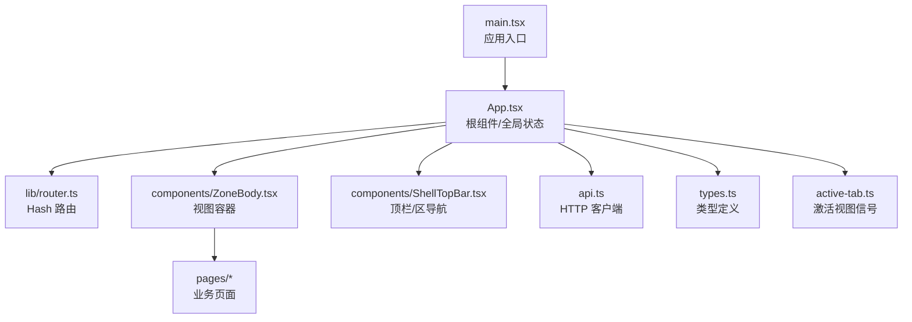
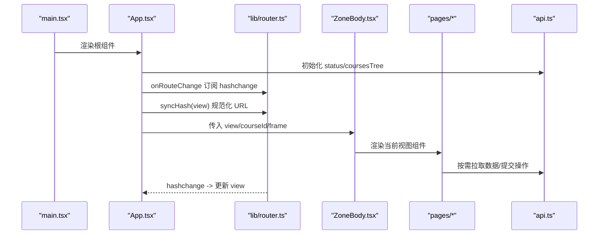
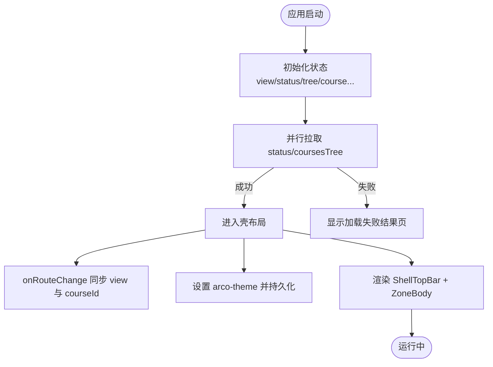
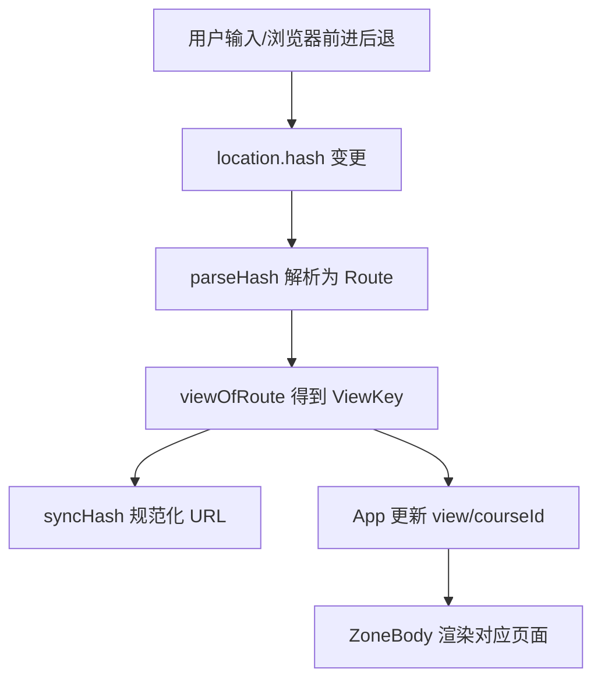
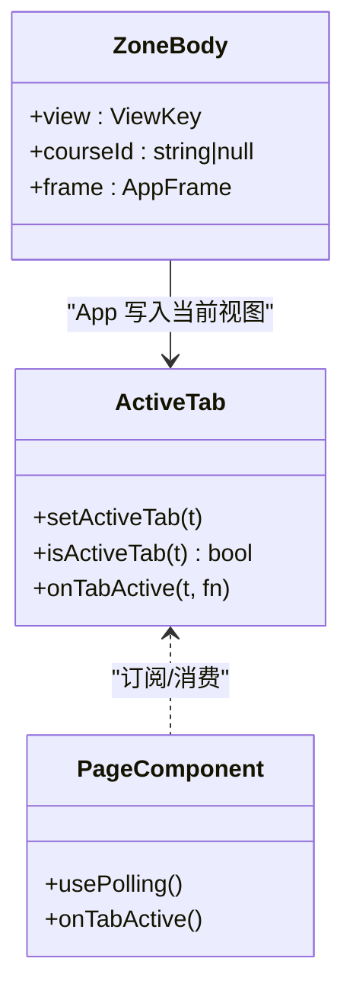
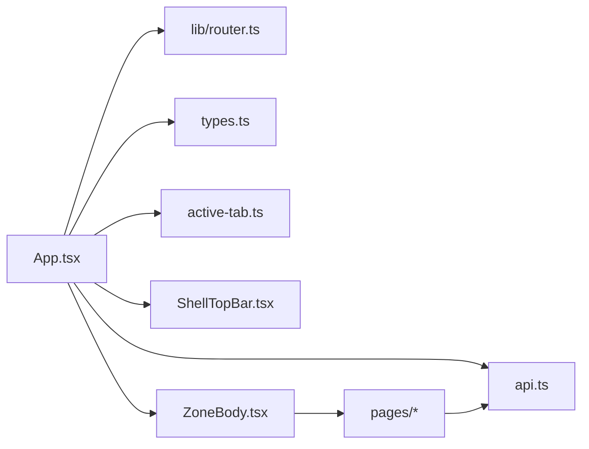

# 应用架构

<cite>
**本文引用的文件**
- [ui/src/main.tsx](file://ui/src/main.tsx)
- [ui/src/App.tsx](file://ui/src/App.tsx)
- [ui/src/lib/router.ts](file://ui/src/lib/router.ts)
- [ui/src/components/ZoneBody.tsx](file://ui/src/components/ZoneBody.tsx)
- [ui/src/components/ShellTopBar.tsx](file://ui/src/components/ShellTopBar.tsx)
- [ui/src/api.ts](file://ui/src/api.ts)
- [ui/src/types.ts](file://ui/src/types.ts)
- [ui/src/active-tab.ts](file://ui/src/active-tab.ts)
- [ui/package.json](file://ui/package.json)
</cite>

## 目录
1. [简介](#简介)
2. [项目结构](#项目结构)
3. [核心组件](#核心组件)
4. [架构总览](#架构总览)
5. [详细组件分析](#详细组件分析)
6. [依赖关系分析](#依赖关系分析)
7. [性能考虑](#性能考虑)
8. [故障排查指南](#故障排查指南)
9. [结论](#结论)
10. [附录：扩展与集成示例](#附录：扩展与集成示例)

## 简介
本文件面向前端（React）应用的整体架构，聚焦以下目标：
- 根组件 App 的职责、初始化流程与全局状态（AppFrame）设计
- 基于 hash 的路由系统实现原理：视图切换、参数段路由、深链直达与历史回退
- 主题切换、错误处理与加载状态的方案
- 如何扩展功能与集成新页面模块

该应用采用“单页 + Hash 路由”的轻量架构，使用 Arco Design 作为 UI 基础库，通过 Vite 构建。数据层统一通过 api 客户端访问宿主提供的 /learnhub/api/* 接口，类型定义集中在 types.ts，路由与视图映射在 lib/router.ts 中集中管理。

## 项目结构
前端代码位于 ui/src 下，关键目录与职责如下：
- main.tsx：应用入口，挂载 React 根节点并配置国际化
- App.tsx：根组件，负责初始化、全局状态、主题、路由桥接与壳布局
- lib/router.ts：Hash 路由核心（解析、跳转、规范化、事件订阅）
- components：通用 UI 容器与壳组件（如 ZoneBody、ShellTopBar）
- pages：各业务页面（今日、课程、洞察、项目、实践等）
- api.ts：统一的 HTTP 客户端，封装所有后端接口调用
- types.ts：UI 侧类型定义，部分从引擎/宿主派生，避免手工镜像
- active-tab.ts：当前激活视图信号，用于保活与轮询门控

图表来源
- [ui/src/main.tsx:1-16](file://ui/src/main.tsx#L1-L16)
- [ui/src/App.tsx:47-179](file://ui/src/App.tsx#L47-L179)
- [ui/src/lib/router.ts:1-164](file://ui/src/lib/router.ts#L1-L164)
- [ui/src/components/ZoneBody.tsx:1-43](file://ui/src/components/ZoneBody.tsx#L1-L43)
- [ui/src/components/ShellTopBar.tsx:1-64](file://ui/src/components/ShellTopBar.tsx#L1-L64)
- [ui/src/api.ts:1-370](file://ui/src/api.ts#L1-L370)
- [ui/src/types.ts:1-93](file://ui/src/types.ts#L1-L93)
- [ui/src/active-tab.ts:1-38](file://ui/src/active-tab.ts#L1-L38)

章节来源
- [ui/src/main.tsx:1-16](file://ui/src/main.tsx#L1-L16)
- [ui/src/App.tsx:47-179](file://ui/src/App.tsx#L47-L179)
- [ui/src/lib/router.ts:1-164](file://ui/src/lib/router.ts#L1-L164)
- [ui/src/components/ZoneBody.tsx:1-43](file://ui/src/components/ZoneBody.tsx#L1-L43)
- [ui/src/components/ShellTopBar.tsx:1-64](file://ui/src/components/ShellTopBar.tsx#L1-L64)
- [ui/src/api.ts:1-370](file://ui/src/api.ts#L1-L370)
- [ui/src/types.ts:1-93](file://ui/src/types.ts#L1-L93)
- [ui/src/active-tab.ts:1-38](file://ui/src/active-tab.ts#L1-L38)

## 核心组件
- 根组件 App：负责应用初始化、全局状态（status/tree/course/lesson/focusNode/focusJob/loading/fatal）、主题切换、路由桥接、无课守卫与壳布局渲染；对外暴露 AppFrame 供子组件共享
- 路由系统 lib/router：维护 zone/sub/workbench 三级路由模型，提供 parseHash/navigate/navigateCourse/syncHash/onRouteChange/viewOfRoute/routeOfView/zoneOfView 等能力
- 视图容器 ZoneBody：按 VIEW_KEYS 列表进行“首次访问后常驻、非激活隐藏”的保活渲染，将 view 映射到具体页面组件
- 顶栏 ShellTopBar：五区页签、课程区子导航、帮助抽屉入口与主题切换按钮
- API 客户端 api：统一封装 /learnhub/api/* 请求，提供强类型方法
- 类型体系 types：集中 UI 类型，部分从引擎/宿主导出类型派生，避免重复维护

章节来源
- [ui/src/App.tsx:17-38](file://ui/src/App.tsx#L17-L38)
- [ui/src/lib/router.ts:24-68](file://ui/src/lib/router.ts#L24-L68)
- [ui/src/components/ZoneBody.tsx:1-43](file://ui/src/components/ZoneBody.tsx#L1-L43)
- [ui/src/components/ShellTopBar.tsx:1-64](file://ui/src/components/ShellTopBar.tsx#L1-L64)
- [ui/src/api.ts:1-370](file://ui/src/api.ts#L1-L370)
- [ui/src/types.ts:1-93](file://ui/src/types.ts#L1-L93)

## 架构总览
整体采用“根组件 + 路由库 + 视图容器 + 页面组件 + API 客户端”的分层模式：
- 入口 main.tsx 挂载 React 根并提供国际化配置
- App 作为根组件，完成数据初始化、主题设置、路由同步与全局状态管理
- lib/router 以 location.hash 为权威源，提供纯函数解析与程序化跳转
- ZoneBody 根据 visited 集合与当前 view 渲染对应页面，支持保活与后台轮询门控
- ShellTopBar 驱动区与子导航切换，触发 navigate/navigateCourse
- api.ts 统一网络层，页面与组件通过它获取/提交数据

图表来源
- [ui/src/main.tsx:11-15](file://ui/src/main.tsx#L11-L15)
- [ui/src/App.tsx:62-117](file://ui/src/App.tsx#L62-L117)
- [ui/src/lib/router.ts:72-164](file://ui/src/lib/router.ts#L72-L164)
- [ui/src/components/ZoneBody.tsx:21-43](file://ui/src/components/ZoneBody.tsx#L21-L43)
- [ui/src/api.ts:43-353](file://ui/src/api.ts#L43-L353)

## 详细组件分析

### 根组件 App：初始化、全局状态与壳布局
- 初始化流程：
  - 读取初始视图键（从 hash 解析）
  - 并行拉取 status 与 coursesTree，填充全局状态，失败时记录 fatal
  - 监听路由变化，同步 view 与 courseId，规范化 URL
  - 设置主题（亮/暗），持久化到 localStorage
- 全局状态 AppFrame：
  - 包含 status、tree、course、lesson、focusNode、focusJob、loading、fatal
  - 提供 setCourse/goto/openCourse/openLesson/closeLesson/locateInGraph/locateJob/reload 等方法
- 壳布局：
  - 顶栏 ShellTopBar 控制区与子导航
  - 无课守卫：对特定视图（如 insight）在无课时显示引导
  - 主体区域 ZoneBody 承载视图渲染

图表来源
- [ui/src/App.tsx:47-179](file://ui/src/App.tsx#L47-L179)

章节来源
- [ui/src/App.tsx:47-179](file://ui/src/App.tsx#L47-L179)

### 路由系统：hash 路由、视图切换与参数传递
- 路由模型：
  - ZoneKey：today/courses/insight/projects/practice
  - CourseSub：home/queue/proposals
  - WorkbenchSub：graph/coach/queue/proposals/bank
  - ViewKey：today/courses.home/courses.queue/courses.proposals/courses.course/insight/projects/practice
- 核心能力：
  - readHash/parseHash：安全读取与解析 hash，支持旧键回落与参数段解码
  - navigate/navigateCourse：程序化跳转，前者用于非参数视图，后者用于单课工作台参数段
  - syncHash：URL 规范化，避免非法形残留
  - onRouteChange：订阅 hashchange，回调视图键
  - viewOfRoute/routeOfView/zoneOfView：视图与路由互转与区归属判断
- 参数段路由：
  - 单课工作台路径 #/course/<id>/，id 经 encodeURIComponent，sub 命中 WORKBENCH_SUBS 否则默认 graph
  - 工作台整体共享视图键 courses.course，分栏切换不改视图键，仅写完整 hash

图表来源
- [ui/src/lib/router.ts:72-164](file://ui/src/lib/router.ts#L72-L164)
- [ui/src/App.tsx:105-117](file://ui/src/App.tsx#L105-L117)

章节来源
- [ui/src/lib/router.ts:1-164](file://ui/src/lib/router.ts#L1-L164)
- [ui/src/App.tsx:105-117](file://ui/src/App.tsx#L105-L117)

### 视图保活与轮询门控
- ZoneBody 维护 visited 集合，首次访问后组件常驻不卸载，非激活视图隐藏但保留状态
- active-tab 模块提供 setActiveTab/isActiveTab/onTabActive，用于：
  - 标记当前激活视图
  - 广播 learnhub:tab 事件，供页面组件在切回时重取数据或补判边沿
- 页面内 usePolling 结合 tab 信号，隐藏视图可跳过取数，仅维持节拍

图表来源
- [ui/src/active-tab.ts:1-38](file://ui/src/active-tab.ts#L1-L38)
- [ui/src/components/ZoneBody.tsx:1-43](file://ui/src/components/ZoneBody.tsx#L1-L43)

章节来源
- [ui/src/active-tab.ts:1-38](file://ui/src/active-tab.ts#L1-L38)
- [ui/src/components/ZoneBody.tsx:1-43](file://ui/src/components/ZoneBody.tsx#L1-L43)

### 主题切换
- 主题状态存储在 App 内部，初始值来自 localStorage 或系统偏好
- 通过设置 document.body 的 arco-theme 属性切换主题，并持久化到 localStorage
- ShellTopBar 提供亮/暗切换按钮，点击触发 onToggleTheme

章节来源
- [ui/src/App.tsx:119-128](file://ui/src/App.tsx#L119-L128)
- [ui/src/components/ShellTopBar.tsx:45-47](file://ui/src/components/ShellTopBar.tsx#L45-L47)

### 错误处理与加载状态
- 初始化阶段：
  - loading=true 时显示 Spin 加载态
  - 若出现致命错误且无 status，显示 Result 错误页并提供重试按钮
- 页面级错误：
  - 通过 useCommand/usePolling 捕获异常，使用 Message.error 提示
  - 次要数据失败按空处理，避免整页崩溃
- API 层错误：
  - ApiError 携带 HTTP 状态码与消息体中的 error 字段

章节来源
- [ui/src/App.tsx:62-79](file://ui/src/App.tsx#L62-L79)
- [ui/src/App.tsx:130-140](file://ui/src/App.tsx#L130-L140)
- [ui/src/api.ts:7-32](file://ui/src/api.ts#L7-L32)

## 依赖关系分析
- 构建与运行时依赖：
  - React 18、Arco Design Web React、Vite、TypeScript
  - 可视化与数学库：@xyflow/react、echarts、mathjs、katex、mermaid 等
- 模块耦合：
  - App 依赖 router、api、types、active-tab、ShellTopBar、ZoneBody
  - ZoneBody 依赖 VIEW_KEYS 与页面组件
  - 页面组件依赖 api 与 hooks（useCommand/usePolling）
  - 路由库独立于 DOM，readHash/onRouteChange 薄绑定 window

图表来源
- [ui/src/App.tsx:47-179](file://ui/src/App.tsx#L47-L179)
- [ui/src/lib/router.ts:1-164](file://ui/src/lib/router.ts#L1-L164)
- [ui/src/api.ts:1-370](file://ui/src/api.ts#L1-L370)
- [ui/src/types.ts:1-93](file://ui/src/types.ts#L1-L93)
- [ui/src/active-tab.ts:1-38](file://ui/src/active-tab.ts#L1-L38)
- [ui/src/components/ZoneBody.tsx:1-43](file://ui/src/components/ZoneBody.tsx#L1-L43)

章节来源
- [ui/package.json:1-48](file://ui/package.json#L1-L48)
- [ui/src/App.tsx:47-179](file://ui/src/App.tsx#L47-L179)

## 性能考虑
- 并行初始化：status 与 coursesTree 使用 Promise.all 并行拉取，减少首屏等待
- 视图保活：ZoneBody 避免频繁卸载/挂载，降低重建成本
- 轮询门控：active-tab 与 usePolling 配合，隐藏视图跳过取数，降低无效请求
- 路由规范化：syncHash 仅在漂移时 replaceState，避免多余历史条目
- 资源优化：按需引入 Arco 图标与样式，利用 Vite tree-shake

[本节为通用指导，不直接分析具体文件]

## 故障排查指南
- 加载失败：
  - 检查 api.status 与 api.coursesTree 是否返回正常
  - 查看 App 的 fatal 状态与 Result 提示
- 路由异常：
  - 确认 hash 格式是否符合规范，必要时手动修正
  - 检查 onRouteChange 是否正确订阅与同步
- 页面数据为空：
  - 检查 useCommand/usePolling 的错误分支与重试逻辑
  - 确认 active-tab 信号与页面 tab 标识一致
- 主题未生效：
  - 检查 document.body.arco-theme 属性与 localStorage 存储值

章节来源
- [ui/src/App.tsx:62-79](file://ui/src/App.tsx#L62-L79)
- [ui/src/App.tsx:130-140](file://ui/src/App.tsx#L130-L140)
- [ui/src/lib/router.ts:149-164](file://ui/src/lib/router.ts#L149-L164)
- [ui/src/api.ts:7-32](file://ui/src/api.ts#L7-L32)

## 结论
本应用以 App 为根，围绕 Hash 路由与视图保活构建轻量而可扩展的前端架构。通过集中式路由库、统一 API 客户端与类型派生策略，实现了清晰的职责边界与良好的可维护性。主题切换、错误处理与加载状态提供了稳定的用户体验。未来可通过新增页面与扩展路由表快速集成新功能。

[本节为总结，不直接分析具体文件]

## 附录：扩展与集成示例
- 新增页面模块
  - 在 pages 目录下创建新页面组件（例如 NewPage/index.tsx）
  - 在 ZoneBody 中添加视图映射，将其纳入渲染分支
  - 如需加入顶栏或子导航，更新 ShellTopBar 与路由常量（ZONE_KEYS/COURSE_SUBS/WORKBENCH_SUBS）
  - 在 lib/router.ts 中补充视图键与解析规则，确保 navigate/navigateCourse 可用
- 集成新 API
  - 在 api.ts 中新增方法，封装 /learnhub/api/* 请求
  - 在 types.ts 中声明响应类型（可从引擎/宿主类型派生）
  - 在页面中使用 useCommand/usePolling 调用并处理错误
- 路由与参数
  - 使用 navigate 跳转非参数视图
  - 使用 navigateCourse(courseId, wb) 进入单课工作台参数段
  - 通过 parseHash/readHash 在组件内读取当前路由上下文
- 主题与国际化
  - 通过 App 的主题状态切换 arco-theme
  - 在 main.tsx 中已配置中文语言包，可按需扩展

章节来源
- [ui/src/components/ZoneBody.tsx:21-43](file://ui/src/components/ZoneBody.tsx#L21-L43)
- [ui/src/components/ShellTopBar.tsx:13-17](file://ui/src/components/ShellTopBar.tsx#L13-L17)
- [ui/src/lib/router.ts:24-68](file://ui/src/lib/router.ts#L24-L68)
- [ui/src/lib/router.ts:136-143](file://ui/src/lib/router.ts#L136-L143)
- [ui/src/api.ts:43-353](file://ui/src/api.ts#L43-L353)
- [ui/src/types.ts:1-93](file://ui/src/types.ts#L1-L93)
- [ui/src/main.tsx:7-15](file://ui/src/main.tsx#L7-L15)