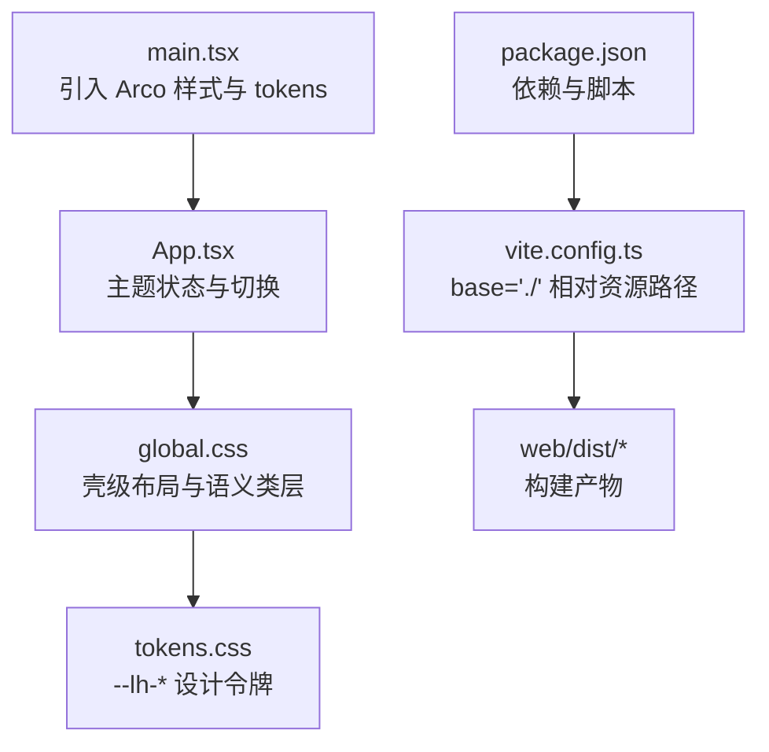
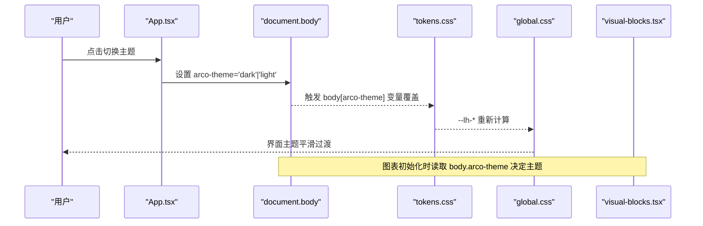
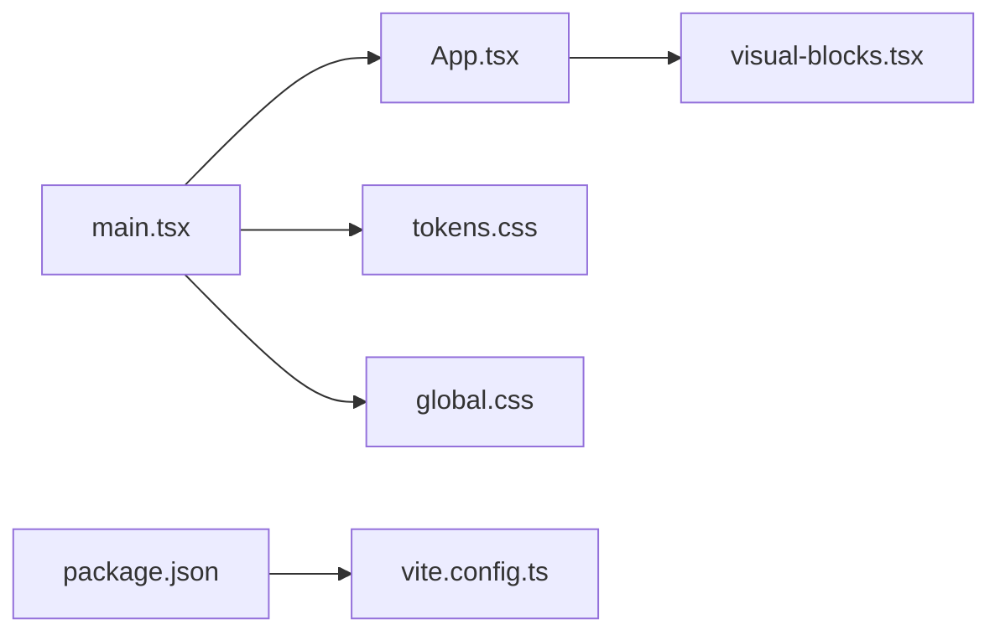

# 样式与主题

<cite>
**本文引用的文件**
- [ui/src/global.css](file://ui/src/global.css)
- [ui/src/tokens.css](file://ui/src/tokens.css)
- [ui/src/main.tsx](file://ui/src/main.tsx)
- [ui/src/App.tsx](file://ui/src/App.tsx)
- [ui/vite.config.ts](file://ui/vite.config.ts)
- [ui/package.json](file://ui/package.json)
- [ui/src/components/visual-blocks.tsx](file://ui/src/components/visual-blocks.tsx)
- [tests/ui-budget.test.ts](file://tests/ui-budget.test.ts)
- [src/host/static.ts](file://src/host/static.ts)
</cite>

## 目录
1. [简介](#简介)
2. [项目结构](#项目结构)
3. [核心组件](#核心组件)
4. [架构总览](#架构总览)
5. [详细组件分析](#详细组件分析)
6. [依赖关系分析](#依赖关系分析)
7. [性能考虑](#性能考虑)
8. [故障排查指南](#故障排查指南)
9. [结论](#结论)
10. [附录](#附录)

## 简介
本文件面向学习插件的前端面板，系统化说明其样式与主题体系：从设计令牌（tokens）、全局样式、语义类层到明暗主题切换机制；并给出响应式原则、移动端适配策略、样式性能优化方法、主题定制与覆盖最佳实践，以及调试工具使用建议。目标是让读者在不深入源码的情况下也能正确扩展与维护样式系统。

## 项目结构
面板的样式与主题由“Arco Design 基础样式 + 自定义 token 层 + 全局语义类”三层构成，构建产物通过 Vite 输出至宿主可访问路径。

图示来源
- [ui/src/main.tsx:1-16](file://ui/src/main.tsx#L1-L16)
- [ui/src/App.tsx:119-128](file://ui/src/App.tsx#L119-L128)
- [ui/src/global.css:1-18](file://ui/src/global.css#L1-L18)
- [ui/src/tokens.css:1-63](file://ui/src/tokens.css#L1-L63)
- [ui/vite.config.ts:4-14](file://ui/vite.config.ts#L4-L14)
- [ui/package.json:6-11](file://ui/package.json#L6-L11)

章节来源
- [ui/src/main.tsx:1-16](file://ui/src/main.tsx#L1-L16)
- [ui/src/App.tsx:119-128](file://ui/src/App.tsx#L119-L128)
- [ui/src/global.css:1-18](file://ui/src/global.css#L1-L18)
- [ui/src/tokens.css:1-63](file://ui/src/tokens.css#L1-L63)
- [ui/vite.config.ts:4-14](file://ui/vite.config.ts#L4-L14)
- [ui/package.json:6-11](file://ui/package.json#L6-L11)

## 核心组件
- 设计令牌层（tokens.css）
  - 定义间距、字号阶梯、圆角、动效与亮/暗主题下的语义面（背景、表面、边框、文本、强调色等）。
  - 以 body 作用域声明 --lh-*，确保在 Arco 变量随 arco-theme 切换时能正确重算。
- 全局样式与语义类层（global.css）
  - 壳级布局（app-shell、shell-topbar、app-body 等）全部消费 --lh-*。
  - 语义 class 层（.lh-*）提供统一词汇表：文本、布局、尺寸、卡片、引用块等，静态样式集中管理。
  - 内容排版（.md-body）针对阅读体验进行限宽、行高、代码块、表格、公式等优化。
- 主题切换（App.tsx）
  - 维护 theme 状态（light/dark），写入 document.body.arco-theme，并持久化到 localStorage。
  - 首次加载遵循系统偏好（prefers-color-scheme）。
- 图表主题联动（visual-blocks.tsx）
  - 根据 body.arco-theme 动态选择 ECharts 主题，保证图表与面板主题一致。
- 构建与资源路径（vite.config.ts）
  - base 设为 './'，使构建产物以相对路径引用，适配宿主 /learnhub/* 前缀部署。
- 测试与纪律门（ui-budget.test.ts）
  - 强制壳级规则只消费 --lh-*，禁止硬编码色值与静态内联样式；页面内联 style 仅允许动态值。

章节来源
- [ui/src/tokens.css:1-63](file://ui/src/tokens.css#L1-L63)
- [ui/src/global.css:1-18](file://ui/src/global.css#L1-L18)
- [ui/src/global.css:196-398](file://ui/src/global.css#L196-L398)
- [ui/src/App.tsx:119-128](file://ui/src/App.tsx#L119-L128)
- [ui/src/components/visual-blocks.tsx:268-280](file://ui/src/components/visual-blocks.tsx#L268-L280)
- [ui/vite.config.ts:4-14](file://ui/vite.config.ts#L4-L14)
- [tests/ui-budget.test.ts:139-158](file://tests/ui-budget.test.ts#L139-L158)

## 架构总览
面板样式采用“令牌驱动 + 语义类 + 壳级约束”的架构，主题切换通过 Arco 的 arco-theme 属性实现，所有颜色与尺度均经由 --lh-* 抽象，避免硬编码色值扩散。

图示来源
- [ui/src/App.tsx:119-128](file://ui/src/App.tsx#L119-L128)
- [ui/src/tokens.css:16-63](file://ui/src/tokens.css#L16-L63)
- [ui/src/global.css:11-28](file://ui/src/global.css#L11-L28)
- [ui/src/components/visual-blocks.tsx:268-280](file://ui/src/components/visual-blocks.tsx#L268-L280)

## 详细组件分析

### 令牌层（tokens.css）
- 职责
  - 统一间距（4px 基尺）、字号阶梯、圆角、动效时长。
  - 亮/暗主题下语义面映射到 Arco 调色板变量，阴影等缺失项补充。
- 关键约定
  - 所有壳级样式必须消费 --lh-*，禁止直接写死色值。
  - 将 token 定义放在 body 而非 :root，确保主题切换时 var() 能在声明处正确替换。

章节来源
- [ui/src/tokens.css:1-63](file://ui/src/tokens.css#L1-L63)

### 全局样式与语义类层（global.css）
- 壳级布局
  - app-shell、shell-topbar、shell-subnav、app-body 等容器使用 --lh-* 控制背景、边框、间距与过渡。
- 内容排版
  - .md-body 限定阅读宽度、标题层级、段落间距、代码块、表格、公式与媒体滚动行为。
- 语义类族
  - 文本（.lh-muted/.lh-strong/.lh-t-*）、布局（.lh-flex/.lh-col/.lh-row/.lh-gap-*）、尺寸（.lh-w-*/*.h-*）、面与卡（.lh-card/.lh-surface-*）、提示与引用（.lh-callout-*/.lh-quote-*）等。
- 动画与反馈
  - 生成任务定位闪烁动画、图节点工具条显隐等。

章节来源
- [ui/src/global.css:1-18](file://ui/src/global.css#L1-L18)
- [ui/src/global.css:89-185](file://ui/src/global.css#L89-L185)
- [ui/src/global.css:196-398](file://ui/src/global.css#L196-L398)

### 主题切换机制（App.tsx）
- 初始主题
  - 优先读取 localStorage 中 learnhub-theme，否则跟随系统 prefers-color-scheme。
- 切换流程
  - 更新 state -> 设置 document.body.arco-theme -> 持久化到 localStorage。
- 影响范围
  - Arco 组件自动跟随主题；自定义 --lh-* 在 tokens.css 中按主题覆盖；图表通过读取 body.arco-theme 同步主题。

章节来源
- [ui/src/App.tsx:119-128](file://ui/src/App.tsx#L119-L128)
- [ui/src/components/visual-blocks.tsx:268-280](file://ui/src/components/visual-blocks.tsx#L268-L280)

### 图表主题联动（visual-blocks.tsx）
- 按需加载 ECharts 模块，减少首屏体积。
- 初始化时检测 body.arco-theme，若为 dark 则传入 'dark' 主题，否则默认主题。
- 监听容器尺寸变化自动 resize，避免图表变形。

章节来源
- [ui/src/components/visual-blocks.tsx:268-280](file://ui/src/components/visual-blocks.tsx#L268-L280)

### 构建与资源路径（vite.config.ts）
- base 设置为 './'，确保构建产物中的资源引用为相对路径，适配宿主 /learnhub/* 前缀。
- 输出目录 ../web/dist，开启空目录清理与 chunk 大小警告限制。

章节来源
- [ui/vite.config.ts:4-14](file://ui/vite.config.ts#L4-L14)

### 样式纪律与测试门（ui-budget.test.ts）
- 壳级视觉纪律：壳级规则与组件只能消费 --lh-*，禁止硬编码色值。
- 内联样式门：页面内联 style 仅允许动态值（如进度条宽度、数据着色），静态样式必须迁移到 global.css 的语义类层。
- 双向对账：className 引用必须在 global.css 有定义；global.css 选择器名必须合法（仅小写字母、数字与连字符）。

章节来源
- [tests/ui-budget.test.ts:139-158](file://tests/ui-budget.test.ts#L139-L158)

## 依赖关系分析
- main.tsx 引入 Arco 样式与 tokens.css，再挂载 App。
- App 管理主题状态并传递给 ShellTopBar 等壳组件。
- global.css 作为全局样式入口，被应用整体消费。
- visual-blocks 在运行时读取主题状态以配置图表。
- vite.config.ts 控制构建产物路径与打包策略。

图示来源
- [ui/src/main.tsx:1-16](file://ui/src/main.tsx#L1-L16)
- [ui/src/App.tsx:119-128](file://ui/src/App.tsx#L119-L128)
- [ui/src/components/visual-blocks.tsx:268-280](file://ui/src/components/visual-blocks.tsx#L268-L280)
- [ui/vite.config.ts:4-14](file://ui/vite.config.ts#L4-L14)
- [ui/package.json:6-11](file://ui/package.json#L6-L11)

章节来源
- [ui/src/main.tsx:1-16](file://ui/src/main.tsx#L1-L16)
- [ui/src/App.tsx:119-128](file://ui/src/App.tsx#L119-L128)
- [ui/src/components/visual-blocks.tsx:268-280](file://ui/src/components/visual-blocks.tsx#L268-L280)
- [ui/vite.config.ts:4-14](file://ui/vite.config.ts#L4-L14)
- [ui/package.json:6-11](file://ui/package.json#L6-L11)

## 性能考虑
- CSS 模块化与集中化
  - 将静态样式收敛到 global.css 的语义类层，避免分散的内联样式，提升可维护性与缓存命中。
- 按需加载
  - 图表库（ECharts）按需 import，仅在需要时加载模块，降低首屏体积。
- 构建优化
  - Vite 构建启用 chunkSizeWarningLimit，避免过大包；base 设为相对路径，减少跨域与路径解析开销。
- 主题切换性能
  - 通过 CSS 变量与 transition 实现平滑过渡，避免重绘抖动。
- 安全与隔离
  - 交互件通过 CSP 限制外联资源，避免不必要的外部请求。

章节来源
- [ui/src/components/visual-blocks.tsx:268-280](file://ui/src/components/visual-blocks.tsx#L268-L280)
- [ui/vite.config.ts:4-14](file://ui/vite.config.ts#L4-L14)
- [src/host/static.ts:125-133](file://src/host/static.ts#L125-L133)

## 故障排查指南
- 主题不生效
  - 检查 document.body 是否设置了正确的 arco-theme；确认 tokens.css 中对应主题变量已覆盖。
- 图表主题不一致
  - 确认 visual-blocks 初始化时读取了最新的 body.arco-theme；必要时在主题切换后触发图表 resize。
- 样式未生效或报错
  - 检查 className 是否在 global.css 中定义；确认选择器命名符合规范（仅小写字母、数字与连字符）。
- 构建产物路径错误
  - 确认 vite.config.ts 的 base 与 outDir 配置与宿主部署路径匹配。
- 安全策略拦截
  - 交互件受 CSP 限制，确保资源域名在白名单内或使用相对路径。

章节来源
- [ui/src/App.tsx:119-128](file://ui/src/App.tsx#L119-L128)
- [ui/src/components/visual-blocks.tsx:268-280](file://ui/src/components/visual-blocks.tsx#L268-L280)
- [tests/ui-budget.test.ts:139-158](file://tests/ui-budget.test.ts#L139-L158)
- [ui/vite.config.ts:4-14](file://ui/vite.config.ts#L4-L14)
- [src/host/static.ts:125-133](file://src/host/static.ts#L125-L133)

## 结论
该样式与主题体系通过 tokens 抽象、语义类层与严格的视觉纪律，实现了可维护、可扩展且高性能的面板外观。主题切换基于 Arco 的主题属性与 CSS 变量，图表与内容排版均能自适应明暗模式。配合构建优化与安全策略，整体具备良好的工程化水平与用户体验。

## 附录

### 主题定制指南
- 新增主题色
  - 在 tokens.css 中扩展 --lh-* 语义别名，并在 global.css 的语义类层中使用这些变量。
- 覆盖默认主题
  - 通过覆盖 body[arco-theme='dark'] 下的 --lh-* 或 Arco 变量，实现暗色主题微调。
- 组件样式覆盖
  - 优先使用语义类；如需覆盖第三方组件，尽量通过外层容器类名限定作用域，避免全局污染。

章节来源
- [ui/src/tokens.css:16-63](file://ui/src/tokens.css#L16-L63)
- [ui/src/global.css:196-398](file://ui/src/global.css#L196-L398)

### 响应式设计与移动端适配
- 阅读排版
  - .md-body 限制最大宽度，保障可读性；媒体与公式区域支持横向滚动。
- 网格与弹性布局
  - 使用 lh-grid-cards/lh-grid-stats 等语义类实现自适应网格；flex 与 gap 组合适应不同屏幕。
- 视口高度适配
  - 图容器使用 calc(100vh - ...) 确保画布高度稳定，避免折叠。

章节来源
- [ui/src/global.css:126-132](file://ui/src/global.css#L126-L132)
- [ui/src/global.css:371-377](file://ui/src/global.css#L371-L377)

### 样式性能优化清单
- 静态样式一律走语义类层，避免内联样式。
- 按需加载重型库（如图表）。
- 使用 CSS 变量与 transition 实现主题切换与交互动效。
- 构建阶段启用 chunk 大小告警，及时拆分大依赖。

章节来源
- [tests/ui-budget.test.ts:139-158](file://tests/ui-budget.test.ts#L139-L158)
- [ui/src/components/visual-blocks.tsx:268-280](file://ui/src/components/visual-blocks.tsx#L268-L280)
- [ui/vite.config.ts:4-14](file://ui/vite.config.ts#L4-L14)

### 调试工具使用方法
- 浏览器开发者工具
  - 检查 document.body 的 arco-theme 属性；查看 computed 样式中 --lh-* 的值是否正确。
- 控制台断点
  - 在主题切换逻辑处打断点，验证 localStorage 读写与 body 属性设置。
- 图表调试
  - 在 visual-blocks 初始化前后打印 option 与主题参数，确认 dark 主题传递正确。
- 构建产物检查
  - 打开 web/dist 下的资源，确认引用路径为相对路径且未被篡改。

章节来源
- [ui/src/App.tsx:119-128](file://ui/src/App.tsx#L119-L128)
- [ui/src/components/visual-blocks.tsx:268-280](file://ui/src/components/visual-blocks.tsx#L268-L280)
- [ui/vite.config.ts:4-14](file://ui/vite.config.ts#L4-L14)